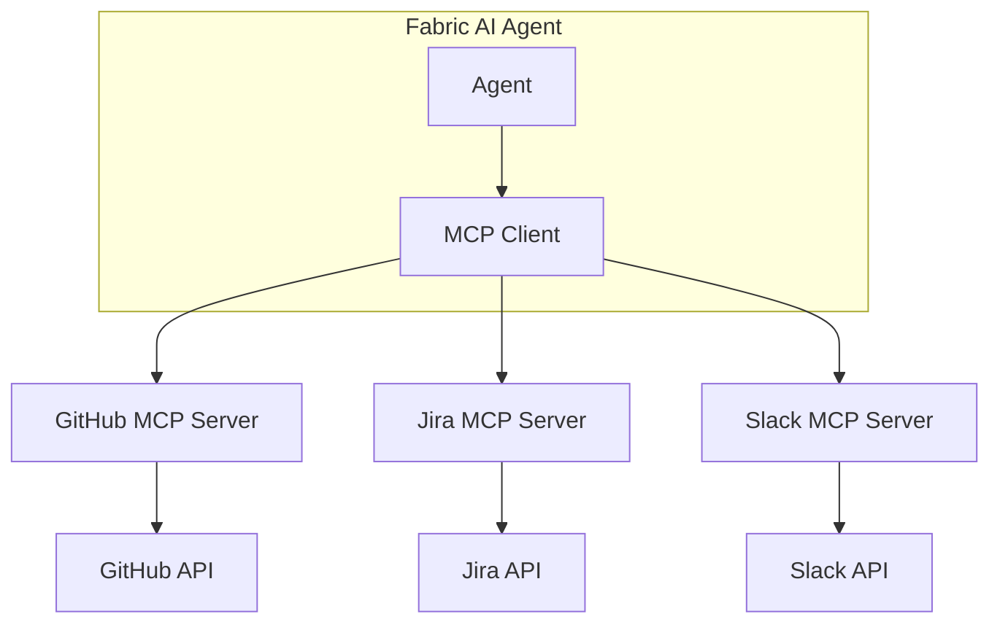
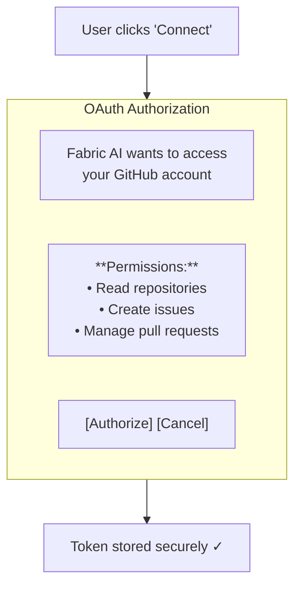
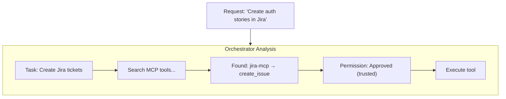
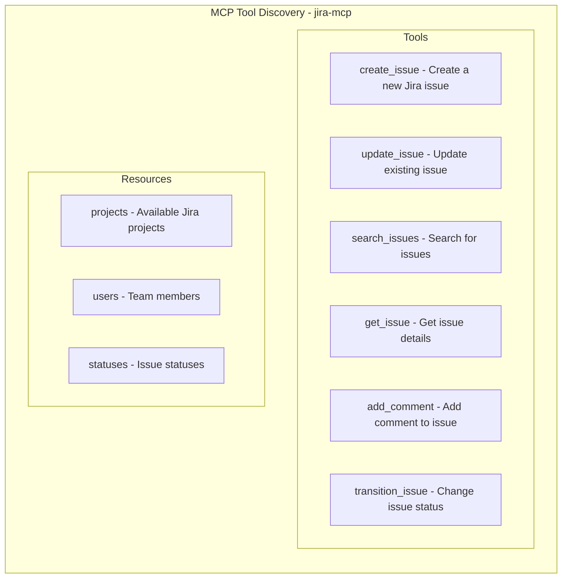
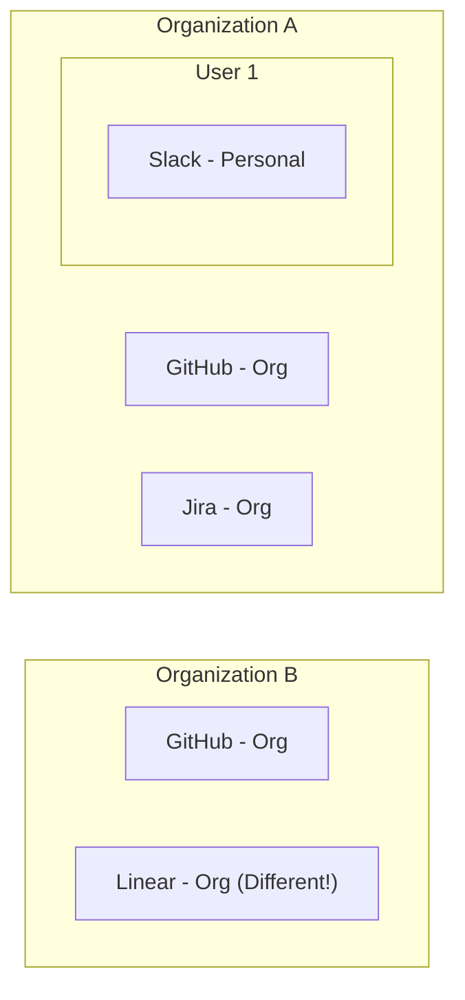
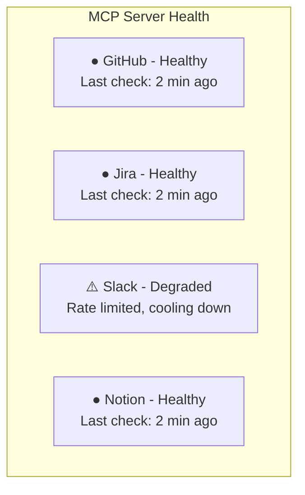

The Model Context Protocol (MCP) enables Fabric AI agents to interact with external tools and services. Connect to GitHub, Jira, Slack, Notion, and dozens of other tools to automate your workflows.

<Callout type="info">
**Want to use Fabric from Claude Desktop, Cursor, or VS Code?** See [Fabric MCP Gateway](/docs/integrations/mcp-gateway) — it lets you access all your Fabric projects, documents, workspaces, and connected tools from any MCP client through a single URL.
</Callout>

<Callout type="warning">
**Security First:** Fabric implements multiple security layers for MCP servers including encrypted credentials, runtime authority with human approval, and destructive tool blocking. See [MCP Authority & Security](/docs/core-concepts/mcp-authority) for details.
</Callout>

## What is MCP?

**MCP (Model Context Protocol)** is an open standard that allows AI models to interact with external tools and data sources in a standardized way.



## Benefits

### For Users
- Natural language commands to control external tools
- No need to switch between applications
- Automated workflows across multiple services

### For Agents
- Standardized tool discovery
- Consistent authentication
- Error handling built-in

## Available MCP Servers

Fabric includes a registry of tested, pre-configured MCP servers:

### Development & Collaboration

| Server | Capabilities |
|--------|--------------|
| **GitHub** | Issues, PRs, repositories, code search |
| **GitLab (Official)** | Issues, merge requests, projects — via GitLab's official MCP server (Premium/Ultimate) |
| **Atlassian (Jira & Confluence)** | Jira tickets, sprints, and boards; Confluence pages and spaces |
| **Azure DevOps** | Work items, boards, repositories, pipelines |
| **Fizzy** | Cards and project boards |

<Callout type="info">
The **Atlassian (Jira & Confluence)** server uses Atlassian's official Rovo MCP server. One OAuth connection unlocks both Jira tickets and Confluence pages.
</Callout>

### Communication

| Server | Capabilities |
|--------|--------------|
| **Slack** | Messages, channels, threads |

### Knowledge & Docs

| Server | Capabilities |
|--------|--------------|
| **Notion** | Pages, databases, blocks |
| **Google Drive** | Files, folders, documents |

### Diagramming

| Server | Capabilities |
|--------|--------------|
| **Excalidraw** | Create and edit diagrams |

### Fabric

| Server | Capabilities |
|--------|--------------|
| **Fabric** | Access your own Fabric projects, documents, and workspaces from any agent or MCP client |

<Callout type="info">
Don't see the service you need? You can also add your own **custom MCP servers** — see [Creating Custom MCP Servers](#creating-custom-mcp-servers) below.
</Callout>

## Setting Up MCP Servers

<Steps>
  <Step>
    ### Navigate to Settings

    Go to **Settings → MCP Servers**.
  </Step>

  <Step>
    ### Browse Registry

    Click **Add Server** to see available servers in the registry.
  </Step>

  <Step>
    ### Select a Server

    Choose the server you want to connect (e.g., GitHub).
  </Step>

  <Step>
    ### Authenticate

    Depending on the server, you'll authenticate via:
    
    **OAuth (Recommended)**
    1. Click "Connect with OAuth"
    2. Authorize in popup window
    3. Tokens stored automatically
    
    **API Key**
    1. Get API key from the service
    2. Paste into Fabric
    3. Click "Save"
  </Step>

  <Step>
    ### Test Connection

    Click **Test Connection** to verify it works.
  </Step>

  <Step>
    ### Enable Server

    Toggle the server to **Enabled**. It's now available for agents.
  </Step>
</Steps>

## Authentication Methods

### OAuth 2.0 (Recommended)

For servers that support OAuth:

1. **Discovery** — Fabric finds OAuth endpoints automatically
2. **DCR** — Dynamic Client Registration if supported
3. **Authorization** — User authorizes in popup
4. **Token Storage** — Tokens encrypted and stored securely
5. **Auto-refresh** — Tokens refresh automatically



### API Key

For servers that use API keys:

1. Get key from service dashboard
2. Paste into Fabric settings
3. Key is encrypted before storage
4. Key is decrypted only when needed

### No Authentication

Some servers work without authentication:
- Public search APIs
- Open data sources
- Local development servers

## Using MCP Tools

### In Conversations

Simply ask the agent to use a connected tool:

```
"Create a GitHub issue for the login bug we discussed"

"Post a summary of this PRD to the #engineering Slack channel"

"Create Jira stories from the user requirements above"
```

### With the Orchestrator

The Orchestrator automatically discovers and uses MCP tools:



### Tool Discovery

Agents discover tools automatically:



## Multi-Tenant Security

MCP connections are scoped per user/organization:

### Personal Connections

- Connect your personal GitHub account
- Only you can use these connections
- Isolated from organization connections

### Organization Connections

- Connect organization accounts (e.g., company Jira)
- All organization members can use
- Managed by organization admins

### Isolation



## Transport Types

MCP servers communicate via different transports:

### SSE (Server-Sent Events)

- Real-time streaming
- Best for long-running operations
- Used by most cloud servers

### HTTP

- Standard request/response
- Simple and reliable
- Good for simple operations

### STDIO

- Local process communication
- Used for development
- Self-hosted servers

## Health Monitoring

Fabric monitors MCP server health:



### Automatic Recovery

- **Rate limits** — Automatic backoff and retry
- **Token expiry** — Auto-refresh OAuth tokens
- **Server down** — Queue requests, retry later
- **Failover** — Use alternative servers if configured

## Creating Custom MCP Servers

For custom integrations, create your own MCP server:

### Server Requirements

- Implement MCP protocol
- Expose tool definitions
- Handle authentication
- Return structured responses

### Registration

1. Go to **Settings → MCP Servers → Add Custom**
2. Enter server URL
3. Configure authentication
4. Test and enable

---

## Next Steps

<Cards>
  <Card title="Fabric MCP Gateway" href="/docs/integrations/mcp-gateway">
    Use Fabric as an MCP server from Claude Desktop, Cursor, or any MCP client
  </Card>
  <Card title="MCP Authority & Security" href="/docs/core-concepts/mcp-authority">
    Complete security guide: credentials, authority, stake levels, and audit
  </Card>
  <Card title="Runtime Authority" href="/docs/core-concepts/runtime-authority">
    How agents get human-approved, time-limited access to connected tools
  </Card>
  <Card title="Agents Overview" href="/docs/agents/overview">
    Learn how agents use MCP tools
  </Card>
  <Card title="Orchestrator" href="/docs/agents/orchestrator">
    See MCP tools in multi-step workflows
  </Card>
</Cards>
