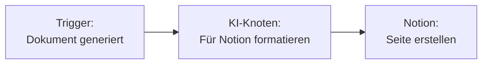
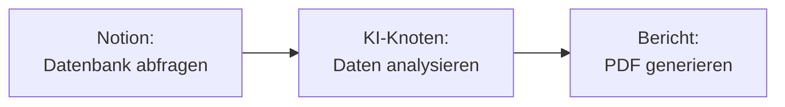

Verbinden Sie Notion mit Fabric AI, damit Agenten und Workflows Ihren Workspace durchsuchen, Seiteninhalte lesen, Datenbanken abfragen und Seiten erstellen können — alles als Live-Laufzeit-Aktionen.

## Integrationsmethoden

| Methode | Anwendungsfall | Auth |
|--------|----------|------|
| **MCP-Server** | KI-Chat- & Agenten-Aktionen auf Notion (suchen, lesen, erstellen) | OAuth oder API-Schlüssel |
| **Workflow-Plugin** | Seiten in Workflow-Knoten erstellen und aktualisieren | API-Schlüssel |

## Notion einrichten

### Für Chat & Agenten

<Steps>
  <Step>
    ### Notion unter Integrationen öffnen

    Gehen Sie zu **Einstellungen → Integrationen** und öffnen Sie die **Notion**-Karte.
  </Step>

  <Step>
    ### Verbinden

    Klicken Sie auf **Verbinden** und autorisieren Sie Fabric AI im Popup (OAuth), oder geben Sie ein Notion-Integrations-Token an. Verwenden Sie dann **Aktionen verwalten**, um zu sehen, was Notion kann.
  </Step>

  <Step>
    ### Bestätigen

    Der Anbieter zeigt **Verbunden** zusammen mit seinen verfügbaren Laufzeit-Aktionen. Notion ist ein **Hybrid**-Anbieter — er bietet sowohl Wissens- (Lese-) als auch Schreib-Aktionen.
  </Step>
</Steps>

### Als Workflow-Plugin

<Steps>
  <Step>
    ### Einen Notion API-Schlüssel erhalten

    1. Gehen Sie zu [notion.so/my-integrations](https://www.notion.so/my-integrations)
    2. Klicken Sie auf **Neue Integration**
    3. Benennen Sie sie (z. B. „Fabric AI")
    4. Wählen Sie Ihren Workspace
    5. Kopieren Sie das **Interne Integrations-Token**
  </Step>

  <Step>
    ### Seiten mit der Integration teilen

    Öffnen Sie in Notion die Seiten, auf die Fabric zugreifen soll, und klicken Sie auf **Teilen → Einladen** → wählen Sie Ihre Integration.
  </Step>

  <Step>
    ### Im Workflow-Builder konfigurieren

    Fügen Sie einen Notion-Knoten im Workflow-Builder hinzu und fügen Sie Ihren API-Schlüssel ein.
  </Step>
</Steps>

## Verfügbare Aktionen

Notion stellt Agenten und Workflows diese Laufzeit-Aktionen bereit:

| Aktion | Typ | Beschreibung |
|--------|------|-------------|
| **Search Notion** | Wissen | Seiten und Datenbanken in Notion durchsuchen |
| **Get Page Content** | Wissen | Den Inhalt einer Notion-Seite abrufen |
| **Query Database** | Wissen | Eine Notion-Datenbank abfragen |
| **Create Page** | Aktion | Eine neue Seite erstellen |
| **Update Page** | Aktion | Vorhandenen Seiteninhalt aktualisieren |

### Im KI-Chat

```
"Was sagt unser Notion-Wiki über den Deployment-Prozess?"

"Fasse die Produkt-Roadmap von Notion zusammen"

"Finde die API-Dokumentationsseite in unserem Notion-Workspace"
```

Der Agent ruft Notions Wissens-Aktionen live auf, um zu antworten — keine vorherige Synchronisierung erforderlich.

## Häufige Workflow-Muster

### Dokument zu Notion



### Notion-Daten zu Bericht



## Mehrere Workspaces

Sie können mehrere Notion-Workspaces verbinden:

- Jede Verbindung verfolgt ihre Workspace-ID und ihren Namen
- Wählen Sie die entsprechende Verbindung, wenn Sie Knoten konfigurieren
- Verbindungen sind nach Benutzer- oder Organisationskontext isoliert

## Fehlerbehebung

### „Objekt nicht gefunden"-Fehler
- Stellen Sie sicher, dass die Integration in Notion zur Zielseite eingeladen wurde
- Überprüfen Sie, ob die Seiten- oder Datenbank-ID korrekt ist

### OAuth-Verbindung abgelaufen
- Fabric erneuert Tokens automatisch. Bei anhaltenden Problemen verbinden Sie sich über **Einstellungen → Integrationen** neu

---

## Nächste Schritte

<Cards>
  <Card title="MCP-Integration" href="/docs/integrations/mcp">
    Wie verbundene Tools zur Laufzeit aufgerufen werden
  </Card>
  <Card title="KI-Chat" href="/docs/features/ai-chat">
    Notion in KI-Gesprächen nutzen
  </Card>
</Cards>
