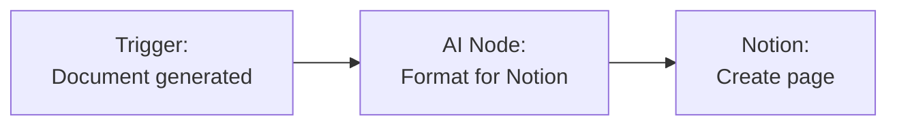
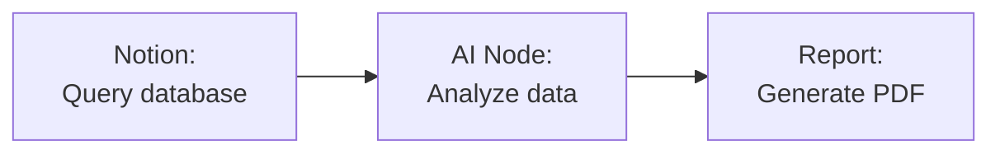

Connect Notion to Fabric AI so agents and workflows can search your workspace, read page content, query databases, and create pages — all as live runtime actions.

## Integration Methods

| Method | Use Case | Auth |
|--------|----------|------|
| **MCP Server** | AI chat & agent actions on Notion (search, read, create) | OAuth or API Key |
| **Workflow Plugin** | Create and update pages in workflow nodes | API Key |

## Setting Up Notion

### For chat & agents

<Steps>
  <Step>
    ### Open Notion under Integrations

    Go to **Settings → Integrations** and open the **Notion** card.
  </Step>

  <Step>
    ### Connect

    Click **Connect** and authorize Fabric AI in the popup (OAuth), or provide a Notion integration token. Then use **Manage Actions** to review what Notion can do.
  </Step>

  <Step>
    ### Confirm

    The provider shows **Connected** along with its available runtime actions. Notion is a **Hybrid** provider — it offers both knowledge (read) and write actions.
  </Step>
</Steps>

### As a Workflow Plugin

<Steps>
  <Step>
    ### Get a Notion API Key

    1. Go to [notion.so/my-integrations](https://www.notion.so/my-integrations)
    2. Click **New Integration**
    3. Name it (e.g., "Fabric AI")
    4. Select your workspace
    5. Copy the **Internal Integration Token**
  </Step>

  <Step>
    ### Share Pages with the Integration

    In Notion, open the pages you want Fabric to access and click **Share → Invite** → select your integration.
  </Step>

  <Step>
    ### Configure in Workflow Builder

    Add a Notion node in the workflow builder and paste your API key.
  </Step>
</Steps>

## Available Actions

Notion exposes these runtime actions to agents and workflows:

| Action | Type | Description |
|--------|------|-------------|
| **Search Notion** | Knowledge | Search for pages and databases in Notion |
| **Get Page Content** | Knowledge | Retrieve the content of a Notion page |
| **Query Database** | Knowledge | Query a Notion database |
| **Create Page** | Action | Create a new page |
| **Update Page** | Action | Update existing page content |

### In AI Chat

```
"What does our Notion wiki say about the deployment process?"

"Summarize the product roadmap from Notion"

"Find the API documentation page in our Notion workspace"
```

The agent calls Notion's knowledge actions live to answer — no pre-sync required.

## Common Workflow Patterns

### Document to Notion



### Notion Data to Report



## Multiple Workspaces

You can connect multiple Notion workspaces:

- Each connection tracks its workspace ID and name
- Select the appropriate connection when configuring nodes
- Connections are isolated by user or organization context

## Troubleshooting

### "Object not found" errors
- Ensure the integration has been invited to the target page in Notion
- Verify the page or database ID is correct

### OAuth connection expired
- Fabric auto-refreshes tokens. If issues persist, disconnect and reconnect from **Settings → Integrations**

---

## Next Steps

<Cards>
  <Card title="MCP Integration" href="/docs/integrations/mcp">
    How connected tools are called at runtime
  </Card>
  <Card title="AI Chat" href="/docs/features/ai-chat">
    Use Notion in AI conversations
  </Card>
</Cards>
