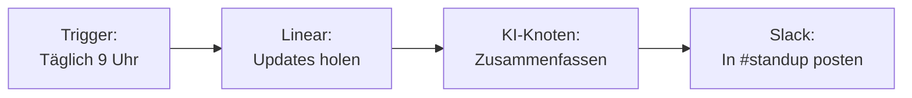
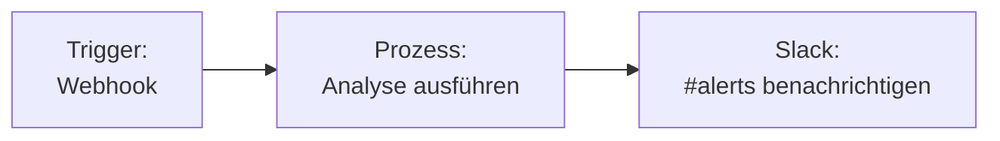

Integrieren Sie Slack mit Fabric AI, um Nachrichten an Kanäle zu senden, KI-generierte Zusammenfassungen zu posten und Team-Benachrichtigungen aus Workflows und Agenten-Gesprächen zu automatisieren.

## Integrationsmethoden

| Methode | Anwendungsfall | Auth |
|--------|----------|------|
| **MCP-Server** | KI-Chat-Befehle wie „an Slack posten" | OAuth (oder Bot-Token) |
| **Workflow-Plugin** | Automatisches Senden von Nachrichten in Workflows | OAuth (oder Bot-Token) |

## Slack einrichten

Am schnellsten verbinden Sie Slack über den integrierten **OAuth-Ablauf** — ein Klick, keine manuelle Token-Verwaltung. Fabric fordert die richtigen Berechtigungen für Sie an, speichert die Tokens verschlüsselt und erneuert sie automatisch, wo dies unterstützt wird.

<Steps>
  <Step>
    ### Slack-Integrationseinstellungen öffnen

    Gehen Sie zu **Einstellungen → Integrationen**, suchen Sie **Slack** und öffnen Sie es.

    Alternativ können Sie im Workflow-Builder einen **Slack**-Knoten hinzufügen und auf **Integration konfigurieren** klicken, um dasselbe Panel zu erreichen.
  </Step>

  <Step>
    ### Mit Slack verbinden

    Klicken Sie auf **Mit Slack verbinden**. Ein Slack-Autorisierungsfenster öffnet sich — prüfen Sie die angeforderten Berechtigungen und klicken Sie auf **Allow**.

    Fabric fordert diese Scopes automatisch für Sie an:
    - **Bot-Scopes:** `chat:write`, `channels:read`, `channels:history`, `groups:read`, `groups:history`, `users:read`, `users:read.email`
    - **User-Scope:** `search:read` (zum Durchsuchen von Nachrichten)
  </Step>

  <Step>
    ### Verbindung bestätigen

    Nach der Autorisierung schließt sich das Popup und das Panel zeigt **Slack verbunden** zusammen mit dem Slack-Konto, mit dem Sie sich angemeldet haben. Das war's — keine Tokens zum Kopieren oder Einfügen.
  </Step>
</Steps>

<Callout type="info">
**Persönlich vs. Organisation.** Verbinden Sie unter Ihrem **persönlichen** Konto für die eigene Nutzung oder unter einer **Organisation**, um die Verbindung mit allen Organisationsmitgliedern zu teilen. Wählen Sie den Kontext, bevor Sie auf **Verbinden** klicken.
</Callout>

### Alternative: Mit einem Bot-Token verbinden

Wenn Ihre Fabric-Instanz keine Slack-OAuth-Anmeldedaten konfiguriert hat (häufig bei selbst gehosteten Deployments), zeigt das Panel anstelle der Schaltfläche **Mit Slack verbinden** ein Feld für ein **Bot User OAuth Token**. Installieren Sie in diesem Fall Ihre eigene Slack-App und fügen Sie deren Token ein:

<Steps>
  <Step>
    ### Eine Slack-App erstellen

    1. Gehen Sie zu [api.slack.com/apps](https://api.slack.com/apps)
    2. Klicken Sie auf **Create New App** → **From scratch**
    3. Benennen Sie Ihre App (z. B. „Fabric AI") und wählen Sie Ihren Workspace
  </Step>

  <Step>
    ### Bot Token Scopes hinzufügen

    Fügen Sie unter **OAuth & Permissions** diese **Bot Token Scopes** hinzu:
    `channels:read`, `channels:history`, `groups:read`, `groups:history`, `users:read`, `users:read.email`, `search:read`, `chat:write`.

    Klicken Sie anschließend auf **Install to Workspace**.
  </Step>

  <Step>
    ### Token einfügen

    Kopieren Sie das **Bot User OAuth Token** (beginnt mit `xoxb-`), fügen Sie es in das Token-Feld in Fabric ein und klicken Sie auf **Slack verbinden**.
  </Step>
</Steps>

## Verfügbare Aktionen

### Nachricht senden

Senden Sie eine Nachricht an jeden Slack-Kanal, zu dem Ihr Bot eingeladen ist.

| Feld | Beschreibung | Beispiel |
|------|-------------|---------|
| **Kanal** | Kanalname oder ID | `#engineering` oder `C0123456789` |
| **Nachricht** | Nachrichteninhalt (unterstützt Slack-Markdown) | `*Wochenbericht* ist bereit!` |

### Template-Variablen in Workflows

Verwenden Sie Ausgaben aus vorherigen Knoten:

```
Kanal: #engineering
Nachricht: {{AINode.summary}}

📊 Sprint-Bericht für {{DateNode.currentWeek}}
{{ReportNode.content}}
```

## Häufige Workflow-Muster

### Tägliche Standup-Zusammenfassung



### Benachrichtigung bei Workflow-Abschluss



## Tipps

- **Bot zum Kanal einladen**, bevor Nachrichten gesendet werden — öffnen Sie den Kanal und tippen Sie `/invite @IhrBotName`
- **Kanal-IDs** statt Namen verwenden für Zuverlässigkeit (Kanalnamen können sich ändern)
- **Nachrichten formatieren** mit Slacks mrkdwn-Syntax: `*fett*`, `_kursiv_`, `` `Code` ``

## Trennen & erneut verbinden

So widerrufen Sie den Zugriff oder wechseln zu einem anderen Slack-Konto oder Workspace:

1. Öffnen Sie **Einstellungen → Integrationen → Slack**
2. Klicken Sie auf **Trennen**
3. Zum erneuten Verbinden klicken Sie wieder auf **Mit Slack verbinden** und autorisieren erneut

<Callout type="warning">
Beim Trennen wird die Verbindung deaktiviert, sodass sie in Chat oder Workflows nicht mehr verwendet werden kann. Bereits für Wissen/Suche synchronisierte Inhalte werden nicht automatisch entfernt — verwalten Sie diese über die Slack-Karte unter **Einstellungen → Integrationen**.
</Callout>

## Fehlerbehebung

### „OAuth not configured on server"
- Ihre Fabric-Instanz hat keine Slack-OAuth-Anmeldedaten eingerichtet. Verwenden Sie stattdessen die [Bot-Token-Methode](#alternative-mit-einem-bot-token-verbinden) oder bitten Sie Ihren Administrator, `SLACK_CLIENT_ID` / `SLACK_CLIENT_SECRET` zu konfigurieren.

### „channel_not_found"-Fehler
- Stellen Sie sicher, dass der Bot zum Zielkanal eingeladen ist
- Verwenden Sie die Kanal-ID statt des Kanalnamens

### „not_authed"-Fehler
- Verbinden Sie erneut über **Mit Slack verbinden** oder überprüfen Sie, ob ein eingefügtes Bot OAuth Token mit `xoxb-` beginnt
- Prüfen Sie, ob die Verbindung nicht auf der Slack-Seite widerrufen wurde

### Nachrichten erscheinen nicht
- Bestätigen Sie, dass die Verbindung die Berechtigung `chat:write` hat
- Überprüfen Sie, ob der Kanal nicht archiviert ist

---

## Nächste Schritte

<Cards>
  <Card title="Workflow-Builder" href="/docs/features/workflow-builder">
    Automatisierte Workflows mit Slack-Benachrichtigungen erstellen
  </Card>
  <Card title="MCP-Integration" href="/docs/integrations/mcp">
    Slack als Laufzeit-Aktion in Chat und Agenten verwenden
  </Card>
</Cards>
