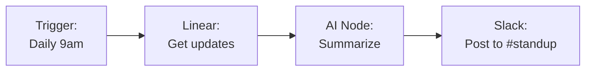
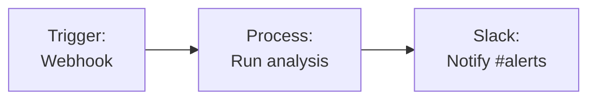

Integrate Slack with Fabric AI to send messages to channels, post AI-generated summaries, and automate team notifications from workflows and agent conversations.

## Integration Methods

| Method | Use Case | Auth |
|--------|----------|------|
| **MCP Server** | AI chat commands like "post to Slack" | OAuth (or bot token) |
| **Workflow Plugin** | Automated message sending in workflows | OAuth (or bot token) |

## Setting Up Slack

The fastest way to connect Slack is the built-in **OAuth flow** — one click, no manual token handling. Fabric requests the right permissions for you and stores the tokens encrypted, refreshing them automatically where supported.

<Steps>
  <Step>
    ### Open Slack Integration Settings

    Go to **Settings → Integrations**, find **Slack**, and open it.

    You can also add a **Slack** node in the Workflow Builder and click **Configure Integration** to reach the same panel.
  </Step>

  <Step>
    ### Connect with Slack

    Click **Connect with Slack**. A Slack authorization window opens — review the requested permissions and click **Allow**.

    Fabric requests these scopes for you automatically:
    - **Bot scopes:** `chat:write`, `channels:read`, `channels:history`, `groups:read`, `groups:history`, `users:read`, `users:read.email`
    - **User scope:** `search:read` (used to search messages)
  </Step>

  <Step>
    ### Confirm the Connection

    Once you authorize, the popup closes and the panel shows **Slack Connected** along with the Slack account you signed in as. That's it — no tokens to copy or paste.
  </Step>
</Steps>

<Callout type="info">
**Personal vs organization.** Connect under your **personal** account for your own use, or under an **organization** to share the connection with all org members. Choose the context before you click **Connect**.
</Callout>

### Alternative: Connect with a Bot Token

If your Fabric instance doesn't have Slack OAuth credentials configured (common on self-hosted deployments), the panel shows a **Bot User OAuth Token** field instead of the **Connect with Slack** button. In that case, install your own Slack app and paste its token:

<Steps>
  <Step>
    ### Create a Slack App

    1. Go to [api.slack.com/apps](https://api.slack.com/apps)
    2. Click **Create New App** → **From scratch**
    3. Name your app (e.g., "Fabric AI") and select your workspace
  </Step>

  <Step>
    ### Add Bot Token Scopes

    Under **OAuth & Permissions**, add these **Bot Token Scopes**:
    `channels:read`, `channels:history`, `groups:read`, `groups:history`, `users:read`, `users:read.email`, `search:read`, `chat:write`.

    Then click **Install to Workspace**.
  </Step>

  <Step>
    ### Paste the Token

    Copy the **Bot User OAuth Token** (starts with `xoxb-`), paste it into the token field in Fabric, and click **Connect Slack**.
  </Step>
</Steps>

## Available Actions

### Send Message

Send a message to any Slack channel your bot is invited to.

| Field | Description | Example |
|-------|-------------|---------|
| **Channel** | Channel name or ID | `#engineering` or `C0123456789` |
| **Message** | Message content (supports Slack markdown) | `*Weekly Report* is ready!` |

### Template Variables in Workflows

Use outputs from previous nodes:

```
Channel: #engineering
Message: {{AINode.summary}}

📊 Sprint Report for {{DateNode.currentWeek}}
{{ReportNode.content}}
```

## Common Workflow Patterns

### Daily Standup Summary



### Alert on Workflow Completion



## Tips

- **Invite the bot** to channels before sending messages — go to the channel and type `/invite @YourBotName`
- **Use channel IDs** instead of names for reliability (channel names can change)
- **Format messages** using Slack's mrkdwn syntax: `*bold*`, `_italic_`, `` `code` ``

## Disconnecting & Reconnecting

To revoke access or switch to a different Slack account or workspace:

1. Open **Settings → Integrations → Slack**
2. Click **Disconnect**
3. To reconnect, click **Connect with Slack** again and re-authorize

<Callout type="warning">
Disconnecting deactivates the connection so it can no longer be used in chat or workflows. Any content already synced for knowledge/search is not automatically removed — manage it from the Slack card under **Settings → Integrations**.
</Callout>

## Troubleshooting

### "OAuth not configured on server"
- Your Fabric instance doesn't have Slack OAuth credentials set up. Use the [bot token method](#alternative-connect-with-a-bot-token) instead, or ask your administrator to configure `SLACK_CLIENT_ID` / `SLACK_CLIENT_SECRET`.

### "channel_not_found" error
- Ensure the bot is invited to the target channel
- Use the channel ID instead of the channel name

### "not_authed" error
- Reconnect via **Connect with Slack**, or verify a pasted Bot OAuth Token starts with `xoxb-`
- Check that the connection hasn't been revoked from the Slack side

### Messages not appearing
- Confirm the connection has the `chat:write` scope
- Check that the channel isn't archived

## Beyond messaging

Slack does more than receive notifications:

- **Monitor a channel as project context** — link a Slack channel to a project and Fabric turns the discussion into reviewable backlog proposals. See [Channels & Meetings as Context](/docs/features/channel-context).
- **Talk to an agent in Slack** — deploy a Fabric agent with a Slack trigger and `@`-mention it in a channel; bound to a project, it can answer from that project's data. See [Agent Deployments](/docs/features/agent-deployments#slack-and-teams-triggers).

---

## Next Steps

<Cards>
  <Card title="Channels & Meetings as Context" href="/docs/features/channel-context">
    Monitor a Slack channel for backlog ideas
  </Card>
  <Card title="Agent Deployments" href="/docs/features/agent-deployments">
    Run a Fabric agent as a Slack bot
  </Card>
  <Card title="Workflow Builder" href="/docs/features/workflow-builder">
    Build automated workflows with Slack notifications
  </Card>
  <Card title="MCP Integration" href="/docs/integrations/mcp">
    Use Slack as a runtime action in chat and agents
  </Card>
</Cards>
