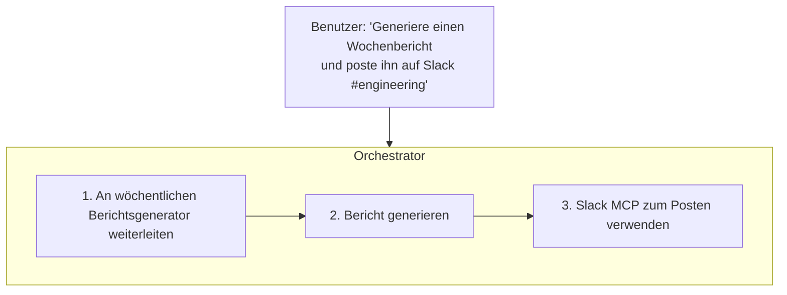

Dieses Tutorial führt Sie durch die Erstellung eines benutzerdefinierten KI-Agenten, der auf Ihren spezifischen Workflow zugeschnitten ist. In etwa 15 Minuten haben Sie einen funktionierenden Agenten, den Ihr Team nutzen kann.

## Was Sie erstellen werden

Am Ende dieses Tutorials haben Sie:

- Einen benutzerdefinierten Agenten mit spezifischen Anweisungen erstellt
- Konfiguriert, welche Tools der Agent verwenden kann
- Den Agenten mit echten Gesprächen getestet
- Ihn für Ihr Team bereitgestellt

## Voraussetzungen

Stellen Sie sicher, dass Sie folgendes haben:

- ✅ Ein Fabric AI-Konto mit Admin- oder Member-Rolle
- ✅ Einen konfigurierten KI-Anbieter (siehe [KI-Konfiguration](/docs/getting-started/ai-configuration))
- ✅ Ein Verständnis davon, was Ihr Agent tun soll

## Schritt 1: Ihren Agenten planen

Definieren Sie den Zweck Ihres Agenten, bevor Sie ihn erstellen:

<Steps>
  <Step>
    ### Anwendungsfall definieren

    Welche spezifische Aufgabe soll dieser Agent übernehmen? Beispiele:
    - Wöchentliche Statusberichte generieren
    - Kunden-Onboarding-Dokumente erstellen
    - API-Dokumentation aus Code entwerfen
    - Testpläne für Features schreiben
  </Step>

  <Step>
    ### Erforderliche Tools identifizieren

    Welche externen Tools benötigt Ihr Agent?
    - **RAG** — Zugriff auf Wissensdatenbanken
    - **MCP-Tools** — GitHub, Jira, Slack usw.
    - **Code-Ausführung** — Für Datenverarbeitung
  </Step>

  <Step>
    ### Genehmigungsanforderungen bestimmen

    Soll der Agent für bestimmte Aktionen menschliche Genehmigung benötigen?
    - Externe Tickets erstellen
    - Nachrichten posten
    - Dokumente ändern
  </Step>
</Steps>

## Schritt 2: Den Agenten erstellen

<Steps>
  <Step>
    ### Zu Agenten navigieren

    Gehen Sie in der linken Seitenleiste zu **Agenten** und klicken Sie dann auf **Agent erstellen**.
  </Step>

  <Step>
    ### Grundinformationen ausfüllen

    Konfigurieren Sie die Identität des Agenten:

    - **Name**: Geben Sie ihm einen beschreibenden Namen (z. B. „Wöchentlicher Berichtsgenerator")
    - **Beschreibung**: Erklären Sie, was der Agent tut
    - **Symbol**: Wählen Sie ein Emoji oder laden Sie ein Symbol hoch
    - **Sichtbarkeit**: Persönlich, Organisation oder Öffentlich
  </Step>

  <Step>
    ### Den System-Prompt schreiben

    Der System-Prompt definiert das Verhalten Ihres Agenten. Hier eine Vorlage:

    ```
    Sie sind ein spezialisierter KI-Assistent für [ZWECK].

    ## Ihre Rolle
    [Beschreiben Sie die Hauptfunktion des Agenten]

    ## Richtlinien
    - [Richtlinie 1]
    - [Richtlinie 2]
    - [Richtlinie 3]

    ## Ausgabeformat
    [Beschreiben Sie das erwartete Ausgabeformat]

    ## Einschränkungen
    - [Was der Agent NICHT tun soll]
    - [Zu respektierende Grenzen]
    ```

    **Beispiel für einen wöchentlichen Berichtsgenerator:**

    ```
    Sie sind ein wöchentlicher Berichtsgenerator, der strukturierte Statusupdates für Engineering-Teams erstellt.

    ## Ihre Rolle
    Erstellen Sie umfassende Wochenberichte basierend auf Team-Aktivitäten, abgeschlossener Arbeit und bevorstehenden Prioritäten.

    ## Richtlinien
    - Immer einschließen: Leistungen, In Bearbeitung, Blocker, Nächste Woche
    - Aufzählungspunkte für Klarheit verwenden
    - Jeden Abschnitt präzise, aber informativ halten
    - Relevante Metriken einbeziehen, wenn verfügbar

    ## Ausgabeformat
    Verwenden Sie folgende Struktur:
    # Wochenbericht - [Datumsbereich]

    ## Leistungen
    - [Abgeschlossene Punkte]

    ## In Bearbeitung
    - [Aktuelle Arbeit]

    ## Blocker
    - [Probleme, die gelöst werden müssen]

    ## Nächste Woche
    - [Geplante Arbeit]

    ## Metriken
    - [Relevante Zahlen]

    ## Einschränkungen
    - Keine Informationen erfinden
    - Um Klärung bitten, wenn Informationen fehlen
    - Bericht unter 500 Wörtern halten, sofern nicht anders angefordert
    ```
  </Step>

  <Step>
    ### Tools konfigurieren

    Aktivieren Sie die Tools, die Ihr Agent benötigt:

    **RAG-Zugriff**
    - RAG aktivieren, wenn der Agent auf Dokumente verweisen muss
    - Auswählen, auf welche Workspaces er zugreifen kann

    **MCP-Tools**
    - Spezifische MCP-Server aktivieren (GitHub, Jira usw.)
    - Auswählen, welche Tools von jedem Server verfügbar sind

    **Ausführungseinstellungen**
    - Code-Ausführung aktivieren, wenn nötig
    - Timeout-Grenzen festlegen
  </Step>

  <Step>
    ### Genehmigungsanforderungen festlegen

    Human-in-the-Loop-Einstellungen konfigurieren:

    - **Automatisch genehmigen**: Alle Aktionen werden automatisch ausgeführt
    - **Genehmigung für externe Aktionen erforderlich**: MCP-Tool-Aufrufe brauchen Genehmigung
    - **Genehmigung für alle Aktionen erforderlich**: Jede Aktion braucht Genehmigung
  </Step>

  <Step>
    ### Agenten speichern

    Klicken Sie auf **Agent erstellen**, um Ihre Konfiguration zu speichern.
  </Step>
</Steps>

## Schritt 3: Ihren Agenten testen

Testen Sie gründlich, bevor Sie ihn mit Ihrem Team teilen:

<Steps>
  <Step>
    ### Ein Testgespräch beginnen

    Klicken Sie auf Ihren neuen Agenten, um einen Chat zu öffnen. Versuchen Sie Ihren primären Anwendungsfall:

    ```
    Generiere einen Wochenbericht für das Authentifizierungsteam.

    Diese Woche haben wir:
    - OAuth-Integration mit Google abgeschlossen
    - 3 kritische Sicherheitsfehler behoben
    - Mit der Arbeit an Passkey-Unterstützung begonnen

    Blocker:
    - Warten auf Sicherheitsüberprüfung für Passkey-Implementierung

    Nächste Woche:
    - Passkey-Implementierung abschließen
    - Mit Lasttests beginnen
    ```
  </Step>

  <Step>
    ### Ausgabequalität überprüfen

    Prüfen Sie, ob der Agent:
    - Ihrem festgelegten Format folgt
    - Den richtigen Ton verwendet
    - Alle erforderlichen Abschnitte enthält
    - Randfälle angemessen behandelt
  </Step>

  <Step>
    ### Randfälle testen

    Versuchen Sie Szenarien, die den Agenten überfordern könnten:
    - Minimale Informationen
    - Widersprüchliche Anforderungen
    - Fehlender Kontext
    - Sehr lange Eingaben
  </Step>

  <Step>
    ### Prompt iterieren

    Verfeinern Sie Ihren System-Prompt basierend auf Tests:
    - Fehlende Richtlinien hinzufügen
    - Mehrdeutige Anweisungen klären
    - Beispiele für gute Ausgabe hinzufügen
  </Step>
</Steps>

## Schritt 4: Kontext hinzufügen (Optional)

Erweitern Sie Ihren Agenten mit RAG-Kontext:

<Steps>
  <Step>
    ### Einen Workspace erstellen

    Gehen Sie zu **Workspaces → Workspace erstellen** und benennen Sie ihn entsprechend (z. B. „Berichtsvorlagen").
  </Step>

  <Step>
    ### Referenzdokumente hochladen

    Fügen Sie Dokumente hinzu, die Ihrem Agenten helfen werden:
    - Beispielberichte aus vergangenen Wochen
    - Team-Richtlinien und -Standards
    - Zu befolgende Vorlagen
  </Step>

  <Step>
    ### Workspace mit Agent verknüpfen

    Aktivieren Sie in den Einstellungen Ihres Agenten RAG und wählen Sie den Workspace.
  </Step>
</Steps>

## Schritt 5: Für Ihr Team bereitstellen

<Steps>
  <Step>
    ### Sichtbarkeit festlegen

    Wählen Sie, wer den Agenten verwenden kann:

    - **Persönlich**: Nur Sie
    - **Organisation**: Alle Mitglieder Ihrer Organisation
    - **Öffentlich**: Jeder mit dem Link (vorsichtig verwenden)
  </Step>

  <Step>
    ### Agenten teilen

    Organisationsmitglieder können den Agenten in der Agentenliste finden. Für externe Freigabe kopieren Sie die URL des Agenten.
  </Step>

  <Step>
    ### Feedback sammeln

    Bitten Sie frühe Benutzer um Feedback:
    - Ist die Ausgabe nützlich?
    - Was fehlt?
    - Was könnte verbessert werden?
  </Step>
</Steps>

## Erweiterte Konfiguration

### Template-Variablen verwenden

Machen Sie Ihren Agenten flexibler mit Variablen:

```
Sie sind ein {{DOKUMENT_TYP}}-Generator für {{TEAM_NAME}}.

Generieren Sie {{DOKUMENT_TYP}}-Dokumente nach den Standards von {{TEAM_NAME}}.
```

Benutzer können diese Variablen beim Start eines Gesprächs ausfüllen.

### Mit anderen Agenten verketten

Ihr benutzerdefinierter Agent kann mit dem Orchestrator zusammenarbeiten:



### Versionskontrolle

Fabric verfolgt Änderungen an Ihrem Agenten:
- Versionsgeschichte anzeigen
- Zu früheren Versionen zurückkehren
- Versionen vergleichen

## Beispiel-Agenten

### Besprechungsnotizen-Zusammenfasser

```
Sie sind ein Besprechungsnotizen-Zusammenfasser, der rohe Meeting-Transkripte in strukturierte Zusammenfassungen umwandelt.

## Ausgabeformat
# Meeting-Zusammenfassung - [Thema]

**Datum**: [Aus Transkript extrahieren]
**Teilnehmer**: [Teilnehmer auflisten]

## Wichtige Diskussionspunkte
- [Besprochene Hauptthemen]

## Getroffene Entscheidungen
- [Klare Entscheidungen mit Verantwortlichen]

## Aktionspunkte
| Aktion | Verantwortlich | Fälligkeitsdatum |
|--------|----------------|-----------------|
| [Aufgabe] | [Name] | [Datum] |

## Nächste Schritte
- [Folgepunkte]
```

### Fehlerbericht-Generator

```
Sie sind ein Fehlerbericht-Generator, der detaillierte, umsetzbare Fehlerberichte aus Benutzerbeschreibungen erstellt.

## Richtlinien
- Alle relevanten technischen Details extrahieren
- Schritte zur Reproduktion identifizieren
- Schweregrad angemessen kategorisieren
- Potenzielle Ursachen vorschlagen, wenn möglich

## Ausgabeformat
# Fehlerbericht: [Kurzer Titel]

**Schweregrad**: [Kritisch/Hoch/Mittel/Niedrig]
**Komponente**: [Betroffenes System]

## Beschreibung
[Detaillierte Beschreibung des Problems]

## Schritte zur Reproduktion
1. [Schritt 1]
2. [Schritt 2]
3. [Schritt 3]

## Erwartetes Verhalten
[Was passieren sollte]

## Tatsächliches Verhalten
[Was tatsächlich passiert]

## Umgebung
- Browser/OS: [Details]
- Version: [App-Version]

## Potenzielle Ursachen
- [Hypothese 1]
- [Hypothese 2]
```

## Fehlerbehebung

### Agent gibt generische Antworten

- Machen Sie Ihren System-Prompt spezifischer
- Fügen Sie Beispiele für gute Ausgabe hinzu
- Hängen Sie Workspaces mit Referenzdokumenten an

### Agent ignoriert Anweisungen

- Wichtige Anweisungen an den Anfang des Prompts setzen
- Stärkere Sprache verwenden („Sie MÜSSEN", „IMMER", „NIE")
- Komplexe Anweisungen in nummerierte Schritte aufteilen

### Tool-Aufrufe schlagen fehl

- Überprüfen Sie, ob MCP-Server korrekt konfiguriert sind
- Prüfen Sie, ob der Agent die Berechtigung hat, die Tools zu verwenden
- Testen Sie die MCP-Server-Verbindung in den Einstellungen

### Ausgabeformat ist inkonsistent

- Explizite Formatierungsbeispiele im Prompt angeben
- Markdown-Vorlagen verwenden
- „Formatieren Sie Ihre Antwort als:"-Anweisungen hinzufügen

---

## Nächste Schritte

<Cards>
  <Card title="Prompt-Bibliothek" href="/docs/features/prompts">
    Prompts für Ihre benutzerdefinierten Agenten speichern
  </Card>
  <Card title="MCP-Integration" href="/docs/integrations/mcp">
    Externe Tools mit Ihrem Agenten verbinden
  </Card>
  <Card title="Orchestrator" href="/docs/agents/orchestrator">
    Ihren Agenten mit anderen verketten
  </Card>
</Cards>
