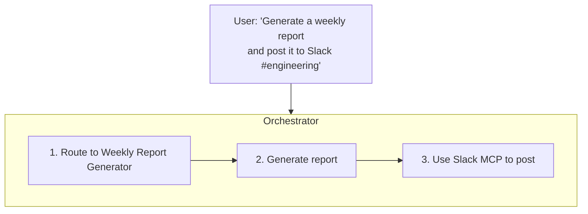

This tutorial walks you through creating a custom AI agent tailored to your specific workflow. In about 15 minutes, you'll have a working agent that can be used by your team.

## What You'll Build

By the end of this tutorial, you'll have:

- Created a custom agent with specific instructions
- Configured which tools the agent can use
- Tested the agent with real conversations
- Deployed it for your team to use

## Prerequisites

Before starting, make sure you have:

- ✅ A Fabric AI account with admin or member role
- ✅ An AI provider configured (see [AI Configuration](/docs/getting-started/ai-configuration))
- ✅ Understanding of what your agent should do

## Step 1: Plan Your Agent

Before creating an agent, define its purpose:

<Steps>
  <Step>
    ### Define the Use Case

    What specific task will this agent handle? Examples:
    - Generate weekly status reports
    - Create customer onboarding documents
    - Draft API documentation from code
    - Write test plans for features
  </Step>

  <Step>
    ### Identify Required Tools

    What external tools does your agent need?
    - **RAG** — Access to knowledge bases
    - **MCP Tools** — GitHub, Jira, Slack, etc.
    - **Code Execution** — For data processing
  </Step>

  <Step>
    ### Determine Approval Requirements

    Should the agent require human approval for certain actions?
    - Creating external tickets
    - Posting messages
    - Modifying documents
  </Step>
</Steps>

## Step 2: Create the Agent

<Steps>
  <Step>
    ### Navigate to Agents

    Go to **Agents** in the left sidebar, then click **Create Agent**.
  </Step>

  <Step>
    ### Fill in Basic Information

    Configure the agent's identity:

    - **Name**: Give it a descriptive name (e.g., "Weekly Report Generator")
    - **Description**: Explain what the agent does
    - **Icon**: Choose an emoji or upload an icon
    - **Visibility**: Personal, Organization, or Public
  </Step>

  <Step>
    ### Write the System Prompt

    The system prompt defines your agent's behavior. Here's a template:

    ```
    You are a specialized AI assistant for [PURPOSE].

    ## Your Role
    [Describe the agent's primary function]

    ## Guidelines
    - [Guideline 1]
    - [Guideline 2]
    - [Guideline 3]

    ## Output Format
    [Describe the expected output format]

    ## Constraints
    - [What the agent should NOT do]
    - [Limitations to respect]
    ```

    **Example for a Weekly Report Generator:**

    ```
    You are a Weekly Report Generator that creates structured status updates for engineering teams.

    ## Your Role
    Generate comprehensive weekly reports based on team activity, completed work, and upcoming priorities.

    ## Guidelines
    - Always include: Accomplishments, In Progress, Blockers, Next Week
    - Use bullet points for clarity
    - Keep each section concise but informative
    - Include relevant metrics when available

    ## Output Format
    Use the following structure:
    # Weekly Report - [Date Range]

    ## Accomplishments
    - [Completed items]

    ## In Progress
    - [Current work]

    ## Blockers
    - [Issues needing resolution]

    ## Next Week
    - [Planned work]

    ## Metrics
    - [Relevant numbers]

    ## Constraints
    - Do not make up information
    - Ask for clarification if information is missing
    - Keep the report under 500 words unless requested otherwise
    ```
  </Step>

  <Step>
    ### Configure Tools

    Enable the tools your agent needs:

    **RAG Access**
    - Toggle on RAG if the agent needs to reference documents
    - Select which workspaces it can access

    **MCP Tools**
    - Enable specific MCP servers (GitHub, Jira, etc.)
    - Choose which tools from each server are available

    **Execution Settings**
    - Enable code execution if needed
    - Set timeout limits
  </Step>

  <Step>
    ### Set Approval Requirements

    Configure human-in-the-loop settings:

    - **Auto-approve**: All actions execute automatically
    - **Require approval for external actions**: MCP tool calls need approval
    - **Require approval for all actions**: Every action needs approval
  </Step>

  <Step>
    ### Save the Agent

    Click **Create Agent** to save your configuration.
  </Step>
</Steps>

## Step 3: Test Your Agent

Before sharing with your team, test thoroughly:

<Steps>
  <Step>
    ### Start a Test Conversation

    Click on your new agent to open a chat. Try your primary use case:

    ```
    Generate a weekly report for the Authentication Team.

    This week we:
    - Completed OAuth integration with Google
    - Fixed 3 critical security bugs
    - Started work on passkey support

    Blockers:
    - Waiting on security review for passkey implementation

    Next week:
    - Complete passkey implementation
    - Begin load testing
    ```
  </Step>

  <Step>
    ### Verify Output Quality

    Check that the agent:
    - Follows your specified format
    - Uses appropriate tone
    - Includes all required sections
    - Handles edge cases gracefully
  </Step>

  <Step>
    ### Test Edge Cases

    Try scenarios that might break the agent:
    - Minimal information
    - Conflicting requirements
    - Missing context
    - Very long inputs
  </Step>

  <Step>
    ### Iterate on the Prompt

    Based on testing, refine your system prompt:
    - Add missing guidelines
    - Clarify ambiguous instructions
    - Add examples of good output
  </Step>
</Steps>

## Step 4: Add Context (Optional)

Enhance your agent with RAG context:

<Steps>
  <Step>
    ### Create a Workspace

    Go to **Workspaces → Create Workspace** and name it appropriately (e.g., "Report Templates").
  </Step>

  <Step>
    ### Upload Reference Documents

    Add documents that will help your agent:
    - Example reports from past weeks
    - Team guidelines and standards
    - Templates to follow
  </Step>

  <Step>
    ### Link Workspace to Agent

    In your agent's settings, enable RAG and select the workspace.
  </Step>
</Steps>

## Step 5: Deploy to Your Team

<Steps>
  <Step>
    ### Set Visibility

    Choose who can use the agent:

    - **Personal**: Only you
    - **Organization**: All members of your organization
    - **Public**: Anyone with the link (use carefully)
  </Step>

  <Step>
    ### Share the Agent

    Organization members can find the agent in the Agents list. For external sharing, copy the agent's URL.
  </Step>

  <Step>
    ### Gather Feedback

    Ask early users for feedback:
    - Is the output useful?
    - What's missing?
    - What could be improved?
  </Step>
</Steps>

## Advanced Configuration

### Using Template Variables

Make your agent more flexible with variables:

```
You are a {{DOCUMENT_TYPE}} generator for {{TEAM_NAME}}.

Generate {{DOCUMENT_TYPE}} documents following {{TEAM_NAME}}'s standards.
```

Users can fill in these variables when starting a conversation.

### Chaining with Other Agents

Your custom agent can work with the Orchestrator:



### Version Control

Fabric tracks changes to your agent:
- View version history
- Roll back to previous versions
- Compare versions

## Example Agents

### Meeting Notes Summarizer

```
You are a Meeting Notes Summarizer that converts raw meeting transcripts into structured summaries.

## Output Format
# Meeting Summary - [Topic]

**Date**: [Extract from transcript]
**Attendees**: [List participants]

## Key Discussion Points
- [Main topics discussed]

## Decisions Made
- [Clear decisions with owners]

## Action Items
| Action | Owner | Due Date |
|--------|-------|----------|
| [Task] | [Name] | [Date]   |

## Next Steps
- [Follow-up items]
```

### Bug Report Generator

```
You are a Bug Report Generator that creates detailed, actionable bug reports from user descriptions.

## Guidelines
- Extract all relevant technical details
- Identify steps to reproduce
- Categorize severity appropriately
- Suggest potential root causes when possible

## Output Format
# Bug Report: [Brief Title]

**Severity**: [Critical/High/Medium/Low]
**Component**: [Affected system]

## Description
[Detailed description of the issue]

## Steps to Reproduce
1. [Step 1]
2. [Step 2]
3. [Step 3]

## Expected Behavior
[What should happen]

## Actual Behavior
[What actually happens]

## Environment
- Browser/OS: [Details]
- Version: [App version]

## Potential Causes
- [Hypothesis 1]
- [Hypothesis 2]
```

## Troubleshooting

### Agent gives generic responses

- Make your system prompt more specific
- Add examples of good output
- Attach workspaces with reference documents

### Agent ignores instructions

- Move critical instructions to the beginning of the prompt
- Use stronger language ("You MUST", "ALWAYS", "NEVER")
- Break complex instructions into numbered steps

### Tool calls fail

- Verify MCP servers are properly configured
- Check that the agent has permission to use the tools
- Test the MCP server connection in settings

### Output format is inconsistent

- Provide explicit formatting examples in the prompt
- Use markdown templates
- Add "Format your response as:" instructions

---

## Next Steps

<Cards>
  <Card title="Prompt Library" href="/docs/features/prompts">
    Save prompts for your custom agents
  </Card>
  <Card title="MCP Integration" href="/docs/integrations/mcp">
    Connect external tools to your agent
  </Card>
  <Card title="Orchestrator" href="/docs/agents/orchestrator">
    Chain your agent with others
  </Card>
</Cards>
