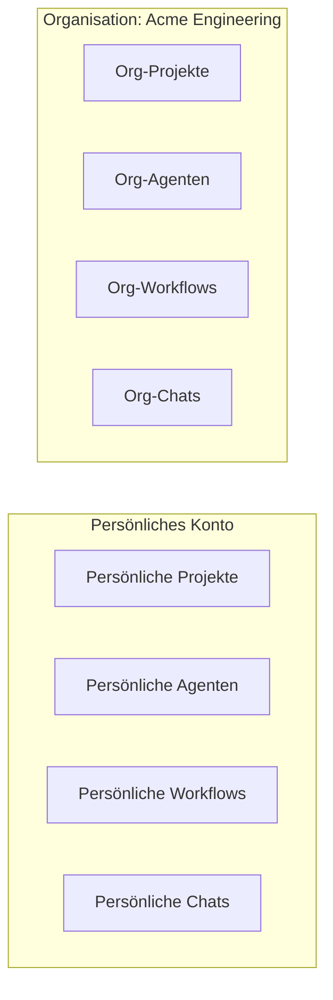

Dieses Tutorial führt Sie durch die Erstellung und Konfiguration einer Organisation in Fabric AI. In etwa 15 Minuten haben Sie einen vollständig eingerichteten Team-Workspace mit gemeinsamen KI-Anbietern, Integrationen und Kollaborationsfunktionen.

## Was Sie erreichen werden

Am Ende dieses Tutorials haben Sie:

- Eine Organisation mit einem benutzerdefinierten Slug erstellt
- Teammitglieder mit entsprechenden Rollen eingeladen
- KI-Anbieter für die Organisation konfiguriert
- Gemeinsame Integrationen und Datenverbindungen eingerichtet

## Voraussetzungen

Stellen Sie sicher, dass Sie folgendes haben:

- ✅ Ein Fabric AI-Konto
- ✅ Mindestens einen KI-Anbieter API-Schlüssel (siehe [KI-Konfiguration](/docs/getting-started/ai-configuration))
- ✅ E-Mail-Adressen der einzuladenden Teammitglieder

## Schritt 1: Eine Organisation erstellen

<Steps>
  <Step>
    ### Organisationseinstellungen öffnen

    Klicken Sie auf Ihren Avatar in der unteren linken Ecke und wählen Sie dann **Organisation erstellen**.
  </Step>

  <Step>
    ### Organisation konfigurieren

    Füllen Sie die Details aus:

    - **Name**: Ihr Team- oder Firmenname (z. B. „Acme Engineering")
    - **Slug**: URL-freundliche Kennung (z. B. `acme-engineering`)
      - Erscheint in URLs: `fabric.pro/app/acme-engineering/...`
      - Kann nach der Erstellung nicht geändert werden
    - **Logo**: Laden Sie Ihr Team- oder Firmenlogo hoch (optional)
  </Step>

  <Step>
    ### Erstellen

    Klicken Sie auf **Organisation erstellen**. Sie werden automatisch als **Eigentümer** festgelegt.
  </Step>
</Steps>

## Schritt 2: Teammitglieder einladen

<Steps>
  <Step>
    ### Zu Mitgliedern navigieren

    Gehen Sie im Organisationskontext zu **Einstellungen → Mitglieder**.
  </Step>

  <Step>
    ### Einladungen senden

    Klicken Sie auf **Mitglied einladen** und geben Sie die E-Mail-Adresse jeder Person ein.
  </Step>

  <Step>
    ### Rollen zuweisen

    Wählen Sie eine Rolle für jedes Mitglied:

    | Rolle | Berechtigungen |
    |------|------------|
    | **Eigentümer** | Volle Kontrolle — Einstellungen, Abrechnung, Mitglieder, alle Features |
    | **Admin** | Einstellungen, Integrationen und Mitglieder verwalten (außer Abrechnung) |
    | **Mitglied** | Alle Features nutzen, Projekte und Workflows erstellen |
  </Step>

  <Step>
    ### Mitglieder nehmen Einladungen an

    Eingeladene Benutzer erhalten eine E-Mail mit einem Beitrittslink. Sobald sie akzeptiert haben, erscheinen sie in der Mitgliederliste.
  </Step>
</Steps>

## Schritt 3: KI-Anbieter konfigurieren

Richten Sie KI-Anbieter auf Organisationsebene ein, damit alle Mitglieder Zugriff haben.

<Steps>
  <Step>
    ### Zu KI-Anbietern navigieren

    Gehen Sie im Organisationskontext zu **Einstellungen → KI-Anbieter**.
  </Step>

  <Step>
    ### Einen Anbieter hinzufügen

    Wählen Sie einen Anbieter (z. B. OpenAI, Anthropic, Groq) und geben Sie den API-Schlüssel ein.

    Dieser Schlüssel auf Org-Ebene wird von allen Mitgliedern geteilt. Mitglieder können weiterhin persönliche Anbieterüberschreibungen festlegen.
  </Step>

  <Step>
    ### Modelleinstellungen festlegen

    Konfigurieren Sie, welche Modelle für verschiedene Aufgabentypen verwendet werden:

    | Aufgabentyp | Empfohlen |
    |-----------|------------|
    | **Chat** | Claude Sonnet oder GPT-4o |
    | **Einfach** | GPT-4o-mini oder Llama 3.1 8B |
    | **Komplex** | GPT-4o oder Claude Opus |
    | **Tool-Aufruf** | GPT-4o |
    | **Einbettung** | text-embedding-3-small |
  </Step>

  <Step>
    ### Standard-Anbieter festlegen

    Klicken Sie bei Ihrem primären Anbieter auf **Als Standard festlegen**. Dies ist der Fallback, wenn kein spezifischer Modell-Override vorhanden ist.
  </Step>

  <Step>
    ### Einbettungsanbieter konfigurieren

    Wenn Sie RAG (Dokumentensuche) planen:
    1. Wählen Sie einen einbettungsfähigen Anbieter (OpenAI, Cohere usw.)
    2. Klicken Sie auf **Als Einbettungsanbieter festlegen**
  </Step>
</Steps>

## Schritt 4: Gemeinsame Integrationen einrichten

Verbinden Sie externe Dienste auf Organisationsebene für alle Mitglieder.

<Steps>
  <Step>
    ### MCP-Server hinzufügen

    Gehen Sie zu **Einstellungen → MCP-Server** und verbinden Sie Dienste, die Ihr Team verwendet:
    - **GitHub** — für Repository-Verwaltung
    - **Linear oder Jira** — für Issue-Tracking
    - **Slack** — für Team-Benachrichtigungen

    Organisations-MCP-Server sind für alle Mitglieder verfügbar.
  </Step>

  <Step>
    ### Integrationen verbinden

    Gehen Sie zu **Einstellungen → Integrationen**, um gemeinsame Dienste zu verbinden:
    - **Notion** — Team-Wiki und Dokumentation
    - **Google Drive** — Gemeinsame Dokumente
    - **Confluence** — Firmen-Wissensdatenbank

    Verbundene Anbieter stellen den Agenten und Workflows aller Org-Mitglieder Laufzeit-**Aktionen** (Suchen, Lesen und mehr) bereit.
  </Step>
</Steps>

## Schritt 5: Gemeinsame Ressourcen erstellen

Erstellen Sie nun Ressourcen, an denen Ihr Team zusammenarbeiten kann.

### Ein Projekt erstellen

1. Navigieren Sie im Org-Kontext zu **Projekte**
2. Klicken Sie auf **Projekt erstellen**
3. Fügen Sie Teammitglieder als Mitarbeiter mit entsprechenden Rollen hinzu (Eigentümer, Bearbeiter, Betrachter)

### Agenten-Vorlagen erstellen

1. Navigieren Sie im Org-Kontext zu **Agenten**
2. Erstellen Sie Agenten, die auf die **Organisation** beschränkt sind
3. Alle Mitglieder können org-beschränkte Agenten verwenden

### Workflow-Vorlagen erstellen

1. Navigieren Sie im Org-Kontext zu **Workflows**
2. Erstellen Sie Workflows, die org-weite Integrationen verwenden
3. Teammitglieder können gemeinsame Workflows ausführen und überwachen

## Datenisolierung verstehen

Fabric erzwingt strikte Datenisolierung zwischen persönlichen und Organisationskontexten:

- Organisations-Daten sind nur für Org-Mitglieder sichtbar
- Persönliche Daten sind im Organisationskontext nie sichtbar
- Das Wechseln zwischen Kontexten ist sofort — klicken Sie auf den Org-Umschalter in der Seitenleiste

## Tipps für das Organisations-Management

### Klein beginnen
Beginnen Sie mit einigen wichtigen Mitgliedern und erweitern Sie, wenn Sie Muster und Workflows etabliert haben.

### KI-Einstellungen standardisieren
Legen Sie Modelleinstellungen auf Org-Ebene fest, damit alle Mitglieder konsistente Ergebnisse erhalten. Mitglieder können bei Bedarf mit persönlichen Einstellungen überschreiben.

### Organisations-Fähigkeiten verwenden
Erstellen Sie Organisations-Fähigkeiten für häufige Aufgaben (z. B. „Unternehmens-Schreibstil", „Code-Review-Checkliste"), damit das gesamte Team davon profitiert.

### Nutzung überwachen
Überprüfen Sie das Dashboard auf Aktivitätsmetriken in Ihrer Organisation — erstellte Projekte, generierte Dokumente, abgeschlossene Agenten-Aufgaben.

## Was als nächstes?

<Cards>
  <Card title="Ihr erstes Dokument generieren" href="/docs/tutorials/first-document">
    In Ihrer neuen Org ein PRD mit KI erstellen
  </Card>
  <Card title="Integrationen verbinden" href="/docs/tutorials/setup-integrations">
    GitHub, Slack und andere Tools einrichten
  </Card>
  <Card title="Einen Workflow erstellen" href="/docs/tutorials/first-workflow">
    Team-Prozesse mit Workflows automatisieren
  </Card>
</Cards>

## Fehlerbehebung

### Einladungs-E-Mails kommen nicht an
- Spam/Junk-Ordner überprüfen
- Überprüfen Sie, ob die E-Mail-Adresse korrekt ist
- Senden Sie die Einladung von der Mitgliederseite erneut

### Mitglieder können keine Org-Ressourcen sehen
- Stellen Sie sicher, dass sie die Einladung angenommen und zum Org-Kontext gewechselt haben
- Prüfen Sie, ob ihre Rolle ausreichende Berechtigungen hat

### KI-Funktionen funktionieren nicht für Mitglieder
- Überprüfen Sie, ob der KI-Anbieter auf Org-Ebene mit einem gültigen API-Schlüssel konfiguriert ist
- Prüfen Sie, ob ein Standard-Anbieter festgelegt ist
- Mitglieder benötigen entweder einen Org-Anbieter oder ihren eigenen persönlichen Anbieter

---

## Nächste Schritte

<Cards>
  <Card title="KI-Konfiguration" href="/docs/features/ai-providers">
    Detaillierte KI-Anbieter-Einrichtung
  </Card>
  <Card title="Organisations-Feature" href="/docs/features/organizations">
    Vollständige Organisations-Management-Referenz
  </Card>
</Cards>
