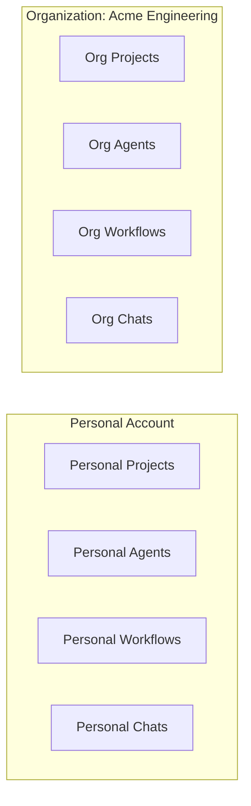

This tutorial walks you through creating and configuring an organization in Fabric AI. In about 15 minutes, you'll have a fully set up team workspace with shared AI providers, integrations, and collaboration features.

## What You'll Accomplish

By the end of this tutorial, you'll have:

- Created an organization with a custom slug
- Invited team members with appropriate roles
- Configured AI providers for the organization
- Set up shared integrations

## Prerequisites

Before starting, make sure you have:

- ✅ A Fabric AI account
- ✅ At least one AI provider API key (see [AI Configuration](/docs/getting-started/ai-configuration))
- ✅ Email addresses of team members to invite

## Step 1: Create an Organization

<Steps>
  <Step>
    ### Open Organization Settings

    Click your avatar in the bottom-left corner, then select **Create Organization**.
  </Step>

  <Step>
    ### Configure the Organization

    Fill in the details:

    - **Name**: Your team or company name (e.g., "Acme Engineering")
    - **Slug**: URL-friendly identifier (e.g., `acme-engineering`)
      - This appears in URLs: `fabric.pro/app/acme-engineering/...`
      - Cannot be changed after creation
    - **Logo**: Upload your team or company logo (optional)
  </Step>

  <Step>
    ### Create

    Click **Create Organization**. You're automatically set as the **Owner**.
  </Step>
</Steps>

## Step 2: Invite Team Members

<Steps>
  <Step>
    ### Navigate to Members

    In your organization context, go to **Settings → Members**.
  </Step>

  <Step>
    ### Send Invitations

    Click **Invite Member** and enter each person's email address.
  </Step>

  <Step>
    ### Assign Roles

    Choose a role for each member:

    | Role | Permissions |
    |------|------------|
    | **Owner** | Full control — settings, billing, members, all features |
    | **Admin** | Manage settings, integrations, and members (except billing) |
    | **Member** | Use all features, create projects and workflows |
  </Step>

  <Step>
    ### Members Accept Invitations

    Invited users receive an email with a link to join. Once they accept, they appear in the members list.
  </Step>
</Steps>

## Step 3: Configure AI Providers

Set up AI providers at the organization level so all members have access.

<Steps>
  <Step>
    ### Navigate to AI Providers

    In your organization context, go to **Settings → AI Providers**.
  </Step>

  <Step>
    ### Add a Provider

    Select a provider (e.g., OpenAI, Anthropic, Groq) and enter the API key.

    This org-level key is shared across all members. Members can still set personal provider overrides.
  </Step>

  <Step>
    ### Set Model Preferences

    Configure which models to use for different task types:

    | Task Type | Recommended |
    |-----------|------------|
    | **Chat** | Claude Sonnet or GPT-4o |
    | **Simple** | GPT-4o-mini or Llama 3.1 8B |
    | **Complex** | GPT-4o or Claude Opus |
    | **Tool Calling** | GPT-4o |
    | **Embedding** | text-embedding-3-small |
  </Step>

  <Step>
    ### Set Default Provider

    Click **Set as Default** on your primary provider. This is the fallback when no specific model override exists.
  </Step>

  <Step>
    ### Configure Embedding Provider

    If you plan to use RAG (document search):
    1. Select an embedding-capable provider (OpenAI, Cohere, etc.)
    2. Click **Set as Embedding Provider**
  </Step>
</Steps>

## Step 4: Set Up Shared Integrations

Connect external services at the organization level for all members.

<Steps>
  <Step>
    ### Add MCP Servers

    Go to **Settings → MCP Servers** and connect services your team uses:
    - **GitHub** — for repository management
    - **Linear or Jira** — for issue tracking
    - **Slack** — for team notifications

    Organization MCP servers are available to all members.
  </Step>

  <Step>
    ### Connect Integrations

    Go to **Settings → Integrations** to connect shared services:
    - **Notion** — team wiki and documentation
    - **Google Drive** — shared documents
    - **Confluence** — company knowledge base

    Connected providers expose runtime **actions** (search, read, and more) to all org members' agents and workflows.
  </Step>
</Steps>

## Step 5: Create Shared Resources

Now create resources that your team can collaborate on.

### Create a Project

1. Navigate to **Projects** in the org context
2. Click **Create Project**
3. Add team members as collaborators with appropriate roles (Owner, Editor, Viewer)

### Create Agent Templates

1. Navigate to **Agents** in the org context
2. Create agents scoped to the **Organization**
3. All members can use org-scoped agents

### Create Workflow Templates

1. Navigate to **Workflows** in the org context
2. Build workflows that use org-level integrations
3. Team members can run and monitor shared workflows

## Understanding Data Isolation

Fabric enforces strict data isolation between personal and organization contexts:

- Organization data is only visible to org members
- Personal data is never visible in the organization context
- Switching between contexts is instant — click the org switcher in the sidebar

## Tips for Organization Management

### Start Small
Begin with a few key members and expand as you establish patterns and workflows.

### Standardize AI Settings
Set org-level model preferences so all members get consistent results. Members can override with personal preferences if needed.

### Use Organization-Scoped Skills
Create organization skills for common tasks (e.g., "Company Writing Style", "Code Review Checklist") so the whole team benefits.

### Monitor Usage
Check the dashboard for activity metrics across your organization — projects created, documents generated, agent tasks completed.

## What's Next?

<Cards>
  <Card title="Generate Your First Document" href="/docs/tutorials/first-document">
    Create a PRD with AI in your new org
  </Card>
  <Card title="Connect Integrations" href="/docs/tutorials/setup-integrations">
    Set up GitHub, Slack, and other tools
  </Card>
  <Card title="Build a Workflow" href="/docs/tutorials/first-workflow">
    Automate team processes with workflows
  </Card>
</Cards>

## Troubleshooting

### Invitation emails not arriving
- Check spam/junk folders
- Verify the email address is correct
- Resend the invitation from the Members page

### Members can't see org resources
- Ensure they've accepted the invitation and switched to the org context
- Check their role has sufficient permissions

### AI features not working for members
- Verify the org-level AI provider is configured with a valid API key
- Check that a default provider is set
- Members need either an org provider or their own personal provider

---

## Next Steps

<Cards>
  <Card title="AI Configuration" href="/docs/features/ai-providers">
    Deep dive into AI provider setup
  </Card>
  <Card title="Organizations Feature" href="/docs/features/organizations">
    Full organization management reference
  </Card>
</Cards>
