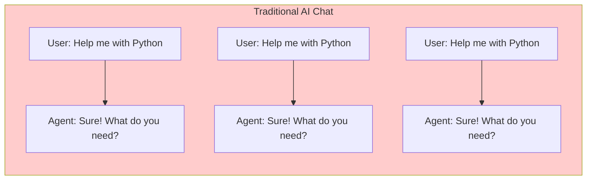
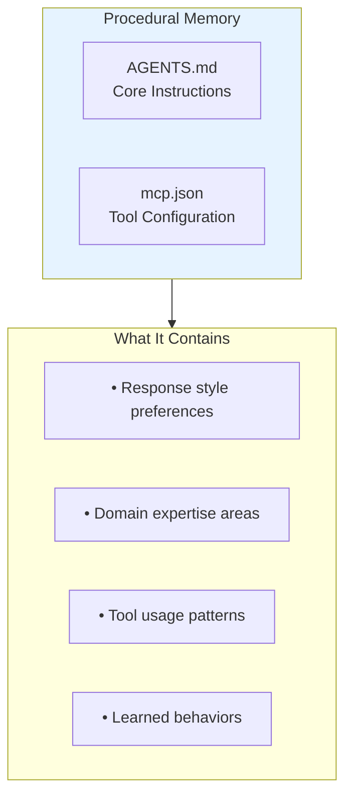
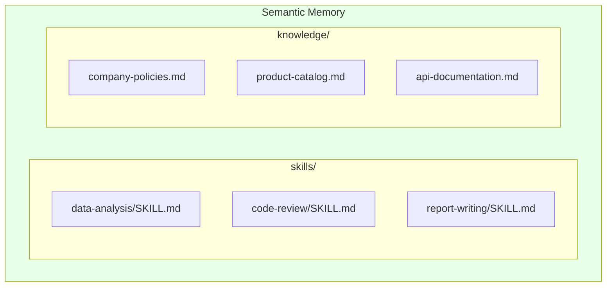
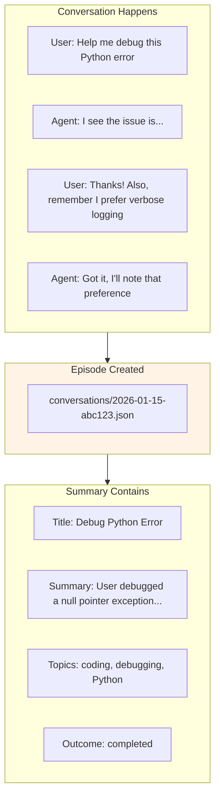
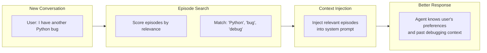
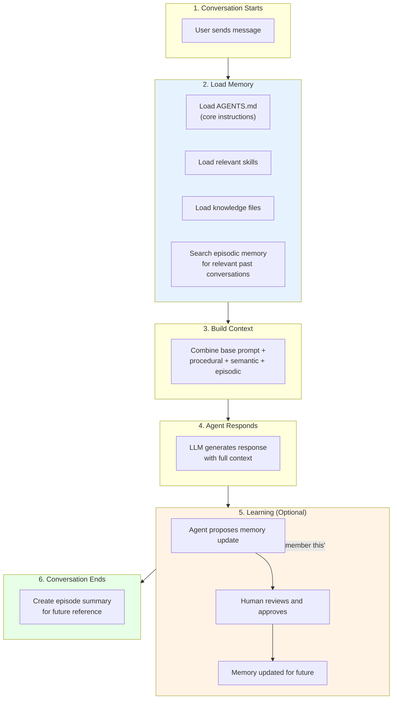
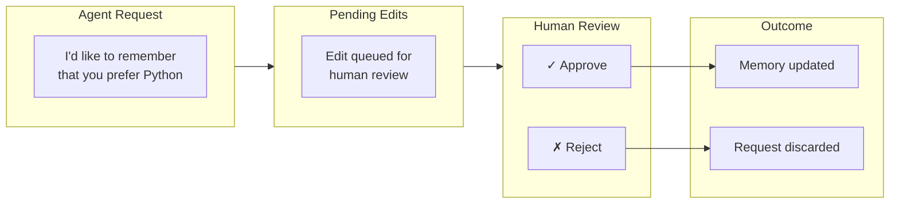
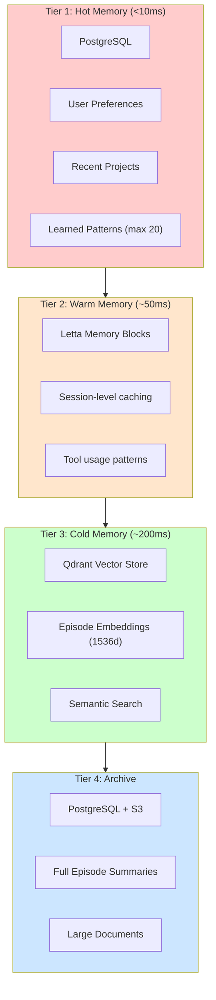
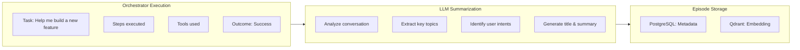
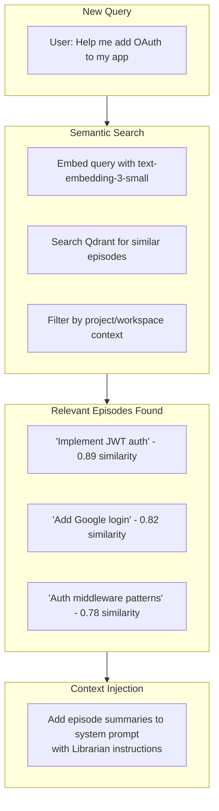

# How AI Agents Learn and Remember: Building a COALA-Inspired Memory System

Have you ever wished your AI assistant could remember that you prefer bullet points over paragraphs? Or recall that debugging session you had last week when you face a similar problem today? Or proactively remind you: "By the way, your team discussed this exact implementation detail last month"?

Most AI chatbots start every conversation with a blank slate. They don't remember your preferences, your past requests, or the context you've built up over dozens of interactions. It's like talking to someone with perpetual amnesia.

We wanted to change that—not just for individual agents, but for our entire Orchestrator system that coordinates multiple agents and tools.

---

## The Problem: AI Agents That Forget Everything

Every time you start a new conversation with a typical AI assistant, you're starting from zero. The agent doesn't know:

- **Your preferences** — Do you like concise answers or detailed explanations?
- **Your context** — What projects are you working on? What tools do you use?
- **Your history** — What did you ask about last week? What worked and what didn't?

This leads to repetitive conversations where you constantly re-explain things. It's frustrating for users and inefficient for everyone.



Every conversation starts fresh. The agent has no memory of past interactions.

---

## Two Memory Systems, One Vision

We built memory at two levels:

1. **Agent Template Memory** — Individual agents remember their specific domain knowledge and user preferences
2. **Orchestrator Memory** — The central AI system that coordinates everything remembers across all your interactions

Think of it like this: each specialist (agent) has their own notes, but there's also an executive assistant (orchestrator) who remembers everything about you and can proactively surface relevant information.

---

## Our Inspiration: LangSmith's Agent Builder

When LangSmith released their Agent Builder with built-in memory, we were intrigued. Their approach was elegant: **expose agent memory as files that the LLM can read and write**.

Instead of complex vector databases or embedding systems, they used a simple metaphor that LLMs already understand—a filesystem:

```
agent-memory/
├── AGENTS.md          # Core instructions
├── skills/            # Specialized knowledge
├── knowledge/         # Facts and context
└── conversations/     # Past interaction summaries
```

This is based on the **COALA framework** (Cognitive Architectures for Language Agents), which models AI memory after human cognition with three types:

1. **Procedural Memory** — How to do things (skills, instructions)
2. **Semantic Memory** — Facts and knowledge (domain information)
3. **Episodic Memory** — Personal experiences (conversation history)

We loved this approach and decided to build our own implementation for Fabric.

---

## Our Architecture: The Three Types of Memory

### 1. Procedural Memory: The Agent's Instruction Manual

Procedural memory stores **how the agent should behave**. Think of it as the agent's instruction manual that evolves over time.



**AGENTS.md** is the heart of procedural memory. It starts with basic instructions from the template and grows as the agent learns:

```markdown
# Agent Instructions

You are a data analysis assistant for Acme Corp.

## User Preferences
- Always respond in bullet points
- Keep explanations under 200 words
- Include code examples when relevant

## Learned Behaviors
- User prefers Python over JavaScript
- Always check for null values first when debugging
- Format dates as YYYY-MM-DD
```

The key insight: **the agent can propose updates to its own instructions**. When a user says "Remember that I prefer Python," the agent can suggest adding that to AGENTS.md.

---

### 2. Semantic Memory: Domain Knowledge

Semantic memory stores **facts and specialized knowledge**. It's organized into two categories:



**Skills** are specialized instruction sets for specific tasks:

```markdown
# Data Analysis Skill

When analyzing data:
1. Always start by checking data types and null values
2. Calculate basic statistics (mean, median, std dev)
3. Look for outliers (values > 2 standard deviations)
4. Create visualizations for trends
5. Summarize findings in 3-5 bullet points
```

**Knowledge** files contain domain-specific facts:

```markdown
# Company Policies

## Code Review Requirements
- All PRs require at least 2 approvals
- Security-sensitive changes need security team review
- Breaking changes require RFC document

## API Rate Limits
- Public API: 100 requests/minute
- Internal API: 1000 requests/minute
```

When the agent encounters a relevant task, it loads the appropriate skills and knowledge into context.

---

### 3. Episodic Memory: Conversation History

This is where it gets interesting. **Episodic memory stores summaries of past conversations**, allowing the agent to remember what you've discussed before.



When a conversation ends, we automatically create a summary:

```json
{
  "id": "episode-abc123",
  "title": "Debug Python null pointer exception",
  "summary": "User requested help debugging a Python script. Found a null pointer exception in the data processing function. Fixed by adding null checks. User mentioned preference for verbose logging.",
  "keyTopics": ["coding", "debugging", "Python"],
  "userIntents": ["fix problem", "remember preference"],
  "toolsUsed": ["code_search", "file_read"],
  "outcome": "completed",
  "messageCount": 12,
  "startedAt": "2026-01-15T10:00:00Z",
  "endedAt": "2026-01-15T10:30:00Z"
}
```

The magic happens when you start a **new conversation**. We search through past episodes to find relevant context:



Now the agent knows you've debugged Python before, what approach worked, and that you prefer verbose logging. It can provide a more personalized, contextual response.

---

## How It All Works Together

Here's the complete flow when you chat with a Fabric agent:



---

## Human-in-the-Loop: Safe Learning

One critical design decision: **agents can't modify their own memory directly**. All changes go through a Human-in-the-Loop (HITL) approval process.



This prevents agents from:
- Learning incorrect information
- Overwriting important instructions
- Making changes the user didn't intend

Users can see all pending edits in the Memory UI and approve or reject each one. For power users who trust their agents, we offer a "YOLO mode" that auto-approves changes.

---

## Orchestrator Memory: The Intelligent Executive Assistant

While Agent Memory handles individual agents, we needed something bigger for our Orchestrator—the central AI system that coordinates multiple agents, tools, and workflows.

The Orchestrator is often the primary interaction point for users. It needed to:

- **Remember user preferences** across all interactions
- **Recall past conversations** and proactively surface relevant context
- **Learn patterns** over time without explicit instructions
- **Act as a "Librarian"** — cross-referencing sources and past discussions
- **Provide "Pushback"** — challenging incomplete requirements based on past experience

### The 4-Tier Hybrid Architecture

We designed a memory system optimized for different access patterns:



**Tier 1 (Hot)** is loaded every single request—it must be fast. User preferences like response style, verbosity, and code language preferences live here.

**Tier 2 (Warm)** handles session-level context using Letta's memory block system.

**Tier 3 (Cold)** is where semantic search happens. We use Qdrant with OpenAI's text-embedding-3-small model (1536 dimensions) to find relevant past conversations.

**Tier 4 (Archive)** stores complete conversation histories and large documents.

### Automatic Episode Creation

Every time you complete a conversation with the Orchestrator, we automatically create an episode:



The summarization uses an LLM to analyze the conversation and extract:

```json
{
  "title": "Implement user authentication with JWT",
  "summary": "User requested help implementing JWT-based authentication. Created auth middleware, token generation utilities, and protected routes. User prefers TypeScript with strict types enabled.",
  "keyTopics": ["authentication", "JWT", "TypeScript", "middleware"],
  "userIntents": ["implement feature", "learn patterns"],
  "outcome": "success",
  "toolsUsed": ["code_search", "file_write", "terminal"],
  "agentsUsed": ["code-assistant"]
}
```

### Intelligent Context Injection

When you start a new conversation, the Orchestrator:

1. **Loads your preferences** from hot memory (response style, verbosity, code language)
2. **Searches episodic memory** using semantic similarity to your query
3. **Injects relevant context** into the system prompt



The Orchestrator can now say: *"I see you implemented JWT authentication last week. Would you like to extend that with OAuth, or start fresh with a different approach?"*

### The Librarian Capability

One of the most powerful features is **proactive context surfacing**. The Orchestrator acts as a "Librarian" that:

- Cross-references past conversations with current queries
- Reminds you of relevant past decisions
- Surfaces related work from team members (in organization context)

Example prompt injection:

```markdown
## Relevant Past Context (Librarian Mode)

You have access to the user's conversation history. When relevant:
- Proactively mention past discussions: "By the way, you discussed X last week..."
- Cross-reference sources: "This relates to your earlier work on Y..."
- Surface related team discussions: "Your team explored a similar approach in Z..."

### Recent Relevant Episodes:
1. **Implement JWT authentication** (3 days ago)
   - Added token generation and middleware
   - User prefers strict TypeScript types
   
2. **Database schema design** (1 week ago)
   - Created User and Session tables
   - Using Prisma with PostgreSQL
```

### The Pushback Capability

The Orchestrator can also challenge incomplete requirements:

```markdown
## Pushback Mode

When requirements seem incomplete, challenge constructively:
- "Last time we discussed auth, you mentioned needing refresh tokens. Should we include those?"
- "Your team's API guidelines require rate limiting. Have you considered that?"
- "This approach differs from your established patterns. Is that intentional?"
```

### Multi-Tenant Isolation

Memory is strictly isolated between:
- **Personal vs Organization** — Your personal AI memory never leaks to org context
- **Organization vs Organization** — Org A's data never visible to Org B

We enforce isolation at two levels:

- **Relational database**: Uses an exclusive-or (XOR) filtering pattern -- queries in organization context filter by organization ID, while personal context queries explicitly require a null organization ID. This prevents any cross-contamination between contexts.
- **Vector database**: Uses physically separate collections for each tenant. Personal and organization episodes never share a collection, making cross-tenant data leakage architecturally impossible.

### Memory Settings UI

Users can configure their Orchestrator memory preferences in Settings:

```
┌─────────────────────────────────────────────────────────────┐
│ AI Memory Settings                                           │
├─────────────────────────────────────────────────────────────┤
│                                                              │
│ Response Preferences                                         │
│ ┌─────────────────────────────────────────────────────────┐ │
│ │ Response Format    [Auto (context-aware)      ▼]        │ │
│ │ Verbosity Level    [Standard                  ▼]        │ │
│ │ Code Language      [TypeScript                ▼]        │ │
│ └─────────────────────────────────────────────────────────┘ │
│                                                              │
│ Learned Patterns (12)                      [Clear All]       │
│ • Prefers bullet points over paragraphs                      │
│ • Uses Prisma for database access                            │
│ • Writes tests before implementation                         │
│                                                              │
│ Conversation Memory (47 episodes)                            │
│ ┌─────────────────────────────────────────────────────────┐ │
│ │ Today                                                   │ │
│ │   • Implement OAuth flow              [auth, OAuth]     │ │
│ │ Yesterday                                               │ │
│ │   • Debug deployment issue            [devops, CI/CD]   │ │
│ │   • Review PR #234                    [code-review]     │ │
│ └─────────────────────────────────────────────────────────┘ │
└─────────────────────────────────────────────────────────────┘
```

---

## The Agent Memory UI

For **Agent Templates**, we built a file-browser interface for managing agent memory:

```
┌─────────────────────────────────────────────────────────────┐
│ Agent Memory                                    [Export] [↻] │
├─────────────────────────────────────────────────────────────┤
│ [Files] [Pending (3)]                                        │
├─────────────────────────────────────────────────────────────┤
│ 📁 skills/                    │ # AGENTS.md                  │
│   📄 data-analysis/SKILL.md   │                              │
│   📄 code-review/SKILL.md     │ You are a helpful assistant  │
│ 📁 knowledge/                 │ for Acme Corp.               │
│   📄 company-policies.md      │                              │
│ 📁 conversations/             │ ## User Preferences          │
│   📄 2026-01-15-abc.json      │ - Bullet point responses     │
│   📄 2026-01-14-def.json      │ - Python over JavaScript     │
│ 📄 AGENTS.md ◀                │                              │
│ 📄 mcp.json                   │ [Save] [Delete]              │
└─────────────────────────────────────────────────────────────┘
```

Users can:
- **Browse** all memory files in a tree view
- **Edit** any file with syntax highlighting
- **Review** pending agent-proposed changes
- **Export** all memory as JSON for backup
- **Import** memory from another agent

This file-browser approach works great for **Agent Templates** because they have structured knowledge (skills, instructions, domain facts) that users want to directly edit and manage.

The **Orchestrator Memory** takes a different approach - it's not file-based. Instead, it automatically manages:
- User preferences (configured via Settings)
- Episodic memory (automatically created from conversations)
- Learned patterns (accumulated over time)

You don't manually edit Orchestrator memory files - you configure preferences and let the system learn from your interactions.

---

## Real-World Impact

Here's what agent memory enables:

### Before Memory
```
User: Help me analyze this sales data
Agent: Sure! What format is the data in? What metrics are you interested in?
        What tools do you have available?

[5 messages later, agent finally understands the context]
```

### After Memory
```
User: Help me analyze this sales data
Agent: I'll analyze this using our standard approach:
       1. Check for null values (I know you've had issues with these before)
       2. Calculate YoY growth (your usual metric)
       3. Export to the format you prefer (CSV with headers)
       
       I see this is similar to the Q3 analysis we did last week. 
       Should I use the same visualization approach?
```

The agent remembers:
- Your data quality preferences
- Metrics you typically care about
- Export format preferences
- Past similar analyses

---

## Technical Implementation

For the technically curious, here's how we built it:

### Agent Memory Storage Layer
- **PostgreSQL** with a virtual filesystem model
- Each file is a row with `path`, `content`, `fileType`, and `version`
- Full tenant isolation (personal vs organization data never mix)

### Agent Memory Types

The system supports several memory file types, each serving a distinct purpose:
- **Core instructions** (AGENTS.md) -- The agent's primary behavior configuration
- **Tool configuration** -- MCP server and tool settings
- **Skills** -- Specialized instruction sets for specific tasks
- **Knowledge** -- Domain-specific facts and reference material
- **Conversations** -- Episode summaries from past interactions
- **Custom** -- User-defined files for anything else

### Orchestrator Memory Schema

The Orchestrator's memory is organized into two complementary storage models:

**Preference Memory** (hot, loaded every request):
- User and organization context for tenant isolation
- Response style preferences (detailed, concise, bullet points)
- Verbosity level and preferred code language
- Recent project references for quick context
- Accumulated learned patterns from past interactions

**Episodic Memory** (searchable conversation history):
- Conversation metadata (title, summary, timestamps)
- Key topics and user intents extracted from each conversation
- Outcome tracking (success, partial, failure)
- References to tools and agents used during the conversation
- Link to the vector embedding for semantic search

### Vector Store Integration

Episodic memory uses a vector database for semantic search, with two key operations:

**Storing episodes**: When a conversation ends, we generate an embedding from the episode summary and key topics, then store it in a tenant-isolated vector collection. Personal and organization episodes are kept in physically separate collections to ensure strict data isolation.

**Searching episodes**: When a new conversation starts, we embed the user's query and search for similar past episodes. The search uses a similarity threshold (0.7) to avoid surfacing irrelevant matches, and returns the top 5 most relevant episodes with their metadata.

### LLM-Powered Summarization

When a conversation ends, we use a fast, cost-effective language model to analyze the full conversation and extract structured metadata:

- **Title**: A concise 5-10 word title capturing the main topic
- **Summary**: A 2-3 sentence overview of what happened
- **Key topics**: 3-7 concrete nouns for categorization and search
- **User intents**: What the user was trying to accomplish
- **Outcome**: Whether the task was completed successfully, partially, or failed

This structured extraction is what makes episodic memory searchable and useful for future context injection.

### Memory Evaluation System

We built tools to measure memory effectiveness:

The evaluation system tracks metrics like whether preferences are configured, how many patterns have been learned, total and recent episode counts, average relevance scores for retrieved episodes, and the success rate across conversations. Based on these metrics, it generates actionable recommendations such as:

- "Set a preferred response style for more personalized responses"
- "Continue using Fabric AI to build up conversation history"
- "Try providing more specific instructions to improve success rate"

---

## What's Next

We're excited about where this is heading:

1. **Memory Sharing** — Share knowledge between related agents in a team
2. **Memory Analytics Dashboard** — Visualize what the AI has learned over time
3. **Episode Timeline** — Browse past conversations with full context
4. **Memory Export/Import** — Backup and restore memory across accounts
5. **Proactive Learning** — AI suggests preferences to save based on behavior patterns

---

## Try It Yourself

Both memory systems are available now in Fabric.

### For Agent Memory:
1. Go to **Agent Templates** and open any agent
2. Click the **Memory** button
3. Click **Initialize** to create base memory from the template
4. Start chatting—the agent will learn and remember!

### For Orchestrator Memory:
1. Go to **Settings > AI Memory** (personal or organization)
2. Set your preferred response style, verbosity, and code language
3. Start using the Orchestrator—it will automatically create episodes
4. Watch as it starts surfacing relevant context from past conversations

Your AI assistants will start remembering your preferences, building up conversation history, and providing increasingly personalized, context-aware assistance over time.

Because the best AI assistant isn't just smart—it's one that actually knows you, remembers your past work, and proactively helps you connect the dots.

---

*Want to learn more about how Fabric's Orchestrator works? Check out our posts on [Intelligent Tool Search](/blog/intelligent-tool-search-orchestrator) and [Multi-Agent Orchestration](/blog/fabric-orchestrator-temporal-multi-agent-orchestration).*
