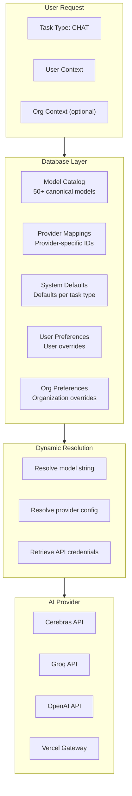
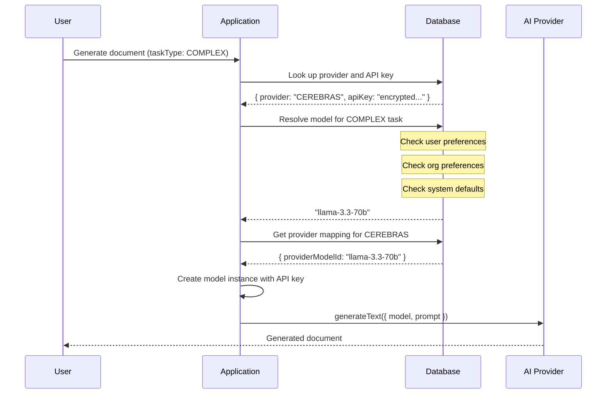
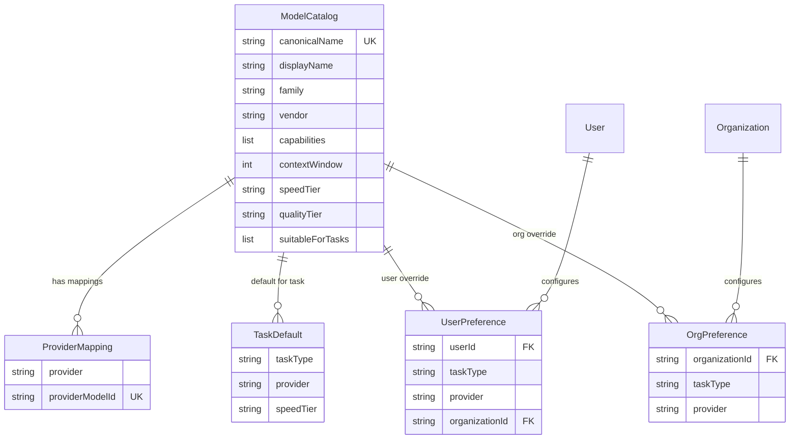

# Building a Production-Grade Database-Driven AI Model Selection System

When building enterprise AI applications, one of the most critical architectural decisions is **how to manage AI model selection at scale**. After months of iteration, we've arrived at a system that eliminates hardcoded models entirely, provides strict tenant isolation, and enables users to switch providers without code changes.

## The Problem with Hardcoded Models

Most AI applications start with hardcoded model names scattered throughout the codebase:

```typescript
// ❌ The old way - hardcoded everywhere
const model = getModel("gpt-4o");
const chatModel = getModel("llama-3.3-70b-versatile");
const toolModel = getModel("openai/gpt-oss-120b");
```

This approach creates several critical problems:

1. **Configuration drift**: Model names duplicated across 50+ files
2. **Provider lock-in**: Switching providers requires code changes
3. **No user control**: Users can't choose their preferred models
4. **Silent failures**: Hardcoded fallbacks mask configuration errors
5. **Tenant isolation issues**: Personal and organization contexts share models
6. **Deployment complexity**: Model changes require code deployments

## Our Solution: Database-Driven Model Catalog

We built a system where **every AI model configuration lives in the database**. No hardcoded models. No fallbacks. No exceptions.

This post walks through the architecture that powers Fabric's production AI infrastructure.

---

## Architecture Overview: Database as Single Source of Truth

The system is built on five core database tables that form a complete AI model catalog:



### Core Principles

1. **Zero hardcoded models**: Every model name comes from the database
2. **Strict tenant isolation**: Personal and organization contexts are completely separate
3. **Clear preference hierarchy**: User Override → Org Override → System Default → Error
4. **No silent fallbacks**: Throws clear errors if configuration is missing
5. **Provider flexibility**: Switch providers without code changes
6. **Single source of truth**: All provider metadata centralized in one module

---

## Centralized Provider Configuration

One of the most important architectural decisions was **eliminating all duplicated provider configuration**. In many AI applications, provider metadata ends up scattered across multiple files—display names here, capability flags there, URL mappings somewhere else. This leads to configuration drift and bugs when providers are added or modified.

### The Problem with Scattered Configuration

Before centralization, we had provider information duplicated in three places:
- Backend API handlers
- Frontend settings components
- Model resolution logic

When we added a new provider or changed a capability flag, we had to update multiple files and hope we didn't miss one. Inevitably, bugs crept in—providers showing as "embedding capable" in the UI but failing at runtime.

### The Single Source of Truth Approach

We consolidated all provider metadata into a centralized configuration module. This module defines:

**Provider Categories**: Gateways (Vercel, OpenRouter, Cloudflare), cloud platforms (Azure, AWS, Google), direct providers (OpenAI, Anthropic, Groq, Cerebras, etc.), and special providers (Hybrid, Custom).

**Provider Metadata**: Display names, descriptions, and capability flags for all 21 supported providers.

**Capability Functions**: Helper functions that answer questions like "Can this provider support embedding models?" or "Is this a gateway provider?"

### The Frontend/Backend Split

One interesting challenge: frontend client components can't import from the backend database package because it pulls in server-side dependencies (ORM libraries, database drivers). These don't run in the browser.

Our solution is a two-file architecture:
- **Backend module**: The authoritative source in the database package
- **Frontend module**: A client-safe copy in the web app's settings module

Both files define the same constants and functions. When we add a new provider, we update both. It's a small trade-off for the benefit of having clean, importable helper functions on both sides.

### Benefits of Centralization

**Before:**
- 250+ lines duplicated across 3 files
- Provider capabilities scattered across codebase
- Easy to miss updates when adding providers
- Runtime capability bugs from inconsistent data

**After:**
- Single source of truth (+ frontend copy for browser)
- Centralized capability functions
- Clear update checklist for new providers
- Compile-time type safety

This architecture makes adding new providers straightforward: update the centralized config, mirror to frontend, and everything just works.

---

## The AI Model Catalog: Single Source of Truth

At the heart of the system is a **single source of truth** for all AI model definitions: a centralized catalog module. This defines every model, its capabilities, and provider-specific mappings in one place.

### Why a Single Source of Truth Matters

Before implementing the catalog, we had model names scattered across:
- Database seed scripts
- API handlers
- Agent configurations
- Frontend components
- External service integrations (Fabric AI, MCP sampling)

This led to bugs when providers changed model names (like Groq renaming `llama3-70b` to `llama-3.3-70b-versatile`) and made it impossible to validate model configurations at build time.

### The Catalog Architecture

The catalog defines every model as a structured entry with:

- **Canonical name**: A normalized identifier (e.g., `llama-3-3-70b`) used throughout the application
- **Metadata**: Display name, description, vendor, model family, capabilities, context window, and speed/quality tiers
- **Task suitability**: Which task types (SIMPLE, COMPLEX, CHAT, TOOL_CALLING, REASONING) the model is appropriate for
- **Provider mappings**: The provider-specific model ID for each supported provider -- this is the key to automatic provider switching

For example, Llama 3.3 70B has different model IDs on each provider (Groq uses `llama-3.3-70b-versatile`, Cerebras uses `llama-3.3-70b`, Together AI uses a fully-qualified namespace). The catalog stores all of these so the system can automatically resolve the correct ID.

The catalog also defines **default models per task type** and **per-provider defaults** so that every task type has an optimized model regardless of which provider the user selects.

### Helper Functions for Application Code

The catalog exports helper functions that eliminate hardcoded model names throughout the codebase:

- **Default model lookup**: Get the default model for any task type as a compile-time constant (e.g., CHAT defaults to `gpt-4o`)
- **Provider-specific ID resolution**: Given a canonical name and a provider, return the correct model ID (e.g., `llama-3-3-70b` on Groq becomes `llama-3.3-70b-versatile`, on Cerebras becomes `llama-3.3-70b`)
- **User-friendly alias resolution**: Short aliases like "claude" resolve to the full canonical name `claude-sonnet-4-5`, and "llama-70b" resolves to `llama-3-3-70b`
- **Capability inspection**: Query any model's capabilities (vision, reasoning, tool calling, etc.) using either its canonical or provider-specific ID

### Build-Time Validation

We run validation tests on every build to ensure model names are valid for each provider. The test suite validates all model-provider combinations and reports the count of valid mappings per provider (e.g., 11 models for OpenAI, 9 for Groq, 4 for Cerebras, 22 for Vercel Gateway, and so on).

This catches issues like:
- Typos in model names
- Deprecated models
- Missing provider mappings
- Invalid capability combinations

### Usage Across the Codebase

The catalog is now used everywhere models are referenced:

| Area | Usage |
|--------|-------|
| AI SDK integration | Dynamic model resolution with metadata and usage tracking |
| Content processing | Default models for pattern execution (summarize, analyze, etc.) |
| MCP protocol | Model selection for MCP sampling requests |
| Agent templates | Suggested models for new agent configurations |
| Frontend components | Model picker dropdowns and capability display |

---

## Database Design

The catalog data is seeded into five interconnected database tables.

### Provider-Specific Model Mappings

The same canonical model has different IDs on different providers. A dedicated provider mapping table handles this translation automatically.

**Example: Llama 3.3 70B across providers**
- **Canonical name:** `llama-3.3-70b`
- **Cerebras:** `llama-3.3-70b`
- **Groq:** `llama-3.3-70b-versatile`
- **Vercel Gateway:** `groq/llama-3.3-70b-versatile`

**Example: GPT-4o (only available via gateway)**
- **Canonical name:** `gpt-4o`
- **Cerebras:** *not available*
- **Groq:** *not available*
- **Vercel Gateway:** `openai/gpt-4o`

This mapping layer is what enables seamless provider switching—users change their provider in Settings, and the system automatically resolves to the correct model ID.

For example, the Llama 3.3 70B model has these provider-specific mappings:

| Provider | Provider-Specific Model ID |
|----------|---------------------------|
| Cerebras | `llama-3.3-70b` |
| Groq | `llama-3.3-70b-versatile` |
| Vercel Gateway | `groq/llama-3.3-70b-versatile` |

When a user switches from Groq to Cerebras, the system automatically selects the correct provider-specific model ID. **No code changes required.**

---

## Dynamic Model Resolution Flow

When a user makes an AI request, the system dynamically resolves the model configuration:



### Preference Hierarchy

The system follows a strict three-level hierarchy:

1. **User Override** (user preference table)
   - User's explicit choice for this task type + provider
   - Highest priority
   - Example: User wants GPT-4o for CHAT tasks on OpenAI

2. **Organization Override** (organization preference table)
   - Organization's default for this task type + provider
   - Only applies in organization context
   - Example: Org mandates Claude Sonnet 4.5 for all COMPLEX tasks

3. **System Default** (task defaults table)
   - Provider-specific defaults seeded from database
   - Example: Cerebras defaults to llama-3.3-70b for CHAT

4. **Error** (NO hardcoded fallbacks)
   - Throws clear error: "No model configured for CEREBRAS + TOOL_CALLING"
   - Prevents silent failures with wrong models

---

## Task Types and System Defaults

The task defaults table defines optimized models for each task type per provider. Here's how the defaults are configured:

**SIMPLE** — Fast tasks like title generation and summarization
- Cerebras: `llama3.1-8b` | Groq: `llama-3.1-8b-instant` | OpenAI: `gpt-4o-mini`

**COMPLEX** — Detailed generation like documents and analysis
- Cerebras: `llama-3.3-70b` | Groq: `llama-3.3-70b-versatile` | OpenAI: `gpt-4o`

**CHAT** — Conversational AI
- Cerebras: `llama-3.3-70b` | Groq: `llama-3.3-70b-versatile` | OpenAI: `gpt-4o`

**TOOL_CALLING** — Function calling and MCP tools
- Cerebras: `gpt-oss-120b` | Groq: `openai/gpt-oss-120b` | OpenAI: `gpt-4o`

**REASONING** — Deep analysis and problem-solving
- Cerebras: `gpt-oss-120b` | Groq: `deepseek-r1-distill-llama-70b` | OpenAI: `o1`

**EMBEDDING** — Vector generation for RAG
- All providers: `text-embedding-3-small`

**IMAGE / AUDIO** — Media generation and transcription
- Image: `dall-e-3` | Audio: `whisper-1`

### Why Different Models for Different Tasks?

**SIMPLE tasks** use smaller, faster models (8B parameters) for quick responses:
- Title generation
- Text summarization
- Simple Q&A

**COMPLEX tasks** use larger, more capable models (70B+ parameters):
- Document generation
- Detailed analysis
- Code generation

**TOOL_CALLING tasks** require models with reliable function calling:
- `gpt-oss-120b`: OpenAI's open-source model with native tool calling
- Available on Groq and Cerebras for fast inference
- More reliable than Llama models for structured outputs

**REASONING tasks** use specialized models:
- DeepSeek R1: Chain-of-thought reasoning
- OpenAI o1: Advanced problem-solving

---

## Strict Tenant Isolation

One of the most critical aspects of the system is **strict tenant isolation** between personal and organization contexts.

### The XOR Pattern

Every database query uses an **exclusive OR (XOR) pattern** to ensure data never leaks between contexts:

The XOR pattern works like this in pseudocode:

```
// CORRECT - XOR pattern
if organizationId exists:
  filter = { organizationId, userId }      // Org context
else:
  filter = { organizationId: NULL, userId } // Personal context (NULL is REQUIRED)

query userModelPreferences WHERE filter

// WRONG - Leaks data between contexts
query userModelPreferences WHERE userId = X OR organizationId = Y  // NEVER DO THIS
```

The critical insight is that personal context queries must explicitly check for `organizationId = NULL`. Without this, a query could accidentally return organization-scoped preferences in a personal context.

### Context-Aware Model Resolution

When resolving models, the system always includes the tenant context:

When resolving models, every API call includes the tenant context:

- **Personal context**: The resolver is called with the user ID and an explicitly null organization ID, ensuring only personal preferences and system defaults are considered
- **Organization context**: The resolver is called with both user ID and organization ID, enabling organization-level overrides to take effect

This ensures:
- User's personal models are NEVER visible in org context
- Org A's models are NEVER visible to Org B
- No accidental data leakage between tenants

---

## Real-World Example: Switching Providers

Let's walk through what happens when a user switches from Groq to Cerebras.

### Initial State (Groq)

The user has Groq configured as their default provider with an encrypted API key. The system defaults resolve to:
- CHAT: `llama-3.3-70b-versatile`
- TOOL_CALLING: `openai/gpt-oss-120b`
- COMPLEX: `llama-3.3-70b-versatile`

### User Changes Provider in Settings

The user navigates to Settings > AI Providers and selects Cerebras as their default provider.

### New State (Cerebras)

The system automatically resolves to Cerebras-specific model IDs:
- CHAT: `llama-3.3-70b`
- TOOL_CALLING: `gpt-oss-120b`
- COMPLEX: `llama-3.3-70b`

### What Changed Automatically

1. **Provider-specific model IDs**: `llama-3.3-70b-versatile` → `llama-3.3-70b`
2. **Base URL**: Groq API → Cerebras API
3. **API key**: Groq key → Cerebras key
4. **Model format**: Gateway format → Direct format

**Zero code changes. Zero configuration files. Everything from the database.**

---

## Implementation: Core Functions

The system exposes a small set of core functions that application code uses to work with AI models:

### 1. Get Configured Model String

The primary function for resolving models. Given a task type and tenant context, it walks the preference hierarchy (user override, org override, system default) and returns the appropriate model string. For Cerebras, this might return `llama-3.3-70b`; for Vercel Gateway, `openai/gpt-4o`. If no configuration is found, it throws an actionable error instead of silently falling back.

### 2. Resolve Model with Provider

A higher-level function that returns the complete model configuration: the provider-specific model string, the provider type, the encrypted API key, and the base URL. It can also validate capabilities -- for example, ensuring the resolved model actually supports tool calling before returning it for a TOOL_CALLING task.

### 3. Create Model Instance

Takes the resolved configuration and creates a ready-to-use language model instance compatible with the Vercel AI SDK. This handles the differences between provider APIs (OpenAI-compatible, Anthropic, etc.) behind a unified interface.

### 4. Execute AI Operation

With the model instance in hand, application code uses the standard AI SDK to generate text, stream responses, or call tools -- completely decoupled from the model selection logic.

---

## Complete End-to-End Example

Here's what happens when a document generation request flows through the system:

1. The application calls a centralized entry point with just two pieces of information: the task type (`COMPLEX`) and the tenant context (user ID + optional organization ID)
2. The entry point resolves the model, retrieves credentials, and returns a ready-to-use model instance along with a usage tracking callback
3. The application generates the document using the standard AI SDK
4. After generation completes, usage is tracked asynchronously (fire-and-forget)

### What Happens Under the Hood

1. **Provider lookup**: Queries the provider credentials table for the user's default provider
2. **Model resolution**: Walks the preference hierarchy (user override, org override, system default)
3. **Provider mapping**: Looks up the provider-specific model ID from the mapping table
4. **Model creation**: Creates the appropriate SDK instance (OpenAI, Anthropic, Groq, etc.)
5. **API call**: Executes with the correct base URL, API key, and model ID

**All of this happens dynamically at runtime. No hardcoded models. No configuration files.**

---

## Database Schema

The system is built on five interconnected tables:



### Table Descriptions

**Model Catalog**: Canonical model definitions
- 50+ models from OpenAI, Anthropic, Meta, Google, DeepSeek, etc.
- Includes capabilities, context window, speed/quality tiers
- Seeded from a centralized catalog definition

**Provider Mappings**: Provider-specific model IDs
- Maps canonical names to provider-specific IDs
- Example: `llama-3.3-70b` maps to `llama-3.3-70b-versatile` on Groq
- Enables automatic provider switching

**Task Defaults**: System defaults per task type
- Optimized models for each task type per provider
- Example: Cerebras + CHAT defaults to llama-3.3-70b
- Seeded with production-tested defaults

**User Preferences**: User overrides
- User's explicit choice for task type + provider
- Tenant-isolated (personal vs organization contexts)
- Highest priority in resolution

**Organization Preferences**: Organization overrides
- Organization's default for task type + provider
- Only applies in organization context
- Second priority in resolution

---

## Migration from Hardcoded Models

We completed a major refactoring to eliminate all hardcoded models and duplicated provider configuration. This was one of the most impactful architectural changes we made.

### The State Before Migration

Our codebase had accumulated technical debt in several forms:

**Hardcoded model names everywhere**: Over 100 instances of model names like "gpt-4o" or "llama-3.3-70b-versatile" scattered across 50+ files. When OpenAI deprecated a model or Groq changed their naming convention, we had to hunt through the entire codebase.

**Duplicated provider metadata**: The same 250+ lines of provider configuration existed in three different files. Adding a new provider meant updating all three and hoping you didn't miss anything.

**Silent fallbacks masking errors**: When a model wasn't configured, the system would silently fall back to a hardcoded default. Users had no idea they were getting the wrong model.

### The Migration Strategy

We took a systematic approach:

1. **Audit**: Found and cataloged every hardcoded model and provider constant
2. **Centralize**: Created the single-source-of-truth modules for provider configuration
3. **Database**: Moved all model defaults to database tables with proper seeding
4. **Validate**: Added capability validation (like embedding support checks)
5. **Error**: Replaced silent fallbacks with clear, actionable error messages

### The Results

**Before → After:**

- **Hardcoded models:** 100+ instances → 0
- **Deprecated constants:** 5 major constants → 0
- **Duplicated provider config:** 250+ lines × 3 files → 2 files (backend + frontend)
- **Provider metadata:** Scattered → Single source of truth
- **Provider switching:** Requires code changes → Automatic
- **Tenant isolation:** Partial → Complete
- **Error handling:** Silent fallbacks → Clear errors
- **Embedding validation:** Manual runtime checks → Centralized capability functions

The most satisfying outcome: adding a new provider now takes minutes instead of hours, and we haven't had a "wrong model" bug since the migration.

---

## Adding a New AI Provider

The system is designed to make adding new providers straightforward—a direct benefit of the centralized architecture.

### The Seven-Step Process

1. **Schema**: Add the new provider to the database enum
2. **Backend Config**: Add provider metadata to the centralized configuration module (category, display name, description, capabilities)
3. **Frontend Config**: Mirror the same metadata in the client-safe module
4. **Base URL**: Configure the API endpoint if using OpenAI-compatible protocol
5. **Model Mappings**: Add provider-specific model IDs to the seed script
6. **Task Defaults**: Configure which models to use for each task type
7. **Database Seed**: Run the seeding command to populate the database

### What Makes This Fast

The key insight is that most of this is **configuration, not code**. You're not writing new API handlers or modifying business logic—you're just declaring metadata and mappings.

For an OpenAI-compatible provider (which most are these days), the entire process takes about 15 minutes:
- 5 minutes to add the schema and config entries
- 5 minutes to configure model mappings
- 5 minutes to seed and test

### No Deployment Required

Once the database is seeded, users can immediately:
- Select the new provider in their Settings
- Configure their API key
- Start using it for all task types

The application code doesn't need to change. The provider routing, model resolution, and API key management all work automatically because they're driven by database configuration, not hardcoded logic.

---

## Production Lessons Learned

### 1. Eliminate All Hardcoded Values

Every hardcoded model name was a potential bug. We found 100+ instances scattered across the codebase. The database-driven approach eliminated all of them.

**Key insight**: If it can change, it belongs in the database, not in code.

### 2. Fail Loudly, Not Silently

Hardcoded fallbacks masked configuration errors. Users would get wrong models without knowing why.

```typescript
// ❌ Bad: Silent fallback
const model = modelString ?? "gpt-4o";  // User has no idea this happened

// ✅ Good: Clear error
if (!modelString) {
  throw new Error(
    "No model configured for CEREBRAS + TOOL_CALLING. " +
    "Please configure in Settings > AI Providers."
  );
}
```

### 3. Tenant Isolation is Non-Negotiable

We had several bugs where personal models leaked into organization contexts. The XOR pattern eliminated all of them.

**Key insight**: Use `organizationId: null` explicitly for personal context. Never use OR patterns.

### 4. Provider Compatibility Must Be Validated

Returning `groq/gpt-4o` when the user has Groq configured is wrong -- GPT-4o isn't available on Groq. The provider mapping table ensures only compatible models are returned.

### 5. Database Seeding is Critical

The system is only as good as its seed data. We invested heavily in comprehensive seed scripts with:
- 50+ canonical models
- Provider mappings for all major providers
- Optimized task defaults per provider
- Production-tested configurations

### 6. Clear Error Messages Save Time

Instead of generic "Model not found" errors, we provide actionable messages:

```
Error: No model configured for provider "CEREBRAS" and task "TOOL_CALLING".

To fix:
1. Ensure the AI model catalog has been seeded for your environment
2. Or configure a custom model in Settings > AI Providers
```

---

## User Experience: Settings UI

Users configure their AI providers through a clean Settings interface:

### 1. Select Default Provider

```
Settings > AI Providers > Default Provider

[ ] OpenAI Direct
[ ] Anthropic Direct
[x] Cerebras
[ ] Groq
[ ] Vercel AI Gateway
[ ] OpenRouter
```

### 2. Configure API Key

```
Cerebras API Key: [••••••••••••••••••••] [Save]

Get your API key: https://cloud.cerebras.ai/
```

### 3. Optional: Override Models per Task Type

```
Advanced Settings > Model Overrides

Task Type: CHAT
Provider: Cerebras
Model: [llama-3.3-70b ▼]
       - llama-3.3-70b (Default)
       - llama3.1-8b
       - gpt-oss-120b

[Save Override]
```

### 4. Organization Settings (Admins Only)

Organization admins can set defaults for all members:

```
Organization Settings > AI Providers

Default Provider: Cerebras
Organization API Key: [••••••••••••••••••••]

Model Overrides:
- CHAT: llama-3.3-70b
- COMPLEX: llama-3.3-70b
- TOOL_CALLING: gpt-oss-120b

[Save Organization Defaults]
```

---

## Performance and Reliability

### Database Query Optimization

All model resolution queries are optimized with:
- Indexed lookups on `userId`, `organizationId`, `taskType`, `provider`
- Single query to resolve model (no N+1 problems)
- Cached provider configurations (Redis)

### Error Handling

The system handles errors gracefully:

When model resolution fails, the error is caught and transformed into a user-friendly message with a direct link to the Settings page where they can configure their AI provider. This turns a cryptic "model not found" error into an actionable next step.

### Monitoring

We track:
- Model resolution time (avg: 5ms)
- Provider API latency
- Error rates per provider
- Cost per model per user

---

## What's Next?

### Planned Enhancements

1. **Cost-based routing**: Automatically select cheaper providers for simple tasks
2. **Latency optimization**: Route based on real-time response time metrics
3. **Usage analytics**: Detailed per-user and per-provider cost tracking
4. **Model quality evaluation**: A/B testing framework for model comparison
5. **Automatic failover**: Fallback to secondary provider if primary fails
6. **Rate limit handling**: Automatic retry with exponential backoff

### Future Provider Support

- **Google Vertex AI**: Enterprise-grade AI with data residency
- **Azure OpenAI**: Microsoft's managed OpenAI service
- **AWS Bedrock**: Amazon's managed AI service
- **Replicate**: Community models and fine-tuned variants

---

## Conclusion

Building a production-grade AI model selection system requires careful attention to:

1. **Zero hardcoded values**: Everything in the database
2. **Strict tenant isolation**: XOR pattern for personal vs organization contexts
3. **Clear error handling**: Fail loudly with actionable messages
4. **Provider flexibility**: Switch providers without code changes
5. **User control**: Let users choose their models and providers

The database-driven approach eliminated 100+ hardcoded models, improved tenant isolation, and made adding new providers trivial. Most importantly, it gave users complete control over their AI infrastructure.

---

*To learn more about configuring AI providers, visit our documentation.*
