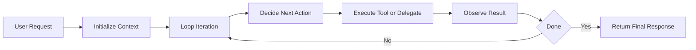
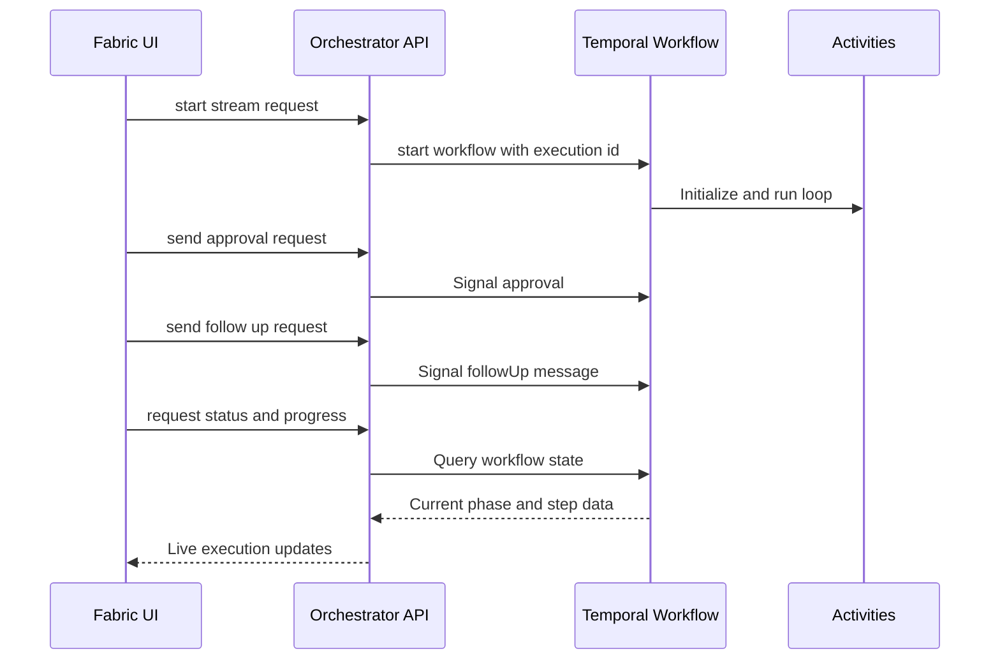
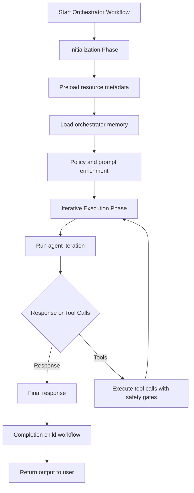
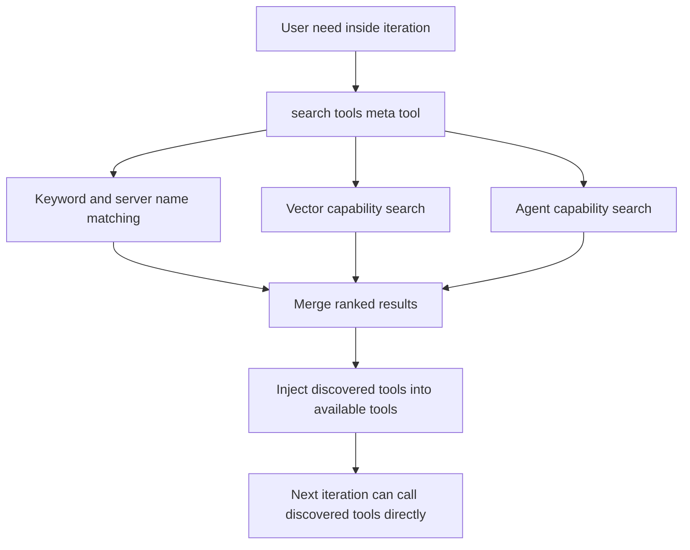
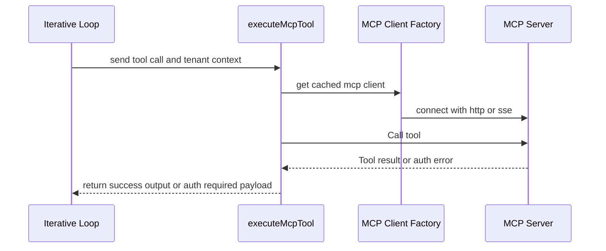
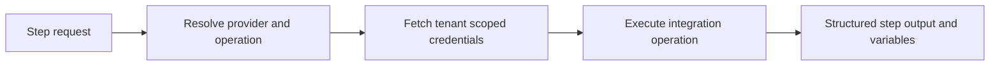
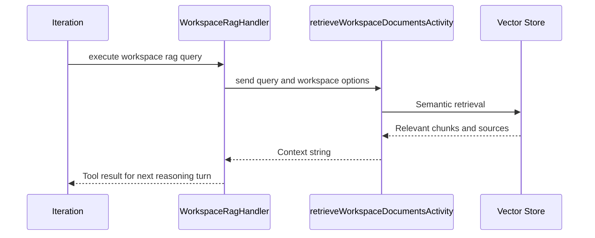
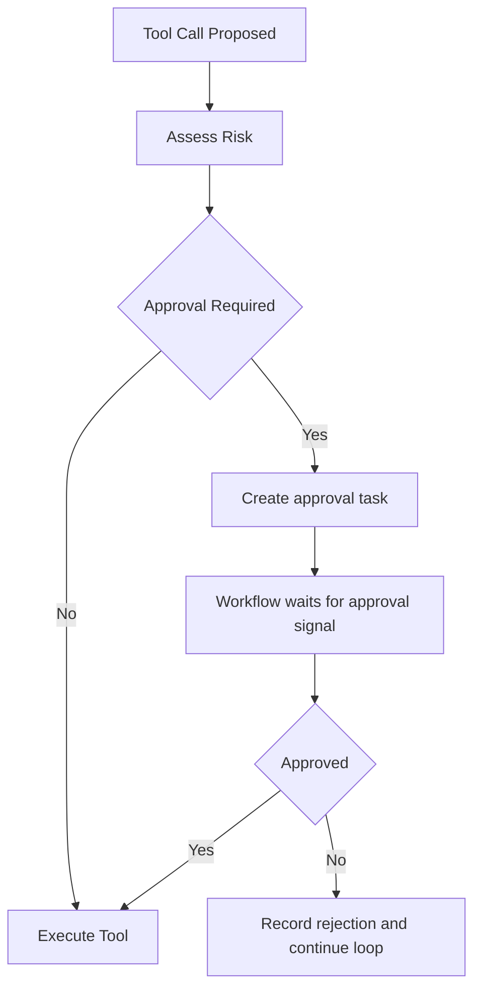
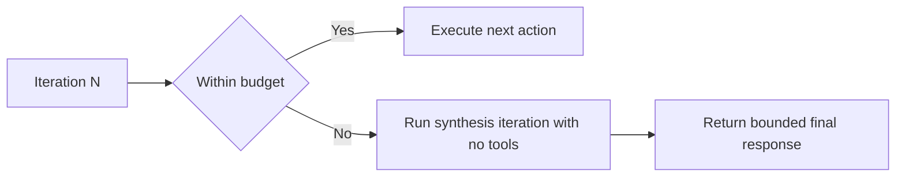
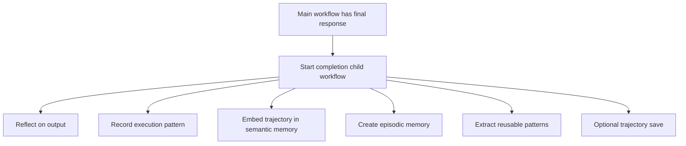

# Building a Dynamic Agent Loop with Temporal: Durable Orchestration for Tools, Workflows, and Workspaces

The breaking point was not a model hallucination.

It was a perfectly reasonable workflow:

- read project context from a workspace
- draft a rollout plan
- create tickets in the PM tool
- post a summary to Slack

The agent did the first two steps well. Then the PM tool call failed on auth refresh. The user sent a follow-up while it was retrying. By the time we recovered, the original plan was stale, the user intent had changed, and the system had no clean way to adapt.

Nothing was "wrong" with the LLM.
Our orchestration model was wrong.

That was the shift: stop treating execution like a static script, and treat it like a **durable control loop**.

---

## The Reality of Production Agent Work

Single-agent demos look linear.
Production systems are not.

In practice, every run has moving parts:

- tool availability changes mid-run
- OAuth states change mid-run
- user intent changes mid-run
- the best next action is often unknown until you inspect previous results

So "plan once, execute once" becomes brittle fast.

The design we moved to is simple conceptually:

1. Observe state.
2. Decide next action.
3. Execute safely.
4. Incorporate result.
5. Repeat until done.

That loop is where Temporal changed everything for us.

---

## Why Temporal Changed the Architecture

We run the orchestrator as `orchestratorExecutionWorkflow` on `fabric-orchestrator`.

Temporal gives us the properties this loop needs:

- **durability**: workflow state survives restarts and deploys
- **control**: live signals for `approval`, `followUp`, `cancel`
- **observability**: queryable workflow state (`progress`, `status`, `plan`, `pendingApproval`)
- **determinism**: predictable behavior under retries and replay

That control model sounds subtle, but it changes behavior radically: the workflow is no longer a black box behind an API poller. It is a live, addressable process.

---

## The Workflow We Actually Run

For current Fabric orchestrator runs, iterative execution is the default for all modes except `save_reuse` (which keeps upfront planning for trajectory replay).

High-level shape:

1. Initialization
2. Iterative execution loop
3. Completion child workflow (fire-and-forget)

The important detail is not the boxes. It is that every loop turn carries updated context, updated risk state, and updated user intent.

---

## A Concrete Loop Walkthrough

Take this request:

> "Create a launch checklist from workspace docs, open tasks in our PM system, then post update in Slack."

What happens in a real run:

1. **Init** loads orchestrator memory and preloads metadata for enabled MCP configs, integrations, and agents.
2. First iteration may call `search_tools` to discover exact capabilities needed now.
3. Loop executes workspace RAG query (`workspace_rag_query`) for grounding.
4. Loop executes PM action tool or integration operation.
5. If risky action is detected, workflow pauses on approval signal.
6. User sends follow-up: "Only for P0 and P1 items." Signal updates live state.
7. Next iteration adapts immediately and completes with updated constraints.

No restart. No context loss. No side channel state machine outside Temporal.

---

## Dynamic Capability Discovery Instead of Tool Bloat

A major issue in earlier versions was large static tool payloads in context.

We now start with a minimal capability surface and expand only when needed via a meta-tool pattern (`search_tools`).

Under the hood this combines:

- always-available capability shortcuts
- explicit server mention detection
- keyword matching
- semantic capability search
- agent discovery for delegation

This is the core loop behavior: discover first, execute second.

---

## MCP Execution Path: Cached, Typed, and OAuth-Aware

When the loop selects an MCP tool, execution goes through `executeMcpTool`.

Key behaviors:

- cached MCP client retrieval per config
- cached tool list retrieval
- argument deserialization and schema coercion
- OAuth refresh support through auth provider
- structured "auth required" output when reconnect is needed

One implementation rule matters a lot here: credentials are resolved in activities, not embedded in workflow input. That keeps secrets out of Temporal history.

---

## Integrations and Workspaces Are Loop-Native

The dynamic loop is not MCP-only.

### Workflow integrations

We route directly through integration handlers for providers like Slack, GitHub, Linear, Resend, and Microsoft Graph using tenant-scoped stored credentials.

### Workspace RAG

Workspace retrieval is on-demand via `workspace_rag_query`, executed during the loop when needed.

This keeps startup lean and retrieval relevant.

---

## Human-in-the-Loop as a First-Class Runtime Path

Risk checks happen before execution of each tool call in iterative mode.

High-risk operations create approval tasks and pause workflow progress until an `approval` signal arrives.

This model is why we can keep execution adaptive without giving up safety.

---

## Budget Guardrails for Long-Running Loops

Iterative loops can drift in cost if unmanaged.

We enforce:

- per-mode `maxIterations`
- per-mode `maxTotalTokens`
- pruning of older tool results
- large output summarization
- synthesis response when budget limits are hit

This keeps the loop bounded while still producing useful completion output.

---

## Completion Is Decoupled from User Latency

After we have user-facing output, we launch a completion child workflow with `ParentClosePolicy.ABANDON`.

That child handles:

- reflection on final output
- execution pattern recording
- trajectory embedding in semantic memory
- episodic memory creation
- pattern extraction for future runs
- optional trajectory save in `save_reuse` mode

The user gets a response quickly. The system still gets smarter afterward.

---

## The Multi-Tenant Constraint That Shapes Everything

Fabric is multi-tenant by default, so every loop stage carries explicit tenant context:

- workflow input includes `userId` and `organizationId`
- MCP lookup and execution use tenant-scoped filters
- integration credential resolution is tenant-scoped
- workspace retrieval is tenant-scoped
- memory writes are tenant-scoped

In dynamic loops, missing tenant propagation is one of the easiest ways to introduce subtle data isolation bugs. We treat propagation as a hard invariant.

---

## The Shift in Engineering Mindset

The biggest change was not "better prompts."

It was this architectural shift:

- from static plans to iterative control loops
- from client-managed state to workflow-managed state
- from tool catalogs to on-demand capability discovery
- from binary success/failure to durable, controllable progression

That is the path from an impressive agent demo to a production orchestration system.

And for us, Temporal is the layer that made that path practical.
