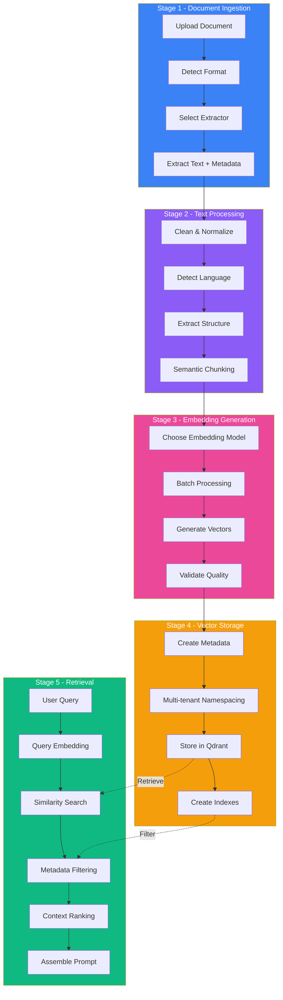
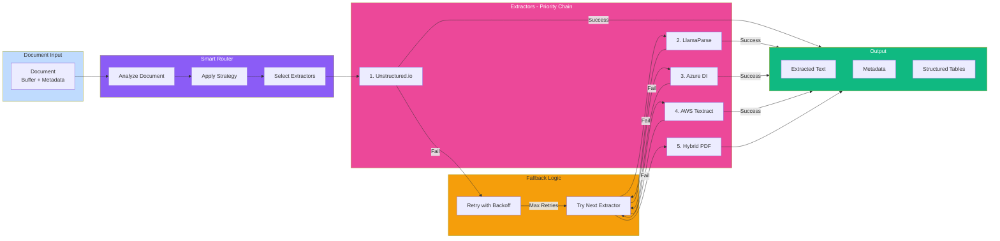
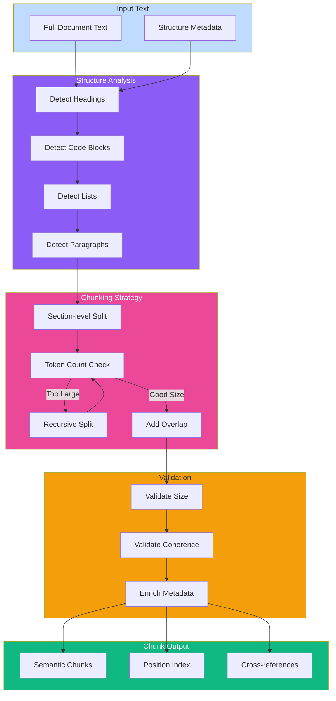
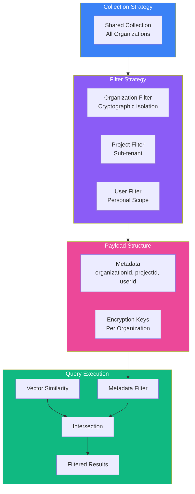
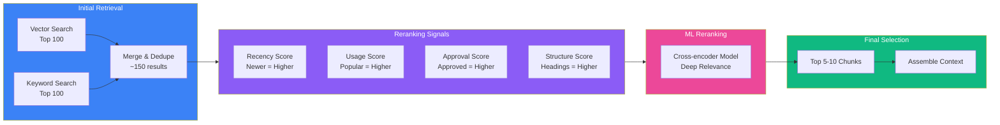
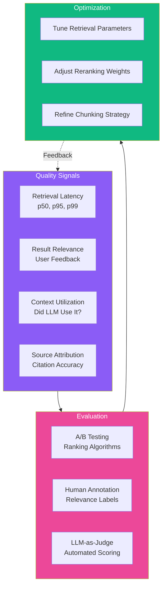

# Deep Dive: How Fabric AI's RAG Architecture Unlocks Enterprise Knowledge

In our [introduction to Fabric AI](/blog/introducing-fabric-ai-sdlc-compression-platform), we discussed how the platform compresses the software development lifecycle through intelligent automation. Today, we're diving deep into the technical foundation that makes this possible: **our Retrieval-Augmented Generation (RAG) architecture**.

RAG is more than a buzzword—it's the critical technology that enables AI agents to work with your specific organizational context, standards, and accumulated knowledge. But implementing RAG at enterprise scale requires solving challenges that most off-the-shelf solutions ignore:

- How do you extract clean, structured text from messy real-world documents?
- How do you chunk documents to preserve semantic meaning?
- How do you retrieve the *right* context without overwhelming the LLM?
- How do you ensure multi-tenant data isolation in vector databases?
- How do you make the entire pipeline fault-tolerant and observable?

Let's explore how Fabric AI solves each of these challenges.

## The RAG Problem: Context is Everything

Modern large language models (LLMs) are incredibly capable, but they have a fundamental limitation: **they don't know about your organization's specific data, processes, or standards**. Ask GPT-4 to generate a PRD, and you'll get a generic template. Ask it to write API documentation, and it won't know your naming conventions or architectural patterns.

The naive solution is to fine-tune a model on your data. But fine-tuning is:
- **Expensive**: Thousands of dollars per training run
- **Slow**: Days or weeks to complete
- **Static**: Models become outdated as soon as your documentation changes
- **Opaque**: Hard to understand what the model "learned"
- **Risky**: Training data leakage concerns with sensitive enterprise data

RAG provides a better approach: **Keep the base model unchanged, but dynamically inject relevant context into each request**. This way, the model applies its general reasoning abilities to your specific organizational knowledge.

## Architecture Overview: Five Stages of RAG

Fabric AI's RAG pipeline consists of five interconnected stages, each addressing a specific technical challenge:



Let's examine each stage in detail.

## Stage 1: Multi-Format Document Extraction

Enterprises don't store knowledge in neat Markdown files. Real-world data comes in:
- Scanned PDFs with complex layouts
- PowerPoint presentations with embedded diagrams
- Word documents with tables and images
- Confluence pages with nested content
- Legacy formats (older Office versions, proprietary formats)
- Code repositories with inline documentation

Each format requires specialized extraction logic. Fabric AI solves this with a **multi-extractor strategy**.

### The Extraction Factory Pattern

We've implemented an abstraction layer that routes documents to the appropriate extractor based on:
- **File format**: MIME type and extension detection
- **Content complexity**: Layout analysis, table detection
- **Cost constraints**: User or organization budget limits
- **Extraction strategy**: Speed vs. accuracy tradeoffs



### Extractor Selection Logic

**Unstructured.io** (Priority 1):
- Best for: Complex layouts, academic papers, mixed-format documents
- Pros: Excellent table extraction, understands document structure
- Cons: Higher cost, slower processing
- Use when: Accuracy is critical, cost is not a constraint

**LlamaParse** (Priority 2):
- Best for: Technical documentation, code comments, markdown-heavy content
- Pros: Optimized for developer content, preserves code formatting
- Cons: Less effective with visual layouts
- Use when: Processing code repositories or technical specs

**Azure Document Intelligence** (Priority 3):
- Best for: Enterprise compliance requirements, forms, invoices
- Pros: SOC 2 compliant, excellent OCR, layout understanding
- Cons: Requires Azure subscription, regional availability
- Use when: Enterprise governance is required

**AWS Textract** (Priority 4):
- Best for: High-volume form processing, structured documents
- Pros: Fast, cost-effective at scale, good table extraction
- Cons: Less effective with unstructured content
- Use when: Processing large batches of similar documents

**Hybrid PDF Extractor** (Fallback):
- Best for: Simple PDFs, local processing
- Combines: pdf-parse for text + Tesseract OCR for images
- Use when: All other extractors fail or are unavailable

### Cost-Aware Extraction

Organizations can configure extraction strategies:

```typescript
// Local-only strategy (free, fast, lower accuracy)
strategy: "local-only"

// Hybrid strategy (fallback to cloud if local fails)
strategy: "hybrid"

// Cloud-first strategy (best accuracy, higher cost)
strategy: "cloud-first"

// Budget-aware (automatic provider selection based on cost)
strategy: "budget-aware"
maxCost: 0.10 // Maximum cost per document in USD
```

The system tracks usage per user and organization, preventing runaway costs while maximizing extraction quality.

## Stage 2: Semantic Chunking

Once text is extracted, we face a new challenge: **how do we split it into manageable pieces for embedding and retrieval?**

Naive approaches fail:
- **Fixed-size chunks** (e.g., every 500 tokens) break semantic units mid-sentence
- **Paragraph-based chunks** create uneven sizes and lose cross-paragraph context
- **Section-based chunks** can be too large for embedding models (which have token limits)

### The Semantic Chunking Algorithm

Fabric AI implements **recursive semantic chunking** that:

1. **Respects document structure**: Preserves headings, lists, code blocks
2. **Maintains semantic coherence**: Never splits mid-sentence or mid-thought
3. **Creates overlapping windows**: Chunks share context to prevent information loss
4. **Adapts to content type**: Different strategies for code vs. prose vs. tables



### Chunk Metadata Enrichment

Each chunk is enriched with metadata for better retrieval:

Each chunk carries rich metadata across several categories:

- **Position metadata**: Document ID, chunk index, and total chunks for ordering and navigation
- **Structural metadata**: Heading hierarchy path (e.g., "Introduction > Architecture > RAG Pipeline"), section type (heading, paragraph, code, list, table), and heading depth
- **Semantic metadata**: Extracted keywords, named entities (people, organizations, technologies), and detected language
- **Context metadata**: References to previous/next chunks and cross-references to related chunks
- **Tenant metadata**: Organization, project, and tag associations for multi-tenant isolation

This rich metadata enables sophisticated filtering during retrieval.

## Stage 3: Vector Embedding Generation

With semantically coherent chunks, we generate vector embeddings—high-dimensional numerical representations that capture semantic meaning.

### Embedding Model Selection

Fabric AI supports multiple embedding providers:

| Provider | Model | Dimensions | Max Tokens | Use Case |
|----------|-------|------------|------------|----------|
| **OpenAI** | text-embedding-3-large | 3072 | 8191 | Best overall quality, expensive |
| **OpenAI** | text-embedding-3-small | 1536 | 8191 | Good balance of cost/quality |
| **Cohere** | embed-multilingual-v3.0 | 1024 | 512 | Multilingual support |
| **Azure OpenAI** | text-embedding-ada-002 | 1536 | 8191 | Enterprise compliance |
| **Custom** | (user-provided) | Variable | Variable | On-premise requirements |

The choice of embedding model is **critical** and affects:
- **Retrieval quality**: Better embeddings = more relevant results
- **Cost**: Embeddings are generated once but retrieved many times
- **Latency**: Larger embedding dimensions increase search time
- **Storage**: Higher dimensions require more vector database storage

### Batch Processing for Efficiency

Embedding generation is optimized for throughput:

```typescript
// Naive approach: One API call per chunk (slow, expensive)
for (const chunk of chunks) {
  const embedding = await embedChunk(chunk);
  await storeEmbedding(embedding);
}

// Optimized approach: Batch processing
const BATCH_SIZE = 100; // Provider-dependent
for (let i = 0; i < chunks.length; i += BATCH_SIZE) {
  const batch = chunks.slice(i, i + BATCH_SIZE);
  const embeddings = await embedBatch(batch); // Single API call
  await storeBatch(embeddings); // Batch database write
}
```

This reduces:
- **API calls**: 100x fewer calls for 10,000 chunks
- **Latency**: Parallel processing within batches
- **Cost**: Batch pricing discounts from providers

### Embedding Quality Validation

Not all embeddings are equal. We validate quality through:

1. **Magnitude check**: Ensure vectors are normalized (unit vectors)
2. **Similarity sanity tests**: Related chunks should have high cosine similarity
3. **Outlier detection**: Flag chunks with unusual embedding patterns
4. **Cross-validation**: Verify retrieval quality on sample queries

Poor-quality embeddings are flagged for re-processing or manual review.

## Stage 4: Vector Storage with Qdrant

With embeddings generated, we need fast, scalable storage with sophisticated filtering capabilities. Enter **Qdrant**—a vector database built specifically for production RAG systems.

### Why Qdrant Over Alternatives?

We evaluated several vector databases:

| Feature | Qdrant | Pinecone | Weaviate | Milvus |
|---------|--------|----------|----------|--------|
| **Performance** | Excellent | Excellent | Good | Excellent |
| **Multi-tenancy** | Native filtering | Namespace-based | GraphQL filters | Partitions |
| **Metadata filtering** | Rich (nested JSON) | Limited | Rich | Limited |
| **Self-hosted** | Yes | No | Yes | Yes |
| **Managed option** | Yes (Qdrant Cloud) | Yes | Yes | Yes (Zilliz) |
| **Hybrid search** | Yes (dense + sparse) | No | Yes | Yes |
| **Payload size** | Unlimited | 40KB limit | Large | Large |

**Qdrant wins** for enterprise RAG because:
- **Flexible filtering**: Query by organization, project, document type, date range, etc.
- **Self-hosted option**: Keep sensitive data in your VPC
- **Performance**: Sub-millisecond search on millions of vectors
- **Payload flexibility**: Store full chunk metadata without size limits

### Multi-Tenant Data Isolation

Ensuring data isolation in a shared vector database is non-trivial. Fabric AI implements **layered isolation**:



**Security layers**:

1. **Payload encryption**: Organization-specific encryption keys
2. **Mandatory filters**: All queries include `organizationId` filter
3. **Row-level security**: Database-level enforcement in PostgreSQL metadata
4. **Audit logging**: All access logged with user and organization context
5. **API authentication**: JWT tokens with organization claims

A misconfigured query literally **cannot** return results from other organizations—the database prevents it.

### Optimizing Vector Indexes

Our vector database uses HNSW (Hierarchical Navigable Small World) graphs for approximate nearest neighbor search. We tune index parameters to balance four competing concerns:

- **Accuracy**: How close results are to the true nearest neighbors
- **Speed**: Query latency for end users
- **Memory**: Index size and infrastructure cost
- **Build time**: How long indexing takes when new documents are added

Different workloads require different tuning -- Fabric AI adapts based on collection size and usage patterns.

## Stage 5: Intelligent Retrieval

The final stage—and arguably the most important—is **retrieval**: given a user query, which chunks should we send to the LLM?

Naive RAG systems just do vector similarity search and call it a day. This fails because:
- **Too much context**: Overwhelming the LLM with 50 chunks hurts performance
- **Too little context**: Missing critical information leads to hallucinations
- **Irrelevant context**: Similar vectors aren't always semantically relevant
- **Stale context**: Old documents shouldn't outrank recent ones

Fabric AI implements **multi-stage retrieval** to solve these problems.

### Stage 5.1: Query Understanding

Before searching, we analyze the user query to extract:

- **Intent**: Is the user trying to generate, search, summarize, or compare?
- **Entities and keywords**: People, technologies, and key terms mentioned
- **Timeframe**: Recency signals like "recent" or "last quarter"
- **Scope**: Should we search within a project, across an organization, or system-wide?

This analysis informs:
- **How many chunks to retrieve**: Summarization needs more context than generation
- **Which filters to apply**: Recent documents for "what's new" queries
- **How to rank results**: Prioritize specific projects or document types

### Stage 5.2: Hybrid Search

We combine multiple search strategies:

1. **Dense vector search**: Semantic similarity using embeddings
2. **Sparse keyword search**: BM25 full-text search on chunk text
3. **Metadata filtering**: Exact matches on organizationId, projectId, tags, dates

The hybrid search process works as follows:

1. **Dense vector search**: We query the vector database with the embedded query, over-retrieving (top 100) to give the reranker plenty of candidates. Results are filtered by organization and project for tenant isolation.
2. **Sparse keyword search**: In parallel, we run full-text search against the relational database to catch exact keyword matches that semantic search might miss.
3. **Merge and deduplicate**: Results from both search strategies are combined, deduplicated, and prepared for reranking.

Hybrid search catches:
- **Semantic matches**: "user authentication" matches "login flow"
- **Exact matches**: "API version 2.1" matches precisely
- **Acronyms and abbreviations**: "SDLC" matches "Software Development Lifecycle"

### Stage 5.3: Reranking for Relevance

Raw retrieval results are reranked using multiple signals:



**Reranking formula**:

```
final_score = (
  0.4 * vector_similarity +
  0.2 * keyword_relevance +
  0.15 * recency_score +
  0.1 * usage_score +
  0.1 * approval_score +
  0.05 * structure_score
)
```

Weights are tuned based on query type and user preferences.

### Stage 5.4: Context Assembly

The final step is assembling retrieved chunks into a coherent context for the LLM:

1. **Deduplication**: Remove overlapping chunks (remember our overlapping window strategy?)
2. **Ordering**: Sort by position in source documents to maintain narrative flow
3. **Formatting**: Add citations, headings, and metadata for LLM understanding
4. **Token budget management**: Fit context within the model's context window

The assembly process iterates through ranked chunks, adding each one with its source citation until the token budget for the target LLM is reached. If a chunk would push the context over the limit, it stops -- ensuring the model always receives the highest-quality context that fits within its context window.

The assembled context is prepended to the user's prompt, giving the LLM access to your organization's specific knowledge.

## Observability: Debugging RAG Systems

RAG systems are complex, and things can go wrong:
- Low-quality extractions produce garbage embeddings
- Retrieval returns irrelevant context
- LLMs generate content that contradicts source documents
- Performance degrades as the vector database grows

Fabric AI provides comprehensive observability:

### Extraction Metrics

```mermaid
graph LR
    subgraph metrics[Key Metrics]
        M1[Extraction Success Rate<br/>Target 99%]
        M2[Average Extraction Time<br/>Track by Provider]
        M3[Cost per Document<br/>Budget Monitoring]
        M4[Fallback Rate<br/>Primary vs. Fallback]
    end
    
    subgraph alerts[Alerts]
        A1[High Failure Rate]
        A2[Slow Processing]
        A3[Budget Exceeded]
    end
    
    subgraph actions[Auto-actions]
        AC1[Switch Extractors]
        AC2[Scale Resources]
        AC3[Pause Processing]
    end
    
    metrics --> alerts
    alerts --> actions
    
    style metrics fill:#3b82f6,color:#fff
    style alerts fill:#f59e0b
    style actions fill:#10b981,color:#fff
```



**Tracked metrics**:
- Success rate per extractor
- Average processing time by document size
- Cost per page/megabyte
- Error patterns (timeouts, API failures, format issues)

### Retrieval Quality Metrics



**Key questions we answer**:
- Are users approving AI-generated content (high approval = good retrieval)?
- Do users edit specific sections (indicates missing or wrong context)?
- Are certain document types under-represented in results?
- How does retrieval quality degrade as the vector database grows?

### End-to-End Tracing

Every RAG operation is traced through the entire pipeline:

```
[Workflow: doc_processing_abc123]
  |-- Extract document: 2.3s
  |   |-- Extractor: Unstructured.io (success, $0.05)
  |   +-- Extracted 15,342 characters
  |-- Chunk document: 0.4s
  |   +-- Generated 47 chunks (avg 326 tokens)
  |-- Generate embeddings: 1.8s
  |   +-- 47 embeddings (batch size: 25)
  |-- Store vectors: 0.3s
  |   +-- Stored in tenant-isolated collection
  +-- Finalize: 0.1s
      +-- Document status: READY

Total duration: 4.9s
Total cost: $0.07
```

This level of detail enables:
- **Performance debugging**: Identify slow steps
- **Cost attribution**: Track spending by organization and project
- **Error diagnosis**: Pinpoint exactly where failures occur
- **Audit trails**: Comply with enterprise governance requirements

## Performance Optimization Techniques

As your knowledge base grows, maintaining performance requires ongoing optimization:

### 1. Lazy Loading and Pagination

Don't load all chunks into memory:

```typescript
// Bad: Loads all results into memory
const results = await qdrant.search({ limit: 1000 });

// Good: Paginate through results
for (let offset = 0; offset < totalResults; offset += 100) {
  const batch = await qdrant.search({ limit: 100, offset });
  await processBatch(batch);
}
```

### 2. Caching Frequently Accessed Embeddings

Popular documents are retrieved repeatedly—cache their embeddings:

```typescript
const embeddingCache = new LRU({ max: 10000 });

async function getEmbedding(chunkId: string) {
  const cached = embeddingCache.get(chunkId);
  if (cached) return cached;
  
  const embedding = await fetchFromQdrant(chunkId);
  embeddingCache.set(chunkId, embedding);
  return embedding;
}
```

### 3. Precomputed Aggregations

For common queries, precompute results:

For common queries (like "most frequently retrieved documents in the last 30 days"), we precompute results using materialized views. These aggregate retrieval counts and average relevance scores, enabling fast lookups without recalculating on every request.

### 4. Batch Operations

Minimize database round-trips:

```typescript
// Bad: N+1 queries - one database call per chunk
for (const chunkId of chunkIds) {
  const metadata = await fetchChunkMetadata(chunkId);
  await enrichWithMetadata(metadata);
}

// Good: Single batch query - one database call for all chunks
const metadata = await fetchChunkMetadataBatch(chunkIds);
const metadataMap = new Map(metadata.map(m => [m.id, m]));
```

### 5. Index Optimization

Monitor and optimize PostgreSQL indexes:

We maintain composite indexes on common filter patterns (organization, project, date) and GiST indexes for full-text search. This ensures both tenant-filtered queries and keyword searches remain fast as the knowledge base scales.

## Security Considerations

RAG systems handle sensitive enterprise data—security is paramount:

### 1. Encryption at Rest

- **Vector database**: Qdrant collections encrypted with organization-specific keys
- **PostgreSQL**: Transparent data encryption (TDE) enabled
- **S3**: Server-side encryption (SSE-KMS) with customer-managed keys

### 2. Encryption in Transit

- **TLS 1.3**: All inter-service communication encrypted
- **mTLS**: Mutual authentication between services
- **VPC peering**: Database and vector store in private subnets

### 3. Access Controls

Access controls are enforced at multiple levels:

- **Row-level security policies** in the relational database ensure queries are automatically scoped to the current organization
- **Mandatory tenant filters** in the vector database enforce organization-level isolation on every search query

A misconfigured query literally **cannot** return results from other organizations -- the database prevents it at the policy level.

### 4. Audit Logging

Every operation is logged:

Every audit log entry captures the timestamp, user and organization context, action type (search, retrieve, or generate), the specific resources accessed, query details, result counts, and client information (IP address and user agent).

Logs are:
- **Immutable**: Append-only, tamper-proof
- **Retained**: Per compliance requirements (1-7 years)
- **Monitored**: Automated anomaly detection

## The Road Ahead: Future RAG Enhancements

We're continuously improving our RAG architecture:

### 1. Multimodal RAG

Extend beyond text to handle:
- **Images and diagrams**: Architecture diagrams, UI mockups, charts
- **Videos and audio**: Meeting recordings, presentation videos
- **Code**: Semantic code search and understanding

### 2. GraphRAG

Represent document relationships as knowledge graphs:
- **Entity linking**: Connect mentions across documents
- **Relationship extraction**: Understand how concepts relate
- **Path-based retrieval**: Find documents via relationship chains

### 3. Adaptive Retrieval

Learn from user feedback:
- **Reinforcement learning**: Optimize ranking based on approvals
- **Personalization**: Learn user preferences for context
- **Query expansion**: Automatically add related terms

### 4. Cross-lingual RAG

Support multilingual organizations:
- **Language detection**: Automatically identify chunk languages
- **Cross-lingual retrieval**: Query in English, retrieve Spanish
- **Translation**: Seamless context assembly across languages

## Conclusion: RAG as a Competitive Advantage

RAG is not just a technical implementation detail—it's the foundation that enables Fabric AI to transform enterprise knowledge into actionable intelligence. By solving the hard problems of:

- **Extraction** from messy real-world documents
- **Chunking** that preserves semantic meaning
- **Embedding** with quality validation
- **Storage** with multi-tenant isolation
- **Retrieval** with intelligent ranking

...we've built a system that turns your accumulated documentation into a competitive advantage.

Your competitors are using generic AI. **You're using AI trained on your specific organizational knowledge.**

That's the difference between 10x faster and 10x better.

---

**Want to see how Fabric AI's RAG architecture works with your data?** [Request a demo](#) and we'll show you a live extraction, embedding, and retrieval pipeline with your actual documents.

*Next up: In our third post, we'll dive into how Temporal workflows enable durable, fault-tolerant execution for long-running AI operations. Stay tuned!*
