# Building Fabric Loom with Temporal: How We Made Multi-Agent AI Actually Work

The first time we tried to chain multiple AI agents together, the experience was humbling.

We had a simple goal: user requests a PRD, the document agent generates it, the task planner breaks it into Jira stories, and an API agent posts them. Three agents, one workflow. Should be straightforward.

It wasn't.

The document agent produced a solid draft. The task planner created sensible stories. Then the API agent hit a rate limit halfway through posting to Jira. And everything just... stopped. No error message. No recovery. No way to pick up where we left off. Twenty minutes of generated work—sitting right there in memory—inaccessible.

We restarted. Same thing happened at a different point. Different failure, same result: start over from scratch.

After the third restart, we stepped back and asked ourselves: **why is this so fragile?**

That question became our north star. The answer wasn't better prompts or smarter agents. It was everything *around* the agents—the orchestration, the state management, the recovery mechanisms. The stuff nobody talks about in AI demos.

---

## The Dirty Secret About AI Agents

Here's what nobody tells you when you start building with AI agents: **getting individual agents to work is the easy part.**

The hard part—the part that separates demos from products—is making agents work *together*, *reliably*, *at scale*, with humans able to step in when needed. Not in a controlled demo. In production. At 2 AM. When your on-call engineer is asleep and your customer in Tokyo is waiting.

After that failed demo, we spent months cataloging failure modes. We found the same patterns everywhere:

- **Silent failures**: The agent just stops. No error. No retry. Your user stares at a spinner forever, then refreshes, and loses everything.
- **Context amnesia**: "What were we working on again?" Every new message starts from scratch. Users repeat themselves constantly.
- **Approval fatigue**: "Are you sure? Are you REALLY sure? Please confirm again." Users start approving everything without reading—defeating the entire purpose of approvals.
- **Groundhog Day errors**: The same mistake, over and over, because the system never learns from its failures.
- **The coordination nightmare**: Agent A needs output from Agent B, but Agent B is waiting for Agent C, who is stuck waiting for human approval that got lost in someone's email.

Sound familiar? We lived this for six months before we decided to fix it properly.

---

## What We Built (And What Changed)

Fabric Loom (the orchestrator) is now running in production, handling thousands of multi-agent workflows per day. Here's what changed:

**Before → After**

- ❌ **~60%** completion rate → ✅ **99.7%** completion rate
- ❌ **2.3 steps** before failure → ✅ **12+ steps** without issues
- ❌ **Start over** after interruption → ✅ **Instant resume**
- ❌ **5-7 approval prompts** per workflow → ✅ **1-2 prompts** that matter
- ❌ **Common** repeat failures → ✅ **Rare** (memory prevents them)

But numbers only tell part of the story. Let me show you what this actually looks like.

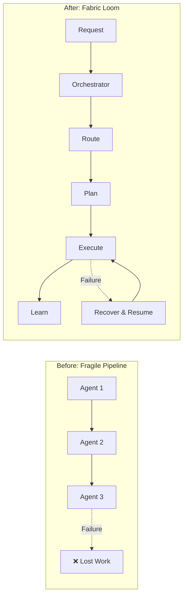

The difference isn't just technical. It's the difference between a demo and a product. Between "that's cool" and "I can't live without this."

Let me walk you through how we built it.

---

## Why We Chose Temporal (And Why It Changed Everything)

The single most important decision we made was building on **[Temporal](https://temporal.io)**.

I know, I know. "Just use [insert your favorite queue/workflow tool]." We tried them. Redis queues. Bull. Celery. Even wrote our own scheduler. They all had the same fundamental problem: **they treat failures as exceptions instead of expectations.**

Before Temporal, our workflows were "hope and pray" implementations. Start a task, cross your fingers, maybe it finishes. Server restarts halfway through? Gone. Network hiccups during an API call? Gone. User closes their browser? Gone.

Temporal changed our mental model completely. Instead of thinking "how do I handle failures?", we started thinking **"this workflow WILL complete—it's just a matter of when."**

Here's what the orchestrator workflow looks like at a high level:

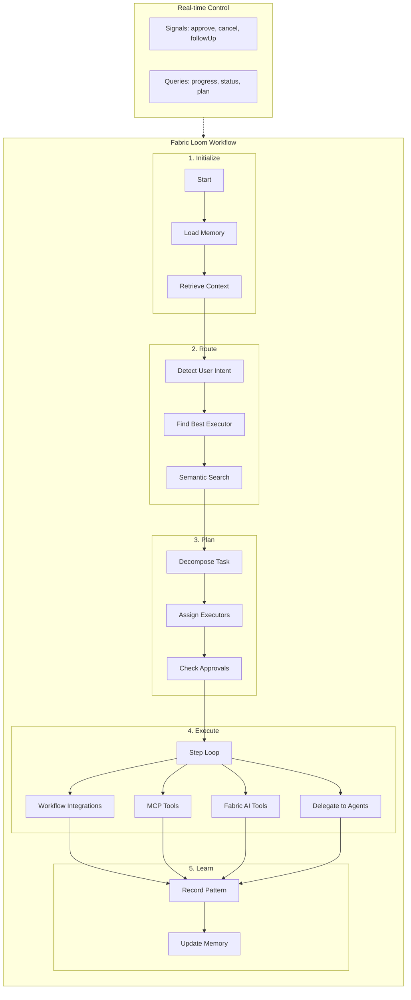

Every capability is a **Temporal Activity**, which means:

- **Automatic retries with exponential backoff**—transient failures just... work
- **Heartbeats** for long-running operations (we know it's still alive)
- **Timeouts that actually work** (not client-side hopes and dreams)
- **Full observability**—we can see exactly what's happening at every moment

But here's the game-changer: **Signals and Queries**.

Temporal's signal and query mechanisms let us communicate with running workflows in real time:

- **Approval signals**: When a user approves a step, the signal goes directly into the running workflow -- no polling, no race conditions
- **Progress queries**: The frontend can query the workflow directly for its current state, step count, and status
- **Follow-up signals**: A user can send modifications mid-execution (like "also add OAuth support") and the workflow adapts its plan on the fly

No polling. No race conditions. No websocket complexity. **The workflow IS the source of truth.**

When one of our customers had a 45-minute workflow interrupted by a server deployment, they expected to start over. Instead, the workflow just... resumed from where it left off. Their exact words: *"Wait, it remembered everything? How?"*

That's Temporal.

---

## A Real Workflow: From Request to Result

Before diving into the technical details, let me show you what this actually looks like in practice.

**Sarah** is a product manager at a Series C startup. Every Monday, she needs to create a PRD for the upcoming sprint, get it reviewed, create Jira tickets, and notify the engineering team. This used to take her 4 hours.

Now she types:

> *"Create a PRD for user authentication based on our Q4 roadmap, then create Jira stories and post a summary to #engineering"*

Here's what happens in the next **8 minutes**:

1. **Intent Detection**: Orchestrator recognizes she wants document generation, Jira integration, and Slack posting
2. **Context Retrieval**: Finds her Q4 roadmap doc and the auth requirements from last quarter's security review
3. **Routing**: Identifies this needs the document-generator agent, Jira MCP tools, and Slack integration
4. **Planning**: Creates a 4-step plan with dependencies, assigning the optimal executor for each step
5. **Approval**: Shows her ONE approval prompt: "Create PRD, 5 Jira tickets, 1 Slack message. Approve?"
6. **Execution**: Document agent generates the PRD, Jira tool creates stories, Slack integration posts summary
7. **Learning**: Records this pattern for next time (spoiler: next Monday, it auto-approves)

Sarah gets a Slack notification with a link to her new PRD and Jira board. She reviews it over coffee instead of writing it.

**That's the power of orchestration done right.** Now let me show you how it works under the hood.

---

## The Twelve Capabilities of the Orchestrator

Fabric Loom isn't just a router. It's an intelligent coordinator with twelve core capabilities:

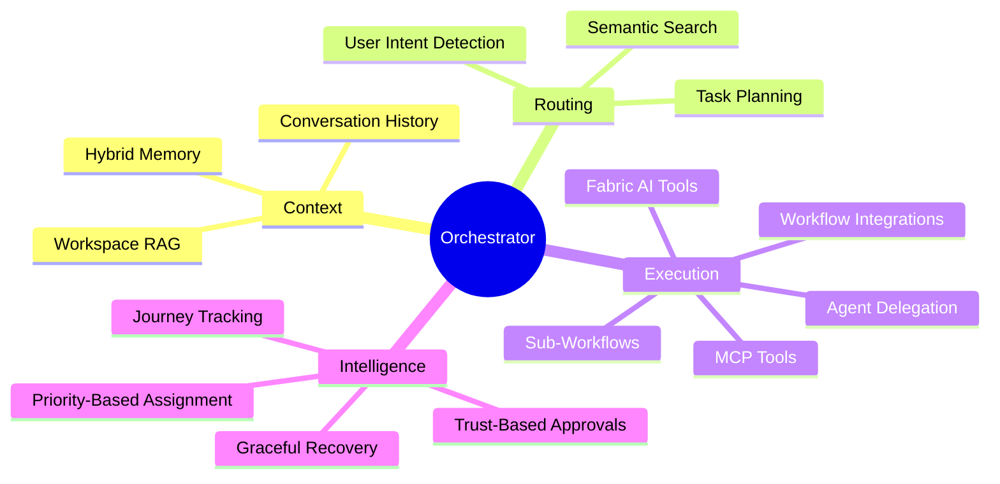

Here's what each capability does:

1. **Workspace RAG** — Pulls relevant docs from your knowledge base so AI has context without copy-pasting
2. **User Intent Detection** — Understands explicit requests like "use the Jira tool" or "search my workspace"
3. **Semantic Routing** — Finds the right executor using embeddings, scales to 100s of tools
4. **Task Planning** — Decomposes complex requests into steps with proper dependencies
5. **Priority-Based Assignment** — Intelligently assigns the best executor for each step
6. **Workflow Integrations** — Direct execution for Slack, GitHub, Linear, Email without MCP overhead
7. **MCP Execution** — Runs MCP tools directly for fast, deterministic API calls
8. **Fabric AI Tools** — Built-in tools for YouTube transcripts, web scraping, and content analysis
9. **Agent Delegation** — Hands off to specialized agents via A2A protocol
10. **Sub-Workflows** — Triggers other Temporal workflows for hierarchical orchestration
11. **Trust-Based Approvals** — Learns what you always approve, fewer interruptions over time
12. **Journey Tracking** — Remembers across conversation turns ("also add OAuth" just works)
13. **Hybrid Memory** — Learns from successes AND failures, gets smarter over time
14. **Graceful Recovery** — Classifies errors and recovers, workflows complete instead of crash

Let me walk through the most important ones.

---

## User Intent Detection: Respecting What You Ask For

Before we even start routing, the orchestrator analyzes your request to understand **explicit intent**. This sounds simple, but it's crucial.

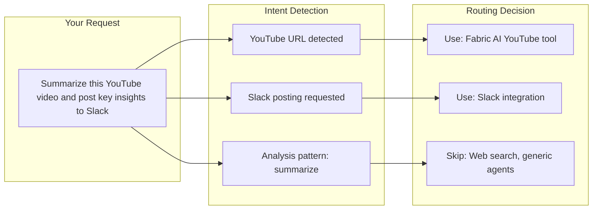

The intent detector recognizes:

- **Explicit tool requests** — "use the Jira tool", "search with GitHub"
- **YouTube URLs** — Automatically routes to transcript extraction
- **Workspace references** — "my docs", "attached files" → use RAG, not web search
- **Integration triggers** — "post to Slack", "create a GitHub issue", "send an email"
- **Fabric AI patterns** — "summarize", "extract wisdom", "analyze claims"

**Why this matters:** Without intent detection, the orchestrator might route "summarize this YouTube video" to a generic web search agent. With intent detection, it knows to use the specialized YouTube transcript tool—faster, more accurate, and cheaper.

---

## Workspace RAG: Your AI Finally Has Context

Every orchestrator execution starts by checking if you've attached workspaces. If you have, we perform semantic retrieval to pull in relevant context *before* we do anything else.

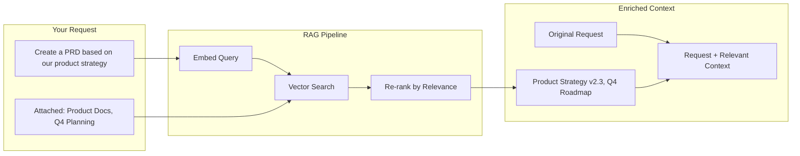

This isn't keyword matching. The retrieval system embeds your query and searches across all attached workspace documents to find semantically relevant content. The retrieved chunks are injected into the message *before* routing and planning.

**The result?** When you say "create a PRD based on our product strategy", the orchestrator already knows what your product strategy says. No copy-pasting. No "please provide more context." It just... knows.

One customer told us: *"It's like having an AI that actually read the docs."* That's exactly what it is.

---

## Semantic Routing: How We Solved the 77,000 Token Problem

Our first routing implementation was naive: load every MCP tool definition into the LLM context, let the model pick the right one.

Then we connected our first enterprise customer. They had **47 MCP servers**.

The tool definitions alone consumed **77,000 tokens**. Every. Single. Request. At $15/million tokens, that's $1.15 just for routing. Before the AI even does anything useful.

We needed a better approach: **semantic capability search**.

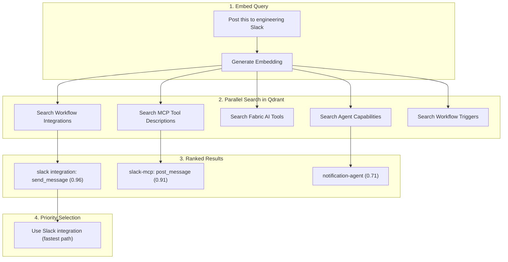

Now when you say "post this to our engineering Slack channel", we:

1. Embed your query using our cached embedding model
2. Search Qdrant across **all capability types** in parallel
3. Return only the top matches with confidence scores
4. Apply priority: Integrations first, then MCP tools, then Fabric AI tools, then agents

**Result: 90% reduction in routing tokens.** And routing is actually *more accurate* because the model isn't overwhelmed with 47 irrelevant tools.

We also respect explicit intent. If you say "use the Jira tool" or "search my workspace", we don't second-guess you.

---

## Workflow Integrations: The Fast Path

Not everything needs to go through MCP. For common operations like posting to Slack or creating GitHub issues, we built **workflow integrations**—direct execution paths that bypass the MCP overhead.

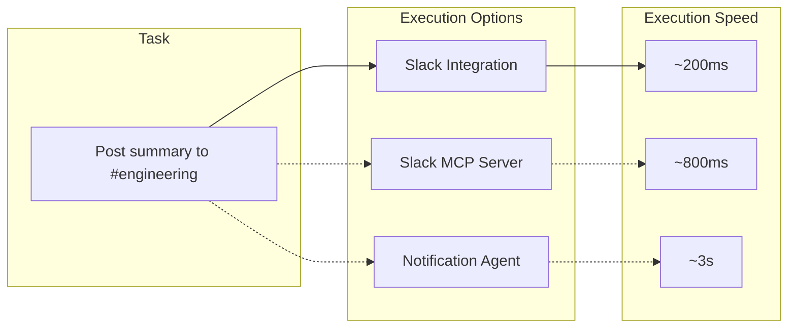

**Available integrations:**

| Integration | Operations | Use Case |
|------------|------------|----------|
| **Slack** | send_message, post_notification, send_dm | Team communication |
| **GitHub** | create_issue, create_pr, list_issues | Code collaboration |
| **Linear** | create_issue, list_issues, update_issue | Project management |
| **Email** | send_email (via Resend) | External communication |
| **Webhooks** | Custom HTTP calls | External systems |

Integrations are **4x faster** than MCP tools for the same operation because they skip the protocol overhead. The orchestrator automatically chooses integrations when available.

---

## Fabric AI Tools: Built-In Intelligence

Some capabilities are so common that we built them directly into the orchestrator. These **Fabric AI tools** handle content processing without external dependencies:

### YouTube Processing

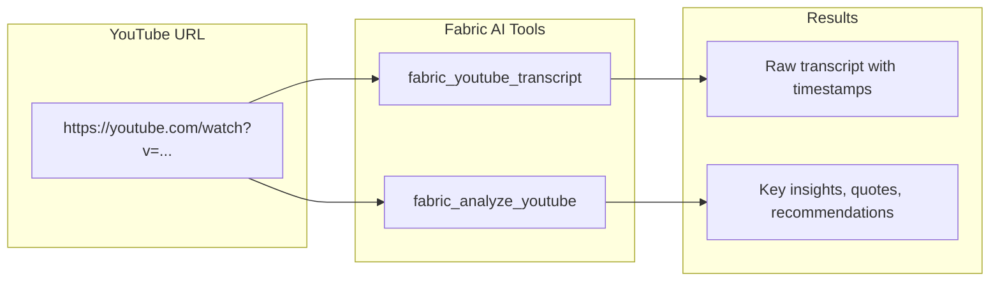

**YouTube tools:**
- `fabric_youtube_transcript` — Extract raw transcripts with optional timestamps
- `fabric_analyze_youtube` — Apply Fabric patterns: summarize, extract_wisdom, analyze_claims, create_keynote

### Web Content Processing

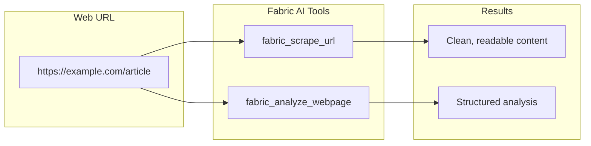

**Web tools:**
- `fabric_scrape_url` — Scrape and readability-enhance web content
- `fabric_analyze_webpage` — Apply Fabric patterns to web content

### Audio Processing

- `fabric_transcribe_audio` — Convert audio files to text

**Why built-in tools matter:** When Sarah says "summarize this YouTube video", we don't need to spin up an external service or route to a generic agent. The orchestrator handles it directly—faster response, lower cost, better results.

---

## Task Planning: The Brain of the Orchestrator

Once we know what capabilities to use, we create a task plan. Simple requests might be a single step. Complex requests get decomposed into multiple steps with proper dependencies.

Here's what planning looks like for Sarah's PRD request:

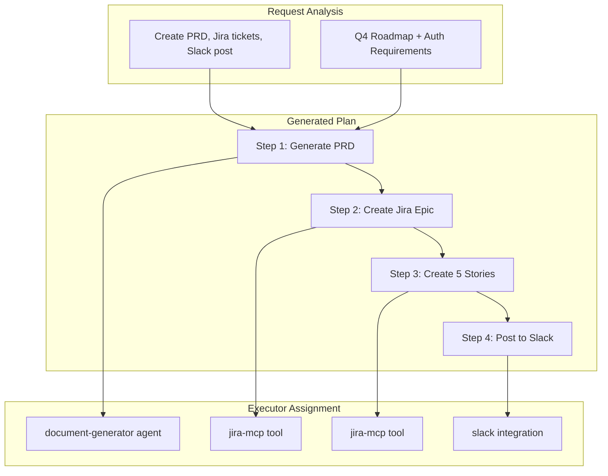

**Key innovations in our planning:**

### I/O Contracts

We infer what each step needs as input and produces as output, then auto-wire dependencies. Step 3 automatically gets the Epic ID from Step 2. No manual plumbing.

```typescript
// What the planner infers automatically
const plan = {
  steps: [
    { id: 'step-1', executor: 'document-generator', outputs: ['prd_document'] },
    { id: 'step-2', executor: 'jira-mcp', inputs: ['prd_document'], outputs: ['epic_id'] },
    { id: 'step-3', executor: 'jira-mcp', inputs: ['epic_id', 'prd_document'], outputs: ['story_ids'] },
    { id: 'step-4', executor: 'slack-integration', inputs: ['prd_document', 'story_ids'] }
  ]
};
```

### Variable Interpolation

Steps can reference outputs from previous steps using template syntax:

```typescript
// Step 4 can reference previous outputs
{
  id: 'step-4',
  executor: 'slack-integration',
  inputs: {
    message: "PRD created: {{step-1.output.title}}. Stories: {{step-3.output.story_ids}}"
  }
}
```

### Risk Detection

The planner automatically flags high-risk operations for approval:

| Operation | Risk Level | Approval |
|-----------|------------|----------|
| Read/List/Search | Low | Auto-approved |
| Update/Modify | Medium | Check trust history |
| Create/Insert | High | Ask if untrusted |
| Delete/Bulk ops | Critical | Always ask |
| Code execution | Medium+ | Check trust history |
| Browser automation | Medium+ | Check trust history |

### Context Bag

A structured container that accumulates context throughout execution. Research results, generated artifacts, API responses—all flow through and are available to subsequent steps.

---

## Priority-Based Executor Assignment

Not all executors are created equal. The **step assigner** intelligently selects the best executor for each step based on capability match and execution characteristics:

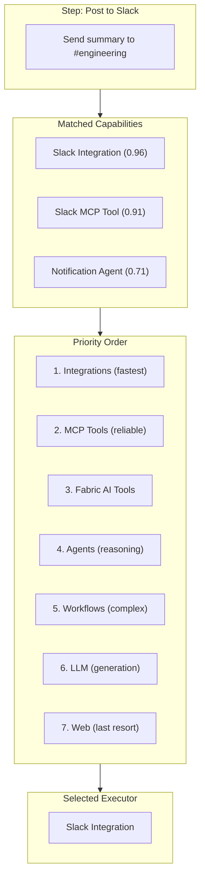

**The priority order:**

1. **Workflow Integrations** — Fastest, most direct path
2. **MCP Tools** — Reliable, deterministic API calls
3. **Fabric AI Tools** — Built-in content processing
4. **Specialized Agents** — When reasoning is needed
5. **Pre-defined Workflows** — Complex automations
6. **LLM** — Simple text generation
7. **Web/Browser** — Last resort for web automation

The assigner also checks **capability requirements**:
- Does the agent have MCP access for the required tools?
- Does the task need browser automation?
- Is code execution required?
- Does the agent support workspace access?

---

## Execution: Where Things Actually Happen

Each step in the plan executes via one of several mechanisms, chosen automatically based on what's best for the task:

### 1. Integration Execution (Fastest Path)

For common operations—Slack messages, GitHub issues, emails—we use direct integrations. No MCP overhead, just fast API calls.

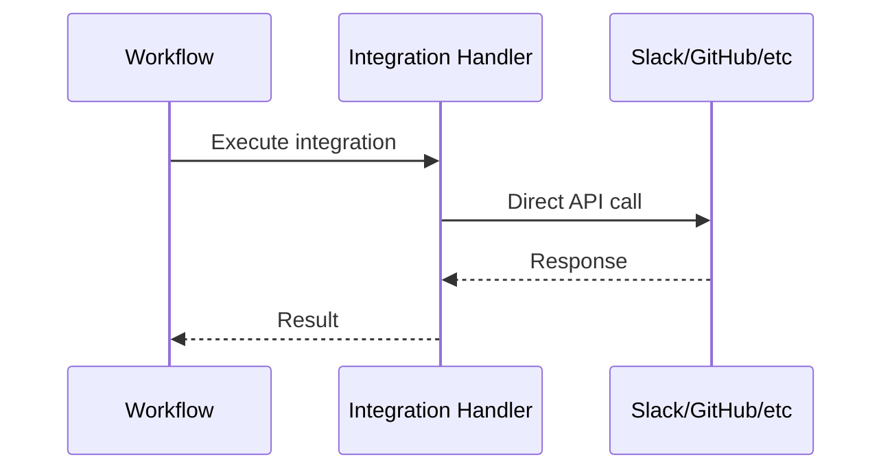

### 2. MCP Tool Execution (Standard Path)

For connected services—Jira, Linear, custom servers—we use the Model Context Protocol. It's reliable, standardized, and cacheable.

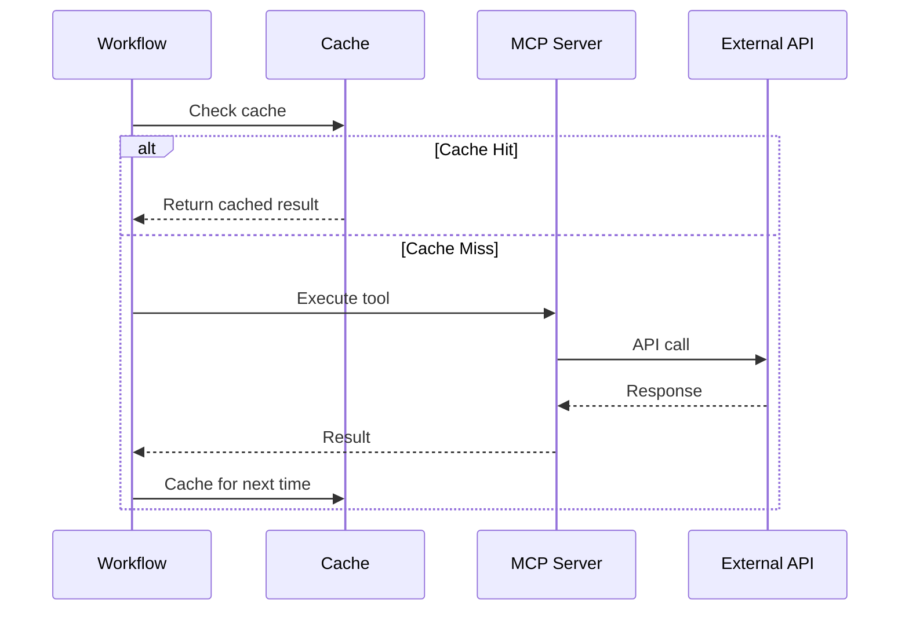

The caching is smarter than you'd think. If you say "post to #engineering" twice with the same message, we don't spam the channel. We return the cached result and note it was already posted.

### 3. Fabric AI Tool Execution (Built-in Path)

For content processing—YouTube, web scraping, audio—we handle it directly without external dependencies.

```typescript
// YouTube transcript extraction
const result = await fabricYoutubeTranscript({
  url: 'https://youtube.com/watch?v=...',
  includeTimestamps: true
});

// Web content analysis
const analysis = await fabricAnalyzeWebpage({
  url: 'https://example.com/article',
  pattern: 'extract_wisdom'
});
```

### 4. Agent Delegation (A2A Protocol)

For tasks that need AI reasoning—document generation, code analysis, complex research—we delegate to specialized agents via the **Agent-to-Agent (A2A) protocol**.

```typescript
// Delegation with full context passing
const result = await delegateToAgent({
  agentId: 'document-generator',
  message: 'Create a PRD for user authentication',
  context: {
    workspace_docs: retrievedDocs,
    previous_steps: contextBag,
    user_preferences: { format: 'markdown', tone: 'technical' }
  },
  mode: 'single-step' // orchestrator keeps control
});
```

Every agent in our ecosystem speaks A2A, regardless of implementation language (TypeScript, Python, Go). This gives us secure multi-tenant context passing, AI token delegation, and standardized artifact extraction.

### 5. Generalist Agent Delegation

For complex tasks requiring autonomous execution, we can delegate to **generalist agents** like CUGA:

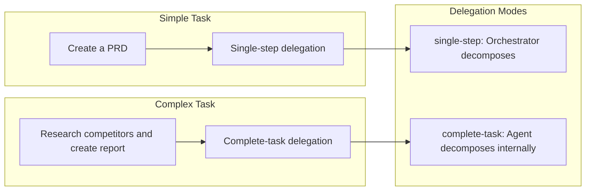

**Delegation modes:**
- `single-step` — Orchestrator maintains control, agent executes individual steps
- `complete-task` — Agent handles entire task autonomously, including internal decomposition

### 6. Sub-Workflow Triggering (Hierarchical)

For complex sub-tasks that are themselves multi-step, we trigger child Temporal workflows. The parent waits for the child to complete, with full visibility into progress.

This is how we handle "generate a PRD AND create a presentation from it"—two separate orchestrated workflows, coordinated as one.

---

## Trust-Based Approvals: The Feature Nobody Asked For (But Everyone Needed)

We built the approval system everyone *thinks* they want: every potentially dangerous operation requires human approval.

**Our users absolutely hated it.**

They'd start a workflow, get three approval prompts, approve all of them without reading (defeating the entire purpose), and then complain the system was slow.

We realized the problem wasn't the concept of approvals—it was the implementation. So we built a **trust-based system that learns from you**.

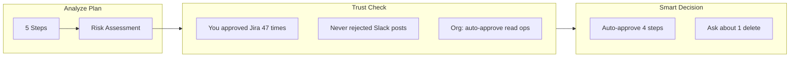

Here's how it works:

**Week 1**: You get asked about everything. Slack post? Approve. Jira ticket? Approve. Read from database? Approve.

**Week 2**: System notices you've approved 23 Slack posts without ever rejecting one. It starts auto-approving Slack.

**Week 3**: You've never rejected a Jira creation, but you rejected one Jira *deletion*. It learns: create = safe, delete = ask.

**Week 4**: Your approval queue has shrunk from 5-7 prompts per workflow to **1-2 that actually matter**.

```typescript
// What the approval analyzer produces
const approvalDecision = {
  autoApproved: ['step-1-read', 'step-2-generate', 'step-4-slack'],
  requiresApproval: ['step-3-delete-old-tickets'],
  reason: 'User has never approved bulk deletions. Consolidating to single prompt.',
  consolidatedPrompt: {
    title: 'Approve Plan',
    description: 'Create PRD, 5 Jira tickets, delete 3 old tickets, post to Slack',
    highlight: 'Delete 3 old tickets', // This is what we're really asking about
    options: ['Approve All', 'Approve Without Delete', 'Reject']
  }
};
```

The result? **40% fewer approval prompts** and users actually *read* the ones they get because they know they matter.

---

## Starred Preferences: Your Favorites, Front and Center

Users told us: "I always use the same tools. Why do I have to wait for the AI to figure that out?"

Fair point. So we added **starred preferences**.

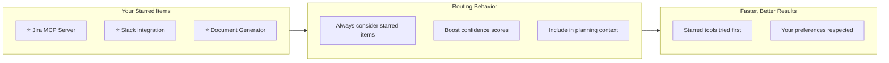

**How it works:**

- **Star MCP servers** — ALL tools from that server get elevated priority
- **Star specific tools** — Individual tools boosted in semantic search
- **Star agents** — Preferred agents considered first for delegation
- **Star integrations** — Favorite integrations prioritized

When you star a Jira MCP server, the orchestrator doesn't need to semantically search for "jira-like tools"—it knows you want Jira and uses it directly.

---

## Journey Tracking: The AI That Actually Remembers

Nothing frustrates users more than having to repeat themselves.

> "Create a PRD for the authentication feature."
>
> *Agent generates PRD*
>
> "Actually, also include OAuth support."
>
> "I'm sorry, what PRD are you referring to?"

🤦 We've all been there. We solved this with **journey state tracking**.

The orchestrator maintains a complete journey state throughout execution:

```typescript
interface JourneyState {
  // What we're doing
  currentPhase: 'routing' | 'planning' | 'executing' | 'awaiting_input';
  plan: TaskPlan;

  // What we've learned
  decisions: Array<{ decision: string; reason: string; timestamp: Date }>;
  assumptions: Array<{ assumption: string; confidence: number }>;

  // What's happened
  completedSteps: StepResult[];
  artifacts: Map<string, Artifact>; // PRD doc, Jira tickets, etc.

  // Full context
  conversationHistory: Message[];
  contextBag: AccumulatedContext;
}
```

When Sarah says "also include OAuth support", the plan modification analyzer examines it in context:

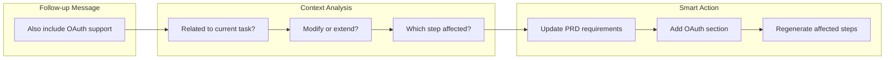

The result? Conversations that feel natural. Users can interrupt, change their minds, ask "wait, what did you do?", and the system just... handles it.

### Conversation Context in Routing

We also inject recent conversation history into routing and planning decisions:

```typescript
// Last 5 messages included for context
const conversationContext = messages
  .slice(-5)
  .map(m => `${m.role}: ${truncate(m.content, 500)}`)
  .join('\n');
```

This means follow-up requests like "now do the same for the API docs" actually work—the orchestrator remembers what "the same" refers to.

---

## Hybrid Memory: An AI That Learns From Its Mistakes

Most AI systems have a frustrating superpower: making the same mistake twice. The orchestrator has two complementary memory systems that prevent this.

### Letta: The Fast Cache

**Letta** provides keyword-based memory and result caching:
- "Last time you asked about Jira, we used the document-generator agent"
- Identical MCP calls return cached results instantly
- Routing patterns that worked before

### Qdrant: The Deep Memory

**Qdrant** provides semantic memory with embeddings:
- Find past executions similar to the current task
- What approaches worked for similar problems
- What approaches **FAILED** for similar problems

That last one—**negative memory**—was a game-changer.

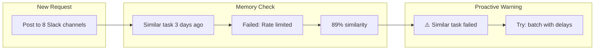

**Real story**: A customer's workflows kept failing on Friday afternoons. Same error every time. Turns out their Slack workspace had tighter rate limits on Fridays (don't ask why—enterprise IT is weird).

Before negative memory, the orchestrator would try the same approach every Friday and fail every Friday. Now it remembers:

> "A similar task failed 3 days ago due to Slack rate limiting (89% similarity). Automatically batching messages with 2-second delays."

The orchestrator adjusts its plan *before* failing. That's the difference between a tool and a system that learns.

---

## Recovery: Because Things Will Break

Here's a truth about production systems: **things will fail**. The question isn't "if" but "how gracefully."

The orchestrator classifies every failure and responds appropriately:

**✅ Retryable Failures** (Temporal handles these automatically)
- **Timeout** → Retry with longer timeout
- **Rate Limit** → Exponential backoff (2s → 4s → 8s → ...)
- **Network Error** → Retry with backoff

**⚠️ Recoverable Failures** (we adjust and try again)
- **Validation Error** → Fix parameters, retry once

**❌ Terminal Failures** (skip or fail gracefully)
- **Not Found** → Skip step, continue workflow
- **Auth Error** → Fail immediately, alert user

The key insight: **even when a step fails, the workflow doesn't die.**

```typescript
// Real recovery in action
const stepResult = await executeStep(step);

if (stepResult.failed) {
  const recovery = await classifyAndRecover(stepResult.error);

  if (recovery.strategy === 'retry') {
    // Temporal handles this automatically with proper backoff
    throw new ApplicationFailure('Retryable', { retryable: true });
  }

  if (recovery.strategy === 'skip') {
    // Mark as skipped, continue with next step
    return { status: 'skipped', reason: recovery.reason };
  }

  // Only truly fatal errors stop the workflow
  if (recovery.strategy === 'fatal') {
    return { status: 'failed', error: stepResult.error };
  }
}
```

Non-critical steps get skipped. The workflow continues with what it *can* do, then reports what worked and what didn't. And every failure gets recorded in negative memory so we don't make the same mistake twice.

---

## The Complete Picture: Sarah's PRD, Revisited

Let's trace through Sarah's request one more time, now that you understand the components:

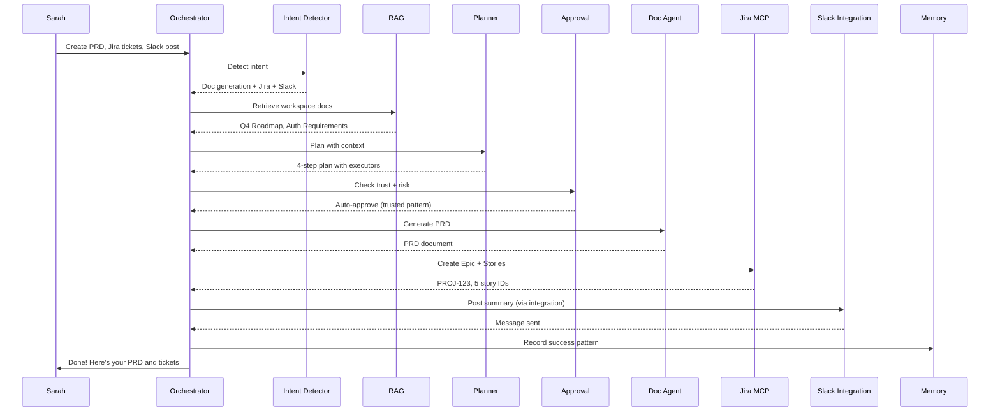

**Total time: 8 minutes.** Down from 4 hours of manual work.

**Next Monday**, when Sarah makes a similar request, the orchestrator will:
1. Recognize the pattern from memory
2. Auto-approve the entire plan (she's done this 4 times now)
3. Execute even faster because it knows exactly what to do

That's the power of an orchestrator that learns.

---

## What We Learned Building This

Building Fabric Loom taught us that **orchestration is harder than individual agent development**, but it's also where the real value lies.

Here are our key takeaways:

### 1. Temporal is Non-Negotiable for Production AI

The durability, signals, queries, and activity model are exactly what multi-agent systems need. When a workflow runs for 30 minutes and involves 12 external API calls, you *need* the ability to:
- Resume after crashes
- Query current state
- Signal for human input
- Retry with proper backoff

We couldn't have built this without Temporal.

### 2. Semantic Routing Beats Brute Force

Loading every capability into context doesn't scale. Our 77,000-token disaster taught us that. Search for what you need, when you need it. Your routing will be faster *and* more accurate.

### 3. Build Fast Paths for Common Operations

Not everything needs MCP. Direct integrations for Slack, GitHub, and email are 4x faster. Know your hot paths and optimize them.

### 4. Respect User Intent

When users explicitly ask for something, don't second-guess them. Intent detection prevents the orchestrator from "helpfully" choosing a different tool than what was requested.

### 5. Trust-Based Approvals Beat Approval Fatigue

Users will approve everything without reading if you ask too often. Learn from their behavior. Consolidate prompts. Auto-approve what's safe. Make the prompts they *do* see actually matter.

### 6. Memory is a Feature, Not a Nice-to-Have

Both positive memory (what worked) and negative memory (what failed) make the system smarter over time. The Friday rate-limiting story isn't unique—every production system has weird edge cases that only memory can solve.

### 7. Context Flows Through Everything

The Context Bag pattern—where each step contributes to and draws from accumulated context—is essential for coherent multi-step execution. Without it, step 4 has no idea what step 1 discovered.

### 8. Plan for Failure From Day One

Every step will fail eventually. Classification, retry strategies, and graceful degradation aren't optional. They're the difference between "workflow crashed" and "workflow completed with 1 skipped step."

---

## What's Next

We're continuing to evolve the orchestrator:

- **Parallel step execution** for independent operations (why wait for Slack when Jira is ready?)
- **Cost-aware routing** that balances speed vs. token usage
- **Collaborative workflows** where multiple users can participate in the same execution
- **Custom execution strategies** for domain-specific patterns
- **Enhanced observability** with distributed tracing across agents
- **More Fabric AI tools** for common content processing tasks

The foundation is solid. Now we're building on top of it.

---

## Try It Yourself

If you're building multi-agent systems, I hope our journey helps you avoid some of the potholes we hit. The problems are solvable. They just require thinking about orchestration as a first-class concern, not an afterthought.

**Want to see the orchestrator in action?** [Try Fabric AI](/app/agents/fabric-ai) and let us know what you build.

Or if you're building your own orchestration layer, here's what I'd start with:
1. Pick a durable execution framework (Temporal, Inngest, or similar)
2. Implement semantic routing early—don't wait for the token explosion
3. Build fast paths for your most common operations
4. Build memory from day one, including negative memory
5. Design your approval system to learn, not just ask

The future of AI isn't individual agents. It's orchestrated systems that coordinate, learn, and recover. That's what we're building at Fabric.
