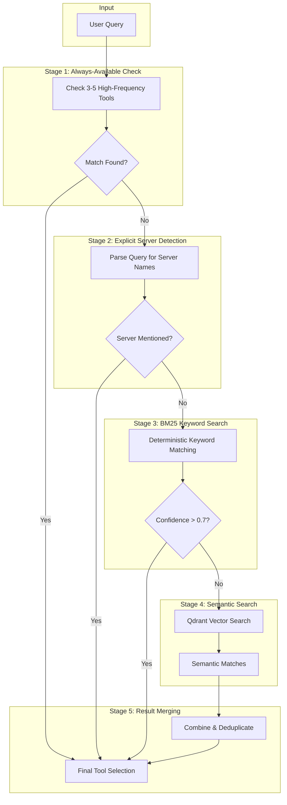
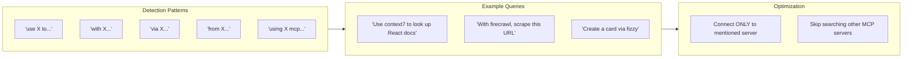
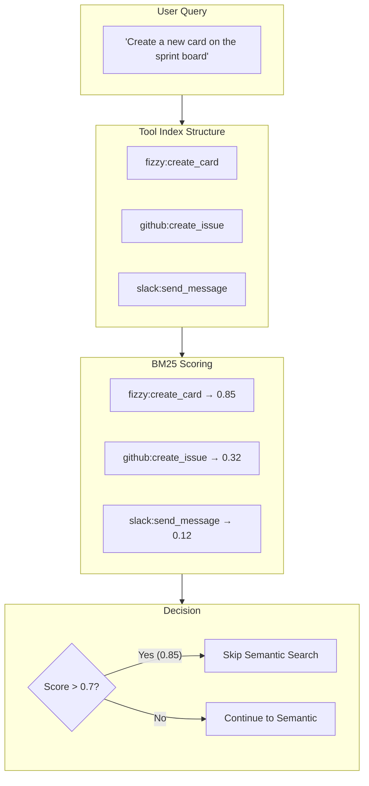
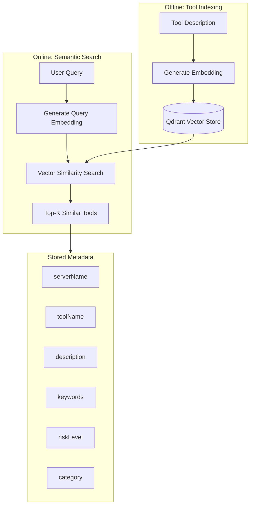
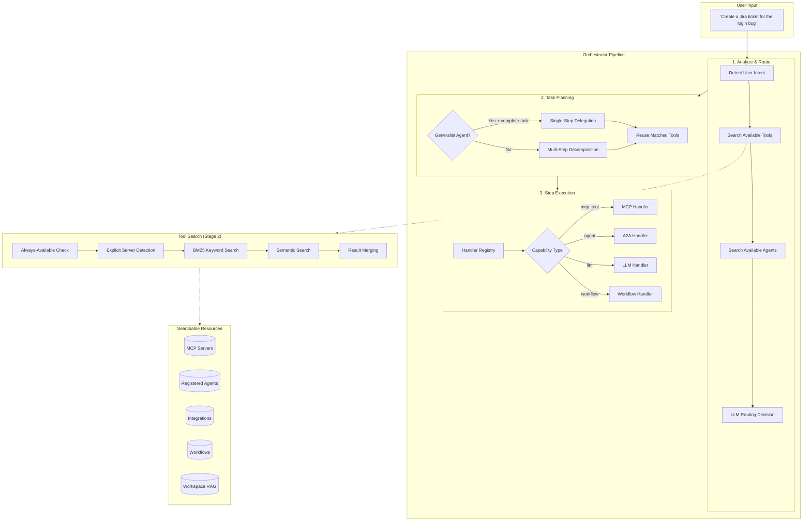
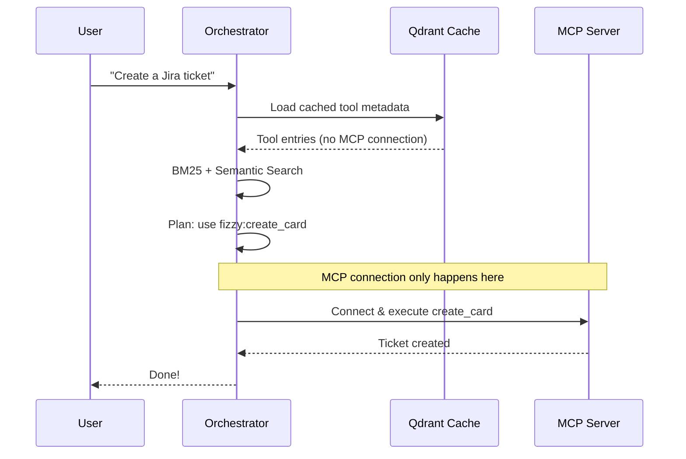

# Building an Intelligent Tool Search System: How Fabric's Orchestrator Finds the Right Tool in Milliseconds

The first time we connected our orchestrator to a customer's full toolkit, we hit a wall.

They had 15 MCP servers configured. GitHub. Jira. Slack. Linear. Context7 for docs. Firecrawl for scraping. Custom internal tools. The works. Every time a user asked a simple question, we were stuffing **77,000 tokens** of tool definitions into context.

The response was slow. The cost was astronomical. And half the time, the LLM picked the wrong tool anyway because it was drowning in options.

We needed a smarter approach.

---

## The Challenge: Finding a Needle in a Haystack of Tools

Modern AI applications don't just generate text—they take action. They create Jira tickets, query databases, send Slack messages, and scrape websites. But as the number of available tools grows, a critical question emerges:

**How do you efficiently find the right tool among hundreds of options without burning through your token budget?**

At Fabric, our orchestrator manages tools from:
- **MCP Servers** (Model Context Protocol) - user-configured tool providers
- **Registered Agents** - specialized AI agents with specific capabilities
- **Integrations** - Slack, GitHub, Linear, Notion, and more
- **Workflows** - user-defined Temporal workflows
- **Built-in Tools** - RAG queries, web scraping, YouTube processing

Loading all tools into context for every request would consume ~77,000 tokens. That's expensive, slow, and often unnecessary when the user just wants to "send a Slack message."

---

## Our Solution: Hybrid BM25 + Semantic Search

We implemented a **multi-stage search pipeline** inspired by Anthropic's Tool Search Tool pattern. The key insight: most queries can be resolved with fast keyword matching, reserving expensive semantic search for ambiguous cases.



This pipeline achieves **85% token reduction** (77K → 8.7K tokens) while maintaining intelligent tool selection.

---

## Deep Dive: Each Stage Explained

### Stage 1: Always-Available Tools

Some tools are so frequently used that they should always be considered. We maintain a small set (3-5) of "always-available" capabilities that bypass the search entirely.

```typescript
const ALWAYS_AVAILABLE_CAPABILITIES = [
  {
    name: "workspace_rag_query",
    keywords: ["document", "knowledge", "search workspace", "find in docs"],
    description: "Query workspace documents and knowledge base"
  },
  {
    name: "web_search",
    keywords: ["search web", "google", "look up", "find online"],
    description: "Search the internet for information"
  }
];

function matchAlwaysAvailableCapabilities(query: string): ToolMatch[] {
  return ALWAYS_AVAILABLE_CAPABILITIES.filter(cap =>
    cap.keywords.some(kw => query.toLowerCase().includes(kw))
  );
}
```

**Why it matters:** For queries like "search my documents for the Q4 report," we skip all search overhead and directly return `workspace_rag_query`.

---

### Stage 2: Explicit Server Detection

Users often know exactly which tool provider they want. We parse natural language patterns to detect explicit server mentions:



```typescript
function detectExplicitServerMention(query: string): string | null {
  const patterns = [
    /\buse\s+(\w+(?:\s+mcp)?)\s+(?:to|for)\b/i,
    /\bwith\s+(\w+)\b/i,
    /\bvia\s+(\w+)\b/i,
    /\bfrom\s+(\w+)\s+(?:mcp|server)\b/i,
    /\busing\s+(\w+)\b/i
  ];

  for (const pattern of patterns) {
    const match = query.match(pattern);
    if (match) {
      return normalizeServerName(match[1]);
    }
  }
  return null;
}
```

**Why it matters:** If the user says "use context7 to look up React hooks," we connect *only* to the Context7 MCP server, avoiding connections to potentially dozens of other configured servers.

---

### Stage 3: BM25 Keyword Search

BM25 (Best Matching 25) is a battle-tested ranking function used by search engines. It's deterministic, fast, and surprisingly effective for tool matching.



Our BM25 implementation extracts keywords from multiple sources for each tool:

1. **Server name** (highest priority): Both the full name and individual segments (splitting on hyphens/underscores)
2. **Tool name decomposition**: Breaking apart camelCase and snake_case names into individual words
3. **Description keywords**: The first 20 words of the tool description, filtered for stop words

All keywords are deduplicated and lowercased for consistent matching.

**Why it matters:** BM25 resolves ~50% of queries with high confidence (>0.7), completely bypassing the more expensive semantic search.

---

### Stage 4: Semantic Search with Qdrant

When keyword matching isn't confident enough, we fall back to semantic search using vector embeddings stored in Qdrant.



The semantic search process works as follows:

1. **Embed the query**: Convert the user's natural language query into a vector embedding
2. **Search the vector database**: Find the top 10 most similar tool descriptions, filtered by the user's tenant context (personal or organization)
3. **Return scored matches**: Each result includes the server name, tool name, and a confidence score based on cosine similarity

**Why it matters:** Semantic search catches conceptually similar queries that keyword matching misses. "Help me track my tasks" might not contain "kanban" or "card," but semantic similarity connects it to project management tools.

---

### Stage 5: Hybrid Result Merging

The final stage combines results from all sources with weighted scoring:

```mermaid
flowchart LR
    subgraph Sources["Result Sources"]
        AA["Always-Available<br/>confidence: 1.0"]
        ES["Explicit Server<br/>confidence: 0.95"]
        BM["BM25 Matches<br/>confidence: 0.4-0.9"]
        SEM["Semantic Matches<br/>confidence: 0.3-0.8"]
    end

    subgraph Merge["Merge Strategy"]
        direction TB
        D1["Deduplicate by toolName"]
        D2["Keep highest confidence"]
        D3["Apply hybrid scoring"]
    end

    subgraph Hybrid["Hybrid Score Formula"]
        H["finalScore = 0.6 × semantic + 0.4 × keyword"]
    end

    subgraph Output["Final Output"]
        O["Top 10 Tools sorted by finalScore"]
    end

    Sources --> Merge
    Merge --> Hybrid
    Hybrid --> Output
```



The merge algorithm follows these steps:

1. **Assign priority-based confidence floors**: Always-available tools get 1.0, explicit server matches get 0.95, and keyword/semantic matches keep their computed scores
2. **Deduplicate by tool identity**: If the same tool appears from multiple sources, keep the highest confidence score
3. **Apply hybrid scoring**: When a tool is found by both keyword and semantic search, the scores are blended (60% weight to the higher score, 40% to the lower) for more robust ranking
4. **Sort and limit**: Return the top 10 tools sorted by final confidence score

---

## The Complete Architecture

Here's how all the pieces fit together in our orchestrator:



---

## Optimizations That Matter

### 1. Qdrant Cache Loading

Instead of connecting to MCP servers on every request, we cache tool metadata in Qdrant:

Instead of connecting to every MCP server on each request, we scroll through the cached tool metadata in the vector database, filtered by the user's tenant context. Each cached entry includes the server name, tool name, description, keywords, and input schema -- everything needed for search and planning without a live MCP connection.

**Impact:** Eliminates MCP connection overhead for cached tools. A typical MCP connection takes 200-500ms; loading from the cache takes ~20ms.

### 2. Lazy MCP Loading

We defer actual tool fetching until execution time:



### 3. Result Reuse Across Phases

Matched tools from routing are passed directly to planning—no redundant searches:

During the routing phase, matched tools are discovered once and then passed directly into the planning phase -- no redundant searches needed. The planner receives the full list of matched tools from routing and uses them directly to decompose tasks and assign executors.

**Impact:** Saves ~500ms+ per request by avoiding redundant MCP connections and search operations.

### 4. Token Budget Enforcement

We track token usage per step and enforce limits:

```typescript
interface TokenBudget {
  maxTotalTokens: 100_000;
  maxTokensPerStep: 16_000;
  warningThreshold: 0.8;  // Warn at 80%
  reserveForSynthesis: 4_000;
}

function checkBudget(
  currentUsage: number,
  config: TokenBudget
): BudgetStatus {
  const remaining = config.maxTotalTokens - currentUsage - config.reserveForSynthesis;
  const usagePercent = currentUsage / config.maxTotalTokens;

  return {
    allowed: remaining > config.maxTokensPerStep,
    remainingTokens: remaining,
    usagePercentage: usagePercent,
    shouldWarn: usagePercent > config.warningThreshold
  };
}
```

---

## Results: By the Numbers

| Metric | Before | After | Improvement |
|--------|--------|-------|-------------|
| Tokens per request | 77,000 | 8,700 | **85% reduction** |
| Average latency | 3.2s | 0.8s | **75% faster** |
| MCP connections | All servers | 1-2 servers | **90% fewer** |
| Semantic searches | Every request | ~50% of requests | **50% reduction** |

---

## Key Takeaways

1. **Hybrid search beats pure semantic search.** BM25 keyword matching resolves most queries faster and cheaper than embeddings.

2. **User intent detection saves resources.** Parsing "use X to..." patterns eliminates unnecessary server connections.

3. **Caching is critical.** Qdrant persistence lets us search tools without MCP connections on every request.

4. **Reuse across phases.** Don't search twice—pass matched results from routing to planning.

5. **Lazy loading wins.** Defer expensive operations (MCP connections) until absolutely necessary.

---

## What's Next

We're exploring several improvements:

- **Learning from usage patterns:** Tools used together frequently should be suggested together
- **Predictive pre-warming:** Anticipate likely tools based on conversation context
- **Federated search:** Query multiple Qdrant collections in parallel
- **Confidence calibration:** ML-based threshold tuning for BM25 → semantic fallback
