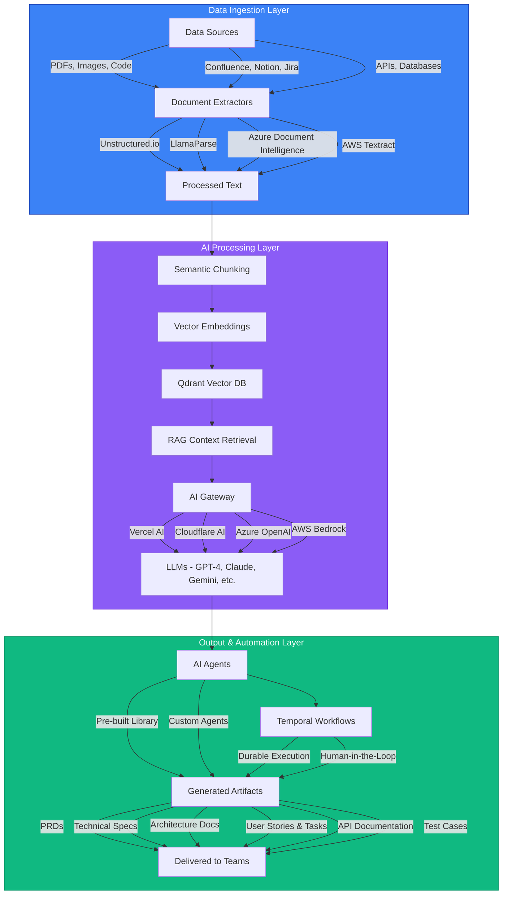
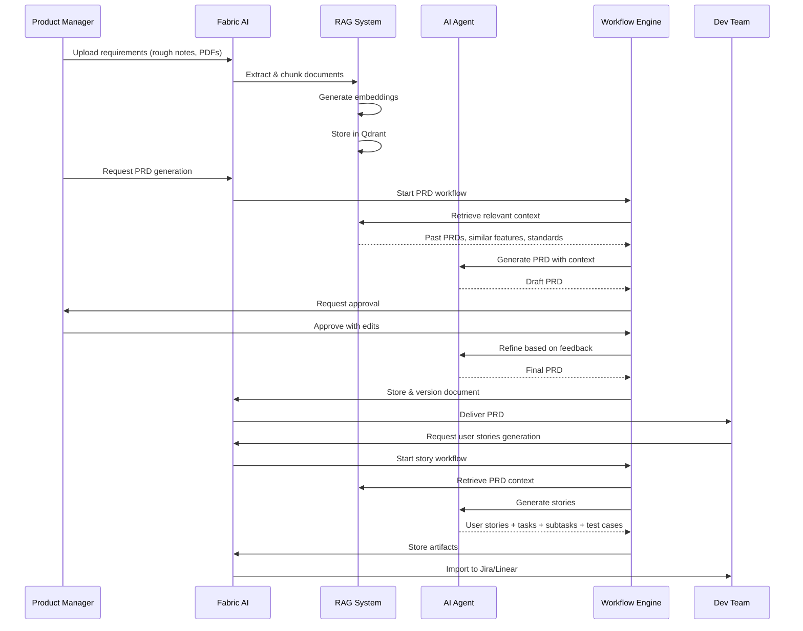
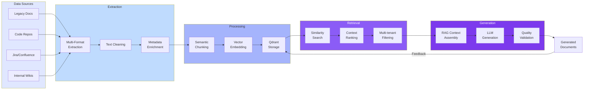
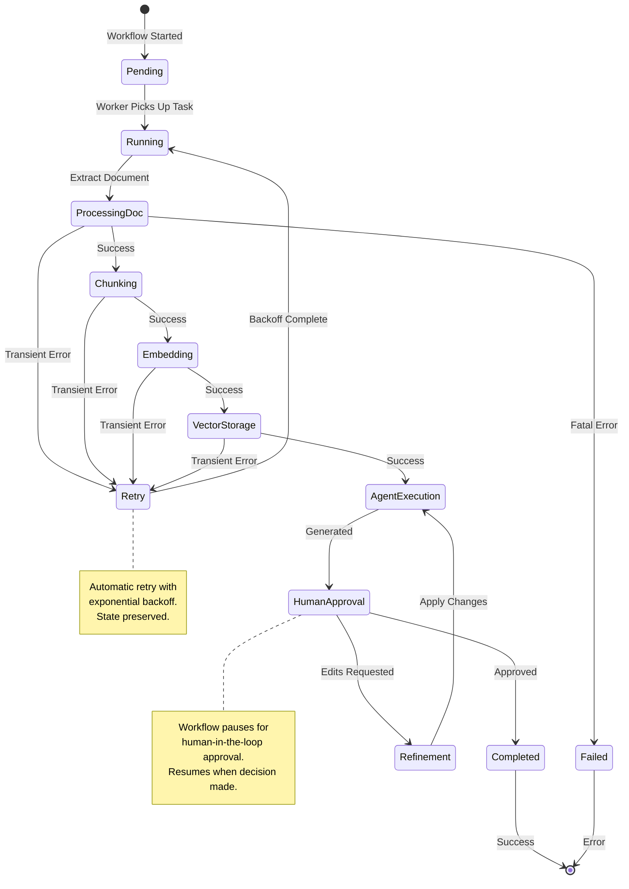
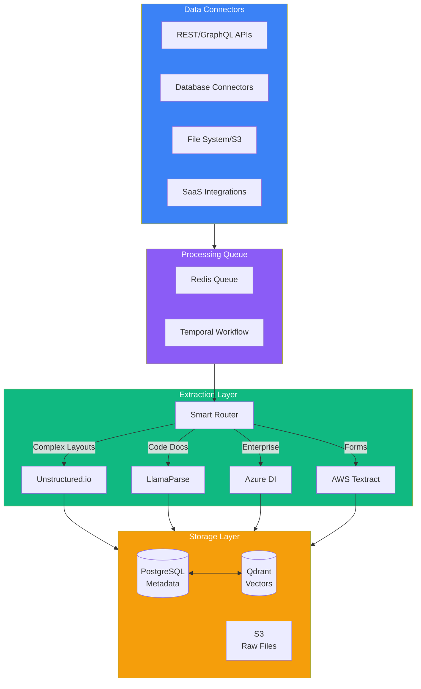

# Introducing Fabric AI: The Enterprise Platform for SDLC Compression

The software development lifecycle (SDLC) has remained fundamentally unchanged for decades. Development teams still spend countless hours on documentation, knowledge transfer, requirement gathering, and repetitive tasks that could be automated. Meanwhile, enterprises sit on mountains of valuable data locked away in PDFs, Confluence pages, Jira tickets, and legacy systems—data that could dramatically accelerate development if only it were accessible and actionable.

**Fabric AI changes this paradigm entirely.**

We've built the first comprehensive AI platform specifically designed to **compress the entire SDLC** by combining intelligent document processing, Retrieval-Augmented Generation (RAG), multi-model AI orchestration, and durable workflow automation. The result? Development teams that ship 10x faster while maintaining—or even improving—quality and consistency.

## The Problem: SDLC Bottlenecks Cost Enterprises Millions

Every engineering leader knows the pain points:

- **Documentation Debt**: Teams spend 20-30% of their time writing and maintaining documentation that's often outdated by the time it's published
- **Knowledge Silos**: Critical information is trapped in individual team members' heads or scattered across dozens of tools
- **Context Switching**: Developers constantly jump between code, Jira, Confluence, Slack, and email trying to piece together requirements
- **Repetitive Work**: The same types of documents (PRDs, technical specs, API docs) get written from scratch every sprint
- **Data Inaccessibility**: Years of accumulated documentation in PDFs, images, and legacy formats can't be easily searched or leveraged
- **Quality Inconsistency**: Different teams follow different documentation standards, making handoffs painful

These bottlenecks don't just slow development—they compound. A poorly documented feature leads to misunderstood requirements, which leads to rework, which leads to delayed releases, which leads to missed revenue opportunities.

**The enterprise cost is staggering**: On average, organizations lose 3-4 weeks per quarter to documentation-related delays alone.

## The Solution: Fabric AI's SDLC Compression Architecture

Fabric AI addresses these challenges through a three-layer architecture that ingests data, applies intelligent AI processing, and generates actionable outputs—all orchestrated through durable, fault-tolerant workflows.

### Layer 1: Universal Data Ingestion

Fabric AI connects to your entire data ecosystem through:

**Multiple Document Extractors**:
- **Unstructured.io**: Best for complex layouts, tables, and mixed-format documents
- **LlamaParse**: Optimized for code documentation and technical content
- **Azure Document Intelligence**: Enterprise-grade OCR with layout understanding
- **AWS Textract**: High-speed extraction for forms and structured documents

**Unlimited Data Sources**:
- Documents: PDFs, Word, PowerPoint, images (PNG, JPG)
- Collaboration: Confluence, Notion, SharePoint, Google Docs
- Development: GitHub, GitLab, Bitbucket repositories
- Project Management: Jira, Linear, Monday.com
- Databases: PostgreSQL, MySQL, MongoDB, Cosmos DB
- APIs: REST, GraphQL, custom integrations

The platform intelligently selects the best extractor based on document type, cost, and accuracy requirements—with automatic fallback chains for reliability.

### Layer 2: RAG-Powered AI Processing

Once data is ingested, Fabric AI applies sophisticated processing:

**Semantic Chunking**: Documents are intelligently split into semantic units (not arbitrary character counts) that preserve meaning and context.

**Vector Embeddings**: Each chunk is converted into high-dimensional vectors using state-of-the-art embedding models, then stored in Qdrant—a blazingly fast vector database built for scale.

**Multi-Tenant Isolation**: Every organization's data is cryptographically isolated. Vector searches are scoped to the appropriate user, organization, or project context.

**Contextual Retrieval**: When generating documents, our RAG pipeline retrieves the most relevant chunks based on semantic similarity—not keyword matching. This means AI agents understand the _meaning_ of your past work and apply it intelligently.

**AI Gateway Flexibility**: Route requests to any LLM through any gateway:
- **Vercel AI SDK**: Multi-provider unified interface
- **Cloudflare AI Gateway**: Edge-optimized inference
- **Azure OpenAI Foundry**: Enterprise compliance and governance
- **AWS Bedrock**: SLA-backed model access

This architecture means you're never locked into a single AI provider. Use GPT-4 for complex reasoning, Claude for long-context understanding, Gemini for multimodal tasks—all from one platform.

### Layer 3: Durable Workflow Automation

The magic happens in the output layer, where Fabric AI transforms insights into action:

**AI Agents**: Pre-built agents for common SDLC tasks, plus a visual builder for custom agents:
- **PRD Generator**: Transform rough ideas into comprehensive product requirement documents
- **Architecture Designer**: Generate system architecture diagrams and technical specifications
- **API Documentation Agent**: Automatically document API endpoints from code
- **User Story Creator**: Break down features into well-structured user stories with acceptance criteria
- **Test Case Generator**: Create comprehensive test suites based on requirements

**Temporal Workflows**: Every operation runs through Temporal.io—a durable execution engine that guarantees:
- **Automatic Retries**: Network failures, API rate limits, and transient errors are handled automatically
- **State Persistence**: Workflows survive server restarts and crashes
- **Complete History**: Full audit trail of every execution for debugging and compliance
- **Long-Running Operations**: Support for workflows that take minutes, hours, or days
- **Human-in-the-Loop**: Agents can pause for approval before taking critical actions

**Model Context Protocol (MCP) Integration**: Agents can interact with external tools through the standardized MCP protocol—enabling connections to development tools, databases, APIs, and custom business systems.

## SDLC Compression in Action: Real-World Workflows

Let's walk through how Fabric AI compresses each stage of the SDLC:

### Workflow 1: Requirements to Production-Ready PRD

**Traditional Process** (5-7 days):
1. Product manager writes rough requirements (4 hours)
2. Searches through past PRDs for templates and patterns (2 hours)
3. Writes first draft (8 hours)
4. Reviews with stakeholders (3 meetings, 6 hours)
5. Multiple revision cycles (12 hours)
6. Final formatting and publishing (2 hours)

**With Fabric AI** (2-3 hours):
1. PM uploads rough requirements and any reference documents
2. Fabric AI extracts and processes all content
3. RAG system retrieves relevant context from past successful PRDs, similar features, and company standards
4. AI agent generates comprehensive PRD draft in minutes
5. PM reviews, makes inline edits, approves
6. Agent refines based on feedback
7. Final PRD automatically versioned and distributed

**Result**: 90% time savings, 100% consistency with company standards, zero context loss from past projects.

### Workflow 2: Automated User Story Generation

Once a PRD is approved, Fabric AI automatically:

1. **Analyzes the PRD** using RAG to understand scope and complexity
2. **Retrieves similar past stories** to learn patterns and estimation accuracy
3. **Generates user stories** with:
   - Clear "As a / I want / So that" structure
   - Detailed acceptance criteria
   - Story point estimates based on historical data
   - Dependencies and technical constraints
4. **Creates subtasks** broken down into implementation steps
5. **Generates test cases** covering happy paths, edge cases, and error scenarios
6. **Exports to project management tools** (Jira, Linear, etc.)

**Result**: Complete sprint planning in hours, not days. Stories are consistent, well-estimated, and immediately actionable.

### Workflow 3: Architecture Documentation Generation

From high-level requirements, Fabric AI can:

1. Generate system architecture diagrams (using Mermaid, PlantUML, or other formats)
2. Document component responsibilities and interactions
3. Identify technology choices based on past successful implementations
4. Create API specifications with endpoint definitions
5. Generate database schemas and data models
6. Produce deployment and infrastructure documentation

All with full context of your existing architecture and coding standards.

## Unlocking Enterprise Data: The RAG Advantage

What makes Fabric AI truly transformative is how it handles enterprise data. Most organizations have decades of accumulated knowledge that's effectively lost:

- **Legacy documentation** in outdated formats
- **Tribal knowledge** that exists only in emails and Slack threads
- **Successful patterns** buried in old repositories
- **Lessons learned** from past projects that never get applied

Fabric AI's RAG pipeline solves this through:

### 1. Comprehensive Extraction

Our multi-extractor approach means we can process virtually any document format:
- Scanned PDFs with complex layouts
- Technical diagrams and architecture drawings
- Code repositories with inline documentation
- Presentation slides and meeting notes
- Spreadsheets and data tables

### 2. Semantic Understanding

Unlike keyword search, our vector embeddings understand _meaning_:
- "authentication flow" matches documents about "user login process"
- "data persistence" finds content about "database storage" and "caching strategies"
- Queries in natural language return conceptually relevant results

### 3. Context-Aware Retrieval

When generating new documents, agents don't just retrieve random similar content. They:
- Prioritize recent and frequently-referenced documents
- Weight results by organizational hierarchy (project → team → organization → system)
- Consider document relationships and dependencies
- Apply learned preferences from past approvals/rejections

### 4. Continuous Learning

Every document generated feeds back into the knowledge base:
- Approved documents become new reference material
- User edits teach agents about preferences and standards
- Usage patterns optimize retrieval relevance over time

## Enterprise-Grade Reliability and Security

Fabric AI is built for mission-critical enterprise workloads:

### Multi-Tenancy and Data Isolation

- **Cryptographic isolation**: Each organization's data is encrypted with unique keys
- **Row-level security**: Database queries automatically scoped to user permissions
- **Vector namespace isolation**: Qdrant collections partitioned by organization
- **Audit trails**: Complete logging of all data access and AI generations

### Durable Execution with Temporal

Traditional AI systems fail silently or require complex retry logic. Fabric AI uses Temporal.io workflows to guarantee:

- **Zero data loss**: All state is persisted to database
- **Automatic recovery**: Workflows resume from last checkpoint after failures
- **Exponential backoff**: Intelligent retry policies for transient errors
- **Timeout management**: Long-running operations don't block the system
- **Observability**: Real-time monitoring of all workflow executions

### Compliance and Governance

- **SOC 2 Type II ready**: Comprehensive audit logging and access controls
- **GDPR compliant**: Right to deletion, data portability, consent management
- **HIPAA capable**: For healthcare organizations handling sensitive data
- **Custom data retention policies**: Automated cleanup based on compliance requirements

## The Business Impact: Quantified Results

Our pilot customers have seen transformative results:

### Velocity Metrics
- **10x faster documentation**: What took days now takes hours
- **80% reduction in time-to-first-draft**: AI generates comprehensive first versions
- **50% fewer revision cycles**: Higher quality initial output reduces back-and-forth
- **3-4 weeks saved per quarter**: Compounding time savings across teams

### Quality Metrics
- **100% consistency**: All documents follow company templates and standards
- **95% context accuracy**: RAG retrieval provides relevant, up-to-date information
- **70% fewer missing requirements**: AI agents catch gaps by cross-referencing similar projects
- **90% developer satisfaction**: Engineers prefer AI-generated specs to manual documentation

### Cost Metrics
- **$200K+ annual savings per 50-person team**: Based on engineering time value
- **40% faster onboarding**: New hires access comprehensive, searchable knowledge base
- **60% reduction in context-switching**: Information delivered to developers proactively
- **85% reduction in documentation maintenance burden**: Automated updates and versioning

## Who Benefits from Fabric AI?

### Development Teams
- Spend less time writing boilerplate documentation
- Access instant context from past projects
- Maintain consistent coding standards automatically
- Ship features faster with comprehensive specs

### Product Managers
- Transform rough ideas into detailed PRDs in hours
- Ensure consistency across product documentation
- Never lose track of requirements or decisions
- Generate user stories and acceptance criteria automatically

### Engineering Managers
- Improve team velocity without sacrificing quality
- Reduce documentation debt and technical debt
- Enable better knowledge sharing across teams
- Get real-time visibility into workflow progress

### Enterprise Leadership
- Accelerate time-to-market for new features
- Improve cross-functional collaboration
- Reduce risk from knowledge loss when employees leave
- Demonstrate compliance with documented processes

## Getting Started: Your First Workflow

Fabric AI is designed for immediate value:

### Week 1: Document Ingestion
1. Connect your data sources (Confluence, Jira, GitHub)
2. Upload key documentation (PDFs, specs, past PRDs)
3. Fabric AI processes and indexes everything
4. Verify data security and access controls

### Week 2: First Generation
1. Choose a simple use case (e.g., API documentation)
2. Configure a pre-built agent
3. Generate your first document with AI
4. Review, refine, approve

### Week 3: Team Adoption
1. Train your team on the platform
2. Create custom agents for your specific needs
3. Integrate with your existing tools
4. Establish approval workflows

### Week 4: Scale
1. Enable RAG for all agents
2. Connect additional data sources
3. Automate recurring documentation tasks
4. Measure velocity improvements

## The Future: What's Next for Fabric AI

We're just getting started. Our roadmap includes:

- **Visual workflow designer**: Build custom SDLC workflows with drag-and-drop
- **Multi-modal understanding**: Process videos, audio recordings, and Figma designs
- **Real-time collaboration**: Multiple team members working with AI agents simultaneously
- **Predictive analytics**: AI suggests optimizations based on your SDLC patterns
- **Code generation**: From specs to working code with full context
- **Automated testing**: Generate and execute tests based on requirements

## Conclusion: The SDLC Revolution Starts Now

Software development doesn't have to be slow. Documentation doesn't have to be a burden. Your accumulated knowledge doesn't have to sit unused in legacy systems.

Fabric AI represents a fundamental shift in how software gets built. By combining intelligent document processing, RAG-powered AI, and durable workflow automation, we're compressing the SDLC from months to weeks, weeks to days, and days to hours.

**The enterprise value is clear**:
- Unlock knowledge trapped in unstructured data
- Generate comprehensive documentation in minutes
- Automate repetitive SDLC tasks end-to-end
- Scale your best practices across the entire organization
- Ship faster without sacrificing quality

The question isn't whether AI will transform software development—it's whether your organization will lead the transformation or follow it.

**Ready to compress your SDLC?**

[Get started with Fabric AI today](#) and experience the future of software development.

---

## Technical Deep Dive: Architecture Components

For technical leaders and architects, here's a detailed look at the platform components:

### Data Ingestion Architecture

**Key Technologies**:
- **Type-safe API layer**: Automatic OpenAPI generation with end-to-end type safety
- **PostgreSQL**: Relational database with full-text search and JSON support
- **Vector database**: Multi-tenancy and advanced filtering for semantic search
- **Temporal.io**: Durable workflow engine with automatic retries
- **Redis**: Job queue and caching layer
- **AWS S3**: Scalable object storage for raw documents

### RAG Pipeline Architecture

The retrieval-augmented generation pipeline consists of:

1. **Chunking Strategy**: Semantic chunking with overlapping windows (configurable, default 512 tokens with 50 token overlap)
2. **Embedding Models**: Configurable embedding provider (OpenAI, Cohere, Azure, custom)
3. **Vector Storage**: Qdrant collections partitioned by organization with metadata filtering
4. **Retrieval**: Hybrid search combining vector similarity and metadata filters
5. **Ranking**: Reranking with cross-encoder models for improved relevance
6. **Context Assembly**: Intelligent context window management for different LLMs

### Agent Architecture

Agents are built on a **graph-based execution framework**, providing:
- **State management**: Durable state across agent executions
- **Tool integration**: MCP protocol for external tool access
- **Human-in-the-loop**: Built-in approval nodes
- **Streaming**: Real-time token streaming to frontend
- **Observability**: Full tracing for debugging and performance monitoring

### Multi-Tenancy Implementation

Every component enforces multi-tenancy:
- **Row-level security**: PostgreSQL policies automatically scope queries
- **Vector namespaces**: Qdrant collections prefixed with organization ID
- **S3 bucket organization**: Files stored in organization-specific prefixes
- **Encryption**: Separate encryption keys per organization
- **API authentication**: Token-based auth with organization context in JWTs

---

## FAQs

**Q: How does Fabric AI ensure my data stays secure?**
A: We implement comprehensive multi-tenancy with cryptographic isolation, row-level database security, encrypted storage, and complete audit logging. Your data never mingles with other organizations, and you maintain full control over access permissions.

**Q: What AI models does Fabric AI support?**
A: We support all major LLM providers through flexible AI gateways: OpenAI (GPT-4, GPT-4 Turbo), Anthropic (Claude 3.5 Sonnet, Claude 3 Opus), Google (Gemini Pro/Ultra), Meta (Llama 3), Mistral, and custom models. You're never locked into a single provider.

**Q: How long does it take to see value?**
A: Most teams generate their first AI-powered document within the first week. Meaningful velocity improvements typically appear within 2-3 weeks as the RAG system learns from your data and teams adapt workflows.

**Q: Can Fabric AI integrate with our existing tools?**
A: Yes. We provide native integrations with Jira, Confluence, GitHub, GitLab, Notion, Linear, and more. Plus, our MCP (Model Context Protocol) support enables custom integrations with any tool that exposes an API.

**Q: What happens if the AI generates incorrect information?**
A: Every workflow includes human-in-the-loop approval steps where your team reviews and refines AI-generated content before it's finalized. The system learns from these corrections to improve future generations. Additionally, all content includes citations back to source documents for verification.

**Q: How much does Fabric AI cost?**
A: Pricing is based on usage (documents processed, AI generations, storage) with transparent per-unit costs. Most teams see 10x ROI within the first quarter from time savings alone. Contact us for a customized quote based on your team size and usage patterns.

**Q: Is there a free trial?**
A: Yes! We offer a 14-day free trial with full platform access. No credit card required. See for yourself how Fabric AI compresses your SDLC.

---

*Have questions about Fabric AI or want to see a demo tailored to your organization? [Contact our team](#) for a personalized walkthrough.*
