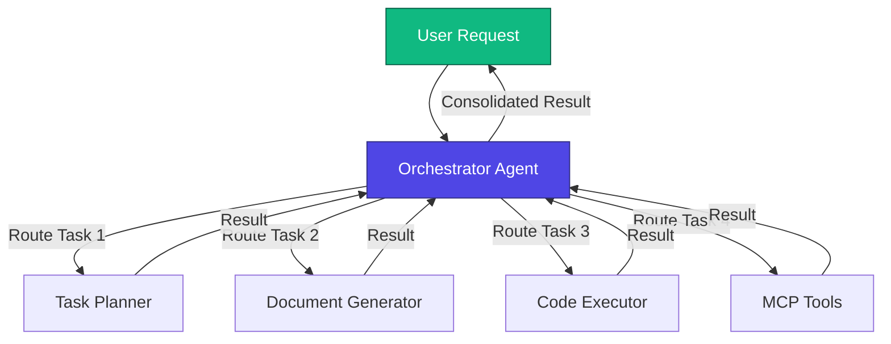
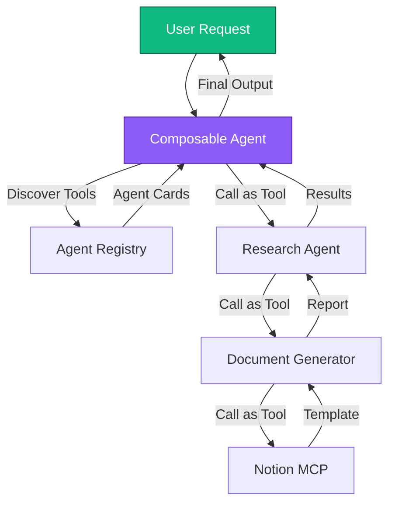
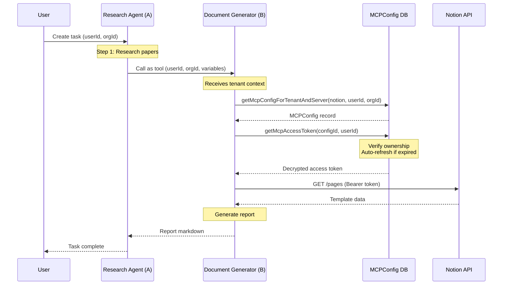
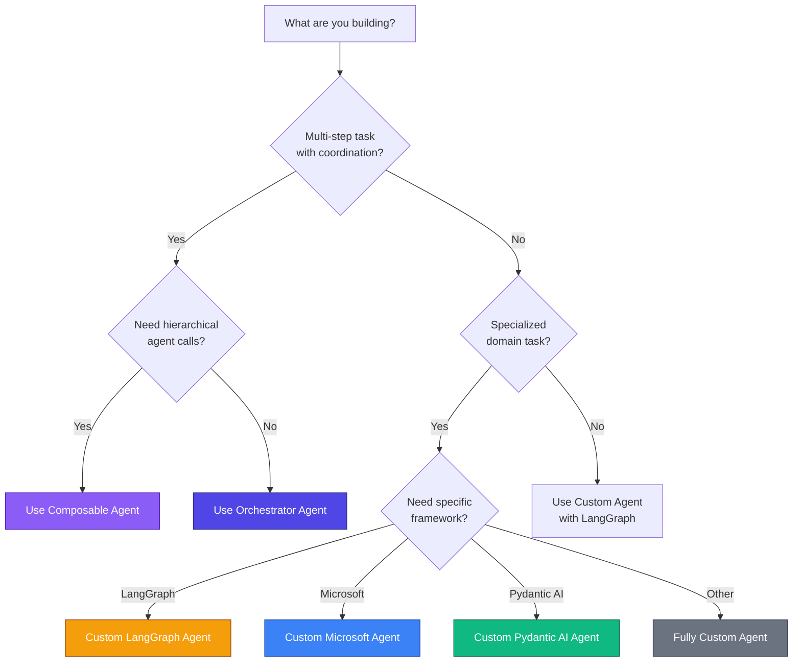

# Understanding Fabric Agent Types

Fabric Portal provides three distinct types of AI agents, each designed for different use cases and architectural patterns. This guide will help you understand when to use each type and how to build effective multi-agent systems.

## Overview of Agent Types

Fabric supports three categories of agents:

1. **System Agents** - Pre-built agents for common patterns (Orchestrator, Composable)
2. **Custom Agents** - Build your own specialized agents with various frameworks

### Quick Comparison

| Agent Type | Best For | Complexity | Customization |
|------------|----------|------------|---------------|
| **Orchestrator Agent** | Multi-step tasks requiring coordination | Low | Limited |
| **Composable Agent** | Hierarchical agent systems | Medium | Medium |
| **Custom Agent** | Specialized domain tasks | High | Full |

---

## 1. Fabric Loom Agent 🎯

### What is it?

The Orchestrator Agent uses a **hub-and-spoke architecture** to intelligently route tasks to specialized agents via the A2A (Agent-to-Agent) protocol. It acts as a central coordinator that delegates work to the best agent for each subtask.

### Architecture



### When to Use

✅ **Use Orchestrator Agent when:**
- You have complex multi-step tasks that require different specialized agents
- You need dynamic agent selection based on task requirements
- You want automatic result consolidation from multiple agents
- You're building enterprise-grade multi-agent systems

❌ **Don't use when:**
- You have a simple single-purpose task (use Custom Agent instead)
- You need agents to call other agents as tools (use Composable Agent instead)

### Example Use Case

**Research Report Generation**:
1. User: "Research AI trends and create a comprehensive report"
2. Orchestrator routes to Research Agent → gathers papers
3. Orchestrator routes to Document Generator → creates report
4. Orchestrator routes to Task Planner → creates follow-up tasks
5. Orchestrator consolidates all results and returns to user

### Code Example

```typescript
// The Orchestrator Agent is a system agent - no code needed!
// Just use it via the UI or API

const result = await orpcClient.agents.execute({
  agentId: "orchestrator",
  message: "Research AI trends and create a comprehensive report",
  userId: session.user.id,
  organizationId: session.user.organizationId,
});
```

---

## 2. Fabric Composable Agent 🔗

### What is it?

The Composable Agent uses a **hierarchical architecture** where agents can call other agents as tools. It dynamically discovers agent capabilities via A2A protocol and composes complex workflows by chaining specialized agents.

### Architecture



### Authentication Flow

The Composable Agent implements secure tenant context propagation for MCP credential lookup:



### When to Use

✅ **Use Composable Agent when:**
- You need hierarchical agent systems (agents calling agents)
- You want dynamic tool discovery from Agent Cards
- You need automatic credential lookup for MCP tools
- You're building nested agent workflows

❌ **Don't use when:**
- You need simple hub-and-spoke delegation (use Orchestrator instead)
- You have a single-purpose task (use Custom Agent instead)

### Example Use Case

**Automated Research Pipeline**:
1. Composable Agent discovers available agents (Research, DocGen, Linear)
2. Calls Research Agent as tool → gathers papers
3. Research Agent calls DocGen as tool → creates report
4. DocGen calls Notion MCP as tool → fetches template
5. Results flow back up the hierarchy to user

### Code Example

```typescript
import {
  discoverAgentTools,
  executeAgentTool,
} from "@repo/agent-core";

// Discover tools from an agent
const tools = await discoverAgentTools("http://localhost:8080");

// Execute agent as tool with tenant context
const result = await executeAgentTool(
  tools[0],
  { format: "markdown" },
  {
    userId: session.user.id,
    organizationId: session.user.organizationId,
    executionId: "exec-123",
    variables: {
      research_papers: papers,
      key_findings: findings,
    },
  }
);
```

---

## 3. Custom Agents 🤖

### What are they?

Custom Agents are specialized agents you build yourself using various frameworks. Fabric supports multiple frameworks to give you flexibility in implementation.

### Supported Frameworks

#### LangGraph Agent
- **Best for**: Graph-based workflows, complex state management
- **Language**: Python/TypeScript
- **Features**: Checkpointing, streaming, custom nodes

#### Microsoft Agent (Semantic Kernel / AutoGen)
- **Best for**: Azure AI integration, Microsoft ecosystem
- **Language**: C#/Python
- **Features**: Azure AI, Microsoft Graph, enterprise features

#### Pydantic AI Agent
- **Best for**: Type-safe Python workflows, structured outputs
- **Language**: Python
- **Features**: Strong typing, validation, Pydantic models

#### Fully Custom Agent
- **Best for**: Unique requirements, legacy integration
- **Language**: Any (via A2A protocol)
- **Features**: Complete flexibility, framework-agnostic

### When to Use

✅ **Use Custom Agent when:**
- You have specialized domain-specific requirements
- You need full control over agent logic and state
- You're integrating with specific frameworks or services
- You need advanced features like graph-based reasoning

❌ **Don't use when:**
- Standard orchestration patterns work (use Orchestrator)
- You need agent-as-tool composition (use Composable)

### Example: LangGraph Custom Agent

```typescript
// Define your custom LangGraph agent
import { StateGraph } from "@langchain/langgraph";

const workflow = new StateGraph({
  channels: {
    messages: { value: (x, y) => x.concat(y) },
    context: { value: (x, y) => ({ ...x, ...y }) },
  },
});

workflow.addNode("research", researchNode);
workflow.addNode("analyze", analyzeNode);
workflow.addNode("report", reportNode);

workflow.addEdge("research", "analyze");
workflow.addEdge("analyze", "report");

const app = workflow.compile();

// Register as Custom Agent in Fabric
await orpcClient.agents.registry.create({
  name: "research-analyst",
  displayName: "Research Analyst",
  description: "Specialized agent for academic research analysis",
  framework: "LANGGRAPH",
  scope: "USER",
  config: {
    graphId: "research-analyst",
    model: "gpt-4o",
    systemPromptKey: "research-analyst-prompt",
  },
});
```

---

## Decision Matrix: Which Agent Type Should I Use?

Use this decision tree to choose the right agent type:



---

## Best Practices

### 1. Start Simple
- Begin with Orchestrator Agent for most multi-agent workflows
- Only use Composable Agent when you truly need hierarchical composition
- Use Custom Agents for specialized tasks that don't fit standard patterns

### 2. Leverage A2A Protocol
- All agents communicate via A2A protocol for interoperability
- Agent Cards provide automatic tool discovery
- Tenant context propagation ensures secure credential access

### 3. Security Considerations
- Never pass credentials in A2A messages
- Always use tenant context (userId/organizationId) for credential lookup
- Implement proper authorization checks in custom agents

### 4. Performance Optimization
- Use parallel execution when tasks are independent
- Implement caching for frequently accessed data
- Monitor agent execution times and optimize bottlenecks

---

## Getting Started

### Creating an Orchestrator Agent

1. Go to **Agents** → **Create Agent**
2. Select **Orchestrator Agent** under System Agents
3. Configure scope (User or Organization)
4. Add MCP servers for tool access
5. Start using immediately!

### Creating a Composable Agent

1. Go to **Agents** → **Create Agent**
2. Select **Composable Agent** under System Agents
3. Configure available agents to compose
4. Set up tenant context propagation
5. Test hierarchical workflows

### Creating a Custom Agent

1. Go to **Agents** → **Create Agent**
2. Select **Custom Agent**
3. Choose framework (LangGraph, Microsoft, Pydantic AI, or Custom)
4. Implement your agent logic
5. Deploy and register with Fabric

---

## Conclusion

Fabric's three agent types provide flexibility for any use case:

- **Orchestrator Agent** for multi-step coordination
- **Composable Agent** for hierarchical agent systems
- **Custom Agents** for specialized domain tasks

Choose the right agent type based on your requirements, and leverage Fabric's A2A protocol for seamless multi-agent communication.

## Learn More

- [Orchestrator Agent Documentation](/docs/agents/orchestrator)
- [Composable Agent Documentation](/docs/agents/composable)
- [Custom Agent Guide](/docs/agents/custom)
- [A2A Protocol Specification](/docs/protocols/a2a)
- [MCP Integration Guide](/docs/integrations/mcp)

---

*Have questions? Join our [Discord community](https://discord.gg/fabric) or check out the [GitHub repository](https://github.com/Fabric-Pro/fabric-oss).*

