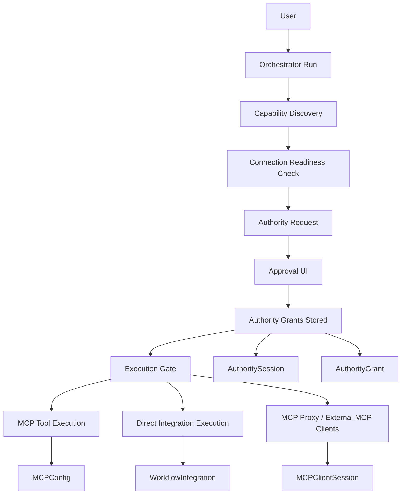

# Plan: Adapt Fabric toward a Pipes MCP-style session-scoped authorization model

## Goal

Design a Fabric-native implementation that preserves the current strengths of the platform — MCP connectivity, direct workflow integrations, orchestration, Temporal durability, approval UX, and multi-tenant isolation — while adding the core property of WorkOS Pipes MCP:

- **Agents receive time-limited, human-approved authority to use connected systems only for the duration of a run/session**
- **Stored credentials remain persistent, but runtime authority becomes ephemeral and revocable**

This plan is intentionally implementation-focused but stops short of making code changes.

---

## Success criteria

A successful implementation should make the following true:

1. A user can have long-lived connected integrations/MCP servers configured in Fabric.
2. An orchestrated task must obtain **runtime authority** before using selected external systems.
3. Authority is:
   - scoped to a user or org context
   - scoped to a workflow run / orchestrator run
   - time-limited
   - non-self-renewing
4. Authority can distinguish:
   - **read** access
   - **write** access
   - optionally **one-shot request** approval for highly sensitive actions
5. Every external execution path checks authority before use:
   - MCP tool execution
   - direct workflow integrations
   - MCP proxy transport for external clients
6. Existing Fabric approval/risk systems continue to work, but are layered **on top of** runtime authority rather than replacing it.
7. Tenant isolation rules remain intact in both personal and organization contexts.

---

## High-level implementation strategy

Instead of replacing Fabric's current model, add a new layer:

- **Persistent connectivity layer** (existing)
  - `MCPConfig`
  - `WorkflowIntegration`
  - OAuth/API key storage and refresh
- **Ephemeral authority layer** (new)
  - `AuthoritySession`
  - `AuthorityGrant`
  - grant enforcement at execution time
- **Approval layer** (existing + extended)
  - orchestrator approval UI
  - new provider/session grant approvals
- **Execution layer** (existing)
  - `executeMcpTool`
  - `IntegrationHandler`
  - MCP proxy route
  - provider-specific executors

In other words:

> Fabric should keep storing credentials as it does today, but stop treating configured credentials as sufficient runtime permission for agents.

---

## Proposed architecture

---

## Workstreams

## Workstream 1 — Model runtime authority explicitly

### Objective
Add first-class database models for runtime authority, separate from connection storage.

### Why
Current Fabric models persistent connectivity well, but does not model session-bound authority in a first-class way.

### Proposed schema additions

Introduce new tables along these lines:

#### `AuthoritySession`
Represents a time-bounded execution session tied to an orchestrator/workflow run.

Suggested fields:
- `id`
- `userId`
- `organizationId?`
- `runType` (`ORCHESTRATOR`, `WORKFLOW`, `MCP_PROXY`, maybe `AGENT_INSTANCE`)
- `runId` / `workflowId` / `conversationId`
- `status` (`PENDING`, `ACTIVE`, `EXPIRED`, `REVOKED`, `COMPLETED`)
- `requestedAt`
- `approvedAt?`
- `expiresAt`
- `revokedAt?`
- `requestedByAgentId?`
- `requestedByUserId`
- `approvalInstructions?` (user notes back to agent)

#### `AuthorityGrant`
Represents the actual scope granted within a session.

Suggested fields:
- `id`
- `authoritySessionId`
- `kind` (`BROAD`, `REQUEST`)
- `providerType` (`MCP`, `INTEGRATION`, maybe `FABRIC_NATIVE` later)
- `providerKey` (normalized provider key such as `github`, `slack`, `linear`, or fallback to server/config ID)
- `providerRefId?` (e.g. `mcpConfigId` or `workflowIntegrationId`)
- `accessLevel` (`READ`, `WRITE`)
- `toolScope?` (optional array/json for tool names)
- `requestFingerprint?` (for one-shot exact approvals)
- `status` (`PENDING`, `APPROVED`, `DENIED`, `CONSUMED`, `EXPIRED`, `REVOKED`)
- `approvedBy`
- `approvedAt?`
- `expiresAt`
- `consumedAt?`
- `metadata?`

### Design decisions
- Use **workflow/orchestrator run** as the main session boundary.
- Allow multiple grants per session.
- Separate `AuthoritySession` from `AuthorityGrant` so one run can authorize multiple providers.
- Preserve tenant isolation with the same XOR pattern already used across Fabric.

### Deliverables
- schema proposal
- migration plan
- query helpers
- lifecycle/state transition rules

---

## Workstream 2 — Normalize provider identity across MCP and direct integrations

### Objective
Define a common “provider authority target” model so Fabric can apply a single approval concept to:
- MCP servers
- workflow integrations
- possibly Fabric-native external tools later

### Why
Fabric currently has heterogeneous execution backends. Without normalization, session-scoped approval will be inconsistent and confusing.

### Proposed approach
Add a shared normalization layer in the orchestrator/execution domain:

#### `ResolvedAuthorityTarget`
Suggested structure:
- `type`: `mcp` | `integration`
- `providerKey`: normalized string like `github`, `slack`, `linear`, `notion`, `google-drive`, `custom:<serverKey>`
- `displayName`
- `refId`: config/integration ID
- `supportsRead`
- `supportsWrite`
- `defaultAccessLevel`
- `toolNames?`

### Mapping rules
- `WorkflowIntegration.provider` → direct provider key
- `MCPConfig` / `MCPServer.key` → provider key when known
- Custom MCP servers → fallback to server/config-scoped key
- Provider-specific OAuth executors (GitHub/Slack/Teams) should resolve to the same provider key as their integration counterpart

### Deliverables
- provider normalization spec
- utility to resolve a tool/integration into an authority target
- fallback rules for custom MCP servers

---

## Workstream 3 — Split “connection readiness” from “runtime authority” in routing

### Objective
Update orchestrator routing so it handles two distinct checks:

1. **Can Fabric technically access this system?**
2. **Is this run currently authorized to use it?**

### Why
Today Fabric is strong on connection detection, but the Pipes-style model requires a second layer.

### Existing reuse points
- `detect-required-connections.ts`
- `analyze-and-route.ts`
- integration search and tool-index search

### Proposed behavior changes

#### Step A — Continue existing connection detection
- if no connection exists: show connection-required flow
- if token is invalid/reauth required: show reconnect flow

#### Step B — Add authority need detection
After routing matches likely MCP tools/integrations, derive:
- required providers
- likely access level (`READ` or `WRITE`)
- whether broad or one-shot request approval is appropriate

#### Step C — Block execution if authority is missing
Routing result should be able to indicate:
- `blockedOnConnections`
- `blockedOnAuthority`
- `requiredConnections`
- `requiredAuthorityTargets`

### Proposed additions to routing result types
Add something like:
- `requiredAuthority?: Array<{ providerKey, displayName, accessLevel, reason, providerType, refId }>`
- `blockedOnAuthority?: boolean`
- `authoritySessionId?: string`

### Deliverables
- routing contract changes
- authority target derivation rules
- UX state definitions for blocked-on-authority flows

---

## Workstream 4 — Build authority request + approval flow

### Objective
Create the user-facing and workflow-facing approval lifecycle for session grants.

### Why
This is the feature users will feel most directly. It needs to be simple and clearly distinct from “connect an integration.”

### UX goals
The UI should clearly communicate:
- the connection already exists
- the agent is asking for temporary runtime access
- which providers are involved
- whether access is read-only or write-enabled
- how long the access lasts
- that it will expire automatically

### Proposed flow

#### For orchestrator/chat runs
1. User asks Fabric to perform a task.
2. Routing discovers likely providers and access levels.
3. Fabric pauses and presents an approval card/dialog.
4. User approves/denies each provider grant.
5. Optionally user adds instructions.
6. Fabric stores `AuthoritySession` + `AuthorityGrant`s.
7. Execution resumes.

#### For high-risk exact requests
If the plan reaches a sensitive write step:
1. Build request fingerprint
2. Request a one-shot grant
3. User approves that exact request
4. Grant is consumed on use

### Approval UI design suggestions
Approval surface should show:
- provider icon/name
- source type (`MCP server` or `Integration`)
- access level badge (`Read`, `Write`)
- TTL selector or default TTL display
- explanation of what Fabric plans to do
- optional user note back to the run

### Reuse opportunities
Fabric already has approval components and orchestrator pause/resume paths. Extend those rather than building a separate approval stack.

### Deliverables
- approval state machine
- API for creating authority requests
- UI wireframes / component plan
- resume behavior after approval/denial

---

## Workstream 5 — Enforce authority in all external execution paths

### Objective
Ensure every external action checks runtime authority before using stored credentials.

### Why
This is the heart of the feature. Without uniform enforcement, there will be bypasses.

### Enforcement points

#### 5.1 `executeMcpTool`
Before tool execution:
- resolve provider target
- determine operation type (`READ` vs `WRITE`)
- verify active broad grant or matching request grant
- fail clearly if missing/expired

#### 5.2 `IntegrationHandler`
Before executing direct workflow integrations:
- resolve provider target
- determine access level
- check active grant
- block on missing/expired authority

#### 5.3 Provider-specific OAuth executors
Examples already routed specially:
- GitHub
- Slack
- Microsoft Teams / Graph

These must share the same authority check to avoid becoming side doors.

#### 5.4 MCP proxy route
`MCPClientSession` currently grants short-lived transport access.
It should be extended so proxying also requires or references an active authority session.

### Implementation pattern
Create a shared service, e.g.:
- `authority-service.ts`

Responsibilities:
- `resolveAuthorityTarget(...)`
- `deriveAccessLevel(...)`
- `checkAuthority(...)`
- `consumeRequestGrant(...)`
- `expireAuthority(...)`

### Failure mode requirements
Authority failures should be structured and explicit:
- missing authority
- expired authority
- denied authority
- insufficient authority (`READ` granted but `WRITE` requested)
- request grant mismatch

### Deliverables
- shared enforcement module
- per-executor integration plan
- standardized error types

---

## Workstream 6 — Define read/write classification rules

### Objective
Build consistent classification of external operations into read vs write.

### Why
Pipes MCP explicitly gates reads and writes separately. Fabric needs a reliable equivalent.

### Existing assets to reuse
Fabric already has:
- destructive pattern detection
- risk assessment
- contextual tool filtering

### Proposed classification hierarchy

#### For direct integrations
Classify by operation name:
- read: `list_*`, `get_*`, `search_*`, `read_*`
- write: `create_*`, `update_*`, `delete_*`, `send_*`, `post_*`, `transition_*`

#### For MCP tools
Classify using layered heuristics:
1. explicit metadata if available
2. tool name patterns
3. input schema hints
4. registry metadata on known servers
5. fallback to conservative assumption for ambiguous tools

### Optional extension
Add explicit per-tool metadata in `MCPToolConfig` or cached tool metadata:
- `accessLevelHint`
- `requiresRequestGrant`

### Deliverables
- classification utility
- known-provider override tables
- conservative fallback policy

---

## Workstream 7 — Decide how this interacts with Fabric’s current approval systems

### Objective
Clarify what stays, what changes, and what becomes redundant.

### Current systems involved
- `MCPToolConfig.stakeLevel`
- `MCPToolApproval`
- trust-based approval in `UserOrchestratorPreferences.trustConfiguration`
- plan/step risk approvals
- destructive tool blocking

### Recommended model

#### Keep
- plan/step risk assessment
- destructive-operation safeguards
- approval history/audit trail

#### Reposition
- `stakeLevel` and trust-based approvals should become **secondary controls**
- they may reduce friction **within** an active authority session
- but they should not replace authority grants themselves

### Recommended rule of precedence
1. **Connection exists?** If no → connect/re-auth flow
2. **Authority granted?** If no → provider/session approval flow
3. **Step risk acceptable?** If no → step approval flow
4. **Tool-specific policies/trust rules** can optimize experience only after 1–3 pass

### Specific recommendation on legacy approval records
- Do **not** immediately remove `MCPToolApproval`
- Treat it as optional optimization for repeated operations inside a valid authority session
- Revisit simplification after rollout

### Deliverables
- policy precedence doc
- migration/compatibility strategy for approval systems

---

## Workstream 8 — Temporal session lifecycle and expiration handling

### Objective
Tie authority lifecycle to durable execution lifecycle.

### Why
Temporal is one of Fabric’s biggest strengths. It should define the practical session boundary.

### Proposed lifecycle

#### Session creation
- created when routing identifies external authority needs
- stays `PENDING` until user approval

#### Activation
- once approved, becomes `ACTIVE`
- grants become usable

#### Expiration triggers
- `expiresAt` reached
- run completes
- run canceled
- user manually revokes

#### Resume behavior on expiration mid-run
If a run continues after authority expires:
- pause execution
- surface “authority expired” state
- optionally request renewed approval from user
- do not auto-renew

### Implementation detail
Prefer explicit cleanup on completion, but also rely on TTL/expiration checks so correctness does not depend on cleanup jobs.

### Deliverables
- Temporal lifecycle integration design
- expiration handling rules
- cleanup strategy

---

## Workstream 9 — Extend MCP proxy to support authority-aware external clients

### Objective
Adapt Fabric’s external MCP transport story to match session-scoped authorization.

### Why
Current `MCPClientSession` is close in spirit but currently functions more like a short-lived transport token than a full authority model.

### Proposed options

#### Option A — Attach authority session to `MCPClientSession`
Add fields like:
- `authoritySessionId?`
- `allowedProviderKeys?`
- `accessLevel?`

#### Option B — Keep `MCPClientSession` transport-focused, but require lookup into `AuthoritySession`
This keeps concerns cleaner.

### Recommendation
Prefer **Option B**:
- `MCPClientSession` remains transport/session token
- execution/proxy path also checks active authority grants

That keeps transport auth and business authorization separate.

### Deliverables
- proxy authorization flow design
- token + authority relationship model

---

## Workstream 10 — Auditing, observability, and developer ergonomics

### Objective
Make the new model debuggable and reviewable.

### Why
Session-scoped authorization introduces additional failure modes and state transitions.

### Audit requirements
Log and persist:
- authority session created
- authority requested
- authority approved/denied
- authority grant consumed
- authority expired/revoked
- execution blocked due to insufficient authority

### Observability
Add structured logging around:
- provider resolution
- access-level derivation
- grant lookup result
- expiration cause
- mismatched request grants

### Debug/admin UX
Add visibility into:
- active authority sessions
- recent grants
- why a run is blocked
- which provider/tool caused the block

### Deliverables
- event taxonomy
- structured log fields
- debug/admin visibility requirements

---

## Workstream 11 — Security review checklist

### Objective
Validate the new model does not weaken Fabric’s existing guarantees.

### Key checks
- tenant isolation preserved for authority sessions and grants
- no org/personal cross-leakage
- authority checks always use the current user/org context
- expired grants cannot be reused
- one-shot request grants are consumed atomically
- direct integration paths cannot bypass authority checks
- provider-specific executors cannot bypass authority checks
- proxy tokens cannot be replayed to outlive authority expiration
- user notes/instructions returned from approval flow are safely handled

### Deliverables
- security review checklist
- threat model for bypass paths
- test matrix for tenant and expiration edge cases

---

## Workstream 12 — Rollout strategy

### Objective
Reduce risk by shipping incrementally.

### Recommended phases

#### Phase 0 — Spec and internal alignment
- finalize authority model
- finalize provider normalization
- choose session boundary
- define UI states

#### Phase 1 — Read-only authority sessions for orchestrator
- implement `AuthoritySession` / `AuthorityGrant`
- enforce only for read-only external access first
- support MCP + integrations in orchestrator
- no one-shot request grants yet

#### Phase 2 — Write authority gating
- enforce read/write split
- add stronger approval flows for writes
- integrate with direct integrations and provider-specific executors

#### Phase 3 — One-shot request grants
- exact request fingerprinting
- high-sensitivity writes
- grant consumption semantics

#### Phase 4 — MCP proxy alignment
- external MCP clients also become authority-aware

#### Phase 5 — Simplify legacy approval systems
- reassess `MCPToolApproval`, trust policies, and overlap with authority sessions

### Deliverables
- phased rollout plan
- migration flags/config toggles
- fallback/recovery procedures

---

## Proposed repository touchpoints

These are the most likely areas to change once implementation begins.

### Schema / persistence
- `packages/database/prisma/schema.prisma`
- `packages/database/prisma/queries/mcp.ts`
- likely new query modules for authority state

### Routing and discovery
- `packages/temporal/src/activities/orchestrator/routing/analyze-and-route.ts`
- `packages/temporal/src/activities/orchestrator/tools/detect-required-connections.ts`
- `packages/temporal/src/activities/orchestrator/tools/search-integrations.ts`
- `packages/temporal/src/activities/orchestrator/tools/tool-index.ts`

### Execution
- `packages/temporal/src/activities/orchestrator/execution/execute-mcp-tool.ts`
- `packages/temporal/src/activities/orchestrator/execution/handlers/integration-handler.ts`
- provider-specific OAuth executors under shared execution code
- `packages/temporal/src/activities/orchestrator/execution/handlers/mcp-tool-handler.ts`

### API / proxy
- `apps/web/app/api/mcp/proxy/route.ts`
- `packages/api/modules/mcp/procedures/configs.ts`
- any procedures that create MCP sessions or approvals

### UI / approvals
- orchestrator approval components under `apps/web/modules/saas/agents/components/`
- chat/orchestrator streaming state handling
- connection-required UI flows

---

## Key open questions to resolve before coding

1. **Primary authority scope**
   - provider-wide?
   - server/config scoped?
   - tool scoped?

2. **Session boundary**
   - orchestrator run only?
   - all Temporal workflows?
   - long-lived agent sessions?

3. **Approval default TTL**
   - fixed 5 minutes like Pipes?
   - risk-sensitive TTL?
   - user configurable?

4. **Custom MCP servers**
   - should all custom servers be treated as opaque server-scoped providers?

5. **Trust system interaction**
   - how much authority friction can trust remove, if any?
   - recommendation: trust should never eliminate the requirement for an active authority session

6. **MCP proxy consumers**
   - should external clients be able to request authority dynamically, or only consume pre-approved authority?

7. **One-shot request grant granularity**
   - exact URL/method/body hash?
   - tool name + normalized args hash?

---

## Recommended implementation order

If implementing this with minimal disruption, I’d do it in this order:

1. Finalize the authority domain model and provider normalization spec
2. Add schema + query layer for authority sessions/grants
3. Add routing support for `blockedOnAuthority`
4. Build approval creation + approval UI for broad provider grants
5. Enforce broad grants in `executeMcpTool` and `IntegrationHandler`
6. Extend provider-specific OAuth executors
7. Add session expiration/revocation handling in Temporal flows
8. Extend MCP proxy to require authority
9. Add one-shot request grants for high-risk writes
10. Reconcile/simplify legacy approval mechanics

---

## Expected outcome

If implemented this way, Fabric would end up with a stronger and more general model than the WorkOS starter template:

- **Pipes-like session-scoped authorization** for external systems
- **Fabric-native orchestration and Temporal durability**
- support across both **MCP servers** and **direct integrations**
- stronger auditability and richer approval UX
- a cleaner long-term separation between:
  - **stored credentials**
  - **runtime authority**
  - **step-level risk approvals**

This would position Fabric not just as “having MCP support,” but as having a true **runtime authorization layer for agent execution**.
