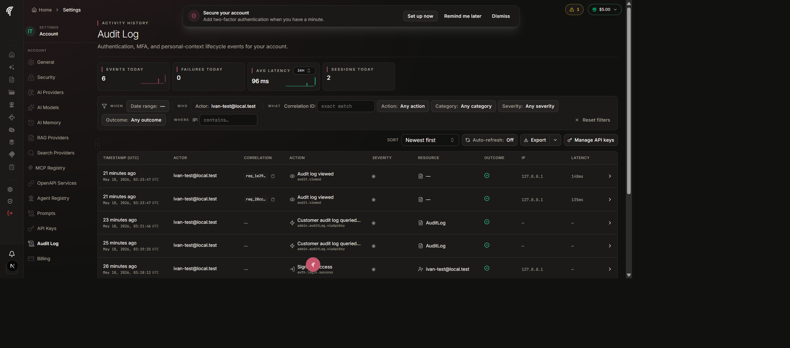

# Audit Log

Compliance-grade ledger of significant actor-driven events across every
Fabric tenant — emitted at the application layer, queryable from the
in-product viewer or the public REST API, retained for 90+ days.

- **Audience**: Developers, on-call operators, customer admins, Fabric staff
- **Owner**: Platform / SRE

## Sub-documents

| Document | One-line description |
|---|---|
| [architecture.md](./architecture.md) | Data model, emission helpers, redactor, retention, request-span trace capture on failure, performance characteristics. |
| [api.md](./api.md) | Public REST surface — `GET /api/v1/audit-log` and `GET /api/v1/audit-log/export` — auth, scopes, pagination, filters, error codes, curl examples. |
| [client-tools.md](./client-tools.md) | Staff-only workflow for inspecting a customer's audit log via API key (the in-product "Audit Log Explorer"), including a worked end-to-end example with screenshots. |

## Decision record

| ADR | Title |
|---|---|
| [ADR-006](../adr/006-audit-log-separate-table.md) | Audit log as a dedicated `AuditLog` table separate from `ProjectActivity` and the operational log stream. |

## What the customer sees

The in-product viewer renders the customer's own audit trail at
`/app/settings/audit-log` (personal) or
`/app/{slug}/settings/audit-log` (organization). Both surfaces share the
same component set and the same closed taxonomy of action keys.

Key affordances (numbered to match the v1+v2+v3 implementation rounds):

- **Compact stats strip** (events today, failures today, avg latency
  over a fixed 24-hour window — labelled `Avg latency (24h)` — and
  sessions today). The previous 1h / 6h / 24h / 7d dropdown was
  removed; 24h is the only window operators ever picked.
- **Filters grouped editorially** (`When` · `Who` · `What` · `Where`),
  matching the column order; the actor filter supports custom actor
  types (`user`, `api_key`, `system`, `agent`).
- **Table** with `Timestamp (UTC)`, `Actor`, `Correlation`, `Action`,
  `Severity` (dot + label + tooltip), `Resource`, `Project` *(org
  only)*, `Outcome` (icon + label + tooltip), `IP`, `Latency`, and a
  per-row drawer toggle. The Action cell tooltip surfaces the
  plain-language description for the event key. **Actor + IP cells are
  click-to-copy** so operators can hand off identities to support
  tickets without expanding the drawer.
- **Pagination** with 25 / 50 / 100 page-size selector persisted to
  `localStorage`.
- **Row drawer** opens with all metadata, the user-agent string, and a
  `Trace this flow` action that opens a left-side vertical timeline
  panel (`RequestSpan` + audit rows interleaved by timestamp).
- **Manage API keys** button opens a right-side drawer with the key
  list, mask/show + copy + rotate + revoke, last-used time, and the
  audit-log lifecycle history for the tenant. When
  `FABRIC_PUBLIC_API_DOCS_ENABLED=true`, the drawer header includes a
  link to the Swagger UI at `/api/v1/docs` so operators can craft
  curls against the public REST endpoint without leaving the page.
- **Action key reference** ( `(?)` help icon next to the Action
  filter) — opens a Dialog listing every action key Fabric can emit,
  grouped by category, with a one-line plain-language description and
  a fuzzy search. Hovering a row inside the Action filter dropdown
  shows the same description without opening the dialog.
- **Export** as CSV / NDJSON with a "Last 5 exports" chevron history
  (synchronous; see [api.md#export](./api.md#export)).

## What Fabric staff have on top

Admins can sign in and reach `/app/admin/audit-log-explorer`, paste a
customer's API key + base URL, and inspect that tenant's audit log
read-only — same view the customer sees, no special back-door query.

Every staff query emits an `admin.auditLog.viaApiKey` row into the
Fabric **internal** audit log (not the customer's), capturing the
actor, the resolved target tenant, the first 12 characters of the key
for forensic identification, and the filter set used.

See [client-tools.md](./client-tools.md) for the full workflow.

## Related runbooks + standards

- [`../adr/006-audit-log-separate-table.md`](../adr/006-audit-log-separate-table.md) — why a dedicated table.
- [`../monitoring/incidents.md`](../monitoring/incidents.md) — incident
  model; the audit log's `error.*` rows complement the dedicated
  incident tables.
- `fabric/standards/global/error-handling.md` — failure-handling
  conventions the audit-write helpers follow.

## How to read these docs

- Start with [`architecture.md`](./architecture.md) if you are wiring a
  new emitter or trying to understand retention / redaction guarantees.
- Jump to [`api.md`](./api.md) if you are integrating from outside the
  product (customer scripts, our CLI, our SDKs).
- Jump to [`client-tools.md`](./client-tools.md) if you are Fabric
  staff and need to inspect a customer's audit log during an incident
  or a compliance review.
- Read [ADR-006](../adr/006-audit-log-separate-table.md) when proposing
  to merge the audit log with application logs or with `ProjectActivity`.

Each sub-document is authoritative and self-contained; references
runbooks and other docs by link rather than duplicating content.
