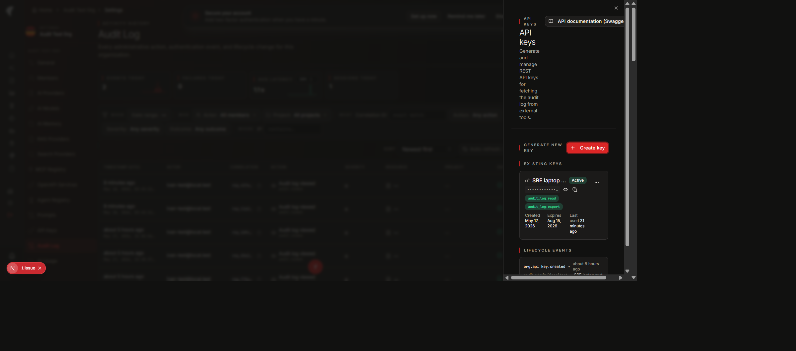
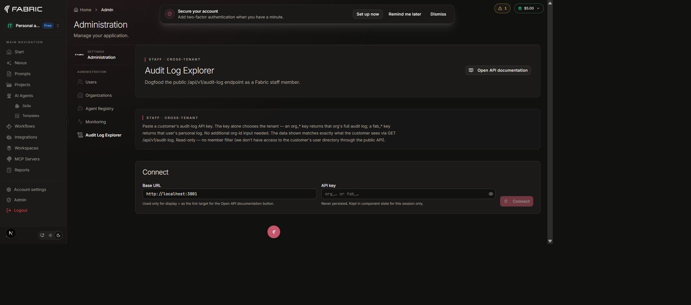
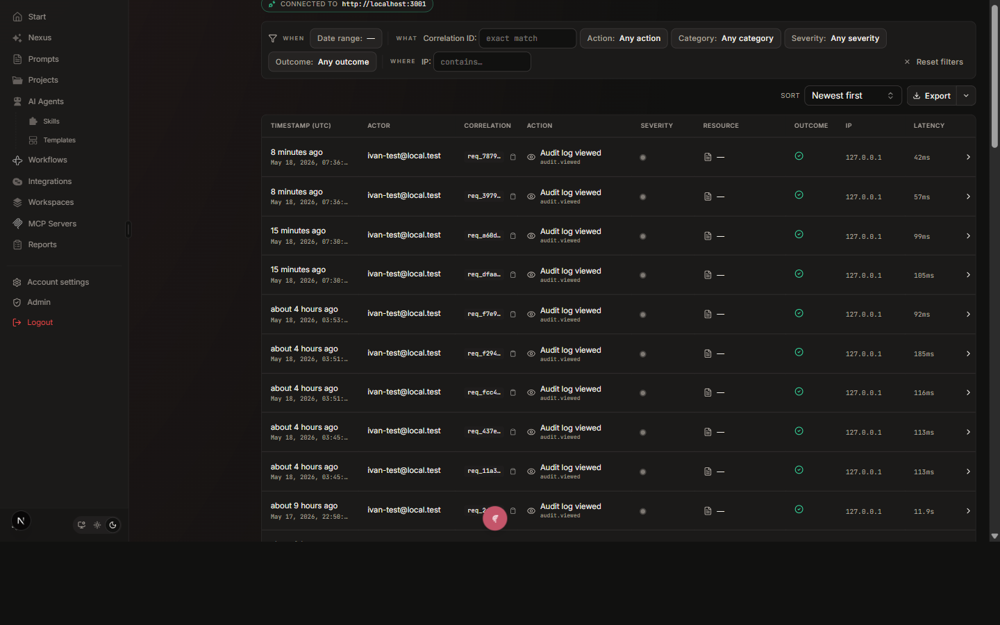
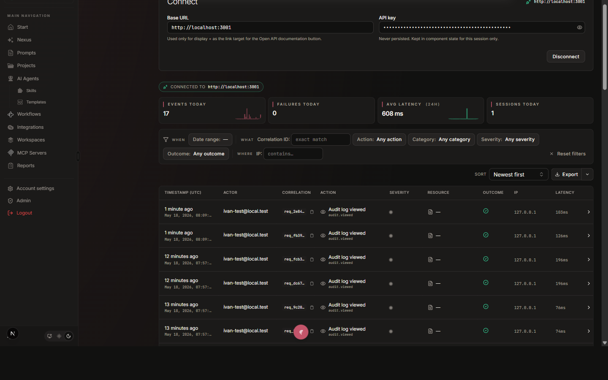

# Audit Log Client Tools

Staff-only workflow for inspecting a customer's audit log via API key,
plus a worked end-to-end example using two locally-running Fabric
instances.

- **Audience**: Fabric staff (support, SRE, engineering)
- **Owner**: Platform / SRE

## When to use this

The customer's audit log is the canonical source-of-truth for "who
did what, when" during a compliance review or an incident response.
Staff have three ways to see it:

1. **In-product viewer** — the customer can give you a screenshare or
   a screenshot. Works for everyone, no key needed, but slow and
   serial.
2. **Direct DB query** — fastest in dev, but unavailable against
   self-hosted customer deployments (their DB is theirs).
3. **REST API via the in-product Audit Log Explorer** — the customer
   provisions an API key with `audit_log:read`, gives it to you, you
   paste it into the explorer at `/app/admin/audit-log-explorer` and
   browse the customer's audit log read-only.

This page is about option 3 — the "Audit Log Explorer".

## Why an explorer (rather than direct REST calls)

Three reasons:

1. **No CORS surface to open**. The customer's REST endpoint is
   server-to-server only (no CORS). The explorer routes the customer's
   key through our admin oRPC proxy, so the staff browser never
   crosses origins.
2. **Audit trail of staff reads**. Every query emits an
   `admin.auditLog.viaApiKey` row into the Fabric **internal** audit
   log (NOT the customer's), capturing actor + target tenant + key
   prefix + filter set. We can prove who looked at what.
3. **Same shape the customer sees**. The explorer mounts the **same**
   React components as the in-product audit log viewer
   (`<AuditLogStatsStrip>`, `<AuditLogFilters>`, `<AuditLogTable>`,
   `<AuditLogExportButton>`, `<AuditLogMetadataDrawer>`,
   `<AuditLogSortControl>`, `<AuditLogActivePills>`) driven through a
   `dataSource` abstraction that swaps the underlying procedure
   without touching presentation. Anything the customer can show you
   over a screenshare, you can reproduce pixel-identically.

## The two-app testing flow (local)

The explorer accepts any base URL — `http://localhost:3001` for local,
`https://staging.fabric.pro` for staging, or
`https://customer-self-hosted.example.com` for a customer's deployment.
To rehearse against a "remote" Fabric without leaving your laptop,
run two app instances pointing at separate ports against the same dev
database:

```bash
# Terminal 1 — instance A, acts as "customer's deployment"
PORT=3001 pnpm --filter web dev

# Terminal 2 — instance B, acts as "Fabric staff console"
PORT=3002 pnpm --filter web dev
```

Both bind to the same Postgres at `localhost:64102`. In instance A,
sign in as the customer and provision an `org_*` API key with
`audit_log:read` scope. In instance B, sign in as a staff admin and
open `http://localhost:3002/app/admin/audit-log-explorer`. Paste the
key + `http://localhost:3001` as the base URL → connect → you're
viewing the "remote" customer's audit log.

> **Note**: In real staff use, the base URL is the customer's actual
> deployment (e.g. `https://audit.acme.example.com`). The local
> two-app rehearsal proves the cross-instance flow works without
> needing a customer environment.

## Worked example

### Step 1 — Customer provisions the key (instance A)

The customer (or you, if Fabric Cloud-hosted) goes to
`Settings → Audit Log → Manage API keys`, generates a key scoped
to `audit_log:read` (+ `audit_log:export` if you also need to pull
files), gives it an expiration matching the engagement window, and
copies the value once.



### Step 2 — Staff opens the explorer (instance B)

Navigate to `/app/admin/audit-log-explorer`. Empty state:



The page is admin-only. Server-side guard checks
`user.role === "admin"`; a non-admin lands on a 403 panel.

### Step 3 — Paste key + base URL

- **Base URL**: the customer's deployment origin (e.g.
  `https://audit.acme.example.com`, or `http://localhost:3001` in the
  two-app local rehearsal). Recent base URLs are remembered in
  `localStorage` so subsequent reviews are one-click.
- **API key**: `password` input. Show / hide toggle to verify the
  paste worked. **The key is NEVER persisted** anywhere on the staff
  side — it sits in component state for the session and is dropped
  when you navigate away or refresh.

Click **Connect**. The page calls the admin oRPC proxy
(`orpc.admin.auditLog.viaApiKey`), the proxy resolves the tenant from
the key prefix (`org_*` → org, `fab_*` → user), executes the read
against the local DB (no HTTP round-trip in the local rehearsal), and
streams rows back.





The view shows:
- A **"Connected to {baseUrl}"** pill above the stats strip so you
  always know which deployment you're reading from. The API key
  itself is never displayed anywhere outside the masked password
  textbox.
- **Stats strip** with four cards: Events Today (+ hourly sparkline),
  Failures Today, **Avg latency (24h)** (fixed window), Sessions
  Today.
- **Filter chip bar** identical to the customer's viewer except the
  Actor (members) and Project chips are hidden — the public REST
  surface has no view of the customer's user / project directory.
  Includes Date range, Action, Category, Severity, Outcome,
  Correlation ID search, IP contains, plus Reset filters.
- Active-filter pills below the chip bar when any filter is set.
- **Sort dropdown** (Newest / Oldest / Severity desc — `severity_desc`
  falls back to `newest` on the proxy since the public REST surface
  only orders by recency).
- **Export split-button** (CSV / NDJSON) with the same chevron
  history dropdown shape as the customer's; aggregates pages through
  the proxy up to the 50 000-row cap. The output is **byte-identical**
  to a customer-side `audit.export` download — same 17-column
  snake_case CSV header, same flat `actorEmailSnapshot` /
  `resourceType` field names in NDJSON. A parity test
  (`apps/web/modules/saas/admin/component/audit-log-explorer/__tests__/export-parity.test.ts`)
  fails the build if the two ever diverge.
- **Table** with the customer's full column set: Timestamp (UTC) ·
  Actor · Correlation · Action · Severity · Resource · Outcome · IP ·
  Latency · Details.
- Clicking a row opens the **same metadata drawer** as the viewer
  with All Metadata accordion. The "Trace this flow" button is
  hidden because the trace endpoint reads in-process spans (not
  reachable through the public REST surface).

### Step 4 — Filter, copy correlation IDs, repeat

Apply filters as needed (date range, action, severity, correlation).
The "Open API documentation" button in the page header opens the
customer's `/api/v1/docs` in a new tab so you can confirm the contract
matches what you're seeing.

### Step 5 — Disconnect

When done, click **Disconnect**. The component state is wiped; the
key is no longer in memory.

## What the audit trail of staff reads looks like

Every successful query emits one `admin.auditLog.viaApiKey` row into
the Fabric internal audit log. Example metadata payload:

```jsonc
{
  "keyPrefix": "org_bc52818d",       // first 12 chars only — never the secret
  "keyType": "organization",
  "targetTenant": {
    "kind": "organization",
    "organizationId": "cmp9zpkib00028s5hlmm1x13o",
    "userId": null
  },
  "filters": {
    "from": "2026-05-01T00:00:00Z",
    "to": null,
    "action": "auth.login.failure",
    "category": null,
    "severity": null,
    "outcome": null,
    "correlationId": null,
    "ipAddress": null
  },
  "rowsReturned": 7,
  "total": 12
}
```

A staff admin reviewing the internal audit log can filter on
`action: admin.auditLog.viaApiKey` and see exactly which engineer
queried which customer, with what filters, and what came back. The
row also captures the staff member's IP / user-agent / correlation id
the same way every other audit emit does — the proxy routes through
`recordAuditFromRequest(context, …)` so cross-tenant reads are
traceable back to the originating session.

## What NOT to do

- **Don't share API keys via chat / email**. The customer should
  generate a one-off scoped key with a short expiration and revoke it
  the moment the review ends.
- **Don't paste keys into the address bar or the browser console**.
  They will end up in browser history. The explorer's `password`
  input keeps them out of history.
- **Don't use the customer's key for anything other than reading their
  audit log**. The scope makes this impossible, but the principle
  matters: customer trust is the reason this surface exists.
- **Don't bypass the explorer with `curl` from a staff laptop**
  unless you have explicit authorization. The explorer's audit emit
  is the trail of record; curl bypasses that.

## Troubleshooting

| Symptom | Likely cause |
|---|---|
| `Invalid API key` | Typo, copy-paste truncation, or the customer revoked the key. Ask them to generate a fresh one. |
| `Insufficient scope` | Key lacks `audit_log:read`. Customer must regenerate with the right scope. |
| `Rate limit exceeded` | 600 req/min/key budget tripped. Wait 60s and retry. |
| Empty results | The customer hasn't emitted any matching rows — verify with them by screenshare against the in-product viewer. |
| Connection error | Customer's deployment unreachable from your origin. Check VPN, firewall, or whether the deployment URL is correct. |

## Related

- [`api.md`](./api.md) — the underlying REST surface the explorer uses.
- [`architecture.md`](./architecture.md) — data model + emission
  helpers + retention.
- [`../adr/006-audit-log-separate-table.md`](../adr/006-audit-log-separate-table.md)
  — why a dedicated table.
