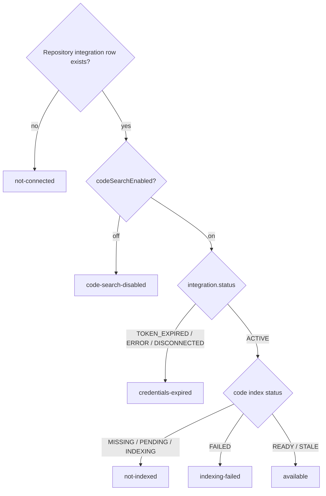

# AI Assistant Codebase-Availability Messaging

## Summary

When a repository is connected to a project, the AI Assistant must stop reporting "no repository attached." It will report the true codebase state — not-connected, code-search-disabled, credentials-expired, not-yet-indexed, indexing-failed, or available — and name the concrete next step (e.g. re-authenticate in Settings → Execution). Separately, when a repository's OAuth token expires, project members are notified proactively so the break is caught before anyone hits the assistant.

## Problem Frame

A PM reported on 2026-06-25 that they asked the assistant a code question on a project whose GitHub repo was visibly connected in Settings → Execution. The assistant replied *"NOT AVAILABLE: Codebase (no repository attached or analysis not completed)"* — flatly contradicting what the user could see on screen. Reproduced on staging: the repository row existed (`Fabric-Pro/fabric`, GitHub OAuth) with `status = TOKEN_EXPIRED` ("Automatic token refresh failed; re-authentication required", health-checked the same day), the code-search toggle was ON, and the code index was `MISSING` (never built).

The defect is a lossy collapse. `getProjectContextAvailability()` decides a single `hasCodebase` boolean from the legacy `Project.codeAnalysisStatus` field alone, never reading the repository-integration status. So "no repo attached" and "repo attached but token expired" produce the identical message. The user is told the repo isn't there when the real problem is an expired credential and an unbuilt index.

The cost compounds: the failure is silent (an expired token surfaces only deep in project settings), it pushes PMs back to interrupting a developer — defeating the platform's core value — and it recurs (similar reports on 4/3, 4/10, plus a "toggle appeared OFF" report that was most likely this same bug misattributed to the toggle).

## Key Decisions

- **Drive availability from the signals the assistant actually uses, not the legacy field.** Codebase availability is derived from repository-integration status + code-index status + the `codeSearchEnabled` toggle — the same inputs the assistant's code search depends on — instead of `Project.codeAnalysisStatus`. That mismatch is the root cause: the message can claim a state the search engine doesn't share.
- **The "available?" answer becomes a discriminated state, not a boolean.** A boolean cannot carry the distinction the user needs; the fix widens it into named states, each with its own message and next step.
- **Owner-aware guidance is static text, never per-viewer.** The availability message lives in the project-scoped system-prompt context block, which is built server-side and reused across everyone viewing the project. Branching the message on the current viewer's role would leak one user's permissions into another's context. The "you may need a project owner to re-authenticate" hint is therefore a fixed string, not a permission lookup.
- **Reuse the existing notification helper at the single status chokepoint.** Token-expiry notification calls the existing `createRepoIntegrationCredentialNotification` helper at the one `setIntegrationStatus()` transition point — no new notification infrastructure, channel, or schema.
- **Scope is message + notification; automatic re-indexing is deferred.** Coupling OAuth re-auth to an automatic index rebuild crosses a seam the codebase deliberately leaves uncoupled and forces a separate product decision (manual → automatic indexing). It is out of scope here.

## Requirements

**Accurate codebase-availability messaging**

- R1. `getProjectContextAvailability()` derives codebase availability from repository-integration status, code-index status, and the `codeSearchEnabled` toggle — not solely from `Project.codeAnalysisStatus`.
- R2. The availability result is a discriminated state distinguishing at least: `not-connected`, `code-search-disabled`, `credentials-expired`, `not-indexed` (covers never-built and in-progress), `indexing-failed`, and `available`.
- R3. When a repository integration row exists for the project, no assistant message says or implies "no repository attached."
- R4. The `credentials-expired` message states the repo is connected, that its credentials expired, and the next step (re-authenticate in Settings → Execution), plus a static owner-aware hint. It does not branch on the viewer's identity or role.
- R5. The `not-indexed` message states the repo is connected and its code is pending or being indexed — never that no repository is attached.
- R6. `available` is reported only for the input combination under which the assistant's code search actually returns results, so "available" and "unavailable" never disagree with search behavior.

**Proactive token-expiry notification**

- R7. When a repository integration transitions into the credentials-expired state at the status chokepoint, the project's members are notified via the existing credential-notification helper.
- R8. The expiry notification does not duplicate an already-pending credential notification for the same integration, and introduces no new notification type or delivery channel.

## Acceptance Examples

- AE1. The reported bug. **Given** a connected repo with `status = TOKEN_EXPIRED` and code index `MISSING`, code-search ON, **When** the user asks a codebase question, **Then** the assistant says the repo is connected but credentials expired and points to re-authentication — **not** "no repository attached." **Covers R3, R4.**
- AE2. **Given** a connected, healthy repo whose index is `MISSING`/`PENDING`/`INDEXING`, **When** the user asks a codebase question, **Then** the assistant says the repo is connected and indexing is pending/in progress. **Covers R5.**
- AE3. **Given** no repository integration row exists, **When** the user asks a codebase question, **Then** the assistant says no repository is connected and how to connect one. **Covers R2.**
- AE4. **Given** a connected repo with `codeSearchEnabled = false`, **When** the user asks a codebase question, **Then** the assistant says a repo is connected but code search is disabled, and how to enable it. **Covers R2.**
- AE5. **Given** a repository integration transitioning to `TOKEN_EXPIRED`, **When** the transition is written, **Then** project members receive exactly one credential notification (no duplicate if one is already pending). **Covers R7, R8.**

## Availability decision

Each leaf maps to one distinct assistant message; `available` is the only state under which code search is exercised normally.

## Scope Boundaries

- **Deferred — auto-reindex after re-auth.** Wiring the OAuth reconnect callback to trigger an index rebuild is a separate ticket; it crosses the OAuth↔Atlas seam and needs its own product decision.
- **Deferred — notification breadth.** This fix notifies on the `TOKEN_EXPIRED` transition; whether to also notify on `ERROR`/`DISCONNECTED` is left to that follow-up.
- **Verified, not changed — AC3 toggle persistence.** The `codeSearchEnabled` toggle was verified this session to persist OFF and ON across full reloads (`ragSettings/update` → `get`, 200). It is sound and untouched; the prior "toggle appeared OFF" report was almost certainly this same messaging bug.
- **Out of scope — making an expired/unindexed repo work.** Restoring actual code access requires a user to re-authenticate and the index to build; this fix corrects the message and the fix-path, not the repo's underlying health.
- **Out of scope — toggle default.** `codeSearchEnabled` continues to default to `false`.

## Success Criteria

- Unit/integration coverage is the verification path (no reliance on re-authing a live staging repo).
- The state-derivation function returns the correct discriminated state for each `(integration status × index status × toggle)` combination.
- The formatter emits the matching message per state and never emits "no repository attached" when an integration row exists.
- The expiry-notification path fires once on transition and dedups against a pending notification.
- AC mapping: **AC1** and **AC4** are met directly by R1–R6; **AC2** (assistant uses codebase when healthy) is covered by the `available` state derivation, with live end-to-end proof requiring a healthy repo; **AC3** is verified working and untouched; **AC5** (production verification) is a release/QA step downstream of this PR's automated coverage.

## Dependencies / Assumptions

- Assumes `createRepoIntegrationCredentialNotification` and a single `setIntegrationStatus()` chokepoint exist as found in `packages/atlas/src/` — planning confirms before wiring.
- Assumes the modern signals (`ProjectRepositoryIntegration.status`, `ProjectCodeIndex.status`, `codeSearchEnabled`) are reachable from the availability function's call site, which runs inside a Temporal metadata activity — planning confirms data availability there.
- Assumes the master `code-understanding` → `atlas` rename is the current namespace.

## Outstanding Questions

Deferred to Planning:

- Final user-facing copy for each state's message and the owner-aware hint.
- Whether a credential notification already fires from the health-check path (confirm to avoid double-notifying), and whether expiry notification should extend to `ERROR`/`DISCONNECTED`.
- Whether `STALE` is treated as `available` (usable, rebuild-later) or surfaces a "rebuild recommended" note — lean `available`.
- Whether both formatter sites need updating or only the canonical one, once the consuming path is mapped.

## Sources / Research

- `packages/database/prisma/queries/projects/contexts.ts:805-807` — `hasCodebase` decided only from `codeAnalysisStatus`; the root-cause line.
- `packages/database/prisma/queries/projects/contexts.ts:754-822` — `getProjectContextAvailability()`, the function to widen.
- `packages/agent-prompts/src/builders/context-formatter.ts:280` and `packages/database/prisma/queries/projects/contexts.ts:683` — where the "no repository attached" string is built.
- `packages/temporal/src/activities/shared/project-context-block.ts:24-32` — where availability text is injected into the agent's project-scoped system prompt (shared across viewers).
- `packages/api/modules/agents/procedures/code-index.ts:21-53` — `codeIndex/status` RPC; synthetic `MISSING` when no row.
- `packages/database/prisma/schema.prisma:10460` — `RepositoryIntegrationStatus` enum (`ACTIVE`/`TOKEN_EXPIRED`/`ERROR`/`DISCONNECTED`); `:2072-2112` — `ProjectCodeIndex` + `CodeIndexStatus`.
- `packages/atlas/src/credentials.ts:213-217` and `packages/atlas/src/repo-reauth.ts:100-104` — the `setIntegrationStatus()` chokepoint where `TOKEN_EXPIRED` is set (notification hook point).
- `packages/database/prisma/queries/projects/rag-settings.ts:27` — `codeSearchEnabled` (defaults `false`).
- `packages/database/__tests__/context-availability.test.ts:52` — existing test asserting the old "no repository attached" string (must be updated alongside the behavior).
