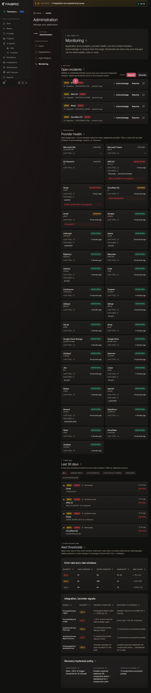

# Monitoring Architecture

End-to-end architecture for application error-rate detection, integration
outage detection, and incident surfacing.

- **Audience**: Developers and on-call operators
- **Owner**: Platform / SRE

## Goals and non-goals

### Goals

1. Detect HTTP-error spikes against a 99.9 % SLO with the Google SRE
   Workbook multi-window multi-burn-rate pattern.
2. Detect third-party provider outages from three independent signals
   (statuspage poll, synthetic probe, in-process circuit breaker).
3. Route every fired alert through a single webhook into Power Automate
   so operators have one notification surface to maintain.
4. Surface live incidents in the product (app-shell incident chip +
   notification inbox + admin dashboard) so customers and admins are
   not the last to know.
5. Auto-discover new components — when an engineer adds a Container App
   or a registry entry, monitoring is enrolled with no follow-on edit.

### Non-goals (v1)

- Per-org SLOs. The error-rate SLO is platform-wide; per-org rollups are
  derived from labels at query time.
- ~~Customer-facing public status page. The product surfaces internal
  incidents to admins; the vendor-status concept stays internal.~~
  **SUPERSEDED (2026-08-06).** A customer-facing surface now exists at
  `/app/system-health`, open to any authenticated user. It is *not* a public
  unauthenticated status page — that remains out of scope — and it does not
  expose the internal incident stream: no SEV values, alert names,
  fingerprints, hostnames or internal component keys reach it, and third-party
  provider problems appear only for providers the tenant has actually
  connected. See `docs/monitoring/customer-status.md`.

  Note this reverses the v1 decision above and the related v3 change that
  removed org-owner visibility of the incident chip. The reasoning for that
  removal still holds for *platform-wide internal* signals, which is why the
  customer surface carries a separate, human-authored `StatusUpdate` record
  rather than projecting `ComponentIncident` summaries directly. **Whether the
  reversal is wanted is a product decision that has not been explicitly
  confirmed by the doc's owner** — it was raised in the shipping PRs and is
  recorded here so nobody reads the original non-goal as current.
- Smart anomaly detection beyond what Application Insights Smart
  Detection ships out of the box. We do not train custom models in v1.
- Notification routing by team or rotation. v1 fans out via one Action
  Group to one Power Automate flow.

## High-level diagram



The admin dashboard above renders the full pipeline end to end: four
SEV-2 incidents are FIRING (two from synthetic probes, two from
statuspage polls), the provider health grid shows a mix of
`OPERATIONAL`, `DEGRADED`, `MAJOR_OUTAGE`, `UNKNOWN`, and
`NOT_CONFIGURED` states, the 30-day timeline lists every event from
both incident streams, and the read-only thresholds tables document
the burn-rate windows and hysteresis policy.

```
+----------------------------------+      +----------------------------+
| Signal sources                   |      | Detection rules            |
|----------------------------------|      |----------------------------|
| Application Insights:            |      | KQL scheduledQueryRules:   |
|  - requests (HTTP 5xx)           |---->|   - HTTP 5xx burn-rate     |
|  - dependencies (LLM, outbound)  |      |   - LLM error/latency/...  |
|  - customEvents (breakers, probes)|      |   - breaker / probe / dep |
|                                  |      |                            |
| Statuspage poller (Temporal)     |---+  | Container App metrics:     |
| Synthetic probe (Temporal)       |   |  |   - replica == 0           |
| Cockatiel breakers (in-proc)     |   |  |   - restartCount > 5       |
+----------------------------------+   |  +-------------+--------------+
                                       |                |
                                       v                v
                            +-----------------------------------+
                            | Action Group: ${prefix}-alerts-ag |
                            |   - email (admin, optional)       |
                            |   - webhook (alertsWebhookUrl)    |
                            +------------------+----------------+
                                               |
                                               v
                            +-----------------------------------+
                            | Power Automate flow               |
                            |   - Teams card                    |
                            |   - Slack message                 |
                            |   - Email                         |
                            +-----------------------------------+

In-app surfaces (independent of the webhook path):
                            +-----------------------------------+
                            | Postgres                          |
                            |   - ErrorRateIncident             |
                            |   - IntegrationIncident           |
                            |   - IncidentEvent (audit log)     |
                            +------------------+----------------+
                                               |
            +----------------------------------+----+---------------------------+
            |                                       |                           |
            v                                       v                           v
   App-shell IncidentChip            NotificationBell inbox        Admin /app/admin/monitoring
   (compact severity chip;           (per-user; admin-only rows     (Open Incidents card list w/
    SEV-1/2; system admins ONLY       land on a toast for non-admins) URL-paginated 20/page,
    as of v3, every route)                                            ack/resolve UI, admin-gated)
```

## Single-funnel principle

All alert rules in `deployment/azure/modules/monitoring.bicep` reference
the same `actionGroup` resource. That Action Group has exactly one
`webhookReceiver` named `AlertsWorkflow`, posting to the
`ALERTS_WEBHOOK_URL` secret. The secret resolves to the Power Automate
flow that fans out to Teams, Slack, and email.

There is no parallel notification path. There is no in-process adapter
emitting Teams messages. There is no separate webhook for breakers, no
separate webhook for synthetic probes, and no internal alertmanager
deployment. Every Azure Monitor metric alert and every
`scheduledQueryRules` resource shares the same webhook by construction.

The funnel is a deliberate choice. With one webhook:

- One operator runbook covers every alert ("read the Common Alert
  Schema payload").
- One Power Automate flow handles fan-out; a routing change is one edit.
- New alert rules inherit the destination without touching downstream
  systems.
- Removing a destination (e.g., decommissioning Slack) is a one-place
  edit in Power Automate, not a deployment.

The verification matrix in [`docs/operations/funnel-verification.md`](../operations/funnel-verification.md)
documents how to prove the funnel is intact after a Bicep change.

## Provider Registry

The integration-provider catalog lives in
`packages/observability/lib/integration-providers.ts`. It is a
**declarative TypeScript registry** with 33 entries — five platform
providers (OpenAI, Anthropic, Stripe, Resend, AWS S3) that get synthetic
probes plus Cockatiel breakers, and 28 data-connection providers
(Notion, GitHub, Slack, Snowflake, Jira, etc.) that get statuspage
polling only.

```
registerIntegrationProvider({
  key: "openai",
  displayName: "OpenAI",
  statusPageUrl: "https://status.openai.com",
  statusPageApiUrl: "https://status.openai.com/api/v2/summary.json",
  statusPagePolling: true,
  syntheticProbe: {
    interval: "5m",
    url: "https://api.openai.com/v1/models",
    method: "GET",
    expectedStatus: [200],
    authHeaderEnvVar: "OPENAI_API_KEY",
    timeoutMs: 15_000,
  },
  breakerKey: "openai_completions",
  affectedFeatures: ["ai_generation"],
});
```

At boot, the registry mirrors itself into the `IntegrationProviderRegistry`
Postgres table. The admin UI reads that table for the health grid, so
the registry is the single source of truth — code-defined, not
database-edited.

Adding a new provider is one registry entry plus a `pnpm
@repo/database generate` run; no workflow, alert rule, or UI code
change is required. See [`status-pages.md`](./status-pages.md) for the
exact registration shape and parser options.

## Detection signal hierarchy

Multiple independent signals cover the integration-outage problem. Each
has different latency, fidelity, and failure modes.

| Signal | Strengths | Weaknesses | Time to fire |
|---|---|---|---|
| **Statuspage poll** | Authoritative — the provider says they are down. Vendor-classified severity. | Delayed by their own incident-declaration latency. Coverage gaps (Microsoft 365, some private status portals). | 2 min poll cadence + provider declaration delay. |
| **Circuit breaker (`CircuitBreakerOpened` event)** | First-party evidence — our own calls failed. Fires on the actual call path. | Only fires when the provider is exercised. Cannot detect outage of an idle integration. | Immediate on the 5th consecutive failure. |
| **Synthetic probe** | Cheap, runs without user traffic, detects "down from our datacenter" even when no real call has been made. | Probe-call vs real-call drift (auth/route differences). One endpoint per provider. | 5 min cadence × 3 consecutive failures = ~15 min. |
| **Burn-rate / dependency-failure KQL** | Detects user-visible impact in aggregate (5 failures in 15 min). Works for `aws-sdk` calls App Insights does not auto-instrument as breakers. | Slower than the breaker. Requires sufficient call volume. | 5–15 min depending on rule. |

The hierarchy matters when multiple signals fire for the same provider:
the first one to land creates the `IntegrationIncident`; the others log
as `IncidentEvent` rows on the same incident. De-duplication keys on
`alertmanagerFingerprint` or `statusPageIncidentId`.

A fourth value — `NOT_CONFIGURED` — sits outside the trigger ladder. It
is set by the synthetic-probe workflow when the probe cannot run
because the required credential env var (e.g., `OPENAI_API_KEY`) is
absent in the current environment. The provider may itself be healthy;
we just cannot exercise it from here. `NOT_CONFIGURED` is rendered as a
neutral gray badge in the provider grid, never opens an incident, and
never fires an alert — it is a deploy-time signal, not a runtime one.
See [`incidents.md#not_configured-status`](./incidents.md#not_configured-status)
for the full lifecycle.

## In-app chip placement and visibility

The `IncidentChip` is mounted exactly once inside `AppWrapper`, as a
fixed-position element docked to the top-right of the viewport,
immediately to the left of the AI credits chip.

The chip carries only the load-bearing signal — a severity-colored
triangle icon, a numeric count of active SEV-1 + SEV-2 incidents, and
a hover tooltip with the breakdown. Click navigates to
`/app/admin/monitoring`.

Visibility is **role-based**, not pathname-based:

- **System admins** (`user.role === "admin"`) — chip is shown globally,
  on every route.
- **Everyone else** — chip is hidden. The monitoring dashboard is
  admin-gated, and the chip communicates platform-wide / cross-tenant
  signals that org owners cannot act on from the customer dashboard.

> **v3 change** *(2026-05-18)*: previously the chip was also shown to
> active-org owners (`Member.role === "owner"`). That rule was removed
> because the chip communicates platform-wide / cross-tenant signals
> (Fabric subsystem outages, error-budget burn across all customers,
> third-party provider incidents that admins triage). Org owners do
> not have the context or permissions to act on these. They still see
> actionable per-org signals via the per-org integration banner inside
> `/app/{slug}/settings/integrations` and via `INTEGRATION_INCIDENT`
> Notifications — those describe the customer's OWN integrations.

The role-based gate is deliberate: pinning the chip to admin routes
only hid the surface precisely when an admin was on a product surface
(e.g., `/app/workflows`) and needed to context-switch back to the
monitoring dashboard. See [ADR-005](../adr/005-monitoring-architecture.md)
for the full evolution from the earlier full-width banner shape to the
current chip.

Color reflects the highest active severity: any SEV-1 active → red
(`text-destructive`); SEV-2 only → amber (`text-highlight`); SEV-3 only
or no incidents → chip is hidden entirely.

Notification routing follows the same gate. `INTEGRATION_INCIDENT` and
`SYSTEM_INCIDENT` rows link to `/app/admin/monitoring`. An admin clicks
the row and navigates; a non-admin clicks the row, sees a toast
("Monitoring dashboard requires admin access. The incident is logged
here for visibility only."), the row is marked read, and there is no
navigation. The dual-track surfaces "inbox sees, dashboard acts" — org
owners stay informed, admins act.

## Auto-discovery

Three places in the code auto-discover new entities, so monitoring
coverage scales without follow-on edits:

1. **Container App alerts** — `monitoring.bicep` consumes the
   `monitoredContainerApps` array. That array is built from
   `tsAgentConfigs` plus the two standalone apps (temporal-worker,
   mcp-stdio-wrapper). When a new agent is appended to `tsAgentConfigs`,
   replica + restart alerts are emitted for it on the next Azure
   deployment with zero monitoring edits.
2. **PromQL / KQL `by (label)` aggregation** — KQL alerts use
   `summarize ... by provider = tostring(customDimensions["provider"])`
   patterns. A new label value (a new feature, a new provider key)
   automatically falls into the same rule; you do not duplicate the rule
   per label.
3. **Provider registry sync** — at boot, every entry in
   `integration-providers.ts` is upserted into the
   `IntegrationProviderRegistry` table. The Temporal status-page poller
   reads that table once per tick, so a new registry entry is
   auto-monitored on the next poll (2 minutes after the deploy).

## Files touched

The monitoring stack spans the following packages and directories. Only
the load-bearing paths are listed; per-test files and per-procedure
files follow the conventional layout in their parent directory.

| Path | Purpose |
|---|---|
| `packages/observability/lib/integration-providers.ts` | Declarative 33-provider registry. |
| `packages/observability/lib/integration-registry.ts` | Registry helpers (lookup, filter, type guards). |
| `packages/observability/lib/breakers.ts` | Cockatiel breaker policies, one per provider. Emits `CircuitBreakerStateChange` to `customEvents`. |
| `packages/observability/lib/app-insights.ts` | `trackEvent` / `trackMetric` wrappers. Single emission path. |
| `packages/observability/lib/feature-flags.ts` | Four kill-switch flags, default ON. |
| `packages/temporal/src/workflows/monitoring/status-page-poller.ts` | 2-min cron, polls every registered statuspage. |
| `packages/temporal/src/workflows/monitoring/synthetic-probe.ts` | 5-min cron, one workflow per probed provider. |
| `packages/temporal/src/workflows/monitoring/incident-lifecycle.ts` | One workflow per open incident; signal-driven (ack / resolve). |
| `packages/temporal/src/workflows/monitoring/prune-old-incidents.ts` | Nightly cleanup. |
| `packages/temporal/src/workflows/monitoring/error-rate-weekly-digest.ts` | Mon 09:00 UTC SEV-3 digest. |
| `packages/temporal/src/activities/monitoring/` | `pollStatusPage`, `runSyntheticProbe`, `upsertIntegrationIncident`, `closeIntegrationIncident`, `markProviderNotConfigured`, `notifyIncident`, `dispatchWeeklyDigestActivity`. |
| `packages/api/modules/incidents/` | `ErrorRateIncident` CRUD (admin-only). |
| `packages/api/modules/integration-health/` | `IntegrationIncident` CRUD + provider-health rollups. |
| `apps/web/modules/saas/admin/component/monitoring/` | Admin dashboard (Open Incidents card list with URL-paginated 20/page footer, provider-health grid, timeline, thresholds). |
| `apps/web/modules/saas/shared/components/AppWrapper.tsx` | Mounts the IncidentChip as a fixed-position element docked to the right of the viewport, next to the AI credits chip. |
| `apps/web/modules/saas/shared/components/IncidentChip.tsx` | App-shell SEV-1/2 chip. Role-gated to system admins and active-org owners; globally visible (page-agnostic). |
| `apps/web/modules/saas/notifications/components/NotificationListItem.tsx` | Inbox row. Routes admins to `/app/admin/monitoring` for `INTEGRATION_INCIDENT` / `SYSTEM_INCIDENT` rows; non-admins get a toast and the row is marked read with no navigation. |
| `deployment/azure/modules/monitoring.bicep` | Single Action Group + every alert rule. |

## Data flow

### Error-rate signal

```
1. User request fails (HTTP 5xx)            -> server logs the error.
2. App Insights auto-instrument writes a    -> requests table row, success=false.
3. KQL scheduledQueryRule fires when        -> (a) short-window error rate > 14.4 * (1 - 0.999),
   AND (b) long-window error rate > same    -> AND (c) long_total > minimum count.
4. Action Group fires                       -> webhookReceiver POSTs to ALERTS_WEBHOOK_URL.
5. Power Automate                           -> Teams card + Slack message + email.
6. (Parallel) Alertmanager-webhook handler  -> writes ErrorRateIncident, starts incidentLifecycleWorkflow.
7. UI                                       -> IncidentChip turns red for admins + active-org owners (page-agnostic);
                                              AdminMonitoring shows the new row on the Open Incidents card list.
```

### Integration outage signal (statuspage path)

```
1. statusPagePollerWorkflow ticks every 2m  -> reads IntegrationProviderRegistry rows.
2. pollStatusPage activity per provider     -> fetches summary.json (or custom parser).
3. health flips to non-OPERATIONAL          -> upsertIntegrationIncident.
4. incidentLifecycleWorkflow spawned        -> emits FIRED notification (admins + per-org).
5. Action Group fires (if KQL rule matched) -> webhook → Power Automate.
6. UI                                       -> ProviderHealthGrid badge turns amber/red,
                                              IncidentChip surfaces the SEV-1/2 count to admins + active-org owners.
```

### Recovery

```
1. Underlying signal clears.
2. statusPage poller / probe / breaker      -> hysteresis check (see incidents.md).
3. closeIntegrationIncident activity        -> writes status=RESOLVED + IncidentEvent(AUTO_RESOLVED).
4. incidentLifecycleWorkflow signaled       -> emits RECOVERY notification.
5. Provider registry rollup                 -> ProviderHealthGrid flips back to OPERATIONAL.
6. App Insights metric alert auto-resolves  -> Action Group emits "resolved" CAS payload through the webhook,
                                              Power Automate posts a "RESOLVED:" card to the channels.
```

### Recovery via NOT_CONFIGURED transition (non-hysteresis path)

A second close path runs when a provider transitions out of the "we
can probe this" world rather than recovering. It is not driven by a
hysteresis counter — the transition is immediate on the next probe
tick.

```
1. syntheticProbeWorkflow ticks every 5m    -> reads IntegrationProviderRegistry row.
2. runSyntheticProbe activity               -> reports `{ notConfigured: true, error: "X env var unset" }`
                                              because the required credential env var is missing.
3. markProviderNotConfigured activity       -> flips registry row currentHealth = NOT_CONFIGURED.
4. closeIntegrationIncident activity        -> walks the most recent FIRING/ACKNOWLEDGED SYNTHETIC_PROBE
                                              row for the provider, marks it RESOLVED with
                                              health = NOT_CONFIGURED, writes IncidentEvent(AUTO_RESOLVED)
                                              with payload.reason = "NOT_CONFIGURED".
5. UI                                       -> ProviderHealthGrid badge flips to neutral gray
                                              (NOT_CONFIGURED), the incident chip's count drops,
                                              the audit timeline shows the cause.
```

This is the staging-regression close path: it prevents pre-#1019
synthetic-probe incidents (which opened when the probe failed on a
missing env var BEFORE NOT_CONFIGURED was introduced) from staying
FIRING forever after the registry-row transition.

## Feature flags

Four kill-switch flags live in `packages/observability/lib/feature-flags.ts`.
All default to ON. Setting `FABRIC_FEATURE_*=false` is the explicit
disable path; anything else (including unset) is enabled.

| Flag | Env var | Disables |
|---|---|---|
| `feature-burn-rate-alerts` | `FABRIC_FEATURE_BURN_RATE_ALERTS` | `trackEvent` / `trackMetric` emission. With this off, breaker and synthetic-probe KQL alerts go silent without a Bicep redeploy. |
| `feature-incident-banner` | `FABRIC_FEATURE_INCIDENT_BANNER` | App-shell SEV-1/2 incident chip. The env-var name retains the historical `BANNER` suffix for backwards-compatibility with deployed configurations; the surface itself is the current `IncidentChip`. Server-side writes still happen when the flag is off — only the chip UI hides. |
| `feature-integration-health-badges` | `FABRIC_FEATURE_INTEGRATION_HEALTH_BADGES` | Status badges on Settings → Integrations. |
| `feature-admin-monitoring-dashboard` | `FABRIC_FEATURE_ADMIN_MONITORING_DASHBOARD` | `/app/admin/monitoring` route. |

Client-side reads use the matching `NEXT_PUBLIC_*` variants so values
are inlined at build time. Flags are per-env, never per-org.

## Cost estimate

Application Insights is already deployed for the platform. The
monitoring stack adds:

| Item | Recurring monthly cost |
|---|---|
| Bicep alert rules (12 scheduledQueryRules + 2 metric alerts per Container App) | ~$2.30 (Azure Monitor pricing, free-tier-exempt) |
| App Insights ingest (telemetry, custom events) | $0 (within free 5 GB/month) |
| Action Group + webhook | $0 |
| Power Automate flow | $0 (uses existing M365 tenant) |

Total recurring: **~$2.30 / month**. The deleted Prometheus +
Alertmanager prototype cost ~$11 / month; the Bicep / KQL approach
saves on Container-App-hosted infra without losing functionality. See
[ADR-005](../adr/005-monitoring-architecture.md) for the decision
record.

## See also

- [`alerts.md`](./alerts.md) — every alert rule that's deployed.
- [`incidents.md`](./incidents.md) — incident lifecycle and admin
  workflow.
- [`status-pages.md`](./status-pages.md) — provider registry and
  status-page parsers.
- [`../adr/005-monitoring-architecture.md`](../adr/005-monitoring-architecture.md)
  — decision record for the App-Insights-plus-single-funnel approach.
