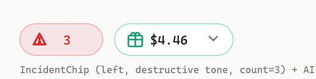
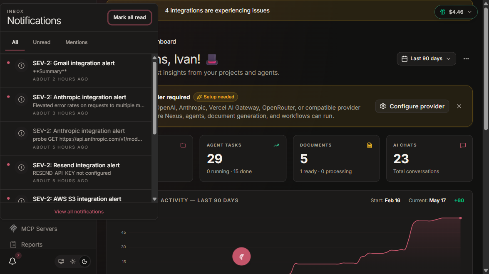
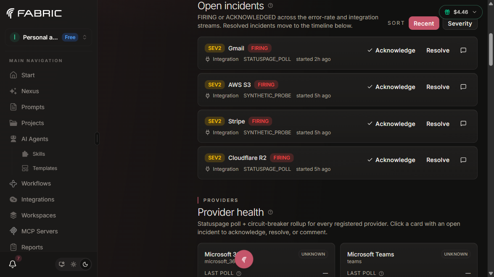
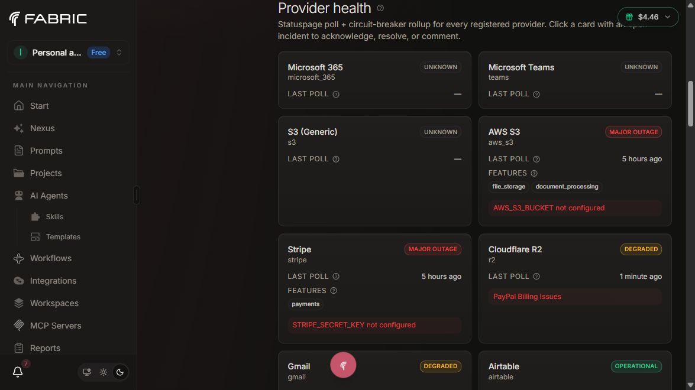
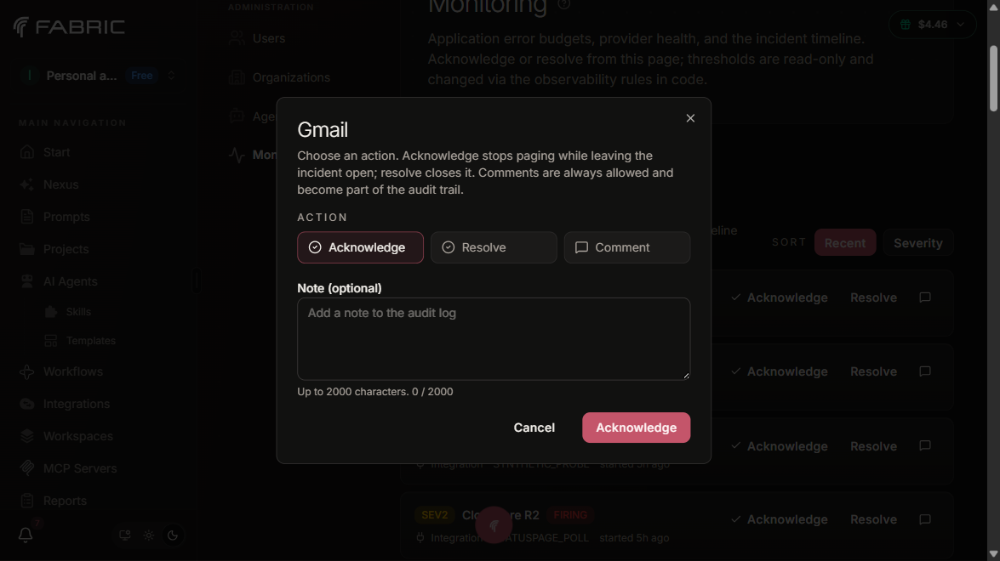
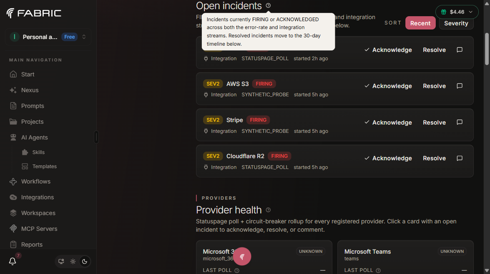

# Monitoring Incidents

Incident model, lifecycle, auto-resolve hysteresis, notification
surfaces, and the admin workflow.

- **Audience**: Admins, on-call operators, and platform developers
- **Owner**: Platform / SRE

## What is an incident?

An incident is a Postgres row in one of three tables, plus an append-only
audit log of its lifecycle events.

| Model | Purpose | Tenant scope |
|---|---|---|
| `ErrorRateIncident` | One row per fired HTTP 5xx burn-rate alert. Records service / feature / errorClass + denormalized burn rates at fire time. | Global. Per-org rollups derived from `appErrorsTotal` labels at query time. |
| `IntegrationIncident` | One row per detected provider outage. Records providerKey / detection method / health / affectedComponents. | Global. Per-org Notifications are emitted as a side effect; the canonical record is global. |
| `ComponentIncident` *(v3)* | One row per detected internal Fabric subsystem outage. Records componentKey (e.g. `temporal-worker`, `rag-indexer`, `agent-rail`) + componentName + summary. Captures gaps neither of the other two types covers: a Temporal worker stalled for hours without bumping 5xx rates, a RAG indexer queue backed up while all providers are operational, etc. | Global. Per-org Notifications are NOT emitted (admin-only, see §"Notification visibility"). |
| `IncidentEvent` | Append-only audit log. Every state transition (FIRED / RE_FIRED / ACKNOWLEDGED / COMMENT / AUTO_RESOLVED / MANUAL_RESOLVED) writes one row, linked to exactly one of the three incident tables (XOR enforced at application layer). | Same as parent. |

All three incident tables are global because the underlying signals are
global: the platform's error rate, a provider's status, and Fabric's
own subsystem health are not per-org concerns. The XOR foreign key on
`IncidentEvent` means the audit log is unified — listing all events for
"incident X" is one query, no UNION needed at read time.

`listActiveSevHighIncidents` returns `{ errorRate, integration, component }`;
the admin dashboard's `ActiveIncidentsTable` and the top-right
`IncidentChip` both normalize the three streams into a single
severity-sorted list.

De-duplication keys:

- `ErrorRateIncident.alertmanagerFingerprint` — unique constraint.
  Repeated fires of the same alert update the existing row instead of
  creating duplicates.
- `IntegrationIncident.statusPageIncidentId` — unique constraint. The
  same vendor incident ID across multiple polls is one row.
- `ComponentIncident.alertmanagerFingerprint` — unique constraint.
  Same as ErrorRateIncident: repeated fires update in place.

## Lifecycle

```
   +------------------+
   | NOT_CONFIGURED   |  Probe disabled — required env var missing.
   +------------------+  No new incident opened. Gray badge on the grid.
                                 (provider sits outside the lifecycle below)


                +-----------+
                |  DETECTED |  Detection rule matched. Row not yet written.
                +-----+-----+
                      |
                      v
                +-----------+
                |   FIRING  |  Row inserted, IncidentEvent(FIRED) written.
                +-----+-----+  IncidentChip lights up. Notifications sent.
                      |
        +-------------+--------------+----------------------+
        |                            |                      |
        v                            v                      v
+----------------+         +-------------------+   +-------------------+
| ACKNOWLEDGED   |         |     RESOLVED      |   |  RESOLVED         |
| Admin clicked  |         | Auto from poller, |   |  (NOT_CONFIGURED) |
| "Acknowledge". |         | breaker, or probe |   |  Probe transitioned
| IncidentEvent  |         | hysteresis. Or    |   |  to NOT_CONFIGURED.
| (ACKNOWLEDGED) |         | manual resolve.   |   |  Terminal health
+--------+-------+         +-------------------+   |  on the row stays
         |                          ^              |  NOT_CONFIGURED.
         |                          |              +-------------------+
         +--------------------------+
        Admin clicks "Resolve" or
        underlying signal clears.
```

`NOT_CONFIGURED` is primarily a sibling state, not a lifecycle stage:
a provider that is `NOT_CONFIGURED` from boot never enters the FIRING
graph. The exception is the "transitioned to `NOT_CONFIGURED` while an
incident is open" path — a row already in `FIRING` / `ACKNOWLEDGED`
auto-closes to `RESOLVED` on the next probe tick after the registry
row flips. The terminal `IntegrationIncident.health` on that row stays
`NOT_CONFIGURED` rather than `OPERATIONAL` so the audit log preserves
the cause. See [NOT_CONFIGURED status](#not_configured-status) below
for the detection path and UI treatment.

Transitions are recorded as `IncidentEvent` rows; the parent incident's
`status` column is a denormalization of the latest event. The
`incidentLifecycleWorkflow` runs one Temporal workflow per active
incident, listening for `acknowledged` and `resolved` signals.

Workflow ID is deterministic: `incident-${incidentId}`. Best-effort
signalling — if Temporal is unreachable, the DB row still reflects the
state change and the workflow reconciles on the next tick.

A `MAX_WAIT` of 7 days bounds the workflow lifetime. After 7 days, the
workflow force-resolves to prevent unbounded growth.

## Auto-resolve with hysteresis

When the underlying signal heals, every incident closes itself — no
admin click is required. Hysteresis prevents flapping: the signal must
stay healed for a sustained period before the incident closes, so a
two-second blip of OPERATIONAL across a noisy poll does not collapse a
real outage.

Each detection signal owns its own auto-close path. The corresponding
`IncidentEvent(AUTO_RESOLVED)` row is written by the poller / probe /
workflow that owns the signal, the parent incident's status flips to
`RESOLVED`, the `incidentLifecycleWorkflow` is signalled on the
`resolvedSignal`, and the lifecycle workflow emits the recovery
notification through the same Power Automate flow. The chip clears on
its next 60-second refetch.

| Source | Auto-close trigger | Notes |
|---|---|---|
| **Error-rate** (`ErrorRateIncident`) | The error rate drops and stays below half of the trigger threshold for 10 minutes. | `closeErrorRateIncident` in `@repo/database` owns the cool-down; the workflow does not duplicate the check. |
| **Statuspage poller** (`IntegrationIncident`, `STATUSPAGE_POLL`) | Two consecutive operational polls — ~4 minutes with the 2-minute cadence. | `statusPagePollerWorkflow` maintains a per-provider `operationalPolls` counter in the workflow input, reset to 0 on any non-operational poll. `OPERATIONAL_HYSTERESIS = 2`. |
| **Synthetic probe** (`IntegrationIncident`, `SYNTHETIC_PROBE`) | Three consecutive successful probes — ~15 minutes with the 5-minute cadence. | `syntheticProbeWorkflow` keeps `consecutiveSuccesses`; only calls `closeIntegrationIncident({ reason: "PROBE_SUCCESS" })` once it reaches 3. `SUCCESS_THRESHOLD = 3`. |
| **Synthetic probe → NOT_CONFIGURED** (`IntegrationIncident`, `SYNTHETIC_PROBE`) | Immediate on the next probe tick after the provider transitions to NOT_CONFIGURED. | When a required env var becomes unset (e.g., a redeploy strips `STRIPE_SECRET_KEY`), the probe reports `notConfigured: true` and the workflow calls `closeIntegrationIncident({ reason: "NOT_CONFIGURED" })`. The terminal `health` on the row stays `NOT_CONFIGURED`, not `OPERATIONAL` — the audit log preserves "we can't probe this provider" rather than implying it bounced back up. The `IncidentEvent(AUTO_RESOLVED)` row carries `payload.reason = "NOT_CONFIGURED"` so the timeline UI can distinguish this auto-close from a "probe recovered" auto-close. |
| **Circuit breaker** (`IntegrationIncident`, `BREAKER_OPEN`) | Cockatiel's state machine: open → half-open (30 s) → closed (after one successful trial). | The breaker emits `CircuitBreakerStateChange { newState: "closed" }`; the workflow uses it to resolve immediately, no extra hysteresis. |
| **Webhook** (`incident.resolved`) | Immediate on receipt. | The Alertmanager / Statuspage webhook handler signals the lifecycle workflow's `resolvedSignal` and calls `closeIntegrationIncident({ reason: "WEBHOOK_RESOLVED" })`. |
| **7-day timeout** (defense-in-depth) | The lifecycle workflow force-resolves after `MAX_WAIT = 7d` regardless of signal state. | Bounds workflow history. The DB-side close still runs from the owning poller/probe path; the workflow only emits the recovery notification. |

When operators want to close an incident faster than the hysteresis,
the **manual resolve** path (admin clicks "Resolve" in the dashboard)
short-circuits the wait — see [Manual acknowledge and resolve](#manual-acknowledge-and-resolve)
below.

### When auto-close does not fire

Auto-close only triggers when the signal source confirms recovery
OR transitions the provider out of the "we can probe this" world. It
does **not** fire when:

- The provider's status page is unreachable (the poller cannot
  distinguish "operational" from "we can't see anything"). The
  incident stays open until the poller can read again.
- The lifecycle workflow itself is force-resolved by the 7-day timeout.
  In that case, the DB row keeps whatever status the poller / probe
  last wrote; the workflow only emits the recovery notification.

When a synthetic probe transitions from "probing" to `NOT_CONFIGURED`
(e.g., a redeploy strips the credential env var), any open
SYNTHETIC_PROBE incident for that provider auto-closes on the next
probe tick — see the "Synthetic probe → NOT_CONFIGURED" row of the
[Auto-resolve with hysteresis](#auto-resolve-with-hysteresis) table.
This intentionally collapses the prior "transient state where pre-#1019
synthetic-probe incidents stay FIRING after a config change" gap. The
audit-trail `IncidentEvent(AUTO_RESOLVED)` row's payload makes the
cause explicit (`reason = "NOT_CONFIGURED"`) so operators reading the
timeline can distinguish this from a probe-recovered close.

## Notification surfaces

### Power Automate fan-out (out-of-band)

The Azure Action Group fires the CAS payload through the single webhook
to Power Automate. Power Automate fans out to:

- **Teams** — admin operations channel. SEV-1 sends a card with
  `@channel` mention; SEV-2 sends a plain card; SEV-3 is omitted (covered
  by the weekly digest).
- **Slack** — same channel mapping as Teams (for orgs that prefer
  Slack).
- **Email** — to `alertEmail` if configured on the Action Group.

This path is independent of the in-app surfaces and exists so on-call
gets paged even when the product is down.

### In-app NotificationBell inbox

The lifecycle workflow's `notifyIncident` activity writes one
`Notification` row per recipient. Recipients are the admin set plus,
for `IntegrationIncident` rollups, the per-org owners whose org uses
the affected provider.

The bell icon in the app navbar (`NotificationBell` component)
surfaces these notifications. Each row links into the admin monitoring
dashboard's incident detail. SEV-3 incidents do not write per-user
notifications; they live only in the weekly digest.

### App-shell incident chip

`IncidentChip` polls the `integrationHealth.listActiveIncidents` oRPC
procedure every 60 seconds. The procedure returns FIRING-or-ACKNOWLEDGED
SEV-1 / SEV-2 rows across both incident streams.

The chip is a small fixed-position rounded button docked to the top-
right of the viewport, immediately to the left of the AI credits chip.
A red or amber triangle plus a numeric count communicates the state at
a glance; the rest of the detail lives in a hover/focus tooltip. See
[ADR-005](../adr/005-monitoring-architecture.md) for the design rationale
that led to this shape.

```
┌──────────┐   ┌──────────┐
│ ⚠  3     │   │ $4.46    │
└──────────┘   └──────────┘
   ^chip          ^credits
```

**Visibility is role-based**, not pathname-based:

- **System admins** (`user.role === "admin"`) — chip is shown globally,
  on every route.
- **Everyone else** — chip is hidden, and the polling query never
  fires (`enabled: featureEnabled && canView`), so regular members,
  org owners, and personal-only users never pay the round-trip cost.

> **v3 change** *(2026-05-18)*: previously the chip was also shown to
> active-org owners (`Member.role === "owner"`). That rule was removed
> because the chip communicates platform-wide / cross-tenant signals
> (Fabric subsystem outages, error-budget burn across all customers,
> third-party provider incidents that admins triage). Org owners do
> not have the context or permissions to act on these from the
> customer dashboard. Org owners still see actionable per-org signals
> via the per-org integration banner inside
> `/app/{slug}/settings/integrations` and via `INTEGRATION_INCIDENT`
> Notifications — those describe the customer's OWN integrations.
> The legacy second argument to `canViewIncidentChip(userRole,
> activeOrgRole)` is retained for caller-compatibility but no longer
> consulted.

**Color reflects the highest active severity:**

- Any **SEV-1** active → `text-destructive` + `bg-destructive/10` (red).
- **SEV-2 only** → `text-highlight` + `bg-highlight/10` (amber).
- **SEV-3 only** or no incidents → chip is hidden. SEV-3 is a chronic-
  signal severity surfaced via the weekly digest and the admin
  dashboard timeline; rendering it in the always-visible chip would be
  ambient noise.

**Click → navigate** to `/app/admin/monitoring`. The chip itself is the
permission gate: it never renders for users who can't reach the
dashboard, so the click target is always reachable when visible.

**Hover / focus → tooltip** lists up to three active incidents with
severity + title, plus a `+ N more` tail when the active set is longer.
A SEV-3 count is appended when present so admins can confirm at a
glance how much the dashboard timeline has accumulated.

Accessibility:

- The chip is a `<button>` with an `aria-label` summarising the
  severity breakdown ("1 SEV-1 incident, 2 SEV-2 incidents. Click to
  view the monitoring dashboard."). Screen readers announce the state
  without needing to read the icon glyph.
- The tooltip is a Radix `<Tooltip>` so it surfaces on keyboard focus.
- Entrance fade is `motion-safe:` only — `prefers-reduced-motion` users
  see the chip instantly.



> The asset above is a rendered placeholder (see
> `docs/operations/monitoring-verification-checklist.md` for the
> capture procedure). When a real SEV-1 fires in staging, refresh the
> screenshot against the live shell so the doc reflects the actual
> typography + spacing alongside the credits chip.



The notification inbox renders incident rows for admins and active-org
owners (per the same fan-out rule). Admin viewers click the row and
navigate to `/app/admin/monitoring`. Non-admin owners click the row,
see an info toast ("Monitoring dashboard requires admin access. The
incident is logged here for visibility only."), and the row is marked
read with no navigation. The split surfaces the "inbox sees, dashboard
acts" intent — owners stay informed, admins acknowledge from the
dashboard.

## Admin UI workflow

Path: `/app/admin/monitoring`. Both the admin shell and the procedure
middleware enforce `adminProcedure` — a non-admin who navigates to the
URL is redirected to `/app`, and the notification inbox short-circuits
the link so it never lands them there silently (see the surfaces
section above).

```
+--------------------------------------------------+
| Monitoring                                       |
+--------------------------------------------------+
| Open Incidents                                   |
|   List of cards (one per FIRING/ACKNOWLEDGED).   |
|   Each card: severity pill + kind icon +         |
|     service/provider + summary + started-ago +   |
|     status badge + inline [Ack][Resolve][Comment]|
|   Sort: Recent / Severity.                       |
|   Paginated: 20 per page; footer shows           |
|     "Showing 21-40 of 47 · Page 2 of 3" with     |
|     prev/next chevrons. URL keeps the page in    |
|     `?incidents_page=N` so the link is shareable.|
+--------------------------------------------------+
| Provider Health                                  |
|   33-card grid                                   |
|   OPERATIONAL / DEGRADED / OUTAGE / UNKNOWN /    |
|   NOT_CONFIGURED                                 |
+--------------------------------------------------+
| Last 30 days timeline                            |
|   Filter: all / error-rate / statuspage /        |
|           synthetic / breaker / alertmanager     |
|   Each row carries a severity dot for at-a-glance|
|   triage.                                        |
+--------------------------------------------------+
| Alert thresholds (read-only)                     |
|   Burn-rate ladder, hysteresis windows.          |
|   Renders on a single column — no horizontal     |
|   scroll on the threshold tables.                |
+--------------------------------------------------+
```



### Open Incidents pagination

The Open Incidents list paginates at **20 cards per page**. The page
state is URL-backed via `?incidents_page=N` (`nuqs` integer state) so
admins can share the deep link to a specific page when coordinating on
a Teams call.

- 0 or 1–20 incidents → no pagination footer is rendered.
- >20 incidents → a footer below the list shows
  "Showing M–N of T incidents · Page p of P" plus prev/next chevrons.
- When the URL drifts out of range (e.g., `?incidents_page=999` after
  several auto-resolves cleared the long tail), the component clamps
  the page into `[1, totalPages]` and snaps the URL back to the
  clamped value on the next render.
- Sort (Recent / Severity) and pagination compose: the page slice is
  taken after the sort, so paging through the list always reads in the
  selected order.





### Click-through path

1. Notification bell shows a red dot for new incidents.
2. Click the bell → notification list, each `INTEGRATION_INCIDENT` /
   `SYSTEM_INCIDENT` row links to `/app/admin/monitoring`. Admins
   navigate; non-admin recipients (active-org owners) see a toast and
   the row is marked read with no navigation.
3. The Open Incidents card list at the top renders FIRING +
   ACKNOWLEDGED rows. Each card is self-contained; the list is
   sortable by Recent or Severity.
4. Click "Acknowledge" → `IncidentAckResolveDialog` opens, optional
   note, confirms.
5. The dialog calls `incidents.errorRate.acknowledge` or
   `integrationHealth.acknowledgeIntegrationIncident`. The procedure
   writes the `IncidentEvent(ACKNOWLEDGED)` row, updates status, and
   signals the lifecycle workflow.
6. "Resolve" works the same way for manual close-out.
7. "Comment" writes an `IncidentEvent(COMMENT)` row with a free-text
   note. No status change.



Every opaque term on the dashboard carries a `(?)` HelpTooltip pulling
its prose from `apps/web/modules/saas/admin/component/monitoring/glossary.ts`,
so admins land on the page without prior context and can decode every
column inline.

### Permissions

| Surface | Procedure middleware | Visible to |
|---|---|---|
| `/app/admin/monitoring` | route guard + `adminProcedure` | Fabric system admins only. |
| `IncidentChip` (SEV-1/2 only) | client-side role gate | System admins and active-org owners, globally (every route). Regular members + personal-only users never see it; the `listActiveIncidents` query is gated by `enabled` and never fires for them. |
| Notification inbox rows (`INTEGRATION_INCIDENT` / `SYSTEM_INCIDENT`) | `protectedProcedure` | The recipient (admins + active-org owners). Admins follow the row link to `/app/admin/monitoring`; non-admins get an info toast and the row is marked read with no navigation. |
| `incidents.errorRate.*` mutations | `adminProcedure` | Fabric admins. |
| `integrationHealth.*` ack/resolve | `adminProcedure` | Fabric admins. |
| `integrationHealth.listActiveIncidents` (read) | `protectedProcedure` | Every authenticated user, but the chip client only calls it when the role gate is satisfied. |

Regular members and personal-only users never see the chip or the
admin dashboard. They still receive an inbox row when an incident
affects an integration their org uses (the per-org fan-out is scoped
to admins + active-org owners — see
`packages/database/prisma/queries/incident-notifications.ts`); clicking
the row surfaces an info toast explaining the dashboard is admin-only.

## NOT_CONFIGURED status

`HealthStatusValue` has a `NOT_CONFIGURED` member distinct from
`UNKNOWN`. It is set when a synthetic probe cannot run because the
required credential env var (e.g., `OPENAI_API_KEY`) is missing in this
environment. The provider itself may be fine; we just cannot exercise
it from here.

Why `NOT_CONFIGURED` is not collapsed into `UNKNOWN`:

| State | Cause | Operator action |
|---|---|---|
| `UNKNOWN` | The provider's own feed is unreachable, malformed, or returned a value we cannot map. | Investigate at the provider — runbook surfaces last response in App Insights. |
| `NOT_CONFIGURED` | The probe is disabled because the credential env var is missing locally. | Fix the deploy-time config (`.env`, Key Vault) — nothing to do at the provider. |

Distinguishing the two prevents a missing API key from looking like a
flaky vendor feed.

- **UI**: rendered as a neutral badge with no corner pip on the card.
  The provider-health badge code path falls through a
  `Partial<Record<HealthStatusValue, ...>>` lookup, so adding a new
  status value never silently flips a pip onto a row that should stay
  quiet. On the provider detail page the badge size is bumped up to
  match the rest of the metadata strip.
- **Detection**: `markProviderNotConfigured` activity is called by the
  synthetic-probe workflow when the per-provider credential lookup
  returns null. It writes `currentHealth = NOT_CONFIGURED` to the
  `IntegrationProviderRegistry` row and short-circuits the rest of the
  probe.
- **No new alert fires**: `NOT_CONFIGURED` is a sibling state outside
  the FIRING → ACKNOWLEDGED → RESOLVED lifecycle. No new
  `IntegrationIncident` row is created, no notification is fanned out,
  and no Action Group alert is emitted.
- **Stale-incident close**: if an `IntegrationIncident` was opened by
  the synthetic probe BEFORE the provider transitioned to
  `NOT_CONFIGURED` (e.g., a redeploy strips a credential env var), the
  next probe tick auto-closes the row by calling
  `closeIntegrationIncident({ reason: "NOT_CONFIGURED" })`. The
  `IntegrationIncident.health` column is set to `NOT_CONFIGURED` on
  close (not `OPERATIONAL`) so the audit trail truthfully preserves
  the cause. The `IncidentEvent(AUTO_RESOLVED)` row carries
  `payload.reason = "NOT_CONFIGURED"`. This collapses the transient
  state where pre-#1019 incidents stayed FIRING forever after a
  config change.
- **Backfill script** (`scripts/resolve-orphaned-not-configured-incidents.ts`)
  is available to bulk-resolve orphaned rows whose provider is
  already `NOT_CONFIGURED` but whose row pre-dates the auto-close
  path. The runtime auto-close covers new transitions on its own; the
  script exists for environments where the probe schedule is paused
  or operators want to backfill immediately rather than wait for the
  next 5-minute tick.

## Manual acknowledge and resolve

Manual transitions are admin-only and idempotent.

- **Acknowledge**: indicates an admin has seen the incident and is
  working on it. The notification feed mutes for the row (no
  re-notification on RE_FIRED). The lifecycle workflow continues to
  watch for the underlying signal to clear.
- **Resolve**: forces `status = RESOLVED` regardless of the underlying
  signal. Writes `IncidentEvent(MANUAL_RESOLVED)`. The workflow
  short-circuits to the recovery notification.
- **Comment**: writes `IncidentEvent(COMMENT)` with a free-text message,
  no status change. Useful for cross-team handoff notes.

Manual resolve is allowed even when the auto-resolve hysteresis has not
been met. The admin assumes responsibility for the close-out — usually
because the signal is known to be a false positive (e.g., a vendor
posts a maintenance window late).

Idempotency: a second acknowledge / resolve call on the same incident
is a no-op. The DB write is the source of truth; the workflow signal
is best-effort.

## Weekly digest

SEV-3 error-rate incidents do not fire a live alert. They accumulate
into the weekly digest, dispatched every Monday at 09:00 UTC by
`errorRateWeeklyDigestWorkflow`. The digest writes one Notification per
admin summarising the prior week's SEV-3 incidents.

The digest is informational only; it does not page or block. Admins use
it to spot chronic regressions that never breach the SEV-2 alerting
threshold.

## How to extend

### Adding a new incident kind

If a third kind of incident is needed (e.g., `DataQualityIncident`):

1. Add the Prisma model. Mirror the `ErrorRateIncident` / `IntegrationIncident`
   shape: status, severity, denormalized signal context, lifecycle
   timestamps, fingerprint.
2. Add a third nullable FK to `IncidentEvent` and extend the XOR
   invariant.
3. Add `acknowledge<Kind>Incident` / `resolve<Kind>Incident` queries
   to `@repo/database`.
4. Add the matching oRPC module under `packages/api/modules/`.
5. Surface in the admin dashboard's Open Incidents card list by
   extending the list's `kind` discriminator.

### Custom recovery hysteresis

Each signal's hysteresis lives in the workflow (status-page poller's
`OPERATIONAL_HYSTERESIS = 2`, synthetic probe's `SUCCESS_THRESHOLD = 3`).
Changing the constant is a workflow edit + replay test against fresh
histories. The non-determinism replay validator on CI catches regressions
on PRs to `main`.

For error-rate incidents, the cool-down lives in the
`closeErrorRateIncident` path in `@repo/database`. Changing the
cool-down is a query edit, not a workflow edit.

## See also

- [`architecture.md`](./architecture.md) — system context and data flow.
- [`alerts.md`](./alerts.md) — rules that drive incidents.
- [`status-pages.md`](./status-pages.md) — provider registry and
  per-provider parsers.
- [`../adr/005-monitoring-architecture.md`](../adr/005-monitoring-architecture.md) — backend decision record.
