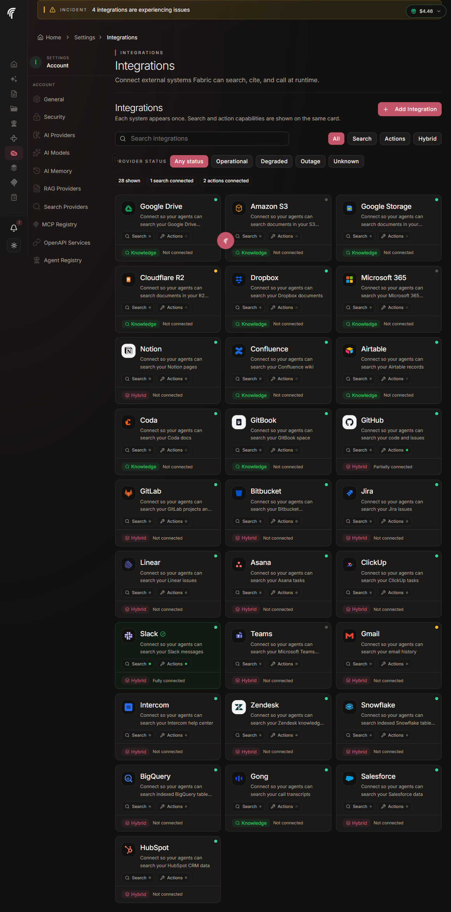
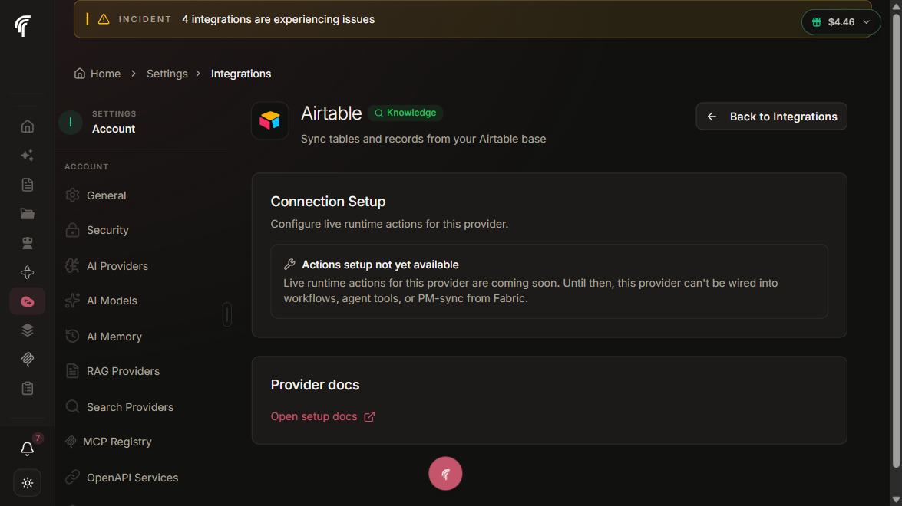

# Provider Status Pages

Status-page polling, the default Atlassian parser, six custom parsers,
component filtering, the full provider list, and rate-limit policy.

- **Audience**: Developers adding or maintaining provider integrations
- **Owner**: Platform / SRE

## Overview

The `statusPagePollerWorkflow` runs every 2 minutes, reads every entry
in `IntegrationProviderRegistry` where `statusPagePolling = true`, and
fans out one `pollStatusPage` activity per provider. Each activity
fetches the provider's data endpoint, normalizes the response into a
single `{ health, severity, openIncident, shouldCloseExisting }` shape,
and returns it for the workflow to act on.

The provider registry is declarative TypeScript in
`packages/observability/lib/integration-providers.ts`. Adding a new
provider is one `registerIntegrationProvider({...})` call plus a `pnpm
@repo/database generate` run; no workflow, alert rule, or activity
edit is required.



The Settings → Integrations listing above renders one card per
registry entry, with a corner-pip badge driven by the
`IntegrationProviderRegistry.currentHealth` column. The PROVIDER
STATUS filter pills at the top narrow the grid; the underlying data is
the same registry the poller reads.



Clicking a card opens the provider detail page, which surfaces the
last poll timestamp, connection details, and any active incident.

## Atlassian Statuspage default parser

The default code path expects an Atlassian Statuspage `summary.json`
endpoint (documented at <https://developer.statuspage.io/#operation/getPagesPageIdSummary>).
The parser reads:

| Field | Mapped to |
|---|---|
| `status.indicator` | `health` via `indicatorToHealth()` mapping below. |
| `status.description` | Raw indicator string for forensic logging. |
| `incidents[]` | When non-empty AND not `resolved`/`postmortem`, the most recent open incident becomes `openIncident`. |
| `incidents[].components[].name` | `affectedComponents` for the incident row. |

`status.indicator` → `ProviderHealthStatus`:

| Indicator | Health | Severity |
|---|---|---|
| `none` | `OPERATIONAL` | n/a — no incident opened |
| `minor` | `DEGRADED` | SEV-2 |
| `major` | `PARTIAL_OUTAGE` | SEV-2 |
| `critical` | `MAJOR_OUTAGE` | **SEV-1** |
| `maintenance` | `MAINTENANCE` | SEV-2 |
| (anything else) | `UNKNOWN` | n/a |

A provider in `OPERATIONAL` health while a DB incident is still open
returns `shouldCloseExisting: true`. The workflow then applies the
"2 consecutive operational polls" hysteresis before calling
`closeIntegrationIncident`. See
[`incidents.md#auto-resolve-with-hysteresis`](./incidents.md#auto-resolve-with-hysteresis).

## Custom parsers

Six providers expose their status data in shapes that are NOT the
Atlassian Statuspage `summary.json` format. Each has a dedicated parser
selected via the `customParser` field on the registry entry. Dispatch
happens BEFORE the default decode, so the response shape is never
guessed.

| Parser | Providers | Endpoint shape | Why it's needed |
|---|---|---|---|
| `google-workspace` | `google_drive`, `gmail` | `https://www.google.com/appsstatus/dashboard/incidents.json` returns a flat JSON array of incidents with a `service_name` field. The `external_desc` and `most_recent_update.text` fields are **markdown documents** — the parser strips section headings (`**Summary**`, `**Title:**`, `# Incident Report`, `## Summary`, etc.) and surfaces the first content line as the incident description. | Google Workspace is one feed across all Google products. We narrow to a single product via the `googleWorkspaceServiceName` registry field. Markdown-heading stripping prevents the staging regression where the admin UI surfaced literal `**Summary**` as the incident description. |
| `google-cloud` | `google_storage`, `bigquery` | `https://status.cloud.google.com/incidents.json` returns a flat JSON array with `affected_products[].title`. Same markdown-heading conventions as Workspace. | Same shape as Workspace but a different field path. Narrowed via `googleCloudProductTitle`. |
| `slack` | `slack` | `https://status.slack.com/api/v2.0.0/current` returns `{ status, active_incidents: [...] }`. | Slack's status API predates Atlassian Statuspage and has its own shape. |
| `status-io` | `gitlab`, `clickup` | `https://api.status.io/1.0/status/<pageId>` returns `{ result: { status_overall, status, incidents, maintenance } }`. The page id is embedded in their dashboard HTML. | Status.io is a competing platform; GitLab and ClickUp self-host on it. |
| `zendesk-ssp` | `zendesk` | `https://status.zendesk.com/api/ssp/incidents.json` returns a JSON:API-shaped incidents list with service-slug filtering. | Zendesk runs a custom status portal — `summary.json` returns 404 there. Narrow via `zendeskServiceSlug`. |
| `salesforce` | `salesforce` | `https://api.status.salesforce.com/v1/incidents/active` returns a JSON array of currently-active incidents. Empty array = OPERATIONAL. | Salesforce Trust v1 has its own contract — active-only, no overall indicator field. |

Each parser produces the same normalized `PollStatusPageOutput` shape,
so the workflow code path is parser-agnostic after the dispatch.

### Google markdown-heading vocabulary

Both `google-workspace` and `google-cloud` parsers share an
`extractGoogleIncidentTitle()` helper that walks the markdown body and
returns the first content line, skipping any standalone heading.
Observed heading patterns Google's feed emits:

| Shape | Example | Parser behavior |
|---|---|---|
| `**Summary**\n<body>` | `**Summary**\nSome users may be unable to send.` | Skip line 1 (heading word), return line 2. |
| `**Title:**\n<body>` | `**Title:**\nCustomers may experience delays.` | Strip the trailing `:`, treat as heading, return body. |
| `# Incident Report\n## Summary\n<body>` | post-mortem template | Strip both ATX prefixes; `Incident Report` and `Summary` both in the heading-word set. |
| `**Summary** <body>` (inline) | `**Summary** Elevated 5xx errors on send.` | Strip the leading heading prefix from the same line; return the body. |
| `**Summary:** <body>` (inline + colon) | `**Summary:** Send error rates elevated.` | Same as above with a colon separator. |

The recognised heading-word set lives in `HEADING_WORDS` inside
`packages/temporal/src/activities/monitoring/poll-status-page.ts`.
Adding a new term is a one-line append; pair the addition with a unit
test in `__tests__/poll-status-page.test.ts` that exercises the new
shape against a realistic fixture.

## Component filtering

For providers that publish one statuspage covering many products
(Cloudflare, Atlassian), the registry's `statusPageComponents` field
narrows the default Atlassian parser. When set, an incident is only
treated as active if at least one of its `incident.components[].name`
entries matches a registered name (case-insensitive). Empty / undefined
matches all incidents.

Example — Cloudflare R2:

```ts
registerIntegrationProvider({
  key: "r2",
  displayName: "Cloudflare R2",
  statusPageUrl: "https://www.cloudflarestatus.com",
  statusPageApiUrl: "https://www.cloudflarestatus.com/api/v2/summary.json",
  statusPagePolling: true,
  statusPageComponents: ["R2", "R2 Object Storage"],
  affectedFeatures: [],
  dataConnectionProvider: "R2",
});
```

Without the filter, a Cloudflare Billing incident would show up as a
"Cloudflare R2" outage. Both alias names are registered defensively in
case Cloudflare renames the component.

## Polling cadence

| Source | Cadence | Workflow |
|---|---|---|
| Statuspage poll | Every 2 minutes | `statusPagePollerWorkflow` — single workflow, fans out per provider. |
| Synthetic probe | Every 5 minutes | `syntheticProbeWorkflow` — one workflow instance per probed provider. |

Both workflows use the Temporal Schedule API for cron triggering, with
`continueAsNew` inside the body as defense-in-depth (~24 h of ticks
before CAN).

## Rate-limiting and ToS

All polled endpoints are public — no authentication, no API key. We:

- Set a descriptive `User-Agent` header: `Fabric-Monitoring/1.0
  (+https://fabric.pro/status)` on every request. Atlassian, Google,
  Slack, Salesforce, and Zendesk all recommend identifying automated
  pollers so they can contact us if traffic becomes problematic, and
  some hosts (incident.io behind Notion / Linear / GitBook / Gong)
  rate-limit unidentified UA strings more aggressively.
- Set `Accept: application/json`. Some endpoints content-negotiate;
  without this, Notion's incident.io host serves the SPA HTML on the
  same URL.
- Honor `429 Too Many Requests` with `Retry-After`. The poll activity
  logs the suggested wait and surfaces `UNKNOWN`. The Temporal activity
  retry policy handles the actual backoff — we never `setTimeout`
  inside the activity (which would block the worker thread).
- Have a 10-second per-request fetch timeout. Statuspage usually
  responds in under 500 ms; anything longer signals their own
  infrastructure is degraded.
- Per-provider try/catch in the workflow — one flaky endpoint never
  blocks the iteration.

## Provider catalogue

Thirty-three providers are registered, split into five platform
providers (synthetic probes + Cockatiel breakers + statuspage) and 28
data-connection providers (statuspage polling only). Each entry slots
into one of three coverage buckets:

| Bucket | Count | What it means |
|---|---|---|
| **A. Truly unsupported** | 3 — `teams`, `microsoft_365`, `s3` (Generic) | No public health feed. UI renders a card with no badge state and the unsupported reason as hover text. `aws_s3` is here only with respect to statuspage polling — the synthetic probe (HEAD bucket) covers it for breaker/probe purposes. |
| **B. Custom parser** | 9 providers across 6 parsers | Endpoint shape is not Atlassian Statuspage. `google_drive` + `gmail` (google-workspace), `google_storage` + `bigquery` (google-cloud), `slack` (slack), `gitlab` + `clickup` (status-io), `zendesk` (zendesk-ssp), `salesforce` (salesforce). |
| **C. Atlassian default** | 20 | Default `summary.json` parser. Includes `r2` (Cloudflare R2) which additionally applies the `statusPageComponents` filter to narrow the multi-product Cloudflare page to R2-only incidents. |

### MVP-5 platform providers (5)

| Key | Display name | Status page | Parser | Affected features |
|---|---|---|---|---|
| `openai` | OpenAI | <https://status.openai.com> | default | `ai_generation` |
| `anthropic` | Anthropic | <https://status.anthropic.com> | default | `ai_generation` |
| `stripe` | Stripe | <https://status.stripe.com> | default | `payments` |
| `resend` | Resend | <https://resend-status.com> | default | `transactional_email` |
| `aws_s3` | AWS S3 | <https://health.aws.amazon.com/health/status> | none (HEAD bucket probe instead — AWS has no public summary.json) | `file_storage`, `document_processing` |

### Data-connection providers (28)

Atlassian default parser unless otherwise noted.

| Key | Display name | Parser | Notes |
|---|---|---|---|
| `google_drive` | Google Drive | `google-workspace` | Narrowed to `Google Drive`. |
| `s3` | S3 (Generic) | — | `statusPagePolling: false`. No single public feed for non-AWS S3-compatible providers. |
| `google_storage` | Google Cloud Storage | `google-cloud` | Narrowed to `Cloud Storage`. |
| `r2` | Cloudflare R2 | default | Component-filtered to `["R2", "R2 Object Storage"]`. |
| `dropbox` | Dropbox | default | |
| `airtable` | Airtable | default | |
| `coda` | Coda | default | |
| `gitbook` | GitBook | default | Migrated to incident.io; host updated to `www.gitbookstatus.com`. |
| `notion` | Notion | default | Migrated to incident.io; host updated to `www.notion-status.com`. |
| `confluence` | Confluence | default | Shares `status.atlassian.com`. |
| `teams` | Microsoft Teams | — | `statusPagePolling: false`. Microsoft Service Health requires authenticated admin access. |
| `intercom` | Intercom | default | |
| `github` | GitHub | default | `affectedFeatures: ["pm_sync"]`. |
| `gitlab` | GitLab | `status-io` | Self-hosted on status.io. |
| `bitbucket` | Bitbucket | default | |
| `linear` | Linear | default | Migrated to incident.io; `linearstatus.com`. `affectedFeatures: ["pm_sync"]`. |
| `asana` | Asana | default | `affectedFeatures: ["pm_sync"]`. |
| `clickup` | ClickUp | `status-io` | `affectedFeatures: ["pm_sync"]`. |
| `slack` | Slack | `slack` | Custom v2.0.0 endpoint. |
| `snowflake` | Snowflake | default | |
| `bigquery` | BigQuery | `google-cloud` | Narrowed to `BigQuery`. |
| `zendesk` | Zendesk | `zendesk-ssp` | Custom status portal. |
| `gong` | Gong | default | Migrated to incident.io. |
| `gmail` | Gmail | `google-workspace` | Narrowed to `Gmail`. |
| `jira` | Jira | default | `affectedFeatures: ["pm_sync"]`. |
| `microsoft_365` | Microsoft 365 | — | `statusPagePolling: false`. Requires Microsoft Graph admin auth. |
| `salesforce` | Salesforce | `salesforce` | Trust v1 active-incidents endpoint. |
| `hubspot` | HubSpot | default | |

## Truly unsupported providers

A handful of providers have no public health feed. The registry entries
exist (so the UI renders a card) but `statusPagePolling: false` and a
`statusUnsupportedReason` string is set.

| Provider | Reason |
|---|---|
| `teams`, `microsoft_365` | Microsoft Service Health requires authenticated Microsoft 365 admin API access. Surfacing health without admin credentials is not possible. |
| `s3` (Generic) | "S3-compatible" is a protocol, not a vendor; there is no single public feed. AWS S3 itself is covered by `aws_s3` (synthetic probe). |
| `aws_s3` (statuspage only) | AWS Health does not publish a `summary.json`. The synthetic probe (HEAD bucket via the AWS SDK) compensates. |

For these providers the UI shows a card with no badge state and the
unsupported reason as hover text. No alert ever fires.

## Adding a new provider

1. Add one `registerIntegrationProvider({...})` call at the bottom of
   `packages/observability/lib/integration-providers.ts`. Required
   fields: `key`, `displayName`, `affectedFeatures`. Optional:
   `statusPageUrl`, `statusPageApiUrl`, `statusPagePolling`,
   `customParser`, `statusPageComponents`, `syntheticProbe`,
   `breakerKey`, `dataConnectionProvider`.

   ```ts
   registerIntegrationProvider({
     key: "vercel",
     displayName: "Vercel",
     statusPageUrl: "https://www.vercel-status.com",
     statusPageApiUrl: "https://www.vercel-status.com/api/v2/summary.json",
     statusPagePolling: true,
     affectedFeatures: ["hosting"],
   });
   ```

2. If the endpoint is not Atlassian-compatible, pick the matching
   `customParser` value or add a new one in
   `packages/temporal/src/activities/monitoring/poll-status-page.ts`
   following the existing dispatch shape (function that takes the raw
   response and returns `PollStatusPageOutput`).

3. If the new shape requires a narrowing field (like
   `googleWorkspaceServiceName`), extend the registry type and pass it
   through the `pollStatusPage` activity input.

4. Run `pnpm --filter @repo/database generate` if any registry shape
   changes touched the Zod schemas.

5. Run the unit tests:
   ```bash
   pnpm --filter @repo/temporal test poll-status-page
   ```

6. Deploy. The next poll tick (within 2 minutes) picks up the new
   entry; the `IntegrationProviderRegistry` table is updated at boot.

## See also

- [`architecture.md`](./architecture.md) — system context and the
  registry's role in auto-discovery.
- [`alerts.md`](./alerts.md) — `circuit-breaker-opened` and
  `synthetic-probe-failing` alert rules.
- [`incidents.md`](./incidents.md) — what happens after a poll
  reports degraded health.
- [`../runbooks/integration-outage.md`](../runbooks/integration-outage.md)
  — operator response steps for provider outages.
- [`../adr/005-monitoring-architecture.md`](../adr/005-monitoring-architecture.md)
  — backend decision record.
