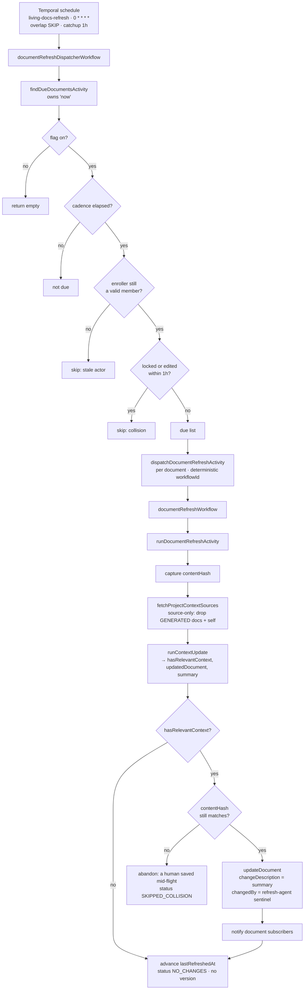

# Living Documents Auto-Refresh - Plan

## Goal Capsule

- **Objective:** A project document can be enrolled in auto-refresh so an AI job keeps it current on a per-document cadence, committing each update as an attributed version with a change summary — no human in the loop.
- **Product authority:** The originating feature narrative (PM-authored, six living document types, FR1–FR29, AC1–AC20). This contract implements the subset the platform can support today; the rest is carried in `docs/plans/2026-07-13-002-feat-living-docs-auto-refresh-deferred-scope.md` with the infrastructure each item is blocked on.
- **Product Contract preservation:** Unchanged, except the Dependencies / Assumptions section — planning found that the engine to reuse is the "Update using context" core, not the full document-generation pipeline the brainstorm named. No R-IDs changed.
- **Stop conditions:** Stop and ask if the work would require a per-user Slack/Teams delivery channel, a functional-role field on `ProjectMember`, a release event source, or feature-flag detection in a customer repository. All four are deferred and each is blocked on infrastructure that does not exist.
- **Execution profile:** Schema and shared-code extraction first, then the scheduled pipeline, then the surfaces. Every unit lands behind `FABRIC_FEATURE_LIVING_DOCS_REFRESH` (opt-in, default off).

---

## Product Contract

### Summary

A project document can be enrolled in auto-refresh (off by default) with a per-document cadence of weekly, bi-weekly, or monthly. An hourly sweep finds documents whose cadence has elapsed, regenerates them against fresh project context, and commits the result as a new version carrying an author tag and a change summary. Refreshes that would collide with a human editing the document stand down and retry on the next sweep.

### Problem Frame

Project documents go stale the moment a project moves. Fabric already has every piece needed to fix a stale document — a generation pipeline that ingests meeting transcripts, features, code, and chat context, and a document editor with `Regenerate` and `Update using context` buttons wired to it. What it lacks is anyone pressing the button. Keeping a PRD current is a chore with no deadline attached, so it loses to work that has one, and the document quietly decays until someone needs it and finds it wrong.

The cost lands late and on the wrong person: a document is trusted precisely when someone unfamiliar with the project reads it, which is exactly when nobody in the room knows it went stale three sprints ago.

### Key Decisions

**Refresh is a schedule wrapped around the pipeline that already exists.** The "Update using context" flow already reads a document, gathers project context since a baseline date, asks a model to update it, and reports what changed. Auto-refresh supplies the trigger, the enrollment state, and the commit semantics — it does not introduce a second generation path.

**Enrollment is per document and opt-in, with no gate on document type.** Any document can be enrolled. Gating enrollment to a fixed list of six types would be more code than allowing it everywhere, and it would strand the `GENERAL` documents that projects actually create.

**A refresh reads only source artifacts, never generated documents.** Generated documents are embedded into the same vector collection as user-supplied project context, and retrieval applies no type filter — so they consume retrieval slots. Restricting refresh context to source artifacts (transcripts, features, code index, human-authored contexts, linked chat) both fixes that waste and forecloses a feedback loop where unattended cycles would compound on AI-written text. The document being refreshed is still passed to the model explicitly as its baseline.

**A refresh that changes nothing commits nothing.** Comparing the outgoing and incoming content decides both whether a version is warranted and what the change summary says. A quiet fortnight therefore leaves no version behind — which departs from a literal reading of FR10, and is the intended behavior: version history must stay readable, not accumulate a biweekly entry saying nothing changed.

**A refresh proposes; applying it is opt-in.** This reverses the narrative's FR11 ("the AI commits directly, no approval gate"), and the reversal was earned rather than assumed. Review established that the engine this feature reuses was built as a *proposal*: the interactive button returns a candidate and a human reads the diff before anything is saved. Every safety property that engine has is "a person looks at the diff." Deleting the person and keeping the write does not produce an unattended version of the same feature — it produces a write primitive into the customer's specifications, reachable by anyone who can post in a connected Slack channel. So the refresh stores its result and notifies, and a human accepts or rejects. Direct commit survives as a per-document `autoApply` setting, off by default: the capability FR11 asked for is still there, it is just no longer the default.

**A refresh never overwrites live human work.** If the document is locked or was edited recently, the cycle stands down and the next hourly sweep picks it up. Nothing is queued or merged; the refresh simply happens later. Accepting a proposal re-runs the same optimistic-concurrency check, so a proposal overtaken by a human edit cannot be applied blind.

**Version authorship becomes real.** Version history currently renders every author as the literal word "Editor" — `changedBy` holds a user id that nothing resolves to a name, and the model has no relation to `User`. An AI-authored version has nowhere to be shown until that is fixed, so fixing it is part of this work rather than adjacent to it.

### Actors

- A1. **Project member with write access** — enrolls a document, sets its cadence, disables it.
- A2. **Refresh sweep** — the scheduled system actor that finds due documents and dispatches refresh jobs.
- A3. **Refresh agent** — the AI identity that authors a refreshed version. Must be distinguishable from any human in version history.

### Key Flows

- F1. Enrollment
  - **Trigger:** A1 opens a document and turns on auto-refresh.
  - **Steps:** A1 picks a cadence or accepts bi-weekly. The document is now enrolled; the first refresh becomes due one cadence interval later.
  - **Outcome:** The document is eligible for the sweep. Nothing regenerates immediately.
  - **Covered by:** R1, R2, R3

- F2. Scheduled refresh
  - **Trigger:** A2 runs; a document's cadence interval has elapsed since its last refresh.
  - **Actors:** A2, A3
  - **Steps:** The sweep checks the document is not locked or freshly edited. It assembles source-only project context. A3 regenerates the document against that context with the current content as baseline. The outgoing and incoming content are compared: on a material change, a new version is committed, attributed to A3, carrying a change summary; on no material change, nothing is committed.
  - **Outcome:** The document is current, or was already current. Either way the next refresh becomes due one cadence interval later.
  - **Covered by:** R4, R5, R6, R7, R8, R9, R10, R11

- F3. Refresh stands down
  - **Trigger:** F2 fires but the document is locked or was edited within the collision window.
  - **Steps:** No generation runs. The cycle is recorded as skipped.
  - **Outcome:** The document is untouched. The next hourly sweep re-evaluates it.
  - **Covered by:** R9

- F4. Reading what changed
  - **Trigger:** A1 opens version history on a refreshed document.
  - **Steps:** A1 sees each version's author — a named human or the refresh agent — its timestamp, and its change summary.
  - **Outcome:** A1 can tell at a glance what the AI changed and when, without reading the document.
  - **Covered by:** R12, R13, R14

### Requirements

**Enrollment and cadence**

- R1. Auto-refresh is off for every document unless a member explicitly enables it. Creating a document never enrolls it.
- R2. Cadence is set per document and offers at minimum weekly, bi-weekly, and monthly. Bi-weekly is the default offered on enrollment.
- R3. Cadence is never inherited from the project or from another document.
- R4. Any document is eligible for enrollment regardless of its type.
- R5. Disabling auto-refresh stops all future refresh jobs for that document and affects no other document.

**The refresh cycle**

- R6. A refresh becomes due one cadence interval after the document's last refresh, and fires within one hour of becoming due.
- R7. Refresh context is assembled from source artifacts only — meeting transcripts, features and stories, the code index, human-authored project contexts, and linked chat. Content authored by a previous AI generation is excluded from retrieval.
- R8. The document's current content is supplied to the refresh as its baseline, so a refresh updates the document rather than rewriting it from nothing.
- R9. A refresh does not run against a document that is locked or was edited within the collision window; the cycle is skipped and re-evaluated on the next sweep.
- R10. A refresh commits a new version only when the regenerated content differs materially from the current content. When it does not, no version is created and the document is untouched.
- R11. A refresh stores its result as a proposal and notifies; a human accepts or rejects it. Direct commit is available as a per-document setting, off by default. One document's refresh failing must not prevent other documents from refreshing.

**Version history**

- R12. Every committed version — human or AI — retains its predecessor. No version is ever deleted by a refresh.
- R13. Every version displays its author. A human author displays as that person's name; an AI-authored version displays as a distinct refresh-agent identity that cannot be mistaken for a person or for a generic system label.
- R14. Every AI-committed version carries a change summary in plain language describing what changed relative to the version it replaced, derived from a comparison of the two, and shown in version history.

**Document types**

- R15. `SRS` exists as a document type alongside the existing types, with whatever a document type requires to be generated and displayed.

**Rollout**

- R16. The feature ships behind a feature flag, consistent with how the codebase gates other in-progress features.

### Acceptance Examples

- AE1. **Covers R1.** Given a newly created document, when a member opens its auto-refresh setting, then auto-refresh is off and no refresh job has ever been scheduled for it.
- AE2. **Covers R5, R11.** Given two documents in a project, one enrolled and one not, when the enrolled document's cadence elapses, then only the enrolled document is refreshed.
- AE3. **Covers R6.** Given a document enrolled bi-weekly whose last refresh was 14 days ago, when the sweep runs, then a refresh job is dispatched within an hour of the interval elapsing.
- AE4. **Covers R9.** Given an enrolled document that is due and currently held by an editing lock, when the sweep runs, then no generation occurs and the document's content is byte-identical afterward.
- AE5. **Covers R9.** Given the same document once the lock clears, when the next hourly sweep runs, then the refresh proceeds.
- AE6. **Covers R10.** Given an enrolled document that is due, and no source context has changed since its last refresh, when the refresh runs, then no new version appears in version history.
- AE7. **Covers R10, R14.** Given an enrolled document that is due, and a new meeting transcript contradicts a section of it, when the refresh runs, then a new version is committed and its change summary names what changed in that section.
- AE8. **Covers R12, R13.** Given a document with one human version and one AI version, when a member opens version history, then the human version shows that person's name and the AI version shows the refresh-agent identity, and both remain browsable.
- AE9. **Covers R7.** Given a project whose documents have been auto-refreshed several times, when a refresh assembles context, then no previously AI-generated document content is present in that context.
- AE10. **Covers R15.** Given an SRS document enrolled in auto-refresh, when a refresh runs, then it produces a committed version with a change summary like any other type.

### Scope Boundaries

Deferred, with the infrastructure each is blocked on, in `docs/plans/2026-07-13-002-feat-living-docs-auto-refresh-deferred-scope.md`:

- The Clarification Needed workflow and its notification loop.
- Release-triggered refresh.
- AI-driven notification routing by project-member role.
- Slack and Microsoft Teams as personal notification delivery channels.
- Exclusion of feature-flagged code from refresh context.

Also out of scope, per the originating narrative:

- A diff viewer comparing two arbitrary versions. Comparing a version against the current one already exists.
- Human approval before an AI-committed version.
- Any user-facing control over the AI model or prompt used by a refresh.

### Dependencies / Assumptions

- The engine is the "Update using context" core at `packages/api/modules/projects/procedures/shared/update-with-context-core.ts` — `fetchProjectContextSources` plus `runContextUpdate`. It already returns `hasRelevantContext` (R10's gate), `summary` (R14), and `needsHumanResolution` (the deferred Clarification Needed hook). It resolves its AI model directly and needs no pre-minted AI token, unlike the full generation workflow.
- The scheduling shape is the one the newsletter dispatcher already proves in this codebase: a single global hourly cron, a find-due activity that owns "now" and reads per-entity cadence from a settings row, per-entity fan-out with error isolation, and a deterministic workflow id for idempotency.
- Notifying a member that their document refreshed rides the existing document-subscription and notification machinery. It needs no new delivery channel — in-app is the only channel this slice requires.
- **Assumption, unverified:** that refreshing against source-only context produces output at least as good as the current unfiltered pool. The filter removes retrieval slots occupied by AI-generated documents, so the expectation is strictly more real context — but this has not been measured. The repo has document evals; use them.

---

## Planning Contract

### Key Technical Decisions

- KTD1. **Reuse the "Update using context" core, not the document-generation workflow.** The generation workflow rewrites a document from scratch against the RAG firehose and requires an `aiToken` minted in the API layer where `AI_TOKEN_SECRET` lives — a scheduled job has no request to mint one from. The context-update core takes a baseline document, updates it minimally, and resolves its model directly through `getAIModelWithMetadata`. It also already returns the two things R10 and R14 need. This is the difference between building the refresh and wiring it.

- KTD2. **Move the core into `@repo/temporal`, not into a new package.** `packages/temporal` cannot import `@repo/api` (dependency cycle), but it already depends on every package the core needs (`@repo/ai`, `@repo/rag`, `@repo/utils`, `@repo/agent-prompts`). The repo has a documented precedent for exactly this: `packages/temporal/src/lib/create-story-from-proposal.ts` — *"Lives in @repo/temporal so both @repo/api procedures and temporal activities [can use it]."* The API procedure keeps working by importing from `@repo/temporal`.

- KTD3. **Source-only filtering happens in Qdrant, by excluding every point that carries a `documentId`.** Retrieval hydrates its hits through `getRetrievableContextById`, which resolves `ProjectContext` and falls back to `ProjectContextUrlPage` — it never looks up `ProjectDocument`. A generated document's vectors carry a `doc-<id>` context id that resolves to nothing, so they are already dropped before reaching the prompt. R7 therefore holds today, but only as a side effect of that hydration gap: anyone who "fixes" hydration to resolve `ProjectDocument` — which reads like a bug worth fixing — silently opens the AI-to-AI loop. Excluding `documentId`-bearing points at the query changes nothing about what reaches the prompt, buys back the recall slots those dead vectors currently consume, and turns R7 into an enforced, tested invariant instead of an accident. Imported documents are unaffected: they reach the prompt as their own `ProjectContext` row, not as the `ProjectDocument` copy.

- KTD4. **Cadence is a string with a TypeScript union, not a Prisma enum.** `NewsletterSettings.cadence` is `String @default("WEEKLY")` with the union declared in `packages/database/src/newsletter-cadence.ts`. Following that precedent means adding `BIWEEKLY` costs no enum migration, and the due/period-bucket helpers get a directly analogous home.

- KTD5. **The collision window equals the sweep interval: one hour.** `DocumentLock` auto-expires after five minutes and is kept alive by a heartbeat, so an active editor always holds a live lock. A refresh stands down when an unexpired lock exists or when `updatedAt` is within the last hour. With a cadence measured in weeks, deferring an hour costs nothing, and tying the window to the sweep interval means there is no arbitrary number to defend.

- KTD6. **The commit is guarded by a compare-and-set on `contentHash`.** The lock check happens at dispatch, but generation takes minutes — a human can start and finish an edit while the model is still thinking. The refresh captures the document's content hash before generating and commits only if it still matches. If it does not, the human won and the refresh abandons its result. This is the same terminal-state-guard discipline `docs/solutions/architecture-patterns/cancelling-temporal-backed-jobs.md` prescribes for Temporal-backed jobs, and without it R9 is best-effort rather than a guarantee.

- KTD7. **The AI author is a sentinel string in `changedBy`, resolved at read time.** `DocumentVersion.changedBy` is `String?` with no foreign key, so a synthetic id is schema-legal and needs no migration on a hot table. The versions procedure resolves `changedBy` into `{ kind, name }` — a `User` lookup for a real id, a known display name for the sentinel — and the UI renders that instead of the hardcoded literal `"Editor"`. This fixes author display for humans at the same time, which is the only reason the AI identity has anywhere to appear.

- KTD8. **The change summary lands on the superseded version row, following the existing save convention.** `updateDocument` snapshots the *previous* content as the version row and attaches the incoming change's `changeDescription` and `changedBy` to it, then advances the document to the new content. Every human edit already behaves this way and the version-history UI is built around it ("Click a version to compare with current document"). The refresh uses `updateDocument` unchanged rather than the Temporal `createDocumentVersion` path, which writes the *new* content as a new row — introducing a second convention on the same table would make version history unreadable.

- KTD9. **The schedule is always registered; the feature flag gates the handler.** This is the repo's stated convention (`packages/temporal/src/scripts/ensure-context-summarization-schedules.ts`): *"flag gating lives in the handler, not in registration, so flipping the flag on takes effect on the next tick with no redeploy."* The flag is `FABRIC_FEATURE_LIVING_DOCS_REFRESH`, read through `parseOptInFlag` — the `FABRIC_` prefix is required, since `turbo.json` passes through `FABRIC_*` by wildcard but not a bare `FEATURE_*`.

- KTD10. **The sweep dispatches a workflow per document rather than doing the work inline.** A refresh is a slow model call; running them sequentially inside the sweep activity would let one slow document delay every other. The dispatch activity starts a per-document workflow with a deterministic id and treats `WorkflowExecutionAlreadyStartedError` as success, which is how the newsletter dispatcher gets idempotency without a dedupe table.

### High-Level Technical Design

### Assumptions

- The Temporal worker runs with the `fabric_worker` Postgres role, which has an RLS bypass policy — so the sweep can read enrollment rows across tenants without a per-request tenant context. This is how every existing sweep works.
- Generated-document vectors never reach any prompt today, because hydration resolves only `ProjectContext` and `ProjectContextUrlPage`. R7 is therefore already true by accident; U3 makes it true on purpose and reclaims the recall slots those dead vectors consume. Applying the exclusion to every retrieval path (not just the refresh) would be a further strict improvement — deliberately left as a follow-up so this slice cannot regress the interactive flow.

### Sequencing

U8 and U1 first (flag and schema unblock everything). U2 is a pure move that must land before U3 and U4 touch the core. U4 is the spine and depends on U1, U2, U3, U9. U5, U6, U7 are independent surfaces.

---

## Implementation Units

### U1. Enrollment settings model and cadence helpers

**Goal:** Persist per-document enrollment and cadence, and compute whether a document is due.

**Requirements:** R1, R2, R3, R5, R6

**Dependencies:** none

**Files:**
- `packages/database/prisma/schema.prisma` — new `DocumentAutoRefreshSettings` model
- `packages/database/prisma/migrations/<timestamp>_document_auto_refresh_settings/migration.sql`
- `packages/database/src/document-refresh-cadence.ts` — new
- `packages/database/src/document-refresh-cadence.test.ts` — new
- `packages/database/prisma/queries/projects/document-refresh.ts` — new
- `packages/database/prisma/queries/projects/document-refresh.test.ts` — new
- `packages/database/scripts/apply-rls-direct.ts` — add the table

**Approach:** The model is one row per document: `documentId @unique`, `projectId`, `enabled Boolean @default(false)`, `cadence String @default("BIWEEKLY")`, `createdByUserId`, `lastRefreshedAt DateTime?`, `lastRefreshStatus String?`, `lastRefreshSummary String?`, plus the tenant columns `userId` / `organizationId` copied from the parent document, both indexed, both cascading. `createdByUserId` exists because AI model resolution and usage logging are per-user; the sweep has no session and must borrow the enroller's identity, exactly as the newsletter sweep borrows `NewsletterSettings.createdByUserId`.

Cadence helpers mirror `packages/database/src/newsletter-cadence.ts`: `intervalDays(cadence)` (7 / 14 / 30), `isRefreshDue(settings, now)` (true when `lastRefreshedAt` is null or `now >= lastRefreshedAt + intervalDays`), and `refreshPeriodBucket(cadence, now)` for the deterministic workflow id. `lastRefreshStatus` carries the observability the narrative's NFR asks for without a separate run table.

**Patterns to follow:** `NewsletterSettings` (`packages/database/prisma/schema.prisma:3863`) for the settings-row shape; `packages/database/src/newsletter-cadence.ts` for the helpers and their co-located test; `packages/database/prisma/queries/projects/newsletter.ts:355` (`listEnabledNewsletterSettings`) for the sweep-side query. RLS entry mirrors `{ name: "newsletter_settings", policy: "user_owned" }` in `packages/database/scripts/apply-rls-direct.ts:284`.

**Test scenarios:**
- `isRefreshDue` returns false when `lastRefreshedAt` is 6 days ago on a WEEKLY cadence, true at 7 days.
- `isRefreshDue` returns true when `lastRefreshedAt` is null (never refreshed) and the row is enabled.
- `isRefreshDue` returns false when `enabled` is false, regardless of elapsed time. **Covers AE2.**
- BIWEEKLY is due at 14 days, not 7; MONTHLY at 30, not 14. **Covers AE3.**
- `refreshPeriodBucket` returns the same bucket for two times inside one interval and different buckets across the boundary.
- An unknown cadence string falls back to the bi-weekly interval rather than throwing.
- The list query returns only enabled rows, and carries `organizationId` / `userId` through for the tenant-scoped work downstream.

**Verification:** `prisma migrate dev` applies cleanly; `pnpm --filter @repo/database generate` regenerates the client; `pnpm --filter @repo/database apply:rls` reports the new table; the cadence tests pass.

---

### U2. Move the context-update core into `@repo/temporal`

**Goal:** Make the "Update using context" engine callable from a Temporal activity without a dependency cycle.

**Requirements:** R8 (enables), R10 (enables), R14 (enables)

**Dependencies:** none

**Files:**
- `packages/temporal/src/lib/update-with-context-core.ts` — moved from `packages/api/modules/projects/procedures/shared/update-with-context-core.ts`
- `packages/api/modules/projects/procedures/shared/update-with-context-core.ts` — deleted; its importers repoint
- `packages/api/modules/projects/procedures/documents/update-with-context.ts` — import from `@repo/temporal`
- Any story-side importer of the same core (it is shared with features — find them before moving)

**Approach:** A pure move plus import rewrites. No behavior change, no signature change. The core's dependencies (`@repo/ai`, `@repo/rag`, `@repo/utils`, `@repo/agent-prompts`) are all already in `packages/temporal/package.json`, and `@repo/api` already depends on `@repo/temporal`, so the direction of the edge is the safe one.

**Execution note:** Characterization-first. The existing suite at `packages/api/modules/projects/procedures/documents/__tests__/update-with-context-phase2.test.ts` is the contract this move must not break — run it before and after, unchanged.

**Patterns to follow:** `packages/temporal/src/lib/create-story-from-proposal.ts` — same problem, same solution, and its header comment states the rule.

**Test scenarios:**
- The existing `update-with-context-phase2` suite passes unchanged against the moved module.
- The story-side caller of the shared core still resolves and passes its own suite.
- `pnpm type-check` is clean across `@repo/api` and `@repo/temporal` — this is the real proof there is no cycle.

**Verification:** No test changes were needed. `pnpm type-check` passes.

---

### U3. Source-only context assembly

**Goal:** Keep AI-generated documents out of the context a refresh reads.

**Requirements:** R7

**Dependencies:** U2

**Files:**
- `packages/rag/lib/project-contexts/types.ts` — add the exclusion option to `ProjectContextSearchOptions`
- `packages/rag/lib/project-contexts/store.ts` — build the `must_not` clause in `searchSimilarProjectContexts`
- `packages/rag/lib/project-contexts/retrieve-for-spec.ts` — thread the option through
- `packages/rag/lib/project-contexts/__tests__/store.test.ts` — new or extended
- `packages/temporal/src/lib/update-with-context-core.ts` — thread the option through `fetchProjectContextSources`

**Approach:** Add `excludeDocumentChunks?: boolean` to `ProjectContextSearchOptions`, defaulted off so every existing caller is untouched. When set, `searchSimilarProjectContexts` adds a `must_not` clause excluding points whose payload carries a non-null `documentId`. `documentId` is the clean discriminator: `storeProjectContext` writes `documentId: metadata?.documentId || null`, and only `ProjectDocument` chunks populate it. Thread the option from `fetchProjectContextSources` (via `retrieveRelevantContextsForSpec`) so only the refresh path sets it.

This is a strict improvement, not a behavior change: those points already fail hydration and are discarded. Excluding them at the query stops them consuming recall slots and makes R7 an enforced invariant rather than an accident of the hydration path.

The interactive "Update using context" flow does not set the option, so its behavior is byte-identical.

**Test scenarios:**
- With `excludeDocumentChunks` set, the Qdrant filter carries a `must_not` clause on `documentId`; with it unset, the filter is unchanged from today. **Covers AE9.**
- The tenant clauses (`projectId`, and `organizationId` match or `is_null`) survive alongside the new clause in both the personal and organization cases.
- An existing caller that omits the option produces a filter byte-identical to the current one — this is the regression guard for the interactive path.
- A refresh's retrieval returns no context whose id begins with the document-chunk prefix.

**Verification:** New tests pass; the existing context-update and retrieval suites pass unchanged.

---

### U4. The sweep, the dispatch, and the refresh job

**Goal:** Run enrolled documents through the engine on schedule and commit the result.

**Requirements:** R6, R8, R9, R10, R11, R12, R14

**Dependencies:** U1, U2, U3, U8, U9

**Files:**
- `packages/temporal/src/activities/document-refresh/find-due-documents.ts` — new
- `packages/temporal/src/activities/document-refresh/find-due-documents.test.ts` — new
- `packages/temporal/src/activities/document-refresh/dispatch-document-refresh.ts` — new
- `packages/temporal/src/activities/document-refresh/run-document-refresh.ts` — new
- `packages/temporal/src/activities/document-refresh/run-document-refresh.test.ts` — new
- `packages/temporal/src/activities/document-refresh/index.ts` — new barrel
- `packages/temporal/src/activities/index.ts` — re-export the three activities
- `packages/temporal/src/workflows/document-refresh-dispatcher.ts` — new
- `packages/temporal/src/workflows/document-refresh.ts` — new
- `packages/temporal/src/workflows/index.ts` — export both
- `packages/temporal/src/workflows/__tests__/document-refresh.test.ts` — new
- `packages/temporal/src/schedules.ts` — constants, a `registerDocumentRefreshSchedule`, and the call in `registerSystemSchedules`

**Approach:** Three layers, each mirroring the newsletter dispatcher.

`findDueDocumentsActivity` owns "now". It returns empty immediately when the flag is off (KTD9). Otherwise it lists enabled settings, keeps the ones where `isRefreshDue`, drops the ones whose `createdByUserId` is no longer a valid member of the owning organization, and drops the ones in collision — an unexpired `DocumentLock` or `updatedAt` within the last hour (KTD5). Each survivor carries `documentId`, `projectId`, tenant columns, `triggeredByUserId`, and a deterministic `workflowId` built from the period bucket.

`dispatchDocumentRefreshActivity` starts `documentRefreshWorkflow` and swallows `WorkflowExecutionAlreadyStartedError` — that is the idempotency (KTD10). The dispatcher workflow loops the due list and catches per document, so one failure cannot end the sweep.

`runDocumentRefreshActivity` is the job: read the document and capture its `contentHash`; call `fetchProjectContextSources` with source-only options and the document as `excludeDocumentId`; call `runContextUpdate` with the document as baseline. When `hasRelevantContext` is false, advance `lastRefreshedAt`, write `lastRefreshStatus: "NO_CHANGES"` and commit nothing (R10). When it is true, re-read the document's `contentHash` and abandon if it moved — a human saved while the model was working (KTD6). Otherwise call `updateDocument` with the new content, `changeDescription` set to the model's `summary`, and `lastEditedBy` set to the refresh-agent sentinel (KTD7, KTD8), then notify subscribers via U9 and advance `lastRefreshedAt`.

The schedule is `0 * * * *`, `overlap: "SKIP"`, `catchupWindow: "1 hour"`, on the `project-documents` task queue that the other document workflows use.

**Patterns to follow:** `packages/temporal/src/workflows/newsletter-dispatcher.ts` (the sweep and its error isolation), `packages/temporal/src/activities/newsletter/find-due-newsletter-projects.ts` (owns "now", stale-actor guard), `packages/temporal/src/activities/newsletter/dispatch-newsletter-send.ts` (deterministic workflow id, `WorkflowExecutionAlreadyStartedError` as success), `packages/temporal/src/schedules.ts:521` (registration shape, `ScheduleAlreadyRunning` swallowed).

**Test scenarios:**
- Flag off: the find-due activity returns an empty list and issues no query. **Covers R16.**
- A document enrolled bi-weekly whose last refresh was 14 days ago appears in the due list; one at 13 days does not. **Covers AE3.**
- A disabled document never appears, even when a sibling document in the same project is due. **Covers AE2.**
- A due document holding an unexpired `DocumentLock` is excluded from the due list. **Covers AE4.**
- A due document whose `updatedAt` is 20 minutes ago is excluded; at 70 minutes it is included. **Covers AE5.**
- A due document whose enroller is no longer an organization member is excluded, and the skip is logged.
- The dispatcher continues to the next document when one dispatch throws, and reports the count it did dispatch. **Covers R11.**
- Dispatch treats `WorkflowExecutionAlreadyStartedError` as success and does not throw.
- The refresh job, given `hasRelevantContext: false`, creates no `DocumentVersion` and still advances `lastRefreshedAt`. **Covers AE6.**
- The refresh job, given `hasRelevantContext: true`, commits a version whose `changeDescription` is the model's summary and whose `changedBy` is the sentinel. **Covers AE7, AE8.**
- The refresh job abandons without writing when the document's `contentHash` changed between capture and commit, and records the collision.
- The refresh job passes the document's current content as the baseline and its id as `excludeDocumentId`. **Covers R8.**
- Both personal (`organizationId: null`) and organization contexts are exercised — the XOR filter must hold in the sweep.

**Verification:** Workflow tests pass with activities mocked (repo convention — no `TestWorkflowEnvironment`); the worker starts and logs the new schedule as registered; a manually-enrolled document on a past `lastRefreshedAt` refreshes on the next tick.

---

### U5. Version author identity and display

**Goal:** Show who wrote each version — a real person's name, or the refresh agent.

**Requirements:** R13

**Dependencies:** none

**Files:**
- `packages/database/prisma/queries/projects/documents.ts` — resolve authors in `getDocumentVersions`
- `packages/api/modules/projects/procedures/versions/list-versions.ts` — carry the resolved author through
- `packages/api/modules/projects/procedures/versions/__tests__/list-versions.test.ts` — new
- `apps/web/modules/saas/projects/components/DocumentVersionHistory.tsx` — render the author
- `apps/web/modules/saas/projects/components/__tests__/DocumentVersionHistory.test.tsx` — new
- `packages/utils/lib/document-version-author.ts` — the sentinel constant and its resolver

**Approach:** Define the sentinel (`agent:living-docs-refresh`) and a display name for it in one place both server and client can import. `getDocumentVersions` batches a `User` lookup for the non-sentinel `changedBy` values and returns each version with `author: { kind: "HUMAN" | "AI_AGENT", name }`. The component renders `author.name` where it currently renders the hardcoded string `"Editor"` at `DocumentVersionHistory.tsx:459`, and marks the AI author visually distinct from a person.

This is the unit that closes an existing gap: today no version shows any author name at all, human or otherwise.

**Test scenarios:**
- A version whose `changedBy` is a real user id resolves to that user's name.
- A version whose `changedBy` is the sentinel resolves to the refresh-agent display name and is flagged `AI_AGENT`. **Covers AE8.**
- A version whose `changedBy` is null renders without an author rather than crashing (legacy rows).
- A version whose `changedBy` points at a deleted user renders a neutral fallback, not a raw id.
- Ten versions by three distinct authors issue one batched user query, not ten.
- The component renders a human name and the agent identity differently enough that they cannot be confused. **Covers R13.**

**Verification:** Version history on a document with mixed authorship shows real names; no version renders the literal word "Editor".

---

### U6. Enrollment control

**Goal:** Let a member with write access turn auto-refresh on, pick a cadence, and turn it off.

**Requirements:** R1, R2, R3, R4, R5

**Dependencies:** U1

**Files:**
- `packages/api/modules/projects/procedures/documents/get-auto-refresh.ts` — new
- `packages/api/modules/projects/procedures/documents/set-auto-refresh.ts` — new
- `packages/api/modules/projects/procedures/documents/__tests__/set-auto-refresh.test.ts` — new
- `packages/api/modules/projects/router.ts` — register both under `documents`
- `apps/web/modules/saas/projects/components/DocumentAutoRefreshToggle.tsx` — new
- `apps/web/modules/saas/projects/components/DocumentEditorPage.tsx` — mount it beside `SubscribeToggle`
- `apps/web/modules/saas/projects/components/__tests__/DocumentAutoRefreshToggle.test.tsx` — new

**Approach:** Two `tenantProtectedProcedure`s guarded by `Permissions.DOCUMENT_UPDATE`, both taking `organizationId: z.string().nullable().optional()` and resolving it through `resolveOrganizationId`. `set` upserts the settings row and stamps `createdByUserId` with the caller — re-enabling by a different member re-homes it, which is what keeps the sweep's actor valid after the original enroller leaves.

The control sits next to `SubscribeToggle` in the document masthead (`DocumentEditorPage.tsx:572`) — same slot, same props shape. It is a toggle plus a cadence select, hidden entirely when the feature flag is off.

**Patterns to follow:** `apps/web/modules/saas/subscriptions/components/SubscribeToggle.tsx` and its hook for the control shape; `packages/api/modules/projects/procedures/documents/update-with-context.ts` for the procedure's authorization preamble.

**Test scenarios:**
- A new document reports auto-refresh disabled with no settings row. **Covers AE1.**
- Enabling with no cadence supplied stores `BIWEEKLY`. **Covers R2.**
- Enabling stamps `createdByUserId` with the caller; a second member re-enabling re-homes it to them.
- Disabling leaves the row but sets `enabled: false`, and `lastRefreshedAt` is preserved.
- A member without `DOCUMENT_UPDATE` is rejected.
- A caller in the wrong tenant gets `NOT_FOUND`, not `FORBIDDEN` — no existence oracle.
- Enrolling a `GENERAL` document succeeds — enrollment is not gated on type. **Covers R4.**
- The control does not render when the flag is off. **Covers R16.**

**Verification:** Enrolling a document on staging creates the row; disabling stops it appearing in the due list.

---

### U7. SRS document type

**Goal:** Make `SRS` a first-class document type.

**Requirements:** R15

**Dependencies:** none

**Files:**
- `packages/database/prisma/schema.prisma` — `ProjectDocumentType += SRS`
- `packages/database/prisma/migrations/<timestamp>_add_srs_document_type/migration.sql`
- Wherever document-type default prompts are seeded and wherever the type's label and icon are mapped in the web app — locate both before starting; the type appears in the prompts page filter, the create-document dialog, and the document-type chip

**Approach:** The enum value is additive (`ALTER TYPE "ProjectDocumentType" ADD VALUE IF NOT EXISTS 'SRS';`, matching the house style for enum migrations). The real work is the surrounding surface: a default generation prompt for the type, a display label, and an entry in whatever maps a type to its icon and description. Grep for an existing narrow type — `QA_STRATEGY` is the closest analogue and the shortest path to a complete list of touch points.

**Test scenarios:**
- An SRS document can be created and appears with its own label rather than falling back to "General".
- Generating an SRS document resolves a default prompt rather than the generic one.
- An SRS document enrolled in auto-refresh produces a committed version with a change summary. **Covers AE10.**

**Verification:** The type appears in the create-document dialog and the prompts filter; a generated SRS is not labelled "General".

---

### U8. Feature flag

**Goal:** Ship dark.

**Requirements:** R16

**Dependencies:** none

**Files:**
- `packages/utils/lib/feature-flag.ts` — add `isLivingDocsRefreshEnabled()`
- `.env.example` — document `FABRIC_FEATURE_LIVING_DOCS_REFRESH` and its client mirror
- `packages/api/vitest.config.ts` — set the flag on so the new API tests run enabled
- `apps/web/modules/saas/shared/lib/feature-flags.ts` — the client mirror, read as a literal `process.env.NEXT_PUBLIC_*` expression

**Approach:** Use `parseOptInFlag` (default off) — not the kill-switch reader, which defaults on and would ship this live. The `FABRIC_` prefix is load-bearing: `turbo.json` passes `FABRIC_*` through by wildcard, and a bare `FEATURE_*` name would not reach the worker.

**Test scenarios:**
- Unset, `"false"`, `"0"`, and garbage all read as disabled.
- `"true"`, `"1"`, `"on"`, `"yes"` — case-insensitive, whitespace-trimmed — read as enabled.

**Verification:** With the flag unset, the enrollment control is absent and the find-due activity returns empty.

---

### U9. Refresh notification for document subscribers

**Goal:** Tell the people watching a document that the AI updated it.

**Requirements:** R11 (supporting), R14 (surfacing)

**Dependencies:** none

**Files:**
- `packages/database/prisma/queries/projects/document-refresh-notifications.ts` — new
- `packages/database/prisma/queries/projects/document-refresh-notifications.test.ts` — new

**Approach:** `packages/temporal` cannot import `@repo/api`'s `notification-service` — the codebase says so in two places and mirrors the writer instead. Put the writer in `@repo/database`, following `packages/database/prisma/queries/repo-integration-notifications.ts`: load the document's subscribers, filter through `getEnabledRecipientsForCategory` so per-user category preferences are honored at write time, and create one `DOCUMENT_UPDATED` / `SUBSCRIPTION` notification each with a dedupe key. It must never throw — a failed notification cannot fail a refresh that already committed.

The actor is the refresh agent, not a person, so the notification title names it as such rather than saying "A teammate updated…".

**Test scenarios:**
- Each subscriber except the refresh agent receives one notification.
- A subscriber who has muted the `SUBSCRIPTION` category receives none.
- A subscriber who has lost access to the project receives none.
- Two refreshes of the same document inside the dedupe window coalesce rather than duplicating.
- A thrown error inside the writer is caught and logged, and the caller is unaffected.

**Verification:** Refreshing a watched document produces one in-app notification per subscriber, attributed to the refresh agent.

---

## Verification Contract

| Gate | Command | Applies to |
|---|---|---|
| Types | `pnpm type-check` | all units; the real proof U2 introduced no cycle |
| Lint / format | `pnpm lint` | all units |
| Migration | `npx dotenv -c -e ../../.env.local -- npx prisma migrate dev --name <name> --schema=./prisma/schema.prisma` from `packages/database` — never `db push` | U1, U7 |
| Client + Zod | `pnpm --filter @repo/database generate` | U1, U7 |
| RLS | `pnpm --filter @repo/database apply:rls` | U1 |
| Database tests | `pnpm --filter @repo/database test` | U1, U5, U9 |
| Temporal tests | `pnpm --filter @repo/temporal test` | U2, U3, U4 |
| API tests | `pnpm --filter @repo/api test` | U2, U5, U6 |
| Web tests | `pnpm --filter web test` | U5, U6 |
| Tenant isolation | `pnpm --filter @repo/database test:tenant` | U1, U4, U6 |
| Worker reload | restart `temporal-worker` via the Aspire MCP tools after any change under `packages/temporal/` | U2, U3, U4 |
| Replay determinism | CI runs `.github/workflows/temporal-replay-validation.yml` on PRs touching `packages/temporal/src/workflows/**` | U4 |
| Changeset | a `.changeset/*.md` bumping `fabric-app` only | the PR |

New workflows are tested by mocking the activity surface with `vi.fn()` and driving the workflow body — the repo deliberately does not use `TestWorkflowEnvironment`. Adding an activity call to an *existing* workflow would need a `patched()` gate; this plan adds new workflows instead, so it does not.

## Definition of Done

- Every requirement R1–R16 is exercised by at least one passing test, and every acceptance example AE1–AE10 is covered by a named test scenario.
- All Verification Contract gates pass.
- The feature is off with the flag unset: no enrollment control renders, the sweep finds nothing, and no existing behavior changes.
- A document enrolled on staging with a backdated `lastRefreshedAt` refreshes on the next hourly tick and its new version shows the refresh agent as author with a non-empty change summary.
- A document held open in the editor is not refreshed, and is refreshed on a later sweep once released.
- Version history shows real author names for human versions — the hardcoded `"Editor"` literal is gone from the codebase.
- The interactive "Update using context" flow behaves exactly as it did before: its tests pass unchanged, and its context is still unfiltered.
- No dead-end or experimental code from abandoned approaches remains in the diff.
