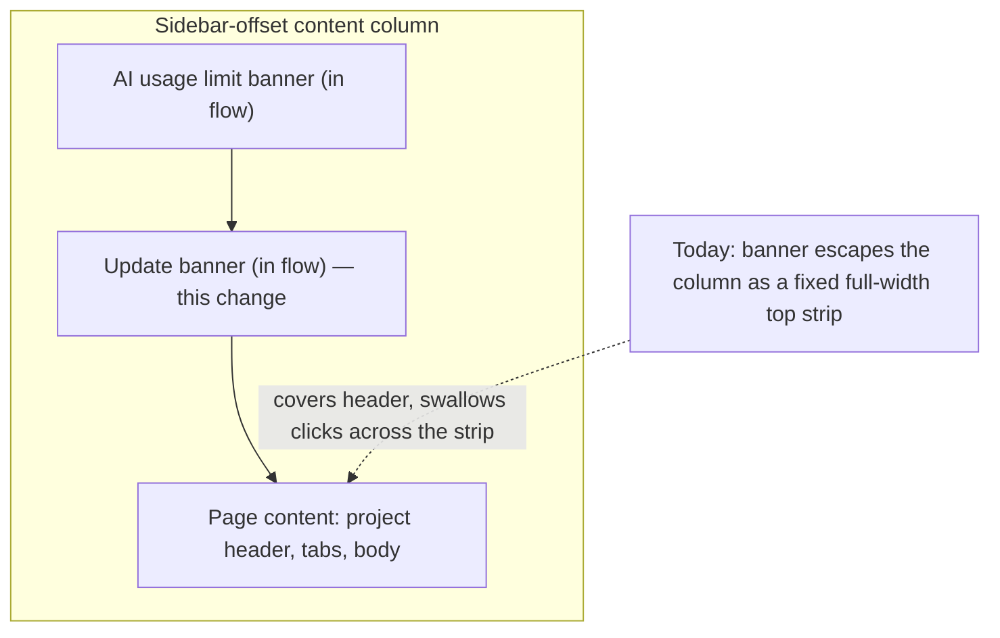

# Version Update Banner - Plan

## Goal Capsule

- **Objective:** Stop the build-update backstop banner from covering and click-blocking the project header by rendering it in the flow of the content column instead of as a fixed overlay.
- **Product authority:** Confirmed in brainstorm dialogue on 2026-07-17. The in-flow shape and the narrow scope are settled; do not re-open them.
- **Execution profile:** Three units, one file of real behavior change. Default posture — no test-first requirement.
- **Stop conditions:** Stop and surface if the in-flow banner turns out to need changes outside `BuildVersionWatcher.tsx` beyond the comment fix in `AppWrapper.tsx`, or if pinning the shape requires reworking the `Alert` primitive.
- **Tail ownership:** The user owns commit, push, and PR. Do not commit.

**Product Contract preservation:** preserved, with two clarifications. Two Outstanding Questions (centering, full-height behavior) were resolved into Key Technical Decisions and lifted out of the list, leaving one open and non-blocking. The Key Decision on layout shift was reworded to say what the change actually delivers — the entrance is animated, the reflow is not — after review found the original wording claimed a softening no unit implements. No requirement changed.

---

## Product Contract

### Summary

Move the update banner out of its fixed overlay and render it in the normal flow of the sidebar-offset content column, where it reserves its own space and pushes the page down — the same shape the AI-usage-limit banner already uses. Removing the overlay removes both current defects at their cause rather than patching them.

### Problem Frame

The update banner is not the primary update path and rarely appears. The build-version watcher upgrades users silently at navigation seams — an internal link click, a pathname change, or returning to the tab after being away. The banner is a backstop that fires only when a user has sat on a stale build for ten minutes without hitting any seam, giving a sixty-second countdown so they are not stranded on old code.

That gate matters, because it determines who sees the banner: someone parked on a single screen, reading or working, not navigating. When it fires, it fires on a user who is deep in one page.

Today it fires as a fixed, full-width strip pinned to the top of the viewport at a z-index above everything, including the NavBar. Two defects follow, and both are consequences of the same mistake — floating a component designed for normal flow on top of arbitrary content.

The first is readability. The banner uses the `primary` `Alert` variant, whose surface is a ten-percent tint with no backdrop blur. That variant is correct when it sits on the page background, which is how the AI-usage-limit banner uses it. Floated over the header, the tint composites with the breadcrumbs, project title, and status pill instead, so page text reads straight through the banner text.

The second is interaction, and it was not in the original report. The banner's container spans the full viewport width and carries no pointer-events handling, so the entire top strip swallows clicks — not only the centered area where the banner is visible. Header controls sitting under that strip, including the project action buttons, cannot be clicked while the banner is up.

The cost is bounded — the banner is rare and lasts sixty seconds — but it lands on a user mid-task and makes the product look unfinished at the exact moment it is asking for trust.

### Key Decisions

**Render in flow; do not patch the overlay.** Both defects are downstream of the overlay itself. An in-flow banner has no strip to swallow clicks and composites its tint against the page surface, which is what the variant was built for. This dissolves both defects instead of adding an opaque-background override and a pointer-events escape hatch. The `Alert` `primary` variant is kept unchanged — it was never wrong, only misused.

**Stay in the content column; do not touch the app shell.** Layout-level full-width placement has been rejected twice in this app because it overlaps the fixed NavBar, and both surfaces that tried it were relocated into the sidebar-offset column. The watcher is already mounted in that column, adjacent to the AI-usage-limit banner. Staying there follows the established pattern and leaves the hardcoded viewport-height math alone.

**Accept the layout shift.** The original request asks both to reserve space for the banner and to avoid abrupt layout shift. Those are incompatible: reserving space *is* a shift. Reserving space is the goal, so the shift stays. The banner's entrance fades in, but the reflow below it is instant — an opacity transition does not animate the space the banner claims. Whether that lands as jarring is a question for the eye, not the test suite, and the Verification Contract carries a manual gate for it.

**Keep the backstop framing.** When the banner appears and how long it counts down are not in question. This change is about where it renders, not when.

**Keep the scope narrow.** The auto-reload guard is dead code and the version-check path carries a provably stale comment. The comment is corrected here because it describes the component being changed. The guard is a separate concern and is deferred.

### Requirements

**Placement**

- R1. The banner renders in the normal flow of the sidebar-offset content column, as a sibling above the page content, not as a fixed or absolutely positioned overlay.
- R2. While the banner is visible it reserves its own vertical space; content below shifts down rather than being covered.
- R3. No part of the banner or its container covers or intercepts pointer events over project breadcrumbs, project title, status indicator, document and context counts, navigation tabs, or header action buttons.
- R4. The banner stays inside the content column and neither overlaps nor displaces the fixed NavBar.

**Appearance**

- R5. No page content is legible through the banner's surface.
- R6. The banner stays horizontally centered within the content column at its current maximum width.
- R7. The message, the "Refresh now" action, and the countdown keep their current copy and prominence; the countdown stays visible and continues to tick once per second.

**Behavior**

- R8. When the banner appears and when it auto-refreshes are unchanged: it surfaces only after the stale threshold passes with no navigation seam, and refreshes when the countdown reaches zero.
- R9. The banner animates on entrance and respects `prefers-reduced-motion`.
- R10. On full-height routes — workflow canvas, chatbot, nexus, and kanban — the banner takes its space from the content area rather than extending the page, and the work area stays scrollable with no content made unreachable.

**Layout integrity**

- R11. The banner stays readable and non-overlapping across supported viewport widths and browser zoom levels.

**Regression safety**

- R12. A test pins the banner as in-flow, so a future change cannot silently restore a fixed overlay or a click-blocking container.
- R13. The comment describing the build-version watcher at its mount site states the actual gate; the claim that it renders only for releases flagged critical is removed.

### Region composition

### Acceptance Examples

- AE1. Banner on a standard scrolling route
  - **Covers R1, R2, R3, R5.**
  - **Given:** A user is on a project page and the loaded build has been stale past the threshold with no navigation seam.
  - **When:** The banner appears.
  - **Then:** Breadcrumbs, title, status pill, and counts stay fully legible and clickable; the page content sits below the banner in the flow rather than being covered by it.

- AE2. Banner on a full-height route
  - **Covers R10.**
  - **Given:** A user is on the chatbot, nexus, kanban, or workflow-canvas route under the same stale conditions.
  - **When:** The banner appears.
  - **Then:** The work area absorbs the banner's height, stays scrollable, and no control is pushed out of reach.

- AE3. Header actions during the countdown
  - **Covers R3.**
  - **Given:** The banner is visible and counting down.
  - **When:** The user clicks a header action button positioned near the top of the page.
  - **Then:** The click reaches the button.

- AE4. Reduced motion
  - **Covers R9.**
  - **Given:** The user has `prefers-reduced-motion` set.
  - **When:** The banner appears.
  - **Then:** It appears without a slide or fade animation.

### Scope Boundaries

- Reviving the auto-reload guard. Its registration helpers have no callers, so its check is unconditionally permissive and all three of its call sites are dead branches. The countdown's refresh does not consult it either. This is a real latent gap and belongs in its own change.
- Changing backstop timing — the stale threshold or the countdown length.
- A layout-level or full-width banner that displaces the NavBar.
- A dismiss or snooze affordance.
- Reworking the `primary` `Alert` variant.
- Re-introducing a release-criticality flag. The critical-release path was deliberately removed; only the comment describing it survived.

### Dependencies / Assumptions

- Browser scroll anchoring is assumed to absorb most of the perceived jump for users scrolled away from the top. Unverified — worth checking during implementation, since it determines whether R2's shift needs further softening.
- The banner is assumed to stay rare in practice, which is what makes the layout shift an acceptable trade. If deploy frequency rises enough that users meet the backstop often, the trade should be revisited.

### Outstanding Questions

**Deferred, non-blocking**

- The banner in the reported screenshot renders green, but the primary token is a deep rose. Establish whether the screenshot predates a theme change or whether the token resolves differently in that environment. This does not block the change: R5 is satisfied by the surface compositing against the page background, whatever the token resolves to.

---

## Planning Contract

### Key Technical Decisions

- KTD1. **Strip the wrapper's positioning classes; keep the wrapper as a layout-only container.** `BuildVersionWatcher.tsx:166`'s `fixed inset-x-0 top-0 z-[200] flex justify-center p-3` div is the only positioning source — the `Alert` primitive is `relative` with no z-index of its own. Removing `fixed inset-x-0 top-0 z-[200]` is sufficient to reach the flow; the div itself is not the defect and must survive. `AiUsageLimitBanner` has exactly this shape — a plain wrapper around an `Alert` — so keeping it is what makes the precedent transfer. This removes the only `z-[200]` outside a fullscreen viewer.

- KTD2. **Spacing lives on the wrapper, never on the `Alert`.** The content column carries no `gap` or `space-y`, so every child owns its rhythm. The wrapper has no padding of its own, so padding utilities on it are safe and mirror `AiUsageLimitBanner`'s `pt-3 pb-1`. Putting those same classes on the `Alert` would not add outer spacing at all — the `Alert` cva already sets `p-4`, `cn` keeps `p-4 pt-3 pb-1` all three, and Tailwind emits `pt-*`/`pb-*` after `p-*`, so they silently shrink the alert's own padding to 12px top / 4px bottom against 16px sides. The wrapper is what makes the difference between outer spacing and a squashed card.

- KTD3. **Keep the wrapper's existing `justify-center`.** It already centers the `max-w-2xl` alert, so centering costs nothing and needs no class on the `Alert`. Deleting the wrapper would have forced `mx-auto` to buy back what `justify-center` already provides.

- KTD4. **Preserve a horizontal inset with `px-3`.** The deleted `p-3` supplied a 12px gutter on all sides. On full-height routes the column has no `px-6` to fall back on, so dropping horizontal padding would put a bordered card flush against the edges below a 672px column — a regression this change would introduce, not a pre-existing condition. `px-3` on the wrapper keeps the gutter the overlay always had.

- KTD5. **Keep the banner at `max-w-2xl` centered rather than matching `AiUsageLimitBanner`'s full-width shape.** The usage banner spans the column with no max-width, so it is not a precedent for width. R6 pins the current width and centering, and a sixty-second transient reads better as a contained card than a full-bleed bar.

- KTD6. **Swap `slide-in-from-top-2` for `fade-in`; keep the `motion-safe:` prefix.** The slide encoded the fixed-top origin and reads wrong on an element no longer pinned to the viewport. Bare `fade-in` is a real utility in `tooling/tailwind/tailwind-animate.css` and pairs with `animate-in`'s enter keyframe, so it needs no companion class. `motion-safe:` is required by the repo's motion principle, and R9 does not pin which animation.

- KTD7. **Add `shrink-0` to the wrapper.** The banner becomes a flex child of a `flex flex-col` column. On full-height routes that column is also `h-full overflow-hidden`, where a shrinkable child gets compressed instead of holding its height. The page roots on those routes are themselves shrinkable flex siblings, so `shrink-0` correctly makes them absorb the banner's height rather than the banner collapsing.

- KTD8. **Drop `shadow-lg` from the `Alert`.** The elevation existed to lift a floating overlay off arbitrary content beneath it. In flow it makes the banner read as a panel hovering over the page while `AiUsageLimitBanner`'s rows sit flat, so the two would look like different components when stacked. The repo's design principles ask for surfaces that read as paper, not floating panels.

- KTD9. **Accept the height-absorption on full-height routes rather than special-casing it.** There the banner takes its height from the content area instead of extending the page. R10 sets the bar at "work area stays scrollable, nothing unreachable," not at "pushes the page down everywhere." With KTD4 restoring the inset, height absorption is the only full-height compromise that remains.

- KTD10. **Pin the shape with negative class assertions.** jsdom has no CSS engine, so `getComputedStyle` proves nothing about Tailwind classes regardless of config. The repo's idiom is `element.className).toContain(...)`; `container.querySelector(".fixed")` returning null is the strongest available anchor because it survives a wrapper being reintroduced anywhere in the subtree.

### Assumptions and constraints

- The skip link at `AppWrapper.tsx:82` targets `#main-content`. The banner renders inside that `<main>`, so skip-to-content lands above it — correct behavior, no change needed.
- No lint rule flags `fixed` or arbitrary z-index values, and no z-index scale convention exists. R12's test is the only thing that will hold the shape.
- No `docs/solutions/` entry touches layout, overlays, or shell-component testing. Nothing constrains this change from institutional learnings.
- The `Alert` cva pins its icon with `[&>svg]:absolute [&>svg]:top-4 [&>svg]:left-4`, which fights the banner's own `flex items-center gap-3` row. This predates the change and is not addressed here, but it means the icon's rendered position does not match what the source's flex row implies — worth knowing if the banner looks off during the manual check.

### Verification gap

Two things the unit suite cannot prove, both routed to manual gates rather than claimed as covered:

- AE2 and R10 — jsdom computes no CSS, so flex compression on `h-full overflow-hidden` routes is invisible to it. The unit test pins the class contract only.
- The reflow itself — no test can tell whether the jump reads as jarring to a parked reader. The scroll-anchoring assumption behind R2 is unverified and has no owner other than the manual gate.

---

## Implementation Units

### U1. Render the update banner in the content-column flow

- **Goal:** Replace the fixed overlay with an in-flow banner that reserves its own space, stays centered, and holds its height.
- **Requirements:** R1, R2, R3, R4, R5, R6, R7, R8, R9, R10, R11, R12
- **Dependencies:** none
- **Files:**
  - `apps/web/modules/shared/components/BuildVersionWatcher.tsx` (modify)
  - `apps/web/modules/shared/components/__tests__/BuildVersionWatcher.test.tsx` (modify)
- **Approach:** In `UpdateCountdownBanner`, keep the wrapper div and strip it down to layout only — drop `fixed inset-x-0 top-0 z-[200]`, keep `flex justify-center`, replace `p-3` with `px-3 pt-3 pb-1`, add `shrink-0`, and swap `slide-in-from-top-2` for `fade-in`. On the `Alert`, drop `shadow-lg` and change nothing else: `variant="primary"`, the copy, the countdown, and the `Refresh now` button all stay. The surface reads correctly once it composites against the page background rather than page content — no opacity or background override is needed or wanted.
- **Patterns to follow:** `apps/web/modules/saas/payments/components/AiUsageLimitBanner.tsx` for the in-flow contract — a plain wrapper div carrying `pt-3 pb-1`, no positioning classes anywhere, no shadow on the `Alert`, and a `null` return when there is nothing to show.
- **Test scenarios:**
  - Covers AE1, AE3. After advancing past the backstop delay, no element in the render container carries the `fixed` class — `expect(container.querySelector(".fixed")).toBeNull()`. This is the same assertion that discharges the click-through case: no full-width strip means no swallowed clicks.
  - The wrapper's className contains `shrink-0`, pinning the height-hold that R10 depends on.
  - The wrapper's className contains `justify-center`, pinning the centering that R6 depends on.
  - Covers AE4. The wrapper's className contains `motion-safe:animate-in`, so the entrance stays behind the reduced-motion gate.
  - The alert's className does not contain `shadow-lg`, pinning the overlay-era elevation as removed.
  - The banner still renders nothing before the backstop delay elapses, and nothing at all on a fresh build (existing coverage — must keep passing).
  - The countdown still reaches zero and triggers a reload (existing coverage — must keep passing).
- **Verification:** `pnpm --filter web test modules/shared/components/__tests__/BuildVersionWatcher.test.tsx` passes, including the five pre-existing tests. The banner's copy, CTA, and countdown are unchanged.

### U2. Correct the stale watcher comment at its mount site

- **Goal:** Stop the mount-site comment from describing a code path that no longer exists.
- **Requirements:** R13
- **Dependencies:** none
- **Files:** `apps/web/modules/saas/shared/components/AppWrapper.tsx` (modify)
- **Approach:** The comment claims the watcher "Renders nothing unless a release is flagged critical." No criticality flag exists — commit `0afc100ed` dropped the critical-release path and left the comment behind. Replace the claim with the actual gate: the watcher upgrades silently at navigation seams, and surfaces the countdown banner only as a backstop when a user stays on one screen past the stale threshold.
- **Test scenarios:** Test expectation: none — comment-only change with no behavioral surface.
- **Verification:** The comment describes the gate the code implements. No behavior changes.

### U3. Add the changeset

- **Goal:** Ship the fix with a release entry.
- **Requirements:** none — repo release convention.
- **Dependencies:** U1
- **Files:** `.changeset/<descriptive-kebab-slug>.md` (create)
- **Approach:** Frontmatter lists `"fabric-app": patch` and nothing else. Never list internal workspace packages (`@repo/web`, `@repo/api`, `@repo/database`) — `updateInternalDependencies: "patch"` cascades a bump to every dependent package and turns a one-package release into a 25-package diff. Line 1 of the body is the entire published CHANGELOG entry: one sentence, at most 150 characters, no soft-wrap. Internal context goes below a blank line, where the formatter drops it. Use a hand-written descriptive slug for the filename, matching recent files rather than the generated random one.
- **Patterns to follow:** `.changeset/attach-label-derives-from-vocabulary.md`
- **Test scenarios:** Test expectation: none — release metadata with no runtime surface.
- **Verification:** Frontmatter is non-empty and names only `fabric-app`. Line 1 stands alone as a complete headline.

---

## Verification Contract

| Gate | Command | Applies to |
|---|---|---|
| Unit tests (targeted) | `pnpm --filter web test modules/shared/components/__tests__/BuildVersionWatcher.test.tsx` | U1 |
| Type check | `pnpm type-check` | U1, U2 |
| Lint | `pnpm lint` | U1, U2, U3 |
| Manual — full-height routes | Drive a full-height route with the banner mounted | U1 (AE2, R10) |
| Manual — reflow on a scrolling route | Trigger the banner while scrolled away from the top of a standard route | U1 (R2) |

The manual gates are not optional bureaucracy — they cover what the suite structurally cannot. jsdom computes no CSS, so the unit tests cannot see flex compression on `h-full overflow-hidden` routes, and no test can judge whether the reflow reads as jarring to a parked reader. Report what the gates actually showed; do not assume them.

---

## Definition of Done

**Global**

- The banner renders in flow with no `fixed` element anywhere in the watcher's subtree.
- All five pre-existing `BuildVersionWatcher` tests pass unchanged, plus the new shape assertions.
- `pnpm type-check` and `pnpm lint` are clean.
- The changeset names only `fabric-app` and carries a standalone headline on line 1.
- No dead-end or experimental code remains in the diff.
- Nothing is committed — the user owns commit, push, and PR.

**Per unit**

- U1: the header is fully legible and clickable while the banner is visible; the banner is centered, keeps its gutter, holds its height, carries no shadow, and animates behind `motion-safe:`.
- U2: the comment matches the gate the code implements.
- U3: the changeset exists with non-empty frontmatter.

**Manual checks before handing back**

Both are reports, not assumptions. State what was observed; if a gate could not be run, say so rather than implying it passed.

- On at least one full-height route (chatbot, nexus, kanban, or workflow canvas), the banner appears at full height rather than squashed, keeps its horizontal gutter, and the work area below stays scrollable with nothing pushed out of reach.
- On a standard scrolling route, scrolled away from the top, the banner's appearance does not throw the reading position. If the jump is bad enough to warrant softening, that is a finding to surface — not a silent fix, since softening the reflow is outside this change's scope.
