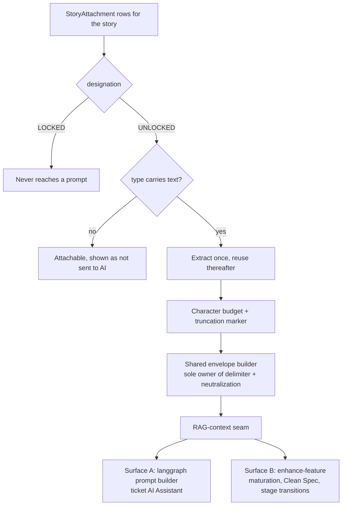
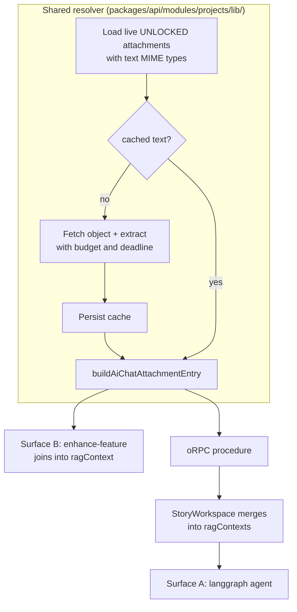

# Context-Only Attachments Reach the AI - Plan

## Goal Capsule

- **Objective:** Make text-bearing attachments marked context-only actually reach the model on the two surfaces that compose ticket prompts, without opening a second un-neutralized path to the LLM.
- **Product authority:** This document. It supersedes the originating narrative wherever they conflict, and records what it supersedes below.
- **Product Contract preservation:** Unchanged. Planning added no requirements and altered no R-IDs.
- **Execution profile:** U1 changes a live model that carries an explicit isolation invariant; the invariant's wording is updated in the same unit that breaks it. U5 edits a prompt clause both surfaces append verbatim — it gets a snapshot lock before it changes. U7 writes tests for behaviors that are currently true only by absence.
- **Open blockers:** None. One question needs a stakeholder answer but does not block implementation — see Outstanding Questions.
- **Stop conditions:** Stop and ask if narrowing the dedicated-attachment clause changes how the model treats protected attachments in practice, or if the stateless-agent boundary turns out to block the Surface A procedure.
- **Tail ownership:** One PR. Changeset bumps `fabric-app` only.

---

## Product Contract

### Summary

Attachments already carry a context-only marker. This work makes that marker mean something to the AI: text-bearing files marked context-only get their text extracted once, cached, and injected inline into both prompt-composition surfaces through the RAG-context seam that already exists, using the shared envelope builder that owns neutralization.

### Problem Frame

The originating narrative asked for a new `context_only` boolean, a toggle, a visual treatment, sync filtering, and export filtering. The repository already has almost all of it, under a name the narrative did not use.

`StoryAttachment.designation` is an enum of `LOCKED` and `UNLOCKED`, and the codebase already defines `UNLOCKED` as "context-only, discardable". The toggle ships in the create-story dialog as a "Context only" / "Asset (protected)" select. The post-upload toggle ships as a lock/unlock button backed by a dedicated procedure, so the flag is already editable without re-uploading. The visual distinction ships as an icon with an accessible name, so it already clears the not-color-alone bar. The count badge already counts every attachment without filtering on designation. Nothing syncs attachments to Jira, ADO, or GitLab, and nothing exports them — those requirements are satisfied by absence, not by a filter anyone wrote.

What does not exist is the one thing the feature is actually for. Attachment content has never reached a prompt. The isolation is structural and deliberate: the schema carries an invariant that the model is never included on a story payload consumed by an agent path, and the shared prompt clause tells the model in plain words that it does not receive attachment files or their contents and must never claim to have analysed one. There is no extraction, chunking, or ingestion pipeline for ticket attachments at all.

So the request is not a flag with a filter hung off it. It is the deliberate reversal of a standing isolation guarantee, narrowed to one designation, on a system whose entire safety posture assumes the guarantee holds.

A second condition shapes the work. `designation` carries two unrelated meanings at once — the removal path treats `LOCKED` as delete protection, while the prompt clause treats `UNLOCKED` as AI-context semantics. A file therefore cannot be both protected from deletion and readable by the AI. That fusion is accepted here rather than fixed, which makes the default on each upload path load-bearing in a way it was not before.

### Key Decisions

**Build on `UNLOCKED` rather than adding a second flag.** The concept, the vocabulary, the toggle, and the post-upload edit already exist under that name. A parallel `contextOnly` boolean would ship a migration and a second toggle that overlaps the first, forcing users to reconcile two affordances that mean nearly the same thing. The cost is that delete protection and AI visibility stay fused on one axis — a file cannot be both protected and readable. Accepted knowingly; splitting the axis is available later and is cheaper after this ships than before.

**Feed text formats only.** TXT, MD, CSV, DOCX, and PDF have extractable text and reuse extractors that already exist. Images, video, archives, spreadsheets, and presentations stay attachable and stay invisible to the model. Vision was considered and cut: it would add per-model capability gating and token cost to every run, and screenshots are better served once the text path is proven.

**Inline injection, not retrieval.** Context-only attachments are injected as inline context rather than chunked into the vector store. This follows the ruling already recorded for chat attachments in `docs/plans/2026-07-21-002-feat-attachment-parity-and-bounds-plan.md` — inline gives completeness, retrieval gives relevance, and retrieval alone means content reaches the model only if embedding finished, the query matched, and the chunk ranked. Embedding is also currently unavailable in the staging environment, so a retrieval-based design could not be verified before release.

**One envelope builder, now five callers.** Attachment text enters the prompt through the same shared builder the chat surfaces use, which is the only place the delimiter is written and the only place a filename or document body is neutralized. A drift test already fails when a surface builds its own envelope. Ticket attachments become the fifth caller rather than the second implementation, because a prompt-injection guard fixed in one copy and missed in another is a silent hole.

**Narrow the prompt clause; do not delete it.** The dedicated-attachment clause currently tells the model it never receives attachment contents. That sentence becomes true of `LOCKED` attachments specifically instead of all of them. The prohibition on inventing contents for files the model did not receive stays, because it now protects a larger set than before: every non-text attachment and every LOCKED one.

**Flip the story-detail panel default to context-only.** The create-story dialog already defaults to context-only on the stated rationale that attachments are mostly reference material; the panel defaults to the opposite. Once designation governs AI visibility, that split means the same file produces opposite outcomes depending on which path uploaded it, and the primary use case runs through the path that hides it. New attachments trade away delete-protection-by-default in exchange, which the create dialog's own rationale already accepted.

**Lock the absent behaviors with tests rather than build filters.** Sync exclusion and export exclusion are true today because no such code path exists. Writing a filter that filters nothing is dead code; writing a test that fails when someone later adds attachments to a sync or export payload preserves the guarantee at the moment it would otherwise break.

### The injection path

### Requirements

**Reaching the model**

- R1. Live attachments marked context-only whose type carries extractable text reach both prompt-composition surfaces.
- R2. A given attachment's text is extracted once and reused on subsequent AI runs.
- R3. Attachment text enters the prompt through the shared envelope builder, so delimiter ownership and neutralization stay in one place.
- R4. The attachment text that reaches the prompt obeys the character budget the chat path already applies.
- R5. When the budget truncates, the text handed to the model carries a marker naming what was omitted.
- R6. Attachments marked as protected assets never reach any prompt.
- R7. Soft-deleted attachments never reach any prompt.

**Prompt guard**

- R8. The dedicated-attachment clause scopes its "you do not receive contents" rule to protected assets rather than to all attachments.
- R9. The clause continues to forbid inventing or describing contents for any attachment the model did not receive.
- R10. Both surfaces continue to append the clause from a single source, verbatim and identical.

**Designation surface**

- R11. Files attached through the story-detail panel default to context-only, matching the create-story dialog.
- R12. A context-only attachment whose type carries no extractable text is shown in the UI as not reaching the AI.
- R13. Changing an attachment's designation takes effect on the next AI run without re-uploading the file.

**Non-regression**

- R14. Extracted attachment text never appears in a payload served to a non-agent read path.
- R15. Attachments stay absent from outbound PM sync payloads, and a test fails if that changes.
- R16. Attachments stay absent from ticket exports, and a test fails if that changes.
- R17. The attachment count badge counts every live attachment regardless of designation.

### Key Flows

- F1. Attach reference material and have the AI use it
  - **Trigger:** User uploads a `.md` prompt file through the story-detail attachment panel.
  - **Steps:** File uploads and defaults to context-only; its text is extracted; the next maturation or Clean Spec run receives the text inline.
  - **Outcome:** The AI's output reflects the file's content with no extra user action.
  - **Covered by:** R1, R2, R11.

- F2. Promote an existing attachment into AI context
  - **Trigger:** User toggles a previously protected attachment to context-only.
  - **Steps:** Designation updates in place; text is extracted on first use if not already cached.
  - **Outcome:** The next AI run receives the file; no re-upload occurred.
  - **Covered by:** R2, R13.

- F3. Attach something the AI cannot read
  - **Trigger:** User marks a `.png` as context-only.
  - **Steps:** The file stays attached; the UI indicates it does not reach the AI; no entry enters the prompt.
  - **Outcome:** The user is not misled into believing the model saw the screenshot.
  - **Covered by:** R12.

### Acceptance Examples

- AE1. Protected assets stay invisible
  - **Covers R6.**
  - **Given** a ticket with one protected `.md` attachment and one context-only `.md` attachment,
  - **When** feature maturation runs,
  - **Then** the prompt contains the context-only file's text and contains nothing from the protected file.

- AE2. Truncation is disclosed, not silent
  - **Covers R4, R5.**
  - **Given** a context-only text attachment whose extracted text exceeds the character budget,
  - **When** an AI run composes the prompt,
  - **Then** the text is cut to the budget and carries a marker naming what was omitted.

- AE3. The clause still guards what the model did not get
  - **Covers R8, R9.**
  - **Given** a ticket whose only attachment is a protected PDF,
  - **When** an AI run composes the prompt,
  - **Then** the clause instructs the model not to claim it read that file, and no PDF text is present.

- AE4. Deleted attachments do not resurface through the AI path
  - **Covers R7.**
  - **Given** a context-only attachment that has been soft-deleted,
  - **When** an AI run composes the prompt,
  - **Then** no text from that attachment appears.

- AE5. Text does not leak into ordinary reads
  - **Covers R14.**
  - **Given** a ticket whose context-only attachment has cached extracted text,
  - **When** the attachment list is fetched for the panel,
  - **Then** the response carries no extracted text.

### Scope Boundaries

- Images through vision extraction. Screenshots and mockups stay invisible to the model; this is the most likely follow-up.
- Video, archives, spreadsheets, and presentations as AI context.
- Splitting delete protection from AI visibility into separate fields, or renaming the designation values.
- Chunking or embedding ticket attachments into the vector store.
- AI classification of which attachments should be context-only.
- Project-level and document-level context-only flags.
- Changing what the count badge counts.

### Dependencies / Assumptions

- The shared envelope builder and its neutralizers are the only sanctioned path to put file-derived text in a prompt, and the existing drift test enforces that.
- The character budget applied to chat attachment text is appropriate for ticket attachment text; no separate budget is assumed.
- The extractors used for DOCX and PDF are usable outside the chat upload path.
- Both prompt-composition surfaces already accept RAG context, so injection reuses an existing seam rather than adding a parameter to either.
- Embedding is unavailable in the staging environment, so acceptance verification there must not depend on it.

### Outstanding Questions

**Resolved during planning**

Cache location, extraction timing, and extraction-failure handling were deferred here by the brainstorm and are now settled — see KTD2, KTD3, and KTD6.

**Resolve before implementation**

- How the UI signals that a context-only attachment is not reaching the AI (R12). The requirement is fixed; the treatment is a design call. U6 ships a text label as the working default, which satisfies R12 without blocking on the design answer.

**Deferred to a follow-up**

- Whether the count badge should distinguish context-only from protected attachments. R17 keeps today's behavior until a stakeholder decides otherwise; no code depends on the answer.

### Sources / Research

- `packages/database/prisma/schema.prisma` — `StoryAttachment`, `StoryAttachmentDesignation`, and the invariant that the model is never included on an agent-consumed story payload.
- `packages/agent-prompts/src/core/locked-attachment-rules.ts` — the clause to narrow, and the header comment recording why it is a no-op today.
- `packages/api/modules/projects/procedures/stories/enhance-feature.ts` — Surface B prompt composition; the parts array already carries RAG context.
- `agents/langchain/project-document-generator/prompts/index.ts` — Surface A prompt composition; already takes RAG contexts.
- `packages/utils/lib/ai-chat-attachment.ts` — the shared envelope builder and neutralizers.
- `apps/web/__tests__/copilot/attachment-surface-drift.test.ts` — the guard that fails when a surface builds its own envelope.
- `docs/attachment-surface-map.md` — what is shared, what is duplicated on purpose, what must never be copied.
- `docs/plans/2026-07-21-002-feat-attachment-parity-and-bounds-plan.md` — the inline-in-addition-to-retrieval ruling and the single-guard principle.
- `apps/web/modules/saas/projects/lib/text-attachment-validation.ts` — the create-dialog default and its recorded rationale.
- `apps/web/modules/saas/projects/components/stories/editor/AttachmentsTab.tsx` — the shipped post-upload toggle and icon treatment.
- `packages/api/modules/projects/procedures/stories/resolve-story-media-for-agent.ts` — the server-side precedent for feeding agent context, and the recorded reason agents cannot reach the database themselves.
- `packages/api/modules/ai/procedures/documents/process-document.ts` — the extract-then-budget sequence this work reuses, including why the budget is supplied at the chat caller and nowhere else.
- `packages/api/modules/ai/lib/ai-chat-attachment-limits.ts` — budget and deadline resolution with operator env overrides.

---

## Planning Contract

### Key Technical Decisions

KTD1. **One resolver, two consumers.** A single module in `packages/api/modules/projects/lib/` turns a story id into ready-made envelope entries. Surface B imports it directly; Surface A reaches it through a thin oRPC procedure. Both surfaces therefore share extraction, budgeting, filtering, and envelope construction — the split is only in how each one is invoked.

KTD2. **Cache the extracted text on the attachment row.** Two nullable columns on `StoryAttachment`. The row is already loaded on the path that needs the text, and `list-attachments` uses an explicit `select`, so the leak risk R14 guards against is bounded by an existing convention rather than a new one. A sibling table was considered and rejected: it makes the leak structurally impossible but costs a join and a model for a field that is written once and read on one path.

KTD3. **Extract lazily on first AI use, not at upload.** Attachments uploaded before this ships have no cached text, so the AI path needs a populate-on-miss branch regardless. Extracting at upload would add a second population site without removing the first, and would pay extraction cost for files that never reach an AI run. One site, one trigger.

KTD4. **Surface A goes through a procedure because the agent is stateless.** `agents/langchain/project-document-generator` deliberately omits `@repo/database`, `@repo/storage`, and `@repo/config` from its package so it cannot bypass tenant boundaries. `resolve-story-media-for-agent.ts` records that an earlier attempt to import a helper into the agent broke its build and crossed that boundary. This work follows the established shape instead: procedure returns entries, web tier merges them into `ragContexts`.

KTD5. **Reuse the chat budget rather than introducing a ticket budget.** `ai-chat-attachment-limits.ts` already resolves a character budget and an extraction deadline with operator env overrides, and the extractor already writes the truncation marker into the text it returns. R4 and R5 are satisfied by passing the same options through, not by new logic.

KTD6. **An unreadable attachment is skipped, not fatal.** Extraction failure, a missing object, or a deadline overrun drops that one file from the entry list and logs it; the AI run proceeds with whatever else resolved. A ticket-level AI operation failing because one reference file could not be parsed is a worse outcome than the model working without it. The user-facing signal for this case rides on R12's treatment.

KTD7. **Narrow the clause behind a snapshot lock.** The dedicated-attachment clause is appended verbatim by both surfaces and has no test of its own. U5 adds a snapshot test first, so the wording change lands as a diff a reviewer accepts rather than as prose drift the model silently absorbs. This mirrors how the envelope reshape was handled in the prior attachment work.

### High-Level Technical Design

The resolver is the only new concentration of logic. Everything downstream of `buildAiChatAttachmentEntry` is existing plumbing: Surface B already threads a `ragContext` string into its prompt parts, and Surface A already accepts `ragContexts` assembled by the web tier.

### Sequencing

U1 and U5 are independent and can land in either order. U2 depends on U1 for the cache columns. U3 and U4 both depend on U2 and are independent of each other. U6 is independent of everything. U7 depends on U2 through U4 existing.

---

## Implementation Units

### U1. Cache columns on the attachment record

- **Goal:** Give extracted text a home and update the isolation invariant the schema records.
- **Requirements:** R2, R14.
- **Dependencies:** None.
- **Files:**
  - Modify: `packages/database/prisma/schema.prisma`
  - Create: `packages/database/prisma/migrations/<timestamp>_add_story_attachment_extracted_text/migration.sql`
- **Approach:** Add two nullable fields to `StoryAttachment` — the extracted text and the timestamp of extraction. Nullable and additive, so rollback is a column drop and existing rows are unaffected. Update the model's doc comment: the invariant currently reads that the model is never included on an agent-consumed payload, which this work makes false. Rewrite it to say what stays true — that protected attachments never reach a prompt, that only the resolver reads the text field, and that list paths must not select it.
- **Patterns to follow:** Migration workflow in `CLAUDE.md` — `prisma migrate dev`, never `db push`. Regenerate the client afterward.
- **Test scenarios:** `Test expectation: none -- schema and migration only; the behavior it enables is covered by U2 and U7.`
- **Verification:** Client regenerates cleanly and the migration applies to a fresh database.

### U2. The shared context resolver

- **Goal:** Turn a story id into envelope entries for its context-only text attachments.
- **Requirements:** R1, R2, R3, R4, R5, R6, R7.
- **Dependencies:** U1.
- **Files:**
  - Create: `packages/utils/lib/story-attachment-ai-context.ts`
  - Create: `packages/utils/lib/__tests__/story-attachment-ai-context.test.ts`
  - Modify: `packages/utils/package.json` — add the `./story-attachment-ai-context` exports entry
  - Create: `packages/api/modules/projects/lib/story-attachment-ai-context.ts`
  - Create: `packages/api/modules/projects/lib/__tests__/story-attachment-ai-context.test.ts`
- **Approach:** Query live attachments for the story — `deletedAt: null`, designation `UNLOCKED` — and narrow to the eligible MIME set. For each attachment with no cached text, fetch the object and run the extractor with the budget and deadline from `ai-chat-attachment-limits.ts`, then persist the result. Build each entry with `buildAiChatAttachmentEntry` from `@repo/utils/ai-chat-attachment`. Never construct the delimiter here. A file that fails to fetch, extract, or finish inside the deadline is dropped from the list and logged (KTD6).
- **Eligible MIME set:** `text/plain`, `text/markdown`, `text/csv`, `application/pdf`, and `.docx`. Derive it rather than typing a sixth literal list — it is `AI_CHAT_TEXT_MIME_TYPES` ∪ `AI_CHAT_BINARY_DOCUMENT_MIME_TYPES`, intersected with the ticket allowlist `DEFAULT_ATTACHMENT_MIME_ALLOWLIST`, minus spreadsheets. The intersection drops `text/html` and `application/json` on its own, because tickets never accepted them. Spreadsheets are the one deliberate subtraction: the chat path extracts `.xlsx` today, so this is a scope narrowing rather than a capability gap, and the exclusion needs a named constant with a comment saying so — otherwise the next reader reasonably assumes it was an oversight and adds it back.
- **Where the set lives:** a new leaf module in `packages/utils/lib/`, not in `attachment.ts`. `ai-chat-attachment.ts` already imports `attachment.ts`, so deriving the set inside `attachment.ts` would close an import cycle. A leaf that imports both is the only home that avoids both the cycle and a duplicated list. It needs its own `exports` entry in the package manifest — `@repo/utils` maps subpaths explicitly and a deep import without one will not resolve. Web and API both consume it from there; U6 renders its inverse.
- **Patterns to follow:** `packages/api/modules/ai/procedures/documents/process-document.ts` for the extract-then-budget sequence and its truncation report; `packages/storage/provider/s3/index.ts` `getObjectStream` for object reads.
- **Test scenarios:**
  - A context-only `.md` attachment yields one entry containing its text.
  - Covers AE1. A protected attachment alongside a context-only one yields exactly one entry, and nothing from the protected file appears.
  - Covers AE4. A soft-deleted context-only attachment yields no entry.
  - A context-only `.png` yields no entry.
  - A context-only `.xlsx` yields no entry, and the exclusion is the named constant rather than an omission.
  - Covers AE2. Text exceeding the budget is truncated and the returned entry carries the omission marker.
  - Second call on an attachment with cached text performs no extraction.
  - First call on an attachment without cached text extracts once and persists the result.
  - Extraction throwing for one attachment drops that entry and still returns entries for the others.
  - An attachment whose object is missing from storage drops that entry rather than throwing.
  - Entries are produced by the shared builder — the module contains no delimiter literal.
  - The eligible set contains exactly the five expected MIME types, and contains no type absent from the ticket allowlist.
- **Verification:** `pnpm --filter @repo/utils test` and `pnpm --filter @repo/api test packages/api/modules/projects/lib/__tests__/story-attachment-ai-context.test.ts` both pass, the module imports the envelope builder rather than composing markup, and the new subpath resolves from both `apps/web` and `packages/api`.

### U3. Surface B — maturation, Clean Spec, stage transitions

- **Goal:** Feed resolver entries into the prompt that `enhanceFeatureWithAI` composes.
- **Requirements:** R1, R3.
- **Dependencies:** U2.
- **Files:**
  - Modify: `packages/api/modules/projects/procedures/stories/enhance-feature.ts`
  - Modify: `packages/api/modules/projects/procedures/stories/__tests__/enhance-feature.test.ts`
- **Approach:** Call the resolver alongside the existing RAG retrieval and join its entries with the retrieved context before the value is handed to `enhanceFeatureWithAI` as `ragContext`. Attachment entries lead so the model reads supplied files before retrieved chunks, matching the ordering the chat path settled on. Preserve the existing behavior when the resolver returns nothing — the parameter stays undefined rather than becoming an empty string.
- **Patterns to follow:** The existing `ragResult` computation and the `parts` array ordering in the same file. `joinRagContextParts` in `packages/temporal/src/workflows/direct-chat.ts` for the join semantics already used elsewhere.
- **Test scenarios:**
  - A story with one context-only text attachment produces a prompt containing that file's text.
  - Covers AE1. A story with only a protected attachment produces a prompt containing none of its content.
  - Attachment text and retrieved RAG context both appear when both exist, attachments first.
  - A story with no attachments produces a prompt byte-identical to today's for the same inputs.
  - Resolver failure does not fail the enhancement run.
- **Verification:** `pnpm --filter @repo/api test packages/api/modules/projects/procedures/stories/__tests__/enhance-feature.test.ts` passes, including the existing clause-ordering assertions.

### U4. Surface A — the ticket AI Assistant

- **Goal:** Deliver the same entries to the langgraph agent without crossing the stateless-agent boundary.
- **Requirements:** R1, R3.
- **Dependencies:** U2.
- **Files:**
  - Create: `packages/api/modules/projects/procedures/stories/resolve-story-attachment-context-for-agent.ts`
  - Create: `packages/api/modules/projects/procedures/stories/__tests__/resolve-story-attachment-context-for-agent.test.ts`
  - Modify: `packages/api/modules/projects/router.ts`
  - Modify: `apps/web/modules/saas/projects/components/stories/StoryWorkspace.tsx`
- **Approach:** A procedure that authorizes the caller, then returns the resolver's entries. Mirror the authorization of `resolve-story-media-for-agent.ts` exactly — project access, the story-belongs-to-project tenant gate, and the explicit org-context check that closes the forged-project-id gap. In the web tier, merge the returned entries into the same `ragContexts` array the media resolver already feeds.
- **Patterns to follow:** `packages/api/modules/projects/procedures/stories/resolve-story-media-for-agent.ts` for procedure shape and the three authorization layers; the existing `ragContexts` merge in `StoryWorkspace.tsx`.
- **Test scenarios:**
  - A member of the project receives entries for a story's context-only text attachments.
  - A caller without project access is rejected.
  - A story id belonging to a different project is rejected.
  - A project id from another organization is rejected under the authenticated org.
  - Covers AE1. Protected attachments produce no entries.
  - A story with no eligible attachments returns an empty list rather than an error.
- **Verification:** `pnpm --filter @repo/api test packages/api/modules/projects/procedures/stories/__tests__/resolve-story-attachment-context-for-agent.test.ts` passes, and the procedure's authorization assertions mirror the media resolver's.

### U5. Narrow the dedicated-attachment clause

- **Goal:** Make the clause true again now that some attachments do reach the model.
- **Requirements:** R8, R9, R10.
- **Dependencies:** None.
- **Files:**
  - Modify: `packages/agent-prompts/src/core/locked-attachment-rules.ts`
  - Create: `packages/agent-prompts/__tests__/locked-attachment-rules.test.ts`
- **Approach:** Write the snapshot lock before touching the wording (KTD7). Then scope the "you do not receive contents" sentence to protected attachments, and keep the prohibition on inventing or describing contents for anything the model did not receive — that prohibition now covers more files than before, not fewer. Update the header comment: the no-op rationale it records is superseded, and leaving it would tell the next reader the opposite of what is true. Rewrite it rather than appending a correction.
- **Execution note:** Snapshot first, then change the wording, so the diff is reviewable.
- **Patterns to follow:** `packages/agent-prompts/__tests__/rag-context-envelope.test.ts` — a snapshot written deliberately as a lock, not a convenience.
- **Test scenarios:**
  - Covers AE3. The clause names protected attachments as the ones whose contents the model never receives.
  - The clause still forbids inventing or describing contents the model did not receive.
  - Snapshot lock on the full clause text.
  - Both surfaces append the identical string — the existing drift assertions still hold.
- **Verification:** `pnpm --filter @repo/agent-prompts test` passes, and `pnpm --filter @repo/api test packages/api/modules/projects/procedures/stories/__tests__/enhance-feature.test.ts` still finds the scope marker and both designation names.

### U6. Panel default and the unsupported-type signal

- **Goal:** Make the primary use case work without a hidden toggle, and stop the UI implying the AI read a file it cannot.
- **Requirements:** R11, R12, R13.
- **Dependencies:** None.
- **Files:**
  - Modify: `apps/web/modules/saas/projects/components/stories/editor/AttachmentsTab.tsx`
  - Modify: `apps/web/modules/saas/projects/lib/attachment-upload-utils.ts`
  - Modify: `apps/web/modules/saas/projects/components/stories/editor/__tests__/AttachmentsTab.dedicated.test.tsx`
  - Modify: `packages/i18n/translations/en.json`
- **Approach:** Pass the context-only designation on the panel's upload call so both upload paths agree. Add a label on rows that are context-only but sit outside the eligible MIME set, stating the AI does not read this file — text, not color, so the not-color-alone bar holds as it already does for the lock icon. Import the set from `@repo/utils/story-attachment-ai-context`; deciding eligibility twice is how the panel and the resolver would drift. R13 needs no work: the existing toggle already updates in place and the resolver reads designation per run.
- **Patterns to follow:** The existing lock/unlock control and its aria-labels in the same component; `DEFAULT_DOC_ATTACHMENT_DESIGNATION` in `apps/web/modules/saas/projects/lib/text-attachment-validation.ts` for the shared default.
- **Test scenarios:**
  - A file uploaded through the panel is created as context-only.
  - Covers F3. A context-only image row renders the not-read label.
  - A context-only `.md` row does not render the label.
  - A protected image row does not render the label.
  - The label is text, readable without color.
  - The existing designation toggle continues to update a row in place.
- **Verification:** `pnpm --filter web test apps/web/modules/saas/projects/components/stories/editor/__tests__/AttachmentsTab.dedicated.test.tsx` passes, and the new copy resolves through i18n rather than a literal.

### U7. Lock the behaviors that are true only by absence

- **Goal:** Turn three accidental guarantees into asserted ones before a future change breaks them silently.
- **Requirements:** R14, R15, R16, R17.
- **Dependencies:** U2, U3, U4.
- **Files:**
  - Create: `packages/api/modules/projects/procedures/stories/attachments/__tests__/attachment-ai-context-boundaries.test.ts`
  - Modify: `packages/api/modules/projects/procedures/stories/attachments/__tests__/list-attachments.test.ts`
- **Approach:** Assert that the attachment list response carries no extracted text, that outbound PM sync payloads contain no attachment content or filenames, and that the count badge query applies no designation filter. These are lock tests, not feature tests — each should fail loudly if someone later adds attachments to a sync payload or widens the list select.
- **Patterns to follow:** `apps/web/__tests__/copilot/attachment-surface-drift.test.ts` — a test that reads the source and fails on drift, rather than only exercising behavior.
- **Test scenarios:**
  - Covers AE5. The attachment list response contains no extracted text field for a story whose attachment has cached text.
  - The list procedure's select does not name the text column.
  - PM sync payload construction for a story with context-only attachments includes no attachment content or filename.
  - The count query filters on live rows only and applies no designation predicate.
  - A story with a mix of designations reports a count equal to all live attachments.
- **Verification:** `pnpm --filter @repo/api test packages/api/modules/projects/procedures/stories/attachments/__tests__/` passes, and each lock test fails when its guard is deliberately removed.

---

## Verification Contract

| Gate | Command | Applies to |
|---|---|---|
| Shared vocabulary tests | `pnpm --filter @repo/utils test` | U2 |
| API unit tests | `pnpm --filter @repo/api test` | U2, U3, U4, U7 |
| Prompt tests | `pnpm --filter @repo/agent-prompts test` | U5 |
| Web unit tests | `pnpm --filter web test` | U6 |
| Prisma client | `pnpm --filter @repo/database generate` | U1 |
| Types | `pnpm type-check` | all |
| Lint | `pnpm lint` | all |

Migration is applied with the repo's documented workflow from `packages/database` — `prisma migrate dev`, never `db push`.

The attachment surface drift guard at `apps/web/__tests__/copilot/attachment-surface-drift.test.ts` must stay green: the resolver is a new consumer of the envelope builder, and the guard is what proves it did not become a second implementation.

Staging verification: attach a `.md` to a ticket, run a Clean Spec refresh, and confirm the output reflects the file's content. Do not verify through any path that depends on embedding — it is unavailable in that environment.

---

## Definition of Done

- Every requirement R1 through R17 is either covered by a passing test or explicitly recorded as unchanged behavior.
- All six verification gates pass.
- The schema comment and the clause header comment describe what is true after this change, with no superseded rationale left standing.
- The resolver is the only new code that produces attachment entries, and it produces them through the shared builder.
- One `.changeset/*.md` bumping `fabric-app` only.
- No dead-end or experimental code from abandoned approaches remains in the diff.
