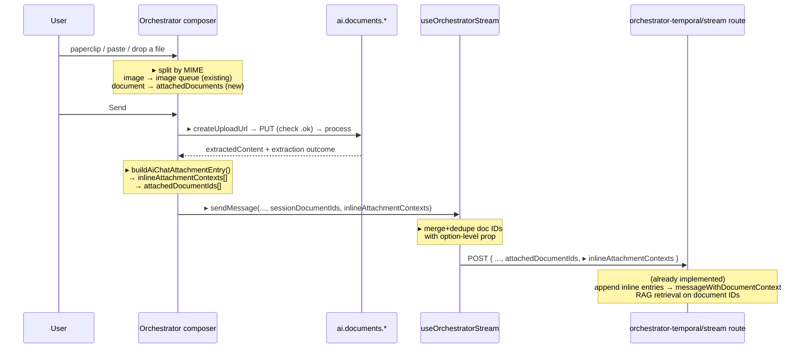

# feat: Add document/Excel attachment to Loom Orchestrator composer

## Summary

Loom's **Orchestrator** mode — the composer a user lands on when they open Loom — has an image-only attachment picker. There is no way to attach an Excel, PDF, or any document. Feature Assistant, Nexus, and Loom **Direct** already accept documents; Orchestrator is the one surface that does not, which is exactly the RAG/orchestrator-backed surface the origin story calls "Loom."

This plan adds a document-attachment path to the Orchestrator composer, mirroring the Loom Direct pattern already in the tree: the shared `@repo/utils/ai-chat-attachment` vocabulary for validation, `buildAiChatAttachmentEntry` for the envelope, `CopilotSidebarAttachments` for chips, and the three-step `createUploadUrl → upload → process` pipeline. Documents are delivered as `inlineAttachmentContexts` + `attachedDocumentIds`, both of which the orchestrator-temporal stream route **already accepts** — the only missing piece is the composer UI and the hook that carries those two fields onto the wire.

The change is client + hook only. No Temporal workflow, schema, or backend-route change.

---

## Problem Frame

The origin story ("Attach Excel files as context in AI assistant") names three surfaces — Feature Assistant, Loom, Nexus — and describes Loom and Nexus as RAG/index-backed. Its acceptance criteria are surface-consistency criteria:

- **AC8** — "GIVEN Loom is open … attach … AI aware" (mode-unqualified; Orchestrator is the default Loom mode).
- **AC12 / FR1 / FR8** — each surface exposes attachment; behavior is consistent across all three.

The parity plan (`docs/plans/2026-07-21-002-feat-attachment-parity-and-bounds-plan.md`, Scope Boundaries) explicitly excluded `FabricTemporalOrchestratorChat` as "a fourth surface … out of scope, recorded so its absence is deliberate." That was a planning-time scoping decision, not a stakeholder-confirmed one, and it excluded the surface the story treats as "Loom." This plan closes that gap.

**Verified current state** (`apps/web/modules/saas/agents/components/FabricChat/FabricTemporalOrchestratorChat.tsx`):

- The single paperclip (`handleAttachClick`, line 1425) opens `imageInputRef` (line 3827), whose `accept` is image-only.
- `handleImageSelect` (line 1429) validates against a hand-rolled `allowedTypes = ["image/png", …]` (line 1437) with a `10 * 1024 * 1024` cap (line 1436).
- Images upload through `POST /api/agents/fabric-ai/upload-image` → `storagePath` (`uploadAttachedImages`, line 1514) and reach the workflow as image URLs — a **multimodal-vision** pipeline, distinct from documents.
- `attachedDocumentIds` exists only as a **prop** (line 212), forwarded into `useOrchestratorStream` as a hook option (line 398 → hook line 351 → request body line 716). It is never collected from the composer.
- The composer's `ChatInput` (line 3486) passes `attachTooltip="Attach images"`, `enableImagePaste`, `imageUploader` — but **not** `onPasteNonImageFiles`.
- `useOrchestratorStream.sendMessage` (hook line 545) carries per-send image params (`attachedImageUrls`, `displayImageUrls`) but has **no** `inlineAttachmentContexts` param, and its POST body (line 697) never sends that field.

**Backend is ready.** `apps/web/app/api/agents/fabric-ai/orchestrator-temporal/stream/route.ts` already destructures `inlineAttachmentContexts` (line 130) and `attachedDocumentIds` (line 129), bounds the inline entries (`MAX_INLINE_ATTACHMENTS = 20`, `MAX_INLINE_ATTACHMENT_CHARS = 200_000`, lines 46–47), appends them to `messageWithDocumentContext` (line 412), and runs RAG retrieval on the document IDs (line 440). Nothing server-side needs to change.

---

## Requirements

| ID | Requirement | Origin |
|----|-------------|--------|
| R1 | A user in Loom Orchestrator can attach a document (Excel/`.xlsx`, PDF, DOCX, CSV, MD, TXT — the shared chat allowlist) via the paperclip and via paste/drop. | AC8, FR1 |
| R2 | Attached documents are delivered to the model as inline extracted-text context (`inlineAttachmentContexts`) and as `attachedDocumentIds` for RAG retrieval — the same two channels Loom Direct and Nexus use. | AC8, FR8 |
| R3 | Document validation (MIME + extension + size cap) derives from the shared `@repo/utils/ai-chat-attachment` vocabulary — no hand-rolled allowlist. The picker's `accept` and the validation gate come from one source. | FR8, `docs/solutions/conventions/accept-and-validation-share-one-vocabulary.md` |
| R4 | The existing image-attach path (multimodal vision) is preserved. Documents are additive, not a replacement. Loom Direct vs Orchestrator remain distinct modes. | CONCEPTS.md "Loom" |
| R5 | The attachment envelope is built by the shared `buildAiChatAttachmentEntry` (carries the filename/body neutralizer) — the surface never assembles the delimiter itself. | Security invariant, drift guard |
| R6 | Per-file status + extraction outcome is visible in the composer via the shared `CopilotSidebarAttachments` chip row (a truncated/empty/unreadable read is surfaced, not silent). | AC12, parity with Nexus/Direct |
| R7 | The attachment-surface drift guard and the surface map recognize Loom Orchestrator as a fourth shared-vocabulary surface. | R11/R12 of the parity plan (drift guard) |

**Product Contract preservation:** No upstream requirements-only unified plan exists for this work; the Requirements above are derived from the origin story's acceptance criteria and verified code state (`product_contract_source: ce-plan-bootstrap`).

---

## Assumptions

These are inferred bets made without a blocking stakeholder confirmation (headless/pipeline run). Each is the low-risk default; flag at review if any is wrong.

- **A1 — One combined paperclip, split by MIME.** The paperclip opens a single picker whose `accept` covers images **and** documents; on selection each file is routed by type (image → the existing multimodal image queue; everything else → the new document queue). This matches Loom Direct's single-affordance model and avoids a second visible button. The alternative (two separate buttons) is rejected as more cluttered and inconsistent.
- **A2 — Image size cap rises from 10 MB to the shared 25 MB.** Folding the Orchestrator into the drift guard requires dropping the image path's `10 * 1024 * 1024` literal in favor of `DEFAULT_AI_CHAT_MAX_FILE_BYTES` (25 MB). Loom Direct and Nexus already cap pasted images at 25 MB, so this is consistency, not regression.
- **A3 — Extraction budget stays server-owned.** As in Loom Direct, no client-side text budget is applied after `process`; `ai.documents.process` already bounds what it returns.
- **A4 — The 25 MB upload cap and legacy `.xls` exclusion are settled** (confirmed in the prior shipped work: `DEFAULT_AI_CHAT_MAX_FILE_BYTES = 25 MB`; exceljs reads OOXML/CSV, not BIFF). Not re-litigated here.

---

## Key Technical Decisions

### KTD1 — Mirror Loom Direct's document pipeline, not Nexus's

Loom Direct (`FabricDirectChat.tsx`) is the closer analogue: same shared `ChatInput`, same `useOrchestratorStream`-family flow, same three-step upload at send-time. Nexus (`CopilotPage.tsx`) carries an extra per-file status-chip state machine (`nexusAttachmentsNeedAttention`) tuned to its during-send upload. The Orchestrator will follow Direct's structure: an `attachedDocuments` state array of the same `AttachedFile` shape (`{ id, file, name, type, size, documentId, status, contextEntry?, extraction?, chatId? }`), a `uploadDocuments` function copying Direct's `uploadAttachments` (including the **`uploadResponse.ok` check** on the presigned PUT — the guard Direct added because a 403/500 resolves normally and would otherwise report success on a file that never stored), and a send-time collect-then-clear.

### KTD2 — Thread documents as per-send `sendMessage` params, mirroring images

`useOrchestratorStream` already carries images as **per-send** params (`attachedImageUrls`, `displayImageUrls`), while `attachedDocumentIds` is a **hook option** sourced from the pre-attached prop. Composer-collected documents are per-send data, so `sendMessage` gains two new trailing params: freshly-uploaded document IDs and `inlineAttachmentContexts`. In the POST body, the freshly-uploaded IDs are **merged and de-duplicated** with the option-level `attachedDocumentIds` (so pre-attached project/workspace context docs are not clobbered), and `inlineAttachmentContexts` is added as a new body field the route already reads. Because the hook option and the per-send value share the name `attachedDocumentIds`, the per-send param takes a distinct identifier (e.g., `sessionDocumentIds`) to avoid shadowing.

### KTD3 — Migrate the image validation to shared helpers as part of joining the drift guard

The drift guard (`apps/web/__tests__/copilot/attachment-surface-drift.test.ts`) applies every assertion to each surface in its `SURFACES` map, including "no `allowedTypes = [`" and "no `10 * 1024 * 1024`." The Orchestrator's image path violates both today. Rather than exempt the surface, the image validation is migrated to the shared `isClientRenderableAiChatImage(file.type)` predicate and `DEFAULT_AI_CHAT_MAX_FILE_BYTES`. This is the intent of the "one vocabulary" convention (`docs/solutions/conventions/accept-and-validation-share-one-vocabulary.md`) and makes the whole surface — images and documents — pass the guard. Consequence: A2 (image cap 10 → 25 MB).

### KTD4 — Documents render as chips; images keep their thumbnail strip

The Orchestrator renders image previews as a bespoke thumbnail strip inside `ChatInput`'s `topSlot`. Documents render through the shared `CopilotSidebarAttachments` chip row (extraction notices, per-file remove) in the same `topSlot`, stacked with the image strip. Two visual treatments because the two pipelines mean different things (a rendered image thumbnail vs. a document with an extraction outcome) — this matches Direct/Nexus, which use `CopilotSidebarAttachments` for documents.

---

## High-Level Technical Design

Send-time flow once documents are attached (new/changed elements marked ▸):

*Directional — the route half already exists; the composer and hook halves are the work.*

---

## Implementation Units

### U1. Document-attachment state + upload pipeline in the Orchestrator composer

**Goal:** Add a document queue and its send-time three-step upload, independent of the paperclip wiring (U2) so it can be built and reasoned about on its own.

**Requirements:** R1, R2, R5, KTD1

**Dependencies:** none

**Files:**
- `apps/web/modules/saas/agents/components/FabricChat/FabricTemporalOrchestratorChat.tsx`

**Approach:**
- Add an `attachedDocuments` state array using the same `AttachedFile` shape Loom Direct uses (`id`, `file`, `name`, `type`, `size`, `documentId`, `status`, and the settle-time fields `contextEntry`, `extraction`, `chatId`). Add a `documentInputRef`.
- Add `uploadDocuments` mirroring Direct's `uploadAttachments` (`FabricDirectChat.tsx` lines 1556–1728): `ai.documents.createUploadUrl` → presigned PUT **with the `uploadResponse.ok` throw** (or `useServerUpload` → `ai.documents.upload`) → `ai.documents.process` → `buildAiChatAttachmentEntry(name, extractedContent)`. Accumulate `{ documentIds, inlineContexts, chatId }`. Reuse the document chat-id thread (`currentDocumentChatId`) so follow-ups keep RAG scope — check whether the Orchestrator already tracks a document chat id; if not, add the minimal state to hold the `createUploadUrl`-returned `chatId`.
- Add `removeDocument(fileId)`.
- Do **not** apply a client-side text budget after `process` (A3).

**Patterns to follow:** `FabricDirectChat.tsx` `uploadAttachments` (lines 1556–1728), including the comment rationale for the `.ok` check and the "no second budget" note.

**Test scenarios:** deferred to U4 (source-level parity assertions) and the behavioral verification below — this unit is state + an async pipeline inside a large client component; its behavior is exercised by U4's parity test and browser verification rather than an isolated unit test.
`Test expectation: none in this unit — validated via U4 parity assertions and browser verification.`

### U2. Split the paperclip + paste into images vs documents; migrate image validation to shared vocab

**Goal:** One paperclip and the paste/drop path admit both images and documents, routing each by type, with all validation reading the shared vocabulary.

**Requirements:** R1, R3, R4, KTD1, KTD3

**Dependencies:** U1

**Files:**
- `apps/web/modules/saas/agents/components/FabricChat/FabricTemporalOrchestratorChat.tsx`

**Approach:**
- Replace `handleImageSelect` with a combined `handleFileSelect` that iterates the picked files and routes each: `isClientRenderableAiChatImage(file.type)` → the existing image enqueue (preview URL, image queue); otherwise validate against `DEFAULT_AI_CHAT_MIME_ALLOWLIST` + `AI_CHAT_SERVER_ALLOWED_EXTENSIONS` and enqueue into `attachedDocuments` (U1). Size cap for both branches = `DEFAULT_AI_CHAT_MAX_FILE_BYTES`. Remove the hand-rolled `allowedTypes` array and the `10 * 1024 * 1024` literal (KTD3, A2).
- Change the file input's `accept` from the image-only string to `buildAiChatAcceptAttribute(...)` over the full shared set (images + documents) — define a module-level `LOOM_ORCHESTRATOR_FILE_ACCEPT` constant as Direct defines `LOOM_FILE_ACCEPT`.
- Change `attachTooltip="Attach images"` → `"Attach files"`.
- Pass `onPasteNonImageFiles={...}` to `ChatInput`: a handler that validates via the same shared gate and enqueues into `attachedDocuments` (the image half of paste is already handled by `imageUploader`/`enableImagePaste`).
- Render `CopilotSidebarAttachments` (files = `attachedDocuments`, `onRemove = removeDocument`) in `topSlot`, alongside the existing image thumbnail strip (KTD4).

**Patterns to follow:** `FabricDirectChat.tsx` `handleFileSelect` (1414), `onPasteNonImageFiles` (1516), `LOOM_FILE_ACCEPT` (235), and its `CopilotSidebarAttachments` usage (3458). Image-subset predicate: `isClientRenderableAiChatImage` in `packages/utils/lib/ai-chat-attachment.ts`.

**Test scenarios:**
- `Covers FR8.` The composer source contains no `allowedTypes = [` and no `10 * 1024 * 1024` (asserted in U4 via the drift guard).
- The document gate references `DEFAULT_AI_CHAT_MIME_ALLOWLIST` and `AI_CHAT_SERVER_ALLOWED_EXTENSIONS` (U4).
- A `.xlsx` picked through the paperclip is enqueued as a document, not rejected (browser verification).
- A `.png` picked through the paperclip still enqueues as an image with a preview (browser verification — image path preserved, R4).
- A pasted `.pdf` lands in the document queue via `onPasteNonImageFiles` (browser verification).

### U3. Thread documents through the send path and the hook to the route

**Goal:** Uploaded documents reach the orchestrator-temporal route as `inlineAttachmentContexts` + merged `attachedDocumentIds`.

**Requirements:** R2, KTD2

**Dependencies:** U1, U2

**Files:**
- `apps/web/modules/saas/agents/components/FabricChat/FabricTemporalOrchestratorChat.tsx`
- `apps/web/modules/saas/agents/hooks/useOrchestratorStream.ts`

**Approach:**
- In `handleSendMessage` (composer line 1591): before the `sendMessage(...)` call, if `attachedDocuments` has pending items, `await uploadDocuments()`; collect `attachedDocumentIds` + `inlineAttachmentContexts` (falling back to already-`ready` documents' `documentId`/`contextEntry` on re-send, as Direct does at lines 1789–1801). Capture document filenames for the message bubble caption if the Orchestrator renders one. Clear `attachedDocuments` after collecting. Pass the two new values as trailing args to `sendMessage`.
- In `useOrchestratorStream.sendMessage` (hook line 545): add two trailing params — `sessionDocumentIds?: string[]` and `inlineAttachmentContexts?: string[]`. In the POST body (line 697): set `attachedDocumentIds` to the de-duplicated union of the option-level `attachedDocumentIds` and `sessionDocumentIds` (KTD2 — do not clobber pre-attached prop docs); add `inlineAttachmentContexts` (omit/undefined when empty).
- Confirm the follow-up path (`sendFollowUp`) either carries documents equivalently or that documents are intended only on new-execution sends; match Direct's behavior and note any intentional gap.

**Patterns to follow:** `FabricDirectChat.tsx` `sendMessage` collect-and-pass (lines 1770–1857); the hook's existing per-send image params (`attachedImageUrls`) and its body construction (lines 697–726).

**Test scenarios:**
- `Covers AC8 / FR8.` With one ready document, the POST body carries a non-empty `inlineAttachmentContexts` and an `attachedDocumentIds` containing the uploaded id (browser/network verification; drift-guard/source assertion that the hook body includes `inlineAttachmentContexts`).
- Pre-attached prop `attachedDocumentIds` plus a composer-uploaded document produce a **merged, de-duplicated** id list — neither is dropped.
- No documents attached → body shape unchanged (`inlineAttachmentContexts` absent/undefined), image-only and text-only sends behave exactly as before (regression).

### U4. Extend the drift guard and add a Loom Orchestrator parity test

**Goal:** CI recognizes Loom Orchestrator as a shared-vocabulary attachment surface and pins the dual-pipeline split.

**Requirements:** R3, R5, R6, R7

**Dependencies:** U1, U2, U3

**Files:**
- `apps/web/__tests__/copilot/attachment-surface-drift.test.ts`
- `apps/web/__tests__/copilot/loom-orchestrator-attachment-parity.test.tsx` (new)

**Approach:**
- Add `"Loom Orchestrator": <FabricTemporalOrchestratorChat path>` to the `SURFACES` map (drift guard lines 25–35). This applies all envelope + vocabulary assertions to the surface: `buildAiChatAttachmentEntry` present, no `<fabric_attachment>` literal, no hand-rolled `[Uploaded Document: ${`, `DEFAULT_AI_CHAT_MAX_FILE_BYTES` present, no `10 * 1024 * 1024`, no `application/vnd.ms-excel`, no `allowedTypes = [`. (All satisfied by U1–U3; this is the guard that keeps them satisfied.)
- Add Loom Orchestrator to the client-validation `it.each` list (lines 131–152) so it must reference `DEFAULT_AI_CHAT_MIME_ALLOWLIST` + `AI_CHAT_SERVER_ALLOWED_EXTENSIONS`.
- New parity test modeled on `nexus-attachment-parity.test.tsx` (source-assertion style), pinning the Orchestrator-specific behaviors the drift guard does **not** cover: the image queue and the document queue are distinct (multimodal vs RAG), documents render through `CopilotSidebarAttachments`, and the image path uses `isClientRenderableAiChatImage` rather than a literal type list.

**Patterns to follow:** `attachment-surface-drift.test.ts` structure; `nexus-attachment-parity.test.tsx` source-read style.

**Test scenarios (this unit IS the test):**
- `Covers FR8.` Drift guard fails if the Orchestrator source reintroduces a hand-rolled allowlist, an inline envelope delimiter, or a per-surface size literal.
- Parity test asserts the dual-pipeline split (image queue preserved, document queue added) and shared-chip rendering.
- The surface-map assertion "names every surface" passes only after U5 adds "Loom Orchestrator" to the map — this cross-unit dependency is called out so U5 is not skipped.

### U5. Reconcile docs and add the changeset

**Goal:** The two docs that currently assert "Orchestrator accepts images only" are corrected, and the change ships a changelog entry.

**Requirements:** R4, R7

**Dependencies:** U1–U4

**Files:**
- `CONCEPTS.md` (the "Loom" entry, line 26)
- `docs/attachment-surface-map.md` (add Loom Orchestrator as a fourth shared-vocabulary surface + its wiring row; the current entry at line 26 records it as a deliberately-excluded fourth surface)
- `.changeset/<name>.md` (new)

**Approach:**
- CONCEPTS.md "Loom": change "Orchestrator accepts images only" to reflect that Orchestrator now accepts documents (images via the multimodal pipeline, documents via RAG/inline) — while preserving the Direct-vs-Orchestrator distinction (they are still different modes; the point that one must name the mode when reasoning about attachments stands).
- `docs/attachment-surface-map.md`: move Loom Orchestrator from "deliberately excluded fourth surface" into the shared-vocabulary surface table; add its wiring row (`inlineAttachmentContexts` + `attachedDocumentIds` → `/api/agents/fabric-ai/orchestrator-temporal/stream`), mirroring the Nexus row at line 122. Add the literal string "Loom Orchestrator" so the drift guard's "names every surface" assertion (U4) passes.
- Changeset: `"fabric-app": patch` only. Headline (line 1, ≤150 chars): *Loom Orchestrator can now attach documents and Excel files as AI context, matching Direct and Nexus.* Internal context below the blank line: the AC8/AC12/FR8 gap, the route-already-ready fact, the image-cap 10→25 MB consequence.

**Test scenarios:**
- `Covers R7.` The surface-map + CONCEPTS edits make U4's "names every surface" and the human-readable concept honest.
- `Test expectation: none — docs + changeset (no behavioral code).`

---

## Scope Boundaries

**In scope:** The Orchestrator composer (`FabricTemporalOrchestratorChat.tsx`) document-attachment UI, the two-field wiring in `useOrchestratorStream.ts`, the drift-guard/parity tests, and the doc/changeset reconciliation.

**Out of scope (not this plan):**
- Feature Assistant, Nexus, Loom Direct — already shipped; touched only to reuse shared helpers, never modified.
- The orchestrator-temporal stream route and any Temporal workflow/activity — already accept the fields; no change.
- Any change to the shared `@repo/utils/ai-chat-attachment` vocabulary or `buildAiChatAttachmentEntry`.

### Deferred to Follow-Up Work
- **Research mode** attachment support (Loom's third mode) — not part of the story's Loom/Nexus RAG framing; separate decision.
- The still-open items from the original narrative tracked elsewhere (90-day hidden-then-purge retention for chat documents; unbounded text-format budget) — owned by the follow-ups brainstorm, not this surface parity work.

---

## System-Wide Impact

- **Users:** Loom Orchestrator users gain document/Excel attachment — the surface most users reach first. Existing image attachers see the cap rise 10 → 25 MB (A2).
- **Wire contract:** `useOrchestratorStream` begins sending `inlineAttachmentContexts` (a field the route already reads and bounds). No new route, no versioning concern.
- **CI:** the attachment-surface drift guard now covers four surfaces; a regression on any is caught at source level.

---

## Risks & Mitigations

| Risk | Mitigation |
|------|-----------|
| Composer-collected doc IDs clobber the pre-attached prop `attachedDocumentIds` (project/workspace context). | KTD2 — merge + de-dupe, never assign. U3 test scenario pins it. |
| Presigned PUT reports success on a 403/500 (the bug Direct already fixed). | U1 copies Direct's `uploadResponse.ok` throw verbatim, with the rationale comment. |
| Adding the surface to the drift guard fails CI on the pre-existing image `allowedTypes`/`10 MB` literals. | KTD3 — the image path is migrated to shared helpers in U2 as part of the same change; U4 is sequenced after U1–U3. |
| Image cap change (10 → 25 MB) is an unintended behavior change. | Documented as A2; matches Direct/Nexus, which already cap at 25 MB. Surface at review if a smaller image cap is a deliberate product constraint. |
| The `sendMessage` param name `attachedDocumentIds` collides with the hook option. | KTD2 — per-send param takes a distinct identifier (`sessionDocumentIds`). |

---

## Verification Contract

- `pnpm --filter web test __tests__/copilot/attachment-surface-drift.test.ts` — passes with four surfaces.
- `pnpm --filter web test __tests__/copilot/loom-orchestrator-attachment-parity.test.ts` (new) — passes.
- `pnpm type-check`, `pnpm lint`, `pnpm format` — clean.
- Browser (staging, Example Organization org): open Loom (Orchestrator mode), attach a `.xlsx` via the paperclip → chip appears with extraction notice → send → the model's context includes the spreadsheet's inline text (verify via network body carrying `inlineAttachmentContexts`, and/or the assistant referencing the file's contents). Repeat for paste of a `.pdf`. Confirm a `.png` still attaches as an image with a thumbnail.

## Definition of Done

- A user in Loom Orchestrator can attach Excel/document files via paperclip and paste, sees per-file chips with extraction outcomes, and the model receives the content (R1, R2, R6).
- All validation flows through the shared vocabulary; the drift guard covers Loom Orchestrator and is green (R3, R5, R7).
- The image path is preserved and its validation reads shared helpers (R4).
- CONCEPTS.md and the surface map no longer claim Orchestrator is image-only; a `fabric-app` patch changeset is present (R4, R7).
- `type-check`, `lint`, `format`, and the two named tests pass.

---

## Sources & Research

- Origin story: "Attach Excel files as context in AI assistant" (AC8, AC12, FR1, FR8).
- `docs/plans/2026-07-16-001-feat-excel-chat-attachments-plan.md`, `docs/plans/2026-07-21-002-feat-attachment-parity-and-bounds-plan.md` (the parity plan's Orchestrator exclusion).
- `docs/solutions/conventions/accept-and-validation-share-one-vocabulary.md` (the accept-vs-validate convention).
- `docs/attachment-surface-map.md` (the duplication map + drift-guard contract).
- Reference implementations: `FabricDirectChat.tsx` (document pipeline), `CopilotPage.tsx` (Nexus), `packages/utils/lib/ai-chat-attachment.ts` (shared vocabulary), `apps/web/app/api/agents/fabric-ai/orchestrator-temporal/stream/route.ts` (route, already accepts the fields).
