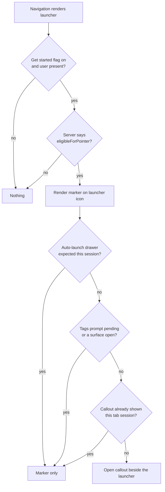
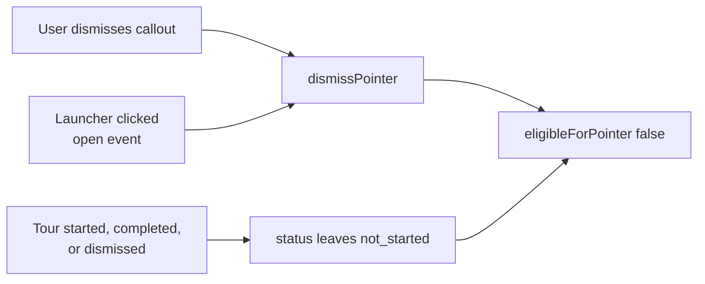

# Get Started Pointer - Plan

## Goal Capsule

- **Objective:** Make the "Get started" tour discoverable for users who have never engaged with it, by marking its existing sidebar launcher instead of leaving it visually indistinguishable from the other utility icons.
- **Product authority:** Fizzy card #2103. Product decisions on audience and prominence were resolved in brainstorm; PO sign-off is not blocking implementation.
- **Product Contract preservation:** unchanged. Planning added no requirements and altered no R-IDs.
- **Open blockers:** None. The card listed two blocking gaps — the definition of "new user" and the absence of a tour-engagement mechanism — and both are answered by state that already exists (see Key Decisions).
- **Stop conditions:** Stop and ask if implementation requires a Prisma migration, a change to the auto-launch cohort date, or a change to when the first-login drawer fires. Each would mean a product decision this plan did not make.

---

## Product Contract

### Summary

Mark the existing "Get started" launcher for any user whose onboarding tour state is still `not_started`: a callout anchored to the launcher on first arrival, then a quiet static marker on the icon that persists until the user engages or dismisses it. Suppression is permanent and per-user.

### Problem Frame

Fabric already ships a full onboarding experience — a contextual drawer, a guided spotlight tour, and per-page detailed tours — reachable from a compass icon in the sidebar's account-utilities group. The icon carries no signal that anything is behind it. It sits below a divider alongside settings, admin, and logout, and in the collapsed rail it is one unlabeled glyph among several.

Two populations never get a signal at all. Accounts created before 2026-07-08 are deliberately excluded from the one-shot first-login drawer, on the reasoning that existing users should not be interrupted by a feature that shipped after they joined; they were expected to find the persistent entry point on their own. And within the newer cohort, a user who closes the auto-opened drawer without starting the tour gets no second prompt — the drawer's one-shot flag has already fired.

Both populations sit at `not_started` indefinitely. The cost is not a broken flow but an unclaimed one: the onboarding content exists, is maintained, is CI-guarded against drift, and goes unseen.

### Key Decisions

- **"New user" means `not_started`, not a signup date.** The card flagged the missing definition of "new user" as a blocking gap. Per-user tour state already persists a `status` that leaves `not_started` only when the user starts, completes, or dismisses the tour, which makes it a precise and already-testable definition of "has not engaged." No new date threshold, cohort, or account-age heuristic is introduced.

- **Everyone eligible, not only the recent cohort.** Restricting the pointer to accounts created after the auto-launch date would target exactly the population that already receives the first-login drawer, so the feature would add nothing. The pre-date population is the one with no signal, and it is the larger one.

- **Prominent once, quiet thereafter.** A callout that reappears every session becomes noise and invites a reflexive dismissal that suppresses the affordance for good. A marker that never announces itself repeats the problem being solved. The pointer is therefore two layers: an announcement bounded to one appearance per tab session, and a low-noise residue that carries the affordance between appearances.

- **No looping animation.** The repo's design principles hold that motion orients and then stops, and name indefinitely-looping decoration as an anti-pattern. A pulsing dot would be the conventional choice here and is rejected on that basis; the marker is static.

- **The pointer yields to every other onboarding surface.** Onboarding already owns four interruption surfaces. Adding a fifth that competes for the same first-render moment would stack three prompts on a brand-new account's first login. The callout only appears when nothing else is on screen, and never in the same session as the first-login drawer — so for a brand-new account the pointer is a second-session affordance by design.

### Requirements

**Targeting**

- R1. A user is eligible for the pointer when their onboarding tour status is `not_started` and they have not dismissed the pointer. Account creation date does not affect eligibility.
- R2. The existing launcher is unchanged — same icon, label, position, and click behavior.
- R3. The pointer appears wherever the launcher appears: expanded sidebar, collapsed icon rail, and mobile navigation sheet.

**Prominence**

- R4. An eligible user sees a callout anchored to the launcher at most once per browser tab session.
- R5. A quiet marker on the launcher persists for as long as the user remains eligible, including sessions where the callout does not fire.
- R6. The callout appears only when no other onboarding surface is on screen, and never in the same session as the first-login drawer.
- R7. The pointer never covers another navigation item and never blocks interaction with the launcher it points at.

**Suppression**

- R8. Starting, completing, or dismissing the tour ends eligibility.
- R9. Opening the "Get started" drawer from the launcher ends eligibility, whether or not the user then starts the tour.
- R10. Explicitly dismissing the pointer ends eligibility permanently.
- R11. Suppression persists per user on the server, so it holds across sessions, browsers, and devices.

**Presentation and accessibility**

- R12. The marker carries no looping animation. Any entrance motion respects the reduced-motion preference.
- R13. The callout is dismissible by keyboard and reachable by screen reader. The marker does not introduce a separate focus stop; its meaning reaches assistive technology through the launcher's accessible name.
- R14. All color comes from design tokens.
- R15. The pointer is gated by the same feature flag as the rest of the Get started experience.

### Key Flows

- F1. Long-standing account discovers the tour
  - **Trigger:** A user whose account predates the auto-launch date loads the app for the first time after this ships.
  - **Steps:** The callout appears anchored to the launcher. The user either takes the tour, dismisses the callout, or ignores it and navigates away.
  - **Outcome:** Taking the tour or dismissing ends eligibility. Ignoring leaves the marker in place; the callout does not fire again until the next tab session.
  - **Covered by:** R1, R4, R5, R8, R10

- F2. Brand-new account's first days
  - **Trigger:** A newly created account logs in for the first time.
  - **Steps:** The first-login drawer auto-opens as it does today. The callout is suppressed for that session. The user closes the drawer without starting the tour. On a later session the callout appears.
  - **Outcome:** The new-account experience is unchanged on day one, and the user who walked away from the drawer gets a second, quieter invitation.
  - **Covered by:** R4, R6

### Acceptance Examples

- AE1. **Covers R1, R4.** Given an account created in 2026-03 that has never opened the tour, when the user loads the app, then the callout appears anchored to the launcher.
- AE2. **Covers R4, R5.** Given that user closed the callout without dismissing the pointer, when they return in a new tab session, then the marker is present and the callout appears again.
- AE3. **Covers R6.** Given a newly created account on its first login, when the first-login drawer auto-opens, then no callout appears during that session even after the drawer is closed.
- AE4. **Covers R9.** Given an eligible user, when they open the drawer from the launcher, then both the callout and the marker are gone and do not return, whether or not they start the tour.
- AE5. **Covers R10, R11.** Given a user who explicitly dismissed the pointer, when they sign in from a different browser, then neither the callout nor the marker appears.
- AE6. **Covers R8.** Given a user who completed the tour, when they load the app, then no pointer of either kind appears.
- AE7. **Covers R3, R7.** Given an eligible user with the sidebar collapsed to the icon rail, when the callout appears, then it is anchored to the launcher icon and does not overlap the adjacent utility icons.

### Scope Boundaries

- The tour content, the drawer, and the per-page tours are untouched.
- The 2026-07-08 auto-launch cohort date and the first-login drawer behavior are unchanged.
- Users who started the tour and abandoned it partway (`in_progress`) are not re-prompted. Re-engaging a partial tour is a different problem with a different answer.
- No telemetry on pointer engagement. The card's benefit hypothesis — that discoverability lifts tour starts — stays unmeasured in this iteration.
- No pointer-specific feature flag. The card's rollback note asked for one; the existing Get started flag is the disable path, which means disabling the pointer alone is not possible without also disabling the tour.
- No changes to where the launcher lives in the navigation.

### Dependencies / Assumptions

- Per-user onboarding tour state persists in an untyped JSON column with a validating normalizer, so a new suppression field needs no database migration.
- The launcher already carries the onboarding anchor attribute the tour system uses to position spotlights, so the pointer has an anchor without touching the navigation component's markup.
- The card lists a design spec from the design owner as a dependency. Implementation proceeds on the repo's existing design tokens and the established callout pattern rather than blocking; a later spec would change presentation, not behavior.
- The sidebar already renders count badges on the notification bell and the incident indicator, in both the expanded sidebar and the collapsed rail. The marker has a working visual precedent inside the same component, so its geometry is not an open design problem.
- The launcher is present for authenticated users in personal context on staging. Whether it renders for guest accounts and inside organization context was not checked; a user for whom the launcher is hidden must not receive a pointer with no target.

### Outstanding Questions

**Deferred to implementation**

- Whether the launcher renders for guest accounts and in organization context, so the pointer never points at a target that is not there. Resolvable by reading the navigation component's gating during U6.

---

## Planning Contract

### Key Technical Decisions

- KTD1. **Do not reuse `GetStartedSpotlight` for the callout.** The spotlight renders `aria-modal="true"` with a full-screen scrim (a `box-shadow` spread of `0 0 0 9999px`) and traps focus. Reusing it would make the pointer a modal interruption, contradicting R6 and the "prominent once, quiet thereafter" decision. The callout is a separate non-modal popover built on the existing `apps/web/modules/ui/components/popover.tsx` primitive.

- KTD2. **The pointer renders inside the navigation, not from the onboarding controller.** The controller and the navigation are siblings under `apps/web/modules/saas/shared/components/AppWrapper.tsx`, so no React context can span them. Rendering the marker and the popover anchor next to the launcher item means the pointer inherits the launcher's position in all three chrome states for free (R3), with no rect measurement and no scroll or resize listeners.

- KTD3. **Eligibility is computed server-side, next to the existing eligibility flags.** `getOnboardingTourState` already returns `eligibleForAutoLaunch`, `autoLaunchCohort`, and `eligibleForFunctionTagsPrompt`. Adding `eligibleForPointer` alongside them keeps the rule in one unit-testable place and out of the component, and matches how every other onboarding gate in this system is expressed.

- KTD4. **Suppression is one new boolean on the existing JSON state, not a new column.** `User.onboardingTourState` is a `Json?` column normalized on every read, so adding `pointerDismissed` needs no Prisma migration. This mirrors `functionTagsPromptOptOut`, which is the same shape of per-prompt permanent opt-out. Note that `packages/api/modules/users/procedures/onboarding/schema.ts` carries a compile-time `Equal<>` assertion between the Zod schema and the database type — the field and its action must land in both places in the same change or `type-check` fails.

- KTD5. **Launcher-click suppression rides the existing open event, not a new callback.** The navigation dispatches `GET_STARTED_OPEN_EVENT` when the launcher is clicked, while the controller's first-login auto-launch calls its open handler directly without dispatching. Listening for that event therefore suppresses the pointer on a deliberate launcher click (R9) while leaving the auto-opened drawer non-suppressing — which is what F2 requires.

- KTD6. **The controller broadcasts surface open/close so R6 is exact rather than approximate.** A fourth window event carrying whether any onboarding surface is showing lets the pointer hide while the drawer, tour, page tour, or tags prompt is up. The alternative — inferring it from server eligibility flags — leaves an auto-opened page tour able to overlap the callout. The onboarding module already coordinates across components with three window events, so this follows the established pattern rather than introducing one.

- KTD7. **The callout writes its own dismissal instead of sharing the controller's write chain.** The controller serializes writes so a read-modify-write cannot race, but the server already serializes on a row lock inside a transaction, so the database is safe regardless. The only exposure is a client cache overwrite from out-of-order responses, whose worst case is a marker reappearing until the next load. The pointer holds its own dismissed-this-session state, which makes even that invisible. Sharing the chain across sibling components would need module-global mutable state; the cost is not worth the residual risk.

### High-Level Technical Design

Visibility resolves from three inputs: server eligibility, a per-tab-session shown flag, and the live surface signal. Only the first is persistent.

Suppression has three entry points, all converging on one persisted action:

### Assumptions

- The onboarding state query already uses infinite `staleTime` and `gcTime`, so a second consumer of the same query key shares the cached result and issues no extra request.
- Radix popover content rendered in a portal is not clipped by the sidebar's overflow, which matters in the collapsed rail. Verify during U5 rather than assuming.

### Sequencing

U1 and U2 are server-side and land first because the client work reads their output. U3 and U4 are independent client-side preparation. U5 builds the component against all four. U6 mounts it.

---

## Implementation Units

### U1. Persist pointer suppression in the onboarding tour state

- **Goal:** Add a `pointerDismissed` boolean and a `dismissPointer` action to the persisted onboarding state, with the API's Zod mirror updated in the same change.
- **Requirements:** R10, R11
- **Dependencies:** none
- **Files:**
  - `packages/database/prisma/queries/onboarding-tour.ts`
  - `packages/api/modules/users/procedures/onboarding/schema.ts`
  - `packages/database/__tests__/onboarding-tour.test.ts`
  - `packages/api/modules/users/procedures/onboarding/__tests__/schema.test.ts`
- **Approach:** Add the field to `OnboardingTourState`, to `DEFAULT_ONBOARDING_TOUR_STATE` as `false`, and to `normalizeOnboardingTourState` using the same `=== true` coercion the other booleans use. Add `{ type: "dismissPointer" }` to `OnboardingTourAction` and a reducer case setting the flag. Mirror both in `onboardingTourStateSchema` and `onboardingTourActionSchema`. No Prisma migration — the column is untyped JSON.
- **Patterns to follow:** `functionTagsPromptOptOut` is the same shape end to end: field, default, normalizer coercion, action variant, reducer case, Zod literal.
- **Test scenarios:**
  - Normalizing a state object with no `pointerDismissed` key yields `false`, not `undefined`.
  - Normalizing a state where `pointerDismissed` is a non-boolean (string `"true"`, `1`, `null`) yields `false`.
  - Applying `dismissPointer` to a default state sets the flag and leaves `status`, `autoLaunched`, and `seenPages` untouched.
  - Applying `dismissPointer` twice is idempotent.
  - Applying `restart` after a dismissal leaves `pointerDismissed` set — restarting the tour is not a request to be re-nudged.
  - The Zod action schema accepts `{ type: "dismissPointer" }` and still rejects an unknown action type.
- **Verification:** `pnpm --filter @repo/database test` and `pnpm --filter @repo/api test` pass, and `pnpm type-check` passes — the `Equal<>` assertions in the API schema fail the build if either mirror drifts.

### U2. Expose pointer eligibility from the onboarding state endpoint

- **Goal:** Return `eligibleForPointer` from the state query and the procedure so the client never reimplements the rule.
- **Requirements:** R1, R8, R15
- **Dependencies:** U1
- **Files:**
  - `packages/database/prisma/queries/onboarding-tour.ts`
  - `packages/api/modules/users/procedures/onboarding/get-state.ts`
  - `packages/api/modules/users/procedures/onboarding/__tests__/get-state.test.ts`
- **Approach:** In `getOnboardingTourState`, compute `eligibleForPointer` as `status === "not_started" && !pointerDismissed`. Deliberately omit the `autoLaunchCohort` date gate that `eligibleForAutoLaunch` applies — that omission is the feature. Add the field to the procedure's output schema and pass it through. The Get started feature flag is enforced client-side where the rest of the module already reads it, so this query stays env-free like its neighbours.
- **Patterns to follow:** `eligibleForAutoLaunch` and `eligibleForFunctionTagsPrompt` in the same function; the flag-gating comment in `get-state.ts` explains why data-level eligibility and flag-level gating are separated.
- **Test scenarios:**
  - A user with default state (`not_started`, never dismissed) is eligible.
  - A user created long before the auto-launch cutoff is still eligible, while `eligibleForAutoLaunch` is false for the same user — this is the case the whole feature exists for.
  - A user at `in_progress`, `completed`, or `dismissed` is not eligible.
  - A user at `not_started` with `pointerDismissed` set is not eligible.
  - A user with `autoLaunched` already true but still `not_started` remains eligible — the closed-the-drawer case.
- **Verification:** `pnpm --filter @repo/api test modules/users/procedures/onboarding` passes.

### U3. Extract the shared onboarding-state read hook

- **Goal:** Make the onboarding state query readable from more than one component without duplicating its configuration. No behavior change.
- **Requirements:** R1 (enabling)
- **Dependencies:** none
- **Files:**
  - `apps/web/modules/saas/get-started/lib/use-onboarding-state.ts` (new)
  - `apps/web/modules/saas/get-started/components/GetStartedController.tsx`
- **Approach:** Move the module-private query key and the `useQuery` call into an exported hook, preserving `staleTime` and `gcTime` at infinity and the `enabled` gate on the feature flag and session. Export the query key too — the controller's `setQueryData` calls need it. The controller keeps its own write chain and every other behavior; this unit only relocates the read.
- **Patterns to follow:** Existing hooks under `apps/web/modules/saas/*/hooks/` for file placement and naming; `apps/web/modules/saas/notifications/hooks/use-notification-unread-count.ts` is the closest analogue.
- **Execution note:** Characterize first — run the existing controller tests before touching it, so a behavioral change during the move is caught immediately rather than attributed to later units.
- **Test scenarios:** No new tests. The existing controller tests are the regression net.
  - `apps/web/modules/saas/get-started/components/__tests__/GetStartedController.functionTags.test.tsx` passes unchanged, including its `sessionStorage` seeding cases.
- **Verification:** `pnpm --filter web test modules/saas/get-started` passes with no test file edits.

### U4. Broadcast onboarding surface open and close

- **Goal:** Give components outside the controller a reliable signal that an onboarding surface is on screen.
- **Requirements:** R6
- **Dependencies:** none
- **Files:**
  - `apps/web/modules/saas/get-started/lib/tour-steps.ts`
  - `apps/web/modules/saas/get-started/components/GetStartedController.tsx`
  - `apps/web/modules/saas/get-started/components/__tests__/GetStartedController.surface.test.tsx` (new)
- **Approach:** Add an event name constant and its detail type beside the three existing onboarding event constants. In the controller, dispatch on every transition of `mode` between idle and non-idle, carrying whether a surface is open. Dispatch from an effect keyed on `mode` so every path that changes mode — drawer, tour, spotlight, page tour, tags prompt — is covered without touching each handler.
- **Patterns to follow:** `GET_STARTED_OPEN_EVENT`, `GET_STARTED_PROJECT_TAB_EVENT`, and `GET_STARTED_TOUR_PAGE_EVENT` in `tour-steps.ts` — same constant shape, same typed `CustomEvent` detail.
- **Test scenarios:**
  - Opening the drawer dispatches the event with open true; closing it dispatches with open false.
  - Starting the guided tour from the drawer does not dispatch a spurious close between the two surfaces.
  - The tags prompt opening and closing dispatches the same pair.
  - Unmounting the controller while a surface is open does not leave listeners attached.
- **Verification:** `pnpm --filter web test modules/saas/get-started` passes, including the existing controller tests.

### U5. Build the pointer component

- **Goal:** A component that owns pointer eligibility, renders the static marker and the non-modal callout, and persists dismissal.
- **Requirements:** R4, R5, R6, R9, R10, R12, R13, R14, R15
- **Dependencies:** U2, U3, U4
- **Files:**
  - `apps/web/modules/saas/get-started/components/GetStartedPointer.tsx` (new)
  - `apps/web/modules/saas/get-started/components/__tests__/GetStartedPointer.test.tsx` (new)
  - `packages/i18n/translations/en.json`
- **Approach:** Read state through the U3 hook. Render nothing unless the feature flag is on, a user is present, and the server reports pointer eligibility. When eligible, render the marker; open the callout only when the auto-launch drawer is not expected this session, the tags prompt is not pending, no surface is open per the U4 event, and the per-tab-session key is unset. Latch the auto-launch expectation on first data arrival, because the controller flips that flag optimistically as soon as the drawer opens. Write the session key at open, mirroring the tags prompt so the effect cannot re-fire. On dismissal, on the launcher open event, persist `dismissPointer` and optimistically update the cached state; hold a local dismissed flag so the UI is right even if a concurrent write clobbers the cache. Copy lives under `onboarding.tour.pointer.*`.
- **Patterns to follow:** `apps/web/modules/saas/get-started/components/FunctionTagsOnboardingPrompt.tsx` and the `tagsPromptShownKey` helpers in the controller for the per-user session-key pattern that degrades silently when `sessionStorage` is unavailable. `apps/web/modules/saas/notifications/components/NotificationBell.tsx` for badge positioning over an icon.
- **Technical design (directional):** the marker is an absolutely-positioned span over the icon using `--primary`, sized like the notification badge but without a count and without animation. The callout is popover content with a heading, one line of body, a primary action that opens the drawer, and a dismiss control.
- **Test scenarios:**
  - Covers AE1. An eligible user with no session key and no surface open sees the callout.
  - Covers AE2. With the session key already set, the marker renders and the callout does not.
  - Covers AE3. When the server reports the user eligible for auto-launch, the callout does not open even after the surface-closed event arrives; the marker still renders.
  - Covers AE4. Dispatching the launcher open event persists `dismissPointer` and removes both marker and callout.
  - Covers AE6. A user the server reports as not eligible renders nothing at all.
  - Dismissing the callout persists `dismissPointer` once, not once per re-render.
  - A surface-open event while the callout is showing closes it; the callout does not reopen when the surface closes in the same session.
  - The tags prompt being pending suppresses the callout while leaving the marker.
  - The callout closes on Escape and its dismiss control is reachable by keyboard.
  - The marker is not a focus stop and is hidden from the accessibility tree as a standalone element.
  - A failed dismissal write leaves the pointer hidden for the session rather than flickering back.
  - `sessionStorage` throwing does not crash the component.
- **Verification:** `pnpm --filter web test modules/saas/get-started` passes; the component renders nothing when the Get started flag is off.

### U6. Mount the pointer on the launcher

- **Goal:** Attach the pointer to the launcher in all three navigation chrome states without changing the launcher itself.
- **Requirements:** R2, R3, R7
- **Dependencies:** U5
- **Files:**
  - `apps/web/modules/saas/shared/components/NavBar.tsx`
  - `apps/web/modules/saas/shared/components/__tests__/NavBar.test.tsx`
- **Approach:** Give the shared sidebar utility item an optional slot so the launcher entry can render an adornment over its icon and expose itself as the callout's anchor. The item is already the single render path for the expanded sidebar, the collapsed rail, and the mobile sheet, so one change covers R3. Leave the launcher's icon, label, position, click handler, and existing collapsed-rail tooltip untouched. Confirm the callout's portalled content is not clipped in the collapsed rail and does not overlap the neighbouring utility icons, and resolve the deferred question about guest and organization context by reading the item's gating.
- **Patterns to follow:** The existing `onboardingId` prop threading on the same component, which already passes a get-started concern through the navigation without inverting the dependency.
- **Test scenarios:**
  - The launcher renders its existing label, icon, and click behavior with the pointer mounted.
  - The launcher still dispatches the open event on click.
  - The collapsed rail still shows the launcher's hover tooltip, and the tooltip and callout do not both open from one interaction.
  - No other utility item renders an adornment.
  - With the Get started flag off, the launcher is absent and no pointer markup renders.
- **Verification:** `pnpm --filter web test modules/saas/shared` passes; the drift guard at `apps/web/__tests__/modules/saas/get-started/drift.test.ts` stays green, since the pointer reuses an anchor the registry already covers.

---

## Verification Contract

| Gate | Command | Applies to |
|---|---|---|
| Database state and reducer | `pnpm --filter @repo/database test` | U1 |
| API schema and procedure | `pnpm --filter @repo/api test` | U1, U2 |
| Onboarding module | `pnpm --filter web test modules/saas/get-started` | U3, U4, U5 |
| Navigation | `pnpm --filter web test modules/saas/shared` | U6 |
| Onboarding drift guard | `pnpm --filter web test __tests__/modules/saas/get-started/drift.test.ts` | U6 |
| Types, including the Zod mirror assertions | `pnpm type-check` | U1, U2 |
| Lint and format | `pnpm lint` | all |

Manual check before opening the PR: with the Get started flag on and a `not_started` account, confirm the callout appears once, the marker survives a reload, a launcher click clears both permanently, and the collapsed rail and mobile sheet both render correctly.

## Definition of Done

- Every requirement R1 through R15 is either implemented or explicitly recorded as deferred in Scope Boundaries.
- All Verification Contract gates pass.
- No Prisma migration was created. If one turned out to be necessary, that is a stop condition, not a step.
- The tour content, the drawer, the page tours, and the auto-launch cohort date are unchanged.
- A changeset exists under `.changeset/` declaring `"fabric-app": patch`, with a one-sentence headline on line 1.
- Abandoned approaches are removed from the diff — no dead pointer variants, unused exports, or commented-out positioning experiments.
- The deferred question about guest and organization context is answered in the PR description, not left open.

---

## Sources / Research

- Grounding dossier with verbatim quotes and line pointers: `/tmp/compound-engineering/ce-brainstorm/2103-get-started-pointer/grounding.md`
- Launcher definition, the shared utility item, and the three chrome states: `apps/web/modules/saas/shared/components/NavBar.tsx`
- Onboarding state shape, status semantics, the auto-launch cohort gate, and the row-locked write transaction: `packages/database/prisma/queries/onboarding-tour.ts`
- Zod mirror and the compile-time `Equal<>` drift assertions: `packages/api/modules/users/procedures/onboarding/schema.ts`
- Eligibility flags and the flag-gating boundary: `packages/api/modules/users/procedures/onboarding/get-state.ts`
- Surface orchestration, the write chain, and the session-key suppression precedent: `apps/web/modules/saas/get-started/components/GetStartedController.tsx`
- Modal spotlight implementation that KTD1 rejects reusing: `apps/web/modules/saas/get-started/components/GetStartedSpotlight.tsx`
- Badge-over-icon precedent in the same sidebar: `apps/web/modules/saas/notifications/components/NotificationBell.tsx`
- CI drift guard for onboarding anchors: `apps/web/__tests__/modules/saas/get-started/drift.test.ts`
- Design constraints on motion, color tokens, accessibility, and the changeset requirement: `CLAUDE.md`
