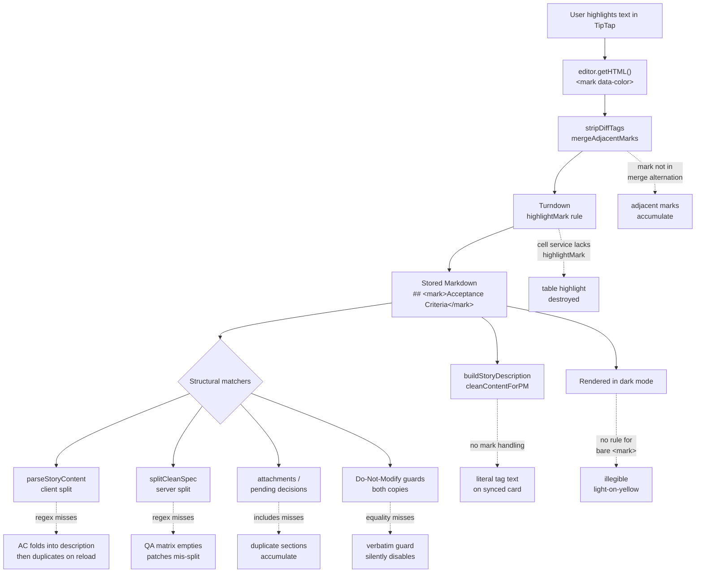

# Highlight Breaks Feature Page Formatting - Plan

- **Audience**: engineers working on the feature (UserStory) editor save path and the maturation spec pipeline
- **Owner**: web app team
- **Ticket**: Fizzy #2047 (BUG, Medium), reported 2026-07-23

**Product Contract preservation:** N/A — no upstream brainstorm artifact. The Product
Contract below was authored during this planning run from the ticket's acceptance criteria
plus a confirmed staging reproduction, then revised after a seven-persona document review.

---

## Goal Capsule

- **Objective:** Applying a highlight anywhere in a feature's spec — including on a section
  heading — never restructures, duplicates, or silently drops the document's content, and never
  destroys the highlight itself on save.
- **Product authority:** the engineering owner of this fix, who scoped it and chose the
  "corruption + fidelity" radius, the shared-normalizer approach, consumer-side hardening over
  producer-side normalization, tag-stripping on the tracker-sync path, and count-before-deciding
  on already-corrupted rows. Reported and triaged via Fizzy #2047.
- **Open blockers:** None. Root cause confirmed in source and reproduced end-to-end on staging
  2026-07-31.

---

## Problem Frame

A TipTap highlight is persisted as a **raw `<mark>` HTML tag inside a Markdown document**. That
is the single Turndown rule at
[`editor-markdown-save.ts:240-251`](apps/web/modules/saas/projects/lib/editor-markdown-save.ts#L240-L251).

The feature page's structure is recovered by line-anchored matchers that assume the heading text
begins immediately after the `#` characters:

```
ACCEPTANCE_HEADING_RE = /^#{1,6}\s+acceptance/i
```

Highlighting the `## Acceptance Criteria` heading yields
`## <mark data-color="#fef08a">Acceptance Criteria</mark>`, which no longer matches. The split
folds the criteria into `description` and `formatStoryContent` re-adds the canonical section from
the still-populated column — permanently duplicating it.

**Reproduced on staging 2026-07-31** against a scratch project with synthetic data. Saving a highlighted AC
heading raised the app's own warning toast — *"Kept your existing acceptance criteria — the edit
removed the "Acceptance Criteria" heading, so they weren't overwritten."* — and after reload the
document carried two Acceptance Criteria sections. Evidence and the full transcript live in the
grounding dossier (see Sources).

Body-text highlights round-trip cleanly through both the maturation and classic editors. The
editor is not the defect; the structural matchers are.

**This is a repeat offender.** Both [`story-content.ts`](apps/web/modules/saas/projects/lib/story-content.ts)
and [`clean-spec-content.ts`](packages/api/modules/projects/lib/clean-spec-content.ts) carry
header comments recording two prior silent-data-loss incidents from this same matcher (the
`## Description` split of issue #737; an AI edit renaming the heading to `## Success Criteria`
nulling the column) plus a client/server drift where the client broadened to `#{1,6}` while the
server stayed at `#{1,2}`.

**Blast radius.** `clean-spec-content` is imported by eight server modules — QA analysis,
maturation-question extraction, decision→spec propagation, pending-patch acceptance, and summary
digest generation among them. A missed split degrades all of them, and the file's own comment
states the consequence: *"That empties the QA tab's traceability matrix and makes drafting refuse."*

---

## Product Contract

### Problem & Value

A reviewer highlights text in a feature spec — the most ordinary annotation gesture there is —
and the document silently restructures itself. Acceptance criteria duplicate and fork; attachment
and decision sections stop being idempotent and accumulate duplicates. The user gets a warning
toast that blames *their* edit for removing a heading they never touched.

Value: **highlighting a heading no longer corrupts the document**, and a matcher that has now
caused silent data loss three times gets a single shared implementation instead of five
hand-synced copies. Scoped honestly — after this change a highlight is still visible only inside
the TipTap editor. The proposal-review dialog, version-history diffs, and the QA / summary /
decision panels all render through `@ui/components/markdown`, which deliberately omits
`rehype-raw` and drops the tag; U7 strips it on tracker sync by design.

### Scope — In

1. **One shared inline-decoration normalizer**, used by every structural matcher on both sides
   of the client/server split, so the byte-compatibility contract those files demand is enforced
   by construction rather than by hand-syncing regexes.
2. **Acceptance-criteria split** (client + server + the update-with-context path) survives a
   decorated heading, and the two splitters' loop semantics are aligned so they agree on
   documents this bug has already corrupted.
3. **Heading idempotency lookups** (attachments in three places, pending decisions) survive a
   decorated heading instead of creating duplicate sections.
4. **Bug-template "Do Not Modify" guard** — both copies — and the maturation question-skip rule
   survive a decorated heading instead of failing open.
5. **Highlight fidelity on save** — table-cell highlights are no longer destroyed, and marks
   split by an accepted AI diff no longer accumulate as adjacent tags.
6. **Tracker sync** strips highlight tags so synced cards show clean text rather than literal
   `&lt;mark data-color="…"&gt;`, on every tool path rather than the HTML subset.
7. **Dark-mode legibility** for a highlight that carries no colour attribute.

### Behaviour on already-corrupted documents

The bug has been shipping, so some stored rows already carry a decorated heading and, in some
cases, duplicated sections. Those rows change shape on their next save once the normalizer makes
the previously-invisible heading match. The plan's position:

- **First matching line wins**, for both the acceptance split and the attachments / pending-decision
  lookups. On a document with a decorated and a plain `## Acceptance Criteria`, the decorated one
  is the boundary; the second heading's text stays inside the criteria body.
- **Forward-only by default**, but the size of the affected population is measured before ship —
  see the Verification Contract's corrupted-row count. If the count is material, a repair script
  becomes a follow-up decision rather than an assumption.
- U2 and U4 each carry a fixture for an already-duplicated document so the behaviour is pinned
  rather than emergent.

### Scope — Deferred to Follow-Up Work

**Deferral criterion:** in scope is any matcher on the read or write path of a *feature page's
stored spec* that can corrupt content or disable a guard. Everything else defers.

- **`section-highlighter.ts`** — same bug class, but the module has **zero importers** (verified
  independently by three reviewers) and no test file. It is dead code. It also interpolates a
  section name into `new RegExp` unescaped; that injection is currently unreachable, but the
  vector is inherited by whoever revives the module, so this wants a removal-or-fix decision
  rather than hardening.
- **`structure-guards.ts` → `countHeadingMatches` only** — the destructive-rewrite *detector*.
  Its `.includes(needle)` survives a mark wrapping a whole heading and fails only when the mark
  splits the phrase mid-way; the failure mode is a guard mis-firing, not data corruption.
  (`extractSectionBody` / `spliceSectionBody` from the same file are **in scope** — see U5.)
- **The wider temporal document-generation and document-eval matchers** — roughly twenty further
  line-anchored heading regexes in deep-researcher aggregation, NLP metrics, evidence reports and
  project-document generation. Same class, but none sits on a feature page's spec path.
- **Storage-format change to `==highlight==`** — rejected. It would not fix this bug
  (`## ==Acceptance Criteria==` fails the same regex — verified), and a format migration over
  every existing `<mark>` directly threatens AC3.
- **Producer-side heading normalization** (strip decoration from heading lines at save time) —
  rejected by product authority. It would fix every matcher in the codebase at one site, but it
  silently discards a highlight the user deliberately applied to a heading, does nothing for AI
  and API write paths that bypass the editor, and does not repair already-stored decorated
  headings. Consumer-side tolerance preserves the Objective's promise that a heading highlight
  survives.
- **Blocking the highlight mark on heading nodes in the editor** — rejected: it covers only the
  `<mark>` subset of a defect class that `**bold**`, `*italic*` and `` `code` `` trigger
  identically, and non-editor write paths produce headings the editor cannot gate.
- **Read-only Markdown surfaces dropping highlights** — `@ui/components/markdown` has no
  `rehype-raw` by deliberate prior decision
  (`docs/plans/2026-07-20-003-fix-feature-proposal-markdown-rendering-plan.md`).
- **TipTap's `==x==` input/paste rule** silently creating highlights — real, and it is the only
  bare-`<mark>` producer on the feature page, but whether that affordance should exist is a
  separate product question.

### Success Criteria

- **AC1:** Adding highlighted text to a feature page — including on a section heading — does not
  alter or corrupt any existing formatting: tables, headers, lists, or spacing.
- **AC2:** Feature page content renders correctly immediately after saving highlighted text, in
  both light and dark mode, whether or not the highlight carries a colour attribute.
- **AC3:** No regression across feature pages with varying existing content complexity —
  specifically, documents that split correctly today must split byte-identically after the change.
- **AC4:** A highlight applied inside a table cell survives a save round-trip.
- **AC5:** The acceptance-criteria split behaves identically on client and server for the same
  input, including documents carrying more than one acceptance heading.
- **AC6:** A synced tracker card shows clean text where the source had a highlight, on every tool
  path — not only the HTML-description subset.

### Decisions

- **Shared normalizer, general** (chosen over a narrow `<mark>`-only widening). Fixes the whole
  class at once — `<mark>`, `**bold**`, `*italic*`, `` `code` `` in a heading — and collapses five
  hand-synced copies into one import.
- **Consumer-side hardening, not producer-side normalization** — preserves a heading highlight and
  leaves the save path untouched, at the cost of leaving the deferred matchers unhardened.
- **Strip tags on tracker sync, keep the text** (chosen over converting to bold or deferring).
  Trackers cannot render a highlight; clean text is the honest degradation.
- **A highlight is an editor-local annotation.** It has no cross-surface persistence and no
  user-facing signal when dropped. That is an accepted product position, not an oversight.
- **Normalized output is for matching only, never stored.** This is what makes the aggressive
  character-level strip safe.
- **`@repo/utils` behind its own subpath** is the home, following the documented precedent in
  [`packages/utils/lib/acceptance-criteria.ts:17-21`](packages/utils/lib/acceptance-criteria.ts#L17-L21).
  Already a direct dependency of `apps/web`, `packages/api`, and `packages/temporal`; source-only,
  no build step. `@repo/editor-utils` was rejected — dead code, not a dependency of
  `packages/api`, and its root barrel re-exports DOM-dependent code.

### Dependencies / Assumptions

- No new package dependency. No database migration. No schema change.
- Every target module already has a colocated vitest suite except `section-highlighter.ts`
  (deferred). `packages/api/modules/projects/lib/__tests__/attach-pending-media-to-story.test.ts`
  exists with 23 cases, including "is idempotent at the description level" and "places the warning
  line INSIDE the `## Attachments` block" — both exercise the check U4 changes.
- `packages/utils` has **no `vitest.config.ts`** — it runs `vitest run` on defaults, with tests in
  both `packages/utils/__tests__/` and colocated `packages/utils/lib/*.test.ts`.
- Several target functions are module-private and need exporting for unit test access — see U3,
  U5, U7.
- Assumption (untested, and the corrupted-row query in the Verification Contract settles it): no
  stored document relies on an emphasis character inside a heading being significant to a
  *matcher*. Emphasis is preserved in storage; only the matching copy is normalized.

---

## Key Technical Decisions

### KTD1 — The normalizer must be strictly linear, and must never forge a heading

**Linearity.** `docs/solutions/security-issues/redos-in-preview-markdown-strip.md` documents a
ReDoS in this repo's *other* inline-decoration stripper, where
`(___|__|_)(?=\S)(.*?\S)\1(?![\w])` went quadratic on a single long line of unpaired tokens. The
obvious implementation of this helper — unwrap `(\*\*|\*)(.+?)\1` pairs — is that exact family.
**Do not write it.**

Because these matchers only need the *keyword* to become visible, the helper never has to
correctly unwrap emphasis. Two passes, both linear with no backtracking:

```
strip HTML tags:          /<[^>]*>/g        — negated class with a literal terminator
strip emphasis chars:     /[*_`~]/g         — character class; no quantifier, no backreference
```

Cap each line at **4000 characters** before the passes, matching
`apps/web/modules/ui/lib/strip-markdown.ts:26`. The cap is per line, which is the helper's
argument unit, so total work stays linear in document length across KTD2's line scans.

**This discipline binds every regex this plan introduces, not just U1's helper** — U6 and U7 add
patterns over the same untrusted text. No backreference-based attribute comparison inside
`mergeAdjacentMarks`' fixpoint loop (see KTD4), and single-line adversarial fixtures with a 200 ms
budget are mandatory in U1, U6, and U7.

**Heading-forgery guard (required).** Stripping decoration anywhere in the line means a body line
can be *promoted* into heading shape: `` `## Acceptance Criteria` `` (inline code) and
`<span>## Original Description…` both normalize to real headings and would newly match, breaking
the AC3 identity guarantee and letting a crafted body line move a verbatim-preserve boundary.

> If the trimmed input does not begin with `#` but the normalized result does, return the input
> unchanged. Decoration stripping must never move a line *into* heading shape.

(Note the guard is needed only for that direction. A line like `**Acceptance Criteria:**` with no
`#` at all normalizes to `Acceptance Criteria:`, which still fails `/^#{1,6}\s+acceptance/i` —
verified.)

**Lossy, match-only.** `## 5 * 3 rules` normalizes to `## 5 3 rules`. Harmless for comparison
against fixed targets, unacceptable for storage — the docstring must say so plainly.

**Single pass, never iterate.** `<ma<mark>rk>` yields `rk>`, not a reassembled `<mark>`. Iterating
to a fixpoint is what reassembles a forgery (the "mangle, don't delete" rule in `CONCEPTS.md`).
Safe here only because the result is never re-parsed or persisted — a rationale that does
**not** transfer to U7 (see KTD5).

### KTD2 — Whole-document `.includes(HEADING)` checks become line scans, using a substring predicate

Normalizing an entire document to make `target.includes("## Attachments")` work would be both
expensive and wrong (it would flatten body emphasis into the comparison). Convert each to a line
scan: split, normalize each line, test.

**The predicate is `stripInlineDecoration(line).includes(HEADING)` — substring, not equality.**
`"### Attachments"` literally contains `"## Attachments"`, so a *demoted* heading satisfies the
check today, and this codebase's own comments record heading demotion as "a common AI edit" (it is
why `ACCEPTANCE_HEADING_RE` was broadened to `#{1,6}`). An equality predicate would silently
narrow what counts as an existing section and create a duplicate on the next append — an AC3
regression inside the unit that exists to stop duplicates.

`countPendingDecisions` additionally uses `indexOf` + `slice` to find the section body, so it needs
the matching line's index rather than a boolean.

### KTD3 — Client and server adopt the normalizer in the same change, and their loop semantics are aligned

`story-content.ts` and `clean-spec-content.ts` state a byte-compatibility contract and have already
drifted once. They land together (U2).

They also diverge in a way this fix would otherwise **expose**: `parseStoryContent` tests every
line, while `splitCleanSpec` guards with `!inAcceptanceCriteria`. On a document carrying two
acceptance headings — the corrupted shape this bug produces — the client drops both and merges the
bodies while the server keeps the second as literal text. That divergence is invisible today only
because the decorated heading never matches. Aligning the guards is therefore in scope, not a
tangent: without it AC5 fails on exactly the population the fix targets.

### KTD4 — Mark merging compares full open tags; the attribute-free rule is the wrong invariant

`ADJACENT_MARK_RE` is `/<\/(strong|em|s|u)><\1>/gi`. The `<\1>` half can only match a **bare** open
tag, which is correct for `strong|em|s|u` because those are always attribute-free. For `mark` it is
wrong in both directions:

- `<mark data-color="#a">A</mark><mark>B</mark>` **would** merge (the closing tag carries no
  attributes), silently recolouring B.
- The case U6 exists for — a coloured mark split by an accepted AI diff — produces
  `</mark><mark data-color="#a">`, which the attribute-free rule **refuses** to merge, leaving
  Scope-In item 5 unfixed for every toolbar highlight. `Highlight.configure({ multicolor: true })`
  means every toolbar swatch emits `data-color` plus a `style` attribute.

The predicate must be: merge adjacent same-tag pairs whose **open tags are byte-identical including
attributes**. Implement as a bounded single-pass scan comparing the parsed attribute strings in
code — *not* as `<mark([^>]*)>…</mark><mark\1>`, which is the backreference-plus-lazy-quantifier
family KTD1 bans, running inside a fixpoint loop on the client main thread.

### KTD5 — Strip `<mark>` in `cleanContentForPM`, not `escapeHtml`

`escapeHtml` is **not** the universal sync funnel. It is reached only via `markdownToSimpleHtml`,
which `story-sync.ts:585` restricts to `HTML_DESCRIPTION_TOOLS = {fizzy, asana, monday}`. The five
tools in `MARKDOWN_DESCRIPTION_TOOLS` (`:601` — github, gitlab, linear, clickup, trello) receive
raw Markdown, and the file's own comment at `:582` records that Azure DevOps and Jira are handled
separately. Stripping in `escapeHtml` would satisfy AC6 for three of ten tool paths.

`cleanContentForPM` is the real funnel: it runs inside `buildStoryDescription` **before** the tool
branch, at `:1209` (description), `:1262` (acceptance criteria), `:1269` (notes/links) and `:1278`
(release notes). It already performs exactly this class of per-line heading-decoration cleanup for
`**bold**`, so the `<mark>` strip sits beside existing logic rather than bolted onto an escaper.

**Pattern (word-delimited, required):** `/<mark(?=[\s/>])[^>]*>/gi` and `/<\/mark\s*>/gi`. The
naive `/<\/?mark[^>]*>/gi` also matches `<marker>`, `<markdown>` and `Map<markerId, string>`,
silently deleting text — the mirror of the `Array<string>` case this path exists to protect.

The workflow bundle carries a **duplicated copy** of this family in
`packages/temporal/src/workflows/story-sync-workflow.ts`; the fix must be mirrored there.

---

## High-Level Technical Design

How a highlight reaches — and currently breaks — the structural matchers:



The fix inserts one normalizer between the stored Markdown and every matcher in `F`, and closes
`O`, `P`, `R`, and `T` at their respective single points.

---

## Requirements Traceability

| ID | Requirement | Units |
|---|---|---|
| R1 | A decorated section heading still splits correctly, client and server | U1, U2, U3 |
| R2 | Heading-keyed idempotency checks do not create duplicate sections | U1, U4 |
| R3 | Heading-keyed guards do not fail open, in both copies | U1, U5 |
| R4 | Highlights survive a save round-trip, including in table cells | U6 |
| R5 | Synced tracker cards show clean text on every tool path (AC6) | U7 |
| R6 | Documents that split correctly today behave byte-identically (AC3) | U1, U2, U3, U4, U6, U7 |
| R7 | A highlight renders legibly in both themes, with or without a colour (AC2) | U8 |
| R8 | The two splitters agree on multi-heading documents (AC5) | U2 |

---

## Implementation Units

### U1. Shared inline-decoration normalizer

- **Goal:** One pure, linear, dependency-free helper that makes a Markdown line's text visible to
  a structural matcher regardless of inline decoration — without ever creating a heading.
- **Requirements:** R1, R2, R3, R6. Enables U2–U5.
- **Dependencies:** none.
- **Files:**
  - `packages/utils/lib/markdown-heading.ts` (new)
  - `packages/utils/lib/markdown-heading.test.ts` (new — colocated, matching the package convention)
  - `packages/utils/package.json` (add the `./markdown-heading` subpath export, mirroring
    `./acceptance-criteria`)
- **Approach:** Export `stripInlineDecoration(line: string | null | undefined): string`. Cap at
  4000 characters, run the two linear passes from KTD1, apply the **heading-forgery guard**, then
  collapse double spaces and trim. Pure, total, never throws, returns `""` for nullish input. The
  docstring must state that output is match-only and never to be stored, why the implementation is
  character-level rather than pair-matching (citing the ReDoS learning), why it is single-pass, and
  what the forgery guard protects.
- **Patterns to follow:** [`packages/utils/lib/acceptance-criteria.ts`](packages/utils/lib/acceptance-criteria.ts)
  — its header comment is the model for explaining why a shared helper exists.
- **Test scenarios:**
  - Covers AC1. `## <mark data-color="#fef08a">Acceptance Criteria</mark>` → `## Acceptance Criteria`.
  - `## **Acceptance Criteria**`, `## *Acceptance Criteria*`, ``## `Acceptance Criteria` `` all
    normalize to `## Acceptance Criteria`.
  - A bare `<mark>` (no `data-color`) is stripped — the shape TipTap's `==text==` input rule emits.
  - Mixed decoration `## **A** <mark>B</mark>` normalizes to `## A B` (single-spaced).
  - Covers AC3. An undecorated line is returned unchanged (identity).
  - **Forgery guard:** `` `## Acceptance Criteria` ``, `*## Attachments*`,
    `~~## Resolved Decisions (pending integration)~~`, and `<span>## Original Description from
    User (Do Not Modify)` are each returned **unchanged** — not promoted to headings.
  - A line that already starts with `#` is still normalized (the guard must not disable the fix).
  - Empty string, whitespace-only, and nullish input return `""` without throwing.
  - Nested/malformed `<ma<mark>rk>` does not yield `<mark>` — asserts the single-pass rule.
  - **ReDoS, single-line fixtures with NO newlines** (per the learning's prevention rule 2): a
    128 KB single-line payload of unpaired `_a _a _a …` tokens, plus `<mark <mark <mark …`, each
    under a hard 200 ms budget. A multi-line fixture alone is explicitly insufficient.
  - Input longer than 4000 characters is truncated rather than processed in full.
- **Verification:** Linear on adversarial input, identity on clean input, never forges a heading.

### U2. Acceptance-criteria split adopts the normalizer, and the two loops are aligned

- **Goal:** A decorated `Acceptance Criteria` heading splits exactly like an undecorated one, on
  both sides — including on documents this bug has already duplicated.
- **Requirements:** R1, R6, R8. **Must land as one change** (KTD3).
- **Dependencies:** U1.
- **Files:**
  - `apps/web/modules/saas/projects/lib/story-content.ts` (matcher at `:39`, used at `:45`, `:55`)
  - `packages/api/modules/projects/lib/clean-spec-content.ts` (matcher at `:30`, used at `:69`)
  - `apps/web/modules/saas/projects/lib/__tests__/story-content.test.ts` (extend)
  - `packages/api/modules/projects/lib/__tests__/clean-spec-content.test.ts` (extend)
- **Approach:** Both files normalize the trimmed line before testing it; the regex itself is
  unchanged. **Additionally align the loop guards** — `parseStoryContent` tests every line while
  `splitCleanSpec` guards with `!inAcceptanceCriteria`. Adopt the `!inAcceptanceCriteria` guard on
  the client so the first matching heading wins on both sides (matching the first-match-wins
  position in Behaviour on already-corrupted documents). Update both header comments: the
  byte-compatibility contract is now held by a shared import.
- **Test scenarios:**
  - Covers AC1. A `## <mark …>Acceptance Criteria</mark>` heading splits into the same
    `{description, acceptanceCriteria}` as the undecorated heading.
  - Covers AC1. `resolveStoryContentForSave` does **not** raise `acceptanceCriteriaPreserved` for
    a decorated heading — the exact staging symptom; the toast must stop firing.
  - Covers AC5/R8. **Shared parity fixture table** including a document with *two* acceptance
    headings (one decorated, one plain): both splitters produce identical output.
  - Covers AC3/R6. Every existing fixture still produces byte-identical output, plus a round-trip
    `parse(format(parts)) === parts` case for a decorated heading.
  - A demoted `### <mark>Acceptance Criteria</mark>` still splits (`#{1,6}` tolerance preserved).
  - A body line `` `## Acceptance Criteria` `` is **not** treated as the boundary (forgery guard).
- **Verification:** The staging reproduction no longer duplicates the section; both suites green;
  no existing fixture's expected value edited (if one needs editing, stop and surface it).

### U3. `update-with-context` heading regexes adopt the normalizer

- **Goal:** The update-with-context path splits a decorated spec correctly.
- **Requirements:** R1, R6.
- **Dependencies:** U1.
- **Files:**
  - `packages/api/modules/projects/procedures/stories/update-with-context.ts` (`parseUpdatedDocument`
    at `:47`; `acHeaderRegex` at `:51`; `## Description` strips at `:58`, `:66`) — **export
    `parseUpdatedDocument` for test**
  - `packages/api/modules/projects/procedures/stories/__tests__/update-with-context-parse.test.ts` (new)
- **Approach:** This matcher is the strictest of the family — `/^##\s+Acceptance\s+Criteria\s*$/im`
  is `$`-anchored on exact text, so any decoration defeats it. Apply the normalizer per line rather
  than loosening the anchors.
  **Critical:** the function does not merely test lines — it slices the **original** document using
  `acMatch.index` and `acMatch[0].length`. Offsets taken from a normalized copy do not map back.
  Locate the boundary by scanning the original lines while tracking a running character offset, and
  perform the slice and both `## Description` strips against the **original** line text and length.
  This mirrors KTD2's treatment of `countPendingDecisions`.
- **Test scenarios:**
  - A decorated AC heading splits identically to an undecorated one.
  - A decorated `## Description` heading is stripped rather than leaking into the stored description.
  - Covers AC3. Existing undecorated inputs produce byte-identical stored columns.
  - A document where the decorated heading appears after multi-byte content still slices at the
    correct offset (guards the offset-mapping requirement).
- **Verification:** Decorated and undecorated inputs produce identical stored columns.

### U4. Heading idempotency lookups adopt the normalizer

- **Goal:** Attachment and pending-decision sections stay idempotent when their heading carries
  decoration, instead of accumulating duplicates.
- **Requirements:** R2, R6.
- **Dependencies:** U1.
- **Files:**
  - `packages/api/modules/projects/lib/append-attachments-section.ts` (`:21`, `:51`)
  - `apps/web/modules/saas/projects/lib/append-attachments-section.ts` (`:20`, `:50` — mirrored copy)
  - `packages/api/modules/projects/lib/attach-pending-media-to-story.ts` (`:358`, `:360` — a
    **third**, independently inlined copy)
  - `packages/api/modules/projects/lib/record-answer-in-spec.ts` (`:46`, `:64`)
  - `packages/api/modules/projects/lib/__tests__/append-attachments-section.test.ts` (extend)
  - `apps/web/modules/saas/projects/lib/__tests__/append-attachments-section.test.ts` (extend)
  - `packages/api/modules/projects/lib/__tests__/attach-pending-media-to-story.test.ts` (extend)
  - `packages/api/modules/projects/lib/__tests__/record-answer-in-spec.test.ts` (extend)
- **Approach:** Convert each `.includes(HEADING)` to a normalized line scan using the **substring**
  predicate from KTD2. `countPendingDecisions` needs the matching line's index, since it slices the
  section body from that offset. The third copy in `attach-pending-media-to-story.ts` should import
  the shared helper from `append-attachments-section` rather than keeping its own inlined constant.
- **Test scenarios:**
  - Covers AC1. Appending to a document whose `## Attachments` heading is decorated appends under
    the existing section rather than creating a second one — asserted in all three copies.
  - Covers AC3. A **demoted** `### Attachments` heading is still treated as an existing section
    (guards the substring predicate).
  - `countPendingDecisions` returns the correct count for a decorated
    `## Resolved Decisions (pending integration)` heading — currently returns 0.
  - `appendPendingDecision` appends under a decorated heading rather than duplicating the appendix.
  - **Already-corrupted fixture:** a document with two `## Attachments` sections (one decorated)
    appends into the **first** and does not create a third.
  - Undecorated documents behave byte-identically; a document with no such heading creates one once.
- **Verification:** Repeated appends against a decorated document converge to one section.

### U5. Do-Not-Modify guards and maturation question-skip adopt the normalizer

- **Goal:** The verbatim-preserve guard stops failing open — in **both** copies — and the
  question-skip rule survives a decorated heading.
- **Requirements:** R3.
- **Dependencies:** U1.
- **Files:**
  - `packages/api/modules/projects/procedures/stories/reevaluate-bug.ts` (`:73-74` exact string
    equality; `:106-107` in `spliceOriginalDescription`) — **export
    `extractOriginalDescriptionBody` and `spliceOriginalDescription` for test**
  - `packages/temporal/src/lib/structure-guards.ts` (`extractSectionBody` `:162-170`,
    `spliceSectionBody` `:203-211` — the generalized copy of the same guard;
    `reanalyze-body-by-kind.ts:254` comments it as mirroring the Re-evaluate Bug guard)
  - `packages/api/modules/projects/lib/extract-maturation-questions.ts` (`SKIP_QUESTION_HEADING_RE`
    at `:57`, applied at `:97`)
  - `packages/api/modules/projects/procedures/stories/__tests__/reevaluate-bug-original-description.test.ts` (new)
  - `packages/temporal/src/lib/__tests__/structure-guards.test.ts` (extend or add)
  - `packages/api/modules/projects/lib/__tests__/extract-maturation-questions.test.ts` (extend)
- **Approach:** Normalize before the header equality test so the verbatim guard keeps working —
  today a decorated heading makes the lookup return `null` and the guard silently disables, a
  data-integrity failure rather than a formatting one. The constant is
  `Original Description from User (Do Not Modify)`.
  **Do NOT normalize the `/^##? \S/` section terminators.** That pattern only requires a
  non-whitespace character after the hashes, which `<`, `*`, `~` and `` ` `` all satisfy, so
  decorated following headings already terminate correctly. Normalizing first can only *lose* the
  match — a heading whose visible text sits entirely inside the stripped tag collapses to a bare
  `##` — introducing the very over-read this unit would claim to prevent.
  In `extract-maturation-questions`, normalize the captured heading before the `SKIP_QUESTION` test.
- **Test scenarios:**
  - A decorated `## Original Description from User (Do Not Modify)` heading is still found and the
    body still extracted verbatim — asserted in **both** copies.
  - `spliceSectionBody` / `spliceOriginalDescription` restore the full body, not a truncated one.
  - A decorated `## Initial Questions` heading is still skipped, so draft questions do not leak in.
  - Covers AC3. Undecorated inputs unchanged; a following undecorated heading still terminates.
- **Verification:** Both guard copies behave identically for decorated and undecorated headings.

### U6. Editor save-path highlight fidelity

- **Goal:** A highlight survives a save round-trip, including inside a table cell, and split
  highlights merge correctly without recolouring.
- **Requirements:** R4, R6.
- **Dependencies:** none (independent of U1).
- **Files:**
  - `apps/web/modules/saas/projects/lib/editor-markdown-save.ts` (`getInlineCellService` `:36-51`;
    `highlightMark` rule `:240-251`)
  - `apps/web/modules/saas/projects/lib/editor-save-utils.ts` (`ADJACENT_MARK_RE` /
    `mergeAdjacentMarks` `:211-222`)
  - `apps/web/modules/saas/projects/lib/__tests__/editor-markdown-save.test.ts` (extend)
  - `apps/web/modules/saas/projects/lib/__tests__/editor-save-utils.test.ts` (extend)
- **Approach:** Per KTD4, extract the `highlightMark` rule definition once and register it on both
  the main service and the inline cell service. Replace the alternation-widening approach with a
  **mark-specific merge that compares the two adjacent open tags' full attribute strings and merges
  only on a byte-identical match**, implemented as a bounded single-pass scan — not a backreferenced
  lazy-quantifier regex (KTD1). Leave `strong|em|s|u` handling as-is.
- **Test scenarios:**
  - Covers AC4. A highlighted table cell serializes with its `<mark>` intact — currently serializes
    to bare `| cell |`, destroying the highlight on first save.
  - A highlighted cell with `data-color` preserves the colour attribute.
  - A highlighted cell containing a pipe still escapes it (no row splitting).
  - `<mark data-color="#a">A</mark><mark data-color="#a">B</mark>` **merges** (the case Scope-In
    item 5 exists for).
  - `<mark data-color="#a">A</mark><mark>B</mark>` does **not** merge (would silently recolour B).
  - `<mark data-color="#a">A</mark><mark data-color="#b">B</mark>` does **not** merge.
  - Two adjacent bare `<mark>` tags merge.
  - Existing bold/italic/strike merge behaviour unchanged.
  - Covers AC3. A document with no marks serializes byte-identically to today.
  - ReDoS: single-line adversarial fixture of many adjacent marks under a 200 ms budget (KTD1).
- **Verification:** Round-tripping a document with a highlighted table cell through
  `getEditorMarkdownForSave` preserves the highlight.

### U7. Tracker sync strips highlight tags on every tool path

- **Goal:** A synced card shows clean text where the source had a highlight, for all tools.
- **Requirements:** R5 (AC6), R6.
- **Dependencies:** none (independent of U1).
- **Files:**
  - `packages/temporal/src/activities/pm-integration/story-sync.ts` (`cleanContentForPM` `:1108-1121`)
  - `packages/temporal/src/workflows/story-sync-workflow.ts` (duplicated copy — **hoist the
    workflow-local helper to module scope and export it** so a parity assertion is possible; the
    hoist must stay pure-regex to preserve workflow determinism)
  - `packages/temporal/__tests__/story-sync.test.ts` (extend; it already has `markdownToSimpleHtml` suites)
- **Approach:** Per KTD5, add the `<mark>` strip to `cleanContentForPM` — the funnel that runs
  inside `buildStoryDescription` before the tool branch, covering markdown-native tools, the HTML
  subset, ADO and Jira alike. Use the word-delimited patterns `/<mark(?=[\s/>])[^>]*>/gi` and
  `/<\/mark\s*>/gi`. Do **not** turn this into a general HTML stripper: escaping arbitrary `<`/`>`
  (e.g. `Array<string>`) is behaviour that must be preserved.
- **Test scenarios:**
  - Covers AC6. `<mark data-color="#fef08a">text</mark>` renders as `text` on the synced card, with
    no literal tag and no leftover `&lt;`.
  - A bare `<mark>text</mark>` renders as `text`.
  - Covers AC6. Assert on both a `MARKDOWN_DESCRIPTION_TOOLS` tool (e.g. github) and an
    `HTML_DESCRIPTION_TOOLS` tool (e.g. fizzy) — the same source produces clean text on both.
  - Covers AC3. `Array<string>` still escapes to `Array&lt;string&gt;`; `<marker>`, `<markdown>`
    and `Map<markerId, string>` are escaped, **not deleted** (guards the word-delimited pattern).
  - Nested/malformed `<ma<mark>rk data-color="x">` produces no reassembled mark tag in raw or
    escaped form.
  - A highlighted heading still produces the correct heading with clean text.
  - The workflow-bundle copy produces identical output to the activity copy for the same input.
- **Verification:** Synced card content contains no `mark` tag text in raw or escaped form, on both
  a markdown-native and an HTML-description tool.

### U8. Dark-mode legibility for colourless highlights

- **Goal:** A highlight with no colour attribute is legible in both themes.
- **Requirements:** R7 (AC2).
- **Dependencies:** none.
- **Files:**
  - `apps/web/app/globals.css` (beside `.dark mark[data-color]` at `:971`)
  - `apps/web/modules/saas/projects/lib/__tests__/` — no unit test; covered by the AC2 staging gate
- **Approach:** `globals.css` carries only `mark.bg-green-200` (`:945`), `.dark mark.bg-green-900`
  (`:961`) and `.dark mark[data-color]` (`:971`). A bare `<mark>` matches none and falls back to UA
  `Mark`/`MarkText` system colours. Add a rule for `mark:not([data-color])` setting background and
  foreground in both themes **from design tokens — no hardcoded hex** (repo one-source-of-truth
  rule). On the feature page a bare `<mark>` arrives via TipTap's `==text==` input rule, not the
  bubble menu (which is mounted only in `DocumentGeneratorEditor`).
- **Test scenarios:** `Test expectation: none — pure styling.` Verified through the AC2 staging gate.
- **Verification:** A `==text==` highlight is legible in light and dark mode on the feature page.

---

## Verification Contract

- `pnpm --filter @repo/utils test` — the new helper suite, including the forgery-guard cases and
  the single-line ReDoS fixtures under their time budget.
- `pnpm --filter web test modules/saas/projects/lib/__tests__/story-content.test.ts`
- `pnpm --filter web test modules/saas/projects/lib/__tests__/append-attachments-section.test.ts`
- `pnpm --filter web test modules/saas/projects/lib/__tests__/editor-markdown-save.test.ts`
- `pnpm --filter web test modules/saas/projects/lib/__tests__/editor-save-utils.test.ts`
- `pnpm --filter @repo/api test` — clean-spec-content, append-attachments-section,
  attach-pending-media-to-story, record-answer-in-spec, extract-maturation-questions,
  reevaluate-bug-original-description, update-with-context-parse.
- `pnpm --filter @repo/temporal test __tests__/story-sync.test.ts` and the structure-guards suite.
- **Temporal replay validation** — U7 touches `packages/temporal/src/workflows/**`, which triggers
  `.github/workflows/temporal-replay-validation.yml` on PRs to master. Run it locally first:
  `pnpm --filter @repo/temporal fetch:replay-histories && pnpm --filter @repo/temporal test:replay`.
- `pnpm type-check` and `pnpm lint` clean for touched files.
- **Corrupted-row count (before ship).** Query stored `description` / `acceptanceCriteria` for
  heading lines containing `<`, `*`, `_`, `` ` `` or `~`, and of those count how many carry a
  duplicated `## Acceptance Criteria` or `## Attachments`. Record the numbers in the PR. This sizes
  the already-affected population and decides whether forward-only remains acceptable.
- **Manual on staging (the AC2 gate):** re-run the reproduction — highlight the
  `## Acceptance Criteria` heading on a feature, save, reload. Expect no warning toast and exactly
  one Acceptance Criteria section. Then type `==highlighted==` in the feature editor to produce a
  **bare** `<mark>` (the bubble menu is not mounted on this surface) and confirm it is legible in
  both light and dark mode after U8.
- **Manual across complexity (the AC3 gate):** highlight text in a feature containing a table, a
  nested list, and a code block; confirm nothing else in the document shifts.

---

## Definition of Done

- U1–U8 landed; every Verification Contract gate green, including temporal replay validation.
- AC1–AC6 satisfied; the staging reproduction no longer duplicates the acceptance-criteria section
  and no longer raises the "Kept your existing acceptance criteria" toast.
- The corrupted-row count is recorded in the PR, and forward-only is either confirmed as acceptable
  or a repair-script follow-up is filed.
- A follow-up ticket is filed covering the deferred matchers (`section-highlighter.ts`
  removal-or-fix, `countHeadingMatches`, the temporal document-generation family) and cited in
  Scope — Deferred.
- No existing test's expected value was weakened or edited to accommodate the change — if one
  needed editing, it was surfaced as a possible regression first.
- No new dependency, no schema change, no storage-format change.
- A `.changeset/*.md` bumping `fabric-app: patch`, headline ≤150 chars on line 1.

---

## Risks & Mitigations

| Risk | Mitigation |
|---|---|
| The normalizer promotes a body line into a heading, changing splits for a working document | The KTD1 forgery guard is mandatory, with four explicit U1 fixtures; U2/U3/U4 each carry an AC3 byte-identical assertion. |
| The normalizer changes splitting for an already-corrupted document | Behaviour on already-corrupted documents states first-match-wins; U2 and U4 each pin it with a fixture; the corrupted-row count sizes the population before ship. |
| ReDoS reintroduced by a later "smarter" regex | KTD1 forbids the pair-matching family **plan-wide** (U1, U6, U7), the docstring records why, the 4000-char cap is O(1) insurance, and single-line adversarial fixtures are mandatory in all three units. |
| The mark merge silently recolours text | KTD4 replaces the attribute-free rule with full open-tag byte equality; U6 asserts both failing directions explicitly. |
| U7 satisfies AC6 for only part of the tracker fleet | KTD5 moves the strip to `cleanContentForPM`, the pre-branch funnel; U7 asserts on both a markdown-native and an HTML-description tool. |
| The temporal workflow copy is missed, leaving sync half-fixed | U7 hoists the workflow-local helper so a real parity test is writable, and replay validation is an explicit gate. |
| Scope creep into the deferred matchers | Scope — Deferred states a single applicable criterion, not a list of ad-hoc reasons. |

---

## Sources & Research

- **Grounding dossier** (root cause, staging reproduction transcript, verified stack facts):
  `scratchpad/grounding.md` for this session.
- **Staging reproduction evidence:** `scratchpad/repro-duplicated-acceptance-criteria.png`
  (scratch project, synthetic data, 2026-07-31).
- **Prior learning — ReDoS:** `docs/solutions/security-issues/redos-in-preview-markdown-strip.md`.
  Governs KTD1; its prevention rules 1 and 2 are non-negotiable in U1, U6, and U7.
- **Prior learning — enumerate consumers by reading, not reasoning:**
  `docs/solutions/design-patterns/prompt-context-fan-in-must-join-not-assign.md`. Its companion
  lesson ("the one unbounded text path turned out to be three") is why U4 covers a third,
  independently inlined copy of the attachments check that the ticket never mentioned — and why
  KTD5 was corrected after review found `escapeHtml` covers three of ten tracker paths.
- **Precedent for the shared-helper placement:**
  [`packages/utils/lib/acceptance-criteria.ts:1-21`](packages/utils/lib/acceptance-criteria.ts#L1-L21)
  — "a rule that needs a guard test to stay true in two places will not survive three."
- **Prior decision on read-only Markdown surfaces:**
  `docs/plans/2026-07-20-003-fix-feature-proposal-markdown-rendering-plan.md` (no `rehype-raw`).
- **Document review, 2026-07-31:** seven personas (coherence, feasibility, security, adversarial,
  product, scope, design). Findings that changed the plan: the KTD1 forgery guard, the KTD2
  substring predicate, the KTD3 loop alignment, the KTD4 merge predicate, the KTD5 funnel
  correction, dropping U5's terminator normalization, restoring `structure-guards.ts`'s
  verbatim-preserve half to scope, U3's offset mapping, U7's workflow hoist, the new U8, AC6, and
  the corrupted-row count.
