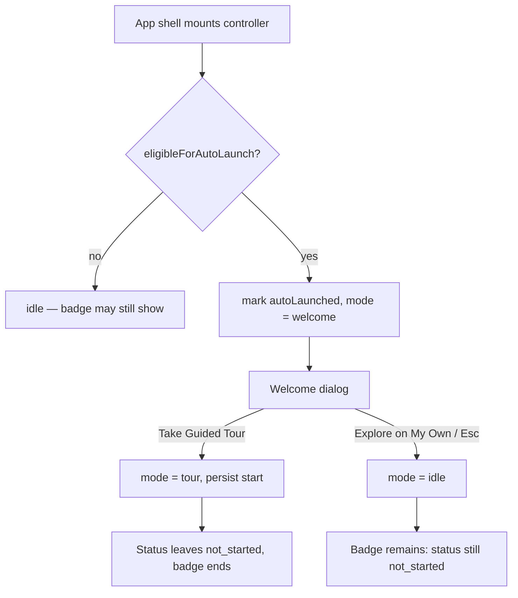

# First-Login Welcome Dialog - Plan

## Goal Capsule

- **Objective:** Replace the side drawer that auto-opens on a new account's first session with a focused, centred dialog offering two choices — take the guided tour, or explore alone and keep the sidebar badge as the standing reminder.
- **Product authority:** PO request (verbatim in Problem Frame). No brainstorm artifact; product decisions below are planning bets recorded in Assumptions.
- **Open blockers:** None. One product trade-off is flagged in Risks rather than blocking: new accounts stop seeing the area-listing drawer automatically.
- **Stop conditions:** Stop and ask if implementation appears to need a new persisted state field, a Prisma migration, or a change to the badge's own eligibility rule. All three would mean this plan misread the existing system.

---

## Product Contract

### Summary

On a new account's first session, present a centred welcome dialog with two actions: **Take Guided Tour** (primary — starts the existing guided tour) and **Explore on My Own** (dismisses; the sidebar badge remains as the standing pointer). It replaces the auto-opened drawer for that one moment rather than stacking on top of it.

### Problem Frame

PO, verbatim:

> I think we need to make it more prominent so its unmissable for new users.
> First-Login Welcome Modal / Banner — Welcome Screen: Display a lightweight welcome dialog on the very first session presenting two clear actions: "Take Guided Tour" (primary button launching the tour) and "Explore on My Own" (dismisses and falls back to showing the sidebar badge).

Two pieces of this already exist, which is why the change is small.

A first-login surface already fires. `eligibleForAutoLaunch` gates it to accounts created on or after `ONBOARDING_AUTO_LAUNCH_SINCE`, and the controller opens `GetStartedDrawer` once, then marks `autoLaunched` so it never repeats. The sidebar badge also already ships: `GetStartedPointer` renders a "New" badge beside the launcher for anyone whose tour status is still `not_started`.

What is missing is **shape**, not capability. The drawer is a right-side `Sheet` whose body is a scrollable list of every product area; its "Take tour" button sits in a footer *below* that list, alongside "Tour this page" and "Read docs". A user meeting the product for the first time is handed a directory and three competing actions. The PO is asking for the opposite: one centred moment, two choices, no browsing.

"Explore on My Own" needs no new fallback to build. The badge is already shown to exactly the population that would click it — users still at `not_started`.

### Requirements

**The dialog**

- R1. On the first session of an eligible account, a centred dialog appears offering exactly two actions.
- R2. The primary action starts the existing guided tour; no new tour surface is introduced.
- R3. The secondary action closes the dialog without starting the tour.
- R4. The dialog appears at most once per account, on the same one-shot basis the current auto-launch uses.
- R5. Choosing either action leaves the sidebar badge behaviour untouched — it continues to follow its own eligibility rule.

**Coexistence with the other onboarding surfaces**

- R6. The dialog replaces the auto-opened drawer for that first session; a new account never sees both.
- R7. The drawer stays reachable from the sidebar launcher, unchanged, for every user at any time.
- R8. The dialog participates in the controller's existing surface arbitration, so no other onboarding surface opens on top of it.

**Presentation and accessibility**

- R9. The dialog is dismissible by keyboard and closes on Escape.
- R10. The primary action is visually distinguished from the secondary one.
- R11. All colour comes from design tokens; no looping animation.
- R12. All copy is translatable; no user-facing string is hardcoded in the component.

### Key Flows

- F1. New account, takes the tour
  - **Trigger:** A newly created account loads the app for the first time.
  - **Steps:** The welcome dialog appears. The user clicks "Take Guided Tour". The dialog closes and the guided tour starts at its first step.
  - **Outcome:** Tour status leaves `not_started`, which also ends badge eligibility — the user is being shown the product, so the pointer has nothing left to point at.
  - **Covered by:** R1, R2, R4, R5

- F2. New account, explores alone
  - **Trigger:** Same as F1.
  - **Steps:** The user clicks "Explore on My Own". The dialog closes. Nothing else opens.
  - **Outcome:** Tour status stays `not_started`, so the sidebar badge remains as the standing reminder, and the launcher still opens the full drawer on demand.
  - **Covered by:** R3, R4, R5, R7

### Acceptance Examples

- AE1. **Covers R1, R6.** Given an account eligible for first-login auto-launch, when the app loads, then the welcome dialog appears and the drawer does not.
- AE2. **Covers R2.** Given the dialog is open, when the primary action is clicked, then the dialog closes and the guided tour is showing.
- AE3. **Covers R3, R5.** Given the dialog is open, when the secondary action is clicked, then the dialog closes, no tour starts, and the sidebar badge is still present.
- AE4. **Covers R4.** Given an account that has already seen the dialog, when the app loads again, then no dialog appears.
- AE5. **Covers R6, R7.** Given any user, when the sidebar launcher is clicked, then the drawer opens — including for a user who dismissed the welcome dialog earlier in the same session.
- AE6. **Covers R8.** Given the dialog is open, when a listener reads the onboarding surface signal, then it reports a surface as open.
- AE7. **Covers R1.** Given an account outside the auto-launch cohort, when the app loads, then no dialog appears.

### Scope Boundaries

- The guided tour, the drawer's contents, the per-page tours, and the sidebar badge are untouched.
- The `ONBOARDING_AUTO_LAUNCH_SINCE` cohort gate is unchanged. The PO says "very first session"; for accounts predating the cutoff there is no first session left, and interrupting them was a deliberate product decision when the tour shipped. Those users already get the badge.
- No banner variant. The PO's heading says "Modal / Banner"; the body describes a dialog with two actions, so the dialog is what gets built.
- No new persisted state. See KTD2.
- No telemetry on which action users pick.

### Dependencies / Assumptions

- The controller's existing one-shot flag (`autoLaunched`) is the correct record of "the first-login surface has fired". It is already written at the moment the surface opens, and already survives reloads.
- The badge needs no fallback wiring: it is gated on tour status, and "Explore on My Own" leaves that status untouched by construction.
- The repo has an established dialog pattern for a one-shot onboarding prompt (`FunctionTagsOnboardingPrompt`), so this needs no new primitive.

---

## Planning Contract

### Key Technical Decisions

- KTD1. **Replace the drawer at first login rather than adding a sixth surface.** The controller already arbitrates five onboarding surfaces through one `mode` machine, and a brand-new account can already meet the drawer and the function-tags prompt back to back. Adding the dialog *on top of* the drawer would make that three interruptions before the user has clicked anything. Routing the existing auto-launch branch to the dialog keeps the count at one and needs no new suppression logic.

- KTD2. **No new persisted field.** The one-shot behaviour R4 asks for is exactly what `autoLaunched` already provides — it is set when the first-login surface opens and gates `eligibleForAutoLaunch` server-side. Reusing it means no JSON-column change, no Zod mirror update, and no migration. This is why the change touches no `packages/` code at all.

- KTD3. **"Explore on My Own" writes nothing.** It closes the dialog and returns the controller to idle. The badge fallback the PO describes is not a new behaviour to build: the badge is gated on tour status being `not_started`, which declining the tour leaves untouched. Writing a dismissal here would be wrong — it would suppress a pointer the user has not dismissed.

- KTD4. **A new `mode` value, not a boolean beside the machine.** The controller's surface arbitration, its idle checks, and the surface-event broadcast are all keyed on `mode`. Introducing the dialog as a sixth `mode` value means it inherits arbitration and the broadcast for free; a parallel boolean would have to be threaded into each of those places by hand.

- KTD5. **Reuse the repo's dialog primitive rather than the spotlight.** `GetStartedSpotlight` is an anchored coach-mark with a scrim and step navigation — wrong shape for an unanchored welcome moment. The `Dialog` primitive already used by the function-tags prompt gives a centred modal with Escape handling and focus management, which is what R9 asks for.

### High-Level Technical Design

The first-login branch changes destination; everything downstream is existing wiring.

### Assumptions

Recorded rather than asked, because this ran in pipeline mode:

- The PO's "very first session" means the existing auto-launch cohort, not every user. Widening it would interrupt long-standing accounts, which the tour's original rollout deliberately avoided.
- Losing the automatic area-listing drawer for new accounts is an acceptable trade for a clearer first moment, because the drawer stays one click away and the tour itself walks the same areas. Flagged in Risks.
- The dialog is the whole ask; "Banner" in the PO's heading is a title variant, not a second deliverable.

### Sequencing

U1 introduces the component. U2 routes the controller to it. U3 supplies copy. U2 depends on U1 and U3.

---

## Implementation Units

### U1. Welcome dialog component

- **Goal:** A centred, one-shot dialog presenting the two actions.
- **Requirements:** R1, R2, R3, R9, R10, R11, R12
- **Dependencies:** none
- **Files:**
  - `apps/web/modules/saas/get-started/components/GetStartedWelcomeDialog.tsx` (create)
  - `apps/web/modules/saas/get-started/components/__tests__/GetStartedWelcomeDialog.test.tsx` (create)
- **Approach:** A presentational component taking two callbacks — one per action — plus a close handler. It owns no onboarding state and reads no query; the controller decides when it is mounted. Escape and outside-click route to the same path as the secondary action, since declining is the safe default for a surface the user did not open. Primary action uses the default button variant, secondary uses a quieter one.
- **Patterns to follow:** `apps/web/modules/saas/get-started/components/FunctionTagsOnboardingPrompt.tsx` — same one-shot-dialog shape, same `Dialog` primitive, same footer layout with a de-emphasised secondary action.
- **Test scenarios:**
  - Covers AE2. Clicking the primary action fires the tour callback exactly once and not the dismiss callback.
  - Covers AE3. Clicking the secondary action fires the dismiss callback and not the tour callback.
  - Escape closes via the dismiss path, not the tour path.
  - Both actions are reachable by keyboard and carry accessible names.
  - Copy renders from translation keys, with no hardcoded user-facing string in the component.
- **Verification:** The component renders standalone in tests with both callbacks stubbed, and neither action can trigger the other.

### U2. Route the first-login auto-launch to the dialog

- **Goal:** The existing auto-launch branch opens the welcome dialog instead of the drawer, and its two actions reuse the controller's existing tour-start and idle transitions.
- **Requirements:** R1, R2, R3, R4, R5, R6, R7, R8
- **Dependencies:** U1, U3
- **Files:**
  - `apps/web/modules/saas/get-started/components/GetStartedController.tsx`
  - `apps/web/modules/saas/get-started/components/__tests__/GetStartedController.functionTags.test.tsx`
- **Approach:** Add a `welcome` value to the `Mode` union and render the dialog for it. In the auto-launch effect, set that mode where it currently calls the drawer opener, leaving the optimistic `autoLaunched` cache flip and the `markAutoLaunched` write exactly as they are — they already provide R4. Wire the primary action to the existing tour-start callback and the secondary to the existing idle transition. Do not touch the launcher-driven path: the open event must still open the drawer (R7). The surface-event broadcast is keyed on `mode` and needs no change (R8).
- **Execution note:** Characterize first — the existing controller suite covers the drawer-then-tags-prompt sequencing that this branch feeds. Run it before editing so a behavioural change shows up immediately rather than being attributed to later work.
- **Patterns to follow:** The `tagsPrompt` mode in the same file — how a mode value is added, rendered, and returned to idle.
- **Test scenarios:**
  - Covers AE1. An account eligible for auto-launch sees the welcome dialog and not the drawer.
  - Covers AE7. An account not eligible for auto-launch sees neither.
  - Covers AE2. The primary action transitions to the tour and persists a tour start.
  - Covers AE3. The secondary action returns to idle and persists nothing.
  - Covers AE4. Once `autoLaunched` is set, a subsequent load opens no dialog.
  - Covers AE5. The launcher open event still opens the drawer, including after the dialog was dismissed in the same session.
  - Covers AE6. Opening the dialog broadcasts a surface-open signal, and returning to idle broadcasts the close.
  - Regression: the function-tags prompt still waits for the first-login surface to settle before opening.
- **Verification:** The existing controller suite passes unchanged apart from assertions that deliberately describe the new first-login destination.

### U3. Copy

- **Goal:** Translation keys for the dialog's title, body, and two actions.
- **Requirements:** R12
- **Dependencies:** none
- **Files:**
  - `packages/i18n/translations/en.json`
- **Approach:** Add a `welcome` block under the existing `onboarding.tour` namespace, alphabetically placed among its siblings. Copy should name what the tour covers rather than describing itself as a tour, and the secondary action should read as a legitimate choice rather than a refusal.
- **Test expectation: none** — content-only, exercised through U1's and U2's assertions.
- **Verification:** Keys resolve in both suites; no component holds a literal user-facing string.

---

## Verification Contract

| Gate | Command | Applies to |
|---|---|---|
| Onboarding module | `pnpm --filter web test modules/saas/get-started` | U1, U2 |
| Onboarding drift guard | `pnpm --filter web test __tests__/modules/saas/get-started/drift.test.ts` | U2 |
| Navigation regression | `pnpm --filter web test modules/saas/shared` | U2 |
| Types | `pnpm type-check` | all |
| Lint and format | `pnpm lint` | all |

Manual check before opening the PR: with the Get started flag on and an account eligible for auto-launch, confirm the dialog appears once, each action does what it claims, the launcher still opens the drawer afterwards, and a reload brings nothing back.

## Definition of Done

- R1 through R12 are implemented or explicitly deferred in Scope Boundaries.
- All Verification Contract gates pass.
- No new field was added to the onboarding state, and no Prisma migration was created. Either would be a stop condition, not a step.
- The drawer, the guided tour, the per-page tours, and the sidebar badge behave exactly as before outside the first-login moment.
- A changeset exists under `.changeset/` declaring `"fabric-app": patch`, with a one-sentence headline on line 1.
- Abandoned approaches are removed from the diff.

---

## Risks & Dependencies

- **New accounts stop seeing the area-listing drawer automatically.** Today the auto-launch hands a new user a browsable map of the product; after this change their automatic moment is a two-choice dialog instead. Users who pick the tour get the same areas walked for them, and users who decline can open the drawer from the launcher — but the passive discovery path is genuinely narrower. This is the one product trade-off in the change and the PO should see it stated.
- **The window between the dialog and the function-tags prompt is unchanged but now shorter to reach.** The prompt waits for the first-login surface to settle; a dialog is dismissed faster than a drawer is read, so the two land closer together in time. Worth watching, not worth pre-solving.

---

## Sources / Research

- First-login auto-launch branch, the `mode` machine, and the surface broadcast: `apps/web/modules/saas/get-started/components/GetStartedController.tsx`
- What the auto-opened drawer actually shows, and where its tour CTA sits: `apps/web/modules/saas/get-started/components/GetStartedDrawer.tsx`
- Cohort gate and the server-side eligibility flags: `packages/database/prisma/queries/onboarding-tour.ts`
- Badge eligibility, which the secondary action deliberately leaves alone: `apps/web/modules/saas/get-started/components/GetStartedPointer.tsx`
- One-shot onboarding dialog precedent: `apps/web/modules/saas/get-started/components/FunctionTagsOnboardingPrompt.tsx`
- Design constraints on motion, tokens, accessibility, and changesets: `CLAUDE.md`
