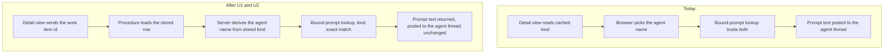

# Work Item Kind Drives the Prompt Template - Plan

## Goal Capsule

- **Objective:** every AI action that writes a work item's body resolves its prompt template from the item's current kind, read server-side, from the prompt catalog.
- **Product authority:** Fizzy #2048 (AC1-AC7, FR1-FR8, and the observability NFR).
- **Open blockers:** none. Both PM/BA gaps listed on the card are already answered by shipped code — see Key Decisions.
- **Authority order:** Fizzy #2048 for behaviour, this Product Contract for scope, repo conventions for how. Where the card and shipped code disagree on a decision the code already made deliberately (kind conversion not re-chaining prompts), the code wins and the card's Out of Scope section agrees.
- **Stop conditions:** stop and ask when the structure guards themselves would have to move rather than the analyzer's headings, or when keeping the document path byte-identical (R10) would require a breaking change to the shared engine's signature that forces its document and scheduled-sweep callers to change.
- **Product Contract preservation:** changed after review. R5 was narrowed and R9 restated; one Key Decision was replaced. The analyzer's move into the prompt catalog is deferred — it is a single model call that chooses each item's kind inside the call, so a per-item catalog lookup has nowhere to run, and the persisted body is already re-drafted through the kind-scoped Clean Spec prompt at approval.

---

## Product Contract

### Summary

Four paths can apply the wrong-kind template to a work item, or apply a template that is not in the catalog at all. This closes them: the server becomes the authority on kind wherever a template is chosen, an explicit prompt that contradicts the item's kind is refused, the backlog analyzer emits bug sections the structure guards can actually see, and the context-update path stops treating every item as a feature.

### Problem Frame

Fabric resolves kind-scoped prompts through `PromptBinding.storyKind`, an exact-match column with no cross-kind fallback. Most callers use it correctly and re-read the item's kind from the database at run time, so the routing system itself is sound.

The failures are at the edges of that system, and they share one shape: a caller that decides the template from something other than the stored kind.

The work item detail view decides in the browser, in three separate places. Each reads the item's kind out of the same client cache, picks the agent name itself, and asks the server to resolve that name. The bound-prompt procedure takes the agent name and kind as free input and never receives a work item id, so it cannot check the claim. Kind can be changed from the roadmap card's kebab menu and from the actions menu, neither of which is the component whose cache those buttons read — verified on staging, where the roadmap card for a feature offers "Change to bug". A reviewer who converts from one surface and regenerates from another gets the old kind's template.

The third of those places is where a reviewer picks a prompt by hand. That prompt is fetched by id in the browser and its text posted straight into the agent thread, so nothing server-side ever compares the chosen prompt's kind scope to the item it will rewrite.

Two further paths never consult kind at all. The backlog analyzer describes a bug's diagnostic sections as inline bold labels rather than markdown headings, and names two of them differently from the structure guards — so the guard that should catch a bug being reformatted into feature shape scores zero matches and cannot fire. The context-update path flattens an item into a description-plus-acceptance-criteria shape before the model sees it, runs a single hard-coded system prompt for features and bugs alike, and runs no destructive-rewrite guard.

The cost is concrete: a converted bug is regenerated into feature-shaped sections, its diagnostic sections are lost, the guard that exists to refuse that rewrite cannot see it, and the reviewer restores the body by hand.

### Key Decisions

**The server owns kind at generation time.** A client may say which item to act on; it may not say what that item is. Every template decision resolves the kind from the stored row in a server request that loads the item, never from client-supplied input; the resolved prompt text is then carried to the agent thread as message text. This is the general form of FR8's "same underlying template-selection logic, not a separate/parallel implementation" — a browser-side copy of the routing rule is a parallel implementation even when it computes the same answer.

**An explicit prompt choice is still checked against the item.** Letting a caller name a prompt directly is a useful affordance and stays. Letting it name one bound to the other kind is the bypass, and is refused.

**The guards decide what a bug body looks like.** Where the analyzer and the structure guards disagree on a section name, the guards win, and the analyzer emits those sections as markdown headings rather than inline labels. The guards are what protect a bug body from a destructive rewrite, and they match on heading lines only — an analyzer that labels its sections in bold disarms them silently while looking correct.

**The analyzer's move into the prompt catalog is deferred.** It is one model call that chooses each proposed item's kind inside the call, so there is no per-item kind to resolve a catalog record against beforehand, and the body that is persisted on approval is already re-drafted through the kind-scoped Clean Spec prompt. The remaining gap is the reviewer-facing proposal text, which is its own change.

**The context-update engine stays shared.** Documents and the scheduled refresh sweep run the same engine as the interactive story path, and that stays true. Kind-awareness is supplied by the story caller, so the document path is unchanged.

**Both of the card's blocking gaps are already answered.** Re-running a prompt when an item's type is converted is out of scope, decided under F-171 and stated in the convert handler's own header; the card's Out of Scope section chose the same. The type control on the AI update approval stage is a separately tracked surface and stays out.

### Requirements

**Kind resolution**

- R1. An AI action that generates or regenerates a work item's body resolves the template from the item's stored kind at the moment the action runs.
- R2. No client supplies the kind, or the derived agent name, for a template decision about an existing work item.
- R3. An explicitly chosen prompt bound to a different kind than the item's is refused, with an error the caller can act on.
- R4. A work item's kind resolves to exactly one of feature or bug before any template lookup; no absent or ambiguous value reaches the resolver.

**Catalog coverage**

- R5. The backlog analyzer resolves a work item's body structure from the prompt catalog's type-scoped creation prompts, falling back to its previous in-code text per kind when a record is unbound.
- R6. The resulting bug body carries its diagnostic sections as markdown headings the structure guards match on.
- R7. The context-update path applies kind-scoped instructions for a work item, resolved from the catalog.
- R8. The context-update path instructs the model to keep a bug's diagnostic sections and to add no feature-narrative sections.

**Behaviour preserved**

- R9. An item whose kind was never changed resolves the same template as before this change.
- R10. The document path and the scheduled refresh sweep through the shared context-update engine are unchanged.
- R11. Converting an item's kind does not itself regenerate or rewrite its body.
  > **Superseded** by the reopened scope of Fizzy #2048 — see
  > `docs/plans/2026-08-06-001-feat-type-conversion-regenerates-spec-plan.md`. Conversion now
  > regenerates the body through the new kind's template. R11 is left in place as the record of
  > what was decided here; it is no longer the behaviour.

**Observability**

- R12. Each body-generating AI action records which prompt key it resolved, for which kind, at which entry point.
- R13. The record distinguishes a resolved catalog prompt from a fallback, so a missing binding is visible rather than silent.

### Key Flows

- F1. Convert from one surface, regenerate from another
  - **Trigger:** a reviewer changes an item's kind from the roadmap card, then regenerates its spec from the already-open detail page.
  - **Steps:** the detail page requests regeneration for that item; the server reads the item's current kind; the server resolves the kind's template; generation runs.
  - **Outcome:** the new kind's template is applied, regardless of what the detail page had cached.
  - **Covered by:** R1, R2, R12

- F2. Reviewer picks a prompt explicitly
  - **Trigger:** a reviewer selects a specific prompt for a maturation action.
  - **Steps:** the browser sends the item id and the chosen prompt id; the server loads the item, compares the chosen prompt's kind scope to the item's kind, and returns the prompt text only when they agree.
  - **Outcome:** a compatible choice is honoured; an incompatible one is refused rather than applied.
  - **Covered by:** R3, R12

- F3. A new ticket is drafted from backlog analysis
  - **Trigger:** analysis proposes a new work item and a reviewer approves it.
  - **Steps:** the analyzer drafts a proposal body whose bug sections are guard-named markdown headings; approval persists the reviewer's final kind and re-drafts the body through the kind-scoped Clean Spec prompt.
  - **Outcome:** the proposal a reviewer reads is guard-visible, and the persisted body carries the approved kind's structure.
  - **Covered by:** R5, R6

### Acceptance Examples

- AE1. Stale cache does not decide the template
  - **Covers R1, R2.**
  - **Given** an item created as a feature, open in a detail view.
  - **When** its kind is changed to bug from a different surface and the detail view's regenerate action is triggered without a refetch.
  - **Then** the bug template is applied.

- AE2. Mismatched explicit prompt is refused
  - **Covers R3.**
  - **Given** an item whose kind is bug.
  - **When** a maturation action names a prompt bound to feature.
  - **Then** the action fails with an error naming the mismatch, and no body is written.

- AE3. Bug proposal is guard-visible
  - **Covers R5, R6.**
  - **Given** a bug proposal drafted by the analyzer.
  - **When** the structure guards inspect the field they read.
  - **Then** they match at least two of its diagnostic sections as markdown headings.

- AE4. Context update keeps a bug a bug
  - **Covers R7, R8.**
  - **Given** a bug with diagnostic sections and connected context that changes its content.
  - **When** the context update runs.
  - **Then** the returned body keeps its diagnostic sections, keeps its stored acceptance criteria, and gains no feature-narrative sections.

- AE5. Documents are untouched
  - **Covers R10.**
  - **Given** a project document.
  - **When** the same context update runs against it, interactively or from the scheduled sweep.
  - **Then** the system string assembled for the model is byte-identical to today's.

- AE6. No-change path is unchanged
  - **Covers R9.**
  - **Given** an item whose kind was never changed.
  - **When** any covered AI action runs.
  - **Then** the same template resolves as before this change.

- AE7. A missing binding never becomes the other kind's template
  - **Covers R13.**
  - **Given** an item whose kind has no bound prompt for the action being run.
  - **When** that action runs.
  - **Then** the clean-spec refresh surfaces its existing error and writes nothing, the context update stays on the engine's existing system prompt, no path substitutes the other kind's prompt, and the miss is recorded.

### Scope Boundaries

Deferred to their own tickets, each a real finding from this investigation, with the file that owns it:

- Converting an item's kind marks nothing stale: the prior body, the QA analysis blob, and the logic summary all continue to present as current. `packages/api/modules/projects/procedures/stories/convert-kind.ts`.
- Duplicate-merge regenerates bodies through kind-agnostic prompts that ask for an acceptance-criteria checklist, imposing a feature shape on merged bugs. `packages/api/modules/projects/procedures/stories/propose-duplicate-merge.ts`.
- The maturation summary digest can keep a pre-conversion digest when neither kind's summary prompt is bound, because both branches fall back to the same default text and the content hash therefore does not move. `packages/api/modules/projects/lib/generate-summary-digest.ts` and `packages/api/modules/projects/lib/seed-maturation-surfaces.ts`.
- The destructive-rewrite guard runs only in the bug direction; a converted item carrying leftover diagnostic sections has no equivalent protection. `packages/temporal/src/lib/structure-guards.ts`.
- The prompt-library read procedure keeps accepting a caller-supplied agent name and kind with no work item id. Nothing in the shipped UI calls it that way after this work, but it stays reachable. `packages/api/modules/prompts/procedures/agents.ts`.

Out of scope, per the card: the type control on the AI update approval stage, the classifier's kind bias, retiring the legacy third work item type, and regenerating existing content on conversion.

### Dependencies / Assumptions

- The card names removal of the legacy third work item type as a blocking dependency. It has already shipped — the enum carries two values and the migration retiring the third is in the tree — so routing is a two-way decision and the dependency is closed.
- The prompt catalog already models kind scoping and resolves without cross-kind fallback, so a missing binding surfaces as an absent prompt rather than a wrong one. No catalog schema change is assumed.
- The structure guards are the authority on what a bug body looks like. Verified during review: the catalog's bug creation prompt still emits all six of the guards' canonical sections, so the guards, the catalog and the maturation prompts already agree — only the analyzer disagrees. If that authority is ever reversed, R5 and R6 invert and the guards move instead.

### Sources / Research

- Fizzy #2048 — acceptance criteria, functional requirements, and the observability NFR.
- `packages/database/prisma/queries/prompts.ts` — the bound-prompt resolver and its no-cross-kind-fallback contract.
- `packages/database/prisma/seed-prompts-only.ts` — the kind-scoped prompt catalog as seeded.
- `apps/web/modules/saas/projects/components/stories/StoryWorkspace.tsx` and `packages/api/modules/prompts/procedures/agents.ts` — the client-side template decision and the procedure that cannot check it.
- `packages/temporal/src/activities/backlog-context/analyze-context.ts` — the single analysis call whose schema lets the model choose each proposed item's kind, and the shared system prompt whose bug section rules use bold labels under two off-canon names.
- `packages/temporal/src/lib/structure-guards.ts` — the canonical bug section names and the destructive-rewrite guard.
- `packages/temporal/src/lib/update-with-context-core.ts` and `packages/api/modules/projects/procedures/stories/update-with-context.ts` — the shared engine, its hard-coded system prompt, and the feature-shaped flattening applied before it.
- `packages/api/modules/projects/procedures/stories/enhance-feature.ts` — the correct server-side pattern to follow, its organization-membership check, and the explicit-prompt branch that bypasses the kind lookup.
- `packages/api/modules/projects/procedures/stories/update-with-context.ts` — the round trip whose outbound headings are also the anchors its reply parser splits on.
- `packages/api/modules/projects/procedures/stories/convert-kind.ts` — the F-171 decision that conversion does not re-chain prompts.
- Staging observation: a feature's roadmap card kebab offers "Change to bug", establishing that conversion and regeneration live in different components.

---

## Planning Contract

### Key Technical Decisions

KTD1. **Fix the resolution step, not the transport.** The Update Full Spec action posts the resolved prompt into an agent thread as message text, and the agent carries no work item identity — so today the browser is the only place that knows the kind. Rather than move the action to the synchronous server path, a new procedure takes the work item id, derives the kind server-side, and returns the prompt text the client already knows how to send. Streaming, diff review, the context prefetch, and the in-flight latches stay untouched.

KTD2. **Do not revive the dormant server path for this.** The maturation procedure already accepts a clean-spec-refresh flag and already resolves kind correctly, but no client passes it. Routing the button there would write straight to the database and drop streaming and diff review — a UX regression traded for a routing fix. The flag stays as-is; U7 gives it the kind assertion it never had.

KTD3. **Reject a mismatched explicit prompt rather than silently re-resolving.** The repo already models this exact shape for drafting stages: a cross-column invariant the schema cannot express, layered as a validator that throws on a stale client. The prompt-kind guard mirrors it — same error class, same placement, same reasoning.

KTD4. **The analyzer change is a heading fix, not a catalog migration.** The analyzer is a single model call that chooses each proposed item's kind inside the call, so there is no per-item kind to resolve a catalog record against, and its section rules live in one shared system prompt rather than in per-kind templates. What is broken there is narrow and provable: the bug sections are written as inline bold labels under two names the structure guards do not carry, and the guards match only on heading lines. Fixing the names and the heading level restores the guard; moving the bodies into the catalog is a separate change.

KTD5. **Kind-awareness enters the shared context-update engine through its callers.** The engine keeps one system prompt and gains an optional caller-supplied instruction addendum. Work item callers resolve a kind-scoped addendum; document callers pass nothing and assemble byte-identically to today. This is what keeps R10 provable rather than merely intended.

KTD6. **Observability extends an existing log shape.** Prompt resolution is already logged with a stable field set at several sites. New and changed sites use the same fields rather than inventing a parallel shape, so a single query answers "which template ran, for which kind, from where". Workflow code uses the workflow logger; activity and procedure code uses the shared one.

### High-Level Technical Design

Who decides the kind for the Update Full Spec action, before and after:

Where each in-scope path gets its kind:

| Path | Kind source today | After |
|---|---|---|
| Update Full Spec | browser cache | stored row, server-side (U1, U2) |
| Stage-transition Enhance | browser cache | stored row, server-side (U1, U2) |
| Prompt a reviewer picks by hand | fetched by id in the browser, never checked | server-resolved, refused on kind mismatch (U1, U2, U3) |
| Context update on a work item | not consulted | stored row, drives a catalog addendum (U4) |
| Context update on a document | n/a | unchanged, byte-identical (U4) |
| Bug proposal from backlog analysis | n/a | guard-named markdown headings (U5) |

### Assumptions

- The structure guards are the authority on what a bug body looks like. Their canonical section names are documented as taken from the catalog's bug creation prompt, and that prompt still emits all six — verified in the seed file during review — so the guards and the catalog already agree and only the analyzer disagrees with both.
- No prompt record is edited. Two new kind-scoped context-update records are added; verified during review that seeding does create new keys in existing environments and only skips edits to existing ones, so adding keys is safe while editing them would not be.
- The langgraph agent stays kind-unaware. Nothing here gives it work item identity.

### Sequencing

Smallest-risk first. U1 is additive and dead until U2 uses it. U4 carries the regression risk — one engine, three callers — and lands behind a pinning test written before the engine is touched. U5 is small but changes what every analysis proposal looks like, so it lands with its own guard assertion. U6 lands after the routing settles so it covers the final set of sites.

Landing order: U1 → U2 → U3 → U4 → U5 → U6 → U7. Each unit's own Dependencies line remains the authority on what actually blocks what — U3, U4 and U5 declare none.

---

## Implementation Units

### U1. Server-resolved prompts for the work item detail view

- **Goal:** one procedure returns the prompt a detail-view action should run, choosing it from the stored kind.
- **Requirements:** R1, R2, R3, R4
- **Dependencies:** none
- **Files:**
  - `packages/api/modules/projects/procedures/stories/resolve-story-prompt.ts` (new)
  - `packages/temporal/src/lib/clean-spec-agent-for-kind.ts` (new — lives here, not in the api package: `@repo/api` depends on `@repo/temporal` and not the reverse, so an api-side helper could not be called from `create-story-from-proposal.ts` without inverting that edge)
  - `packages/api/modules/projects/procedures/stories/enhance-feature.ts`
  - `packages/temporal/src/lib/create-story-from-proposal.ts`
  - `packages/api/modules/projects/router.ts`
  - `packages/api/modules/projects/procedures/stories/__tests__/resolve-story-prompt.test.ts` (new)
- **Approach:** take the project, work item, organization, and either a target stage or an explicitly chosen prompt id. Load the item. Derive the agent name from its stored kind. Resolve the binding and return the prompt text, the resolved key, the kind the server decided, and the lowercase display word the message builder needs. Accept no kind and no agent name from the caller. When nothing is bound, return an unresolved result rather than throwing, so the client keeps its current error message. Extract the kind-to-agent mapping into one exported helper and have the two existing server-side copies call it, so this unit removes a duplicate rather than adding a third.
- **Guard:** scope with the project-read permission and, when the resolved organization id is truthy, an explicit organization-membership check — the tenancy helper returns a caller-supplied organization id verbatim, and prompt records are tenant-scoped, so without the membership check this procedure would return another tenant's customized prompt text.
- **Patterns to follow:** the kind-scoped resolution in the maturation enhance procedure; the explicit membership check the same procedure performs.
- **Test scenarios:**
  - Covers AE1. A stored bug resolves the bug clean-spec agent, and the caller supplies no kind.
  - A stored feature resolves the feature clean-spec agent.
  - A target stage resolves the stage-scoped binding for the stored kind.
  - Covers AE7. An unbound kind returns an unresolved result, does not throw, and does not fall back to the other kind's prompt.
  - An organization id the caller is not a member of is rejected rather than resolving that organization's bound prompt.
  - A work item id from a different project is rejected as not found.
  - The mapping helper is the only source of the kind-to-agent names.
- **Verification:** the procedure returns the template for the stored kind with no kind in its input, and no second copy of the mapping remains.

### U2. The detail view stops choosing templates

- **Goal:** no template decision is left in the browser.
- **Requirements:** R1, R2
- **Dependencies:** U1
- **Files:**
  - `apps/web/modules/saas/projects/components/stories/StoryWorkspace.tsx`
  - `apps/web/modules/saas/projects/components/stories/__tests__/` (new spec for the refresh and enhance actions)
- **Approach:** replace all three browser-side resolutions with the U1 call — the clean-spec refresh handler, the stage-transition enhance handler, and the branch that fetches a hand-picked prompt by id. Delete the client-side agent-name branches. Take the word used in the message from the server's response so the message and the template agree. When the server's resolved kind differs from the cached one, invalidate the work item query before appending the message, so the surrounding chrome stops contradicting the spec being generated. Leave the message builder, the thread append, the context prefetch, and the in-flight latches untouched.
- **Test scenarios:**
  - Covers AE1. With a cached kind that disagrees with the server, the prompt sent on the refresh path is the server's.
  - Covers AE1. The same holds on the stage-transition path.
  - A hand-picked prompt is resolved through the server rather than fetched by id in the browser.
  - The message wording matches the kind the server resolved.
  - A resolved kind that differs from the cache invalidates the work item query.
  - Covers AE7. An unresolved prompt still surfaces the existing error and starts no agent run.
  - The in-flight latch still blocks a second concurrent run.
- **Verification:** no agent name or kind branch remains in the component, on any of the three paths.

### U3. A hand-picked prompt must match the item's kind

- **Goal:** a prompt bound to the other kind is refused wherever it can be chosen.
- **Requirements:** R3
- **Dependencies:** U1
- **Files:**
  - `packages/api/modules/projects/lib/validate-prompt-for-kind.ts` (new)
  - `packages/api/modules/projects/lib/__tests__/validate-prompt-for-kind.test.ts` (new)
  - `packages/api/modules/projects/procedures/stories/resolve-story-prompt.ts`
  - `packages/api/modules/projects/procedures/stories/enhance-feature.ts`
- **Approach:** mirror the existing stage-for-kind validator — same error class, same message shape, same directory. Deny by default: only a binding whose kind scope is explicitly null counts as kind-agnostic, and a prompt with no binding at the requested document type, or whose only matching binding carries the other kind, is refused. Call it on both surfaces a prompt id can arrive through: the U1 resolver the browser now uses, and the maturation procedure's own explicit-prompt branch. The thrown message names the item's kind, the prompt's bound kind, and the recovery action, because the caller renders that message to the reviewer verbatim.
- **Patterns to follow:** `packages/api/modules/projects/lib/validate-stage-for-kind.ts`, including its comment convention explaining the cross-column invariant.
- **Test scenarios:**
  - Covers AE2. A bug with a feature-bound prompt is refused and writes nothing.
  - A matching prompt proceeds.
  - A prompt whose binding kind scope is null is allowed for both kinds.
  - A prompt with no binding at the requested document type is refused rather than treated as kind-agnostic.
  - A prompt bound to the other kind at a different document type is refused.
  - The refusal message names both kinds.
  - Omitting a prompt id leaves the existing path unchanged.
- **Verification:** neither surface can run a template scoped to the other kind.

### U4. Context update becomes kind-aware without moving the document path

- **Goal:** a work item's context update uses catalog instructions for its kind, and stops being handed a feature-shaped body.
- **Requirements:** R7, R8, R10
- **Dependencies:** none
- **Files:**
  - `packages/temporal/src/lib/update-with-context-core.ts`
  - `packages/api/modules/projects/procedures/stories/update-with-context.ts`
  - `packages/api/modules/projects/procedures/documents/update-with-context.ts`
  - `packages/temporal/__tests__/update-with-context-core.test.ts`
  - `packages/api/modules/projects/procedures/stories/__tests__/update-with-context.test.ts` (new)
- **Approach:** give the engine an optional caller-supplied instruction addendum, appended in a fixed position. The work item caller resolves a kind-scoped addendum from the catalog and passes it; document callers pass nothing and the assembled system string is unchanged. Leave the `## Description` / `## Acceptance Criteria` wrapper in place. Those two headings are the only structure the caller adds, and both are the anchors it splits the model's reply on — removing either would parse a bug's returned acceptance criteria as empty and propose wiping the stored column. What changes a bug's outcome is the addendum, which tells the model to preserve the diagnostic sections inside the body and to introduce no feature-narrative sections.
- **Execution note:** pin the document path first — write the byte-equality test against today's assembled system string before changing the engine, so the regression cannot land silently.
- **Test scenarios:**
  - Covers AE5. With no addendum the assembled system string equals a snapshot of today's.
  - Covers AE5. The scheduled refresh caller passes no addendum.
  - Covers AE5. The interactive document procedure passes no addendum.
  - Covers AE4. A bug with stored acceptance criteria round-trips them unchanged through the reply parser.
  - Covers AE4. A bug run instructs the model to preserve diagnostic sections and to add no feature-narrative sections.
  - Covers AE4. A bug run appends the bug addendum; a feature run appends the feature one.
  - Covers AE7. An unbound addendum leaves the engine on its existing system prompt rather than substituting the other kind's.
- **Verification:** the document path's request is unchanged, and a bug survives a context update with its acceptance criteria intact.
- **Risk:** highest regression exposure in this plan — one engine, three callers, one of them a scheduled sweep with no user watching, and a round trip whose write-back depends on the very headings this unit changes.

### U5. The analyzer's bug sections become guard-visible

- **Goal:** the structure guard can recognise a bug proposal as bug-shaped.
- **Requirements:** R5, R6
- **Dependencies:** none
- **Files:**
  - `packages/temporal/src/activities/backlog-context/analyze-context.ts`
  - `packages/temporal/__tests__/analyze-context-prompt.test.ts`
- **Approach:** in the analyzer's shared system prompt, instruct the bug body to use markdown headings for its diagnostic sections rather than inline bold labels, and rename the two that disagree with the structure guards so the names match. Change nothing about how the proposal is generated or approved — this unit only alters the shape the model is told to emit.
- **Test scenarios:**
  - Covers AE3. A bug proposal body carries at least two of the guards' diagnostic sections as markdown headings.
  - Covers AE3. The destructive-rewrite guard scores a bug proposal above its firing threshold rather than zero.
  - A feature proposal's sections are unchanged.
- **Verification:** the guard that protects a bug body from being reformatted can now see the analyzer's own output.

### U6. Record what was resolved

- **Goal:** each body-generating action states which template it used, for which kind, from where.
- **Requirements:** R12, R13
- **Dependencies:** U1, U3, U4, U5
- **Files:**
  - `packages/api/modules/projects/procedures/stories/resolve-story-prompt.ts`
  - `packages/api/modules/projects/procedures/stories/enhance-feature.ts`
  - `packages/api/modules/projects/procedures/stories/update-with-context.ts`
  - `packages/temporal/src/lib/update-with-context-core.ts`
  - `packages/temporal/src/lib/reanalyze-body-by-kind.ts`
  - `packages/temporal/src/lib/create-story-from-proposal.ts`
- **Approach:** extend the field set already used for prompt-resolution logging rather than adding a second shape. Distinguish a catalog hit from a fallback or a safe hold. Use the workflow logger inside workflow code and the shared logger everywhere else. Log keys, kinds, entry point and resolution source only — never resolved prompt content or the U4 instruction addendum. Any site not listed above is outside this unit, including the duplicate-merge and maturation-summary fallbacks deferred under Scope Boundaries.
- **Patterns to follow:** the existing resolution log lines in the bound-prompt procedure and the maturation enhance procedure.
- **Test scenarios:**
  - A resolved catalog prompt logs its key and the kind it was scoped to.
  - Covers AE7. A fallback logs a source that distinguishes it from a catalog hit.
  - Covers AE7. A safe hold on an unbound prompt is visible rather than silent.
  - No log line carries prompt content.
- **Verification:** one query over the logs answers which template ran for a given work item and why.

### U7. Close the acceptance gaps no single unit owns

- **Goal:** the two paths that were already correct but unasserted get their assertions.
- **Requirements:** R1, R9, R11
- **Dependencies:** U1, U2, U3, U4, U5
- **Files:**
  - `packages/api/modules/projects/procedures/stories/__tests__/enhance-feature.test.ts`
  - `packages/api/modules/projects/procedures/stories/__tests__/convert-kind.test.ts`
- **Approach:** add the missing kind assertion to the maturation enhance tests, which today cover prompt assembly but never assert the bug template is chosen for a bug. Add a case proving that changing an item's kind and then running a generation uses the new kind's template, and a case proving the conversion itself rewrites nothing.
- **Test scenarios:**
  - Covers AE6. A bug reaching the clean-spec refresh resolves the bug template.
  - A converted item's next generation uses the new kind's template.
  - Covers R11. Conversion alone leaves the body and its acceptance criteria untouched.
- **Verification:** the maturation clean-spec path asserts the stored kind's template, and conversion alone rewrites nothing.

---

## Verification Contract

| Gate | Command | Applies to |
|---|---|---|
| Types | `pnpm type-check` | all units |
| Lint and format | `pnpm lint` | all units |
| API tests | `pnpm --filter @repo/api test` | U1, U3, U4, U6, U7 |
| Temporal tests | `pnpm --filter @repo/temporal test` | U4, U5, U6 |
| Web tests | `pnpm --filter web test modules/saas/projects/components/stories` | U2 |
| Worker reload | restart the temporal worker through the Aspire tooling after staging | U4, U5, U6 |
| Manual check | on a work item, convert the kind from the roadmap card, then from an already-open detail view run Update Full Spec, a stage Enhance, and a hand-picked prompt | U2, U3 |

The document-path byte-equality test in U4 is the release gate for R10: if it is absent or weakened, the unit is not done.

---

## Definition of Done

Global:

- Every acceptance example in the Product Contract maps to at least one passing test.
- The document path and the scheduled refresh produce an unchanged request through the shared engine, proven by test rather than inspection.
- No template decision on the paths covered by U1-U5 is made from caller-supplied input. The prompt-library read procedure remains reachable by design and is named under Scope Boundaries.
- A changeset exists bumping only `fabric-app` as a patch, with a one-sentence headline on the first line and the context below a blank line.
- No real person, organization, host, or internal URL appears in code, comments, runtime strings, fixtures, tests, the changeset, or the commit message; the ticket is cited by number.
- Exploratory or abandoned code from the run is removed rather than left in the diff.

Per unit:

- U1: resolves per stored kind with no kind in its input; a non-member organization id is refused; one mapping helper remains and the previous copies call it.
- U2: no agent-name or kind branch remains in the component on any of its three paths; the stale-cache case is covered on both generation paths.
- U3: a cross-kind prompt is refused on both surfaces a prompt id can arrive through, and an unbound prompt is refused rather than waved through.
- U4: document path byte-identical; a bug keeps its acceptance criteria through the round trip and is told to preserve its diagnostic sections.
- U5: the destructive-rewrite guard scores the analyzer's own bug output above its firing threshold.
- U6: catalog hits, fallbacks, and safe holds are distinguishable in the logs, and no log line carries prompt content.
- U7: the previously unasserted bug-template path is covered.

---
