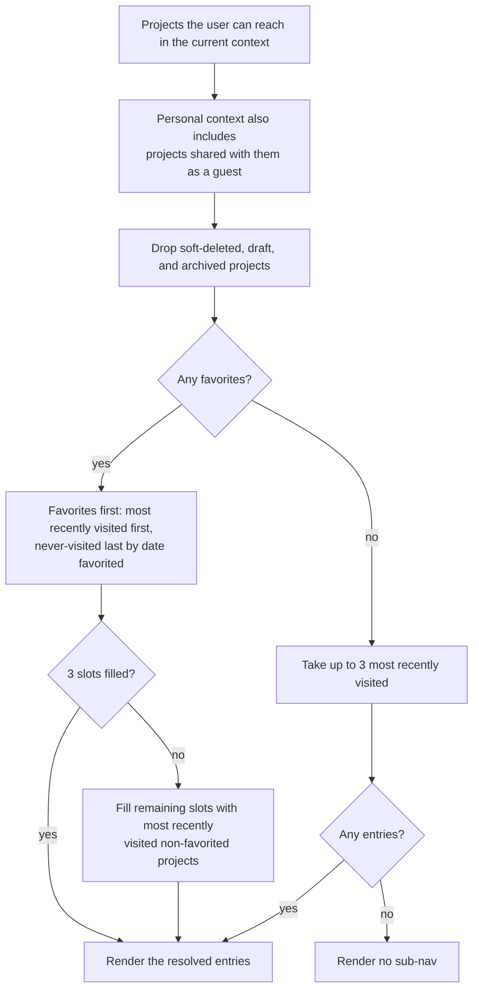
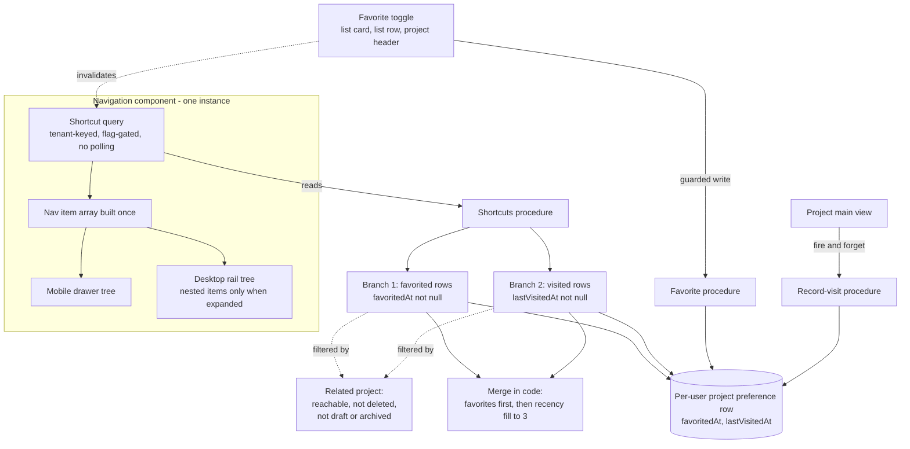

# Quick-Access Recent and Favorited Projects in Navigation - Plan

## Goal Capsule

- **Objective:** put up to three project shortcuts under the Projects navigation item so a user reaches a project they work in daily without passing through the projects list page.
- **Product authority:** Fizzy #1694. PM decisions recorded on the card are binding. The mixed-vs-single display mode was delegated to development and is resolved here.
- **Execution profile:** one branch, one PR. Units are dependency-ordered; the database and API layers land before any UI reads them.
- **Stop conditions:** stop and ask if the favorite toggle turns out to need a project-write permission rather than a read permission, or if extending the per-user project preference row conflicts with an in-flight schema change.
- **Tail ownership:** the flag ships off. Turning it on is a separate, deliberate act through the admin flag panel.
- **Open blockers:** none.

**Product Contract preservation:** changed — R9, R13, R16, R19, R20, R21, R22 rewritten, R24–R28 added. R16 now admits guest-held projects into the personal-context sub-nav, mirroring the existing "Shared with me" behavior on the projects list; without it the feature is permanently empty for project-scoped guests. R21 previously required an onboarding registry entry declaring the feature flag, which the registry cannot express — it resolves flags at build time from inlined environment literals, while this feature uses the runtime flag registry. R13 and R9 gained the eligibility qualifiers that flow analysis showed were load-bearing. R19, R20 and R22 were rewritten during review — R19/R20 split one flag into two so either surface can be rolled back alone, and R22 extends the announcement contract to cover the favorited state. R24–R28 record decisions the brainstorm left open, R28 among them deliberately: recording begins at ship regardless of the flag, so deferring the retention position would have settled it silently.

---

## Product Contract

### Summary

Add a sub-navigation under the Projects item listing up to three project shortcuts — the user's favorited projects first, with any remaining slots filled by their most recently visited projects.
Add a favorite toggle on the projects list and the project header, and per-user visit tracking, which the product does not have today.
Everything a user can see ships behind a runtime feature flag that is off by default.

### Problem Frame

Reaching a project today costs a detour. The Projects item leads to the list page, and the list page is where the user picks the project — every time, including for the two or three projects they open all day. The cost is small per trip and paid constantly, which is the shape that makes it worth removing rather than tolerating.

The navigation already knows how to express this. The sidebar supports nested items, and one entry uses them today. What is missing is not a navigation capability but the data: nothing in the product records which projects a given user opens, and nothing lets a user mark a project as one they care about.

There is one near-miss worth naming so planning does not rediscover it as an opportunity. A per-user recent-project list exists in the schema and is populated, but only when an orchestrator agent run is bound to a project. It records what agents were pointed at, not what a person navigated to, and it belongs to the AI memory subsystem. Reading it into navigation would show users a list they never built.

### Key Decisions

- **Favorites and recents mix rather than switch.** The requirements draft had favorites replace recents outright, which means the first star a user adds collapses their shortcut list to a single entry and removes quick access to everything else they are working in. That inverts the feature's purpose for the exact user it targets. Favorites take the top slots; recents fill the rest, so the list is always as full as the user's project set allows.

- **Reuse the existing nested-navigation pattern; do not build a hover flyout.** The sidebar already renders nested items for one navigation entry, and it renders them only when the sidebar is expanded. The sidebar is expanded by default and collapsing is an opt-in the user has to choose and that persists per browser. Building a new flyout so the collapsed rail could also show shortcuts would add an interaction pattern the product does not otherwise have, for users who opted out of labels.

- **Track visits in navigation's own store, not the orchestrator's recent-project list.** That list records agent runs, not navigation, and is owned by a subsystem with unrelated lifecycle concerns.

- **The feature flag gates the interface, not the recording.** Visits are recorded whether or not the flag is on. The requirements draft assumed tracking begins at activation, which would make flag-flip day show every user an empty sub-nav. Recording early costs one write per project open and makes the first thing users see a list that already reflects their work.

- **Guests are in scope, following the projects list's existing precedent.** A project-scoped guest is shown the personal navigation, but every project they can reach belongs to a host organization. Strict tenant exclusivity would leave them a permanently empty sub-nav — for users whose entire product usage is one shared project. The projects list already resolves this by surfacing guest-held projects in personal context under "Shared with me", and the project card already builds its link from the project's own organization slug rather than the navigation's base path. The sub-nav follows both.

- **Three entries, fixed.** Carried from the card as a v1 decision, not user-configurable.

- **The favorite control appears in both renderings of the projects list.** The page has a grid/list view toggle, and the card names only "the project card". A star present in one view and absent in the other reads as a bug.

### Requirements

**Sub-nav composition and display**

- R1. The Projects navigation item presents a sub-navigation of up to three project shortcuts.
- R2. The sub-nav lists the user's favorited projects first, ordered by most recent visit, then fills any remaining slots with their most recently visited non-favorited projects.
- R3. A favorited entry is visually distinguishable from an entry that filled a slot by recency.
- R4. When fewer than three projects are eligible, the sub-nav shows only those; it renders no placeholder slots.
- R5. When the user has no favorited and no visited projects, the sub-nav is not rendered at all.
- R6. Activating a sub-nav entry navigates directly to that project's main view.
- R7. The sub-nav renders everywhere the navigation renders nested items — the expanded desktop sidebar and the mobile navigation drawer — and is absent from the collapsed icon rail, matching the existing nested-item behavior.
- R24. A project is eligible for the sub-nav only when it is not soft-deleted and its status is neither draft nor archived. Completed projects stay eligible.
- R25. When the user is viewing one of the listed projects, that shortcut is marked as the current page.

**Favoriting**

- R8. A user can mark and unmark any project they can access as a favorite.
- R9. The favorite control is available on the projects list in both its grid and list renderings, and in the project header.
- R26. The favorite control is hidden for soft-deleted projects and while the projects list is in selection mode.
- R10. Favorites are per-user; one user's favorites are never visible to another user.
- R11. Toggling a favorite updates the sub-nav in the same tab without a page reload.
- R12. When a user has more than three favorites, the three shown are the most recently visited among them; favorites never visited sort last, by when they were favorited.

**Visit tracking**

- R13. Opening a project's main view records a visit for that user, and the recording is authorized server-side so a project the user cannot read — or one that does not exist — never produces a visit.
- R14. Visit recording runs regardless of the feature flag's state.
- R15. Visit recording never blocks or delays the page that triggers it, and a failed recording is silent.

**Isolation, access, and resilience**

- R16. Favorites and visits are per-user and resolve against the tenant context the user is currently in: organization context surfaces that organization's projects, personal context surfaces personal projects plus projects shared with the user as a guest. A guest shortcut links into its host organization.
- R17. A project that has been deleted, or that the user has lost access to, does not appear in the sub-nav.
- R18. If favorites or recents data fails to load, navigation still renders and the sub-nav degrades to absent rather than surfacing an error.

**Rollout**

- R19. The sub-nav and the favorite control are gated behind two independent runtime feature flags, both off by default, so either surface can be disabled without the other.
- R20. With both flags off, the navigation and the projects list render exactly as they do today, and the sub-nav's data is not fetched.
- R21. The onboarding drift guard passes without modification: the sub-nav introduces no new onboarding anchor and no registry entry.

**Accessibility**

- R22. Sub-nav entries are reachable and operable by keyboard, and screen readers announce them as navigation links to a named project, including whether the entry is a favorite.
- R23. The favorite control carries an accessible name identifying both the action and the project, and communicates its on/off state.

**Data lifetime**

- R28. A visit timestamp is a single overwritten marker per user-project pair, not a history of opens, and it is retained for as long as both the user and the project exist. Deleting either removes it. No separate expiry applies, and this is a decided position rather than an unexamined default.

**Error behavior**

- R27. Every denial on the two project-id-taking mutations is indistinguishable from every other: a project that does not exist, one in a tenant the caller has no relationship with, and one the caller's role cannot reach all produce the same response with the same message and no payload. Neither endpoint may be used to learn whether a project id exists.

### Sub-nav resolution

How the three slots are filled, for any user in any tenant context:

### Key Flows

- F1. Reach a recently visited project
  - **Trigger:** user with visit history and no favorites opens any page in the app.
  - **Steps:** the Projects item shows up to three recent projects; the user activates one; the app opens that project's main view.
  - **Covered by:** R1, R2, R6

- F2. Favorite a project and see the sub-nav change
  - **Trigger:** user activates the favorite control on the projects list or the project header.
  - **Steps:** the project is marked as the user's favorite; the sub-nav re-resolves with that project in a top slot; remaining slots stay filled by recents.
  - **Outcome:** the shortcut list never shrinks as a result of favoriting.
  - **Covered by:** R2, R8, R9, R11

- F3. Unfavorite the last favorite
  - **Trigger:** user removes their only favorite.
  - **Steps:** the sub-nav re-resolves to three most recently visited projects.
  - **Covered by:** R2, R8, R11

- F4. First run for a new account
  - **Trigger:** a user who has never opened a project signs in.
  - **Steps:** nothing is eligible; the Projects item renders with no nested entries.
  - **Covered by:** R5

- F5. Guest reaches their shared project
  - **Trigger:** a user whose only access is an accepted project membership in someone else's organization signs in.
  - **Steps:** they are shown the personal navigation; the sub-nav resolves their guest-held project; activating it opens the project inside its host organization.
  - **Covered by:** R6, R16

### Acceptance Examples

- AE1. **Covers R2.** Given a user with 1 favorite and 5 visited projects, when the sub-nav renders, then the favorite occupies the first slot and the two most recently visited non-favorited projects fill the remaining two.
- AE2. **Covers R2, R12.** Given a user with 5 eligible favorites, when the sub-nav renders, then it shows the 3 favorites with the most recent visits and no recents-fill entries.
- AE3. **Covers R12.** Given a user with 4 favorites of which 2 have never been visited, when the sub-nav renders, then the 2 visited favorites rank first and the more recently favorited of the unvisited two takes the third slot.
- AE4. **Covers R4.** Given a user who has visited exactly 1 project and has no favorites, when the sub-nav renders, then it shows 1 entry and no empty slots.
- AE5. **Covers R5.** Given a user with no favorites and no visits, when the Projects item renders, then no nested entries appear beneath it.
- AE6. **Covers R13.** Given a user opening a project's main view, when the page loads, then that project moves to the front of their recency order.
- AE7. **Covers R16.** Given a user with favorites in an organization context, when they switch to their personal context, then the sub-nav shows only their personal-context entries.
- AE8. **Covers R17.** Given a project in a user's sub-nav that is then deleted, when the sub-nav next resolves, then that project is absent and its slot is refilled.
- AE9. **Covers R14, R19, R20.** Given the feature flag is off, when a user opens a project, then the visit is recorded, no sub-nav appears, and no shortcut request is issued.
- AE10. **Covers R18.** Given the favorites and recents data fails to load, when navigation renders, then every other navigation item works and no error surfaces to the user.
- AE11. **Covers R10.** Given two users in the same organization with different favorites, when each opens the app, then neither sees the other's entries.
- AE12. **Covers R24.** Given a user with 5 favorites — 2 active, 1 completed, 1 archived, 1 draft — when the sub-nav renders, then it shows the 2 active and the completed one, and neither the archived nor the draft project appears.
- AE13. **Covers R13.** Given a user opening a project id they have lost access to, when the not-found view renders, then no visit is recorded for that project.
- AE14. **Covers R16.** Given a guest whose only access is one project in a host organization, when the sub-nav renders in their personal navigation, then it shows that one project and its link resolves inside the host organization.
- AE15. **Covers R5.** Given a user whose only stored rows predate this feature — a dismissed welcome widget, a saved board view — and who has neither favorited nor opened a project since, when the sub-nav resolves, then it is empty.
- AE16. **Covers R27.** Given a caller who submits a project id that does not exist and a project id belonging to a tenant they have no relationship with, when each request returns, then the two responses are identical.
- AE17. **Covers R11, R13.** Given a favorite toggled while a visit write for the same project is still in flight, when both settle, then the favorite holds and neither call surfaces an error.

### Scope Boundaries

- Favoriting anything other than a project — features, documents, tickets.
- Favorites shared across a team or workspace; favorites stay per-user.
- A configurable number of sub-nav entries; three is fixed for v1.
- Reordering favorites by hand.
- A dedicated favorites page or section.
- Surfacing favorites or recents anywhere other than the Projects sub-nav.
- Favoriting several projects in one action.
- A hover flyout that would show shortcuts in the collapsed icon rail.
- Cross-tab synchronization. A favorite toggled in one tab leaves another tab's sub-nav stale until that tab refetches. The product has no cross-tab state channel today, and building one for this feature is disproportionate.

#### Deferred to Follow-Up Work

- A Get started drawer entry for the sub-nav. The drawer's registry resolves feature gates from build-time environment literals, while this feature uses the runtime flag registry; declaring the gate in the drawer would require either a second source of truth for the same flag or teaching the registry to consume runtime values. Neither belongs in this change. Revisit when the flag becomes default-on.
- A time-based expiry for visit timestamps. R28 decides the position: retention is bounded by the lifetime of the user and the project, and nothing shorter applies. Adding an age-based sweep later is a scope addition, not a gap this plan leaves open.
- Extracting the shared project access predicate. It exists in two near-identical shapes across eight call sites with no test pinning them together; consolidating it is a refactor of project authorization and does not belong in a feature branch.

### Dependencies / Assumptions

- The sidebar's nested-item pattern is the integration point. If navigation is restructured, the sub-nav moves with it rather than being redesigned.
- Project access is already modelled and queryable — ownership or an accepted, unexpired membership — so R17 reuses the existing predicate rather than defining a new one. The guest path has its own existing query, used by the projects list.
- Navigation already fetches data on every page through three existing shell widgets. This query adds a fourth consumer to that budget rather than introducing fetching where there was none, so the risk is incremental load, not a new class of behavior.

### Success Criteria

- Navigation render time does not regress measurably; the sub-nav's data must not put a blocking request in the path of every page, and must not be fetched at all while the flag is off.
- With both flags off, no user-visible change anywhere in the product.
- After enabling, the feature demonstrably removes the detour it targets: the share of project opens arriving through a sub-nav shortcut rather than the projects list, read from the visit data and per-route request counts the feature already produces. Every other criterion here is a non-regression check; without this one nothing tells anyone whether the feature worked, and the default-on decision would rest on nothing.
- The onboarding drift guard, the permission-coverage gate, and the tenant-isolation check pass without being weakened.

---

## Planning Contract

### Key Technical Decisions

- KTD1. **Extend the existing per-user project preference row rather than adding favorite and visit tables.** That row is already keyed uniquely on project and user, cascades on both project and user delete, and is already reachable through the query barrel. Two nullable timestamp columns — one for when the project was favorited, one for the last visit — carry the whole feature. Dedicated tables would each need a policy registration, a tenant-category decision, and a barrel export. Row lifecycle is a change of degree, not kind: the table already gains a row whenever a member dismisses the welcome widget or saves a board view. What this decision does **not** buy is tenant scoping — see KTD2.

- KTD2. **The tenant boundary is the project set, never the preference row.** The preference model carries an organization column, but it is a denormalized copy of the project's organization, written by the existing writers and never derived from the reader's context. It cannot scope this feature: a guest's row on a host-organization project carries that host organization, while the guest browses in personal context, so any read filtering on the column drops their own row and the guest sub-nav is empty forever. Writing null instead inverts the bug — an organization-owned project would surface in personal context. So the resolution reads preference rows keyed on user and project alone, and derives every tenant guarantee from whether the project itself is reachable. The column is still written, matching the existing writers, so rows stay consistent; it is never a filter. This matters because the model's own tenant-category registration argues the opposite, and an implementer reading that registration will do the wrong thing.

- KTD3. **Resolve the sub-nav through a client query keyed on tenant context, not through a server-resolved layout prop.** The layout that could hand data down wraps both the personal and organization route segments, so it cannot see the organization slug and falls back to the session's active organization — a value shared across browser tabs. Its own source comments the hazard. The general rule, worth reusing: tenant-independent shell values may ride the layout's payload, as the feature flags do; tenant-dependent values may not. A feature-module hook consumed by the always-mounted shell is the established shape here — the job-count badge and the onboarding state already work this way, and the navigation already imports from four feature modules.

- KTD4. **Build the shortcut list once, in the navigation component's body.** The navigation renders its item tree twice — a mobile drawer and a desktop rail hidden by CSS rather than by a conditional — but the item array itself is already assembled once in the component body, and the shortcut list is a derived structure rather than a per-item value. Request duplication is not the reason: the query cache deduplicates by key, which this repo documents for two co-mounted shell widgets. The reason is that there is no per-item seam to put it in.

- KTD5. **The query does not poll.** It fetches once per tenant per session and is invalidated by the favorite mutation. A polling query in the app shell would have to be registered as a passive poll so it does not count as user activity in the last-seen middleware, and it would add request pressure to an origin that already runs several long-lived presence connections. Gate the query itself on the feature flag, not only the render, so a default-off flag costs no request. The visit recorder is user-initiated and correctly stays out of the passive-poll list.

- KTD6. **Resolve from the user's preference rows outward, not from their accessible projects inward.** Starting from every project the user can reach means loading an entire project list on every page to pick three. Starting from the user's own preference rows bounds the candidate set to something already indexed per user, and applies eligibility, access, and tenant context as a filter on the related project. Ordering is an explicit two-branch merge in code — favorites first, then recency fill — because no single database ordering can express it.

  The personal-context project filter is itself a two-arm union, and both arms must be written out. Mirroring the list predicate alone pins the organization to empty and drops every guest-held project, leaving the guest requirement permanently unsatisfiable; dropping that pin instead lets a full member's organization projects surface in their personal sub-nav, which the tenant-switch acceptance example forbids. Arm one is the personal arm: no organization, plus owner or accepted member. Arm two is the guest arm: an organization is present, the caller holds an accepted and unexpired project membership, and the caller is **not** a member of that organization — the same exclusion the existing guest-projects query carries. Organization context uses the list predicate unchanged.

- KTD7. **Both project-id mutations use the object-level project permission decorator, not the organization-role one.** The organization-role decorator performs no check on the caller-supplied project id and returns unconditionally in personal context; the sibling preference procedure survives that only because its handler re-checks by hand, and that hand-check fails for guests. The object-level decorator resolves effective permissions for the specific project and carries the guest grant the feature depends on.

- KTD8. **Favoriting requires read permission, not update permission.** Favoriting changes a per-user preference, not the project, so a viewer must be able to do it. The sibling precedent splits on level: the roadmap-view and decisions-view preferences write under read permission, while the kanban preference writes under update permission because the path it stores feeds a command-line token flow rather than a view preference. This feature is the former. Take the level from those siblings and nothing else — all three share the organization-role decorator and hand-rolled re-check that KTD7 replaces.

- KTD9. **Every denial returns the same response.** The object-level decorator distinguishes a missing project from an unreachable one, which would let any authenticated user probe project ids across tenants on two brand-new endpoints. Normalize both to one shape. The decorator throws from middleware, before the handler body runs, so normalization cannot live in the handler — it is a small local middleware chained **ahead** of the decorator that catches both denial shapes and rethrows one fixed response. Both mutations also bound their call rate: they are client-driven, unbounded, and the recorder's failures are silent by design, so abuse would otherwise leave no trace in the interface. There is no composable rate-limit middleware in this repo — the pre-composed rate-limited procedure builds on the non-tenant base and has no call sites — so follow the two procedures that actually rate-limit today and call the rate-limit helper directly at the top of each handler, keyed per user and path.

- KTD10. **Both writes are guarded conditional updates, not plain upserts.** The favorite toggle and the visit recorder share one row. A plain upsert lets a favorite pressed during an in-flight visit write fail on a unique violation and roll back for no visible reason, and lets two concurrent visit writes commit out of order so recency moves backwards. Update conditionally, and fall back to create only when nothing matched. On a create collision, **re-run the conditional update rather than returning success** — bounded by a small retry count. Treating the collision as success looks right and is not: when no row exists yet, both writers fall through to create, and the loser silently discards its own field, so a user sees a filled star and a success response while the favorite was never stored. The visit write also carries a monotonic guard so an older timestamp never lowers a newer one. The repo already has this retry-after-collision idiom.

- KTD11. **Mirror the access predicate locally; extracting it is out of scope.** It exists in three shapes that look alike and differ subtly: any accepted member; owner only; and the effective-permission resolver behind the object-level decorator, which falls back to the caller's organization role. Consolidating them is a refactor of project authorization, and doing it inside a feature branch makes the blast radius the whole authorization surface.

- KTD13. **The two mutations re-check reachability after the decorator passes.** The object-level decorator and the shortcut read do not agree on who may touch a project: the decorator's resolver falls back to organization role, and every role down to viewer carries project-read, so any organization member passes for any project in that organization — while the read admits only owners and accepted project members. Left as is, an organization member can open a non-shared project by URL, star it, see the star fill, and watch it never appear in their sub-nav, and the promise that an unreadable project never produces a visit does not hold. So after the decorator passes, both mutations re-check the caller against the same owner-or-accepted-member predicate the read uses, resolved against the project's own organization so guests still pass, and fail with the same normalized denial.

- KTD12. **Build the index while the table is still cold.** The migration's index is a blocking build on a populated table, which the linter flags and which its documented allowance marker permits with a stated reason. The justification is timing, not size: the migration runs before the visit recorder's first write, so the table still holds only preference-setting rows. After this ships the table is write-hot, and any later index on it must be built concurrently in its own migration. The production guard is the deploy preflight, which sets a short lock timeout and fails closed rather than hanging.

### High-Level Technical Design

Where the query lives relative to the two render trees, and what each layer owns:

Each branch reads at most the display limit. The merge is in code because no single database ordering expresses "favorites by last visit with never-visited last by favorite date, then non-favorites by last visit". Tenant scope lives entirely in the project filter, per KTD2.

### Assumptions

- The favorite toggle's optimistic update follows the established toggle pattern in this repo — cancel in-flight queries, snapshot, patch, roll back on error with a retry affordance, invalidate on settle.
- The production `Production` GitHub environment carries required reviewers and tag protection, as the deployment documentation states it should. Confirm before the release; it is the only human gate on a migration reaching production.

### System-Wide Impact

- **Navigation gains a fourth data consumer.** It already hosts three — the notification bell, the background-jobs button, and the incident indicator — two of which are registered passive polls in the last-seen middleware. This query joins that shared request budget, which is why it neither polls nor runs while the flag is off.
- **This is the first cross-tenant read over the per-user project preference model.** The model is registered in two tenant categories whose implications disagree, and its row-level-security policy would hide a guest's row. The sub-nav queries therefore stay on the direct client rather than the tenant-scoped one, and KTD2 is the rule that keeps that safe.
- **Authorization surface grows by three reads and writes**, two of them taking a caller-supplied project id, plus a new user-keyed read inside the existing projects list procedure. The permission-coverage gate does not catch a wrong scope — it only asserts that a decorator exists in the file.
- **The existing navigation test file breaks on contact.** The feature-flag hook throws outside its provider by design, so every current navigation test fails until the render helper wraps the component in the provider. That is a required edit, not a regression.

### Risks & Dependencies

- **Legacy rows sort first.** Every preference row that exists today gets both new timestamps as null, and a descending sort places nulls first in this database. Without an explicit null filter, months-old widget-dismissal rows would outrank real visits and the empty-state requirement would break in production on flag-flip day while passing against a seeded test database. The index is only usable because the queries filter nulls out.
- **The web deploy does not wait for the migration.** A release tag fans out to two independent workflows: the container deploy gates its rollout on the migration job, the web deploy has no such dependency and ships the application that runs all of this. Four paths are not gated by the feature flag and can therefore hit missing columns in that window. The visit recorder is the benign one — its failures are swallowed, so nothing surfaces server-side apart from a logged error per project open. The three reads are the dangerous ones: the projects list, the single-project read, and the guest-projects read all select the favorited flag unconditionally, so the failure is a hard query error on the projects list, every project detail page, and the shared-with-me section. Close the window by applying the migration ahead of the release, then tagging. This is a gate, not a preference.
- **Database rollback is likely unavailable.** There is no down-migration convention in this repository and no down files exist. The pre-migration restore point is opt-in, exits successfully when unconfigured, and the deploy invokes it without requiring success — so an unset provider produces no restore point and blocks nothing. Verify which provider is configured for the production environment before the release; if none is, the only path is forward.
- **Visit timestamps have no retention bound.** They are per-user behavioral data with no purge sweep. Re-enabling the flag after a long pause replays stale recency with no signal that it is stale.
- The navigation tests assert that every link whose accessible name matches "Projects" points at the projects list route. Shortcut entries are named after projects, so a project named to include that word would break the assertion. Tighten the two assertions to the exact-match form the same file already uses elsewhere.
- Local verification can hit an unrelated dev-only hang: project pages open several long-lived presence connections, which exhaust the browser's per-origin connection budget over HTTP/1.1 and can leave a page stuck on a skeleton with no console error. If that appears, it is not this change.
- The Prisma client must be regenerated after the schema edit or the new fields are type errors in the API package. The generated Zod source is committed and must be regenerated with it.

### Operational Notes

- **Deploy order.** Apply the migration against production before cutting the release tag, then let the tag fan out to both deploy workflows with the schema already in place. Use the promote script rather than the dispatchable migration job: that job runs a bare migrate-deploy and skips the preflight this migration's blocking index build depends on, along with the restore-point capture and the row-level-security step. Confirm too that the scheduled auto-release is not about to tag on its own — nothing links it to a manually applied migration.
- **Enabling.** Flags are flipped by an instance admin in the admin feature-flag panel; no deploy is involved. Propagation is a per-process cache window plus one navigation or reload on the client, so an already-open tab keeps its previous state briefly. Enable the sub-nav first and the favorite control second, so the shortcut path is proven before a second write surface goes live. Record in each flag's note field that leaving the columns and accumulated rows in place is harmless and that re-enabling restores the feature intact.
- **Announce it on enablement day.** The sub-nav otherwise appears with no explanation and the star is an icon-only control revealed on hover, so favoriting would read as unused even if people want it. The one identified discovery surface — the Get started drawer entry — is deferred and gated on the feature becoming default-on, which is itself a decision adoption should inform. A short in-product or team announcement naming both surfaces breaks that loop without reopening the drawer-registry incompatibility.
- **Before enabling, confirm data is accumulating.** The dark window is silent by construction: the recorder's failures are swallowed and the interface is off, so a recorder that never fires produces no signal at all and would surface as an empty sub-nav for everyone on flag-flip day — the exact outcome recording-before-launch exists to prevent. Read the count of preference rows carrying a non-null last-visit timestamp and the distinct users among them, and compare against known active users over the same period. Name the owner and the acceptable number before the release.
- **What is watchable.** The three procedures are instrumented by the globally mounted request and error middlewares with no new code, giving per-route request and error series that mirror into the application telemetry. Split by route, never by feature area — everything rooted at projects collapses into one bucket alongside the whole project-management surface, where three low-volume procedures are invisible. There is no dashboard for this; watching it means an ad-hoc query filtered by route. The flag flip itself is audited with actor and previous value, and that record is the correlation timestamp for everything else.
- **Turning it back off.** Set the offending flag to false rather than resetting it — setting writes an explicit override and preserves the record of a deliberate disable, while resetting reverts to the registry default and loses it. Disable only the surface that is failing: an error on the favorite endpoint does not warrant taking the shortcuts down. Do not roll back the migration.
- **Stop and go.** Enable only when the migration status is clean for the release tag, the accumulation read shows visits across a stated minimum of days and distinct users, and the recorder's server-error rate is at zero. Rehearse in the dev environment first; there is no separate staging web environment. Flip during business hours with the flipping admin present. Turn it off on any server error from the shortcut read or the favorite toggle — the baseline is exactly zero, since these routes did not exist — on any report of a shortcut resolving into the wrong organization, or on any rise in server errors on the app-shell path.

### Sequencing

The flag lands first so every later unit can reference it. Schema, then the query layer, then procedures, then the projects list read, then the three interface surfaces. The navigation unit depends on the shortcuts procedure; the favorite surfaces depend on both the favorite procedure and the list read that supplies their initial state; the visit call site depends only on its own procedure and can land in parallel with the interface work.

---

## Implementation Units

### U1. Register the feature flag

- **Goal:** two runtime flags, both default off, that later units gate on.
- **Requirements:** R19, R20
- **Dependencies:** none
- **Files:**
  - `packages/utils/lib/feature-flag-registry.ts`
  - `packages/utils/__tests__/feature-flag-registry.test.ts`
- **Approach:** add two keys — one gating the sub-nav read and render, one gating the favorite control and its mutation — each with label, description, environment variable name, `default: false`, and a note. Two flags rather than one because shortcuts work with no favorites at all: a single transient error on the brand-new favorite endpoint would otherwise force disabling the shortcuts too, losing the feature's whole value for a fault in a secondary surface. The registry already carries both precedents and states the criterion — share a flag when the halves are a half-feature apart, split when one can be rolled back without the other. The favorite flag's note records that it exists so the shortcuts survive a toggle-side rollback; the sub-nav flag's note records the rollback semantics for the accumulated data and states R28's retention position, following the convention the registry's two privacy-sensitive entries already set by declaring their persistence guarantee in the note. No environment-file entry is needed — the admin panel enumerates the registry.
- **Patterns to follow:** the existing meeting-agenda entry for the shared-flag shape and the personal-insights-cache entry for the split-flag rationale, plus their test blocks.
- **Test scenarios:**
  - Each new key resolves to false with no override row and no environment variable.
  - An override row of true wins over an unset environment variable, per key.
  - The environment variable wins over the registry default when no override row exists, per key.
  - Enabling the favorite flag alone leaves the sub-nav flag off, and vice versa.
- **Verification:** `pnpm --filter @repo/utils test __tests__/feature-flag-registry.test.ts` passes, and both flags appear in the admin flag list.

### U2. Extend the per-user project preference row

- **Goal:** storage for "this user favorited this project" and "this user last opened it at".
- **Requirements:** R2, R8, R12, R13, R24
- **Dependencies:** none
- **Files:**
  - `packages/database/prisma/schema.prisma`
  - `packages/database/prisma/migrations/<timestamp>_add_project_favorite_and_visit/migration.sql`
  - `packages/database/prisma/zod/index.ts` (regenerated, committed)
- **Approach:** add two nullable timestamp columns to the per-user project preference model — one recording when the project was favorited, one recording the last visit. Add indexes covering both resolution branches: this user's rows by most recent visit, and this user's rows by favorite date. One index alone serves only the recency branch and leaves the favorites branch unindexed. Both columns are nullable with no default, which the linter permits on a populated table. Both index builds are blocking, so carry the linter's documented allowance marker with a non-empty reason stating that it covers both — the marker is file-scoped and deduplicated per rule, so one marker suffices for both statements in this migration.
- **Execution note:** run the client generation step before any later unit imports the new fields, or they are type errors.
- **Patterns to follow:** the sibling per-user brief cursor model for column shape; the most recent migration for file conventions.
- **Test scenarios:** none — schema and migration only. The behavior it enables is covered in U3.
  - `Test expectation: none -- schema and migration carry no behavior of their own.`
- **Verification:** migration applies cleanly, `pnpm --filter @repo/database generate` succeeds, the migration linter passes with the marker, and the regenerated Zod source is committed.

### U3. Shortcut resolution, favorite toggle, and visit recording in the query layer

- **Goal:** the three data operations, with eligibility and ordering in one place.
- **Requirements:** R2, R4, R5, R8, R12, R13, R16, R17, R24
- **Dependencies:** U2
- **Files:**
  - `packages/database/prisma/queries/projects/project-shortcuts.ts` (new)
  - `packages/database/prisma/queries/projects/index.ts`
  - `packages/database/prisma/queries/projects/__tests__/project-shortcuts.test.ts` (new)
- **Approach:** one resolution function taking user, tenant context, and a limit. It reads the user's own preference rows in two bounded branches — favorited rows where the favorite timestamp is set, and visited rows where the visit timestamp is set — each filtered by a related-project clause carrying reachability, tenant context, and eligibility. It merges in code: favorites first by last visit descending with never-visited last by favorite date, then non-favorited rows by last visit descending until the limit is reached. It returns each project's id, name, organization slug, and whether it is favorited. Two small functions alongside it set and clear the favorite timestamp, and record the visit timestamp.
- **Execution note:** the null filters are load-bearing, not defensive. Every preference row that exists today carries both timestamps as null, and a descending sort places nulls first — without the filters those rows outrank real visits in production while a seeded test database looks correct.
- **Approach — the project filter:** write the personal-context filter as the explicit two-arm union in KTD6 — a personal arm and a guest arm carrying the not-a-member-of-that-organization exclusion. A single mirrored predicate satisfies neither the guest requirement nor the tenant-switch example; getting this wrong is the failure mode most likely to ship, because both wrong answers look correct in isolation.
- **Approach — writes:** both writers update conditionally and fall back to create only when nothing matched. On a create collision, re-run the conditional update rather than reporting success, bounded by a small retry count. The visit writer additionally guards on the stored timestamp being null or older, so an out-of-order commit cannot move recency backwards.
- **Patterns to follow:** the access predicate in the projects query module — mirror it locally per KTD11, do not extract it; the existing guest-projects query for the guest arm's organization-membership exclusion; the repo's existing retry-after-collision idiom for the guarded writes.
- **Test scenarios:**
  - Covers AE1. One favorite plus five visited projects yields the favorite first and two most-recent non-favorites.
  - Covers AE2. Five eligible favorites yield three favorites and no recency fill.
  - Covers AE3. Four favorites, two never visited: visited favorites rank first, then the more recently favorited unvisited one.
  - Covers AE4. One visited project and no favorites yields one entry.
  - Covers AE5. No favorites and no visits yields an empty result.
  - Covers AE15. A row carrying only a dismissed-widget or saved-view value, with both new timestamps null, is treated as neither a visit nor a favorite and does not appear.
  - Covers AE12. Draft and archived projects are excluded; completed projects are included.
  - Covers AE8. A soft-deleted project is excluded and its slot refills.
  - A project the user's membership has expired on is excluded, even though its row survives.
  - Covers AE14. A preference row whose organization column holds a host organization resolves in personal context for a guest — the column is not a filter.
  - Covers AE7. In organization context, personal projects are excluded and vice versa, proven by the project filter rather than the preference row.
  - Covers AE11. Two users in one organization with different favorites: each resolution returns only its own rows.
  - Setting a favorite twice is idempotent; clearing one that was never set is a no-op.
  - The visit write creates a row when none exists and updates it when one does, without disturbing other preference fields on that row.
  - A visit write carrying a timestamp older than the stored one does not lower it.
  - Covers AE17. Two concurrent writes to the same row resolve to one row and neither caller errors.
  - Covers AE17. A favorite write that loses the create race still lands its timestamp rather than reporting success with nothing stored.
  - Covers AE7. A full organization member's organization projects do not appear in their personal-context resolution — the guest arm excludes them by organization membership.
- **Verification:** `pnpm --filter @repo/database test prisma/queries/projects/__tests__/project-shortcuts.test.ts` passes.

### U4. Shortcuts, favorite, and record-visit procedures

- **Goal:** the API surface, correctly authorized.
- **Requirements:** R8, R10, R13, R16, R17, R27
- **Dependencies:** U3
- **Files:**
  - `packages/api/modules/projects/procedures/project-shortcuts.ts` (new)
  - `packages/api/modules/projects/procedures/project-favorite.ts` (new)
  - `packages/api/modules/projects/procedures/record-project-visit.ts` (new)
  - `packages/api/modules/projects/procedures/lib/normalize-project-denial.ts` (new — the shared denial-normalizing middleware)
  - `packages/api/modules/projects/router.ts`
  - `packages/api/modules/projects/procedures/__tests__/project-shortcuts.test.ts` (new)
  - `packages/api/modules/projects/procedures/__tests__/project-favorite.test.ts` (new)
  - `packages/api/modules/projects/procedures/__tests__/record-project-visit.test.ts` (new)
- **Approach — the read:** the shortcuts read takes a **required nullable** organization id — not optional. An optional field lets an omitted value arrive as undefined, which the tenant resolver treats as "fall back to the session's active organization", and that is the cross-tab disclosure KTD3 exists to prevent. It carries the guest-allowing organization decorator at read level, mirroring the projects list read. It must **not** carry the object-level project decorator: that decorator rejects an input with no project id outright.
- **Approach — the two mutations:** each takes a project id and carries the object-level project decorator per KTD7 at read level per KTD8, then re-checks reachability per KTD13. Each chains the shared denial-normalizing middleware **ahead of** the decorator — the decorator throws from middleware, before the handler body, so normalization cannot live in the handler. Each calls the rate-limit helper directly at the top of its handler, keyed per user and path, per KTD9.
- **Approach — wiring:** register all three in the projects router; the root router already mounts it, and nesting must stay within three levels. Each procedure file needs an authorization docstring and a permission decorator — the coverage gate rejects a handler without one, though it does not check that the scope is correct.
- **Patterns to follow:** take **only the permission level** — read for both read and write — from the roadmap-view and decisions-view preference procedures. Do not copy their authorization shape: they, like the kanban preference procedures, use the organization-role decorator plus a hand-rolled project re-check and a defensive delegate accessor. All three are the shape KTD7 replaces. For the rate-limit call, follow the two procedures that already rate-limit today — the invitation resend and the provider connection test.
- **Test scenarios:**
  - Shortcuts: a caller with no access to any project receives an empty list.
  - Shortcuts: an explicit null organization id resolves personal context and does not fall back to the session's active organization.
  - Shortcuts: a caller passing an organization id they hold no membership in receives an empty list, indistinguishable from an organization with no eligible projects.
  - Covers AE14. Shortcuts: a project-scoped guest with no organization membership receives their host-organization project.
  - Favorite: a project viewer — not an editor — can set and clear a favorite.
  - Favorite: a project-scoped guest can favorite their host-organization project.
  - Covers AE16. Favorite: a nonexistent project id and a project id in an unrelated tenant produce identical responses, and neither writes a row.
  - Covers AE13. Record-visit: a caller who cannot read the project gets the same normalized denial and no row is written.
  - Covers AE6. Record-visit: a successful call records the timestamp.
  - Record-visit: repeated calls beyond the rate limit are rejected; the favorite toggle is bounded the same way.
  - Both mutations: an organization member with no project membership on the target project is denied, even though the object-level decorator's organization-role fallback admits them.
- **Verification:** the three test files pass, and `pnpm --filter @repo/api test __tests__/permission-coverage.test.ts` still passes.

### U9. Surface each project's favorite state on the reads the controls render from

- **Goal:** the favorite control has a server-side source for its own on/off state, on every surface that renders it.
- **Requirements:** R9, R10, R23
- **Dependencies:** U2
- **Files:**
  - `packages/database/prisma/queries/projects/projects.ts` (the list query and the single-project query)
  - `packages/api/modules/projects/procedures/list-projects.ts`
  - `packages/api/modules/projects/procedures/get-project.ts`
  - `packages/database/prisma/queries/projects/list-guest-projects.ts`
  - `packages/database/prisma/queries/projects/__tests__/projects-favorite-flag.test.ts` (new)
- **Approach:** add a favorited flag derived from a relation filtered by the calling user to three reads: the projects list, the single-project read the project header renders from, and the guest-projects query that supplies the "Shared with me" cards. All three surfaces carry the control, so all three need the state; the single-project read is the one an implementer discovers is missing only when they reach U7. This is the neighbour axis the system-wide impact section names — it introduces a new user-keyed read into procedures whose existing guards answer a different question. An unfiltered relation would return every member's preference rows, which leaks per-user state through endpoints that only check project read access.
- **Test scenarios:**
  - Covers AE11. Two users in one organization, one favorites a shared project: the other's list returns that project as not favorited, and the response carries no other user's identifier.
  - The single-project read returns the caller's own favorite state and no other user's.
  - A guest's shared-project row carries the caller's favorite state.
  - A project the caller has never favorited returns as not favorited rather than absent.
  - The added relation does not change the row count, ordering, or status counts the list already returns.
- **Verification:** `pnpm --filter @repo/database test prisma/queries/projects/__tests__/projects-favorite-flag.test.ts` passes and the existing projects list and project detail tests still pass.

### U5. Sub-nav in the navigation component

- **Goal:** the shortcuts rendered as nested items, behind the flag.
- **Requirements:** R1, R3, R4, R5, R6, R7, R11, R18, R19, R20, R21, R22, R25
- **Dependencies:** U1, U4
- **Files:**
  - `apps/web/modules/saas/shared/components/NavBar.tsx`
  - `apps/web/modules/saas/projects/hooks/use-project-shortcuts.ts` (new)
  - `apps/web/modules/saas/shared/components/__tests__/NavBar.test.tsx`
- **Approach:** a hook wrapping the tenant-scoped query, enabled only when the flag is on, with no refetch interval and a long stale window. Call it once in the navigation component's body — never inside a per-item child, which mounts twice. Map the result onto the Projects item's nested-item array, naming each entry by project name and building each link from the project's own organization slug so a guest shortcut resolves into its host organization, rather than from the navigation's base path.
- **Approach — states:** an empty, errored, **or still-pending** result all produce no nested items and reserve no space, which is already how the renderer handles an absent array. Entries insert once when the query settles. Naming the pending state matters because this is always-visible chrome: without it, every item below Projects shifts down on first resolve and a user reaching for one lands on another.
- **Approach — marking and distinguishing:** mark the entry matching the current route as current, and exclude the routes of rendered shortcuts from the parent Projects item's own active computation, mirroring how the AI Agents item already excludes its children — otherwise parent and child both take the accent treatment and a screen reader announces two current pages in one navigation. Distinguish a favorited entry with both an icon and a screen-reader-only suffix on its label: the item renderer marks icons as decorative, so an icon alone carries no non-visual information and the distinction fails the accessibility standard the repo commits to. Give each entry a tooltip carrying the full project name — labels are clipped at this width and project names are user-authored, so two shortcuts can otherwise read identically.
- **Execution note:** the first change to make is wrapping the existing test render helper in the feature-flag provider — the hook throws without it and every current test in the file fails until then. Also tighten the two substring `Projects` link assertions to the exact-match form the same file already uses elsewhere; they are not exact-match today, which is why the risk below is live.
- **Known and accepted:** the component also flattens nested items into a single list for a horizontal navigation variant, keyed by label. That branch is dead under the current layout configuration. If it is ever enabled, shortcuts would appear as top-level entries and two projects sharing a name would collide on key. Leave it; do not build for a configuration the product does not use.
- **Patterns to follow:** the existing nested items on the AI Agents entry for shape; the onboarding-state hook for a poll-free session-cached query; the tenant-scoped query hook for cache keying.
- **Test scenarios:**
  - Covers AE9. With the flag off, no nested items render and the shortcut query is never issued.
  - With the flag on and three shortcuts returned, three nested entries render beneath Projects.
  - Covers AE5. With the flag on and an empty result, no nested entries render.
  - Covers AE10. With the flag on and the query erroring, the rest of the navigation renders and no error surfaces.
  - Collapsed sidebar renders no nested entries.
  - The mobile drawer renders the nested entries.
  - Covers AE14. A shortcut whose project belongs to an organization links into that organization's route even when the navigation is in personal mode.
  - Exactly one element beneath Projects is marked as the current page when a listed project's route is open — the child, not the parent.
  - A favorited entry is distinguishable from a recency-filled entry both visually and by accessible name.
  - While the query is pending, no nested items and no placeholder rows render.
  - A project name long enough to clip still exposes its full name.
  - Regression: the Projects link's target assertions, tightened to exact match, still hold with shortcuts present.
- **Verification:** `pnpm --filter web test modules/saas/shared/components/__tests__/NavBar.test.tsx` passes, including the pre-existing tests.

### U6. Favorite control on the projects list

- **Goal:** the toggle on both renderings of the list.
- **Requirements:** R8, R9, R11, R23, R26
- **Dependencies:** U1, U4, U5, U9
- **Files:**
  - `apps/web/modules/saas/projects/components/ProjectFavoriteToggle.tsx` (new)
  - `apps/web/modules/saas/projects/components/ProjectCard.tsx`
  - `apps/web/modules/saas/projects/components/ProjectsListView.tsx`
  - `apps/web/modules/saas/projects/components/__tests__/ProjectFavoriteToggle.test.tsx` (new)
- **Approach:** one shared control used by both renderings. It is an icon-only button with a state-swapping accessible name, a filled icon in the on state, revealed on hover but reachable on keyboard focus. The hover reveal applies to fine pointers only — under a coarse pointer the control renders at full opacity. Without that, nobody can favorite from a phone or tablet: a finger never fires hover, so the control stays invisible while remaining hit-testable on top of a card whose own tap navigates away. Both the card and the row are themselves clickable, so the control must stop event propagation the way their existing nested controls do. Hide it for soft-deleted projects and while the list is in selection mode. The mutation is optimistic and invalidates both the projects list and the shortcut query on settle. Render nothing when the flag is off.
- **Patterns to follow:** the pin toggle on the decisions list — the closest semantic precedent, including hover reveal with keyboard focus, the filled on-state icon, and the wrapping element that lifts it above the row's click target. The document auto-refresh toggle for the optimistic mutation and tooltip shape.
- **Test scenarios:**
  - Toggling on calls the mutation with the project id and the resolved tenant, and the icon reflects the on state immediately.
  - A failed mutation rolls the icon back and surfaces a retry affordance.
  - The accessible name names the action and the project, and changes between states.
  - Activating the control does not navigate to the project.
  - The control is reachable by keyboard when the row is not hovered.
  - The control is visible without hover when the primary pointer is coarse.
  - Covers AE9. With the flag off, the control does not render.
  - The control does not render for a soft-deleted project or during selection mode.
- **Verification:** `pnpm --filter web test modules/saas/projects/components/__tests__/ProjectFavoriteToggle.test.tsx` passes; the control appears in both grid and list views.

### U7. Favorite control in the project header

- **Goal:** the second favoriting surface.
- **Requirements:** R9, R11, R23
- **Dependencies:** U6
- **Files:**
  - `apps/web/modules/saas/projects/components/ProjectHeader.tsx`
  - `apps/web/modules/saas/projects/components/__tests__/ProjectHeader.test.tsx` (new)
- **Approach:** place the shared control in the header's action cluster, alongside the existing project actions. Its on/off state comes from the favorited flag U9 adds to the single-project read the header already renders from — no additional request. Favoriting is a per-user preference, so it is not gated by the header's edit permission.
- **Patterns to follow:** the header's existing action buttons and their tooltip idiom.
- **Test scenarios:**
  - The control renders for a user without edit permission on the project.
  - Toggling reflects the new state and invalidates the shortcut query.
  - Covers AE9. With the flag off, the control does not render.
- **Verification:** `pnpm --filter web test modules/saas/projects/components/__tests__/ProjectHeader.test.tsx` passes.

### U8. Record the visit from the project's main view

- **Goal:** recency data starts accumulating, flag or no flag.
- **Requirements:** R13, R14, R15
- **Dependencies:** U4
- **Files:**
  - `apps/web/modules/saas/projects/components/ProjectDetails.tsx`
  - `apps/web/modules/saas/projects/components/__tests__/ProjectDetails.visit.test.tsx` (new)
- **Approach:** fire the record-visit call once when the project's main view has resolved a project the user can read. It is not awaited and its failure is swallowed, so it cannot delay or break the page. It is not gated by the feature flag. It must not fire on the not-found or restore-a-deleted-project branches, both of which render inside this component without a real project.
- **Execution note:** this is one of four paths that touch the new columns while the flag is off — the other three are the reads U9 extends, whose failures are not swallowed. All are exposed if the application ships ahead of the migration. The operational notes and the Definition of Done close that window by applying the migration before the release tag; do not rely on this unit's swallowed failure as the mitigation, because it does not cover U9.
- **Test scenarios:**
  - A successful project load fires exactly one record-visit call.
  - Covers AE13. The not-found branch fires none.
  - The deleted-project restore branch fires none.
  - A rejected record-visit call surfaces no error and does not affect rendering.
  - The call fires with the flag off.
  - Re-rendering without a project change does not fire a second call.
- **Verification:** `pnpm --filter web test modules/saas/projects/components/__tests__/ProjectDetails.visit.test.tsx` passes.

---

## Verification Contract

| Gate | Command | Applies to |
|---|---|---|
| Unit tests, web | `pnpm --filter web test <path>` | U5, U6, U7, U8 |
| Unit tests, API | `pnpm --filter @repo/api test <path>` | U4 |
| Unit tests, database | `pnpm --filter @repo/database test <path>` | U3, U9 |
| Unit tests, utils | `pnpm --filter @repo/utils test __tests__/feature-flag-registry.test.ts` | U1 |
| Permission coverage | `pnpm --filter @repo/api test __tests__/permission-coverage.test.ts` | U4 |
| Onboarding drift guard | `pnpm --filter web test __tests__/modules/saas/get-started/drift.test.ts` | U5 |
| Tenant isolation | `pnpm exec tsx scripts/tenant-isolation-check.ts` | U4, U5 |
| Migration lint | `pnpm --filter @repo/database lint:migrations` | U2 |
| Prisma client + Zod | `pnpm --filter @repo/database generate` | U2 |
| Types | `pnpm type-check:changed` | all |
| Lint and format | `pnpm lint` and `pnpm format:check` | all |

The tenant-isolation check scans only the API and web packages and matches one literal pattern, so it does not reach U3 — which is where, per KTD2, the entire tenant guarantee lives. U3's tenant behavior is covered by its own tenant-switch and guest test scenarios and by nothing else; do not read a green gate as assurance there.

Database changes follow the repository's migration workflow: edit the schema, run `prisma migrate dev` through the dotenv wrapper, then `generate`. Never `prisma db push` — a hook blocks it.

## Definition of Done

**Global**

- Every unit's test scenarios are implemented and passing; no feature-bearing unit ships without them.
- Every gate in the Verification Contract passes on the branch.
- The dispatchable migration job has run against production **before** the release tag is cut. Two non-flag-gated paths read the new columns, and one of them fails loudly on every user's projects list; this is a release gate, not a preference.
- A changeset exists declaring `"fabric-app": minor`, with a one-sentence headline under 150 characters on line 1 and the ticket reference below it. No internal workspace packages in the frontmatter.
- The regenerated Zod source is committed alongside the schema and migration.
- With the flag off, a manual pass over the dashboard, projects list, and a project page shows no change from master, and no shortcut request appears in the network panel.
- With the flag on, the sub-nav resolves and each acceptance example above is observable.
- No abandoned or experimental code from approaches that did not pan out remains in the diff.
- Commits are signed off; no tool attribution in commit messages or PR body.

**Per unit**

- U1: the flag appears in the admin panel and defaults to off, and its note field records the rollback semantics.
- U2: the migration applies to a clean database and the linter passes with the documented, non-empty allowance marker.
- U3: ordering, eligibility, and null handling are proven by tests, not by inspection.
- U4: every procedure carries an authorization docstring; the two mutations carry the object-level project decorator plus the reachability re-check, the shortcuts read carries the guest-allowing organization decorator, and every denial on the two mutations is byte-identical.
- U5: the pre-existing navigation tests pass alongside the new ones.
- U6: the control is keyboard reachable and does not navigate when activated.
- U7: the control renders for a viewer without edit permission.
- U8: no visit is recorded from the not-found or deleted-project branches.
- U9: no user's list response carries another user's preference state.

---

## Sources / Research

- Fizzy #1694 — requirements draft, PM decisions, and acceptance criteria.
- `apps/web/modules/saas/shared/components/NavBar.tsx` — nested navigation items already modelled and rendered; one entry uses them. Two render sites: the mobile drawer and the desktop rail, the latter hidden by CSS rather than a conditional, so both trees exist at every viewport.
- `apps/web/modules/saas/shared/contexts/SidebarCollapseContext.tsx` — sidebar defaults to expanded; collapse is an opt-in persisted per browser.
- `apps/web/modules/saas/shared/components/__tests__/NavBar.test.tsx` — the existing suite, its render helper, and the accessible-name assertions that shortcuts must not break.
- `docs/solutions/design-patterns/portalled-overlay-from-a-hidden-duplicate-mount.md` — the duplicate-mount defect in this same component, and why hooks must not live in per-item children.
- `docs/solutions/security-issues/a-trust-boundary-has-more-than-one-axis.md` — the axes to walk before writing the three new procedures, including the neighbour axis.
- `docs/solutions/developer-experience/roadmap-tab-hangs-in-dev-presence-longpoll-connection-starvation.md` — the dev-only connection-budget hang that can masquerade as a bug in this change.
- `packages/database/prisma/queries/projects/projects.ts` — the project access predicate to reuse, repeated three times in that file.
- `packages/database/prisma/queries/projects/list-guest-projects.ts` and `apps/web/modules/saas/projects/lib/shared-projects-visibility.ts` — the existing guest-in-personal-context precedent the sub-nav mirrors.
- `packages/database/prisma/schema.prisma` — the per-user project preference model this feature extends, and the per-user brief cursor model as column-shape precedent.
- `packages/api/modules/projects/procedures/kanban-user-preference.ts` — the closest existing per-user, per-project get/update pair.
- `packages/api/__tests__/permission-coverage.test.ts` — the gate requiring a permission decorator in every procedure file.
- `packages/api/orpc/middleware/touch-last-seen.ts` — the passive-poll registry a polling shell query would have to join, and the reason this query does not poll.
- `apps/web/modules/shared/hooks/use-tenant-query.ts` — tenant-keyed cache shape for the shortcut query.
- `apps/web/app/(saas)/app/layout.tsx` — the in-file comment describing why this layout cannot resolve tenant context, which rules it out as the delivery point.
- `apps/web/modules/saas/organizations/components/ActiveOrganizationProvider.tsx` — the optimistic organization switch the sub-nav must re-resolve across.
- `apps/web/modules/saas/projects/components/decisions/DecisionsList.tsx` — the pin toggle, closest semantic precedent for the favorite control.
- `apps/web/modules/saas/projects/components/DocumentAutoRefreshToggle.tsx` — the optimistic toggle mutation and tooltip idiom.
- `apps/web/modules/saas/get-started/lib/get-started-registry.ts` — the build-time flag resolution that makes a drawer entry incompatible with a runtime flag.
- `packages/utils/lib/feature-flag-registry.ts` — the runtime flag registry and its test conventions.
