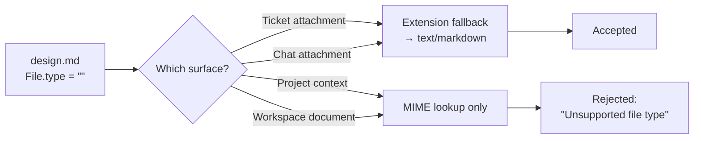
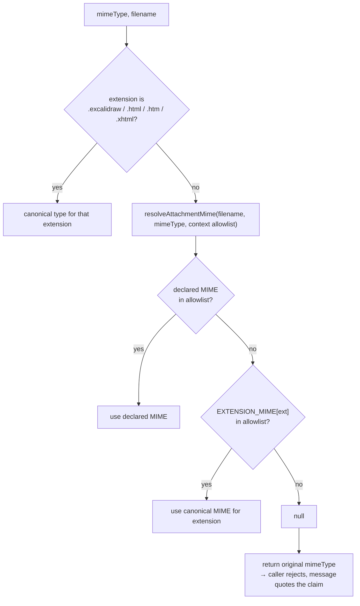

# Untyped File Upload Rejection - Plan

How a file is identified when the operating system gives the browser no MIME type for it.

- **Audience**: Engineers implementing or reviewing file-upload type resolution
- **Owner**: Fabric platform

## Goal Capsule

- **Objective:** A file the operating system has no MIME registration for uploads successfully wherever its extension is advertised as supported.
- **Product authority:** Fizzy #2139 (reported as ".md files cannot be uploaded"), plus the staging evidence below that widens it past `.md`.
- **Open blockers:** None.
- **Product Contract preservation:** Changed. R1, R2, R4, R10 and R11 were sharpened after flow analysis found gaps the requirements pass could not see — dotless filenames, alias extensions, and the workspace client's raw MIME. R13 stays inside the confirmed contract: without it the workspace fix produces a failed row rather than a working upload. **R14 and R15 add scope beyond the confirmed "root cause + workspace uploader" contract** — neither makes a supported file upload that previously could not. They are kept — confirmed explicitly — because both are one-line changes on lines the fix already rewrites, and because the current refusal message renders as a bare full stop for exactly these files. U4's reach into the workspace procedures was confirmed separately: it normalizes without refusing, so the excluded server-side type gate stays excluded. Surfaces and exclusions are otherwise unchanged.

---

## Product Contract

### Summary

Project-context and workspace-document uploads currently identify a file only by the MIME type the browser reports. When the OS has no registration for the extension the browser reports nothing, and the upload is refused — even though the extension is on the advertised list. Both surfaces should fall back to the filename extension, which is what the ticket-attachment and chat surfaces already do.

### Problem Frame

A user tried to attach a `design.md` file and was told the format was unsupported. The obvious reading — that `.md` is missing from an allowlist — is wrong. `.md` is present in every allowlist in the product, and on a machine where `.md` is registered the upload works end to end: verified on staging, where a `.md` context upload stored the file, extracted its text, and reported `COMPLETED`.

What fails is identification. The browser fills `File.type` from the operating system's MIME registration, so a file whose extension the OS does not register arrives with an empty type. The likeliest diagnosis for the report is a Windows machine, which carries no registry entry for `.md` — inferred rather than reproduced, since the staging run forced the MIME empty rather than reproducing an unregistered extension. Drag-and-drop commonly yields an empty type as well. The client substitutes a placeholder for the empty value and sends it on; the server does not recognise the placeholder and refuses the file, naming MD among the supported types in the same sentence that rejects it. The exact cause does not change the fix: the extension fallback rescues an empty type, `application/octet-stream`, and `text/x-markdown` alike.

The failure is not specific to Markdown. The context picker advertises sixteen extensions and rescues four. The other twelve break identically — including `.pdf`, `.docx`, `.txt`, and `.png`. The four that survive (`.excalidraw`, `.html`, `.htm`, `.xhtml`) do so because each was rescued by hand when someone hit this defect on that particular format: Fizzy #1942 added the first, Fizzy #1684 the next three. A fifth rescue, Fizzy #1778, fixed the ticket-attachment surface properly and left this one alone. `.md` is the fourth report of one defect, and fixing it as a fourth special case leaves eleven formats broken.

The same product already knows how to do this correctly, and has already said so about this exact function. The Excel-attachments plan routed the chat surface to the shared resolver rather than reusing this one, on the record: *"rather than copying the project-contexts shim: the existing helper is the general, fail-closed version and produces the specified results for both R4 cases, while the shim only special-cases one MIME and fails open"* (`docs/plans/2026-07-16-001-feat-excel-chat-attachments-plan.md`). The shim was diagnosed and routed around; it was never generalized.

### Key Decisions

- **Fix identification, not the allowlists.** Every allowlist already carries the formats users are being refused. Adding entries would change nothing; the resolution step is where the file is lost.

- **Resolve by extension for every advertised format, not for `.md` alone.** The picker advertises formats by extension while validation understands only MIME, and `docs/solutions/conventions/accept-and-validation-share-one-vocabulary.md` already governs this: *"Both the `accept` attribute and every validation gate behind it must derive from the same allowlist."* That entry also sanctions the remedy — *"paste and drop routinely deliver files with an empty `file.type`, so the MIME check alone would refuse a validly-named `.xlsx` dragged out of another app"* — and closes with the instruction this plan follows: *"when you find one drifted list, grep for its siblings."*

- **Fix where the server can see it, not at the browser call sites.** The client could send a better guess, but the server is authoritative and would still refuse the same file on a direct call — and the next upload surface added would inherit the defect. The client checks stay as UX affordances rather than becoming the control.

- **Leave the workspace-document server procedure ungated.** That procedure validates size only and never checked file type. Adding a type gate is defensible hardening but would refuse uploads that succeed today, which is a different change with a different risk profile than the one this fixes.

### Requirements

**Identification**

- R1. A file whose browser-reported MIME type is absent, `application/octet-stream`, or otherwise unrecognised is identified by its filename extension, parsed from the last dot in the name. A name with no dot yields no extension and is refused.
- R2. Extension-based identification covers every extension the corresponding picker advertises, including the alias extensions `.jpeg`, `.htm`, and `.xhtml` that share a canonical type with another extension.
- R3. Identification continues to fail closed: a file whose MIME type and whose extension are both unrecognised is still refused.
- R4. A recognised browser-reported MIME type takes precedence over the extension, except for the extensions whose canonical type is already forced ahead of the declared value — `.excalidraw`, `.html`, `.htm`, `.xhtml` — which keep their existing extension-first behaviour.

**Project context uploads**

- R5. Uploading a supported file through the project-context picker succeeds regardless of whether the operating system registers that extension.
- R6. The same holds for files added by drag-and-drop, where the reported type is commonly empty.
- R7. The same holds for the project-creation wizard's context upload.
- R8. An uploaded file is stored under its canonical extension and reaches text extraction as it does today.

**Workspace documents**

- R9. The workspace-document picker offers files by extension, so supported files are selectable in the operating system's file dialog on any machine.
- R10. Workspace-document validation accepts a supported file whose reported MIME type is absent or unrecognised.
- R13. A workspace document is persisted with a resolved canonical MIME type rather than the caller's raw value, so an accepted document reaches extraction rather than persisting as a failed row. This holds for uploads that bypass the picker, not only for those made through it.

**Honest client-side feedback**

- R14. A client-side size check classifies the file by its resolved type, so a file is not accepted at pick time and then refused for size after upload.
- R15. The unsupported-format message names the file it refused and renders an absent MIME type as unknown rather than as empty.

**Regression protection**

- R11. The extension vocabulary a picker advertises and the vocabulary its validation accepts derive from one source, so the two cannot drift apart as formats are added.
- R12. Tests cover the untyped case for every advertised extension, not only the formats that happen to carry a MIME type.

### Acceptance Examples

- AE1. Untyped Markdown reaches project context
  - **Covers R1, R5, R8.**
  - **Given** a user on a machine with no MIME registration for `.md`
  - **When** they add `design.md` through the project-context picker
  - **Then** the file uploads, is stored as Markdown, and its text is extracted — with no unsupported-format error.

- AE2. Drag-and-drop of a document
  - **Covers R1, R6.**
  - **Given** a `.docx` file dragged onto the context dropzone, where the browser reports no type
  - **When** the upload runs
  - **Then** it succeeds and is identified as a Word document.

- AE3. Alias extension
  - **Covers R2.**
  - **Given** a `photo.jpeg` whose reported type is empty
  - **When** it is uploaded
  - **Then** it is accepted, exactly as `photo.jpg` would be.

- AE4. Genuinely unsupported file
  - **Covers R3, R15.**
  - **Given** an `archive.rar` whose reported type is empty
  - **When** it is uploaded
  - **Then** it is refused, and the message names `archive.rar`, reports the type as unknown, and lists the supported formats.

- AE5. Mislabelled file keeps its declared type
  - **Covers R4.**
  - **Given** a file named `notes.md` that the browser reports as a PDF
  - **When** it is uploaded
  - **Then** it is treated as a PDF, because the reported type was recognised.

- AE6. Workspace document is selectable and processable
  - **Covers R9, R10, R13.**
  - **Given** a user on a machine with no MIME registration for `.md`
  - **When** they open the workspace-document picker and upload `design.md`
  - **Then** `.md` files are selectable rather than greyed out, the file passes validation, and the stored document carries `text/markdown` so extraction completes.

- AE7. Extensionless file is refused
  - **Covers R1, R3.**
  - **Given** a file named `PDF`, or one named `html`, with no dot in its name
  - **When** it is uploaded
  - **Then** it is refused rather than accepted as a PDF or as HTML.

- AE8. Forced canonical type survives a wrong declared type
  - **Covers R4.**
  - **Given** a `page.html` that the browser reports as `application/pdf`
  - **When** it is uploaded
  - **Then** it is stored as HTML, so the HTML extractor runs rather than the PDF one.

- AE9. Untyped oversize image fails at pick time
  - **Covers R14.**
  - **Given** a 15 MB `photo.png` whose reported type is empty
  - **When** the user selects it
  - **Then** the picker rejects it against the image limit immediately, rather than uploading and failing afterwards.

- AE10. The wizard behaves like the main picker
  - **Covers R7.**
  - **Given** a user adding a supported file whose extension the operating system does not register
  - **When** they add it through the project-creation wizard's context upload
  - **Then** it uploads exactly as it would through the project-context picker, including the pick-time size check.

- AE11. A document uploaded outside the picker still resolves
  - **Covers R13.**
  - **Given** a workspace-document upload confirmed through the API with an empty MIME type
  - **When** the row is persisted
  - **Then** it carries the type resolved from the filename, so extraction runs rather than failing.

### Scope Boundaries

- Rendering stored Markdown as formatted output rather than plain text. The ticket raises it as an open question; it is a separate change to the document-preview surface and does not affect whether a file can be uploaded.
- An upload control on the project Documents tab. Only the control's placement is deferred, not the outcome: the context picker already carries a "Tag as Document" selector whose value flows through to create a project document with an imported source, so once this fix lands the reporter can attach a `.md` and tag it as a technical spec. Say so when closing the ticket rather than describing the capability as unbuilt.
- A server-side file-type *gate* for workspace documents, which has never existed on that procedure. Normalizing an unrecognised type there without refusing anything is in scope — see KTD5.
- The per-surface size limit *values*, which differ by design. Which limit applies is derived from the resolved type, so category selection is in scope under R14; the numbers themselves are not.
- Two further MIME-only gates stay untouched: the external-API file upload (`POST /agents/files`) and the agent image-upload route. Deferred by scope, not because they are safe — the agent-facing one in particular is reached by scripted HTTP clients rather than browsers, and multipart libraries routinely omit a part's `Content-Type`, which is the same failure this fix removes everywhere else. It warrants its own ticket.
- Three image pickers restate the same four-entry MIME list by hand (`image-upload-utils.ts`, `EditorToolbar.tsx`, `stories/AttachmentsField.tsx`) and are not covered by the drift guard. Lower urgency — image types are reliably OS-registered — but the same drift shape the convention warns about.

### Dependencies / Assumptions

- Assumes an empty or placeholder MIME type carries no information worth preserving — the file is identified by extension instead, and nothing downstream reads the browser's original claim.
- Assumes extension-based identification is acceptable at the same trust level the ticket-attachment and chat surfaces already operate at. Uploaded text is extracted, not executed, and is served under the canonical type rather than the claimed one.
- Assumes no consumer depends on the current rejection. No test pins it, and no acceptance path treats the refusal as intended behaviour.

---

## Planning Contract

### Key Technical Decisions

- **KTD1. Reuse `resolveAttachmentMime` rather than build a second reverse map.** `packages/utils/lib/attachment.ts` already exports `EXTENSION_MIME`, keyed by extension, carrying every alias the context picker advertises — including the `jpeg`, `htm`, and `xhtml` entries a reverse map derived from `CONTEXT_UPLOAD_MIME_TYPES` would miss, because that map's `extension` field is one-per-MIME. `resolveAttachmentMime` takes the allowlist as an argument, so passing the context allowlist composes one vocabulary per surface without widening either. It also parses with `lastIndexOf(".")` and returns `null` when nothing matches, which is what makes R1's dotless case and R3's fail-closed rule fall out for free. This is the choice `docs/plans/2026-07-16-001-feat-excel-chat-attachments-plan.md` already made for the chat surface.

- **KTD2. Keep the forced canonicalization for `.excalidraw` and the `.html` family; delete the legacy-Excel branch.** The first two run *before* the declared MIME is consulted, and that ordering is load-bearing: today `resolveContextUploadMime("application/pdf", "page.html")` returns `text/html`, and dropping it would send HTML bytes to the PDF extractor. Both are pinned by existing tests. The legacy-Excel branch is different — `application/vnd.ms-excel` is not a key of `CONTEXT_UPLOAD_MIME_TYPES`, so the generic path reaches the same answers for `.csv` and `.xlsx` and keeps refusing a genuine `.xls`. It is subsumed, not special. Its existing test passes either way, so a negative `.xls` case has to be added or a botched deletion goes unnoticed.

- **KTD3. `resolveContextUploadMime` keeps its `string` return type.** Making it return `string | null` would be closer to the shared helper's shape, but both call sites already reject by looking the result up in `CONTEXT_UPLOAD_MIME_TYPES`, so fail-closed is already achieved at the caller. Changing the signature would rewrite both procedures and invalidate an existing test that deliberately pins pass-through. When resolution fails, return the caller's original MIME so the error message can report what was actually claimed.

- **KTD4. The presigned PUT does not bind Content-Type, so a server-side resolution is safe.** `@aws-sdk/s3-request-presigner` adds `content-type` to `unsignableHeaders` before signing, so it never appears in `X-Amz-SignedHeaders` and a PUT whose header differs from the signed value is accepted. Both signer entry points reach the same code, and the provider factory returns the S3 provider for every configured backend, so no alternative provider breaks it. This was the plan's largest suspected risk and it is not one. Note that `ContentLength` *is* signed on the workspace path; nothing here changes it. The consequence worth recording: the stored object keeps the *client's* Content-Type while the database row keeps the resolved one. On the presigned paths nothing reads the object's type — the download procedure overrides it with the database value, and all three extraction activities discard the downloaded content type in favour of the stored one. This does **not** extend to the non-presigned server-upload fallback, which writes the client's MIME onto a public object and returns the raw URL with no override; that path is one more reason the workspace surface resolves rather than relaying.

- **KTD5. Both the workspace client and its procedures normalize the type; neither refuses anything new.** That surface has no server-side type gate, no client-side placeholder, and a capacity counter that includes failed rows, so an untyped file persists with an empty MIME, fails extraction with "no extractor found", and occupies a document slot. Fixing only the picker leaves the hole open: `confirmUpload` and `serverUpload` persist the caller's MIME verbatim and are REST-routed, so a direct API caller reproduces the same failed row. Resolving at those two persistence points — falling back to the caller's value rather than rejecting — narrows it without introducing the type gate this plan deliberately excludes. It narrows rather than closes: the rescue works off the filename, so a name carrying no resolvable extension still persists unresolvable and still fails extraction. Closing that last case would require the gate this plan excludes. This is the same reasoning KTD3 applies to the context surface, and it applies here too.

- **KTD6. Keep the client's `application/octet-stream` placeholder and leave the wizard's input schema alone.** The wizard procedure requires a non-empty MIME string while the context procedure does not. Dropping the placeholder would turn that asymmetry into a validation failure that never reaches the resolver. Keeping the placeholder costs nothing — the server now resolves it by extension — and avoids touching an input contract for no user-visible gain.

### High-Level Technical Design

Resolution order inside the context resolver after the change. The first branch is the named exception from KTD2; the second is the shared helper from KTD1.

Directional guidance for review, not implementation specification.

### Assumptions Carried Into Implementation

- `EXTENSION_MIME` is a superset of the context vocabulary. Extensions it carries that the context allowlist does not (`xls`, `ppt`, `pptx`, `zip`, `mp4`, `mov`, `avi`, `webm`) resolve to types outside the allowlist and are therefore still refused. U1's table-driven test is what confirms this rather than assumes it.
- `.doc` is a poor happy-path example: mammoth reads OOXML, not the legacy binary format, so a real `.doc` is accepted and then fails extraction. That is pre-existing and out of scope; do not build an acceptance example on it.
- Trailing whitespace in a filename (`"design.md "`) yields the extension `"md "` and fails to resolve. `resolveAttachmentMime` has the same hole, so this is shared pre-existing behaviour and is not addressed here.

---

## Implementation Units

### U1. Generalize the context MIME resolver

**Goal:** `resolveContextUploadMime` rescues every advertised extension instead of four.

**Requirements:** R1, R2, R3, R4, R12. Covers AE1, AE3, AE5, AE7, AE8.

**Dependencies:** none.

**Files:**
- `packages/utils/lib/context-upload.ts`
- `packages/utils/lib/__tests__/context-upload.test.ts`

**Approach:** Parse the extension once, with `lastIndexOf(".")`, and drive every branch from that value. The current `split(".").pop()` returns the whole filename when there is no dot, so a file named `html` or `excalidraw` resolves today and would keep resolving — R1's dotless rule does not hold unless the retained branches share the corrected parse. Keep those branches' *behaviour* — `.excalidraw` and the `.html` family still win over a declared type — and delete the legacy `application/vnd.ms-excel` branch. Replace the final `return mimeType` with a delegation to `resolveAttachmentMime`, passing `Object.keys(CONTEXT_UPLOAD_MIME_TYPES)` as the allowlist, falling back to the original `mimeType` when the helper returns `null` so the caller's error message can quote what the browser actually claimed. `context-upload.ts` already imports from `attachment.ts`, and both modules are pure with no env access, so no new dependency edge or barrel-weight concern arises. Update the doc comment — the current one says "All other MIMEs pass through unchanged", which stops being true.

**Patterns to follow:** `resolveAttachmentMime` and `resolveAiChatUploadMime` in `packages/api/modules/ai/lib/ai-chat-attachment-limits.ts` — the same compose-the-allowlist-per-surface shape.

**Execution note:** Write the table-driven untyped test first and watch it fail across twelve extensions. The count is the point of the unit.

**Test scenarios:**
- Covers AE1, AE3. Table-driven over every extension in `CONTEXT_UPLOAD_ACCEPT_ATTR` crossed with `["", "application/octet-stream"]`: each resolves to a MIME that is a key of `CONTEXT_UPLOAD_MIME_TYPES`. Sixteen extensions, thirty-two cases.
- Covers AE5. `("application/pdf", "notes.md")` resolves to `application/pdf` — a recognised declared type wins.
- Covers AE8. `("application/pdf", "page.html")` resolves to `text/html` — the forced branch still precedes the declared type.
- Covers AE7. `("", "PDF")`, `("", "Makefile")`, `("", "html")` and `("", "excalidraw")` do not resolve to an allowlisted type. The last two are the cases the retained branches would otherwise accept.
- Covers AE3. `("", "photo.jpeg")` resolves to `image/jpeg`; `("", "page.htm")` and `("", "page.xhtml")` resolve to `text/html`.
- `("", "notes.md.txt")` resolves to `text/plain`, not `text/markdown` — the last dot wins.
- `("", "DESIGN.MD")` resolves to `text/markdown` — extension matching is case-insensitive.
- `("", "archive.tar.gz")` does not resolve — fail-closed on an unadvertised extension.
- `("application/vnd.ms-excel", "data.csv")` resolves to `text/csv` and `("application/vnd.ms-excel", "book.xlsx")` to the OOXML spreadsheet type — the deleted branch's behaviour survives.
- `("application/vnd.ms-excel", "book.xls")` does not resolve — a genuine legacy Excel file stays refused. This is the case that catches a botched deletion.
- `("", "archive.zip")` and `("", "clip.mp4")` do not resolve — `EXTENSION_MIME` entries outside the context allowlist stay refused.
- Existing pass-through case for `("application/pdf", "a.pdf")` still holds.

**Verification:** the utils suite passes and the table covers every extension the accept attribute advertises, derived from the same constant rather than hand-listed.

### U2. Make the context and wizard procedures report honestly

**Goal:** a refused upload names the file, and an accepted one returns the type the server resolved.

**Requirements:** R15, and the client-side input for R14 on the context surface. Covers AE1, AE4.

**Dependencies:** U1.

**Files:**
- `packages/api/modules/projects/procedures/contexts/create-context-upload-url.ts`
- `packages/api/modules/wizard/procedures/create-temp-upload-url.ts`
- `packages/api/modules/projects/procedures/contexts/__tests__/create-context-upload-url.test.ts` (new)
- `packages/api/modules/wizard/procedures/__tests__/create-temp-upload-url.test.ts` (new)

**Approach:** Compose the refusal message from both halves — the filename-and-unknown-type shape the AI-chat and story-attachment procedures use, *plus* the existing supported-formats list. Those two procedures do not carry a format list, so copying their message verbatim would drop the `Supported types: …` clause this surface ships today and fail AE4. The target shape is `Unsupported file type for "<filename>": <mime or "unknown">. Supported types: <CONTEXT_UPLOAD_FORMAT_LABELS joined>`. Add the resolved MIME to each procedure's return value, following `create-attachment-upload-url.ts`, which already returns `contentType: resolvedMime`. Leave both input schemas untouched per KTD6.

**Patterns to follow:** `packages/api/modules/ai/procedures/documents/create-upload-url.ts` for the filename-and-unknown half of the message; `packages/api/modules/projects/procedures/stories/attachments/create-attachment-upload-url.ts` for the returned content type. Test mocking follows the procedure-chain stub in that file's existing test, with three adjustments: the context procedure also imports `resolveOrganizationId`, the wizard procedure uses `requirePermission` rather than `requireProjectPermission`, and both import `ProjectDocumentTypeSchema` from `@repo/database/prisma/zod` — a separate specifier that a `@repo/database` mock does not intercept.

**Test scenarios:**
- Covers AE1. A `design.md` with an empty MIME mints a signed URL, and the persisted row carries `text/markdown`.
- Covers AE1. The same with `application/octet-stream`.
- Covers AE4. An `archive.rar` with an empty MIME is refused, and the message contains the filename, the word unknown rather than an empty segment, **and** the supported-formats list.
- The storage key is built from the resolved extension, so an untyped `design.md` is stored under `.md`.
- The size limit is chosen from the resolved category — an untyped 15 MB `photo.png` is refused against the image limit, not the file limit.
- The wizard procedure behaves identically to the context procedure for an untyped `.md`.
- A recognised, allowlisted declared MIME is still used unchanged.

**Verification:** both procedure suites pass; a refused upload's message reads as a complete sentence when the MIME is empty.

### U3. Resolve on the context clients before size-checking and uploading

**Goal:** the picker's own size check and the PUT both use the resolved type.

**Requirements:** R5, R6, R7, R14. Covers AE2, AE9, AE10.

**Dependencies:** U1, U2.

**Files:**
- `apps/web/modules/saas/projects/components/ContextUploaderDialog.tsx`
- `apps/web/modules/saas/projects/components/wizard/WizardFileUploader.tsx`
- `apps/web/modules/saas/projects/components/__tests__/ContextUploaderDialog.file-tab.test.tsx`
- `apps/web/modules/saas/projects/components/wizard/__tests__/WizardFileUploader.test.tsx` (new)

**Approach:** Where each client currently computes an upload category from `file.type || "application/octet-stream"`, resolve the type first with the shared resolver and categorize on that. Categorize through the server's own `CONTEXT_UPLOAD_MIME_TYPES[...].type` rather than `resolveUploadCategory` — the two disagree for `image/svg+xml` (10 MB versus 20 MB), and using the server's map removes a pre-existing divergence on a line this unit already rewrites. Keep sending the placeholder to the server per KTD6; use the resolved value for the PUT's `Content-Type` header so the stored object's type matches the database row. The resolver is pure and already bundled through `@repo/utils`, so this adds no new client dependency.

The wizard has no test file today. It gets one here rather than shipping the same change untested on a second surface — the failure mode this plan's Problem Frame is about.

**Patterns to follow:** `apps/web/modules/saas/projects/lib/attachment-upload-utils.ts`, which already resolves client-side before building its PUT.

**Test scenarios:**
- Covers AE9. A 15 MB untyped `.png` is marked too large at pick time against the image limit.
- A 15 MB untyped `.md` is accepted at pick time, since Markdown carries the larger file limit.
- Covers AE2. A dropped `.docx` with an empty type is queued rather than rejected.
- An untyped file that resolves to nothing is still surfaced as a failed row rather than silently dropped, preserving the existing batch behaviour where siblings continue.
- Covers AE10. The wizard uploader repeats the untyped-drop and oversize-image cases above, so both surfaces are pinned.

**Verification:** the web suite passes; a batch containing one untyped and one typed file uploads both, on both surfaces.

### U4. Give workspace documents an extension vocabulary

**Goal:** `.md` is selectable in the OS dialog and the uploaded document carries a type extraction can use.

**Requirements:** R9, R10, R13. Covers AE6, AE11.

**Dependencies:** U1.

**Files:**
- `packages/utils/lib/workspace-document-upload.ts` (new — the five-format allowlist plus its derived accept attribute)
- `packages/utils/index.ts`
- `packages/utils/lib/__tests__/workspace-document-upload.test.ts` (new)
- `apps/web/modules/saas/workspaces/components/DocumentUploader.tsx`
- `apps/web/modules/saas/workspaces/components/__tests__/DocumentUploader.test.tsx`
- `packages/api/modules/workspaces/procedures/documents.ts`

**Approach:** The vocabulary moves out of the component into `@repo/utils`, alongside the context vocabulary — U5's drift guard asserts each picker reads a *shared* constant, which a module-level literal inside the component cannot satisfy. Keep the same five formats; the point is the vocabulary, not a wider set. Derive the `accept` attribute from extensions rather than MIME strings, which is what greys `.md` out of the OS dialog today.

Validate through the shared resolver so an untyped file is identified rather than refused, and send the resolved MIME on all three procedure calls instead of the raw `file.type`. Then normalize again at the two server persistence points — `confirmUpload` and `serverUpload` — falling back to the caller's value rather than rejecting, so a REST caller that bypasses the picker cannot persist an unresolvable type either. That is normalization, not a gate, and stays inside the scope boundary.

Also correct the dialog's supported-formats copy, which names four formats while the allowlist has always carried five: `.doc` is accepted and unadvertised.

**Patterns to follow:** `CONTEXT_UPLOAD_ACCEPT_ATTR`'s derivation in `packages/utils/lib/context-upload.ts` for building an accept attribute from an allowlist rather than hand-writing it.

**Test scenarios:**
- Covers AE6. Selecting a `design.md` with an empty reported type passes validation and calls the upload procedure with `text/markdown`.
- The `accept` attribute contains dotted extensions rather than only MIME strings.
- The dialog copy names all five accepted formats, sourced from the shared allowlist.
- A genuinely unsupported file is still refused with the existing error.
- A mixed batch where one file is unsupported reports the unsupported one rather than silently dropping it while claiming full success.
- Covers AE11. `confirmUpload` and `serverUpload` persist a resolved type when the caller supplies an empty one, and leave a recognised type unchanged.
- An unresolvable type is still persisted rather than refused, since this unit adds no gate.
- The existing six cases in the component test still pass.

**Deferred decision:** this unit leaves the workspace picker's aggregate-toast rejection as it is. The context and wizard pickers keep a rejected file as a retryable row; this one drops it and reports a transient toast. Bringing it to row-level parity is a UX change, not part of this defect.

**Verification:** the web, utils, and API suites pass; no workspace document row can be persisted with an unresolvable MIME.

### U5. Pin the vocabulary against drift

**Goal:** a future format added to one list cannot silently miss the other.

**Requirements:** R11, R12.

**Dependencies:** U1, U4.

**Files:**
- `apps/web/__tests__/copilot/attachment-surface-drift.test.ts`
- `docs/attachment-surface-map.md`

**Approach:** Add the three pickers in their **own** surface table and describe block — not to the existing `SURFACES` map. Every `it.each` over that map asserts AI-chat-specific facts (the attachment-envelope builder, the chat byte cap, the chat allowlist) that no context or workspace picker carries, so extending it reddens five unrelated blocks. The surface-map document has the same shape problem: it opens by scoping itself to the four surfaces that attach files to an AI chat, and the test requires every key to appear in it, so the three pickers need their own section there too.

Follow the guard's established discipline of reading live source from disk and asserting the spelling rather than importing the constant — importing would make both sides move together and assert nothing. The assertions available here are that each picker's `accept` attribute comes from a derived shared constant and that no covered surface reintroduces a local format array.

**Patterns to follow:** the `it.each` shape and read-from-disk discipline already in that test file, applied to a second table.

**Test scenarios:**
- Each of the three pickers references its shared accept constant by name.
- No covered surface contains a local literal format array.
- Every path named in the surface map still exists.

**Verification:** the drift test fails if a picker is pointed back at a hand-written list.

### U6. Changeset

**Goal:** the fix ships with a release note.

**Requirements:** none directly.

**Dependencies:** U1–U5.

**Files:** `.changeset/*.md` (new)

**Approach:** Frontmatter declares `"fabric-app": patch` and nothing else. Declaring `@repo/utils` or `@repo/api` would cascade patch bumps across the workspace. Line one is the CHANGELOG headline; the diagnosis and the twelve-extension count go below the blank line, where the formatter drops them.

**Test expectation:** none — release metadata.

**Verification:** the changeset check passes and the frontmatter names one package.

---

## Verification Contract

| Gate | Command | Applies to |
|---|---|---|
| Utils unit tests | `pnpm --filter @repo/utils test lib/__tests__/context-upload.test.ts lib/__tests__/workspace-document-upload.test.ts` | U1, U4 |
| API procedure tests | `pnpm --filter @repo/api test modules/projects/procedures/contexts modules/wizard/procedures modules/workspaces/procedures` | U2, U4 |
| Web component tests | `pnpm --filter web test modules/saas/workspaces/components/__tests__/DocumentUploader.test.tsx modules/saas/projects/components/__tests__ modules/saas/projects/components/wizard/__tests__` | U3, U4 |
| Drift guard | `pnpm --filter web test __tests__/copilot/attachment-surface-drift.test.ts` | U5 |
| Types | `pnpm type-check` | all |
| Lint | `pnpm lint` | all |

Manual check on staging after deploy, since the defect is browser-and-OS dependent and no automated test reproduces an OS with no `.md` registration: upload a `.md` through the project-context picker with the file's type forced empty, and confirm the row reaches `COMPLETED`.

## Definition of Done

- Every extension the context picker advertises uploads with an empty and with an `application/octet-stream` reported type, through both the project picker and the wizard.
- A file with no extension — including one named `html` or `excalidraw` — and a file with an unadvertised extension are both still refused.
- `page.html` reported as a PDF is still stored as HTML.
- A workspace `.md` upload reaches a completed document rather than a failed row, whether it goes through the picker or straight to the API.
- An untyped oversize image is refused at pick time.
- The unsupported-format message names the file, reads as a complete sentence when the reported type is empty, and still lists the supported formats.
- The drift guard covers the context, wizard, and workspace pickers without disturbing the AI-chat assertions.
- All Verification Contract gates pass; changeset declares `fabric-app` only.
- Fizzy #2139 is closed with a note that a `.md` context upload tagged as a document type becomes a project document, and with a tracked follow-up filed for Markdown rendering on the preview surface — the reporter's remaining open question.

---

## Sources & Research

- Staging verification, 2026-08-10: a `.md` context upload succeeded end to end (`extractionStatus: COMPLETED`, content stored verbatim). The same endpoint refused the identical filename with an empty, `application/octet-stream`, or `text/x-markdown` MIME type, responding `Unsupported file type: … Supported types: PDF, DOCX, DOC, TXT, MD, …`.
- `packages/utils/lib/context-upload.ts` — the context format map, its accept-attribute derivation with alias overrides, and the resolver that rescues only `.excalidraw`, the `.html` family, and legacy Excel.
- `packages/utils/lib/attachment.ts` — `EXTENSION_MIME` and `resolveAttachmentMime`; its comments name the empty / `application/octet-stream` case directly.
- `packages/api/modules/ai/lib/ai-chat-attachment-limits.ts` — the chat surface composing that resolver with its own allowlist.
- `packages/api/modules/projects/procedures/contexts/create-context-upload-url.ts`, `packages/api/modules/wizard/procedures/create-temp-upload-url.ts` — the two enforcement sites.
- `apps/web/modules/saas/workspaces/components/DocumentUploader.tsx`, `packages/api/modules/workspaces/procedures/documents.ts` — the client-only gate and the ungated procedures behind it.
- `packages/database/prisma/queries/workspaces/workspaces.ts` — the document capacity count, which does not exclude failed rows.
- `packages/rag/lib/extraction/factory.ts` — exact-match extractor lookup that throws on an unmatched MIME.
- `packages/storage/provider/s3/index.ts` and `@aws-sdk/s3-request-presigner` — the presign path and the `unsignableHeaders.add("content-type")` line that makes KTD4 safe.
- `docs/solutions/conventions/accept-and-validation-share-one-vocabulary.md` — the governing convention, including its sanction of the extension fallback and its "grep for its siblings" instruction.
- `docs/plans/2026-07-16-001-feat-excel-chat-attachments-plan.md` — the prior decision to route around this resolver rather than reuse it, and the one-vocabulary-composed-per-surface rule.
- `docs/plans/2026-07-21-002-feat-attachment-parity-and-bounds-plan.md`, `docs/plans/2026-07-22-001-feat-context-only-attachment-ai-context-plan.md` — derive-rather-than-restate precedents.
- `apps/web/__tests__/copilot/attachment-surface-drift.test.ts`, `docs/attachment-surface-map.md` — the drift-guard pattern U5 extends.
- Git history: Fizzy #1942 added the `.excalidraw` rescue, Fizzy #1684 the `.html` family, Fizzy #1778 the `EXTENSION_MIME` fix on the attachment surface only.
- `docs/solutions/architecture-patterns/reuse-story-attachment-pipeline-preserve-ai-isolation.md` states that `.md` uploads already work — true for story attachments, misleading for these two surfaces. Worth correcting when this lands.
