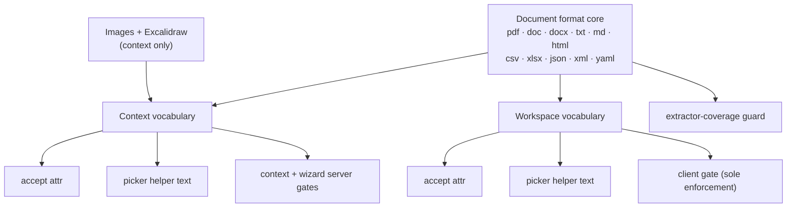
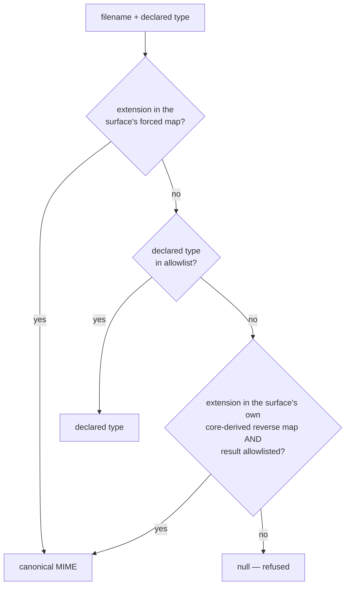

# Context Upload File Types - Plan

Which file formats a user may upload as AI context, and where that list lives.

- **Audience**: Engineers implementing or reviewing the non-chat upload vocabularies
- **Owner**: Fabric platform

## Goal Capsule

- **Objective:** A user can upload XML, YAML, and JSON as project context, workspace documents accept the same document formats project context does, and the advertised format list cannot drift from the enforced one.
- **Product authority:** Fizzy #2149 ("Expand supported file types for context uploads (including .xml)"). The linked specification is empty, so scope was set in brainstorm dialogue and is recorded in Key Decisions below.
- **Open blockers:** None.
- **Known after review:** `WizardFileUploader` has no mount site — the project wizard's Basic Info step renders `ContextUploaderDialog` instead. R13 and the wizard unit are therefore correctness work on a dormant component, not a user-visible fix. Kept rather than deleted by decision; whether the wizard should have its own uploader is a separate product question.
- **Stop conditions:** Stop and ask if a format turns out to need extractor work beyond registering a MIME type, or if deriving the two surface vocabularies from one core would change which formats an out-of-scope surface advertises.
- **Product Contract preservation:** Changed. R5 and R10 were rewritten after research contradicted them, and R11 was split per surface. R5 said XML should be accepted under both `application/xml` and `text/xml`; accepting both spellings routes a `text/xml` file to an extractor that does not claim it, which R4 forbids — it now specifies canonicalization. R10 asserted that `image/svg+xml` routes to the image extraction path; it never has, and implementing the requirement as written would have dropped SVG's size ceiling and broken its extraction. R11 described a defect present on one surface as if all three shared it. R13 and R17 are new: R13 covers the wizard, whose defect is worse than the context dialog's and which the requirements pass did not distinguish; R17 covers a batch-drop bug found while tracing R11. Both were confirmed as in-scope by explicit decision. Scope, surfaces, and admitted formats are otherwise unchanged.

---

## Product Contract

### Summary

The project-context uploader, the project-creation wizard, and workspace documents gain XML, YAML, and JSON, and workspace documents additionally gains CSV, XLSX, and HTML. Both surface vocabularies derive from one shared document core — project context adds images and Excalidraw on top of it, workspace documents takes the core alone. Every user-visible format list derives from that core, and each picker refuses an unsupported file before the user commits the upload.

### Problem Frame

Four separate modules each carry their own hand-maintained list of acceptable file types: `packages/utils/lib/context-upload.ts` (project context and wizard), `packages/utils/lib/workspace-document-upload.ts` (workspace documents), `packages/utils/lib/ai-chat-attachment.ts` (the four chat surfaces), and `packages/utils/lib/attachment.ts` (story attachments). Nothing keeps them in agreement, and they have not stayed in agreement.

The gaps are not theoretical. JSON can be attached to a chat but not uploaded as project context, though a single extractor serves both. Workspace documents accepts five formats while project context accepts thirteen. XML is refused everywhere, even though `packages/rag/lib/extraction/extractors/local-text.ts` has declared `application/xml` among its supported types all along — the extraction layer has been ready for XML longer than anyone asked for it, and only the upload gates say no.

Refusal is confirmed on staging. Uploading `sample-context.xml` to the project-context surface returns a `400` from `projects/contexts/createUploadUrl` reading `Unsupported file type for "sample-context.xml": application/xml. Supported types: PDF, DOCX, DOC, TXT, MD, JPG, PNG, WEBP, SVG, XLSX, CSV, EXCALIDRAW, HTML`.

Two smaller defects sit on the same surfaces. The refusal arrives late: `buildRowsFromFiles` in `apps/web/modules/saas/projects/components/ContextUploaderDialog.tsx` checks size only, so an unsupported file renders as `Ready` with the Upload button enabled and is refused only after the user commits. The wizard is worse — `apps/web/modules/saas/projects/components/wizard/WizardFileUploader.tsx` has no queue at all and uploads immediately, so the user watches an upload start and then fail. And both components hardcode a helper string reading `PDF, DOC, DOCX, TXT, MD, HTML` while the `accept` attribute beside it is correctly derived and admits more.

This is the fourth ticket in a row against this area. `.excalidraw` was rescued by hand under Fizzy #1942, `.html`/`.htm`/`.xhtml` under Fizzy #1684, the ticket-attachment surface under Fizzy #1778, and identification-by-extension under Fizzy #2139. Each fixed one format or one surface and left the structure that produced it in place.

### Key Decisions

- **A shared core with two derivations, not one merged list.** The two surfaces are not the same product. Project context accepts screenshots and Excalidraw scenes; workspace documents is a document library and should not silently start accepting images. `CONCEPTS.md` makes this canonical: vocabularies are per-surface by design and "compose from one shared resolver rather than each implementing their own." Each surface keeps its own allowlist, category map, accept attribute, and labels — all derived from the core.

- **A format is admitted only when an extractor already claims its MIME type.** Today's refusal is clean and immediate. A format admitted without extraction support replaces that with a file that stores successfully and then fails downstream. The repo already states this rule in `packages/utils/lib/attachment.ts`: `application/xhtml+xml` is "deliberately not admitted, because no registered extractor claims it and an admitted-but-unextractable type fails the context pipeline outright." XML, JSON, CSV, HTML, and XLSX are already claimed. YAML is not, so registering it is part of this change rather than a follow-up.

- **XML is extracted as raw text, tags included.** HTML extraction strips tags because HTML markup is presentation. XML markup is content — element names and attributes usually carry the meaning. This is also what already happens to SVG, which `local-text` claims today.

- **Late refusal is fixed here rather than deferred.** The defect lives in the same functions this change already rewrites, and widening the accepted set without fixing it means more files reach the late-refusal path.

- **Workspace documents keeps its ungated server.** Its procedures validate size and normalize the MIME type but have never gated on file type, and say so in a comment. Adding a server-side type gate would refuse uploads that succeed today — a different change with a different risk profile.

### Requirements

**Shared format vocabulary**

- R1. A shared document core names the formats extractable as AI context and carries, per format, its canonical MIME type, its canonical extension, every additional extension that resolves to it, and its upload size category.
- R2. Each surface's allowlist, accept attribute, and format labels derive from the core plus an explicitly named per-surface addition. No surface restates a format list by hand.
- R3. Every user-visible format list — each picker's `accept` attribute, the helper text beneath it, and each server's refusal message — derives from the same core as the gate that enforces it.
- R4. Every MIME type in the core is claimed by a registered extractor. The guard proves registration, not extraction capability — a type can be claimed and still fail at runtime, so formats known to be claimed-but-unextractable are asserted separately with their reason rather than counted as covered.

**Formats admitted**

- R5. XML uploads succeed on all three surfaces. `application/xml` is the canonical type; `text/xml` and an absent or generic declared type canonicalize onto it by extension.
- R6. YAML uploads succeed on all three surfaces under both `.yaml` and `.yml`. `application/yaml` is the canonical type, and it is registered with the text extractor in this change.
- R7. JSON uploads succeed on all three surfaces.
- R8. Workspace documents additionally accepts CSV, XLSX, and HTML. HTML arrives with all three of its extensions, so that picker advertises `.htm` and `.xhtml` alongside `.html`.
- R9. XML text is extracted with its markup intact, not stripped.
- R10. `image/svg+xml` keeps its current behavior: an `.svg` stays in its existing size category and continues to reach the text extractor. It resolves to `image/svg+xml` regardless of its declared type — including when the browser declares it `application/xml` or `text/xml`.
- R11. Each newly admitted format is assigned a size category deliberately rather than inheriting one by position in a map.

**Refusal behavior**

- R12. The project-context uploader refuses an unsupported file when it is queued, not when it is submitted. The refused file renders as a failed row with its reason and does not count toward the upload action.
- R13. The project-creation wizard refuses an unsupported file before any network request.
- R14. A refusal names the file, the type that was refused, and the formats that surface accepts.
- R15. Identification stays fail-closed: a file whose declared type and whose extension are both unrecognised is still refused.
- R16. A file the operating system reports no type for is identified by its extension on every format the surface advertises, including the newly admitted ones.

**Batch behavior**

- R17. Selecting more files than the remaining capacity allows refuses only the excess. Files within capacity are still accepted.
- R18. In a mixed batch, each file is judged on its own — one unsupported file does not discard its supported siblings.

**Refusal presentation**

- R19. A refused file persists as a failed entry carrying its reason on all three surfaces, with the remove affordance that surface already offers for post-upload failures. A refusal is not delivered only as a transient message.
- R20. A queue-time refusal is announced to assistive technology. Rendering the entry in an already-failed state is not sufficient on its own, because assistive technology reliably announces changes to existing live regions rather than newly inserted ones.

### Acceptance Examples

- AE1. Uploading XML as project context
  - **Covers R5, R9.**
  - **Given:** a user on a project's Context tab with a `.xml` file.
  - **When:** they add it through the file picker and upload.
  - **Then:** the upload succeeds, and the extracted text contains the document's element names and attribute values, not only the text between tags.

- AE2. A browser that calls XML `text/xml`
  - **Covers R5, R4.**
  - **Given:** a `.xml` file whose declared type is `text/xml`.
  - **When:** it is uploaded as project context.
  - **Then:** it is stored as `application/xml` and extraction succeeds. No row is persisted carrying a type no extractor claims.

- AE3. A format the surface does not accept
  - **Covers R12, R14, R18, R19, R20.**
  - **Given:** a user drags a `.pptx` file and a `.pdf` file onto the project-context uploader together.
  - **When:** the files are queued.
  - **Then:** the PPTX renders as a failed row naming PPTX and the accepted formats, the PDF renders as ready, and the upload action applies to the PDF alone. The refusal is announced to assistive technology, and the failed row can be removed.

- AE4. Advertised list matches the enforced list
  - **Covers R3.**
  - **Given:** any of the three surfaces.
  - **When:** a reader compares the helper text under the picker against the formats the surface accepts.
  - **Then:** they name the same set.

- AE5. Workspace documents reaches parity without inheriting images
  - **Covers R8, R2.**
  - **Given:** the workspace documents uploader.
  - **When:** a user opens the file picker.
  - **Then:** CSV, XLSX, HTML, JSON, XML, and both YAML extensions are selectable, and image formats are not.

- AE6. An untyped YAML file
  - **Covers R6, R16.**
  - **Given:** a `.yml` file on a machine with no MIME registration for that extension, so the browser reports an empty type.
  - **When:** the user uploads it as project context.
  - **Then:** it is identified by extension, stored as `application/yaml`, and extracted.

- AE7. SVG is unaffected
  - **Covers R10.**
  - **Given:** an `.svg` file uploaded as project context, whose declared type is `application/xml`.
  - **When:** it is resolved and processed.
  - **Then:** it resolves to `image/svg+xml`, keeps the size category it has today, and reaches the text extractor — unchanged from current behavior, and unchanged by XML joining the allowlist.

- AE8. A batch larger than the remaining capacity
  - **Covers R17.**
  - **Given:** a workspace-document uploader with five of its ten batch queue slots remaining.
  - **When:** the user selects seven valid documents.
  - **Then:** five are accepted and two are refused with a reason. The batch is not discarded.

- AE9. A format with no extractor stays out
  - **Covers R4, R15.**
  - **Given:** a `.pptx` or `.xls` file on any of the three surfaces.
  - **When:** it is queued.
  - **Then:** it is refused, before upload, on every surface.

### Scope Boundaries

- The four AI-chat attachment surfaces and the story-attachment surfaces keep their own vocabularies. Folding them onto the shared core is a larger change against an allowlist with external alignment constraints.
- The story-attachment picker's advertised list must not change as a side effect. Its accept attribute derives from the shared extension reverse map in `packages/utils/lib/attachment.ts`, so the new formats are canonicalized through per-surface forced-extension maps instead of that map.
- PPTX, RTF, and legacy binary `.doc` extraction stay out — each needs a real extractor, not a MIME registration. Legacy `.doc` remains accepted-but-unextractable on the surfaces that accept it today, under its existing written exemption.
- No server-side file-type gate is added to the workspace-document procedures.
- No content sniffing or magic-byte validation is introduced. Both non-chat surfaces trust the declared or extension-derived MIME type, and that posture is unchanged.

#### Deferred to Follow-Up Work

- **The embedding batch ceiling.** `packages/temporal/src/activities/project-context-processing.ts` chunks extracted text with no chunk-count cap and hands every chunk to a single unbatched `embedMany` call in `packages/rag/lib/embedding/generator.ts`. A 20MB text file yields roughly 11,000 chunks, which most providers reject near 2,048. Extraction is persisted as completed before embedding runs, so the row reports success and is never retrievable. This is reachable today with a large `.txt`; admitting machine-generated XML and JSON makes it likelier without creating it. Recorded as knowingly inherited. The workspace path already batches and is unaffected.
- **The XLSX size asymmetry.** R8 admits XLSX to workspace documents, whose server bound is 50MB, while the project-context surface caps the same extractor at 10MB. `LocalXlsxExtractor` carries unconditional inflation, sheet, row, cell, and deadline bounds, so it degrades rather than hangs — but the five-fold delta is new exposure this change creates and is not reconciled here.
- **The fifth MIME map.** `packages/api/modules/projects/lib/context-download-filename.ts` holds a download-filename fallback map with `application/json` but no XML or YAML. Reached only when the original filename lacks an extension.
- **XML and YAML on the chat surfaces.** This change admits both as project context and workspace documents while the four AI-chat surfaces keep refusing them, and the text extractor now claims both MIME types. That is the same shape as the JSON gap named in the Problem Frame — a format one surface accepts and another refuses although one extractor serves both — created here rather than inherited. The chat vocabulary stays out of scope by decision, so this is recorded so it is picked up as known follow-up rather than rediscovered as a bug: adding `application/xml` and `application/yaml` to `AI_CHAT_TEXT_MIME_TYPES` is the same one-line shape as the `application/json` entry already there.
- **Truncating long format enumerations.** R14 makes every refusal name every accepted format, and that list grows from five to eleven on workspace documents and from thirteen to roughly sixteen on the context surfaces. `ContextUploaderDialog` already has an "…and N more" pattern for its bulk-URL invalid-line preview that a later change could reuse. Deferred by decision; the enumeration ships in full.

### Dependencies / Assumptions

- Workspace-document uploads depend on an embedding step that was failing on staging as of 2026-06-17 for environment reasons unrelated to file types. If it is still failing, that surface can be verified as far as its upload gate but not end to end.
- Project-context uploads are refused at presign time, before storage, so widening that gate changes which files reach extraction. Extraction coverage is load-bearing rather than advisory.
- The text extractor reads any UTF-8 payload without inspecting its shape, so YAML needs a MIME registration rather than parsing logic. Confirmed against `packages/rag/lib/extraction/extractors/local-text.ts`.

### Outstanding Questions

**Deferred to implementation**

- Whether the shared core is best consumed by the workspace vocabulary as a mapped projection or by rebuilding its record shape, given the two surfaces store different value types today.
- The exact wording of each surface's refusal message, beyond the three facts R14 requires.

### Sources / Research

- `packages/utils/lib/context-upload.ts` — project-context and wizard vocabulary; the map, `FORCED_EXTENSION_MIME`, `CONTEXT_UPLOAD_ACCEPT_EXTENSION_OVERRIDES`, and `CONTEXT_UPLOAD_FORMAT_LABELS`.
- `packages/utils/lib/workspace-document-upload.ts` — the five-format workspace vocabulary; no forced layer and no accept-extension override hatch.
- `packages/utils/lib/attachment.ts` — `EXTENSION_MIME`, `resolveAttachmentMime`, and `ATTACHMENT_ACCEPT_ATTR`, which is derived from the reverse map and consumed by the story-attachment picker.
- `packages/utils/lib/ai-chat-attachment.ts` — the one existing partition-and-spread composition precedent in the repo, and the derived-labels pattern.
- `packages/rag/lib/extraction/extractors/local-text.ts` — claims `application/xml`, `application/json`, `text/csv`, `text/html`, `image/svg+xml`; claims no YAML type.
- `packages/rag/lib/extraction/factory.ts` — extractor selection by array membership, and the throw when no extractor matches.
- `packages/api/modules/projects/procedures/contexts/create-context-upload-url.ts` and `packages/api/modules/wizard/procedures/create-temp-upload-url.ts` — the two context-side server gates, both quoting the derived labels.
- `packages/api/modules/workspaces/procedures/documents.ts` — the "normalize, never gate" comment and the size-only validation.
- `docs/solutions/conventions/accept-and-validation-share-one-vocabulary.md` — the governing convention, including the instruction to grep for sibling lists once one is found drifted.
- `docs/solutions/conventions/the-nth-special-case-means-generalize.md` — the immediate predecessor, and the source of the derived-test-table technique.
- `docs/attachment-surface-map.md` — the surface map, test-enforced against `apps/web/__tests__/copilot/attachment-surface-drift.test.ts`.
- `CONCEPTS.md` — Upload surface, Format vocabulary, Declared type.

---

## Planning Contract

### Key Technical Decisions

- **KTD1. The core is a new module, not an addition to an existing vocabulary.** `packages/utils/lib/attachment.ts` is the primitives layer but also owns the story-attachment vocabulary; adding the core there would couple an out-of-scope surface to it. A dedicated module lets the drift guard assert that both surface vocabularies name it.

- **KTD2. Core entries carry a category, a canonical extension, and an alias extension list.** The context surface persists its category to `ProjectContext.type` and sizes against it, so the core cannot omit it. The alias list exists because `.yml` and `.htm` are second extensions for one MIME type, and the workspace vocabulary has no override hatch today to express that.

- **KTD3. New formats canonicalize through per-surface forced-extension maps, not through the shared extension reverse map.** `ATTACHMENT_ACCEPT_ATTR` is built from the keys of `EXTENSION_MIME` and feeds the story-attachment picker, so adding `xml`, `json`, or `yaml` there would advertise them on a surface whose gate refuses them. The forced-extension mechanism already exists for exactly this reason — its own comment describes it as covering "extensions whose canonical MIME is forced ahead of whatever the browser declared, because the declared value is routinely wrong" — and it both rescues untyped files and canonicalizes aliases in one step. The workspace vocabulary gains this layer, which it currently lacks.

- **KTD4. `application/yaml` is the canonical YAML type, registered with the text extractor in this change.** RFC 9512 registers `application/yaml`; `text/yaml` and `application/x-yaml` canonicalize onto it by extension. The alternative — canonicalizing `.yaml` onto `text/plain` to avoid touching the extractor — would store YAML under a type that reverse-maps to `.txt` and would lose the format on download.

- **KTD5. Surface resolver signatures do not change.** The two existing resolvers take their arguments in opposite orders. Both delegate to one shared implementation, but their exported signatures stay as they are — the governing convention is to change the vocabulary rather than the call sites.

- **KTD6. The extractor-coverage rule becomes a test, not a review check.** A guard asserts that every MIME type in each vocabulary is claimed by some registered extractor. The exemption list starts **empty**: `application/msword` is already listed in `LocalDocxExtractor.supportedMimeTypes`, so it passes the membership check. Its real defect is a runtime one — mammoth reads OOXML, not the legacy binary format — which a membership assertion can never detect. Name it in a comment as the standing example of what this guard does not catch, and leave its written reason where it already lives. This turns R4 into something mechanical without overstating what mechanical coverage proves.

- **KTD7. Client rejection happens where both input paths converge.** In the context dialog both the drop handler and the picker handler funnel through one row-building function, so the gate goes there and covers both. The `accept` attribute is advisory in both directions — every OS dialog offers an "All Files" escape, and `accept` is not consulted for drops at all — which is why the client check is the control rather than the attribute.

### High-Level Technical Design

Derivation — one core, two surface vocabularies, every visible artifact downstream of them:

Resolution order inside the shared resolver. The forced step runs first, which is what makes it serve three purposes at once — rescuing an untyped file, canonicalizing an alias type, and overriding a declared type that is routinely wrong:

### Sequencing

The core and the extractor registration land before the vocabularies that depend on them; the client surfaces follow their own vocabulary; guards and docs land last so they assert the finished state.

---

## Implementation Units

### U1. Shared document format core

- **Goal:** One module naming the extractable document formats and everything a surface vocabulary needs to derive from them.
- **Requirements:** R1, R11.
- **Dependencies:** none.
- **Files:** `packages/utils/lib/document-format-core.ts` (new), `packages/utils/lib/__tests__/document-format-core.test.ts` (new).
- **Approach:** Export a record keyed by canonical MIME type, each entry carrying its upload size category, its canonical extension, the full list of extensions that resolve to it (canonical first), and whether the extension must override a declared type. Include the eleven core formats. Carry each existing format's current size category over verbatim from `packages/utils/lib/context-upload.ts` rather than re-deriving it — the categories are not uniform and one of them disagrees with intuition. Assign the three new formats the same category the other plain-text formats already use. Export small helpers that project the core into an allowlist, a dotted accept list, uppercase labels, and a forced-extension map built from each entry's alias list and override flag. The forced map is the one most likely to drift if hand-written — without it in the projection, a twelfth format added to the core later would reach both accept attributes automatically and neither forced map.
- **Patterns to follow:** the partition-and-spread composition in `packages/utils/lib/ai-chat-attachment.ts`; the label-derivation comment there explains why labels are derived rather than written.
- **Test scenarios:**
  - Every core entry's canonical extension appears first in its own alias list.
  - No two core entries claim the same extension.
  - The projection helpers produce an allowlist, an accept string, and labels consistent with each other for a fixed sample core.
  - Formats with more than one extension (`html`, `yaml`) surface every extension in the accept projection.
- **Verification:** the new module's tests pass and nothing else imports it yet.

### U2. Context vocabulary derives from the core

- **Goal:** `context-upload.ts` becomes core plus images plus Excalidraw, and admits XML, YAML, and JSON.
- **Requirements:** R2, R3, R5, R6, R7, R10, R15, R16.
- **Dependencies:** U1, U4.
- **Files:** `packages/utils/lib/context-upload.ts`, `packages/utils/lib/__tests__/context-upload.test.ts`.
- **Approach:** Build the MIME map by spreading the core projection and the surface's own image and Excalidraw entries. Spread the core's forced-extension projection into `FORCED_EXTENSION_MIME` alongside the surface's own entries, so an untyped or alias-typed file canonicalizes before the allowlist lookup. Add `svg` to the forced map as well: once `application/xml` is allowlisted, an `.svg` whose declared type is `application/xml` would otherwise resolve to XML, because a recognised declared type beats the extension. Forcing `svg` is what makes R10 hold for every declared type, exactly as `html` and `excalidraw` already do — keeping it out of the forced map is what would break it. Keep `svg` out of any pattern keyed loosely on the string `xml`. Feed the alias extensions through the existing accept-extension override hatch so `.yml` reaches the accept attribute. Leave `resolveContextUploadMime`'s signature untouched.
- **Test scenarios:**
  - Covers AE2. `text/xml` on a `.xml` file resolves to `application/xml`.
  - Covers AE6. Each advertised extension resolves correctly when the declared type is empty and when it is `application/octet-stream` — extend the existing derived table rather than adding cases by hand, so new formats are covered automatically.
  - Covers AE7. `.svg` resolves to `image/svg+xml` and keeps its existing category when untyped, when declared `image/svg+xml`, and — the case that regresses without the forced entry — when declared `application/xml` or `text/xml`.
  - Covers AE9. `.xls` and `application/xhtml+xml` stay refused.
  - `.yml` and `.yaml` both resolve to `application/yaml` and both appear in the accept attribute.
  - The accept attribute and labels contain the three new formats and still contain every format they carried before.
- **Verification:** `pnpm --filter @repo/utils test lib/__tests__/context-upload.test.ts` passes, including the pre-existing derived table. Also run the drift guard here rather than waiting for U8 — moving the dotted-extension derivation into the core turns one of its existing assertions red in this unit.

### U3. Workspace vocabulary derives from the core

- **Goal:** Workspace documents reaches parity with the core and gains a forced-extension layer it does not have today.
- **Requirements:** R2, R3, R5, R6, R7, R8, R16.
- **Dependencies:** U1, U4.
- **Files:** `packages/utils/lib/workspace-document-upload.ts`, `packages/utils/lib/__tests__/workspace-document-upload.test.ts`.
- **Approach:** Project the core into this surface's existing MIME-to-extension record shape so its accept and label derivations keep working. Add the forced-extension step to `resolveWorkspaceDocumentMime`, which currently has none, and route the alias extensions into the accept attribute — today it maps values straight to dotted extensions, so `.yml` would silently be missing while every label test still passed. Keep the "normalize, never gate" behavior of the server-side helper and its comment: it must keep returning the caller's value rather than null. Because that helper cannot be a gate, export a separate null-returning lookup for clients — mirroring `contextUploadConfigFor` in `context-upload.ts` — so the picker in U7 has something fail-closed to gate on. Do not add images or Excalidraw.
- **Execution note:** the exact-set assertions in this file's tests are the contract being changed. Update them deliberately and say so in the commit message rather than loosening them to `toContain`. Note also that this file's derived untyped-resolution table calls `resolveAttachmentMime` directly, so it does not exercise the forced layer — rewrite it to call the surface resolver, or the new formats will appear covered while the branch that resolves them goes untested.
- **Test scenarios:**
  - Covers AE5. The allowlist, accept attribute, and labels contain all eleven core formats and no image format.
  - Covers AE6. The derived untyped-resolution table passes for every newly advertised extension, including `.yml`.
  - `application/msword` remains accepted, and its exemption comment survives.
  - The accept attribute contains `.yml` as well as `.yaml`.
- **Verification:** `pnpm --filter @repo/utils test lib/__tests__/workspace-document-upload.test.ts` passes with updated exact-set expectations, and the drift guard passes for the same reason given in U2.

### U4. Register YAML with the text extractor

- **Goal:** No admitted format reaches the extraction factory without an extractor.
- **Requirements:** R4, R6, R9.
- **Dependencies:** none.
- **Files:** `packages/rag/lib/extraction/extractors/local-text.ts`, `packages/rag/lib/extraction/extractors/__tests__/` (existing text-extractor test file).
- **Approach:** Add `application/yaml` to `supportedMimeTypes`, with a comment naming why it is registered here rather than given its own extractor. Change nothing about extraction behavior — YAML is UTF-8 text and the existing read path handles it.
- **Test scenarios:**
  - The extractor reports support for `application/yaml`.
  - A YAML buffer extracts to its literal text content.
  - Covers AE1. `application/xml` extraction preserves element names and attribute values, not only inter-tag text — this pins the raw-text decision that XML depends on.
- **Verification:** the extraction factory resolves an extractor for every MIME type in the new core. The exemption list starts empty — see KTD6.

### U5. Context uploader refuses before submit

- **Goal:** An unsupported file queued in the context dialog is refused immediately, and the picker's helper text stops contradicting its accept attribute.
- **Requirements:** R3, R12, R14, R18, R19, R20.
- **Dependencies:** U2.
- **Files:** `apps/web/modules/saas/projects/components/ContextUploaderDialog.tsx`, `apps/web/modules/saas/projects/components/__tests__/ContextUploaderDialog.file-tab.test.tsx`.
- **Approach:** Add the type gate to the single row-building function both the drop handler and the picker handler call, beside the existing size check. An unresolvable type produces a failed row carrying a reason that names the file, the refused type, and the surface's derived labels — mirroring how oversize files already behave, so the batch keeps its per-row semantics. Replace the hardcoded format sentence with one derived from the surface's labels; the size sentence beside it comes from the size-limit constants, so derive both parts rather than dropping the size information. Announce the refusal through a dedicated visually-hidden polite live region carrying the file name and reason, rather than relying on the row's own status element — the row is inserted already-failed, and assistive technology announces updates to an existing live region far more reliably than a newly inserted one. This announcer is the pattern U6 and U7 reuse.
- **Execution note:** an existing test asserts that an unresolvable file queues, is submitted, and only then fails. That is the behavior being changed — rewrite it to assert pre-queue refusal and note the contract change in the commit message.
- **Test scenarios:**
  - Covers AE3. A batch of one unsupported and one supported file yields one failed row and one ready row; the upload action applies only to the supported file.
  - Covers AE3, AE9. A `.pptx` dropped past the accept filter is refused at queue time with a reason naming the type and the accepted formats.
  - A newly admitted `.xml` file queues as ready.
  - The rendered helper text contains the same formats as the accept attribute, and no longer contains a hardcoded format list.
  - Covers AE3. A queue-time refusal writes the file name and reason into the live region, and the failed row exposes its remove control.
  - The File tab's markup still clears the existing editorial banned-token assertions.
- **Verification:** `pnpm --filter web test modules/saas/projects/components/__tests__/ContextUploaderDialog.file-tab.test.tsx` passes.

### U6. Wizard uploader refuses before the network

- **Goal:** The wizard stops starting uploads it knows will fail.
- **Requirements:** R3, R13, R14, R19, R20.
- **Dependencies:** U2.
- **Files:** `apps/web/modules/saas/projects/components/wizard/WizardFileUploader.tsx`, `apps/web/modules/saas/projects/components/wizard/__tests__/WizardFileUploader.test.tsx`.
- **Approach:** Gate on resolved type before the upload call, alongside the existing size check. The wizard has no queue and no commit step, but it already renders persistent failed entries for post-upload failures — push the refusal into that same state instead of only raising a toast, so a refused file stays visible and removable rather than flashing past. Reuse U5's announcer. Derive its helper text from the surface labels as in U5.
- **Test scenarios:**
  - An unsupported file produces a refusal and issues no upload request.
  - Covers R19, R20. The refused file persists as a removable failed entry and is announced, rather than only raising a toast.
  - A supported newly admitted file uploads.
  - A mixed batch uploads the supported files and refuses only the unsupported ones.
  - The helper text matches the accept attribute and carries no hardcoded format list.
- **Verification:** `pnpm --filter web test modules/saas/projects/components/wizard/__tests__/WizardFileUploader.test.tsx` passes.

### U7. Workspace uploader message and batch capacity

- **Goal:** The workspace picker explains its refusals and stops discarding whole batches.
- **Requirements:** R14, R17, R19, R20.
- **Dependencies:** U3.
- **Files:** `apps/web/modules/saas/workspaces/components/DocumentUploader.tsx`, `apps/web/modules/saas/workspaces/components/__tests__/DocumentUploader.test.tsx`.
- **Approach:** This surface already refuses unsupported types before queueing, but it does so by calling `resolveAttachmentMime` directly rather than the surface's own resolver — so the forced-extension step U3 adds would never run for it, and an untyped `.yml` or a `text/xml`-typed `.xml` would stay refused after both units landed. Switch the check to the surface resolver followed by the null-returning lookup U3 exports; a bare swap is not enough, because the surface resolver returns the caller's value rather than null and the existing `if (!resolved)` gate would then refuse nothing at all. Replace the bare "Unsupported file type" message with one naming the refused type and the accepted formats, and push refusals into the existing error-row state rather than only joining them into a toast — this surface already renders removable error rows for post-queue failures. Reuse U5's announcer. Separately, the remaining-capacity guard currently returns for the entire batch before per-file validation runs, so an over-capacity selection drops files that would have fit — accept up to the remaining capacity and refuse only the excess. Decide and state whether a duplicate file consumes a capacity slot; the existing duplicate filter runs inside the per-file loop while the capacity slice runs outside it.
- **Execution note:** this file's tests pin the current five-format list by length. Update those expectations deliberately as part of the vocabulary change.
- **Test scenarios:**
  - Covers AE8. Selecting more files than remaining capacity accepts the files that fit and refuses only the excess, with a reason.
  - Covers AE6. An untyped `.yml` and a `text/xml`-typed `.xml` both pass the picker's gate rather than being refused.
  - Covers AE9. A `.pptx` is still refused — the gate stays fail-closed after the resolver swap.
  - The refusal message for an unsupported type names the type and the accepted formats.
  - Covers AE5. The picker offers the newly admitted formats and no image format.
  - Covers AE4. The labels rendered in the dialog description name the same formats as the accept attribute.
  - Drag-and-drop and the file picker behave identically, as they do today.
- **Verification:** `pnpm --filter web test modules/saas/workspaces/components/__tests__/DocumentUploader.test.tsx` passes.

### U8. Drift guard, extractor-coverage guard, and surface map

- **Goal:** The invariants this change establishes fail mechanically when broken, rather than in review.
- **Requirements:** R2, R3, R4.
- **Dependencies:** U1, U2, U3, U4, U5, U6, U7.
- **Files:** `apps/web/__tests__/copilot/attachment-surface-drift.test.ts`, `packages/rag/lib/extraction/__tests__/vocabulary-extractor-coverage.test.ts` (new), `docs/attachment-surface-map.md`, `docs/solutions/conventions/accept-and-validation-share-one-vocabulary.md`.
- **Approach:** Extend the existing picker-surface table with three assertions: each context-side picker references the gate symbol, so the pre-submit refusal cannot be silently removed; neither component carries the old hardcoded format sentence and both reference the derived labels; and both vocabulary modules name the shared core. Retarget one existing assertion: the drift test currently requires each vocabulary file to contain the dotted-extension template literal, which moves to the core module in U1 — point that half at the core file while the `export const <acceptConstant>` half stays on the vocabulary files. Keep this file's technique of spelling names out rather than importing both sides, so its assertions stay non-tautological. Put the extractor-coverage assertion in a **new test under `packages/rag`** instead: it needs a set comparison between two genuinely independent modules, which source-text matching cannot express, and importing both sides there proves something real rather than restating one side. Scope it by name to the context and workspace vocabularies. The story-attachment and chat vocabularies stay outside it — eight types the story surface admits today (zip, legacy Excel and PowerPoint, the OOXML presentation type, and four video types) are claimed by no extractor, so a guard written as "every vocabulary" would land red on a surface Scope Boundaries deliberately leaves alone. Update the surface map's picker table, which the drift test verifies names every surface and resolves every path it quotes. Amend the governing convention doc with the core-plus-extras composition, since it now has a second shape.
- **Test scenarios:**
  - The guard fails when a picker's hardcoded format list is reintroduced.
  - The guard fails when a vocabulary admits a MIME type no extractor claims.
  - The guard fails when a context-side picker drops its gate.
  - The exemption list is asserted to be exactly the documented one — empty on arrival — so a silent addition fails.
  - The retargeted dotted-extension assertion passes against the core module and no longer against the vocabulary files.
  - The coverage guard asserts against the context and workspace vocabularies only, and stays green while the story vocabulary continues to admit types no extractor claims.
  - Every path quoted in the surface map resolves.
- **Verification:** `pnpm --filter web test __tests__/copilot/attachment-surface-drift.test.ts` passes, and deliberately breaking each new invariant turns it red.

---

## Verification Contract

| Gate | Command | Applies to |
|---|---|---|
| Vocabulary units | `pnpm --filter @repo/utils test lib/__tests__/document-format-core.test.ts lib/__tests__/context-upload.test.ts lib/__tests__/workspace-document-upload.test.ts` | U1, U2, U3 |
| Extraction and vocabulary coverage | `pnpm --filter @repo/rag test` | U4, U8 |
| Context dialog | `pnpm --filter web test modules/saas/projects/components/__tests__/ContextUploaderDialog.file-tab.test.tsx` | U5 |
| Wizard | `pnpm --filter web test modules/saas/projects/components/wizard/__tests__/WizardFileUploader.test.tsx` | U6 |
| Workspace uploader | `pnpm --filter web test modules/saas/workspaces/components/__tests__/DocumentUploader.test.tsx` | U7 |
| Drift guard | `pnpm --filter web test __tests__/copilot/attachment-surface-drift.test.ts` | U2, U3, U5, U6, U7, U8 |
| Types | `pnpm type-check` | all |
| Lint and format | `pnpm lint` | all |

Manual verification on staging, after the branch is deployed: upload an `.xml`, a `.yml`, and a `.json` as project context and confirm each stores and extracts; drop a `.pptx` on the context uploader and confirm it is refused before Upload is pressed; confirm the workspace picker offers the widened set. Workspace end-to-end extraction may be blocked by an unrelated embedding-environment failure — if so, verify that surface as far as its upload gate and say so.

## Definition of Done

- Every requirement R1–R20 is satisfied or explicitly deferred in Scope Boundaries.
- All gates in the Verification Contract pass.
- No format is admitted by any vocabulary without an extractor claiming it or a written exemption.
- The story-attachment picker's advertised list is unchanged — verified by diffing its accept attribute before and after.
- Both context-side pickers refuse unsupported files before submit; neither carries a hardcoded format list.
- All three pickers present a refusal as a persistent, removable entry and announce it to assistive technology.
- `docs/attachment-surface-map.md` reflects the new vocabularies, and the convention doc records the core-plus-extras composition.
- A changeset exists at `.changeset/<slug>.md` declaring `"fabric-app": patch` and nothing else, with a one-sentence headline on line 1.
- The commit message names the three test contracts deliberately changed: the context dialog's queue-then-fail case, and the exact-set format assertions in the workspace vocabulary and uploader tests.
- Abandoned or experimental code from approaches that did not pan out is removed from the diff.
