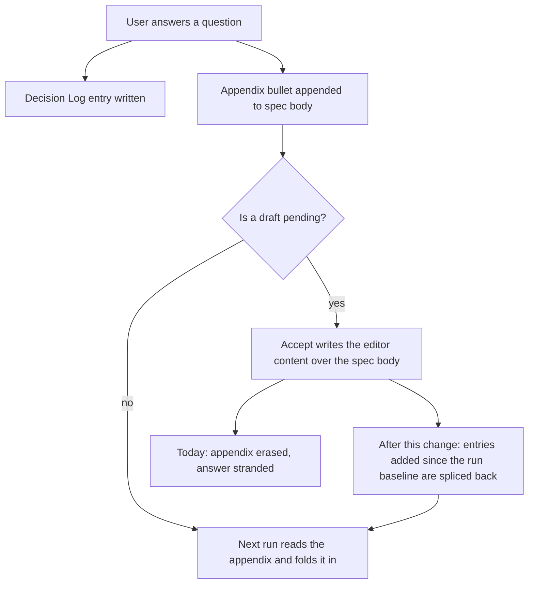
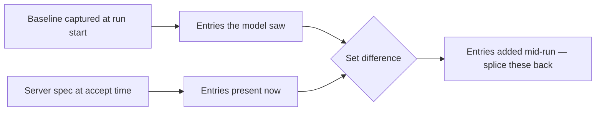

# Answering an Open Question During an AI Spec Update - Plan

## Goal Capsule

- **Objective.** Make answering an open question and running an AI spec update independent actions, so neither destroys the other's result.
- **Product authority.** Fizzy #1929. One of its two failure windows is verified end-to-end; the other is inferred from code — see Evidence Standing.
- **Authority order.** This plan's Requirements, then the ticket, then repo convention. Where they disagree, stop and ask rather than guessing.
- **Stop conditions.** Stop and surface if the accept path turns out to have no reliable pre-run baseline to compare against, or if keeping the spec editor mounted across tabs breaks the page's height chain in a way that can't be contained.
- **Open blockers.** None.

**Product Contract preservation.** Changed from the brainstorm: the mechanism in Key Decisions moved from "defer the spec write and flush it later" to "keep the write immediate and protect it at accept", and R6 changed accordingly. Requirements R1–R5 and R7–R12 are unchanged. The change removes the queue the brainstorm assumed, because research found the durable queue already exists (see KTD1).

---

## Evidence Standing

This plan is honest about which half of the ticket is proven, because the fix's confidence differs per half.

**Verified end-to-end.** Answering a question while a draft awaits approval, then accepting the draft, destroys the answer's integration into the Clean Spec. Checked by observation of end state, not by comparison: after accepting, neither answer's text appeared in the spec, while both remained `Resolved` in the Decision Log.

**Not reproduced — closed.** Answering while the model is still writing was observed once to end with no draft, and a single control run that same session did produce a draft. Two later control runs then hung indefinitely with no error and no draft, which means the environment produces that same outcome on its own.

U2's characterization test then settled it under controlled timing, against the real editor, diff pipeline and confirmation flow. A pending draft survives a maturation-tab round trip: the editor instance lives above the tab gate, and unmounting the content region detaches its DOM without destroying the view. An answer landing mid-run does not disturb the run either — the existing guard holds, the diff still paints, and the confirmation still arrives. Neither falsification of the test passed silently: scoping the editor's dependencies to the active tab fails three of its five cases, and short-circuiting the guard fails the mid-run case.

R1 therefore closes as **not reproduced**, citing `apps/web/__tests__/copilot/story-workspace-tab-mount.test.tsx`, under the Definition of Done's deferral clause. No mounting change was made. What is genuinely broken on this surface is **reach**, not state: with a non-spec tab active the review controls are unrendered, which is U3's subject.

**Environment note.** The staging spec-refresh pipeline degraded partway through investigation: a run can sit in a thinking state indefinitely, surfacing no error, no timeout, and no signal on the platform status page. That is its own defect and is out of scope here.

---

## Product Contract

### Summary

Answering an open question keeps writing to the Clean Spec immediately, and that write is protected from being overwritten when the user accepts a concurrently-generated AI draft. The spec editor stops unmounting when the user switches maturation tabs, so a pending draft and its approve and reject controls survive the trip to the questions tab and back.

### Problem Frame

Feature maturation asks a product owner to do two things in one sitting: answer the open questions the model raised, and approve the spec the model rewrote. Today those two actions collide.

An answer appends a bullet to a pending-integration appendix at the end of the spec body. That appendix is the only channel by which a later AI run learns the decision — the run receives a prompt, retrieved context, and the spec text, and the agent serving it has no database access. So an answer that never reaches the spec text is not merely delayed; it is stranded, because no future run can recover it from the Decision Log.

Accepting an AI draft writes the editor's content over the whole spec body. The editor was built from a snapshot taken before the answer landed, so the accept silently erases the appendix. The Decision Log then reads `Resolved` for a question the spec carries no trace of, and the pending-decision indicator — which counts from the spec body — goes quiet, so nothing signals the loss.

The cost lands on the workflow the team has designated as its standard. The available workaround, answer nothing until the draft is approved, forbids exactly the concurrent working style the two surfaces were built to support.

This is the third report in one family. Fizzy #1863 was "the inline diff flashes then vanishes", fixed by adding a predicate that defers the editor's story-prop sync while a review is open. Fizzy #1987 was "my edits revert unless I save often", fixed by adding a fourth flag to that same predicate. Each fix guarded one more timing window against the same event: a background refetch rebuilding the editor while something else owns the document. A sixth flag would fit the pattern and would not end it.

### Key Decisions

- **Protect the write instead of deferring it.** The appendix an answer writes is already durable server state, so the queue a deferral scheme would build already exists. Deferring would add a second write path, a flush trigger for every terminal state a run can reach, and a window in which the decision is recorded but invisible on every surface. Keeping the write immediate and splicing it back at accept achieves the same requirements with none of that.

- **Guard the write, not the sync.** The existing predicate defers the editor rebuild whenever a review might be open, which is why it has needed a new flag per reported timing window. The predicate stays as defense in depth; it stops being the thing the fix rests on.

- **Do not block answering during a run.** Disabling the answer controls while an update runs would be the smallest change and contradicts the design intent the feature was built on. It also trades a data-loss bug for a workflow restriction the team already rejected.

- **Hide the spec editor across tabs, do not unmount it.** Unmounting is what makes a pending draft's fate depend on when the user switched tabs, and it is why the approve controls vanish from the questions tab. One change addresses both.

- **Keep the draft derived.** The AI proposal is not persisted; it exists as diff marks in the editor plus the agent's document state, resolved through a confirmation step. A stored draft row is a larger architectural change than this defect justifies.

### Requirements

**Draft survival**

- R1. Answering one or more open questions while an AI spec update is running does not prevent the resulting draft from being surfaced for approval.
- R2. A pending draft survives switching between maturation tabs and back.

**Answer durability**

- R3. An answer is recorded in the Decision Log immediately, independent of whether an update is in flight.
- R4. An answer written while a draft is pending survives the user accepting that draft.
- R5. When several answers are submitted close together, every one survives. This requires the spec read and the spec write to sit in one transaction — today the read happens outside it, so two answers race on the same base text and the later one wins.
- R6. Accepting a draft never resurrects a decision the run already folded into the spec.

**Approval reachability**

- R7. While a draft awaits approval, the approve and reject controls are reachable from every maturation tab.
- R8. A pending draft is discoverable from the questions tab, so the user can tell a review is waiting without navigating back to find out.
- R9. Approve and reject controls render only for users who may edit the feature, on every tab that offers them. Authorization itself is enforced server-side by the update procedure's permission middleware; this requirement is the presentational mirror of that check, and adds no new server surface.

**Consistency**

- R10. No decision recorded while a run was in flight is dropped by resolving that run's draft. The broader invariant — that nothing is ever marked resolved in the Decision Log while the spec carries no trace — depends on runs actually integrating what they are given, which this plan does not verify (see Scope Boundaries).
- R11. The pending-decision indicator reflects what the spec actually carries after a draft is resolved.

**Documentation accuracy**

- R12. The doc comments in `packages/api/modules/projects/lib/record-answer-in-spec.ts` claiming no version snapshot is written match the code's actual behavior.

### Key Flows

- F1. Answer lands while a draft awaits approval
  - **Trigger:** A draft is on screen; the user leaves for the questions tab and answers a question.
  - **Steps:** The answer records and appends to the spec appendix; the pending draft stays mounted with its controls reachable; the user accepts; the accept splices the appendix back over the accepted content.
  - **Outcome:** Both the accepted rewrite and the answer are present.
  - **Covered by:** R2, R3, R4, R7, R8, R10

- F2. Answer lands while the model is still writing
  - **Trigger:** A run is streaming; the user answers a question before any draft appears.
  - **Steps:** The answer records and appends; the run completes and paints its draft into a still-mounted editor; the user resolves it; the accept path splices as in F1.
  - **Outcome:** The draft was reviewable and the answer reached the spec.
  - **Covered by:** R1, R2, R3, R4

- F3. The run already folded the decision in
  - **Trigger:** A run reads the appendix, integrates each decision into the body, and deletes the appendix as instructed.
  - **Steps:** The accept path compares against the pre-run baseline, finds those entries were already present before the run, and re-adds nothing.
  - **Outcome:** No duplicate decision text accumulates.
  - **Covered by:** R6

### Acceptance Examples

- AE1. Answer survives acceptance
  - **Covers R4.**
  - **Given** a draft awaiting approval and an answer submitted while it waits,
  - **When** the user accepts the draft,
  - **Then** the answer's text is present in the Clean Spec.

- AE2. Integrated decisions are not resurrected
  - **Covers R6.**
  - **Given** an appendix entry that existed before the run started,
  - **When** the run integrates it, deletes the appendix, and the user accepts,
  - **Then** that entry is not re-appended.

- AE3. A pending draft survives a tab round trip
  - **Covers R2, R7.**
  - **Given** a draft awaiting approval,
  - **When** the user switches to the questions tab and back,
  - **Then** the diff and its approve and reject controls are still present.

- AE4. Approval is reachable from the questions tab
  - **Covers R7, R8.**
  - **Given** a draft awaiting approval,
  - **When** the user is on the questions tab,
  - **Then** the pending review is visible and can be both approved and rejected there.

- AE5. Two answers in quick succession
  - **Covers R5.**
  - **Given** two open questions,
  - **When** both are answered close enough together that their writes overlap,
  - **Then** both bullets are present in the appendix.

- AE6. A viewer sees no approval controls
  - **Covers R9.**
  - **Given** a user without edit permission,
  - **When** a draft is pending,
  - **Then** the new cross-tab controls do not render for them.

### Scope Boundaries

- The server error observed on the change-summary procedure during a run.
- A run that hangs indefinitely with no error, no timeout, and no status-page signal. Observed twice; larger than this fix and not caused by it.
- Version-number collisions where two snapshot writes claim the same version and the loser is dropped silently. Adjacent to R5 but distinct: R5 covers two answers racing on the spec text.
- Whether a run actually integrated the decisions it was given. Integration is currently assumed whenever the model's output omits the appendix; verifying it needs its own design.
- Two browser tabs open on the same feature converging on one pending draft.
- Appendix preservation outside the web review path. The spec body is replaced wholesale by roughly a dozen other callers — the public API, PM import, the kanban webhook, and several sync activities — and any of them can still drop pending-decision entries. This fix is client-path only; a server-side invariant protecting the appendix is a larger change.
- The dormant per-answer patch machinery (`propagate-decision-to-spec.ts` and its accept procedure). Dead but out of scope to remove here.
- The open-question text rendering twice in the questions panel.

### Dependencies / Assumptions

- The confirmation step that gates the AI draft stays the approval mechanism; this work changes what survives around it.
- The pre-run baseline captured when a run starts is a faithful snapshot of the spec before the model touched it. KTD2 depends on this; if it does not hold, stop.
- Verification on production is only possible after the change ships. Pre-merge evidence is local tests plus staging when its pipeline recovers.

---

## Planning Contract

### Key Technical Decisions

- KTD1. **The appendix is the queue.** An answer appends under a pending-integration heading at the end of the spec body, and that write already lands on the server before the user can do anything else. It survives reload, navigation, and tab close. Nothing needs to be queued client-side, and no new table is warranted.

- KTD2. **Splice by baseline difference, not by presence.** At accept, re-adding every appendix entry found on the server would resurrect decisions the run just integrated and deleted. Compare instead against the baseline captured when the run started: entries present on the server now but absent from that baseline are exactly the ones the model never saw, and only those are re-added. This is the same shape as the existing Do Not Modify guard — extract before the rewrite, splice back after.

- KTD2a. **Match entries on normalized question text, never on raw bullet text.** The two sides of that comparison come from different serializers. The baseline is the editor's Turndown output; the server text is markdown written directly by the answer path, and the editor file's own comments record that the two are never byte-equal for a bulleted document. A raw set difference would therefore report every server entry as new and duplicate decisions on every accept. Derive a key from each bullet's question text with whitespace collapsed and inline decoration stripped, and compare keys. A third shape exists — the baseline is built by a different helper when no run started during this mount — so the key must tolerate all three.

- KTD2b. **Splice above the acceptance-criteria boundary, not at the end of the document.** The content the accept path saves is the combined document, and the save splits it on the first acceptance-criteria heading and stores the tail in a separate column. Appending at the end would file decision bullets as acceptance criteria: it corrupts the column the QA matrix and criteria parser read, leaves the pending-decision count reading zero because that count scans the description, and hides the entries from every later run. Insert immediately before the first acceptance-criteria heading, falling back to end-of-document only when the saved content has none.

- KTD2c. **Re-create the appendix heading when the spliced content lacks it.** The model is instructed to delete the heading once it integrates, so the common case is saved content with no heading and entries to restore. The prompt clause that teaches a later run to consume those entries is conditional on that exact heading string — entries restored as bare bullets would survive as text and be invisible to every future run, which is the stranding this fix exists to prevent.

- KTD3. **The splice logic lives in a pure module, not in the editor component.** The guard predicate from the two prior reports earns its keep because it is pure and directly tested; the component around it is not. A new `pending-decisions-preserve` module keeps this fix testable without mounting an editor, and gives the next timing window somewhere to land other than the component.

- KTD4. **Hide the spec editor region, do not unmount it.** The v1 path currently renders the editor unconditionally with no DOM wrapper so the height chain is unchanged; v2 gates it on the active tab. Keep the v1 path exactly as it is and make the v2 gate a visibility toggle rather than a mount toggle. Layout regression is the risk this decision carries.

- KTD5. **Make the answer's spec write read-modify-write inside one transaction.** The read currently happens outside the transaction that writes, so two answers seconds apart compute their bullet against the same base and the later write wins. The version guard does not help, because it reads its own version inside its own transaction immediately before writing.

- KTD6. **Assert mechanisms, not outcomes.** Prior learnings in this repo record two failures where a guard could never arm and its tests still passed. Tests here assert that the splice arms on a real pending-draft state, and that the transactional write uses the guarded query — not merely that the end value looks right.

### High-Level Technical Design

Where each write lands today, and what changes. The answer write and the accept write both target the same column; only the accept path is modified.

The baseline comparison that makes the splice safe:

### Assumptions

- Feature Maturation V2 is on for the accounts that hit this. The client and server disagree on the flag's default when no org row exists; that disagreement is pre-existing and untouched here.

**Retracted assumption.** An earlier draft assumed the accept handler could read the answer's text from the story prop, on the grounds that the answer's mutation invalidates that query. It cannot. The confirmation renderer's closure does not list the story among its dependencies, so it is not rebuilt when the invalidation lands, and the effect that would refresh the editor is deliberately frozen for the whole review. The invalidation is also fire-and-forget and only fires on one propagation status. U1 therefore reads the spec at click time rather than trusting anything captured earlier.

### Sequencing

U1 is the verified fix and lands first so it can be validated on its own. U2 and U3 are the tab-mounting work; U3 depends on U2, and neither depends on U1. U4 is server-side and independent. U5 is documentation.

---

## Implementation Units

### U0. Extract the appendix heading locator into shared utils

- **Goal.** Make the heading scanner importable from the web app.
- **Requirements.** Enables R4, R6
- **Dependencies.** None
- **Files.**
  - `packages/utils/lib/markdown-heading.ts`
  - `packages/api/modules/projects/lib/record-answer-in-spec.ts`
- **Approach.** The scanner that locates the appendix heading is a module-private function in a server file that imports the database package, so a client module cannot import it at all. Move it into the shared markdown-heading utility next to `stripInlineDecoration` and `findSectionEndIdx`, parameterized on the heading string, and have the server file import it from there. Behavior stays identical; this is a move, not a rewrite. Without it, U1 either duplicates the scanner — the drift the reuse mandate exists to prevent — or stalls.
- **Test scenarios.**
  - The existing answer-path tests pass unchanged against the moved function.
  - The moved function still matches a decorated and a demoted heading, and still returns an offset measured against the original text rather than the normalized copy.
- **Verification.** Both the server answer path and a web module can import one scanner.

### U1. Preserve mid-run decisions across a draft resolution

- **Goal.** Resolving a draft stops erasing appendix entries written after the run started.
- **Requirements.** R4, R6, R10, R11
- **Dependencies.** U0
- **Files.**
  - `apps/web/modules/saas/projects/lib/stories/pending-decisions-preserve.ts` (new)
  - `apps/web/modules/saas/projects/lib/stories/__tests__/pending-decisions-preserve.test.ts` (new)
  - `apps/web/modules/saas/projects/components/stories/StoryWorkspace.tsx`
- **Approach.** The new module exposes a pure function taking the pre-run baseline text, the server's current spec text, and the content about to be saved, and returning that content with any baseline-absent appendix entries restored. Entry identity is the normalized question key of KTD2a, not raw bullet text. Placement follows KTD2b — above the first acceptance-criteria heading — and the heading is re-created per KTD2c when the saved content has none.

  Wire it into **both** exits of the review, not just accept. The accept path has three branches — a stage-transition write, a deferred write when a save is already in flight, and the ordinary write — all deriving from one produced content value, so splicing where that value is produced reaches all three. The reject path restores the pre-run baseline into the editor and marks it dirty, so the next autosave writes that pre-answer text back over the server; it needs the same splice applied to its restore content.

  The server-side input must be read at click time, not taken from a value the renderer's closure captured. Use the latest-value ref pattern the file already uses for agent state and the save handler.
- **Patterns to follow.** The Do Not Modify guard's extract-then-splice shape. The shared scanner from U0. `stripInlineDecoration` is match-only and lossy — slice the original text, never the normalized copy.
- **Execution note.** Write the pure module and its tests first; the component wiring is small once the function exists.
- **Test scenarios.**
  - Covers AE1. An entry present on the server but absent from the baseline is restored into the saved content.
  - Covers AE2. An entry present in both baseline and server text is not restored.
  - Serialization mismatch: the baseline carries editor-shaped bullets while the server carries stored-shaped bullets for the same decision — the entry is recognized as already-present and not duplicated.
  - The baseline came from the initial-content helper rather than a run capture — the third shape is still matched.
  - A story with populated acceptance criteria: restored entries land above the acceptance-criteria heading, and the criteria column is byte-identical after a save round trip.
  - Saved content has no appendix heading and entries to restore: the heading is re-created with the exact string the prompt clause matches.
  - Saved content already carries the heading: entries merge under it rather than producing a second one.
  - Reject path: after a reject followed by an ordinary save, the appendix entry is still in the spec.
  - Two entries added mid-run: both restored, in the order the server holds them.
  - The function arms on a realistic pending-draft state — assert against a full spec body, not a two-line fixture.
- **Verification.** Resolving a draft either way saves content carrying both the model's rewrite and any decision recorded during the run, no decision appears twice, and the acceptance-criteria column is untouched.

### U2. Characterize the pending draft across a maturation-tab round trip

**Outcome: the premise did not hold. No production change was made; this unit shipped as a regression guard only.** The rest of this section is kept as written because it records what was checked and why the gate change was not needed.

- **Goal.** Establish whether a pending draft depends on which tab the user was standing on.
- **Requirements.** R2 (R1 closed as not reproduced — see Evidence Standing)
- **Dependencies.** None
- **Files.**
  - `apps/web/modules/saas/projects/components/stories/StoryWorkspace.tsx`
  - `apps/web/__tests__/copilot/story-workspace-tab-mount.test.tsx` (new)
- **Approach.** The Clean Spec region is rendered only when its tab is active in v2, while v1 renders it unconditionally. Wrap the v2 region in a container toggled with the `hidden` display utility — the same shape the file already uses to hide the diff-preview region — so the hidden subtree leaves both the tab order and the accessibility tree. Layout-preserving techniques such as `visibility`, zero opacity, or off-screen positioning are wrong here: they would let a keyboard user tab into an invisible editor and let a screen reader read the whole hidden spec. The wrapper must itself carry the flex chain the gated children rely on, and display utilities do not compose by class order, so a `contents`-plus-`hidden` toggle is not a safe mechanism.

  Leave the v1 branch byte-for-byte as it is — its comment records that the absence of a DOM wrapper is load-bearing for the height chain.
- **Execution note.** Characterization first, and be prepared for a negative result. The editor instance is created at component level and only the content region sits inside the tab gate, so the document and its diff marks may already survive a tab round trip; what demonstrably breaks today is reachability of the controls, which is U3's job. Write the characterization test before changing the gate. If it shows a pending draft already survives, R1 closes as not-reproduced with that test recorded as the reason under the Definition of Done's deferral clause, and this unit's value rests on R2 and on enabling U3.
- **Test scenarios.**
  - Covers AE3. With diff marks painted and a confirmation pending, switching tabs and back leaves both intact.
  - An answer mutation fires while the run is streaming: the diff still paints and the confirmation still arrives. This is the only scenario that can falsify the inferred mechanism behind R1.
  - A diff painted while a non-spec tab is active is present when the user returns to the spec tab.
  - With a non-spec tab active, the editor's controls are neither focusable nor exposed to the accessibility tree.
  - The v1 path renders the same tree as before the change — assert the wrapper is absent when the maturation flag is off.
  - Switching tabs does not trigger the editor's save path or mark the document dirty.
- **Verification.** The editor node stays in the tree across tab changes, is fully hidden from keyboard and assistive technology while inactive, and the spec tab shows no layout regression at default and narrow widths.

### U3. Reach and see a pending review from any maturation tab

- **Goal.** The user can tell a review is waiting, and act on it, without returning to the spec tab.
- **Requirements.** R7, R8, R9
- **Dependencies.** U2
- **Files.**
  - `apps/web/modules/saas/projects/components/stories/StoryWorkspace.tsx`
  - `apps/web/__tests__/copilot/story-workspace-cross-tab-review.test.tsx` (new)
  - `packages/i18n/translations/en.json`
- **Approach.** Add a **new, compact cross-tab banner** in the shared area above the tabs. The existing review bar stays exactly where it is inside the spec tab's sticky header — it owns per-change navigation and the diff view-mode toggle, which are meaningless above the tabs and whose sticky placement was built deliberately. This unit adds a second surface for the same decision, it does not relocate the first.

  The banner carries three actions: approve, reject, and a route to the diff that switches the active tab to Clean Spec and moves focus to the review bar. Approving an entire spec rewrite from a tab that shows no diff would otherwise turn a considered review into a blind confirm, which is the failure mode this surface exists to prevent.

  Render one banner, not one per tab; two mounted copies would race to resolve the same draft. Place it directly above the existing pending-decision bar and suppress that bar's refresh action while a review is pending, so the user resolves the open draft before starting another run.

  Gate on `StoryWorkspace`'s `canEdit` prop — computed server-side from the story-update permission and already in scope where the banner renders. The questions panel receives no permission prop today, so nothing needs threading unless part of the affordance renders inside it. Apply the same gate to the existing spec-tab review controls, which carry no permission check today; leaving them ungated would make R9 true only for the new instance.

  Include an always-mounted polite live region announcing that a draft became pending and that it was resolved, following the regeneration notice already kept outside the tab gate for exactly this reason. Disable both controls and show a pending label while a resolution is in flight, including the deferred-write branch, and surface a failed accept inline on the banner rather than dismissing it. After a resolution completes from a non-spec tab, move focus to the active tab trigger rather than letting it fall to the body.
- **Test scenarios.**
  - Covers AE4. With a confirmation pending and the questions tab active, approve, reject, and the route-to-diff action all render.
  - Covers AE6. With edit permission absent, no approve or reject control renders on any tab, including the spec tab.
  - With no confirmation pending, the banner does not render on any tab.
  - Exactly one cross-tab banner exists while a review is pending, and the spec tab's own review bar is still present.
  - The route-to-diff action makes the Clean Spec tab active with the diff visible and focus on the review bar.
  - Approving from the questions tab resolves the same draft as approving from the spec tab.
  - The polite live region is mounted before the draft arrives and carries announcement text after it does.
  - While a resolution is in flight the controls are disabled; a failed accept leaves the banner mounted with an inline error.
  - The pending-decision bar's refresh action is not actionable while a review is pending.
- **Verification.** A pending review is announced, visible, reviewable and actionable from the questions tab; exactly one banner exists; and no approve control renders for a user without edit permission.

### U4. Make an answer's spec write atomic

- **Goal.** Two answers submitted close together both survive.
- **Requirements.** R3, R5
- **Dependencies.** None
- **Files.**
  - `packages/api/modules/projects/lib/record-answer-in-spec.ts`
  - `packages/api/modules/projects/procedures/stories/maturation/answer-question.ts`
  - `packages/database/prisma/queries/projects/stories.ts`
  - `packages/api/modules/projects/lib/__tests__/record-answer-in-spec.test.ts`
- **Approach.** The procedure reads the spec, computes the appended text, and hands it to a write that opens its own transaction. Move the read inside that transaction **and take a row lock on the story row at the top of it**, using the locking shape already present in the same query module. A plain read inside the transaction is not enough: under this database's default isolation the second writer still reads pre-answer text, then the compare-and-set matches zero rows and throws. That converts silent loss into detected loss, which is an improvement but does not satisfy R5 — the lock is what makes the second answer's bullet compute against the first one's result.

  The answer path currently swallows every error into a non-fatal status that the client shows as a warning, so a conflict would degrade back to "resolved in the log, absent from the spec". Decide the client behavior explicitly: a conflict that survives the lock must surface as a failure, not a warning.

  R3 rides along here because this unit reshapes the procedure that owns it and is the only unit that could regress it.
- **Patterns to follow.** The repo's compare-and-set convention: the guard belongs in the query's `where` clause inside the transaction, and a zero updated-count is the conflict signal. Keep the existing tenant predicate — every read and write against this row pairs the story id with the project id, and tenant isolation rides on that pairing. The concurrency guard is **added to** that predicate, never substituted for it.
- **Test scenarios.**
  - Covers AE5. Two answers issued concurrently both appear in the final appendix.
  - The read happens inside the transaction and under the row lock — assert the mechanism, not only the resulting text.
  - The guarded write still carries the story-id-plus-project-id predicate.
  - The Decision Log entry is written and returned even when the subsequent spec write conflicts or fails (R3).
  - A single answer still produces exactly one bullet with unchanged formatting.
  - A conflict that survives the lock surfaces as a failure rather than a warning-level status.
- **Verification.** Concurrent answers accumulate instead of overwriting, tenant scoping is intact, and the existing single-answer behavior is unchanged.

### U5. Correct the version-snapshot doc comments

- **Goal.** The file stops asserting behavior the code does not have.
- **Requirements.** R12
- **Dependencies.** None
- **Files.**
  - `packages/api/modules/projects/lib/record-answer-in-spec.ts`
- **Approach.** Two places claim this path writes no version snapshot — the file header and the function doc. Because the write changes the description, the shared update path takes its snapshot branch: it increments the story version and writes a snapshot row. Correct both, and state what is actually true rather than deleting the sentence.
- **Test expectation: none — comment-only change.**
- **Verification.** Neither comment claims a snapshot is skipped.

---

## Verification Contract

| Gate | Command | Applies to |
|---|---|---|
| Unit tests, new modules | `pnpm --filter web test modules/saas/projects/lib/stories/__tests__/pending-decisions-preserve.test.ts` | U1 |
| Existing guard regression | `pnpm --filter web test modules/saas/projects/lib/stories/__tests__/diff-review-guard.test.ts` | U1, U2 |
| Editor and tab behavior | `pnpm --filter web test __tests__/copilot/story-workspace-tab-mount.test.tsx __tests__/copilot/story-workspace-cross-tab-review.test.tsx` | U2, U3 |
| Answer write | `pnpm --filter @repo/api test modules/projects/lib/__tests__/record-answer-in-spec.test.ts` | U0, U4 |
| Types | `pnpm type-check` | all |
| Lint and format | `pnpm lint` | all |

The two prior reports in this family have regression tests in `diff-review-guard.test.ts`. They must keep passing. If a test there is named for a rule this change narrows, rename it to state what still holds rather than deleting it.

Prove the new tests are not vacuous: revert each unit's change and confirm its tests fail.

---

## Definition of Done

- Every requirement R1–R12 is either satisfied by a landed unit or explicitly recorded as deferred with a reason. R1 is deferred-with-reason if U2's characterization test shows a pending draft already survives a tab round trip, citing Evidence Standing.
- Each of U0–U4 has at least one test that fails when that unit's change is reverted; U5 is comment-only and carries none.
- The prior-report regression tests pass unmodified, or any renamed test states a rule that is still true.
- No decision text appears twice in a spec after a draft is resolved, and none is lost after either accept or reject.
- The acceptance-criteria column is unchanged by a splice on a story that has criteria.
- The spec tab shows no layout regression at default and narrow widths, and the shared area above the tabs is checked at the same widths with the new banner present.
- Exactly one cross-tab review banner exists while a review is pending, and no approve control renders for a user without edit permission.
- Abandoned or experimental code from approaches that did not work out is removed, not left in the diff.
- A changeset exists bumping `fabric-app`.
- Staging verification is attempted once the spec-refresh pipeline is healthy; if it is still degraded at merge time, that is recorded on the ticket rather than claimed as passed.

---

## Sources / Research

The appendix is the only channel by which an answer reaches a later run:

- `packages/agent-prompts/src/core/pending-decisions-integration.ts` — the shared heading constant and the integration clause, which is conditional on that heading appearing in the document and inert without it.
- `packages/api/modules/projects/procedures/stories/maturation/get-editor-state.ts` — counts pending decisions from the spec body, which is what makes the indicator go quiet when the appendix is lost.
- `packages/api/modules/projects/lib/record-answer-in-spec.ts` — writes the appendix; also holds the heading locator and decoration-stripping logic U1 must reuse.
- `packages/database/prisma/queries/projects/stories.ts` — the update path that snapshots a version whenever the description changes, contradicting the comments U5 fixes.

The surfaces the fix touches:

- `apps/web/modules/saas/projects/components/stories/StoryWorkspace.tsx` — the editor host, the effects that sync editor state against the story prop, the confirmation action and its three accept exits, and the tab-conditional render of the spec editor.
- `apps/web/modules/saas/projects/lib/stories/diff-review-guard.ts` — the predicate from the two prior reports, kept as defense in depth.
- `apps/web/modules/saas/projects/components/stories/maturation/SummaryQuestionsPanel.tsx` — the questions surface that gains the pending-review affordance.

Dormant machinery worth recognizing so it is not mistaken for the fix: `packages/api/modules/projects/lib/propagate-decision-to-spec.ts` and `packages/api/modules/projects/procedures/stories/maturation/accept-clean-spec-patch.ts` implement a stash-pending-then-apply flow that nothing calls; the answer procedure's own comments record them as dormant.

Institutional learnings that shaped the decisions above:

- `docs/solutions/architecture-patterns/scheduling-an-interactive-ai-engine-deletes-its-safety-model.md` — the same failure class one abstraction up: a long model call racing a human write on one record. Source of KTD6's rule that a read-then-write version check is decorative.
- `docs/solutions/architecture-patterns/prompt-text-is-the-contract-a-guard-matches-on.md` — a guard that can never arm is indistinguishable from one that was never needed. Source of the assert-it-arms test scenarios.
- `docs/solutions/architecture-patterns/reversing-a-safety-invariant-narrow-it-do-not-delete-it.md` — when a rule becomes conditionally false, rewrite every artifact that states it, including test names.
- `docs/solutions/conventions/derive-query-invalidation-keys-never-hand-build-them.md` — this repo registers query keys in three incompatible shapes; derive them, never type a literal.
- `docs/solutions/architecture-patterns/cancelling-temporal-backed-jobs.md` — the compare-and-set and terminal-state-wins shapes behind KTD5.
