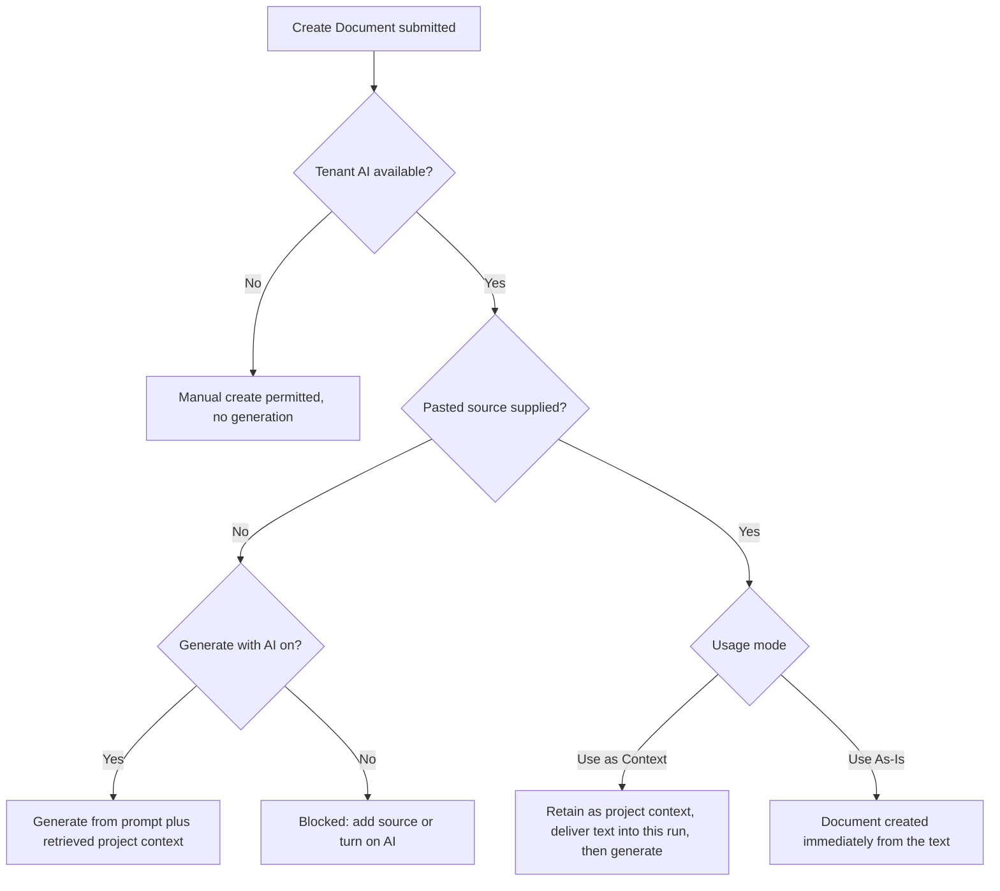
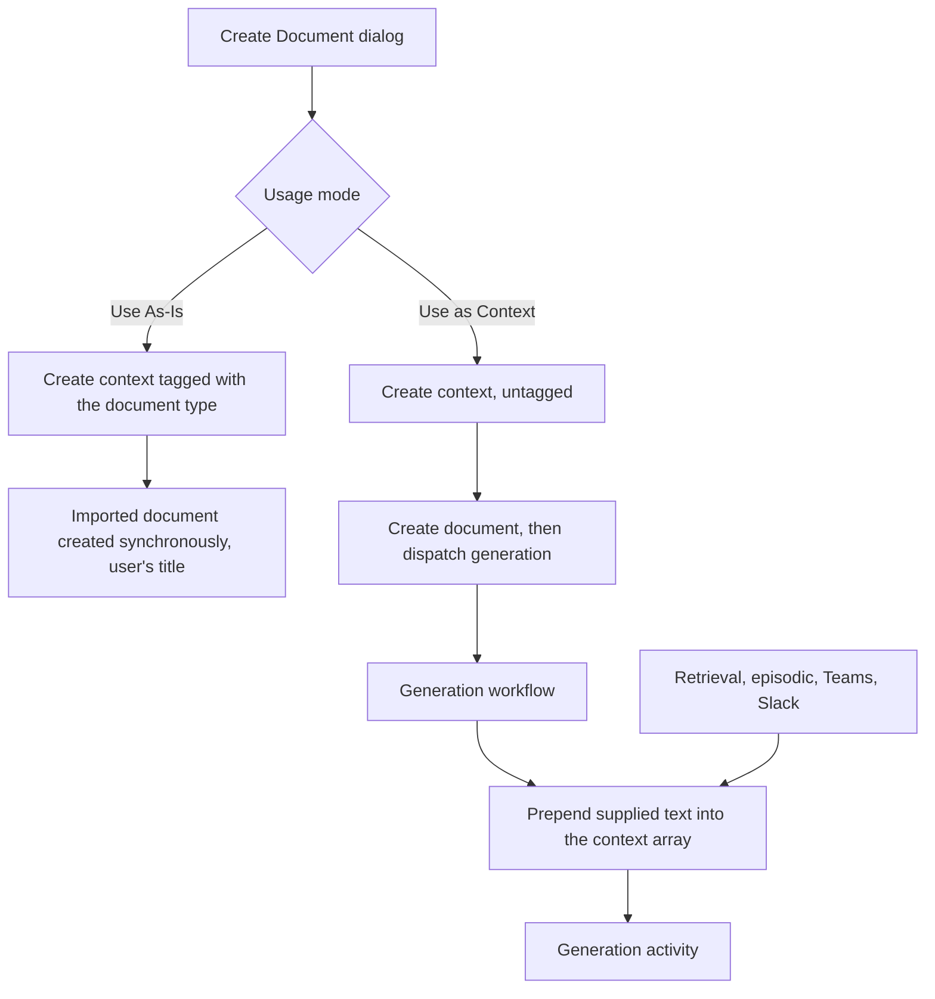

# Documents Tab Create Document Flow - Plan

## Goal Capsule

- **Objective:** Bring the project Documents tab's Create Document flow to parity with the onboarding document-generation experience, and let a user paste source material that either feeds the generation or becomes the document itself.
- **Scope of this plan:** the synchronous slice. Pasted source content in both usage modes ships here. Attached files and the whole asynchronous arrival/failure surface are deferred to follow-up work with their decisions already recorded.
- **Product authority:** Fizzy #2190 (`[Proj. Suite 1B]`), part of the Project Onboarding and Readiness Suite. Follow-up: Fizzy #2199.
- **Prerequisite, landing separately:** the existing document-generation entry point is gated on an organization-role check that is skipped entirely in personal tenant context, with a fallback that confirms project membership without inspecting the member's role. A read-only project guest can therefore trigger a generation that overwrites a document. That entry point stays reachable from the editor's regenerate action, so it is fixed in its own focused change — reviewable as a security fix rather than buried in a feature diff, and verifiable against the personal-context regression risk that changing the gate carries. This plan assumes that fix lands first; it does not implement it.

  This flow does **not** inherit that gate. Its combined create-and-dispatch call is a project-scoped procedure gated on the project-authoritative document-create permission, the same middleware the current create path uses, so a read-only guest is refused before any generation is dispatched. That is asserted by a test in this plan rather than assumed from a change this plan does not own.
- **Stop conditions:** Stop and ask if implementation shows that carrying supplied text into a generation run cannot be done additively — replacing retrieved project context is not an acceptable fallback. Stop if levelling the document-type catalog turns out to require schema changes. Do not ship the default-on change on its own ahead of the prerequisite permission fix, even though its unit is otherwise unblocked — defaulting generation on is precisely what turns the open gap into the primary path, so shipping it early inverts the reason for splitting the fix out. Stop if replay validation fails for a reason the existing patch-gate mechanism cannot address; that mechanism covers a new command in the stream and nothing else.
- **Product Contract preservation:** changed — R11, R14, R15, R18, R20, R22, R25 amended and R27–R35 added, all from research findings the user resolved directly. Each amended requirement carries an inline annotation in Requirements.

---

## Product Contract

### Summary

The Documents tab's Create Document flow gains prompt selection scoped to the document type, a title that defaults from that type, AI generation on by default, per-run instructions, and pasted source content used one of two ways: as supporting context for the generation, or as the document body verbatim. The flow reaches the source-content pipeline that already backs the project Context tab rather than introducing a second one.

### Problem Frame

Document generation in Fabric is concentrated in project creation. The onboarding wizard's generation step lets a user pick a prompt per document and add custom instructions; the Documents tab's Create Document flow offers a document type, a free-text title, and a checkbox. A user who realizes after setup that the project needs a Technical Specification has a materially weaker tool than the one they had during the first ten minutes of the project's life.

The gap is not only in controls. A user with existing material — a rough draft, a transcript, an older version of the same document — has no way to hand it to the flow. Fabric can already accept that material, but only through the Context tab, as a separate act with separate vocabulary, disconnected from the moment the user decided to create a document. The strongest path to a good document runs through a screen the user is not on, and the Documents tab reads as the weaker surface for the thing it is named after.

This matters beyond convenience: the suite's direction is that projects keep producing documents long after setup. A creation flow that only works well at setup pushes users back toward re-running onboarding-shaped work, or toward accepting a thinner document than they could have had.

### Key Decisions

- **Reuse the context pipeline for source storage; compose the document with the existing document helper.** Source content is stored as project context, exactly as it is today — no document-scoped source storage is introduced. But the document itself is created through the shared document helper rather than through the tagged branch inside the context procedure.

  The competing option was to route document creation through that tagged branch, which already produces a verbatim document from tagged content. Counted honestly, that route needs six edits to a short shared branch — a transaction, error propagation, a changed return shape, title threading, a corrected version description, and a tenant clamp — and it writes supplied content raw. The shared document helper already provides the first three by construction, and it sanitizes content, which the tagged branch does not.

  The helper cannot be called unchanged: it accepts neither the active flag, the imported source marker, nor the context link, and it hardcodes its version description. So this flow adds one transactional creation helper modeled on it — same transaction shape, same sanitization, same failure propagation — that accepts those three fields and a caller-supplied version description. That is a new small helper rather than a widening of the existing one, which has many unrelated callers.

  For a document used as-is, the context row is linked to the document, which keeps it out of the Context tab exactly as tagged imports behave today, and it is **not** embedded separately — the document is the retrievable artifact, and embedding both would put the same words in the retrieval corpus twice, forever, for every future generation of every type. For a document generated from context, the link is left unset and the context is embedded normally, because there the source and the document are genuinely different texts.

  This also removes the sharpest edge on the blocked-empty-creation rule: the cheapest way around it is a stub paste under Use As-Is, and a stub that is not embedded pollutes nothing.

- **Supplied context is delivered to the generation run additively.** Making a source retrievable is not the same as using it. Retrieval is similarity-scoped and, for content added moments earlier, may not be indexed yet — so a run could silently ignore the material the user just supplied. The source's text therefore reaches the run directly, alongside the retrieved project context rather than in place of it.

- **Creating a blank document is removed where AI is available, and kept where it is not.** With generation on by default and creation blocked when generation is off and no source is supplied, the current default path no longer exists. Research found no per-user AI permission — the real gate is whether the tenant has an AI provider configured. Removing the manual path unconditionally would lock an AI-unconfigured tenant out of document creation entirely, so the manual path survives exactly in that state.

- **Attached files and their asynchronous tail ship separately.** Extraction runs in the background, so a file-backed document does not exist when the flow closes, and the Documents tab has no way today to learn that it arrived, failed, or came back empty. That is a subsystem, not an edge case. Splitting it keeps the synchronous experience demonstrable and keeps the two decisions already made about files (below) from being implemented against an unbuilt surface.

- **Recorded for the follow-up: a file used as-is must not be run through the AI formatting pass.** The context-processing path currently sends every tagged upload through an AI cleanup activity that adds markdown structure. That contradicts the requirement that as-is content is not restructured. The pasted-text path does not call it, so this slice is unaffected.

- **Recorded for the follow-up: a file used as context defers generation until extraction completes.** Its text does not exist at dispatch time, so the additive-delivery promise cannot be met by generating immediately. The file path will generate from the same post-extraction hook that already creates imported documents.

- **Mode names follow the ticket, and stay clear of existing vocabulary.** The flow uses Use as Context and Use As-Is. Fabric already has a two-mode `designation` on story attachments meaning protected-versus-AI-readable; this is a different axis on a different entity and must not borrow that naming. The Context tab's own wording for the same underlying mechanism is left alone here.

### Actors

- A1. **Document author** — a project owner, product owner, business analyst, or contributor with permission to create documents.
- A2. **AI-enabled author** — a document author working in a tenant that has an AI provider configured. Only this actor sees a usable Generate with AI path.
- A3. **Fabric generation** — the background process that produces document content from a prompt, project context, supplied source, and user instructions.

### Key Flows

- F1. Generate a document with no source material
  - **Trigger:** A2 opens Create Document from the Documents tab.
  - **Steps:** Selects a document type; the title fills in from that type and the prompt selector defaults to that type's bound prompt. Optionally edits the title, picks a different prompt, and adds instructions for this run. Submits.
  - **Outcome:** A document is generated from the selected prompt, available project context, and the supplied instructions.
  - **Covered by:** R1, R5, R6, R7, R9, R24, R25

- F2. Generate a document using pasted material as context
  - **Trigger:** A2 pastes source text while creating a document.
  - **Steps:** The usage mode appears and defaults to Use as Context; Generate with AI stays on. The user submits.
  - **Outcome:** The text is retained as project context, and reaches this generation run alongside the context Fabric retrieves. The generated document need not preserve the source's wording or structure.
  - **Covered by:** R11, R12, R13, R14, R19, R26, R29, R30

- F3. Create a document from pasted material without AI
  - **Trigger:** A1 pastes source text and selects Use As-Is.
  - **Steps:** Generate with AI is disabled for the action. The user keeps a document type selected and submits.
  - **Outcome:** The document exists immediately with that text as its body, under the user's chosen title.
  - **Covered by:** R15, R16, R17, R21

- F4. Attempt to create an empty document
  - **Trigger:** A1 turns Generate with AI off and supplies no source content, in a tenant where AI is available.
  - **Outcome:** Creation is blocked and the flow explains the two ways forward.
  - **Covered by:** R20

- F5. Create a document where AI is unavailable
  - **Trigger:** A1 opens Create Document in a tenant with no AI provider configured.
  - **Outcome:** Generate with AI is not offered, and creating a document with a title alone is permitted.
  - **Covered by:** R25, R27

### Requirements

**Document type and title**

- R1. The flow defaults the document title to the selected document type's display name.
- R2. Changing the document type updates the defaulted title to match the new type.
- R3. Once the user edits the title, that title is preserved when the document type changes. A title cleared back to empty, or typed to exactly the current type's default, counts as not edited.
- R4. Every document type Fabric supports is selectable in the flow, and any selectable type can be produced from supplied source content.

**AI generation and prompt selection**

- R5. Generate with AI is on when the flow opens, in tenants where AI is available.
- R6. When Generate with AI is on, the flow shows the same prompt selection component used during project onboarding, scoped to the selected document type.
- R7. The prompt selection defaults to the bound default prompt for the selected document type, using the existing prompt inheritance behavior.
- R8. Changing the document type re-scopes the prompt options to the new type and selects that type's default; a prompt chosen for a previous type is not carried over.
- R9. The user can supply additional instructions that apply only to the current generation run and never change prompt binding configuration.
- R10. The flow offers only prompts the user is permitted to use.

**Source content**

- R11. The user can paste text as source content, and source content is optional when Generate with AI is on. *(Amended: attaching a file is deferred to follow-up work.)*
- R12. When source content is present, the flow offers two usage modes: Use as Context and Use As-Is.
- R13. Use as Context is selected whenever source content becomes present. Clearing the source removes the mode control and re-enables Generate with AI.
- R14. Use as Context retains the source as project context and delivers its text to the current generation run in addition to the project context Fabric retrieves. *(Amended: scoped to pasted text; the file case is a recorded follow-up decision.)*
- R15. Use As-Is requires source content, turns Generate with AI off for the action, and creates the document body from the supplied content with no AI transformation of that content — including the formatting pass the file path currently runs. Retaining the source as project context still embeds it for retrieval; that does not alter the document and is not what this requirement forbids. *(Amended: the no-transformation clause is new; its enforcement point for files lands with the follow-up.)*
- R16. Turning Generate with AI back on is how the user leaves Use As-Is, and doing so returns the usage mode to Use as Context unless the user chooses otherwise. The control stays operable while Use As-Is is selected — turning it off must never be a state the user cannot leave.
- R17. A document created with Use As-Is carries the selected document type and is an ordinary document afterwards, with no locking, approval semantics, or restriction on later AI actions — including later enrolment in scheduled refresh.
- R18. *(Amended: deferred in full with attached files; nothing in this slice validates uploads.)* Attached source content is validated against the file type and size limits Fabric applies to uploads elsewhere, using the same validation messages.
- R19. Pasted source content that is empty or whitespace-only blocks creation and explains why.

**Creation outcomes**

- R20. When AI is available, Generate with AI is off, and no source content is supplied, creation is blocked with the message: "Add source content or turn on Generate with AI to create this document." *(Amended: the block is now conditional on AI being available; in a tenant without it, title-only creation is permitted per R27.)*
- R21. A Use As-Is document created from pasted text is available as soon as creation succeeds, carrying the title the user chose rather than one derived from the source.
- R31. Creating a document of a type that already has an active document leaves the existing document active and the new one inactive, on every route this flow offers, preserving the one-active-document-per-type invariant that governs which documents reach retrieval. The flow tells the user this happened and offers to make the new document the active one for its type, rather than reporting a state it gives no way to resolve. Both routes apply the check: with generation on by default, exempting the generation route would make the invariant-violating path the majority one out of this dialog while the plan claimed to be preserving the invariant.
- R32. A creation that fails to produce a document reports that failure to the user; it never returns success having written only the source.
- R33. Before the user submits, the flow states what becomes of the supplied content: under Use as Context it is retained as project context and remains available to later generations; under Use As-Is it becomes the document and is not added to the project's retrieval corpus separately. A user who pastes material to make one document should not change what the project retrieves without being told.
- R34. Where Generate with AI is unavailable, the flow still accepts source content and creates the document from it as-is; the usage-mode control is not shown, because the alternative mode has no meaning in a tenant that cannot generate.
- R35. The source-content section names the file case and points at the surface that accepts files, so a user holding a document sees a stated boundary rather than a missing control.
- R22. *(Amended: deferred with attached files, and widened — arrival, failure, and empty-extraction outcomes must all be visible, not just arrival.)* A file-backed document is produced once extraction completes, and its arrival, failure, and empty-result cases are visible from the Documents tab.
- R23. A failed generation does not leave a document that presents as complete.

**Permissions and availability**

- R24. A user without document creation permission cannot create, generate, or store a document from this flow.
- R25. Where the tenant has no AI provider configured, Generate with AI is not offered. *(Amended: no per-user AI-generation permission exists in the system; tenant AI configuration is the real gate.)*
- R26. Generation never uses source content the user is not permitted to access, and source content retained by the flow follows existing document and source visibility rules.
- R27. Where Generate with AI is unavailable, creating a document from a title alone is permitted, so an AI-unconfigured tenant retains a way to create documents.

**Supplied-context handling**

- R28. The flow reads document type display names from one source derived from the schema enum, not a hand-maintained copy.
- R29. Supplied text is bounded before it reaches the model, and is excluded from that run's retrieval so it cannot be delivered twice. When the bound truncates it, both the model's copy and the user's view say so.
- R30. Supplied text is neutralized before it is stored, not only before it is delivered. It reaches this run's prompt inside the shared attachment envelope, and the retained context row holds already-neutralized text, so later runs that retrieve it raw cannot be made to forge the reference scaffolding the prompt uses to delimit context.

### Acceptance Examples

- AE1. Title defaulting yields to the user, and re-arms when cleared
  - **Covers R1, R2, R3.**
  - **Given** the flow is open and the user has not edited the title,
  - **When** the user selects Product Requirements Document and then switches to Technical Architecture,
  - **Then** the title shows the Technical Architecture display name.
  - **And given** the user types their own title first, **when** they switch document type again, **then** their title is unchanged.
  - **And given** the user clears the title to empty, **when** they switch document type, **then** the new type's default reappears.

- AE2. Prompt selection does not survive a type change
  - **Covers R8.**
  - **Given** Generate with AI is on and the user has selected a non-default prompt for the current document type,
  - **When** the user changes the document type,
  - **Then** the prompt options are those of the new type and the new type's default prompt is selected.

- AE3. Supplied context reaches the run without displacing retrieved context
  - **Covers R14, R29.**
  - **Given** the user pastes source text with Use as Context selected,
  - **When** generation runs,
  - **Then** the pasted text is present in the run's context even though it was supplied moments earlier,
  - **And** the project context Fabric would otherwise have retrieved is still present,
  - **And** the pasted text appears once, not twice.

- AE4. Use As-Is keeps the user's title and the user's words
  - **Covers R15, R21.**
  - **Given** the user pastes text, selects Use As-Is, and has typed a title,
  - **When** the user submits,
  - **Then** the document exists immediately with the pasted text as its body and the user's title,
  - **And** no AI step ran against that content.

- AE5. Empty non-AI creation is refused
  - **Covers R20.**
  - **Given** AI is available, Generate with AI is off, and no pasted text is present,
  - **When** the user attempts to create,
  - **Then** creation does not occur and the message "Add source content or turn on Generate with AI to create this document." is shown.

- AE6. Leaving Use As-Is restores the default mode
  - **Covers R16, R13.**
  - **Given** source content is present and the user has selected Use As-Is,
  - **When** the user turns Generate with AI back on,
  - **Then** the usage mode returns to Use as Context.
  - **And given** the user then clears the pasted text, **then** the mode control disappears and Generate with AI stays on.

- AE7. An AI-unconfigured tenant can still create a document
  - **Covers R25, R27.**
  - **Given** the tenant has no AI provider configured,
  - **When** the user opens Create Document,
  - **Then** Generate with AI is not offered,
  - **And** submitting with a title and no source content creates a document.

### Scope Boundaries

**Deferred to Follow-Up Work**

- Attaching a file as source content, in either usage mode, with validation against Fabric's shared upload limits.
- Generating from a file used as context, dispatched after extraction completes.
- Suppressing the AI formatting pass on a file used as-is.
- Making a file-backed document's arrival, extraction failure, and empty-extraction outcome visible from the Documents tab.
- Converging the document type display-name catalogs this flow does not read.
- Reconciling the Context tab's own wording for these two modes with the names this flow uses.
- Teaching the ordinary create and batch-generate paths the active-document check every content-supplied path already performs. Today they always land active, so two generated documents of one type both reach retrieval as canonical. This is a pre-existing defect adjacent to this work, not something this change introduces.
- Closing the check-then-insert race on the active-document check with a database-level guard. The application-level check is what exists today and what this flow preserves; two simultaneous submissions can still both observe no active document.
- Deduplicating project context on create. Two near-identical pastes produce two rows, each embedded and each retrievable, with no cleanup path — the new dialog makes this action far more prominent than the Context tab did.
- Bringing the other sources that join the generation prompt inside the same envelope. Retrieved project context, episodic memory, and connected-channel messages are all interpolated raw today, and channel messages are reachable by anyone who can post in a connected channel. This change protects the source it adds; the pre-existing sources need their own ticket, and leaving them raw is a live hole rather than a theoretical one.

**Outside this feature**

- Waiting on prerequisite jobs before generation begins — Feature 1C.
- Protected Source behavior, source locking, and approval semantics for official documents.
- Redefining prompt inheritance or introducing a second prompt configuration path.
- Preserving an uploaded document as a prior version so Fabric can generate an improved successor.
- Extending source input to the integration sources the Context tab supports.
- Roadmap seeding, feature proposal generation, Project Overview refresh, and the Project Readiness Checklist.

---

## Planning Contract

### Key Technical Decisions

- KTD1. **Carry supplied text as a new optional workflow input, prepended into the existing context array.** `document-generation-child.ts` already prepends three independent sources into the same array — episodic memory (line 272), Teams (348-351), and Slack (401-404). A fourth additive source follows that precedent exactly. Both the direct-context branch and the retrieval branch converge before the activity call, so prepending at that convergence point reaches either path.

- KTD2. **Do not widen `directContext`.** It replaces the context array outright and skips retrieval, episodic memory, Teams, and Slack (`document-generation-child.ts:176-436`). It has one caller, `code-based-project-setup.ts:358`, whose semantics genuinely are "the orchestrator response *is* the context". Reusing it would silently drop retrieved project context.

- KTD3. **Join, never assign.** `docs/solutions/design-patterns/prompt-context-fan-in-must-join-not-assign.md` records a shipped bug of exactly this shape: a branch assigned into the context accumulator instead of joining, silently discarding an earlier source, and stayed invisible until two sources were present at once. This feature makes two sources present at once by design. Route through the shared join rather than a bare assignment.

- KTD4. **Wrap supplied text in the shared attachment envelope; do not copy what retrieved context does.** Retrieved context is interpolated raw into the generation prompt — the entity-escaping fence that the auto-refresh engine uses was never applied to this path, so "treat it like retrieved context" would mean no protection at all. The mechanism to use instead already exists in `packages/utils/lib/ai-chat-attachment.ts` — an envelope builder, a body neutralizer, and a budget helper — and `@repo/utils` is already a dependency of the Temporal package. Its forged-section pattern already special-cases the very heading this prompt uses to delimit references, so it anticipates this attack on this exact scaffolding. Use one builder for the envelope rather than hand-rolling a delimiter here; a guard applied to one copy and not another is the failure mode `CONCEPTS.md` names directly.

- KTD5. **Bound the supplied text, and exclude it from that run's retrieval.** Use the existing extracted-text budget constant rather than introducing a second, divergent number. The context array has no input-size guard today — the only budget in the generation path governs output tokens. An unbounded paste can exhaust the model's input window. Separately, the same text is also sent for embedding, so retrieval can surface it a second time in the same run. Bound it, and filter the just-created context out of the retrieval result for that run.

- KTD6. **Derive document type display names from the schema enum for this flow.** `docs/solutions/conventions/the-nth-special-case-means-generalize.md` records four repeat tickets caused by hand-copying a parallel vocabulary. R1's type-defaulted title needs a label per type, and the tag options list currently offers 7 of 13 — deriving both from one source fixes the requirement and the gap together. Converge only the surfaces this flow reads; the other label maps stay put.

- KTD7. **Reuse the presentational dropzone and validation shape, not the story-attachment upload path.** That path targets a different Prisma model and procedure family. This matters for the follow-up rather than this slice, and is recorded so the follow-up does not re-litigate it.

- KTD8. **Translate the rebuilt dialog.** The newest sibling create dialog translates fully; this one translates nothing today and is being substantially rebuilt. There is no `projects.documents` namespace in `packages/i18n/translations/en.json` yet — create it. German deep-merges over English, so keys land in `en.json` only.

- KTD9. **Resolve the prompt against a server-verified document type.** `docs/plans/2026-08-03-001-fix-prompt-template-kind-routing-plan.md` records four bugs in the sibling subsystem caused by trusting a client-supplied kind. The document type submitted with the create call is the authority for prompt resolution at generation time, not a separately-held client value.

- KTD10. **Preserve the one-active-document-per-type invariant; do not level it down to the ordinary path's behavior.** Five independent content-supplied creation sites already compute the existing active document and create the new one inactive when one exists. Only active documents are embedded for retrieval, and the set-active procedure maintains the singleton transactionally. The ordinary create and batch-generate paths never check at all and always land active — that is the defective side of the asymmetry, not the correct one. Both routes this flow creates apply the check — the as-is route inherits it, and the generation route gains it, because generation is the default and an exempt default would make the violating path the common one. The check is a short read plus a flag, already written at five sites. Teaching the *other* existing callers of the ordinary create path is the separate, deferred fix.

- KTD11. **Creation must be atomic and must report its own failure.** The context-import branch currently creates the document and its first version as two sequential writes inside a try/catch that logs and swallows, then returns only the context. A caller whose entire purpose was creating a document can therefore receive success with no document, or a document with no version row. This flow composes its own transactional helper rather than repairing that branch in place. Two further copies of the same non-transactional, swallowing block live in the project-create and project-update procedures; they are deliberately untouched here and recorded as follow-up work.

### High-Level Technical Design

Supplied text takes a different route per usage mode, and the two routes converge on existing machinery:

The bounded-and-escaped supplied text is prepared once, on the server, before it enters the workflow input — so the workflow stays a consumer of already-safe text rather than a place where escaping decisions live.

### Assumptions

- Adding an optional field to the generation workflow's input does not require a `patched()` gate, because it introduces no new command in the workflow's command stream — only new data consumed by an already-scheduled activity call. The existing `patched("document-decision-precheck-v1")` gate exists because it added an activity call. Verify against the replay matcher before relying on this; if replay validation fails, gate it.
- The tenant AI-availability check the onboarding wizard already uses is reusable from this dialog without a new procedure.
- Levelling the tag options to all thirteen document types needs no schema change — the server already accepts every enum value as a tag.

### Sequencing

U1 unblocks everything; U2 depends on it. U3–U5 are dialog behavior on top of U2. U6 and U7 are the two source routes; U7 depends on the server work in U6. U8 is the only Temporal change and is independently testable. U9 and U10 are finishing work.

---

## Implementation Units

| U-ID | Title | Key files | Depends on |
|---|---|---|---|
| U1 | Document type catalog and default title | `apps/web/modules/saas/projects/lib/`, `packages/api/modules/projects/utils/document-title.ts` | — |
| U2 | Dialog restructure and AI availability | `apps/web/modules/saas/projects/components/CreateDocumentDialog.tsx`, `packages/i18n/translations/en.json` | U1 |
| U3 | Title defaulting behavior | `CreateDocumentDialog.tsx` | U1, U2 |
| U4 | Prompt selection wiring | `CreateDocumentDialog.tsx`, `packages/api/.../create-document.ts` | U2, U6 |
| U5 | Source input and usage-mode control | `CreateDocumentDialog.tsx` | U2 |
| U6 | Server: supplied text on the create path | `packages/api/modules/projects/procedures/` | U1 |
| U7 | Client: wire both source routes | `CreateDocumentDialog.tsx` | U5, U6 |
| U8 | Additive supplied context in generation | `packages/temporal/src/workflows/document-generation-child.ts`, `packages/temporal/src/activities/project-document-generation.ts` | U6 |
| U9 | Validation and blocked-creation messages | `CreateDocumentDialog.tsx`, `packages/i18n/translations/en.json` | U5, U7 |
| U10 | Onboarding tour copy | `apps/web/modules/saas/get-started/lib/get-started-registry.ts` | U2 |

### U1. Document type catalog and default title

- **Goal:** One source for document type display names, derived from the schema enum, plus the per-type default title this flow needs.
- **Requirements:** R1, R4, R28
- **Dependencies:** none
- **Files:**
  - create `apps/web/modules/saas/projects/lib/document-type-catalog.ts`
  - modify `packages/api/modules/projects/utils/document-title.ts`
  - create `apps/web/modules/saas/projects/lib/__tests__/document-type-catalog.test.ts`
- **Approach:** Build the catalog over the `ProjectDocumentType` enum so a new enum value cannot be silently missing a label. Keep the existing per-type icons. Point this flow's dialog at the catalog in place of its own hand-written list.

  Leave the source-tag options list alone. Its only importers are the Context tab uploader and the wizard's file uploader — neither is this flow, which already carries a complete thirteen-entry list of its own. Deriving that list from the catalog would silently add six taggable options to two surfaces outside this feature and outside its tests, which is exactly the boundary the catalog decision draws.

  Extend the title helper with a generic per-type default; the existing business-case special case keeps its dynamic form and must remain the authority for that one type, so the client's shown default and the server's stored default agree.
- **Patterns to follow:** `docs/solutions/conventions/the-nth-special-case-means-generalize.md`.
- **Test scenarios:**
  - Every `ProjectDocumentType` enum value resolves to a non-empty display label — iterate the enum, assert no fallback placeholder.
  - The default title for a plain type is that type's display label.
  - The business-case default retains its existing dynamic form and is not replaced by the bare label.
- **Verification:** the catalog test passes and no call site still reads a hand-written type list in this flow.

### U2. Dialog restructure and AI availability

- **Goal:** Restructure the dialog for conditional sections, default Generate with AI on, and offer a manual path only where AI is unavailable.
- **Requirements:** R5, R24, R25, R27
- **Dependencies:** U1
- **Files:**
  - modify `apps/web/modules/saas/projects/components/CreateDocumentDialog.tsx`
  - modify `packages/i18n/translations/en.json`
  - create `apps/web/modules/saas/projects/components/__tests__/CreateDocumentDialog.test.tsx`
- **Approach:** Adopt the reset-on-open effect keyed on the open flag rather than the current close-time timer, so reopening never shows stale state. Read tenant AI availability from the same status the onboarding generation step uses. When AI is available, Generate with AI starts on; when it is not, the toggle is absent and title-only creation is allowed. Gate submit on both the mutation's pending flag and a locally-owned orchestration flag that stays set until the whole submit chain resolves — the sibling create dialog documents why the mutation flag alone leaves a double-submit window. Introduce the `projects.documents` translation namespace and move existing copy into it.
  Fix the order of the growing control set rather than letting it accrete: what the document is (type, title), then how it gets written (the AI toggle and, when on, prompt and instructions), then what it is written from (source content and its usage mode). Each group reads as one decision.

  Pin the two unsettled states of the availability check. While it is unresolved the toggle row renders in a pending state and submit stays disabled — this dialog reopens far more often than the onboarding step it borrows the check from, so an optimistic default would flash the toggle on and remove it on every open in a tenant without AI. An errored check is treated as unavailable, which fails closed to the manual path and is never harmful.
- **Patterns to follow:** `apps/web/modules/saas/projects/components/stories/CreateStoryDialog.tsx` for submit gating and toast lifecycle; `apps/web/modules/saas/projects/components/decisions/DecisionFormDialog.tsx` for reset-on-open and conditional sections.
- **Test scenarios:**
  - Covers AE7. With AI reported unavailable, no Generate with AI control renders and submitting with a title alone calls the create mutation.
  - With AI available, the Generate with AI control renders checked on first open.
  - While the availability check is unresolved the toggle row is pending and submit is disabled; it does not render as available and then disappear.
  - An errored availability check renders the same as unavailable.
  - Reopening the dialog after a cancel shows defaults, not the previous entry.
  - Submit stays disabled while the submit chain is in flight, and a second click does not fire a second mutation.
  - A user lacking document creation permission cannot reach the create action.
- **Verification:** the dialog renders both availability states correctly and no user-facing string in the component remains untranslated.

### U3. Title defaulting behavior

- **Goal:** The title follows the document type until the user makes it their own, and re-arms when they clear it.
- **Requirements:** R1, R2, R3
- **Dependencies:** U1, U2
- **Files:** modify `apps/web/modules/saas/projects/components/CreateDocumentDialog.tsx`; extend `apps/web/modules/saas/projects/components/__tests__/CreateDocumentDialog.test.tsx`
- **Approach:** Treat "edited" as a derived condition rather than a sticky flag: the title is the user's when it is non-empty and differs from the current type's default. This matches the one precedent in the codebase, where both an empty title and the literal default label count as still-default, and it avoids the dead end where a user who clears the field is stuck with an empty title that server validation then rejects.
- **Test scenarios:**
  - Covers AE1. Type change with an untouched title updates the title; type change after the user types their own leaves it; clearing to empty then changing type restores the new type's default.
  - Typing exactly the current type's default label does not lock the title.
  - The submitted payload carries the title visible in the field at submit time.
- **Verification:** every branch of AE1 passes, including the clear-and-re-arm case the origin acceptance example did not cover.

### U4. Prompt selection wiring

- **Goal:** Show the shared prompt selector scoped to the document type, defaulting to that type's bound prompt, and carry the selection through to generation.
- **Requirements:** R6, R7, R8, R9, R10
- **Dependencies:** U2, U6 — both touch the create procedure; sequencing them avoids a collision
- **Files:** modify `apps/web/modules/saas/projects/components/CreateDocumentDialog.tsx`; modify `packages/api/modules/projects/procedures/create-document.ts`; extend `apps/web/modules/saas/projects/components/__tests__/CreateDocumentDialog.test.tsx`
- **Approach:** Render the shared selector with the same agent name the onboarding generation step uses, passing the selected document type. The selector resolves the bound default itself, so no default-resolution logic is duplicated here. Clear the held prompt selection when the document type changes so the selector re-resolves for the new type rather than carrying a prompt that does not belong to it. The generation entry point already accepts a prompt id and prompt version id, so no new API field is needed there; the create call carries the selection forward and the document type submitted with it is the authority for resolution.
- **Patterns to follow:** `apps/web/modules/saas/projects/components/wizard/DocumentGenerationStep.tsx`; KTD9.
- **Test scenarios:**
  - Covers AE2. Selecting a non-default prompt, then changing the document type, leaves the selector re-resolved against the new type with no carried-over selection.
  - The selector is not rendered when Generate with AI is off.
  - Per-run instructions are submitted with the generation dispatch and are not written to prompt binding configuration.
  - The selector receives the currently selected document type, not a stale one, after a type change.
- **Verification:** prompt selection and instructions reach the generation dispatch, and no code path writes binding configuration.

### U5. Source input and usage-mode control

- **Goal:** A paste input for source content, with the usage-mode control appearing only while source content is present.
- **Requirements:** R11, R12, R13, R16, R33, R34, R35
- **Dependencies:** U2
- **Files:** modify `apps/web/modules/saas/projects/components/CreateDocumentDialog.tsx`; extend `apps/web/modules/saas/projects/components/__tests__/CreateDocumentDialog.test.tsx`
- **Approach:** Add a source-content textarea distinct from the per-run instructions field — they are different inputs and must not be conflated as the current single toggling textarea does. Render the usage-mode control only while source content is non-empty, defaulting to Use as Context each time content becomes present. Selecting Use As-Is disables Generate with AI for the action; returning to Generate with AI restores Use as Context. Clearing the source removes the control and re-enables Generate with AI, so the user cannot drift into the blocked state without a deliberate toggle. Name the mode in code with a term unrelated to the existing attachment designation vocabulary.

  Render the mode as a labelled radio group, each option carrying a one-line statement of its outcome rather than the label alone. The two names differ by two words and both open the same way, but their consequences are opposite — one hands the text to a model to rewrite, the other publishes it unchanged — and outcome text is also what survives the deferred vocabulary reconciliation, which brand-phrased labels would not.

  Reserve the control's height, or transition it motion-safe, and key its appearance off a debounced non-empty check rather than every keystroke; bound directly to the textarea it would appear on the first character and vanish on the last, jumping the layout on every paste-and-clear.
- **Patterns to follow:** `DecisionFormDialog.tsx` conditional-section shape.
- **Test scenarios:**
  - Covers AE6. Pasting text shows the control defaulted to Use as Context; choosing Use As-Is disables the AI toggle; re-enabling the AI toggle restores Use as Context; clearing the text hides the control and leaves the AI toggle on.
  - The source-content field and the instructions field are separately addressable and both reach the submit payload.
  - Covers R33. The retention statement is present before submit and appears in both usage modes.
  - Covers R34. In a tenant without AI, the source-content field is offered and the usage-mode control is not.
  - Covers R35. The source-content section names the file case and points at the surface that accepts files.
  - No accessible label or code identifier for the mode reuses the attachment designation terms.
  - The mode control exposes a programmatic accessible name and group role, not only conforming wording.
- **Verification:** the control's visibility and default follow source presence in every transition, with no state where the mode is set but no source exists.

### U6. Server: supplied text on the create path

- **Goal:** Accept supplied text on the create path, persist it as project context, and prepare it for the generation run.
- **Requirements:** R14, R17, R19, R21, R23, R26, R29, R30, R31, R32
- **Dependencies:** U1
- **Files:**
  - modify `packages/api/modules/projects/procedures/create-document.ts`
  - modify `packages/api/modules/projects/procedures/documents/generate-document.ts`
  - create `packages/api/modules/projects/lib/dispatch-document-generation.ts` — one home for the token issuance, the mark-generating-before-start ordering, and the tri-state recovery when the workflow start throws ambiguously. `generate-document.ts` is refactored to call it, so the ordering guarantee exists in one copy rather than two that drift.
  - create `packages/api/modules/projects/lib/create-document-with-content.ts` — the transactional creation helper described in Key Decisions
  - create `packages/api/modules/projects/lib/supplied-context.ts`
  - create `packages/api/modules/projects/lib/__tests__/supplied-context.test.ts`
  - extend `packages/api/modules/projects/procedures/documents/__tests__/generate-document.test.ts`
- **Approach:** Add optional fields to the existing procedures rather than new routes, following the house pattern already used to add prompt identifiers.

  For Use As-Is, create the context row and the document together, through the new transactional helper — not through the context procedure's tagged branch. That branch stays untouched: it has other callers, it writes content unsanitized, and repairing it in place would mean reimplementing in shared code what the document helper already does. The new helper mirrors the shared document helper's transaction shape, its sanitization, and its failure propagation, and additionally accepts the active flag, the imported source marker, the context link, and a caller-supplied version description.

  Link the context row to the document on this route, which keeps it out of the Context tab exactly as tagged imports behave today, and do not dispatch embedding for it — the document is the retrievable artifact, and embedding both would put the same words in the corpus twice.

  Apply the active-document check the content-supplied paths already perform: when a document of the type is already active, create the new one inactive. Only active documents reach retrieval, so two active documents of one type would put conflicting sources in front of every future generation. Apply the same check on the generation route, since generation is the default and an exempt default would make the violating path the common one.

  Apply the shared title helper on both routes, so the one document type with a dynamic default does not silently keep a bare label on one of them.

  Give the version row a description that reflects how the content actually arrived; the wording inherited from the upload path is affirmatively false for pasted text.

  For Use as Context, create the context untagged and leave the document's source-context link unset, so the context stays visible in the Context tab. Copying the as-is pattern here would silently hide it. Prepare the bounded, escaped text that the generation dispatch carries, and put bounding and escaping in one helper so the workflow consumes already-safe text. Collapse create-then-dispatch into one server call so "document created" and "generation started" are a single decision point rather than two independently-failing client round trips.

  Reject empty or whitespace-only supplied text before any write.

  Take the organization for both new writes from the project record's own organization field — the derivation `generate-document.ts` already uses when it reads the document's project. Do not use the shared resolver here: it returns a client-supplied organization identifier ahead of the one the middleware derived, so a caller with legitimate project access can stamp a foreign organization onto the rows and onto the generation run that drives provider resolution and usage attribution. Reordering that resolver's precedence is not the fix — it still trusts client input on the ordinary path, and the resolver has hundreds of other call sites whose behavior must not change here.

  Hold the excluded-context identifier server-side across create and dispatch, keyed off the document rather than accepted as a caller-supplied parameter. If it must cross the wire, verify it belongs to the resolved document's project before use.

  Catch failures at the procedure boundary, log the real cause server-side, and throw a fixed generic message — never interpolate the caught error into what the client sees. `generate-document.ts:262-277` is the pattern.
- **Patterns to follow:** `generate-document.ts:33-53` for additive optional input fields; `generate-document.ts:262-277` for error surfacing; the transactional document-and-version write in `packages/database/prisma/queries/projects/documents.ts`; KTD4, KTD5, KTD10, KTD11.
- **Test scenarios:**
  - Supplied text longer than the bound is truncated to the bound, and the returned result carries a truncation outcome the caller cannot silently drop.
  - Text containing the envelope delimiter is neutralized so it cannot terminate the envelope, and a nested forgery does not reassemble into a live delimiter.
  - Text reproducing the prompt's own reference scaffolding does not forge a context section.
  - Covers R24. A project member with read-only access is refused by the combined create-and-dispatch call before any generation is dispatched, in both organization and personal tenant context.
  - Covers R26. A client-supplied organization identifier that differs from the project's own does not reach the context row or the workflow dispatch.
  - Covers R30. Text stored in the context row is already neutralized, so a later run that retrieves it raw cannot forge prompt scaffolding.
  - A Use As-Is create links the context to the document and does not dispatch embedding for it; a Use as Context create leaves the link unset and does embed.
  - The context row and the document are written in one transaction — a failed document write leaves no orphaned source — and embedding is dispatched only after that transaction commits.
  - A Use As-Is body containing script markup and event-handler attributes cannot execute wherever the resulting document is rendered.
  - A failed context write surfaces a fixed generic message; the underlying error text never reaches the client.
  - Whitespace-only supplied text is rejected before any context or document row is written.
  - Covers AE4. A Use As-Is create stores the user's title and the supplied text as the body, unchanged.
  - Covers R31. A Use As-Is create for a type that already has an active document produces an inactive document and leaves the existing one active.
  - Covers R32. A failed document write surfaces as a failed call; the call never returns success having written only the source.
  - The create response includes the created document, so the client has an identifier to navigate to.
  - The Use as Context document is created with no source-context link, so the context remains listed in the Context tab.
  - A business-case document created through the as-is route receives the same title treatment as one created through the generation route.
  - The version row's change description reflects pasted content rather than an upload.
  - The resolved tenant is threaded into the context write, the document write, and the workflow dispatch.
  - Generation dispatch marks the document as generating before starting the workflow, matching the existing ordering guarantee.
- **Verification:** procedure tests pass, including the ordering assertion that the status write precedes the workflow start, and the transaction test that proves no partial document survives a failed version write.
- **Commit boundaries:** land the three helpers as their own commits before the procedure wiring that uses them. They are independently testable and one of them carries an authorization-adjacent change; a reviewer should be able to read and revert that on its own rather than inside the feature diff.

### U7. Client: wire both source routes

- **Goal:** Submit takes the correct route per usage mode and lands the user in the right place.
- **Requirements:** R14, R15, R21, R31, R32
- **Dependencies:** U5, U6
- **Files:** modify `apps/web/modules/saas/projects/components/CreateDocumentDialog.tsx`; extend `apps/web/modules/saas/projects/components/__tests__/CreateDocumentDialog.test.tsx`
- **Approach:** Three routes, not two. Use As-Is submits the create-with-supplied-content route and navigates using the document identifier that route returns. Generation with no source content submits the same combined create-and-dispatch call with the supplied-text field omitted — this is the most common route in the feature and needs stating, because every other route here is keyed to a usage mode that does not exist when there is no source. Use as Context submits that same call with the text carried.

  Navigation must drop the generate flag the current dialog appends. The editor reads that flag on mount and fires its own generation, so keeping it alongside a server-side dispatch would start two concurrent runs racing writes to one document, the second using the editor's prompt selection rather than the dialog's. The row is already marked generating before the workflow starts, so the editor's in-flight state keys off document status instead of the flag.

  All routes close and invalidate the documents list before navigating, and none navigates from inside the mutation success callback in a way that races the close. When the created document arrives inactive because a document of that type is already active, say so in the success message rather than letting the user discover a dimmed card. Carry the truncation notice on this same success surface — an in-dialog notice cannot be seen by a user the dialog is about to navigate away from.
- **Patterns to follow:** `CreateStoryDialog.tsx` submit orchestration and toast id reuse; the source-scan regression test in its test file guards this exact race.
- **Test scenarios:**
  - Covers AE4. Use As-Is with pasted text creates the document and does not dispatch generation.
  - Use as Context with pasted text creates the document and dispatches generation with the supplied text carried, in one call.
  - AI on with no pasted text creates the document and dispatches generation in one call, with no supplied-text field set.
  - A server-dispatched create navigates without the generate flag, and the editor's mount effect does not fire a second generation.
  - Covers R31. A create that returns an inactive document surfaces that in the success message.
  - Covers R32. A response carrying no document is treated as a failure, not a success — the dialog stays open and no navigation occurs.
  - A failed create surfaces an error and does not close the dialog or navigate.
  - The error surfaced to the user carries no infrastructure detail from the underlying failure.
  - The documents list query is invalidated before the dialog closes.
- **Verification:** both routes produce the right calls in the right order, neither leaves the list stale, and neither navigates without a document identifier.

### U8. Additive supplied context in generation

- **Goal:** Supplied text reaches the generation run alongside retrieved context, exactly once.
- **Requirements:** R14, R29, R30
- **Dependencies:** U6
- **Files:**
  - modify `packages/temporal/src/types.ts` — add the optional supplied-context and excluded-context fields to the parent workflow's input type
  - modify `packages/temporal/src/workflows/project-document-generation.ts` — the parent destructures a fixed field set and passes an explicitly enumerated args object to the child; it does not spread, so both fields must be forwarded here or they never arrive
  - modify `packages/temporal/src/workflows/document-generation-child.ts`
  - modify `packages/temporal/src/activities/project-document-generation.ts`
  - create `packages/temporal/src/workflows/__tests__/supplied-context-wiring.test.ts`
  - extend `packages/temporal/src/activities/__tests__/` with a retrieval-exclusion test
- **Execution note:** Add the wiring assertion test before the workflow edit — the house pattern for workflow correctness here is source-text assertion, and writing it first pins the intended shape.
- **Approach:** Add an optional supplied-context field to the workflow input and prepend it into the context array at the point where the direct-context branch and the retrieval branch converge, so it applies to either path. Follow the three existing additive prepends rather than the replace-everything direct-context branch. The text arriving here is already enveloped, neutralized, and bounded by the server, so this unit adds no escaping decisions of its own — it only joins. Exclude the just-created context from the retrieval result for this run so the same text is not delivered twice. Do not introduce a new activity call; if replay validation fails, gate the change following the existing patched-gate precedent.
- **Patterns to follow:** the episodic, Teams, and Slack prepends in `document-generation-child.ts`; `workflows/__tests__/document-decision-precheck-wiring.test.ts` for the assertion style; KTD1, KTD2, KTD3.
- **Test scenarios:**
  - The parent workflow forwards both new fields into the child's args object; a parent input without them produces a child call identical to today's. This is the silent-drop case: the API starts the workflow by name with untyped args, so a missing forward raises no type error and the feature dies quietly with green unit tests.
  - Covers AE3. The workflow source prepends supplied context into the same array the retrieval branch populates, and does not assign over it.
  - The supplied-context handling sits after the branch convergence, so it applies whether or not the direct-context path was taken.
  - The direct-context branch's replace-everything behavior is unchanged for its existing caller.
  - Retrieval results exclude the context id supplied for this run.
  - A run with no supplied context produces the same context array it produced before the change.
- **Verification:** `pnpm --filter @repo/temporal test:replay` passes against fresh histories, and the wiring test pins the join.

### U9. Validation and blocked-creation messages

- **Goal:** The flow refuses the states it must refuse, and says why.
- **Requirements:** R19, R20
- **Dependencies:** U5, U7
- **Files:** modify `apps/web/modules/saas/projects/components/CreateDocumentDialog.tsx`; modify `packages/i18n/translations/en.json`; extend `apps/web/modules/saas/projects/components/__tests__/CreateDocumentDialog.test.tsx`
- **Approach:** Add the blocked-creation branch alongside the existing empty-title guard, using the same inline-guard shape the dialog already uses. The blocking message is fixed by the requirement and must match exactly. Associate validation messages with the input they concern so they are announced rather than only rendered. Surface the truncation notice here too when the server reports supplied text was cut — the project's rule is that both the model's copy and the user's view say so, and the model-side marker alone does not satisfy it.
- **Test scenarios:**
  - Covers AE5. AI available, AI off, no source: creation is blocked with the exact required message.
  - Whitespace-only source with AI off is treated as no source and blocked with the same message.
  - Covers R29. When the server reports supplied text was truncated, the dialog tells the user.
  - An empty title still blocks creation, and the two guards do not mask each other.
  - Validation messages are associated with their input for assistive technology.
  - With AI unavailable, the blocked-creation branch does not fire for a title-only submit.
- **Verification:** the exact message string is asserted, not paraphrased.

### U10. Onboarding tour copy

- **Goal:** The Get Started tour stops describing behavior this change removes.
- **Requirements:** R5, R27
- **Dependencies:** U2
- **Files:** modify `apps/web/modules/saas/get-started/lib/get-started-registry.ts`
- **Approach:** The create-document tour body tells users to toggle Generate with AI on; the toggle now starts on, and the manual path it implies exists only where AI is unavailable. Rewrite the body to describe prompt selection, per-run instructions, and supplying source material. The anchors are unchanged, so the drift guard will not flag this — it is copy accuracy, not coverage.
- **Test scenarios:** Test expectation: none — copy-only change to registry data; the existing drift test already covers anchor validity and minimum body length.
- **Verification:** `pnpm --filter web test __tests__/modules/saas/get-started/drift.test.ts` still passes and the body no longer references toggling AI on.

---

## Open Questions

**Deferred to implementation** — answerable while building, no product input needed.

- Where the retrieval exclusion applies: the retrieval activity returns plain strings with no identifiers, so a post-filter has nothing to match on and the exclusion has to reach the query itself. Confirm the shape when wiring it.
- Whether the shared utility module's subpath export resolves cleanly from the Temporal package's build and test tooling. It is a workspace dependency, but this subpath is deliberately outside the main barrel.
- Whether the enveloped text lands in the prompt's attached-files framing or its retrieved-context framing. The former tells the model it is reading an attachment, which is wrong for pasted text.

**For the ticket owner** — product calls this plan should not make alone.

- Whether hand-authoring a document is a use case Fabric intends to keep. The manual path currently survives only where AI is unconfigured, which means an admin configuring a provider silently removes it for everyone in that tenant, through an action unrelated to documents. That rule is defensible as a lockout guard and indefensible as a product principle; the plan implements it as specified and flags it rather than inventing a different one.
- Whether generation should be rate limited now that it is the default action rather than an opt-in. The plan bounds the size of one paste but not the frequency of runs, and no throttle exists on these endpoints today.
- Whether a document that lands inactive deserves a persistent marker in the editor, not just an offer at creation time. Nothing in the editor shows a document is not the active one for its type.

---

## Verification Contract

| Gate | Command | Applies to |
|---|---|---|
| Unit tests, web | `pnpm --filter web test apps/web/modules/saas/projects` | U1–U5, U7, U9 |
| Unit tests, api | `pnpm --filter @repo/api test` | U6 |
| Unit tests, temporal | `pnpm --filter @repo/temporal test` | U8 |
| Replay validation | `pnpm --filter @repo/temporal fetch:replay-histories && pnpm --filter @repo/temporal test:replay` | U8 — required, the workflow changes. The fetch step needs Temporal connection credentials and pulls histories from a deployment that has recently run the generation workflow; an empty fixture set is a gate that did not run, not a pass. |
| Get Started drift | `pnpm --filter web test __tests__/modules/saas/get-started/drift.test.ts` | U10 |
| Types | `pnpm type-check` | all |
| Lint | `pnpm lint` | all |

After any change under `packages/temporal/`, restart the temporal worker through the Aspire tooling before manual verification.

Manual verification of the generation path needs the Aspire stack up — Postgres, Temporal, Qdrant, and object storage. Confirm the stack is running before treating a generation failure as a code defect.

---

## Definition of Done

- Every requirement in the Product Contract that is not marked deferred is either implemented or explicitly traced to a unit that implements it.
- All seven acceptance examples pass as automated tests.
- Replay validation passes against fresh histories.
- The web, api, and temporal unit suites all pass, not only the acceptance-example tests.
- The prerequisite permission fix is confirmed landed at completion, re-checked rather than assumed from the mid-implementation stop condition.
- Type check and lint pass across the monorepo.
- The dialog carries no untranslated user-facing string, and new keys exist in the English translation file.
- No placeholder, fixture, or example value names a real organization, person, or domain.
- A changeset exists bumping `fabric-app` at patch level, with a headline sentence on line one and the internal context below it.
- Every commit carries a sign-off trailer.
- Code from approaches that did not work out is removed rather than left in the diff.
- The deferred file-and-async work is captured on the follow-up ticket with the two decisions already recorded here, so the follow-up does not re-litigate them.

---

## Sources / Research

| Area | Location | State |
|---|---|---|
| Current create flow | `apps/web/modules/saas/projects/components/CreateDocumentDialog.tsx` | Type, title, AI checkbox defaulting off, one toggling textarea. No prompt selector, attachment, or usage control. No tests. |
| Onboarding parity target | `apps/web/modules/saas/projects/components/wizard/DocumentGenerationStep.tsx` | Per-document prompt selector plus custom instructions; embeds project context, then dispatches batch generation. |
| Prompt selection | `apps/web/modules/saas/prompts/components/PromptSelector.tsx` | Shared; takes a document type, resolves the bound default, binding-first. |
| Generation entry point | `packages/api/modules/projects/procedures/documents/generate-document.ts` | Already accepts prompt and prompt-version identifiers; marks the row generating before starting the workflow. |
| As-is document creation | `packages/api/modules/projects/procedures/contexts/create-context.ts:95-129` | Tagged content with a non-empty body already produces an imported document plus its first version. |
| Context listing | `packages/api/modules/projects/procedures/contexts/list-contexts.ts:57` | Contexts linked to an imported document are excluded from the Context tab. |
| Additive context precedent | `packages/temporal/src/workflows/document-generation-child.ts:272,348-351,401-404` | Three sources already prepend into the same context array — the pattern to follow. |
| Replace-everything path | `packages/temporal/src/workflows/document-generation-child.ts:176-436` | Direct context skips retrieval entirely; one unrelated caller. Do not widen. |
| Context join point | `packages/temporal/src/activities/project-document-generation.ts:1127-1129,1301` | Where contexts reach the prompt, and the reconciliation between the bound-prompt and fallback paths. |
| Fan-in bug precedent | `docs/solutions/design-patterns/prompt-context-fan-in-must-join-not-assign.md` | A prior shipped bug of exactly this shape; join, never assign. |
| Prompt-injection precedent | `docs/solutions/architecture-patterns/scheduling-an-interactive-ai-engine-deletes-its-safety-model.md` | Unescaped context can forge prompt sections. |
| Designation collision | `docs/solutions/architecture-patterns/reuse-story-attachment-pipeline-preserve-ai-isolation.md` | Existing two-mode vocabulary on a different entity; do not borrow it. |
| Vocabulary duplication | `docs/solutions/conventions/the-nth-special-case-means-generalize.md` | Four repeat tickets from hand-copied parallel lists. |
| Client-type trust | `docs/plans/2026-08-03-001-fix-prompt-template-kind-routing-plan.md` | Four bugs in the sibling subsystem from trusting a client-supplied kind. |
| Title defaulting | `packages/api/modules/projects/utils/document-title.ts:36-47` | Only one type has dynamic default behavior; both empty and the literal label count as still-default. |
| Tag coverage | `apps/web/modules/saas/projects/lib/document-tag-options.ts` | Seven options against thirteen enum values. |
| Permissions | `packages/permissions/lib/permissions.ts` | Document create, document update, and context create exist; no AI-generation permission does. |
| Tour anchors | `apps/web/modules/saas/get-started/lib/get-started-registry.ts` | Documents-tab entries reference anchors this change does not move; the copy goes stale. |

Current behavior was confirmed directly against the staging deployment before planning: the create flow renders as described, and the Context tab already offers file, link, and paste input with a document tag defaulting to context-only.
