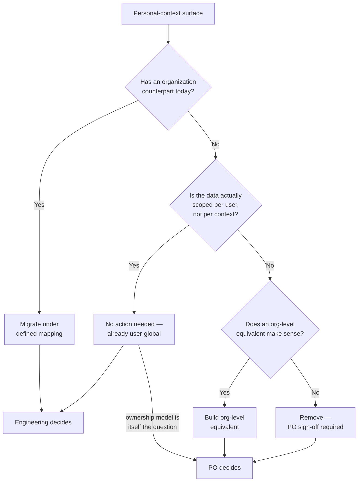

# Personal Context Elimination Audit - Plan

## Goal Capsule

- **Objective:** Produce the feature audit that Fizzy #1875 makes a hard prerequisite — a standalone document enumerating every surface that exists only in personal workspace context, each with a proposed disposition, plus the migration hazards that determine what each disposition costs.
- **Deliverable:** one document at `docs/personal-context-surface-map.md`. Named as a surface map rather than an audit because it outlives the sign-off it was written for — the follow-on branches read it as a reference.
- **Scope of this plan:** the document only. No code ships: not the migration job, not the MCP resolution fix, not auto-created private organizations, not the removal of any UI affordance, and not the new ADR the change will eventually require.
- **Product authority:** Fizzy #1875 (`project onboarding and readiness`). FR3 is the requirement being satisfied; the product owner (PO) named in the ticket owns disposition approval.
- **Why this first:** #1875 states that migration script design is blocked until every personal-context-exclusive item carries an approved disposition, and that undefined dispositions block migration for that item. The audit is the only piece of the epic that can start without waiting on someone else.
- **Stop conditions:** Stop and ask if the enumeration turns up a personal-exclusive surface whose removal would break a non-personal user, other than the project-guest presentation — that one is already routed to the decisions section and needs no halt. Stop if a proposed disposition cannot be stated without designing the migration, since that inverts the ticket's own ordering. Stop if a claim in this plan's research fails re-verification against the tree at implementation time.
- **Product Contract preservation:** changed — R17–R22 added during planning, R23–R27 and the R6/R12 amendments added after document review. R1–R5 and R8–R11 unchanged.

---

## Product Contract

### Summary

Fizzy #1875 eliminates the personal workspace context and moves every user onto organization-based tenancy. Its own text blocks the migration until engineering enumerates what lives only in personal context and the PO approves a disposition for each item. This work produces that enumeration as a repository document, proposes a disposition per item so the review is an approval rather than a fill-in-the-blanks exercise, and records the migration hazards that make some dispositions cheap and others expensive.

### Problem Frame

Two workspace contexts have coexisted long enough that the asymmetry between them is undocumented. Personal context is not a feature flag or a mode — it is an encoding spread across the data model, the query layer, row-level security, three separate request resolvers, and the permission middleware. Any elimination effort that starts by writing a migration script will discover the asymmetry one production incident at a time.

The ticket anticipates this and names notification settings as the one confirmed personal-exclusive feature, expecting others. The risk it is guarding against is silent loss: a setting, an integration, or a code path that quietly stops working because nobody wrote it down before the migration ran.

There is a second, less obvious risk the ticket does not name. Personal context currently skips organization permission checks entirely — there is no personal role model, only owner-of-the-row scoping. Every row that moves into an organization becomes subject to organization RBAC for the first time. That is a behavior change for the migrated user, not just a data move, and it belongs in the same document as the feature inventory because it changes what "migrate this item" actually costs.

A third risk comes from the repository's own history. `docs/solutions/architecture-patterns/reversing-a-safety-invariant-narrow-it-do-not-delete-it.md` records that deleting a load-bearing invariant is silent: nothing fails, and the next reader finds a codebase that no longer explains its own shape. "Both contexts must be supported" is exactly such an invariant, asserted in architecture guidance, contributor rules, an accepted ADR, a compliance policy, public product documentation, and passing tests. Eliminating personal context without enumerating those assertions leaves stale rules in force.

### Key Decisions

**The audit is shaped by decision required, not by artifact type.** An inventory organized by table or by route forces the approver to read every row to find the ones that need them. The document groups items by what it is asking for — items needing no action, items with a defined mapping, items needing a decision — so the approver's reading is bounded to the third group. The full enumeration remains present as the evidence base. This mirrors `docs/open-source/docs-publication-classification.md`, the repository's existing disposition-grouped inventory.

**Engineering proposes a disposition for every item; the PO approves or overturns.** The ticket assigns the audit to engineering and approval to the PO. Leaving disposition cells blank would satisfy the letter of that split and waste the reviewer's time. The cost is anchoring, mitigated by stating a one-line reason per disposition so a reviewer can disagree with the reasoning rather than only with the label.

**The inverse list is a deliverable, not a courtesy.** `docs/solutions/security-issues/a-trust-boundary-has-more-than-one-axis.md` records that naming a specific hole directs attention at it and away from everything else — the brief becomes the boundary of the audit. The ticket names notification settings. Enumerating what is *identical* across contexts is what stops that framing from bounding the work.

**Migration hazards belong in the audit even though the ticket lists migration design as a separate task.** A disposition is a cost judgment. Whether an item is cheap to migrate depends on how personal context is encoded for it, whether a uniqueness constraint starts applying once the tenant column is populated, and what happens to authorization. Splitting those facts into a later document means the dispositions are approved without the information that determines them.

**Engineering's routing is reviewable, not just its labels.** Two of the four dispositions send an item to engineering rather than to the PO, so the label decides whether the PO ever sees it — and a surface wrongly called already-user-global is invisible by construction. That is the silent loss the ticket's audit clause exists to prevent. Every engineering-settled item therefore states its falsifier: the one observation that would move it to the PO.

**A migrate disposition means nothing without its destination.** The ticket specifies a new, separate private organization rather than a merge into an existing one, and that choice is what decides whether the visibility consequence bites: rows moved into an organization whose only member is their owner expose nothing, while the same rows moved into a populated organization are readable by everyone in it. Stating the consequence without the destination overstates the risk for the ticket's mapping and understates it for every user category the ticket does not name.

**Verified findings are distinguished from asserted ones.** `docs/solutions/workflow-issues/verify-inherited-scope-against-current-reality.md` records that a stated scope is a claim about a past tree. This applies to the ticket's own claims and to this plan's research. Where a finding was confirmed against a running deployment, the document says so; where it rests on a code scan alone, it says that too.

**Closing #1875 does not require deleting the personal-context code paths, but the bar differs per entry point.** AC12 is UI-only: no element, route, label, or navigation affordance may provide access. AC3 governs creation and does reach API paths, but only creation. AC10 and AC11 govern protocol context resolution. Nothing in the criteria reaches the versioned REST query flag or the command-line context selector. Fusing these into one unreachability bar is how a later branch either over-scopes against three thousand call sites or quietly leaves an entry point live; the audit therefore carries the criteria verbatim and states which one governs each class.

**The document is named as a surface map, not an audit.** `DOCUMENTATION_STANDARDS.md` forbids history-shaped documents and requires one canonical file per topic. An "audit" reads as a point-in-time artifact to be deleted after sign-off; the follow-on branches need it as a standing reference. The name is chosen so the document survives its first purpose.

### Requirements

**Audit coverage**

- R1. The audit enumerates every surface reachable only in personal context, across the six dimensions #1875 names: features, settings, UI affordances, API code paths, session behavior, and integrations.
- R2. The audit records the inverse list — surfaces that behave identically in both contexts — so that "nothing was lost" is demonstrated rather than asserted.
- R3. Every enumerated item names the model, route, or module carrying it, with a repo-relative pointer a reader can follow.
- R4. Each finding states its evidence base: code scan, verification against a running deployment, or both.
- R5. The audit names what it did not cover and why.

**Disposition contract**

- R6. Every enumerated item carries a proposed disposition drawn from a fixed set of five: no action needed because the item is already user-global, migrate under a defined mapping, build an organization-level equivalent, remove, or repair. The repair label is reserved for items that are wrong today rather than items the elimination changes, and carries its own remediation timeline independent of the epic.
- R7. Each proposed disposition states its reason in one line.
- R8. Items whose disposition depends on deployment configuration rather than on code are marked as such, and the configuration key is named.
- R9. The audit separates items requiring a PO decision from items engineering can settle, and the PO-facing set reads on its own.

**Migration hazards**

- R10. The audit records every encoding of personal context the codebase uses, not only the dominant one.
- R11. The audit identifies constraints that are unenforced while the tenant column is empty and would begin to collide once it is populated.
- R12. The audit states, for each migrated surface, both directions of the authorization change: the capability the migrating user may lose to organization role checks, and the visibility other organization members gain. A row whose tenancy class filters on organization alone loses its per-user predicate on migration and becomes readable by every member.
- R13. Hazards are stated as consequences for disposition cost, not as migration design.
- R22. The audit states which layer actually enforces tenant isolation today, rather than assuming row-level security is it.

**Invariant artifacts**

- R17. The audit enumerates every artifact asserting the current "both contexts must be supported" guarantee, naming the file and quoting the assertion.
- R18. Each listed artifact carries the action required — narrow the statement to the surviving half, or retire it — following the repository's own invariant-reversal learning. The audit records the action; it does not perform the edit.
- R19. Tests and continuous-integration gates that assert the rule itself are listed alongside prose artifacts, because a passing test on a retired rule is the specific failure mode that learning names. Ordinary test coverage that merely exercises personal context is reported as a characterized count rather than enumerated.

**Retention obligation**

- R20. The audit records the repository's existing retention precedent and what an archive of migrated personal data would inherit from the retention policy.
- R21. The audit states whether the ticket's "restorable archive" claim can rest on current backup practice, citing the retention policy's own open items.

**Document usability**

- R14. The audit is standalone: a reader who has not seen the conversation that produced it can act on it.
- R15. Findings that contradict the ticket's own text are surfaced at the top of the document rather than buried in a table.
- R16. The audit contains no real organization, deployment, or person names; observations from a running deployment are reported generically.
- R23. The audit quotes the acceptance criteria that govern unreachability and states which criterion applies to each class of entry point, including the classes no criterion reaches.
- R24. Every engineering-settled disposition states its falsifier, and the decisions section carries a one-line roll-up of the engineering-settled set so the PO can overturn a routing decision rather than only a disposition they were shown.
- R25. Every enumeration section records the command that produced its population and that command's output count, and the number of rows in the section equals it.
- R26. Every PO-facing entry carries a decision field that starts at proposed and is edited in place to approved or overturned with a date, so a later reader can tell an approved disposition from a proposed one.
- R27. The audit states, per disposition label, how that disposition is verified at migration time — and flags every build-an-equivalent item as needing its own ticket, since the ticket's acceptance criteria verify only the migrate and remove branches.
- R28. The audit states the destination organization for every category of user — no membership, existing membership, owner, project-only guest — and for each, the resulting role, what other members can see, who owns the rows, and what happens if the destination is later deleted or gains members. Each category is a PO-facing entry carrying its own decision field, because a migrate disposition is not decidable without its destination.
- R29. Every migrate or remove disposition records its relation closure: inbound and outbound foreign keys, join tables, polymorphic references, tenant columns denormalized from a parent, and child records carrying no tenant column of their own. Each relation states whether it moves with the parent, derives tenancy from it, stays user-global, or blocks the disposition.
- R30. The audit inventories every writer that can produce a personal-context row while a migration is in flight — cached sessions, issued API keys, webhooks, scheduled jobs, and already-started durable workflows carrying a null tenant — and states what makes the retired mode non-writable. The inventory is derived, not recalled: it states the command that enumerates create and upsert paths against models capable of personal tenancy, and every row reconciles to that population. A clean scan taken during the window proves nothing.

### Disposition classification

Every enumerated item resolves through the same test, and the branch it takes determines who approves it.

An item that is user-global today still goes to the PO when whether it *stays* user-global is the product decision — user-scoped billing and usage records take that edge.

The two PO-facing outcomes — build an organization-level equivalent, and remove — are the document's real payload. The engineering-settled outcomes are evidence that the rest was checked, and each carries a falsifier so the routing itself stays reviewable.

### Acceptance Examples

- AE1. **Covers R2, R6, R15.** Given a surface the ticket names as personal-exclusive, when the audit finds it is in fact keyed per user and identical in every context, then the audit assigns it the no-action disposition, states the evidence, and surfaces the contradiction with the ticket at the top of the document rather than only in its table row.
- AE2. **Covers R6, R8.** Given a surface whose page exists in code but does not render because a deployment configuration key disables it, when the audit records it, then the disposition is marked configuration-dependent and names the key, rather than being recorded as either live or dead.
- AE3. **Covers R11, R13.** Given a uniqueness constraint that permits duplicate rows today because the tenant column is empty, when the audit records it, then the entry states the consequence for the affected items' disposition cost and does not propose a schema change.
- AE4. **Covers R9.** Given the completed audit, when the PO reads only the section addressed to them, then every decision the ticket requires of them is present in that section.
- AE5. **Covers R4.** Given a claim that a personal surface has no organization counterpart, when a reader checks it, then the audit states whether that absence was confirmed against a running deployment or inferred from a code scan.
- AE6. **Covers R10, R6.** Given two models that both encode personal context as an empty string rather than null, when one is written with a real organization identifier by some caller and the other never is, then the audit gives them different dispositions and says why, rather than treating the shared encoding as a shared disposition.
- AE7. **Covers R17, R19.** Given a test that asserts every feature supports both contexts, when the audit enumerates invariant artifacts, then that test appears in the list with a narrowing action, not only the prose documents.

### Scope Boundaries

- No code changes. The migration job, the MCP context-resolution fix, automatic private organization creation on signup, and removal of any personal-context affordance are separate branches.
- No new ADR. Eliminating personal tenancy supersedes an accepted, immutable ADR and will require one, but an ADR records a decision and the decision is what this audit exists to inform. The audit names the ADR as a required artifact.
- Not the migration design document. Hazards are recorded as inputs to disposition cost; the migration's batching, archival mechanics, and rollback design are later work.
- Not a fix for the MCP defects found during research. They are recorded as findings with dispositions; repairing them is its own change.
- Not a cleanup of the personal-versus-organization branch points across the codebase. The ticket does not require it.
- Not the edits to the invariant artifacts themselves. The audit lists them and the action each needs; performing the narrowing belongs with the change that actually removes the context.

#### Deferred to Follow-Up Work

- Re-running the map's derived counts in the drift guard. The guard ships in this branch but checks existence only — that every name still resolves. Counts move with ordinary feature work, so asserting them would make the test a chore rather than a signal; the map states each derivation command instead so a reader can re-run it.

### Dependencies / Assumptions

- The audit's value is realized only on PO approval; the document is the input to that session, not a substitute for it.
- Configuration observed on a running non-production deployment may differ in production. Findings that turn on configuration are recorded as such rather than resolved.
- The research backing this audit was gathered on the current default branch. Pointers are recorded so a reader can re-check rather than re-derive, and the implementer re-verifies counts at write time.

---

## Planning Contract

**Approach.** One document, written in the repository's existing disposition-grouped inventory style. Section order follows reader priority rather than research order: contradictions with the ticket first, then the decisions requested of the PO, then the evidence that supports them, then the bounds.

**House style to match.** `docs/open-source/docs-publication-classification.md` for disposition grouping, the `Status` header row, and the closing "what this does not cover" section. `docs/attachment-surface-map.md` for the surface-map framing and its `## Bounds` close. `DOCUMENTATION_STANDARDS.md` for the required metadata header — `# Title`, a one-line description, `- **Audience**:`, `- **Owner**:` — which is mandatory and which both analogues render differently; follow the standard, not the analogues.

**Granularity decision.** The data model is enumerated by tenancy class, plus one explicitly named residual class for models that carry a nullable organization identifier and are registered in no class at all. That residual is not a footnote: it holds roughly eighty models, including the usage-limit, notification, and subscription models the decisions section depends on. A taxonomy-only grouping would report them as reviewed when they were never in scope of the grouping. The empty-string models sit outside both populations and are enumerated separately. Individual models are named where they carry a distinct disposition and throughout the residual class.

**Evidence convention.** Every claim carries one of three markers: verified against a running deployment, verified by reading the source at a named path, or inferred. Source evidence outranks deployment observation where both are available — a deployment samples one configuration, the source holds for every configuration.

**Derivation convention.** Every enumeration section states the command that produced its population and that command's count, so a reviewer can re-run it. This replaces "counts re-derived at write time" as an assertion with something falsifiable, and it is the only mechanism that can catch a missing row.

**Naming constraint.** `DOCUMENTATION_STANDARDS.md` prohibits `*_ANALYSIS.md`, `*_GAPS.md`, `*_PLAN.md` and similar suffixes in every directory. The chosen filename avoids the family entirely.

**Publication.** The repository is private on its host today, though the contributor rules instruct everyone to write as though it were public — and an open-source seed export is being prepared and `docs/` publishes into it by default. The owner has already ruled on this document class: an internal audit of the isolation model was deleted rather than published, on the stated reasoning that publishing an audit means publishing its findings. This document names two unfixed defects and a compliance finding about latent row-level security, so it is added to the Remove list in `docs/open-source/docs-publication-classification.md` with its reason and its review trigger — the two protocol defects shipping fixes. Identifier discipline applies regardless.

**Compliance-source convention.** The seed prunes `docs/compliance/**`, so a citation into that tree resolves to nothing for a seed reader and carries internal findings out with it. Claims sourced there are stated as engineering facts in the audit's own words; the internal paths are collected once in a clearly-marked internal-references block.

**Disclosure boundary.** For a defect still open at write time, the document records the file, the disposition, and the sentence needed to price it — not the reproduction mechanics. Naming which header, which key type, and why the guard does not fire turns the surface map into a recipe.

**Delivery.** The surface map, the publication-classification row, the seed-export deletion entry, and one drift-guard test. The test moved the change out of markdown-only, so it carries a changeset bumping the deployable app rather than the `skip-changeset` label. No schema, no generated client, no RLS reapply.

---

## Implementation Units

### U1. Document skeleton, lifecycle, and conventions

- **Goal:** The file exists with its required header, its decision lifecycle, its section order, and the conventions every later unit fills in against.
- **Requirements:** R14, R16, R26
- **Dependencies:** none
- **Files:**
  - create `docs/personal-context-surface-map.md`
- **Approach:** Title the document `# Personal context surface map` — not "audit". The prose throughout this plan calls the deliverable an audit because that is what the ticket commissioned, but the heading is what a later reader sees, and the filename was chosen so the document reads as a standing reference rather than a sign-off artifact to be deleted afterwards.

  Open with the standards-mandated header — title, one-line description naming the ticket, audience, owner — then a status row stating the document is proposed and awaiting product sign-off on the decisions section.

  Define the decision lifecycle here, because without it a follow-on branch reading the file weeks later cannot tell an approved disposition from one nobody has looked at. Every PO-facing entry carries a decision field starting at proposed; the sign-off edits it in place to approved or overturned with the ruling and the date; the header status flips only when no entry remains proposed. Name that edit as the expected follow-up change so an unmarked entry reads as "the session has not happened" rather than as assent.

  Lay out the section order so later units append rather than restructure: headline findings, decisions requested, the inverse list, the evidence sections, the engineering follow-on register, then bounds. The inverse list gets its own heading — it is the demonstration that nothing was lost, and a deliverable that lives only as asides inside other sections can be dropped without failing any gate.

  Place the invariant-artifact register under an engineering-follow-on heading, distinct from the approval surface. It is real work, but it is not what the PO signs.

  State the evidence and derivation conventions once, in the document, rather than repeating a qualifier on every row. A row with no marker is a defect, not a default.

  Fix the disposition vocabulary as the five labels R6 defines. Later units must not invent a sixth.
- **Patterns to follow:** `DOCUMENTATION_STANDARDS.md` required header; `docs/open-source/docs-publication-classification.md` status row and disposition grouping; `docs/attachment-surface-map.md` surface-map framing.
- **Test scenarios:** Test expectation: none — documentation scaffold, no behavioral change.
- **Verification:** the heading reads as a surface map; all four required header elements present; the decision lifecycle is stated; the section order includes a standalone inverse-list heading and a demarcated engineering-follow-on heading; the vocabulary is stated once and matches R6.

### U2. Settings, routes, and UI surfaces

- **Goal:** The interface asymmetry, enumerated by reconciling directory listings against what actually renders, with a disposition per unpaired item.
- **Requirements:** R1, R2, R3, R4, R6, R7, R8, R24, R25
- **Dependencies:** U1, U3
- **Files:**
  - modify `docs/personal-context-surface-map.md`
- **Approach:** Enumerate both settings trees from the directory listings and, separately, from the menus each layout renders. These two enumerations disagree — several route directories render no menu entry — and the disagreement is itself a finding, because a route that exists but is unreachable has a different disposition from one that is live.

  Apply that same reconciliation to the whole application route tree, not only to settings. A navigation comparison is structurally blind to a route no navigation entry links, and personal-only route trees of exactly that kind exist. Diff the account-group directories against the organization-slug directories, and the ungrouped routes against both.

  Record the navigation-parity observation on source evidence first: the navigation array carries no context branch, so parity holds by construction, and the deployment observation corroborates rather than carries it. Several entries are feature-flag gated, so mark them for configuration dependence the same way settings pages are marked. Then state what the observation actually supports — parity of the linked navigation set — rather than parity of the whole non-settings surface.

  Pair the two settings sides and report only the unpaired remainder as personal-exclusive. Mark items gated by a deployment configuration key with the key named.

  Where a settings entry's disposition turns on how its data is scoped rather than on where its route lives, cite the data-model section's finding instead of assigning a disposition here. The notifications entry is the case that matters: it is unpaired by route and account-global by data, and the second fact is the one that decides it.

  Cover the affordances that are not settings pages: the context switcher and where it is rendered, the account-utility link that differs by context, the interface strings naming personal account, the onboarding registry entries scoped to one context, and the project-guest presentation — guests whose only access is a shared project are deliberately shown the personal workspace, so that surface must originate here before the decisions section can route it.
- **Patterns to follow:** `apps/web/app/(saas)/app/(account)/settings/layout.tsx` and `apps/web/app/(saas)/app/(organizations)/[organizationSlug]/settings/layout.tsx` as the two menu sources; `apps/web/modules/saas/shared/components/NavBar.tsx` for the navigation array and the guest presentation; `apps/web/modules/saas/organizations/components/OrganizationSelect.tsx` for the switcher; `apps/web/modules/saas/get-started/lib/get-started-registry.ts` for the scoped onboarding entries; `packages/i18n/translations/en.json` for the interface strings.
- **Test scenarios:** Test expectation: none — documentation unit, no behavioral change.
- **Verification:** every settings segment on both sides appears once in either the paired or unpaired list; the whole-route-tree reconciliation is present, not only the settings one; the guest presentation carries a disposition and an evidence marker; the navigation claim is carried on source evidence with the deployment observation as corroboration; each section states its derivation command and count.

### U3. Data model, tenancy classes, and the residual

- **Goal:** How personal context is encoded in data, organized so that nothing carrying a tenant column falls outside the organization.
- **Requirements:** R1, R3, R4, R6, R7, R10, R25, R29
- **Dependencies:** U1
- **Files:**
  - modify `docs/personal-context-surface-map.md`
- **Approach:** Enumerate the tenancy classes the query layer defines and give each its filter shape in both contexts. Name the class that has no personal branch and returns a sentinel matching nothing — its behavior in personal context is deliberate blindness rather than filtering.

  Then reconcile rather than checklist. The classes do not cover every model carrying a nullable organization identifier; roughly eighty are registered in no class, and that residual holds the usage-limit, notification, and subscription models the decisions section depends on. Enumerate the residual by name and give the reconciliation explicitly: classes plus residual equals the re-derived total. A taxonomy that silently omits a third of the population reads as completeness.

  Then the finding that matters most for the migration, which sits outside both populations. A small set of models encode personal context as an empty string rather than a null, so they are neither nullable nor classified. Start from `grep -nE '@default\(""\)' packages/database/prisma/schema.prisma`; the in-schema comments already declare the split, some reading personal account and others reading account-global. Confirm each against its callers, because the two groups take opposite dispositions and look identical in the schema. A migration selecting on a null organization identifier misses all of them.

  This is where the ticket's headline example is resolved. Report it as a contradiction and let U7 lift it to the top.

  A model-level inventory proves only that models were counted, so close the coverage gap it leaves. For every item that will carry a migrate or remove disposition, trace its relations: foreign keys in both directions, join tables, polymorphic references, tenant columns denormalized from a parent, and child records with no tenant column of their own. Several models copy their organization identifier down from a parent project, so moving the parent without its children leaves parent and child disagreeing about tenancy — and the application tier, not the database, is what reads those columns. Row counts cannot detect this class of omission; only the relation trace can.

  Close with the models carrying a user identifier and no organization column at all — they survive untouched and are the largest single piece of the inverse list.
- **Patterns to follow:** `packages/database/src/tenant-db.ts` for class names and membership; `packages/database/prisma/schema.prisma` for the tenant columns and the empty-string comments; the tenancy-class table in the root `AGENTS.md` as a comparison point only.
- **Test scenarios:** Test expectation: none — documentation unit, no behavioral change.
- **Verification:** every class appears; the residual class is enumerated by name and the class-plus-residual reconciliation equals the derived total; both empty-string groups appear with different dispositions and caller evidence; each section states its derivation command and count.

### U4. Tenancy resolution, authorization, and external entry points

- **Goal:** The code paths that resolve tenancy, what changes about authorization in both directions, and every entry point from which personal context is still reachable.
- **Requirements:** R1, R3, R4, R6, R7, R12, R22, R23, R28
- **Dependencies:** U1, U3
- **Files:**
  - modify `docs/personal-context-surface-map.md`
- **Approach:** Start from the single origin of the fork — the session field the tenant middleware reads — then the three independent resolvers that consume it, noting that one is a hand-maintained copy of another with a comment asking future editors to keep them in sync. Three resolvers means three places a disposition has to be applied.

  Then authorization, in both directions. The capability direction: permission middleware returns early in personal context, so migrated rows enter organization role checks for the first time and a user who could edit everything of their own may hold a role that cannot. The visibility direction, which is the one nobody asks about: a row whose tenancy class filters on organization alone loses its per-user predicate on migration and becomes readable by every member of the destination organization. Pin each migrate-disposition item to its class from U3 and state which of the two it lands in, because "migrate under a defined mapping" reads as neutral and is not.

  Both directions are conditional on the destination, so state it before stating them. Give each category of user its destination and the consequences that follow: a user with no membership, a user who already belongs to an organization, an organization owner, and a project-only guest. For each, name the role they hold afterwards, what other members can see, who owns the rows, and what happens if that destination is later deleted or gains members. Without this, a migrate disposition is a label with no content.

  Record the permission skip as the two-condition guard it is, and state that only one condition is a personal-context encoding. Procedures built on the plain protected builder carry no tenant context and keep bypassing organization role checks after elimination. A branch that deletes the personal check and believes the bypass closed will leave it open.

  Answer R22 rather than assuming. The compliance hand-off records row-level security as latent — the tenant-aware client is not what application queries use — so the enforcement layer is the application tier, and the personal branches in the row-level policies are not the backstop they appear to be. State it as an engineering fact in the audit's own words; the internal path goes in the internal-references block.

  Enumerate the entry points reachable without a web session: the query flag on the versioned REST surface, the two protocol servers, the command-line context selector, and the webhook paths deriving tenancy from a linked record. For each, quote the acceptance criterion that governs it — and say plainly where none does.

  Record the two protocol defects with distinct dispositions. One hardcodes a null organization for personal keys and is a resolution default; the other derives the tenant from caller-supplied request data on one path without a membership check, and is a live isolation defect that takes the repair label and its own remediation timeline rather than inheriting the epic's. Record it by pointer and disposition, without the reproduction mechanics.
- **Patterns to follow:** `packages/api/orpc/middleware/tenant-context-middleware.ts` for the origin; `packages/api/orpc/procedures.ts`, `packages/api/orpc/middleware/require-permission.ts`, `packages/api/modules/v1/helpers.ts` for the three resolvers and the two-condition guard; `packages/cli/src/lib/context.ts` for the command-line selector; `apps/web/app/api/webhooks/` for the webhook derivation.
- **Test scenarios:** Test expectation: none — documentation unit, no behavioral change.
- **Verification:** all three resolvers appear; every migrate-disposition item names its tenancy class and therefore whether other members can read it; the permission-skip entry names both guard conditions and which survives; each entry-point class names its governing criterion or states that none applies; the isolation defect carries the repair label and no reproduction detail.

### U5. Migration hazards

- **Goal:** The facts that make a disposition cheap or expensive, stated as consequences rather than as migration design.
- **Requirements:** R7, R11, R13, R20, R21, R25, R30
- **Dependencies:** U3, U4
- **Files:**
  - modify `docs/personal-context-surface-map.md`
- **Approach:** Lead with the immutability hazard, because it is the one that stops a migration rather than complicating it. The audit-log table is append-only under a row-level trigger that binds even the table owner, and it permits exactly one mutation to an existing row: a tenant foreign key moving *to* null. The migration this epic requires moves the organization identifier *from* null to a value, which the trigger rejects as tampering. The repository has one precedent — a backfill that had to disable the trigger inside a single transaction, was authorised as a one-off by the product owner, deliberately left personal-context rows alone, and recorded that a standing bypass was refused on purpose. State the consequence for disposition cost: the audit trail is either left split at the migration boundary, so organization admins see nothing a migrated user did beforehand, or backfilled under the same one-off authorisation. Do not propose which.

  Then the constraint hazard. A set of unique constraints include the nullable organization column, and because the database treats nulls as distinct, those constraints do not restrain personal rows at all — duplicates are legal today and will collide the moment the column is populated. Name the affected models. Note that the repository already knows this trap: two constraints have hand-written partial indexes compensating for it, and the schema documents the reasoning twice.

  Then the encodings hazard from U3, restated as its consequence: a migration selecting on a null organization identifier silently skips the empty-string rows.

  Then retention. The ticket requires a restorable archive held for ninety days. A ninety-day retention precedent already exists in the repository, with a grace period so a mistaken value stays recoverable; name where it lives so the cost of a remove disposition is known. Then the gaps: the retention policy's own open items record that no verified restore test exists, so a restorable claim cannot rest on backup practice; the policy requires every new data category to declare a retention period and a disposal path, which an archive of migrated data would be; and the access-control policy adds a third declaration the retention policy does not — the archive holds rows that were private to one user, so its reader set is a disposition input, not an implementation detail.

  Then the cutover hazard, which the static hazards above cannot express. Tenant selection is enforced in the application tier by several independent resolvers, so a request, a cached session, an issued API key, a webhook, a scheduled job, or an already-started durable workflow can still write a personal-context row after that user's rows have been moved. A scan taken during the window can be clean while the retired mode is still writable, which makes both completion and rollback unverifiable. Derive the writer inventory rather than recalling it: enumerate the create and upsert paths against models capable of personal tenancy, classify each by what carries its tenant context — request session, issued key, linked record, schedule, or workflow argument — and state the command and count so the list reconciles to a population instead of reading as plausible. Then state what would have to be true for the mode to be non-writable, and stop there — do not design the cutover.

  Keep every entry in the consequence-for-disposition form. No proposed schema, no batching strategy, no rollback procedure, and no archive design.
- **Patterns to follow:** `packages/database/prisma/migrations/20260727150000_backfill_audit_log_organization/migration.sql` for the trigger precedent and its stated reasoning; the partial-unique-index precedent and its in-schema rationale in `packages/database/prisma/schema.prisma`.
- **Test scenarios:** Test expectation: none — documentation unit, no behavioral change.
- **Verification:** the immutability hazard leads and cites the precedent without proposing a resolution; the constraint list states its derivation command and count; every hazard entry names the disposition it affects; no entry proposes a migration mechanism or an archive design.

### U6. Invariant artifacts to narrow

- **Goal:** Every artifact asserting that both contexts must be supported, with the action each needs.
- **Requirements:** R7, R17, R18, R19
- **Dependencies:** U1
- **Files:**
  - modify `docs/personal-context-surface-map.md`
- **Approach:** Enumerate the artifacts stating the current guarantee and quote the assertion from each, so a later editor can find the exact sentence. The set spans architecture guidance, the contributor rules, an accepted architecture decision record, a compliance access-control policy, and public product documentation presenting both contexts as permanent and equivalent.

  Include the tests, split in two. Several hundred test files exercise personal context as one of two ordinary cases; report that population as a derived count with its characterization — coverage that follows the code and needs no separate action. Enumerate individually only what asserts the rule itself: `packages/database/__tests__/rls-isolation.test.ts`, which drives a personal tenant type directly; `packages/database/__tests__/rls-coverage.test.ts`, the policy coverage guard; and `scripts/tenant-isolation-check.ts`, whose blocked pattern is written against the personal-context idiom and which would therefore change meaning rather than simply pass.

  For each, record the action as narrowing rather than deletion. The boundary stays legible and the next reader is told which half still holds; an unexplained absence reads as an oversight and gets restored, while a named exclusion reads as a decision.

  Record separately that the architecture decision record is accepted and immutable by the documentation standard, so the change requires a new superseding record. Name it as a required artifact and do not draft it.
- **Patterns to follow:** `docs/solutions/architecture-patterns/reversing-a-safety-invariant-narrow-it-do-not-delete-it.md` for the narrowing rule and the update-every-asserting-artifact requirement.
- **Test scenarios:** Test expectation: none — documentation unit, no behavioral change.
- **Verification:** each entry quotes the assertion and names a narrowing action; the three structural gates are named by path while ordinary coverage is a derived count; the superseding-record requirement is stated without drafting the record.

### U7. Headline findings and the decisions section

- **Goal:** The two sections the PO reads — what contradicts the ticket, and what needs their call.
- **Requirements:** R9, R15, R24, R26, R27
- **Dependencies:** U2, U3, U4, U5, U6
- **Files:**
  - modify `docs/personal-context-surface-map.md`
- **Approach:** Write the headline section from the contradictions the evidence sections produced. The ticket's named example needing no migration is the first. The isolation defect in the protocol server is a second, because the ticket frames that surface as a resolution-default problem.

  Write the decisions section as a bounded list, each entry stating the item, the proposed disposition, the reason, what changes if the PO decides otherwise, and the affected population — which class of user loses what, with a count where one is obtainable and an explicit "not instrumented" where it is not. An absent population field leaves the PO unable to weigh a removal; "we cannot measure this" is an answer they can weigh.

  The known entries are the destination mapping — one entry per user category, since every migrate disposition rests on it; account security settings with no organization counterpart; user-scoped billing, subscriptions, credit accounts, and usage limits, which resolve independently of any organization; and the project-guest presentation, the one item outside the ticket's stated scope. Use that same enumeration everywhere the list appears — these are separate models, not three phrasings of one thing.

  Open the section with the roll-up: the engineering-settled set summarized by disposition with counts and falsifiers, and an explicit block-approval ask. The ticket's blocker requires an approved disposition on every personal-exclusive item, not on the subset engineering routed upward, so a session that clears only the decision list leaves the blocker standing.

  State, per label, how the disposition is verified at migration time. The acceptance criteria verify only the migrate and remove branches, so a build-an-equivalent item is approved and then owned by nobody unless the audit gives it a ticket.

  Keep the section readable alone, though every entry links to the evidence that produced it.
- **Patterns to follow:** the sign-off framing in `docs/open-source/docs-publication-classification.md`.
- **Test scenarios:** Test expectation: none — documentation unit, no behavioral change.
- **Verification:** every item the evidence sections classify as PO-decides appears here once and originates in an evidence section; the roll-up carries falsifiers and the block-approval ask; every entry carries a population field and a decision field; no invariant-artifact entry appears here.

### U8. Bounds and cross-check

- **Goal:** The document states its own limits, and its internal claims agree.
- **Requirements:** R5, R4, R7, R16, R25
- **Dependencies:** U2, U3, U4, U5, U6, U7
- **Files:**
  - modify `docs/personal-context-surface-map.md`
- **Approach:** Write the bounds section: what was not covered and why. Known exclusions are the migration design, the branch-point cleanup, any deployment whose configuration was not observed, and pre-existing staleness in the architecture guidance that is unrelated to context tenancy. Name each as a decision rather than leaving it as an absence.

  Then cross-check the document against itself. Every row carries an evidence marker, a disposition from the five-label vocabulary, and a one-line reason. Every enumeration section states its derivation command and a count matching its rows. Every item the evidence sections marked PO-decides appears in the decisions section, and nothing appears there that they did not produce. Every item marked no-action appears in the inverse list.

  Finally, scan for identifiers by eye. Observations from a running deployment must be reported generically. The local guard cannot help here — see the Verification Contract — so this pass is the control, not the command.
- **Patterns to follow:** the `## Bounds` close in `docs/attachment-surface-map.md`; the placeholder rule in `CONTRIBUTING.md`.
- **Test scenarios:** Test expectation: none — documentation unit, no behavioral change.
- **Verification:** no row lacks a marker, a disposition, or a reason; every section's row count equals its stated derivation count; no PO-facing item appears only in an evidence section; the inverse list covers every no-action item.

### U9. Publication decision and hand-off

- **Goal:** The document is held out of the open-source seed, and the decision it exists to obtain is actually requested.
- **Requirements:** R26
- **Dependencies:** U7, U8
- **Files:**
  - modify `docs/open-source/docs-publication-classification.md`
- **Approach:** Add the surface map to the Remove list with its reason and its review trigger: it names two unfixed protocol defects and a compliance finding about latent row-level security, and it becomes reviewable for publication when those defects ship fixes. Follow the row style already used there, including the retained row for the isolation audit the owner deleted — that row is the precedent this one applies.

  Then hand the document off, because a merged file is not a requested decision. Post the decisions section to the ticket, addressed to the named PO, with a link to the merged file and a date by which the answer is needed. The audit's whole value is the sign-off session; a plan that ends at merge produces an artifact and hopes.
- **Patterns to follow:** the Remove-list row format and the retained-precedent row in `docs/open-source/docs-publication-classification.md`.
- **Test scenarios:** Test expectation: none — documentation unit, no behavioral change.
- **Verification:** the classification row names the file, the reason, and the review trigger; the decision request exists on the ticket and names the PO and a date.

---

## Open Questions

**Resolved during planning**

- Where the document lives. Resolved: `docs/personal-context-surface-map.md`, held out of the open-source seed by a Remove-list row rather than by relocation, so it stays where the follow-on branches will look for it.
- Whether the audit enumerates individual data models or groups them by tenancy class. Resolved: by class, plus a named and individually enumerated residual class, because the taxonomy does not cover the whole population.
- Whether this branch drafts the superseding architecture decision record. Resolved: no. The record fixes a decision this audit exists to inform.

**Deferred to implementation**

- Whether the settings directory listing and the rendered menus diverge enough to need separate tables rather than one table with a reachability column.
- Whether the invariant-artifact register is long enough to warrant a table rather than prose entries.

**For the PO, raised by the audit itself**

- The disposition for account security settings, which have no organization counterpart.
- The disposition for user-scoped billing, subscriptions, credit accounts, and usage limits, which resolve independently of any organization.
- Whether removing the personal workspace is acceptable given the project-guest presentation depends on it — an item outside the ticket's stated scope.
- The destination mapping for each user category, and specifically whether a user who already belongs to an organization gets a second private one as the ticket states, or something else.
- Whether the acceptance criteria reach the versioned REST query flag and the command-line context selector at all, since AC12 is UI-only and AC3 governs creation. This changes what a follow-on branch is obliged to close.

---

## Verification Contract

This change ships two markdown files. The gates are documentary and structural rather than behavioral, with one derivation gate that can actually detect an omission.

- **Derivation closure.** Every enumeration section states the command that produced its population and that command's count, and the number of rows in the section equals it. This is the only gate that can catch a missing row; the rest test the document against itself.
- **Destination closure.** Every user category named in the audit has a destination organization with its role, visibility, ownership, and deletion consequence stated.
- **Relation closure.** Every migrate or remove disposition records its relation trace, and no relation is left unclassified.
- **Cutover closure.** The writer inventory states its derivation command and count, every row reconciles to that population, no write path is left unclassified, and the section states what makes the retired mode non-writable. A present-but-underived inventory fails this gate.
- **Reconciliation.** The data-model section's classes plus its residual equal the derived total of models carrying a nullable organization identifier. The empty-string models are accounted for separately and are not folded into either.
- **Identifier check.** `node tooling/identifier-guard/check.mjs --files docs/personal-context-surface-map.md` — the invocation the pre-commit hook and the security workflow use. **A local pass is not evidence.** The term list is a repository secret plus a gitignored `.blocked-terms`; with neither present the script exits 0 having scanned nothing, and the bare command with no `--files` argument exits 0 the same way. Read every added line naming a deployment observation by eye, and treat the CI `Identifiers` job as the authoritative gate.
- **Disclosure boundary.** No unremediated-defect detail. The document names no reproduction mechanics for a defect still open at write time.
- **Seed exclusion.** The surface map appears on the Remove list in `docs/open-source/docs-publication-classification.md` with a reason and a review trigger — and the document states plainly that this row is a record of the decision rather than its enforcement. The export prunes by an explicit path array in `docs/open-source/seed-export.sh` whose retained-path inventory is pinned by count and digest, so adding the path there is a gated operation belonging to whoever next cuts the export, not to this branch. The gate is that the gap is named, not that it is closed.
- **Compliance-source handling.** No claim sourced from `docs/compliance/**` is carried by a path citation in the body; internal paths appear only in the internal-references block.
- **Standards conformance.** The file carries the four header elements `DOCUMENTATION_STANDARDS.md` requires, lives in an approved directory, and its filename avoids every prohibited suffix pattern.
- **Vocabulary closure.** Every disposition is one of the five fixed labels. No sixth label appears.
- **Reason closure.** Every disposition carries a one-line reason. A bare label is a defect — the reason is the reviewer's only lever against a proposal they did not author.
- **Evidence closure.** Every enumerated row carries one of the three evidence markers.
- **Decision closure.** Every item the evidence sections classify as PO-decides appears in the decisions section with a population field and a decision field, and nothing appears there that the evidence sections did not produce. The destination mapping is a PO-facing entry per user category and is covered by this gate; the header status cannot flip to approved while any of them remains proposed.
- **Inverse closure.** Every item marked no-action appears in the inverse list.
- **Standalone read.** The decisions section is read in isolation and every entry is actionable without the evidence sections.
- **No code.** `git diff --stat` shows no change outside `docs/personal-context-surface-map.md`, `docs/open-source/docs-publication-classification.md`, and this plan — no source file, schema, migration, or generated client.
- **Changeset.** The pull request carries the `skip-changeset` label. No changeset file is added.

---

## Definition of Done

- `docs/personal-context-surface-map.md` exists and satisfies R1 through R30.
- The headline section names every finding that contradicts the ticket, including the ticket's own named example.
- The decisions section is bounded, standalone, opens with the engineering-settled roll-up and block-approval ask, and covers the destination mapping per user category; account security settings; user-scoped billing, subscriptions, credit accounts, and usage limits; and the project-guest presentation.
- The evidence sections cover settings and the whole route tree, data-model tenancy classes with their residual, tenancy resolution and authorization in both directions and every external entry point, migration hazards, and the invariant-artifact register.
- The inverse list is a standalone section and covers every no-action item.
- Every row carries an evidence marker, a disposition from the five-label vocabulary, and a one-line reason; every enumeration section carries a derivation command and a matching count.
- Every user category appears in the decisions section as its own PO-facing entry with a destination, its consequences, and a decision field; every migrate or remove disposition carries a relation trace; the cutover writer inventory carries a derivation command and reconciles to it.
- The bounds section names each exclusion as a decision.
- The identifier scan was performed by eye and the CI `Identifiers` job is green; the document contains no real organization, deployment, or person name.
- The surface map is on the seed Remove list with a reason and a review trigger.
- The decision request is raised on the ticket, addressed to the named PO, with a date.
- The pull request carries the `skip-changeset` label and adds no file beyond the two named.

---

## Sources / Research

**Ticket and product authority**

- Fizzy #1875 — feature narrative, FR1 through FR8, thirteen acceptance criteria, and the PO comment clarifying that the concern is duplicate maintenance and that unique features such as account preferences must be carried over.

**Governing rules the change touches**

- `docs/adr/003-xor-tenant-isolation.md` — the accepted, immutable decision that makes personal context an exclusive filter. Supersession, not amendment.
- `AGENTS.md` — the multi-tenant section asserting both contexts must be supported, the tenancy-class table, and the migration workflow.
- `CONTRIBUTING.md` — the same assertion in contributor form, the rule that structural changes require an architecture decision record, and the placeholder-data rule.
- `DOCUMENTATION_STANDARDS.md` — required metadata header, approved directories, prohibited filename patterns.
- `docs/compliance/soc2/policies/access-control-policy.md` — names personal context as a control boundary.
- `docs/compliance/soc2/policies/data-retention-and-disposal-policy.md` — the ninety-day retention precedent and the open items a restorable-archive claim would inherit.
- `docs/compliance/soc2/07-rls-activation-hand-off.md` — the finding that row-level security is latent and the application tier is the actual enforcement layer.
- `apps/web/content/docs/guides/tenant-isolation.mdx` — public documentation presenting both contexts as permanent.

**Institutional learnings that shaped the audit's form**

- `docs/solutions/architecture-patterns/reversing-a-safety-invariant-narrow-it-do-not-delete-it.md` — narrow an invariant rather than delete it; update every artifact asserting the old guarantee, including passing tests.
- `docs/solutions/security-issues/a-trust-boundary-has-more-than-one-axis.md` — naming one hole bounds the audit to it; the reason the inverse list is a deliverable.
- `docs/solutions/workflow-issues/verify-inherited-scope-against-current-reality.md` — a stated scope is a claim about a past tree.

**Code the audit enumerates**

- `packages/database/src/tenant-db.ts` — the tenancy-class matrix and the organization-only sentinel.
- `packages/database/src/tenant-context.ts`, `packages/database/src/tenant-filter.ts` — the context type and the filter builders.
- `packages/database/scripts/apply-rls-direct.ts` — row-level policies and their personal branches.
- `packages/database/prisma/schema.prisma` — tenancy columns, the empty-string encodings, the unique constraints, and the partial-index precedent.
- `packages/api/orpc/procedures.ts`, `packages/api/orpc/middleware/require-permission.ts`, `packages/api/modules/v1/helpers.ts` — the three resolvers.
- `packages/api/orpc/middleware/tenant-context-middleware.ts` — the origin of the fork.
- `packages/auth/auth.ts` — signup hooks, organization plugin configuration, invitation handling.
- `apps/web/app/api/mcp-gateway/route.ts`, `apps/web/app/mcp/route.ts` — the two protocol entry points.
- `apps/web/modules/saas/organizations/components/OrganizationSelect.tsx` — the context switcher.
- `apps/web/app/(saas)/app/(account)/settings/layout.tsx`, `apps/web/app/(saas)/app/(organizations)/[organizationSlug]/settings/layout.tsx` — the two settings menus.

**Style analogues**

- `docs/open-source/docs-publication-classification.md` — disposition-grouped inventory awaiting product sign-off.
- `docs/attachment-surface-map.md` — surface map with a bounds close, backed by a drift test.

**Live verification**

- A running non-production deployment, 2026-08-25 — settings navigation enumerated on both sides, and the linked navigation set observed identical in both contexts. Corroboration only: the durable evidence is that the navigation array carries no context branch, and the observed rendering samples one feature-flag configuration.
