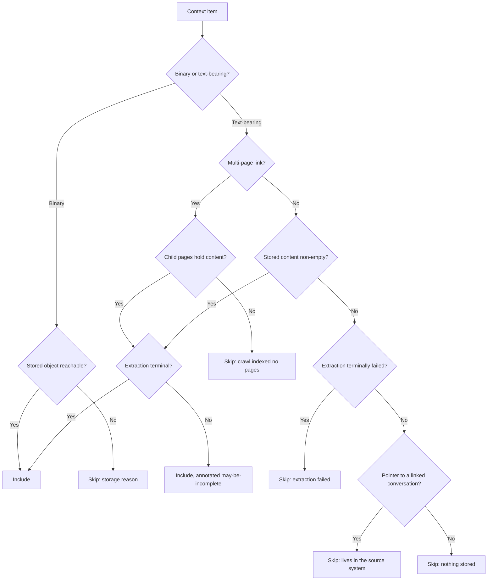

# Download All Context Completeness - Plan

## Goal Capsule

- **Objective:** Make the project Context tab's "Download All" export everything Fabric holds, tell the truth about anything it cannot export, and stop leaving conversation content and vectors behind.
- **Product authority:** Fizzy #2228. The Product Contract below is authoritative for behavior; the Planning Contract is authoritative for approach.
- **Product Contract preservation:** changed — R7, R9, R15, R17 and AE6 were amended after research and adversarial review, and R14–R18, AE9–AE13 were added for defects found during planning. Capture is scoped to shared channels; one-to-one and group chats are excluded by decision. All other requirements carry forward verbatim.
- **Stop conditions:** Stop and ask if the capture insert cannot be placed before a monitor's zero-change return without restructuring the activity; if turning the item ceiling into a declared truncation would require moving the archive build out of the request handler; or if the export-artifact lifecycle rule turns out not to be active in any environment, since that is a release condition for conversation capture.
- **Execution profile:** Test-first on the export gate, whose procedure already has a suite pinning current behavior, and on the skip-reason taxonomy, which is a new pure function whose tests are written before it. Characterization-first on the monitor activities: add coverage of today's zero-change path before inserting the capture hook.
- **Tail ownership:** A changeset bumping `fabric-app` only, and a `docs/solutions/` entry — six of seven institutional-learning dimensions searched for this work came back empty.

---

## Product Contract

### Summary

"Download All" stops gating the export of text on whether the RAG pipeline finished, pulls in multi-page link content the single-item download already handles, and names a real reason for every item it skips or partially includes. Monitored Teams and Slack **channels** are captured bundle by bundle into durable, embedded project context, so they export as ordinary content and the assistant can cite them. Removing a source — unlinking a chat, deleting a project — starts actually removing the stored content and its vectors.

### Problem Frame

A user exported a project's context and got 6 of 18 items back as "Content unavailable". The reported diagnosis pointed at Microsoft Graph permissions, and a parallel workstream on Graph setup made that look plausible.

The permissions hypothesis is wrong, and the ticket's framing hid a larger problem. A staging run against an organization project holding 291 context items produced 22 skips. **Nineteen of those 22 were items whose text is already stored in the database.** The export refused them because `extractionStatus` was not `COMPLETED` — a field about embedding progress, not about whether content exists. A dozen had failed permanently when an AI credit balance ran out; the export reports them as "still processing", which they will never resume doing.

That same project cannot export at all. The pre-flight ceiling refuses any project over 200 context items, and it refuses outright rather than exporting what fits: the request returns `too_many` at 291 items totalling 4.9 MB, against a size allowance of 500 MB. The count ceiling, not size, is what blocks it.

Only three skips in that project were genuinely contentless: rows representing linked Teams conversations. Those rows are pointers by construction — a linked chat stores a cursor and dedup markers, never the messages. The messages are read live from Graph, and the only place any verbatim text lands is inside a proposal payload, and only for threads where the analyzer proposed a change. Threads it found nothing in leave no trace at all. A code comment asserting that monitored messages reach the project's RAG store is false for Teams; that comment is the likely origin of the permissions hypothesis.

Two smaller defects compound the impression that the export is unreliable. A multi-page link downloads correctly one item at a time and is skipped in the batch, because the batch query never loads the child pages. And the pre-flight byte total counts items that will be skipped, so it misreports the archive size.

### Key Flows

- F1. A monitored channel bundle reaches the project
  - **Trigger:** A monitor workflow polls a linked Teams or Slack channel and hands a message bundle to the analyzer.
  - **Steps:** The bundle is formatted and neutralized, then written as one conversation-bundle row hanging off the channel's context row, keyed so a repeat write is a no-op; that bundle is embedded on its own; the analyzer then runs and may or may not produce a proposal.
  - **Outcome:** The channel is exportable and retrievable whether or not the bundle produced a proposal.
  - **Covered by:** R7, R8, R9, R10, R15, R16, R17

- F2. Export decides an item's fate
  - **Trigger:** A user runs "Download All" on the Context tab.
  - **Steps:** Each item is classified; binary items are included when their stored object is reachable; text-bearing items are included when their stored content is non-empty; multi-page links and captured channels are assembled from their child rows; everything excluded records the reason it was excluded, and everything included whose extraction is unfinished is annotated as possibly incomplete.
  - **Outcome:** The archive holds everything Fabric can produce, and the summary attributes each exclusion to a distinct cause.
  - **Covered by:** R1, R2, R3, R4, R5, R6, R14

- F3. A source is removed
  - **Trigger:** A user unlinks a monitored conversation, or a project is permanently deleted.
  - **Steps:** The link and its dedup markers are removed; the channel's context row is deleted, which cascades its conversation bundles, and their vectors are deleted with it.
  - **Outcome:** The conversation's context row and its vectors do not survive the removal of the source they came from. Archives already produced by past exports are governed separately by the export-artifact lifecycle rule, and proposal payloads are retained by existing policy — both named under Dependencies.
  - **Covered by:** R11, R12

### Requirements

**Export completeness**

- R1. A Class B/C context whose stored content is non-empty exports regardless of its extraction status.
- R2. A multi-page link exports in the batch archive with the same content the single-item download produces for it.
- R3. The ceiling check uses a pre-flight estimate over statically-includable rows, and the manifest reports a total accumulated from entries actually written to the archive.
- R14. A project exceeding the export item ceiling receives a partial archive rather than a refusal, and every excluded item is named individually in the manifest and counted in the in-app summary.

**Honest reporting**

- R4. The export summary reports skipped items by reason rather than as one undifferentiated count.
- R5. A permanently failed item is not described in terms that imply it is still processing.
- R6. An item representing a linked external conversation that holds no accumulated content is skipped with a reason naming what it is and where its content lives.
- R18. An included item whose extraction has not reached a terminal state is annotated as possibly incomplete, and a context row whose text is intact but whose vectors are stale is labelled stored-but-unsearchable rather than ready or failed.

**Durable conversation context**

- R7. Text from a monitored Teams channel or Slack channel is captured as one conversation-bundle row per analyzed bundle, hanging off that channel's context row.
- R8. Capture occurs for every analyzed bundle, including bundles the analyzer found no proposed changes in.
- R9. Capture is idempotent by construction: a bundle row is keyed on its channel and its thread root, so a retried or concurrent write of the same bundle is a no-op rather than a duplicate, and no bundle is lost when an activity fails after claiming its messages.
- R10. Captured bundles are embedded individually and retrievable by the assistant.
- R15. An export states the period its captured channel content covers, so a reader can tell what the archive does and does not include.
- R16. Conversation text is neutralized against prompt injection before it is written to the bundle row, so every derived copy — vector payload, retrieval result, export archive, MCP read — inherits the guard.
- R17. Only shared channels are eligible for capture: one-to-one and group chats are never captured, and the surface that links a channel states before linking that its messages become readable and exportable by everyone with project access.

**Retention and removal**

- R11. Unlinking a monitored chat or channel removes the content accumulated from it together with its vectors, including when the row carries no vector identifier, and a vector-store failure fails the unlink rather than reporting success.
- R12. Removing project context vectors targets the collection the writers actually use; a collection that was never created is a success, and a failure against a collection that exists is not.
- R13. An integration context that holds content reaches a terminal successful extraction state, so it is not excluded from retrieval indefinitely.

### Acceptance Examples

- AE1. Text-bearing item whose embedding failed
  - **Covers R1.**
  - **Given** a context item holding complete text whose extraction terminally failed,
  - **When** the user runs "Download All",
  - **Then** its text is present in the archive, and it is not reported as skipped.

- AE2. Text-bearing item still being processed
  - **Covers R1, R18.**
  - **Given** a context item whose text is stored while its extraction is still in progress,
  - **When** the user runs "Download All",
  - **Then** its text is present in the archive and its entry is annotated as possibly incomplete.

- AE3. Multi-page link
  - **Covers R2.**
  - **Given** a link whose crawled content is held across child pages rather than on the link itself,
  - **When** the user runs "Download All",
  - **Then** the archive contains the same assembled content the single-item download produces.

- AE4. Linked conversation with nothing captured yet
  - **Covers R6, R17.**
  - **Given** a linked conversation from which no bundle has been captured — either a channel not yet analyzed, or a one-to-one or group chat, which is never eligible,
  - **When** the user runs "Download All",
  - **Then** it is skipped with a reason naming it as a linked conversation and pointing at the source system, not with a generic unavailability message.

- AE5. Bundle the analyzer found nothing in
  - **Covers R7, R8.**
  - **Given** a monitored message bundle the analyzer processed without proposing any change,
  - **When** the user runs "Download All" afterwards,
  - **Then** that bundle's text is present in the archive.

- AE6. Channel analyzed twice
  - **Covers R7, R9.**
  - **Given** a monitored channel whose first bundle was captured and which then receives a second bundle,
  - **When** the user runs "Download All" afterwards,
  - **Then** the archive holds one item for that channel carrying both bundles in chronological order, not two items.

- AE9. Activity retried after a mid-run failure
  - **Covers R9.**
  - **Given** a monitor activity that failed at any point after fetching a bundle — before writing it, after writing it, or after writing it but before embedding — causing Temporal to retry against the same messages,
  - **When** the retry completes,
  - **Then** the channel's captured content holds that bundle exactly once.

- AE13. The same bundle analyzed twice concurrently
  - **Covers R9.**
  - **Given** two workers analyzing the same channel at the same time, one on the live path and one on a backfill,
  - **When** both complete,
  - **Then** each distinct bundle is stored once and neither worker's write is lost.

- AE12. Instruction-shaped conversation text
  - **Covers R16.**
  - **Given** a monitored message whose body is shaped like an instruction to the assistant,
  - **When** its bundle is captured and later retrieved,
  - **Then** the text reaching the model is neutralized, asserted against the stored bundle row rather than only against the vector payload.

- AE7. Unlinking a monitored channel
  - **Covers R11.**
  - **Given** a linked channel whose bundles have been captured,
  - **When** the user unlinks it,
  - **Then** neither the channel's context row nor any of its bundles appears in the project's context or in assistant retrieval, including bundles carrying no vector identifier.

- AE8. Size reported for a partial archive
  - **Covers R3.**
  - **Given** a project whose items include several that will be skipped, one of them failing its storage read only once streaming has begun,
  - **When** the user runs "Download All",
  - **Then** the manifest reports a size matching the entries actually written.

- AE10. Project over the item ceiling
  - **Covers R14.**
  - **Given** a project holding more context items than the export ceiling allows,
  - **When** the user runs "Download All",
  - **Then** an archive is produced, the manifest names each excluded item individually, and the in-app summary states how many were left out.

- AE11. Channel export states its coverage
  - **Covers R15.**
  - **Given** a monitored channel holding captured bundles,
  - **When** the user runs "Download All",
  - **Then** its archive entry states the period the captured content covers.

### Scope Boundaries

- **One-to-one and group chats are never captured.** Only shared channels are eligible; see KTD2b. An ineligible chat still appears in the export with a reason naming where its content lives.
- **No backfill of channel history.** Existing linked channels begin capturing from the next analyzed bundle onward. Message history already passed over by the monitors' cursors is not retrieved. Whether a one-time seed is worth adding is recorded under Outstanding Questions.
- **No fetching conversation content during export.** Rejected on architecture and reproducibility grounds; see KTD2.
- **Binary storage reachability is not addressed.** Skips of this kind were dominant in a personal workspace on staging but absent from the organization project examined, which suggests a local data artifact rather than a systemic fault.
- **A binary read that fails mid-stream still aborts the whole export.** Only failures raised before the entry is appended become manifest skip rows; once streaming has begun, the archiver error is fatal and the request fails. Degrading that to a per-item skip means restructuring how entries are appended, which is a larger change than this plan carries.
- **The archive manifest stays English-only.** Its fixed-column, plain-UTF-8 English format is a deliberate documented choice. Only the in-app summary is localized.

#### Deferred to Follow-Up Work

- Codifying the `downloads/project-contexts/` export-artifact lifecycle rule in IaC, and tracking export objects by source so an unlink can revoke outstanding archives. Verifying the rule is active is a release condition of this work; codifying and revoking it is the follow-up.
- A retention path for verbatim conversation text held in `PendingBacklogProposal` payloads, which are deliberately retained past unlink and have no expiry.
- Correcting the stale `docs/architecture/rag-multi-tenancy-analysis.md`, which describes two shared collections with payload partitioning and explicitly rejects per-tenant collections — the opposite of what the code does.
- The divergent Qdrant payload shape between the two project-context writers (`type` versus `contextType`, and a missing `originalContextId` on the batch path). Both keys the unlink filter needs are indexed today, so this does not weaken R11.
- Truncation-remainder telemetry, so ceiling pressure stays measurable once the `too_many` refusal stops firing.

### Dependencies / Assumptions

- Retention approval to durably store Teams and Slack message bodies was granted. The commitment holds for the context row and its vectors: they live while the source link lives and are removed with it. Two copies fall outside it — proposal payloads, which existing policy retains past unlink, and export archives already produced. Both are named under Deferred to Follow-Up Work.
- Conversation ingest runs under the credentials of whoever connected the integration. If those credentials lapse, accumulation stops and the export silently narrows, and a gap in the record is indistinguishable from a quiet period.
- Per-organization Qdrant collections are real and ungated: `getCollectionName` returns the bare base name for personal tenants and `<base>-org-<orgId>` for organizations, with no feature flag. They are created lazily on first write, so a project that never embedded anything has no collection at all.
- No storage or embedding quota bounds monitored conversation volume. A monitored channel produces content indefinitely, unlike the bounded per-session artifacts this design is modeled on.

### Outstanding Questions

**Resolve before the ticket is closed**

- **A one-time seed of existing channels.** KTD2 rejects fetching at export time, but that argument does not cover a single offline seed run under the connecting user's own credentials on the next monitor tick. Without it the reporter's channels stay empty and the ticket closes on behavior rather than on their content.

**Deferred to planning-time investigation during execution**

- A retention window for captured bundles, as a named period, together with the purge that enforces it — an age-based deletion of rows and their vectors, with its own scheduling, tenant isolation and partial-failure behaviour. Captured content is currently bounded only by the lifetime of its source link. Deliberately out of this deliverable: it needs a scheduler and a deletion path of its own, and nothing here depends on it.
- Whether U9 belongs in this deliverable at all. Its cause is unconfirmed and its file list is a guess, so it cannot be estimated; the export no longer depends on the field after U1, leaving retrieval as the only remaining harm. Deferring it and recording R13 as explicitly deferred is a sanctioned outcome.
- Why integration contexts that hold content remain in a non-terminal extraction state (R13), and whether the cause is broader than the integration path.

---

## Planning Contract

### Key Technical Decisions

**KTD1. The export gates on content presence, not pipeline state — but still reads the status for reporting.** Three surfaces decide whether a context is downloadable, and two already agree. The client's `isContextDownloadable` treats a row as downloadable whenever content exists, consulting extraction status only as a fallback for legacy rows. The single-item procedure throws only on empty content. The batch procedure alone adds `extractionStatus === "COMPLETED"`. This is the batch being brought into line, not a new rule. It also explains why the bug survived: the UI shows the download control on these rows and single-item download works, so nothing looked broken until someone used the bulk path.

The check was doing one legitimate job, though, and dropping it silently would relocate the lie rather than remove it. A multi-page crawl leaves its parent row non-terminal while pages are indexed one at a time, so an export taken mid-crawl now includes a partial site dump. The field therefore stops gating inclusion and starts feeding an INCLUDED annotation (R18) — content-may-be-incomplete — which the manifest and the in-app summary both carry.

**KTD2. Captured messages become child rows on the channel's context row, not text appended into it.** Two shapes were live for most of planning. Appending into the pointer row needs no migration but forces read-modify-write under a lock, re-chunks and re-embeds the whole document on every bundle, and needs an eviction rule that silently drops history. Child rows — the shape `ProjectContextUrlPage` already uses for crawled links, and that U2 assembles from — cost a migration and its tenant registrations, and remove all three problems: each bundle is one insert, embeds independently, and is never rewritten. Child rows also stay out of the export item ceiling, which counts context rows.

The decisive property is idempotency. A bundle row keyed on `(parentContextId, bundleKey)` makes a repeat write a no-op at the database level, so capture stops depending on the seen-marker semantics entirely — which is what makes KTD3 work at all.

Fetching from Graph at export time stays rejected: the archive is built inside a request handler under a one-minute client budget, the existing Graph readers cap results and do not paginate, and reads run on the exporting user's token, so two people exporting the same project would get different archives.

**KTD3b. Slack captures after fetching and before claiming, which moves the fetch outside the lock.** Slack's claim is an insert-as-lock that today precedes `fetchSlackThreadContextActivity`, and formatting needs that fetch — so ordering capture before the claim necessarily moves the fetch before it too. That is a real restructuring, not a reordering of adjacent statements, and it has a cost: two workers racing the same thread will both fetch before either wins the claim, so the provider sees a duplicate read and the two may hold different snapshots. The per-message claim above is what makes that safe — the two workers end up with disjoint claim sets whatever each of them fetched — and the claim-as-lock continues to protect exactly what it was written to protect, which is the analyzer and proposal work, not the capture. The full Slack order is: resolve the link and parent, fetch the thread, form the snapshot, capture it, then claim the analyzer work.

**KTD2b. Only shared channels are captured.** Capture covers Teams channels and Slack channels. One-to-one and group chats are excluded, because a project is a wider audience than a private conversation and a link-time disclosure is not an authorization model — the connecting user's token can reach chats whose membership is narrower than the project's. Excluding them removes the hardest keying problem for free: Teams chats have no stable thread identity, since the monitor bundles all unseen messages since the cursor under a synthetic root that changes every tick, while channel threads have real roots. An excluded chat is not silently dropped — it reports the R6 reason naming where its content lives, which is AC1's explained-exclusion branch.

**KTD3. The bundle row's unique key is the idempotency anchor, replacing the seen-marker mechanism for capture.** Capture must fire before the analyzer's zero-change return, which is where content is lost today, and must survive a Temporal retry after a failure in the LLM call — the failure that motivated this plan. Marker counts cannot carry that guarantee: `createMany({ skipDuplicates: true })` returns a count, not the ids it inserted, so a partially overlapping bundle yields a number with nothing to map it back to — appending the whole bundle duplicates, appending a subset loses.

Keying the bundle row is not enough on its own, because neither a thread root nor a read-then-compute watermark survives concurrency. A thread accumulates replies, so keying on the root alone would let the first snapshot win and silently discard a later one. Keying on the root plus a watermark fixes that but not the race: two workers can both read the same highest stored watermark before either inserts, compute their deltas from it, and store overlapping message sets under different keys.

Message identity is what has to be claimed, not bundle identity. Each message in a snapshot is claimed by an insert under a uniqueness constraint on `(parentContextId, providerMessageId)` — the same shape as the existing seen-message tables — and the bundle is assembled only from the messages that insert actually claimed. Two workers racing one thread therefore hold disjoint claims and write disjoint bundles, whatever they each fetched. A worker whose claim set comes back empty writes no bundle at all. The bundle row records the claimed range for ordering and for the export's stated coverage.

Claiming and bundling are one transaction, and this is load-bearing rather than tidiness. Claims that commit without their bundle would make the messages unrecoverable: a retry finds them already claimed, computes an empty claim set, and by the rule above writes nothing, so the content is lost exactly where R9 promises it is not. Each claim carries its bundle's id, written in the same transaction that creates the bundle.

The insert is a create-or-get, not a fire-and-forget: it returns the canonical row on both the insert and the conflict path, because a retry that finds the row already present still has to reach the embedding step. Seen markers keep serving the analyzer and proposal path unchanged; capture no longer reads them.

Embedding is a separate claimable step rather than a continuation of the insert, and its claim must not be the same field that records success. The vector point id is derived deterministically from the bundle row id, so a repeat embed overwrites rather than duplicating. The claim is a lease — a nullable `embeddingLeaseAt` set by compare-and-set — while `embeddedAt` stays null until Qdrant confirms the write. A crash after taking the lease therefore leaves `embeddedAt` null and a lease that expires, so a later pass reclaims it; had the claim been written onto `embeddedAt` itself, that row would have been permanently invisible to the sweep that looks for null. Recovery scans rows where `embeddedAt` is null and no live lease is held, and depends on no failure handler having run.

**KTD4. The item ceiling truncates and declares rather than refusing.** Today a project over 200 items gets `too_many` and no archive; the organization project examined holds 291 items at 4.9 MB against a 500 MB size allowance, so count — not weight — is what blocks it. Refusing an export entirely is the least honest of the available failures. The ceiling stays a bound on archive build time inside the request handler, but exceeding it produces an archive whose manifest names each excluded item individually, so the remainder stays retrievable one at a time. Because a full-ceiling build now happens where a fast refusal used to, the truncation limit is set from a measured build against the client's one-minute budget rather than inherited unexamined.

**KTD5. The skip-reason taxonomy becomes a pure discriminated function.** This repo has solved this defect class once already: a single boolean derived from the wrong signal collapsed four distinct situations into one misleading message, and the fix was a pure, database-free state function that unit tests could exercise directly. The same shape applies here. That precedent also records a trap worth avoiding — the first fix changed only the formatter while a second copy of the string lived elsewhere, so the user-facing text still lied.

**KTD6. Vector deletes resolve the name with `getCollectionName`, and absence is distinguished from failure.** Two activities hardcode `"project_contexts"` with an underscore while every writer resolves `project-contexts` or `project-contexts-org-<id>`. The strings never match, so the delete 404s, and the 404 is classified as success. Resolve with `getCollectionName`, not `ensureCollection` — the latter creates the collection it is asked about, which would make a missing collection unobservable. Because per-organization collections are created lazily on first write, an organization that never embedded a project context legitimately has none, so absence must stay a success; only a failure against a collection that exists is a real failure. The file already models this in `deleteOrganizationCollections`: check existence, then delete. Note when writing the filter that only some payload keys are indexed — Qdrant rejects delete-by-filter on an unindexed field — though `contextId`, `originalContextId`, `projectId` and `organizationId` all are.

**KTD7. Neutralize before the row write, not on the way to the index.** Accumulated conversation text is externally authored and will be embedded and returned to the assistant. Neutralizing the embedding payload would guard the copy nothing reads: retrieval uses Qdrant only to resolve ids and then refetches `content` from Postgres before interpolating it into the prompt. Applying `neutralizeAiChatAttachmentBody` before the row write makes every derived copy inherit the guard — vector payload, retrieval result, export archive, and the MCP project-context read, which no retrieval-time guard covers. `buildRetrievedContextBlock` already applies the same helper at prompt-assembly time for assistant retrieval; the two are not redundant because they cover different read paths, and the neutralizer is idempotent enough that a double pass is a cosmetic marker change, not a correctness problem.

### High-Level Technical Design

The export gate after this change. Extraction status no longer gates inclusion on the text-bearing path — that removal is what carries R1 — but it is still read, both to attribute a skip reason and to annotate an included row as possibly incomplete.



Where capture sits inside a channel-monitor activity. The placement is the whole point: after the text exists, before the branch that returns when the analyzer proposes nothing, and — on Slack — before the claim, which the self-idempotent insert no longer needs.

```mermaid
sequenceDiagram
    participant A as Analyze activity
    participant P as Provider (Graph / Slack)
    participant DB as Postgres
    participant Q as Qdrant
    A->>DB: resolve link and parent context row
    A->>P: fetch thread
    A->>DB: claim each message<br/>unique (parentContextId, providerMessageId)
    Note over A,DB: two racing workers end up with<br/>disjoint claim sets; empty set writes nothing
    A->>A: format and neutralize the claimed messages
    A->>DB: create-or-get bundle row over the claimed range
    A->>DB: take embedding lease by CAS on embeddingLeaseAt
    A->>Q: embed under a point id derived from the row id
    A->>DB: set embeddedAt only once Qdrant confirms
    A->>A: run analyzer
    alt analyzer proposed nothing
        A->>DB: mark messages seen
    else analyzer proposed changes
        A->>DB: tx — mark messages seen, create proposal
    end
```

Teams already fetches before it marks messages seen, so capture slots in without moving anything. Slack claims as a lock before it fetches, so ordering capture ahead of the claim moves the fetch out too — see KTD3b for what that costs and why the per-message claim makes it safe.

### Assumptions and Constraints

- The archive is built inline in the oRPC handler and streamed to object storage; nothing here moves it to Temporal. The item ceiling therefore stays a real bound, and KTD4 changes only what happens at it.
- The shared capture helper lives in `packages/temporal/src/lib/`, alongside `retrieved-context-block.ts`, and is imported directly by the two channel analyzers. It must **not** be re-exported through `src/activities/index.ts`: the worker registers everything that barrel exports as a Temporal activity, and a plain helper does not belong in that registry. The barrel-registration test covers `activities/monitoring/` only, so it asserts nothing here; `pnpm knip` is what catches an unreferenced file, since `src/lib/` is not a knip entry.
- A Prisma migration is required for the bundle table, and with it three registrations that are separate from the schema change: the `tenant-db.ts` project-scoped category, the `apply-rls-direct.ts` allowlist entry keyed on the physical snake_case name, and the back-relations on the parent models. A table created in the same migration is empty, so indexing and constraints inside that migration are free of the migration-lint rules that bite on existing tables.
- The export-artifact lifecycle rule for `downloads/project-contexts/` must be verified active in every environment before conversation capture is enabled. It is applied manually per environment and may not be live; an archive that never expires outlives the unlink that removed its source.
- German translations need no update — the locale loader deep-merges the default locale beneath the requested one. New reason strings therefore render in English for German users until translations follow.

### Sequencing

U1 through U4 are independent of U10, U5, U7 and U9. They satisfy the ticket's reporting criteria, and AC1's include branch for channels additionally requires U10, U5 and U7 — so the ticket must not be closed on U1–U4 alone. For one-to-one and group chats AC1 is satisfied by its explained-exclusion branch, which U4 delivers.

Within the first group the order is U1, then U2, then U3 (which depends on both, because the include/skip decision must be final before size can be computed from it and U2 moves crawled links from skipped to included), then U4 (which depends on U1, U2 and U3 because the reason taxonomy must know which conditions still produce skips). In the second group U10 comes first — the two tables and their registrations are what U5 writes into — then U5, then U12, U11 and U7 — retrieval, recovery and cleanup all need captured bundles to exist first. U12 is what makes R10 true; without it U5 embeds into a store nothing reads back. U8 and U9 are independent of everything and could land alone.

---

## Implementation Units

### U1. Export text whenever text exists

- **Goal:** Remove `extractionStatus` from the batch export's inclusion decision for text-bearing contexts, while keeping it readable for reporting.
- **Requirements:** R1, R18. Covers AE1, AE2.
- **Dependencies:** none.
- **Files:** `packages/api/modules/projects/procedures/contexts/create-contexts-batch-download-url.ts`, `packages/api/modules/projects/procedures/contexts/__tests__/create-contexts-batch-download-url.test.ts`.
- **Approach:** In the non-Class-A branch, keep the empty-content skip and drop the extraction-status skip that follows it. The comparison against `"NOT_APPLICABLE"` in that condition is dead — the `ExtractionStatus` enum has no such member — and goes with it. Carry the status forward instead as an included-row annotation for rows whose extraction is not terminal. Do not touch the Class A branch, which already lets raw bytes flow regardless of extraction status.
- **Execution note:** Write the failing tests first. The existing suite pins today's behavior, including a test asserting the skip this unit removes; that test's expectation is the thing under change, so update it deliberately rather than deleting it.
- **Patterns to follow:** The existing test file's `vi.hoisted` mock namespace, the procedure-base stub that replaces `../../../../../orpc/procedures` with a chainable builder, and the in-memory `archiver` double that records appended entries so ZIP structure is assertable.
- **Test scenarios:**
  - Covers AE1. A text-bearing context with non-empty content and `extractionStatus: "FAILED"` appears in the archive and is absent from the skipped list.
  - Covers AE2. The same with `"PENDING"` and with `"EXTRACTING"`, and each carries the may-be-incomplete annotation.
  - A context whose extraction is `"COMPLETED"` is included without the annotation.
  - A text-bearing context with empty content and `extractionStatus: "COMPLETED"` is still skipped, with the empty-content reason.
  - A context with `extractionStatus: null` and non-empty content is included.
  - A Class A context with `extractionStatus: "FAILED"` and a present storage path is still included — the unit must not change binary behavior.
- **Verification:** `pnpm --filter @repo/api test` passes, and the batch procedure's text-bearing branch reads `extractionStatus` only to annotate, never to skip.

### U2. Assemble multi-page link content in the batch archive

- **Goal:** Give the batch export the same multi-page link assembly the single-item export already performs.
- **Requirements:** R2. Covers AE3.
- **Dependencies:** none.
- **Files:** `packages/database/prisma/queries/projects/contexts.ts`, `packages/api/modules/projects/procedures/contexts/create-context-download-url.ts`, `packages/api/modules/projects/procedures/contexts/create-contexts-batch-download-url.ts`, `packages/api/modules/projects/procedures/contexts/__tests__/create-contexts-batch-download-url.test.ts`, `packages/database/prisma/queries/projects/__tests__/`.
- **Approach:** Add `urlScope` to `listContextsForDownload`'s select so the batch can recognise a crawled link. `buildPathPrefixMarkdown` is module-local in the single-item procedure today; relocate it to a shared module under `packages/api/modules/projects/lib/` and have both procedures import it, so one implementation serves both. Assemble per link only when the scope calls for it, so ordinary single-URL links keep taking the cheap path.
- **Patterns to follow:** `packages/api/modules/projects/procedures/contexts/create-context-download-url.ts` for the assembly and its child-page ordering.
- **Test scenarios:**
  - Covers AE3. A crawled link whose parent content is empty and whose child pages hold content is included, and its archive entry matches what the single-item path produces for the same row.
  - A crawled link with zero child pages holding content is skipped with the crawl-specific reason, not the generic empty-content one.
  - An ordinary single-URL link with content on the row itself is included without any child-page query being issued.
  - The child-page query is issued once per crawled link, not once per context in the project.
- **Verification:** `pnpm --filter @repo/api test` and `pnpm --filter @repo/database test` pass; `pnpm knip` reports no unused export for the relocated helper.

### U3. Honest size accounting and a ceiling that truncates

- **Goal:** Report the size of the archive actually produced, and turn the item ceiling from a refusal into a declared truncation.
- **Requirements:** R3, R14. Covers AE8, AE10.
- **Dependencies:** U1, U2 (the include/skip decision must be final before size can be computed from it, and U2 moves crawled links from skipped to included).
- **Files:** `packages/api/modules/projects/procedures/contexts/create-contexts-batch-download-url.ts`, `packages/api/modules/projects/procedures/contexts/constants.ts`, `packages/api/modules/projects/lib/context-download-manifest.ts`, `packages/api/modules/projects/procedures/contexts/__tests__/create-contexts-batch-download-url.test.ts`, `apps/web/modules/saas/projects/components/DownloadAllContextsButton.tsx`, `apps/web/modules/saas/projects/components/__tests__/DownloadAllContextsButton.test.tsx`, `packages/i18n/translations/en.json`.
- **Approach:** Two distinct numbers are needed and conflating them is the current defect. A pre-flight estimate over statically-includable rows — summing child-page byte lengths for crawled links, whose parent content is empty — gates the size ceiling before streaming begins. A separate accumulator incremented as each entry is actually appended is what the manifest's total reports, so an item that fails its storage read mid-loop leaves the total untouched. For the item ceiling, take rows up to the limit instead of throwing and write one manifest skip row per excluded item, so the remainder stays retrievable through single-item download. Return the excluded count in the procedure result so the in-app summary can state it. Keep the size ceiling a genuine refusal. Remove the client's now-unreachable `too_many` arm and reword the `tooLarge` string to name only the size allowance — leaving it stating a count limit that no longer exists would be the same lie this plan removes.
- **Test scenarios:**
  - Covers AE8. A project mixing includable and skippable items, one of which throws on its storage read after streaming has begun, reports a manifest total covering only entries actually written.
  - Covers AE10. A project over the ceiling produces an archive, the manifest carries one skip row per excluded item, and the result carries the excluded count.
  - A crawled link's child-page bytes are counted in the pre-flight estimate.
  - The ceiling truncation preserves a deterministic order, so two exports of an unchanged project produce the same archive.
  - A project whose includable content exceeds the size ceiling still fails with the size reason.
  - A project at exactly the item ceiling is not truncated and carries no excluded count.
  - The client no longer maps any error to the count-limit message.
- **Verification:** `pnpm --filter @repo/api test` and `pnpm --filter web test` pass; the 291-item organization project used as evidence produces an archive rather than a `too_many` error.

### U4. A skip-reason taxonomy that tells the truth

- **Goal:** Replace one blended summary string with per-reason reporting, and stop describing terminal failures as in-progress.
- **Requirements:** R4, R5, R6, R18. Covers AE4.
- **Dependencies:** U1, U2, U3 (the set of surviving skip conditions must be settled).
- **Files:** new pure module under `packages/api/modules/projects/lib/` for the reason function plus its test, `packages/api/modules/projects/lib/context-download-manifest.ts`, `packages/api/modules/projects/procedures/contexts/create-contexts-batch-download-url.ts`, `packages/i18n/translations/en.json`, `apps/web/modules/saas/projects/components/DownloadAllContextsButton.tsx`, `apps/web/modules/saas/projects/components/__tests__/DownloadAllContextsButton.test.tsx`.
- **Approach:** Derive the reason from the row in a pure function taking no database or storage handle, so the taxonomy is unit-testable in isolation and both the manifest and the API response read from one source. Distinguish at minimum: nothing stored; extraction terminally failed; a linked conversation with nothing accumulated; a crawl that indexed no pages; a binary whose object is missing; the ceiling remainder. Render the summary in the existing success toast — `t("completed")` stays the title and the per-reason ICU lines fill the description slot, the pattern already used elsewhere in the app — adding no new control to the Context tab. The hidden `aria-live` region announces the completion sentence followed by the same reason strings joined into one sentence; an existing test pins that region's contract and must be updated rather than dropped. Before finishing, grep for every place the current blended string is produced — the documented failure of this repo's last taxonomy fix was a second copy of the message living somewhere the first fix did not reach.
- **Patterns to follow:** the discriminated-state function described in `docs/solutions/integration-issues/ai-assistant-codebase-availability-misreport.md`; the ICU plural shapes already used under the job/monitor summary keys in `packages/i18n/translations/en.json`; the web test convention of hand-copying used keys into a `translations` object and mocking the translation hook.
- **Test scenarios:**
  - Covers AE4. A linked-conversation pointer row with no accumulated content yields the conversation reason, naming the source system.
  - A terminally failed row yields a reason that does not describe it as processing.
  - Each remaining skip condition maps to its own distinct reason, asserted one case per test against the pure function.
  - The procedure's result carries per-reason counts summing to the total skipped.
  - The toast description renders one line per reason present and omits reasons with a zero count.
  - The `aria-live` region announces every reason present, matching the visible summary.
  - The component renders correctly when every item was included and nothing was skipped.
- **Verification:** `pnpm --filter @repo/api test` and `pnpm --filter web test` pass; no occurrence of the old blended string remains in the repo.

### U10. The conversation-bundle table and its tenant registrations

- **Goal:** Add the two child tables capture writes to — bundles and their message claims — with the tenant isolation and RLS coverage project-scoped tables require.
- **Requirements:** enables R7, R9, R15.
- **Dependencies:** none.
- **Files:** `packages/database/prisma/schema.prisma`, a new migration under `packages/database/prisma/migrations/`, `packages/database/src/tenant-db.ts`, `packages/database/scripts/apply-rls-direct.ts`, `packages/database/prisma/queries/projects/` (bundle queries plus barrel re-export), `packages/database/__tests__/`.
- **Approach:** Model the table on `ProjectContextUrlPage`, which is the same parent/child shape one feature over: a `parentContextId` relation cascading from `ProjectContext`, a denormalized `projectId` so project-scoped filters and RLS apply without a join, `content`, `qdrantId`, `embeddedAt`, `contentHash`, `extractionStatus`, and nullable `userId` / `organizationId` tenant columns that are never both set. Message identity is claimed in a companion table keyed `@@unique([parentContextId, providerMessageId])` per KTD3, and the bundle row records the claimed range. Add a `bundleStartedAt` so the export can order bundles chronologically and state the window it covers, an `embeddingLeaseAt` the embedding step claims by compare-and-set, and an `embeddedAt` written only once the vector store confirms. Add back-relations on `ProjectContext`, `User` and `Organization`.

Do not let the query layer be the only thing holding tenant consistency together. A plain foreign key on `parentContextId` lets a row point at a parent in another project while carrying tenant columns that satisfy this table's own RLS policy, and Postgres does not evaluate the parent's policy through a foreign key — so a raw or buggy writer could attach content across the isolation boundary and every later read, export and cascade would run under contradictory ownership.

Matching the project is not sufficient either: a foreign key over `(parentContextId, projectId)` still permits an organization-owned child under a personal parent, or a child naming a different organization, because it never compares owners. Carry a normalized non-null owner identity on both tables — a stored generated column resolving to the organization id in an organization tenant and to the user id in a personal one — give `ProjectContext` a composite unique on `(id, projectId, ownerKey)`, and make the child's foreign key composite over all three. Ownership disagreement then cannot be expressed. Keep a CHECK enforcing that exactly one of `userId` and `organizationId` is set, since the generated column depends on it. `ProjectContextUrlPage` does none of this today; that is a reason not to copy it in this respect, not a reason to repeat it.

Everything in the two paragraphs above applies to **both** new tables, not only the bundle table. The message-claim companion holds provider message identifiers, which are tenant-associated, and it gates whether a message can ever be captured — an unprivileged cross-tenant write there could suppress capture through a uniqueness conflict without touching any content. It therefore carries the same tenant columns, the same XOR check, the same owner-inclusive composite foreign key to its parent context, its own indexes, and its own entries in the tenant-db project-scoped map and the RLS allowlist.

Register both physical snake_case names in the `tenant-db.ts` project-scoped map and in the `apply-rls-direct.ts` allowlist — the RLS step silently no-ops for a table absent from that list, and a coverage test asserts the allowlist covers every organization-scoped model.
- **Patterns to follow:** `ProjectContextUrlPage` in `packages/database/prisma/schema.prisma` for the model shape; the additive-table migration convention of an opening comment explaining the design decision, then table, then unique index, then per-lookup indexes, then foreign keys; `packages/database/__tests__/rls-coverage.test.ts` for the registration assertion, and the precedent test asserting a table's declared policy kind.
- **Test scenarios:**
  - The table is registered in the project-scoped tenant map and in the RLS allowlist under its physical name.
  - Every constraint scenario below is asserted for both new tables, not only the bundle table.
  - A row whose `projectId` does not match its parent's is rejected by the database, not only by the query layer, asserted against a real database in both personal and organization contexts.
  - An organization-owned row under a personal parent, a row naming a different organization than its parent, and a row naming a different user are each rejected by the database, including when written outside the tenant query wrapper.
  - A row with both tenant columns set, and a row with neither, are both rejected by the CHECK constraint.
  - Deleting the parent context cascades its bundle rows and their claimed-message rows.
  - Claiming the same `(parentContextId, providerMessageId)` twice succeeds once and yields an empty claim set the second time.
  - Two concurrent claims over overlapping snapshots of one thread produce disjoint claim sets.
  - Bundles for one parent read back in chronological order.
- **Verification:** `pnpm --filter @repo/database test` passes; `pnpm --filter @repo/database lint:migrations` reports no findings and does not grow the baseline; `pnpm --filter @repo/database apply:rls` applies a policy for both new tables, and the RLS coverage test names both.

### U5. Capture monitored channel bundles

- **Goal:** Write each analyzed channel bundle as its own durable, embedded, neutralized row, for Teams channels and Slack channels, without losing it when the analyzer proposes nothing.
- **Requirements:** R7, R8, R9, R15, R16, R17, R18; R10 jointly with U12. Covers AE5, AE6, AE9, AE11, AE12, AE13.
- **Dependencies:** U10.
- **Files:** new shared helper under `packages/temporal/src/lib/`, `packages/temporal/src/activities/teams-channel-monitor/analyze-channel-messages.ts`, `packages/temporal/src/activities/slack-channel-monitor/analyze-slack-thread.ts`, `packages/database/prisma/queries/projects/teams-integration-context.ts`, a new Slack sibling of that file plus its barrel re-export, `packages/api/modules/projects/procedures/slack-channel-monitor/link-channel.ts`, `packages/temporal/__tests__/`, `packages/database/prisma/queries/projects/__tests__/`, and the two existing channel-analyzer tests.
- **Approach:** Slack needs a pointer row before it has anything to hang bundles off. Teams has `ensureTeamsChannelIntegrationContext` and its matching predicate; Slack channels linked from Project Settings have no equivalent and no row at all, so capture would be a permanent no-op. Mirror the Teams helper for Slack and call it from the link procedure — at link time, not from the capture path, so an unlinked channel is never recreated mid-run.

  The helper takes the project, the tenant, the channel's identifying metadata and the fetched snapshot. In one transaction it claims each message by inserting `(parentContextId, providerMessageId)` under the uniqueness constraint, keeps only the messages that claim actually won, formats and neutralizes those with `neutralizeAiChatAttachmentBody`, writes one bundle row over them, and stamps that bundle's id onto the claims it just made. The transaction is not optional: claims committing without their bundle would leave a retry with an empty claim set and no row to attach to, losing the messages permanently. An empty claim set writes no bundle. Two workers racing one thread therefore produce disjoint bundles regardless of what each fetched. Locate the parent through the existing matching predicate so there is one notion of which row belongs to a link.

  Capture runs immediately after the snapshot is formed and formatted. On Teams that is before the analyzer and therefore ahead of both branches of its outcome, and nothing else moves. On Slack it is before the claim, which per KTD3b also moves the fetch outside the lock — implement the full order deliberately: resolve link and parent, fetch, form the snapshot, capture, then claim the analyzer work.

  Embedding is its own claimable step, not a continuation of the insert. Take a lease by compare-and-set on `embeddingLeaseAt`, embed under a point id derived deterministically from the row id so a repeat writes over rather than duplicating, and set `embeddedAt` only once Qdrant confirms. Never use `embeddedAt` as the claim: a crash between claiming and writing would leave it non-null with no vector, and the recovery pass — which looks for rows with a null `embeddedAt` and no live lease — would skip that row forever. Treat an embedding failure as non-fatal and route it through `recordContextIndexingFailure` so the row renders the existing "Not searchable" badge, but do not let recovery depend on that handler having run.

  Embedding outlives the bundle transaction, so it can race an unlink. An embedder holding a lease can write its point after unlink has already deleted that channel's vectors and cascaded its rows, leaving conversation text in the vector store after the unlink reported success. Guard it on both sides: re-read the parent immediately before the Qdrant write and abandon if it is gone or marked deleting, and re-read again immediately after and delete the point just written if it disappeared in between. The deterministic point id is what makes that compensating delete possible. Nothing is cleared before writing, because a bundle is never rewritten; a failed embed leaves earlier bundles serving. Pass the tenant identifier explicitly to both the row write and the embedding call; the vector collection is resolved from it, so a mismatch would write and clear vectors in different collections. A bundle can land after its channel was unlinked, because an activity already mid-run does not learn about the unlink; locating the parent through the predicate makes that a no-op, and it must stay one.

  One-to-one and group chats are out of scope per KTD2b: the Teams chat analyzer is not modified, and its context rows continue to report the R6 reason.
- **Execution note:** Characterization-first. Add tests pinning today's zero-change return on both channel analyzers before inserting capture, so it cannot silently change the analyzer's contract.
- **Patterns to follow:** `packages/temporal/src/activities/slack-channel-monitor/ingest-huddle-notes.ts` for the embed-after-write shape and its non-fatal embedding start; `packages/temporal/src/lib/retrieved-context-block.ts` for importing the neutralizer from `@repo/utils`; `packages/temporal/__tests__/slack-huddle-ingest.test.ts` for the `vi.hoisted` namespace object, the `importOriginal` spread on the database mock, and explicit negative assertions on invariants.
- **Test scenarios:**
  - Covers AE5. An analyzer run returning no proposed changes still leaves the bundle stored.
  - Covers AE6. Two successive bundles on one channel produce two rows under one parent, read back in order.
  - Covers AE9. A retry after a failure before the claim, between claiming and bundling, after the bundle commits, and after the bundle commits but before embedding each leave exactly one bundle row holding every message exactly once; the failure injected between claiming and bundling is asserted explicitly, since that is the path that would otherwise lose content silently.
  - Covers AE13. Two workers fetching overlapping snapshots of one thread produce bundles whose message sets are disjoint, asserted on contents rather than on row count; a worker that wins no claims writes no bundle.
  - Two embedders racing one row produce one set of points, because the point id is derived from the row id and the lease is a compare-and-set.
  - A crash after taking the embedding lease but before Qdrant confirms leaves `embeddedAt` null, and a later pass reclaims the row once the lease expires — asserted with no indexing-failure record present.
  - A thread that receives replies after an earlier bundle was captured claims only the new messages in the next bundle.
  - Covers AE12. Instruction-shaped text is neutralized in the stored bundle row, asserted with that column named in the test title, and therefore in every derived copy.
  - Covers AE11. A channel's archive entry states the period its captured content covers.
  - A failed embed leaves the bundle rendering "Not searchable", not "Ready" and not "Failed", and leaves previously embedded bundles retrievable.
  - The tenant identifier reaching the embedding call equals the one on the row write, asserted for an organization project and for a personal one.
  - A bundle whose channel was unlinked mid-run writes nothing and does not recreate the removed parent.
  - An unlink landing between the bundle commit and the Qdrant write leaves no point behind: the embedder either abandons before writing or deletes the point it just wrote.
  - Linking a Slack channel from Project Settings creates its pointer row, and a second link of the same channel does not create a duplicate.
  - The Teams chat analyzer is unchanged and captures nothing.
  - The Slack path fetches before claiming, and a fetch failure leaves no claim behind.
  - Both channel analyzers exercise capture independently.
- **Verification:** `pnpm --filter @repo/temporal test`, `pnpm --filter @repo/database test` and `pnpm --filter @repo/api test` pass; `pnpm knip` reports no unused file for the new helper; the helper is not exported from `packages/temporal/src/activities/index.ts`.

### U12. Make captured bundles resolvable on the retrieval path

- **Goal:** Let a vector hit on a captured bundle resolve to that bundle's text, so embedding it actually makes it retrievable.
- **Requirements:** R10, R16.
- **Dependencies:** U10, U5.
- **Files:** `packages/rag/lib/project-contexts/retrieval.ts`, `packages/rag/lib/project-contexts/store.ts`, the MCP project-context read handler under `apps/web/modules/saas/mcp/`, `packages/database/prisma/queries/projects/` (bundle read query plus barrel re-export), and their tests.
- **Approach:** Retrieval treats Qdrant as an index of ids and refetches the text from Postgres, and that refetch resolves `ProjectContext` rows. A point belonging to a bundle would therefore either fail to resolve or resolve to the channel's pointer row, whose content is empty — so embedding bundles without touching this path leaves R10 unmet while every test in U5 still passes. The point payload must carry enough to say "this is a bundle, here is its id", and the refetch must branch on that and load the bundle row under the same tenant filter the context path uses. Do the same for the MCP project-context read, which KTD7 already identifies as a path no retrieval-time guard covers.
- **Patterns to follow:** the existing id-resolution and tenant filtering in `retrieval.ts`; the payload keys declared for the `project-contexts` collection, since a delete-by-filter on an unindexed key is rejected.
- **Test scenarios:**
  - A vector hit on a bundle point resolves through the production retrieval path to that bundle's stored text, asserted in a personal project and in an organization project.
  - A vector hit on an ordinary context point still resolves as it does today.
  - A bundle belonging to another tenant is not resolvable, asserted through the same path.
  - The MCP project-context read returns captured bundle text, neutralized.
  - A bundle whose row was deleted while its point lingered resolves to nothing rather than erroring.
- **Verification:** `pnpm --filter @repo/rag test` and `pnpm --filter web test` pass; a bundle embedded by U5 is retrievable end to end rather than only present in the vector store.

### U11. Recover bundles whose embedding never completed

- **Goal:** Give the embedding lease a production executor, so a bundle whose embed failed or crashed is finished without anyone invoking a helper by hand.
- **Requirements:** R10.
- **Dependencies:** U10, U5.
- **Files:** a new activity under `packages/temporal/src/activities/`, its sub-barrel and `packages/temporal/src/activities/index.ts`, a workflow under `packages/temporal/src/workflows/`, `packages/temporal/src/schedules.ts`, `packages/database/prisma/queries/projects/` (the reclaim query plus barrel re-export), and tests.
- **Approach:** U5 makes embedding failures non-fatal, so the monitor activity completes successfully and Temporal has no reason to retry it — which means nothing in production currently finishes a bundle whose embed was lost. Add a scheduled sweep that reclaims rows where `embeddedAt` is null and no live lease is held, batching bounded per run and resolving the vector collection per tenant so an organization's bundles land in its own collection. Reuse the existing retention-style schedule registration rather than inventing a new mechanism. Log what it recovered, so a persistent backlog is visible rather than silent.

  This is the unit that makes R10 true in production rather than in principle; without it the lease model is a description of a state nobody transitions out of.
- **Patterns to follow:** the retention and sweep schedules already registered in `packages/temporal/src/schedules.ts`, and the existing project-document embedding sweep as the closest working example of a scheduled embed-completion pass.
- **Test scenarios:**
  - A bundle left unembedded by a completed monitor activity is embedded by the sweep, without the monitor being retried and without an indexing-failure record present.
  - A bundle whose lease is still live is left alone.
  - An unlink racing the sweeper leaves no point behind, asserted the same way as for the live embedder.
  - A bundle whose lease has expired is reclaimed.
  - An organization's bundle is embedded into that organization's collection, and a personal one into the shared collection.
  - The sweep processes a bounded batch and leaves the remainder for the next run.
- **Verification:** `pnpm --filter @repo/temporal test` passes; the barrel-registration test passes for the new activity; the schedule appears in the registry; `pnpm --filter @repo/temporal test:replay` passes, since this unit introduces workflow code.

### U7. Remove captured content when a channel is unlinked

- **Goal:** Make unlinking a monitored channel delete the bundles captured from it, together with their vectors.
- **Requirements:** R11. Covers AE7.
- **Dependencies:** U5.
- **Files:** `packages/api/modules/projects/procedures/teams-chat-monitor/unlink-chat.ts`, `packages/api/modules/projects/procedures/teams-channel-monitor/unlink-channel.ts`, `packages/api/modules/projects/procedures/slack-channel-monitor/unlink-channel.ts`, and their test directories (`teams-chat-monitor` has none yet).
- **Approach:** Follow the meeting-unlink precedent: route the channel's context through the deletion workflow that owns both the vector removal and the row removal. Locate it through the same matching predicate the capture path uses. Postgres cascades the bundle rows from the parent, but their vectors are separate objects and do not cascade — delete them by resolved-collection filter covering the parent and its bundles. The precedent's fallback deletes directly when no vector identifier is present and logs the orphan; that is not sufficient here, because U5 embeds asynchronously and non-fatally, so a bundle with vectors and no identifier is a normal state rather than an edge case. Surface a vector-store failure as an error rather than reporting success. Mark the parent as deleting before removing vectors, so an embedder holding a lease can see the state and abandon rather than writing into a channel that is going away. An unlink that finds no context is a no-op, not an error. Pending proposals are deliberately retained on unlink today; this unit does not change that.
- **Patterns to follow:** `packages/api/modules/projects/procedures/meeting-transcript-sync/unlink-meeting.ts` and its test.
- **Test scenarios:**
  - Covers AE7. Unlinking a channel with captured bundles routes its context through the deletion path and removes the bundles' vectors.
  - An unlink concurrent with an in-flight embed — from the monitor and from the sweeper — leaves no point in the vector store once the unlink returns.
  - A bundle carrying no vector identifier still has its vectors deleted by filter.
  - A vector-store failure fails the unlink rather than returning success.
  - Unlinking a channel whose context holds no captured bundles still removes the pointer row.
  - Unlinking a channel that has no context row succeeds without error.
  - The tenant filter is applied, so a caller cannot unlink across tenants.
  - Each of the three unlink procedures is covered.
- **Verification:** `pnpm --filter @repo/api test` passes.

### U8. Delete vectors from the collection that actually holds them

- **Goal:** Make project-context vector deletion target the resolved collection, and distinguish a collection that never existed from a delete that failed.
- **Requirements:** R12.
- **Dependencies:** none.
- **Files:** `packages/temporal/src/activities/project-deletion.ts`, `packages/temporal/src/activities/project-contexts-reprocess.ts`, and their tests.
- **Approach:** Replace the hardcoded underscore collection name at both sites with `getCollectionName`, passing the tenant identifier already in scope. Do not use `ensureCollection` — it creates the collection it resolves, which would make an absent collection unobservable. Check existence before deleting, following `deleteOrganizationCollections`: an absent collection stays a success, because per-organization collections are created lazily and a project that never embedded anything legitimately has none. Narrow the error classification only for collections that exist. The reprocess site currently swallows every error in a bare catch, not only not-found, so the narrowing is broader there than at the deletion site.
- **Test scenarios:**
  - A personal-tenant deletion targets the bare base collection name.
  - An organization-tenant deletion targets the per-organization collection name.
  - An organization whose collection was never created reports success without error.
  - A vector-store error against an existing collection is surfaced rather than reported as success.
  - The reprocess path clears prior points before writing new ones, so a re-embed does not accumulate duplicates.
  - Neither site references the underscore form any more.
- **Verification:** `pnpm --filter @repo/temporal test` passes; no occurrence of the underscore collection name remains as a collection argument.

### U9. Advance stuck integration extraction statuses

- **Goal:** Ensure an integration context holding content reaches a terminal successful state so it is not excluded from retrieval indefinitely.
- **Requirements:** R13.
- **Dependencies:** none. Whether this unit belongs in this deliverable is an open question above.
- **Files:** determined by the diagnosis; likely `packages/api/modules/projects/procedures/contexts/create-context.ts` and the provider ingest path that leaves the status behind.
- **Approach:** Begin by confirming the cause. The creation path writes empty content and advances only the linked-conversation branch to a terminal state; establish whether other providers never advance, or advance and later regress. Fix at the source rather than by sweeping statuses, and do not add a migration that rewrites existing rows — the export no longer depends on the field after U1, so the remaining harm is retrieval, and a targeted repair script is the appropriate remedy if one is needed.
- **Execution note:** If the diagnosis shows the cause is broader than the integration path, stop and report rather than widening this unit.
- **Test scenarios:**
  - An integration context created with content reaches a terminal successful state.
  - An integration context created without content is not falsely marked successful.
  - A provider ingest that populates content later advances the status at that point.
- **Verification:** `pnpm --filter @repo/api test` passes; a newly created integration context with content is retrievable.

---

## Verification Contract

| Gate | Command | Applies to |
|---|---|---|
| API unit tests | `pnpm --filter @repo/api test` | U1, U2, U3, U4, U5, U7, U9 |
| Temporal unit tests | `pnpm --filter @repo/temporal test` | U5, U8, U11 |
| Workflow replay | `pnpm --filter @repo/temporal test:replay` | U11 |
| Database query tests | `pnpm --filter @repo/database test` | U2, U5, U10 |
| Web unit tests | `pnpm --filter web test` | U3, U4, U12 |
| RAG unit tests | `pnpm --filter @repo/rag test` | U12 |
| Types | `pnpm type-check` | all |
| Lint / format | `pnpm lint` | all |
| Dead code | `pnpm knip` (from repo root) | U2, U4, U5 |
| Migration safety | `pnpm --filter @repo/database lint:migrations` | U10 |
| RLS policies | `pnpm --filter @repo/database apply:rls` | U10 |

Confirm the `downloads/project-contexts/` expiry rule is active in every environment before conversation capture ships — it is applied manually and may not be live, and an archive that never expires outlives the unlink that removed its source.

Manual verification on staging, against a project with linked Teams and Slack channels and a project exceeding the item ceiling: "Download All" produces an archive on both; the summary names reasons rather than one blended count and the screen-reader announcement matches it; the manifest size matches the archive and names each excluded item; a channel with captured bundles appears in the archive as one entry in chronological order; unlinking it removes it from context and from assistant retrieval; a linked group chat appears with its explained-exclusion reason.

Measure a full-ceiling archive build against the client's one-minute budget on staging, and set U3's truncation limit from that measurement rather than inheriting the existing value. A build that exceeds the budget leaves an orphan archive in object storage, because the handler receives no abort signal.

U11 adds a workflow under `packages/temporal/src/workflows/`, so Temporal replay validation applies to this plan and is not optional. Run `pnpm --filter @repo/temporal fetch:replay-histories && pnpm --filter @repo/temporal test:replay` against fresh dev histories; CI runs it automatically on pull requests touching that directory. No other unit changes workflow code.

## Definition of Done

- Every requirement R1–R18 is either satisfied by a landed unit or explicitly recorded as deferred, with no requirement silently dropped.
- No requirement asserts a property that no unit implements — in particular, nothing claims bounded retention, which is deferred.
- Every acceptance example AE1–AE13 has at least one test asserting it, linked by the `Covers` prefix in the unit that owns it.
- The new table is registered in `tenant-db.ts` and in the RLS allowlist, and `lint:migrations` has not grown the baseline.
- All Verification Contract gates pass.
- A changeset exists declaring `"fabric-app": patch` only, with a one-sentence headline under 150 characters on line 1 and internal context below a blank line. No internal `@repo/*` package appears in the frontmatter.
- No real organization, project, person, hostname, or identity appears in code, comments, runtime strings, fixtures, commit messages, or the PR body.
- A `docs/solutions/` entry captures the two durable learnings this work produced: that an export gating text on embedding state will silently truncate after any embedding outage, and that a vector delete naming its collection by literal rather than by resolver fails silently for organization tenants.
- Abandoned experimental code from approaches that did not pan out is removed from the diff.
- The reported ticket carries a note that existing channel history is not backfilled, unless the seed question above resolves in favour of adding one, and that one-to-one and group chats are excluded by decision rather than by defect.
